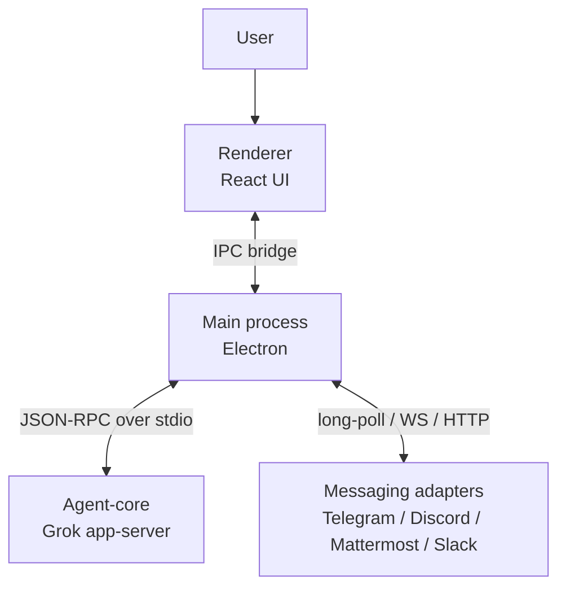
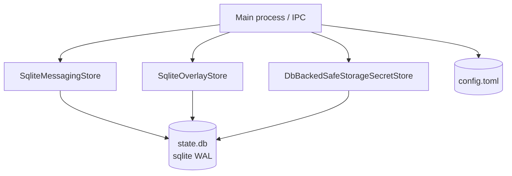
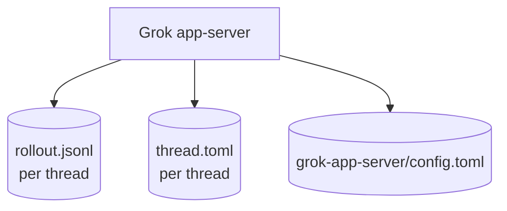
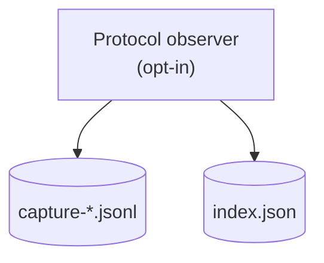
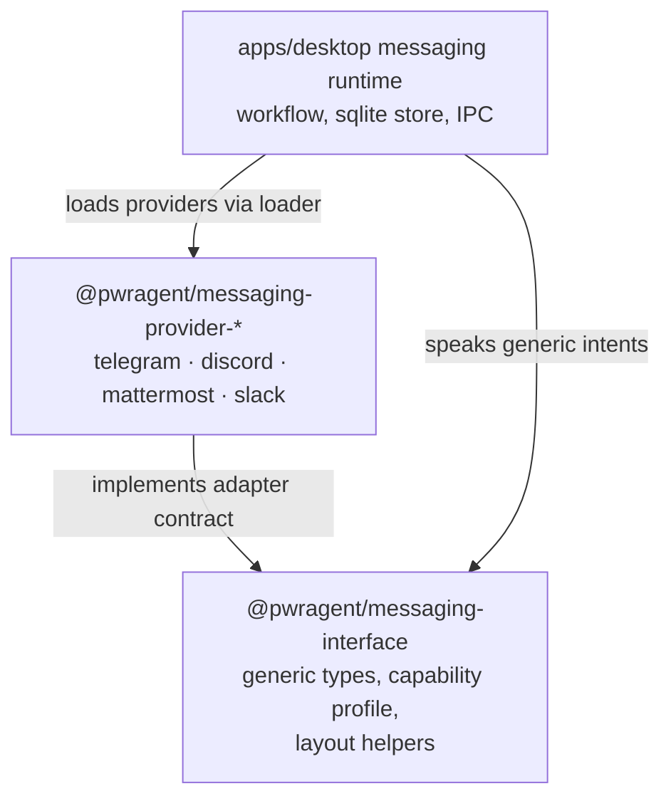
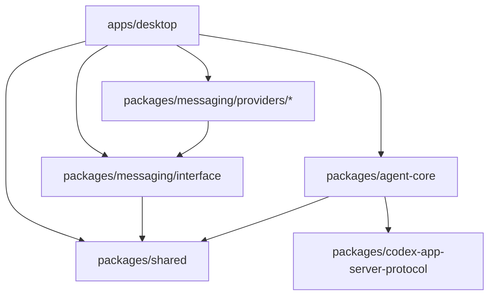

# Architecture

This document is the engineer's first pass through PwrAgent. It covers the
process model, where data lives, how messaging is layered, and the
dependency rules that keep the codebase navigable. For the user-facing
pitch, see [README.md](README.md). For day-to-day development setup, see
[CONTRIBUTING.md](CONTRIBUTING.md).

## Process model

PwrAgent is an Electron app with one auxiliary process: the coding-agent
server. The renderer (React UI) talks to the main process over the
standard Electron IPC bridge; the main process talks to the agent-core
server over JSON-RPC on stdio.

A few invariants worth knowing up front:

- The renderer never speaks to the agent-core server directly. All
  package access crosses the IPC bridge through the main process.
- The renderer may only import `@pwragent/shared` from the workspace.
  Everything else is gated behind IPC.
- One messaging adapter, one controller, one capability profile. See
  [Messaging layer](#messaging-layer) below.

## Storage layers

Persistent state is split across three categories. Each has its own
location, its own format, and its own concurrency story. The diagrams
below are layered separately so you can read each layer on its own.

### Desktop state (sqlite WAL)

The desktop main process owns a single sqlite database holding messaging
bindings, the thread overlay (per-thread UI state), and
`safeStorage`-encrypted secret blobs. Multiple PwrAgent instances may share
the same profile DB safely thanks to sqlite WAL mode.

Secrets — bot tokens, API keys — are never written to TOML and are never
stored as plaintext in sqlite. PwrAgent encrypts them with Electron
[`safeStorage`](https://www.electronjs.org/docs/latest/api/safe-storage)
and persists only the ciphertext blob. On macOS, Electron backs
`safeStorage` with Keychain Access for the encryption keys, so decrypting
the blob requires the same OS/user/app Keychain context. The app refuses
to write secrets when Electron reports an unsafe or unavailable
`safeStorage` backend.

### Agent-core thread storage

Each thread the agent runs persists its own append-only log plus a
metadata file. This shape is shared with the Codex App Server protocol
PwrAgent implements.

`rollout.jsonl` is the source of truth for a thread's history. It is
append-only by design; replay reconstructs UI state by walking it
forward. `thread.toml` carries small per-thread metadata (model,
working directory, approval policy).

### Protocol captures (dev-only)

For replay tests and debugging, the desktop main process can record
every JSON-RPC frame crossing the agent-core boundary. Captures are
gated behind an environment variable and never run by default.

See [CONTRIBUTING.md](CONTRIBUTING.md) for the recording / export /
fixture-derivation workflow.

### Where things live on disk

| Layer | Path | Purpose |
|---|---|---|
| Desktop state | `~/.pwragent/profiles/<name>/state/state.db` | Messaging bindings, thread overlay, encrypted secret blobs |
| Desktop config | `~/.pwragent/profiles/<name>/config.toml` | Desktop settings (messaging, models, worktrees) |
| Agent-core threads | `<state_root>/threads/<id>/rollout.jsonl` | Append-only message + replay-item log per thread |
| Agent-core metadata | `<state_root>/threads/<id>/thread.toml` | Per-thread config (model, cwd, approval policy) |
| Protocol captures | `~/.pwragent/profiles/<name>/state/protocol-captures/` | Dev-only JSON-RPC session recordings |

Override the PwrAgent root with `PWRAGENT_HOME=/path/to/root` (useful for
isolated E2E or dev-profile use). Select a named profile with
`PWRAGENT_PROFILE=<name>`. See [docs/state-layout.md](docs/state-layout.md)
for the full directory layout, environment-variable list, and migration
details.

## Messaging layer

PwrAgent's messaging system is provider-agnostic: producers of outbound
content (status cards, approval prompts, resume browsers) never branch on
platform names. Each provider declares a *capability profile* describing
what it can render; the workflow layer adapts content to fit. A new
platform is a new adapter, not a tree of `if (platform === "telegram")`
branches.

Three layers, three jobs:

- **Generic contract** (`@pwragent/messaging-interface`). Channel-neutral
  types, the capability-profile shape, and layout helpers. No provider
  names. No platform SDK imports.
- **Provider adapters** (`packages/messaging/providers/*`). Each adapter
  is its own package. It translates platform events into generic inbound
  events and renders generic intents into platform-native messages. It
  cannot import other providers, the desktop app, or the agent-core
  package.
- **Workflow orchestration** (`apps/desktop/src/main/messaging/`). Turn
  admission, binding lifecycle, picker state machines, audit trails,
  sqlite persistence. Speaks only the generic interface.

The dependency direction is one-way: `interface → shared`,
`providers → interface`, `desktop → interface (+ providers via the loader)`.

For the full layered story — data flow, callback delivery models, the
capability-profile system, and the canonical command catalog — see
[docs/messaging-architecture.md](docs/messaging-architecture.md). For the
adapter contract every provider must satisfy, see
[docs/messaging-adapter-contract.md](docs/messaging-adapter-contract.md).
For a hands-on walkthrough when adding a new platform, see
[docs/messaging-adding-a-provider.md](docs/messaging-adding-a-provider.md).

## Dependency boundaries

PwrAgent enforces a strict layered dependency architecture via
[`dependency-cruiser`](.dependency-cruiser.cjs). The hierarchy reads
bottom to top — leaves at the bottom import nothing else internal; the
desktop app at the top can reach anywhere.

The rules in [`.dependency-cruiser.cjs`](.dependency-cruiser.cjs) are
load-bearing and not negotiable. If a rule blocks a change, the change
is architecturally wrong — redesign it rather than loosen the rule. See
the "Dependency Boundary Enforcement" section of
[CLAUDE.md](CLAUDE.md) for the full policy.

Additional renderer constraint: code under
`apps/desktop/src/renderer/` may only import `@pwragent/shared`. All
other package access crosses the IPC bridge through the main process.

Run `pnpm lint:boundaries` locally before pushing; CI fails the build on
any violation.

## Workspace map

| Path | What's there |
|---|---|
| `apps/desktop` | Electron app — main process, renderer, IPC bridge |
| `packages/shared` | Cross-package types: app-server enums, navigation snapshots, thread identifiers |
| `packages/agent-core` | Agent runtime, Codex App Server protocol implementation, Grok-backed coding agent |
| `packages/codex-app-server-protocol` | Protocol types shared with Codex App Server consumers |
| `packages/messaging/interface` | Generic messaging types, capability profile, layout helpers |
| `packages/messaging/providers/telegram` | Telegram adapter (`grammy`) |
| `packages/messaging/providers/discord` | Discord adapter (`discord.js`) |
| `packages/messaging/providers/mattermost` | Mattermost adapter (`@mattermost/client` + HTTP callback listener) |
| `packages/messaging/providers/slack` | Slack adapter (`@slack/web-api` + Socket Mode) |

Workspace packages remain marked `private: true` for publishing control,
but the source in this repository is MIT-licensed.

## UI direction

For renderer UI work, follow the desktop style guide and UI theme
documents before inventing local styling:

- [docs/UI-THEME.md](docs/UI-THEME.md) — tokens and visual language.
- [docs/design/desktop-style-guide.md](docs/design/desktop-style-guide.md)
  — desktop UI direction.
- [docs/design/pwragent-v2/SOURCE.md](docs/design/pwragent-v2/SOURCE.md)
  — provenance and the "reference, not copy verbatim" policy for the
  PwrAgent v2 design source bundle.

## Releasing

The Mac release pipeline (signing, notarization, distribution,
auto-update) is documented in:

- [docs/desktop-release-runbook.md](docs/desktop-release-runbook.md) —
  how to cut a release.
- [docs/desktop-distribution-phase-2-runbook.md](docs/desktop-distribution-phase-2-runbook.md)
  — Phase 1 → Phase 2 distribution channel migration.

PwrAgent is MIT-licensed, owned by PwrDrvr LLC. The repo-root `LICENSE`,
package `license: "MIT"` declarations, and third-party license
aggregation are load-bearing release metadata; see
[docs/third-party-license-notices.md](docs/third-party-license-notices.md)
for the Electron/Chromium runtime notice policy.

## Cross-references

- [README.md](README.md) — user-facing pitch and quick start
- [CONTRIBUTING.md](CONTRIBUTING.md) — development workflow, testing,
  diagnostics, and internal agent-core notes
- [CLAUDE.md](CLAUDE.md) — repository conventions and the full
  dependency-boundary policy
- [docs/messaging-architecture.md](docs/messaging-architecture.md)
- [docs/messaging-adapter-contract.md](docs/messaging-adapter-contract.md)
- [docs/messaging-adding-a-provider.md](docs/messaging-adding-a-provider.md)
- [docs/messaging-platform-integration.md](docs/messaging-platform-integration.md)
- [docs/state-layout.md](docs/state-layout.md)
- [docs/config-file-evolution.md](docs/config-file-evolution.md)
