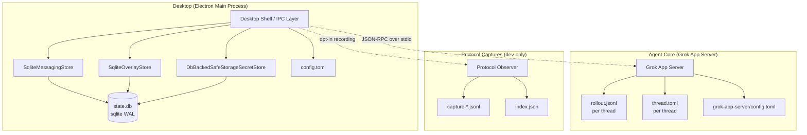

# PwrAgent

> **Closed-source preview.** Copyright © 2026 PwrDrvr LLC. All rights reserved.
> See [LICENSE](LICENSE).

PwrAgent is a thread-centric coding agent desktop app. This repository contains
the proprietary source code for PwrDrvr LLC's PwrAgent product. It is not open
source. Distribution of source, binaries, or derivative works requires prior
written consent from PwrDrvr LLC.

## Data Storage Architecture

| Layer | Storage | Purpose |
|-------|---------|---------|
| Desktop state | `~/.pwragent/profiles/<name>/state/state.db` | Messaging bindings, thread overlay, `safeStorage`-encrypted secret blobs, launchpad settings |
| Desktop config | `~/.pwragent/profiles/<name>/config.toml` | Desktop settings (messaging, models, worktrees) |
| Agent-Core threads | `<state_root>/threads/<id>/rollout.jsonl` | Append-only message + replay-item log per thread |
| Agent-Core metadata | `<state_root>/threads/<id>/thread.toml` | Thread config (model, cwd, approval policy) |
| Protocol captures | `~/.pwragent/profiles/<name>/state/protocol-captures/` | Dev-only JSON-RPC session recordings |

Desktop secrets such as bot tokens and API keys are not written to TOML and are
not stored as plaintext in sqlite. PwrAgent encrypts them with Electron
[`safeStorage`](https://www.electronjs.org/docs/latest/api/safe-storage) and
stores only the resulting ciphertext blob in the active profile's `state.db`.
On macOS, Electron backs `safeStorage` with Keychain Access for the app's
encryption keys, so decrypting the sqlite blob requires the same OS/user/app
Keychain context. The app refuses to write secrets when Electron reports an
unsafe or unavailable `safeStorage` backend.

See [docs/state-layout.md](docs/state-layout.md) for full directory layout, environment variables, and migration details.

## Internal Development

### Setup

1. `pnpm install`
2. `pnpm dev`

### Workspace

- `apps/desktop` — Electron app shell
- `packages/shared` — internal contracts and types
- `packages/agent-core` — internal agent runtime and domain services
- `packages/messaging/*` — internal messaging adapters

These packages are internal to PwrDrvr LLC and not intended for external
consumption. Workspace `package.json` files are marked `private: true` and
licensed `UNLICENSED`.

### Messaging Integrations

Telegram, Discord, and Mattermost adapters can be enabled from the desktop
main process with PwrAgent-prefixed environment variables and allowlisted
platform user IDs.

- [docs/messaging-architecture.md](docs/messaging-architecture.md) —
  layered architecture, data-flow diagrams, the capability-profile system that
  lets producers adapt content per-platform without channel branching, and
  the inline-stream vs out-of-band HTTP callback delivery models.
- [docs/messaging-adding-a-provider.md](docs/messaging-adding-a-provider.md) —
  hands-on, step-by-step walkthrough for building a new platform adapter
  (Slack, Signal, Feishu/Lark, Matrix, etc.).
- [docs/messaging-platform-integration.md](docs/messaging-platform-integration.md)
  — operator setup, command surface, security notes, smoke validation,
  Cloudflare-Tunnel / Tailscale-Funnel deployment guidance for HTTP-callback
  providers like Mattermost.
- [docs/messaging-adapter-contract.md](docs/messaging-adapter-contract.md) —
  formal contract every platform adapter must satisfy.
- [packages/messaging/AGENTS.md](packages/messaging/AGENTS.md) — package
  boundary rules and `pnpm lint:boundaries` enforcement.

### Testing

- `pnpm test`
- `pnpm typecheck`
- `pnpm test:desktop-e2e`

Desktop replay-backed Electron coverage lives under `apps/desktop/e2e`.

To record real Codex App Server traffic from the desktop client boundary, launch
the desktop app with `PWRAGNT_PROTOCOL_CAPTURE=true`. Captures are written under
the active profile's state directory at `protocol-captures/` by default
(`~/.pwragent/profiles/default/state/protocol-captures/`). Override that root with
`PWRAGNT_PROTOCOL_CAPTURE_ROOT=/absolute/path` when you want a stable local
export location.

Replay fixtures live in `apps/desktop/e2e/fixtures/*/replay.fixture.json`. The
current harness runs the built Electron app in replay mode by pointing
`PWRAGNT_REPLAY_FIXTURE_PATH` at one of those fixture files. The checked-in
suite uses curated replay fixtures for deterministic UI regressions, while raw
captures stay local evidence until they are promoted into a sanitized fixture.
Computer Use-driven seeding recipes live next to the fixtures under
`apps/desktop/e2e/fixtures/*/capture-recipe.md`, with shared workflow guidance
in `apps/desktop/e2e/fixtures/README.md`.

The current seeded desktop replay scenarios cover shell load, edited-change
ordering, pending approval UI, and turn lifecycle cleanup.

Typical workflow:

1. Record a session:
   `PWRAGNT_PROTOCOL_CAPTURE=true PWRAGNT_PROTOCOL_CAPTURE_ROOT=/absolute/path pnpm dev`
2. Export the recorded raw capture for a backend-qualified thread id:
   `pnpm --filter @pwragent/desktop export:session-capture -- --capture-root /absolute/path --session codex:thread-123 --output /tmp/thread-123.raw.capture.jsonl`
3. Derive a curated fixture directory from a scenario window:
   `pnpm --filter @pwragent/desktop derive:replay-fixture -- --input /tmp/thread-123.raw.capture.jsonl --output-dir apps/desktop/e2e/fixtures/example-scenario --scenario example-scenario --start 20 --end 80`
4. Run the desktop Electron regressions:
   `pnpm test:desktop-e2e`

## Releasing

Mac release pipeline (signing, notarization, distribution) is documented in:

- [docs/desktop-release-runbook.md](docs/desktop-release-runbook.md)
  — how to cut a release.
- [docs/desktop-distribution-phase-2-runbook.md](docs/desktop-distribution-phase-2-runbook.md)
  — Phase 1 → Phase 2 distribution channel migration.

Release plan and brainstorm context:

- [docs/plans/2026-05-02-004-feat-desktop-release-packaging-plan.md](docs/plans/2026-05-02-004-feat-desktop-release-packaging-plan.md)
- [docs/brainstorms/2026-05-02-desktop-release-packaging-requirements.md](docs/brainstorms/2026-05-02-desktop-release-packaging-requirements.md)

## Developer Diagnostics

These sections cover internal development diagnostics; they are not user-facing
features and are gated behind environment variables.

### Heap Diagnostics

Desktop heap diagnostics are opt-in and write artifacts under repo-local `.local/`.

Enable a capture run with:

- `PWRAGNT_HEAP_DIAGNOSTICS=1 pnpm dev`

Optional tuning:

- `PWRAGNT_HEAP_DIAGNOSTICS_ROOT` - override the repo root used for `.local/`
- `PWRAGNT_HEAP_DIAGNOSTICS_SETTLE_MS` - delay before the baseline sample (`0` captures immediately after `did-finish-load`)
- `PWRAGNT_HEAP_DIAGNOSTICS_INTERVAL_MS` - recurring sample interval
- `PWRAGNT_HEAP_DIAGNOSTICS_DELTA_BYTES` - adjacent-sample growth threshold for snapshots
- `PWRAGNT_HEAP_DIAGNOSTICS_COOLDOWN_MS` - minimum time between snapshots
- `PWRAGNT_HEAP_DIAGNOSTICS_MAX_SNAPSHOTS` - per-session snapshot cap

Each enabled run creates one directory shaped like:

- `.local/heap-YYYY-MM-DD-HHmm-abc123/`

Expected artifacts:

- `session.json`
- `samples.ndjson`
- `events.ndjson`
- `heap-0001.heapsnapshot`, `heap-0002.heapsnapshot`, ...
- `main-heap-0001.heapsnapshot`, `main-heap-0002.heapsnapshot`, ...

Each sample and event record is tagged with `source: "renderer"` or `source: "main"`.

During a repro run the desktop main process logs the session directory path. Share that path for later diagnosis.

### Startup CPU Profiling

Desktop startup CPU profiling is opt-in and writes artifacts under repo-local `.local/`.

Enable one startup capture run with:

- `PWRAGNT_STARTUP_CPU_PROFILING=1 pnpm dev`

Optional tuning:

- `PWRAGNT_STARTUP_CPU_PROFILE_ROOT` - override the repo root used for `.local/`
- `PWRAGNT_STARTUP_CPU_PROFILE_POST_LOAD_MS` - extra renderer capture time after `did-finish-load`
- `PWRAGNT_STARTUP_CPU_PROFILE_HARD_TIMEOUT_MS` - hard stop for the entire startup capture window

Each enabled run creates one directory shaped like:

- `.local/startup-cpu-YYYY-MM-DD-HHmm-abc123/`

Expected artifacts:

- `session.json`
- `events.ndjson`
- `main.cpuprofile`
- `renderer.cpuprofile`
- `analysis.json`
- `summary.md`

The desktop main process logs the created session directory path during startup. Re-run the analyzer for an existing session with:

- `pnpm --filter @pwragent/desktop analyze:startup-cpu-profile -- --session-dir .local/startup-cpu-2026-04-19-0930-abc123`

`summary.md` gives the quick ranked view of the hottest startup functions and source buckets. Open the raw `.cpuprofile` files in DevTools when the generated summary shows Electron or Chromium-heavy frames that need deeper inspection.

## Internal Agent-Core Notes

`packages/agent-core` includes the Grok-backed Codex app-server contract,
consumer-sequence compatibility tests, and provider coverage for the OpenClaw-used
subset.

Supported app-server methods today:

- `initialize`
- `thread/list`, `thread/loaded/list`
- `thread/start`, `thread/new`, `thread/resume`, `thread/name/set`, `thread/read`, `thread/compact/start`
- `model/list`, `skills/list`, `experimentalFeature/list`, `mcpServerStatus/list`
- `account/rateLimits/read`, `account/read`
- `review/start`
- `turn/start`, `turn/steer`, `turn/interrupt`

Known shape-first endpoints:

- `skills/list` returns stable empty skill collections per cwd
- `experimentalFeature/list` returns the Grok Responses feature descriptor
- `mcpServerStatus/list` returns an empty collection until an MCP runtime exists
- `account/rateLimits/read` returns an empty collection until rate-limit reporting is wired
- `account/read` returns local development account metadata rather than a full auth-backed profile

When you are ready to run live xAI-backed smoke coverage, set credentials in
either your shell environment or the Grok app-server user config at
`~/.config/grok-app-server/config.toml`.

The runtime config keys are:

- `xai_api_key`
- `grok_model`
- `xai_base_url`
- `state_root`

Project-local env and already-exported shell env still win over the user
config. The runtime loader also preserves legacy fallback support under
`~/.config/grok-app-server` for:

- `config.env`
- `.env.local`
- `.env`

CI uses the existing `live-agent-core` workflow job with the `XAI_API_KEY`
repository secret. No separate tool-test secret is required.

Live smoke coverage:

- `pnpm --filter @pwragent/agent-core test:live`
- Covers live thread continuation via `thread/resume`
- Covers live context compaction via `thread/compact/start`
- Covers live repository-tool usage against a temporary workspace
