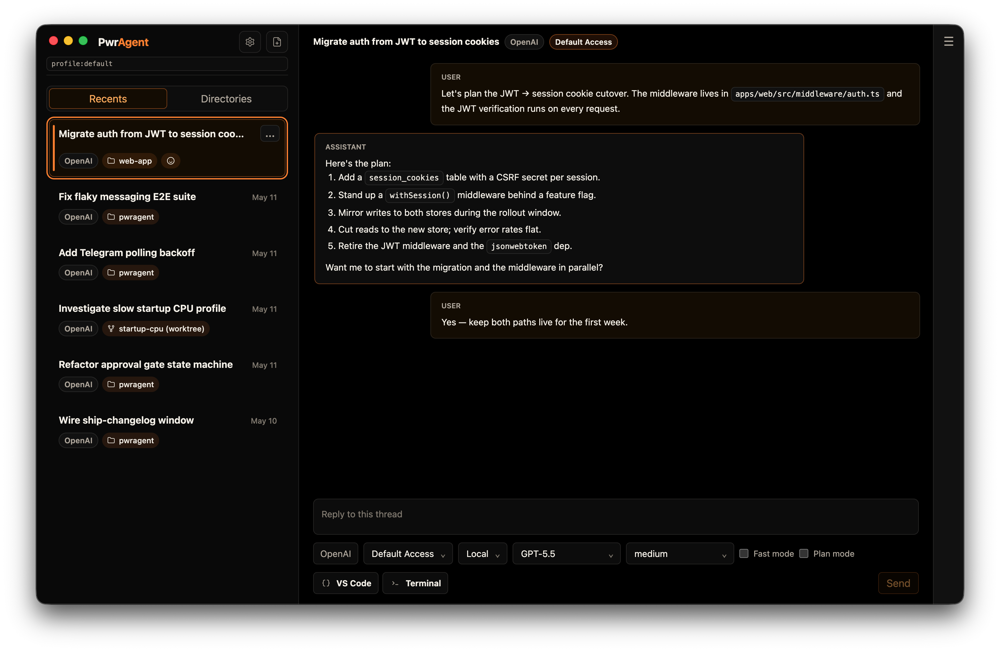
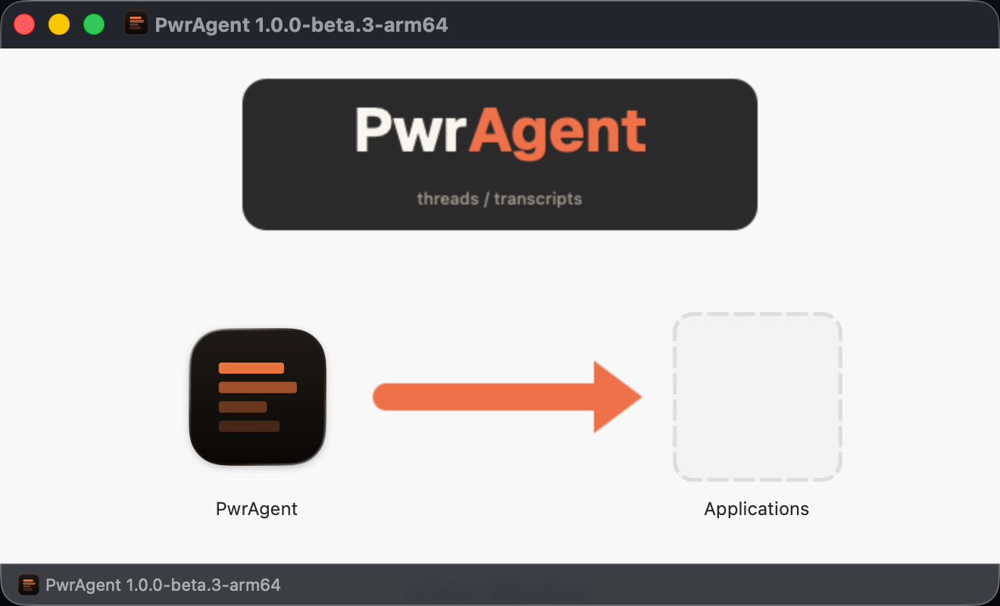

# PwrAgent

**Run a coding agent. Drive it from your messenger.**

PwrAgent lets you start a thread on your laptop, refine the requirements
with it from Slack, approve a Default Access command request from
Telegram, and pick the thread back up on the desktop when you return to
your desk.
One conversation, one approval surface, one agent — wherever you happen
to be.

> **Status: beta — macOS only today.** Steady cadence, non-destructive
> between releases.


<!-- screenshot: screenshot-recents-hero.png — Recents lens populated with several threads, at least one carrying a messenger badge. 1440×900, macOS, light theme. -->

## Why PwrAgent

- **Built for Codex coders.** Full Codex threads on the go — start them
  from your messenger or your desktop and pick up wherever.
- **No-lock-in Codex integration.** Powered by the Codex App Server
  protocol, so your thread list is the same one Codex sees and there's
  no separate login. Try it for a day, use it for a month — switch back
  to the official Codex client whenever.
- **Per-thread cost and risk controls.** Set Fast mode, model,
  reasoning effort, and permissions mode independently on every
  thread — not globally. Run an experiment on a cheap model with
  default access while a refactor uses a stronger model with full
  access; the settings stay scoped to their thread. Codex Desktop only
  exposes these as global settings, which makes mixing high-stakes and
  low-stakes work in the same session painful.
- **Safe upgrades and downgrades.** Config and state migrate forward
  without breaking older installs. Run two versions side-by-side or
  downgrade after an update without losing settings or threads. See
  [docs/config-file-evolution.md](docs/config-file-evolution.md).
- **Secrets encrypted at rest.** Bot tokens and API keys are encrypted
  with Electron `safeStorage`, backed by macOS Keychain Access. PwrAgent
  refuses to write secrets if the platform reports an unsafe backend.
- **Messaging observability.** See which threads are being driven from
  your messenger and whether your bot is connected, rate-limited, or
  dropping callbacks — all from one card.
- **Pair in minutes.** Paste a bot token, allowlist your platform user
  ID, hit the in-app connection test. No cloud relay, no third-party
  service in the middle.
- **Find threads how you remember them.** Search and filter by branch
  name, PR, emoji marker, or messaging binding — pick whichever you
  actually recall.
- **Markdown composer that gets out of your way.** Triple backticks +
  space opens a code block, `>` + space opens a blockquote, and the
  usual inline formatting (bold, italic, inline code, links) works as
  you type. Codex Desktop doesn't have a markdown composer yet.

## Take a look

| | |
|---|---|
|  <br/>*Bound thread — desktop and messenger stay in sync* |  <br/>*Messenger status at a glance* |
|  <br/>*Paste-token pairing with in-app connection test* |  <br/>*Closed by default — only allowlisted users can reach the bot* |

Screenshots are produced by an inspect-style Playwright spec that drives
known UI surfaces. To regenerate them, see
[`apps/desktop/AGENTS.md`](apps/desktop/AGENTS.md) → "Capturing README
Screenshots."

## Quick Start

### macOS

1. Grab the latest signed build from the
   [GitHub Releases page](https://github.com/pwrdrvr/PwrAgent/releases).
2. Open the DMG and drag PwrAgent into Applications.

   

3. Launch PwrAgent from Applications. Config and state live under
   `~/.pwragent/`.
4. (Optional) Pair a messenger from **Settings → Messaging**. You'll need
   a bot token from Telegram, Discord, or Mattermost and your own
   platform user ID for the allowlist.

### From source

```bash
git clone https://github.com/pwrdrvr/PwrAgent.git
cd PwrAgent
pnpm install
pnpm dev
```

Configure your coding-agent credentials either in your shell environment
or in `~/.config/grok-app-server/config.toml`. See
[CONTRIBUTING.md](CONTRIBUTING.md) for the development workflow.

## Is this safe for work?

**Research and comply with your company's policies and procedures
before installing PwrAgent on a work machine or connecting it to a
work messaging platform.** That responsibility is yours, not the
project's.

The broader picture is moving fast. Jensen Huang said at the 2026
NVIDIA convention that *"every company needs an OpenClaw strategy,"*
and large employers — Microsoft among the names making news on this —
are actively investigating how to incorporate OpenClaw-like tools into
their workflows. That signal is real. It does **not** mean that
PwrAgent specifically is approved at your company, or that the risks
are zero. It means the category is worth a conversation with the right
people inside your org.

A sensible path:

- **Start on a personal project on a personally owned machine.** Run
  it locally without messaging enabled, or pair it to a personal
  Telegram or Discord bot. Get a feel for what the agent does and what
  data it touches.
- **Confirm policy before installing on a work machine.** Some
  employers disallow third-party developer tools by default; some
  allow them only after a security review.
- **If you bind PwrAgent to a messaging platform at work, use only
  your employer's approved platform** (often Slack or Mattermost) and
  walk the integration through your security team first. What ends up
  in your messenger from the agent matters as much as the agent
  itself.
- **Don't mix work and personal.** Don't connect a work installation
  to a personal Telegram bot, and don't point a work Slack workspace
  at a personal experimentation install.

**Messaging is closed by default — and stays that way.** Only platform
user IDs you've explicitly allowlisted can DM the bot. Inside shared
spaces — Slack workspaces, Discord servers, Telegram supergroups —
authorization is two-keyed: the space has to be on the allowlist *and*
the user has to be on the allowlist. Inviting the bot into a workspace,
server, or supergroup doesn't authorize anyone in it; the space still
has to be added to the allowlist separately. And being in an authorized
space doesn't authorize a user — they still have to be on the user
allowlist. Unauthorized attempts are denied and surfaced in PwrAgent's
messaging activity log, so you can see who tried and from where. Adding
a new authorized user or space is a deliberate, opt-in change made from
the desktop — never a side effect of someone discovering the bot.

PwrAgent's design tries to make the rest of these decisions
inspectable: secrets are encrypted at rest, and the entire state
surface lives at `~/.pwragent/` (documented in
[docs/state-layout.md](docs/state-layout.md)). The agent's permissions
mode is set per thread (Default Access or Full Access — see the
in-app description before changing it), and the bound messenger
mirrors whatever the agent does. What the project can't do is tell
you whether the policies at your employer permit any of this. That's
still your call to make.

## Roadmap

- macOS-first today. Linux and Windows are not yet supported.
- The desktop release pipeline (signing, notarization, auto-update) is
  documented in
  [docs/desktop-release-runbook.md](docs/desktop-release-runbook.md).
- A versioned online docs site is planned; until then, this repository
  is the source of truth.

## Background

PwrAgent grew out of
[openclaw-codex-app-server](https://github.com/pwrdrvr/openclaw-codex-app-server),
a project that aimed to be the best Codex integration-for-coding into Telegram and Discord.
PwrAgent supersedes it: a desktop-first, thread-centric coding-agent
shell with first-class messenger integration, and a generic messaging
protocol that lets a single workflow layer drive Telegram, Discord,
Mattermost, Slack, and LINE from the same code path. That protocol is now
stable across 5 messaging providers and is now a candidate submit to OpenClaw.

## Going deeper

- [ARCHITECTURE.md](ARCHITECTURE.md) — process model, storage layers,
  messaging layer summary, dependency boundaries, workspace map.
- [CONTRIBUTING.md](CONTRIBUTING.md) — development workflow, testing,
  replay fixtures, diagnostics, internal agent-core notes.
- [SECURITY.md](SECURITY.md) — how to report vulnerabilities.
- [docs/messaging-architecture.md](docs/messaging-architecture.md) —
  layered messaging architecture, capability profiles, callback delivery
  models.
- [docs/messaging-platform-integration.md](docs/messaging-platform-integration.md)
  — operator setup, command surface, Cloudflare-Tunnel / Tailscale-Funnel
  guidance for HTTP-callback providers.
- [docs/state-layout.md](docs/state-layout.md) — on-disk state layout,
  environment variables, profiles.

## License

PwrAgent is licensed under the [MIT License](LICENSE). Third-party
dependency notices are aggregated in
[THIRD_PARTY_LICENSES](THIRD_PARTY_LICENSES) and shipped with desktop
distributions. See
[docs/third-party-license-notices.md](docs/third-party-license-notices.md)
for the Electron/Chromium runtime notice policy.
