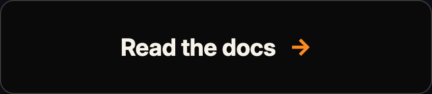
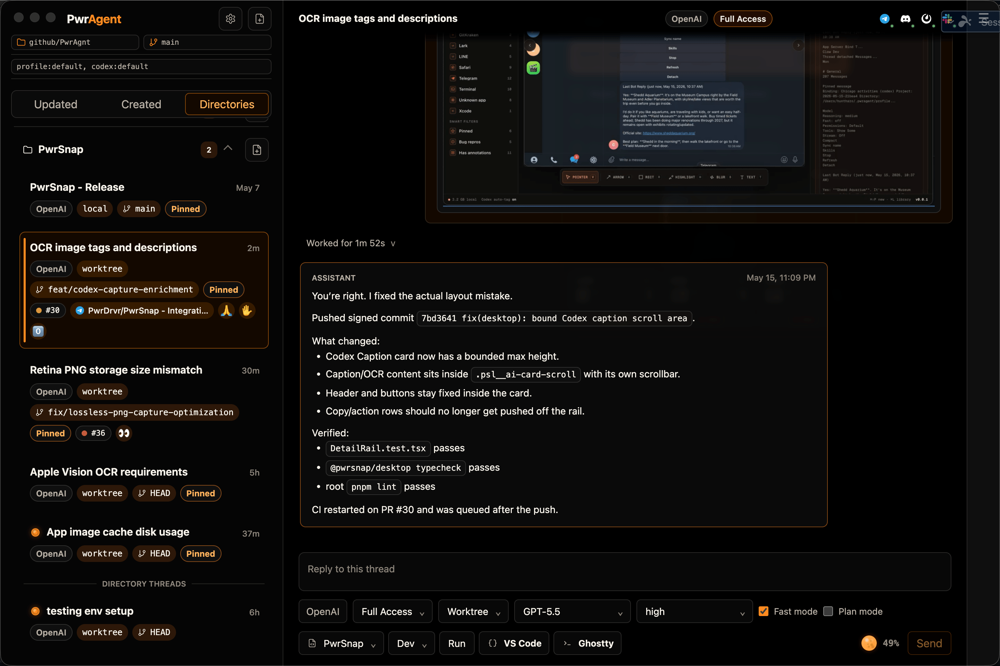
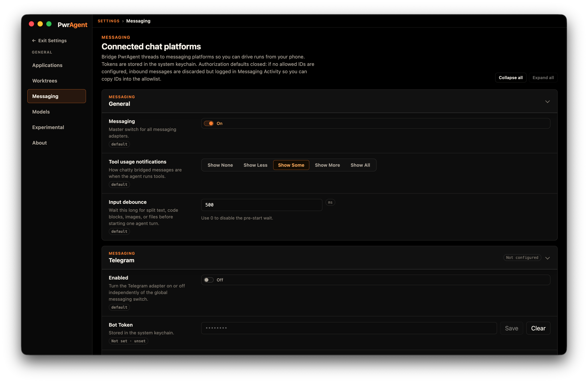
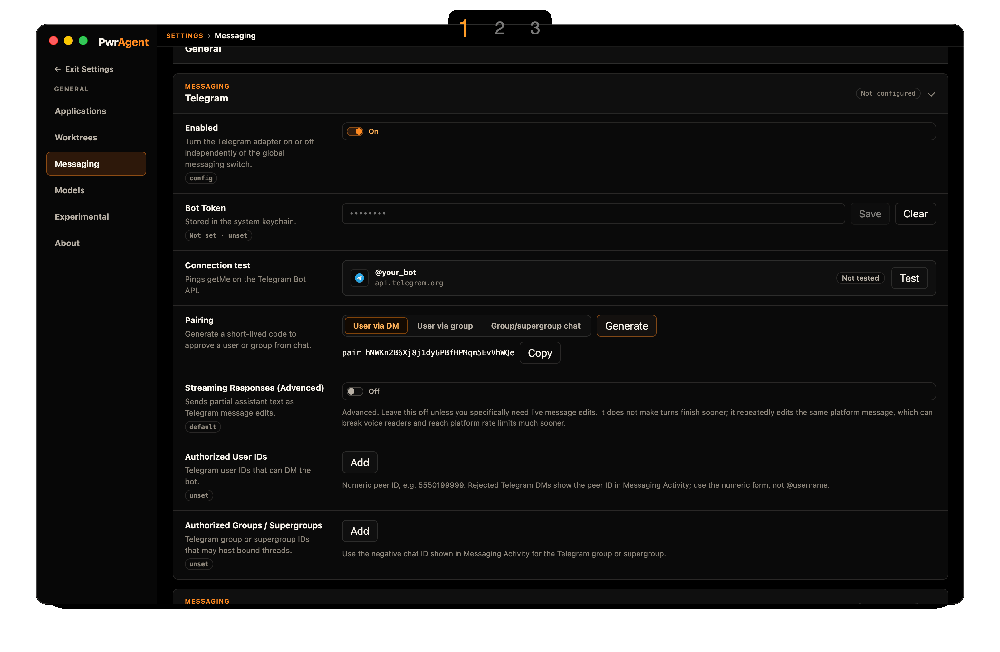
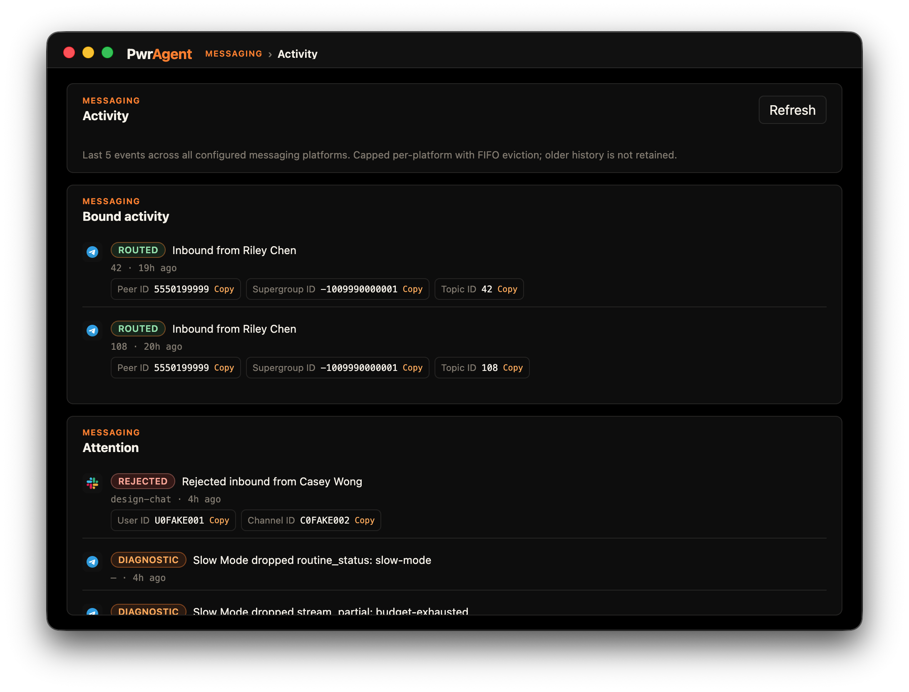

# PwrAgent

**Your coding agent runs on your laptop. You drive it from your phone.**

An open-source desktop coding agent. Pair it once with Telegram, Discord, Slack, Mattermost, Feishu / Lark, or LINE — then start, resume, steer, and approve from wherever you happen to be reading.

<p>
  <a href="https://github.com/pwrdrvr/PwrAgent/releases/latest/download/PwrAgent.dmg">
    
  </a>
  &nbsp;
  <a href="https://docs.pwragent.ai">
    
  </a>
</p>



## Why you might want it

- **Code keeps moving when you're away from the keyboard.** Approvals, follow-up prompts, "what did you ship while I was at lunch" check-ins — all from your phone. Cellular or hotel WiFi is fine; the agent is on your laptop, the messenger is just the steering wheel.
- **Stack three asks and walk away.** `make a branch and PR for the OAuth refactor` → queue `/review main` → queue `squash and force-push`. The composer dispatches FIFO, one turn at a time. Come back: three things done.
- **Isolated profiles for work and life.** As many PwrAgent windows as you want, each on its own profile, each bound to its own Codex identity. Auth and messaging credentials never cross.
- **Works alongside Codex Desktop.** Shares thread state by default; start a thread in either, finish in the other. PwrAgent adds per-thread controls, worktree isolation with handoff, the Markdown composer, and the messaging surface — things Codex Desktop doesn't have today.
- **No cloud, no account, no telemetry.** Everything runs on your machine. Bot tokens encrypted in the macOS Keychain. Closed-by-default messaging with two-keyed allowlists (see [Is this safe for work?](#is-this-safe-for-work)).
- **Free, MIT, dogfooded.** The author uses PwrAgent as their primary coding environment. Hundreds of PRs in this repository and others were created or reviewed through it.

The longer-form pitch lives at **[pwragent.ai](https://pwragent.ai)**; the operator-facing setup walkthroughs live at **[docs.pwragent.ai](https://docs.pwragent.ai)**.

## Take a look

| | |
|---|---|
|  <br/>*Bound thread — desktop and messenger stay in sync* |  <br/>*Messenger status at a glance* |
|  <br/>*Paste-token pairing with in-app connection test* |  <br/>*Closed by default — only allowlisted users can reach the bot* |

Screenshots are produced by a Playwright spec that drives the real UI surfaces against deterministic replay fixtures, then shells out to a Swift script for native window capture (stoplights + drop-shadow + retina). See [`apps/desktop/AGENTS.md`](apps/desktop/AGENTS.md) → "Capturing README Screenshots" for regen.

## Get it

### Just want to use it

1. **Download** [PwrAgent.dmg](https://github.com/pwrdrvr/PwrAgent/releases/latest/download/PwrAgent.dmg). Universal binary — runs natively on Apple Silicon (M1+) and Intel Macs. Developer ID-signed and Apple-notarized, so first launch is a single Gatekeeper prompt (no right-click-open dance).
2. **Install** by opening the DMG and dragging PwrAgent into Applications.
3. **(Optional) Pair a messenger** from **Settings → Messaging → \<your platform\>**. End-to-end walkthroughs at **[docs.pwragent.ai/providers/](https://docs.pwragent.ai/providers/)**; the usage guide (bound threads, slash commands, queue/steer, monitor cards, detach) lives at **[docs.pwragent.ai/using-codex/](https://docs.pwragent.ai/using-codex/)**.

Config + state live under `~/.pwragent/profiles/<name>/` ([on-disk layout](docs/state-layout.md)). Multiple profiles via `--profile <name>` at launch.

### Want to hack on it

```bash
git clone https://github.com/pwrdrvr/PwrAgent.git
cd PwrAgent
pnpm install
pnpm dev:no-messaging   # full UI, no live messaging adapters
# or
pnpm dev                # full UI + live messaging
```

Codex App Server credentials live in `~/.config/grok-app-server/config.toml` or the equivalent env vars. Full dev workflow, test strategy, replay fixtures, and diagnostics in **[CONTRIBUTING.md](CONTRIBUTING.md)**.

## How it's built

| Layer | Stack | Where it lives |
|---|---|---|
| Desktop shell | Electron + TypeScript + React + TipTap composer | `apps/desktop/` |
| Codex protocol | Codex App Server protocol contracts | `packages/codex-app-server-protocol/` |
| Agent core | Provider-agnostic coding-agent runtime (currently Grok / xAI) | `packages/agent-core/` |
| Messaging interface | Capability-profile contract; one shape, six providers | `packages/messaging/interface/` |
| Messaging providers | Telegram, Discord, Slack, Mattermost, Feishu / Lark, LINE | `packages/messaging/providers/*/` |
| Shared types | Cross-package contracts and helpers | `packages/shared/` |
| Local persistence | sqlite WAL via `better-sqlite3`, forward-compatible config TOML | `apps/desktop/src/main/state/`, `packages/agent-core/src/persistence/` |

The dependency graph is **strictly layered and enforced** by `dependency-cruiser`: leaves (`shared`, `codex-app-server-protocol`) → mid-tier (`messaging/*`, `agent-core`) → top (`apps/desktop`). The renderer can only import `@pwragent/shared`; everything else crosses the IPC bridge. CI fails any boundary violation — see [`.dependency-cruiser.cjs`](.dependency-cruiser.cjs).

Architecture deep-dive: **[ARCHITECTURE.md](ARCHITECTURE.md)**.

## Is this safe for work?

**Research and comply with your company's policies before installing PwrAgent on a work machine or connecting it to a work messaging platform.** That responsibility is yours, not the project's.

A sensible adoption path:

- **Start on a personal project on a personally owned machine.** Run it locally without messaging enabled, or pair to a personal Telegram / Discord bot. Get a feel for what the agent does and what data it touches.
- **Confirm policy before installing on a work machine.** Some employers disallow third-party developer tools by default; some allow them only after a security review.
- **If you bind PwrAgent to a messaging platform at work, use only your employer's approved platform** (usually Slack or Mattermost) and walk the integration through your security team first. What ends up in your messenger from the agent matters as much as the agent itself.
- **Don't mix work and personal.** Don't connect a work installation to a personal Telegram bot. Don't point a work Slack workspace at a personal experimentation install. Use [profiles](https://docs.pwragent.ai/desktop/#multiple-profiles) to keep them isolated.

**Messaging is closed by default — and stays that way.** Only platform user IDs you've explicitly allowlisted can DM the bot. Inside shared spaces (Slack workspaces, Discord servers, Telegram supergroups), authorization is **two-keyed**: the space has to be on the allowlist *and* the user has to be on the allowlist. Inviting the bot into a workspace doesn't authorize anyone in it; being in an authorized workspace doesn't authorize a user. Unauthorized attempts are denied and surfaced in PwrAgent's messaging activity log, so you can see who tried and from where. Adding a new authorized user or space is a deliberate, opt-in change made from the desktop — never a side effect of someone discovering the bot.

Secrets are encrypted at rest via Electron `safeStorage` (macOS Keychain backend). The entire state surface lives at `~/.pwragent/` ([documented layout](docs/state-layout.md)). The agent's permissions mode is set per thread (Default Access or Full Access — see the in-app description before changing it). What the project can't tell you is whether the policies at your employer permit any of this. That's still your call to make.

## Roadmap

macOS-first today. Linux and Windows aren't supported yet. The honest list of what's still missing (thread forking, restoring archived threads, time-based auto-archiving, branch auto-naming) and what's actively in flight lives at **[docs.pwragent.ai/desktop/#not-yet](https://docs.pwragent.ai/desktop/#not-yet)**.

The desktop release pipeline (signing, notarization, auto-update) is documented in [docs/desktop-release-runbook.md](docs/desktop-release-runbook.md).

## Background

PwrAgent grew out of [openclaw-codex-app-server](https://github.com/pwrdrvr/openclaw-codex-app-server), a project that aimed to be the best Codex-into-Telegram-and-Discord integration. PwrAgent supersedes it: a desktop-first, thread-centric coding-agent shell with first-class messenger integration, and a generic messaging protocol that lets one workflow layer drive six providers from the same code path. That protocol is stable today and is a candidate to submit upstream to OpenClaw.

## Going deeper

| Doc | What it covers |
|---|---|
| **[pwragent.ai](https://pwragent.ai)** | Marketing landing — the WHY in 60 seconds. |
| **[docs.pwragent.ai](https://docs.pwragent.ai)** | Operator reference — per-platform setup, the streaming-responses tradeoff, the webhook security note, settings reference. |
| [ARCHITECTURE.md](ARCHITECTURE.md) | Process model, storage layers, messaging layer summary, dependency boundaries, workspace map. |
| [CONTRIBUTING.md](CONTRIBUTING.md) | Development workflow, testing, replay fixtures, diagnostics. |
| [SECURITY.md](SECURITY.md) | How to report vulnerabilities. |
| [docs/messaging-architecture.md](docs/messaging-architecture.md) | Layered messaging architecture, capability profiles, callback delivery models. |
| [docs/messaging-adapter-contract.md](docs/messaging-adapter-contract.md) | Formal per-adapter contract for the messaging interface. |
| [docs/messaging-adding-a-provider.md](docs/messaging-adding-a-provider.md) | Hands-on walkthrough when adding a seventh provider. |
| [docs/state-layout.md](docs/state-layout.md) | On-disk state layout, environment variables, profiles. |
| [docs/config-file-evolution.md](docs/config-file-evolution.md) | Forward-compatible config migration rules. |

## License

PwrAgent is licensed under the [MIT License](LICENSE). Third-party dependency notices are aggregated in [THIRD_PARTY_LICENSES](THIRD_PARTY_LICENSES) and shipped with desktop distributions. See [docs/third-party-license-notices.md](docs/third-party-license-notices.md) for the Electron / Chromium runtime notice policy.

Created by [PwrDrvr LLC](https://pwrdrvr.com). Follow [@PwrAgentAI](https://x.com/PwrAgentAI) for releases.
