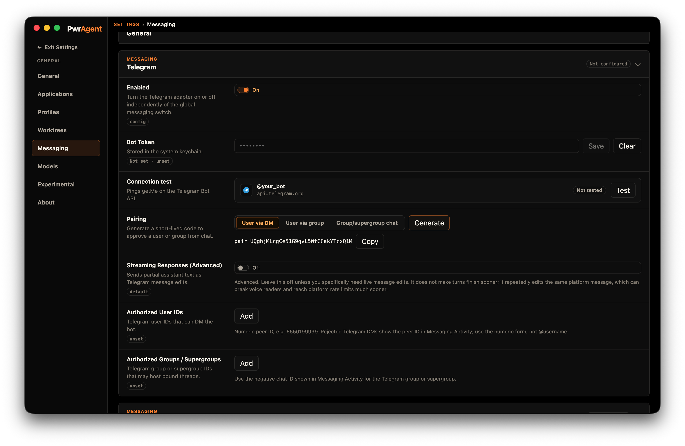
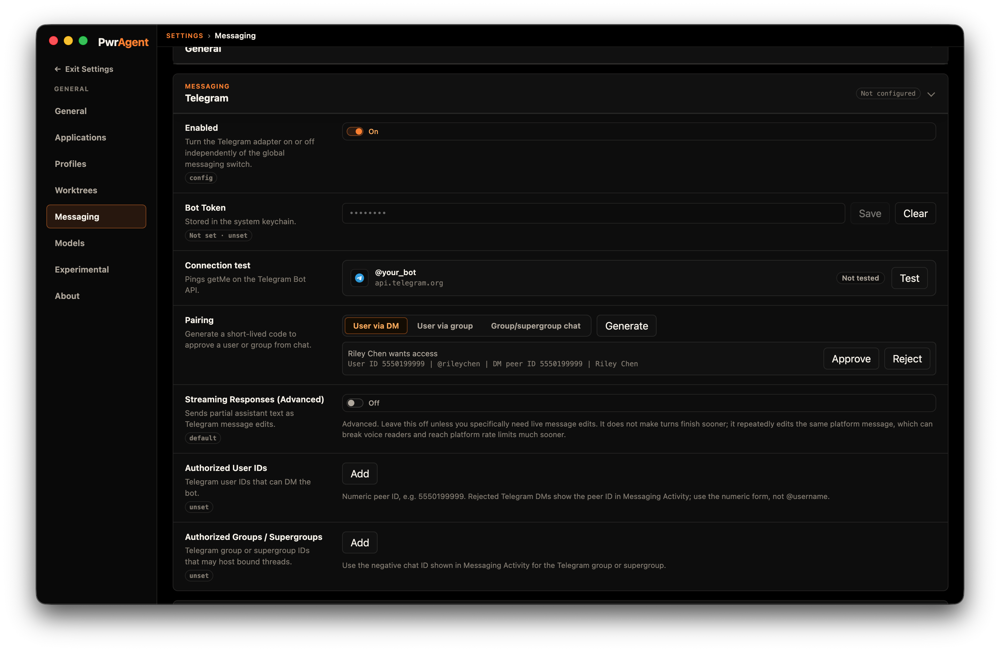
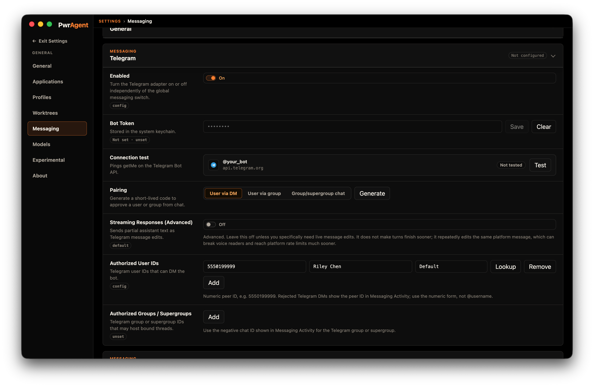
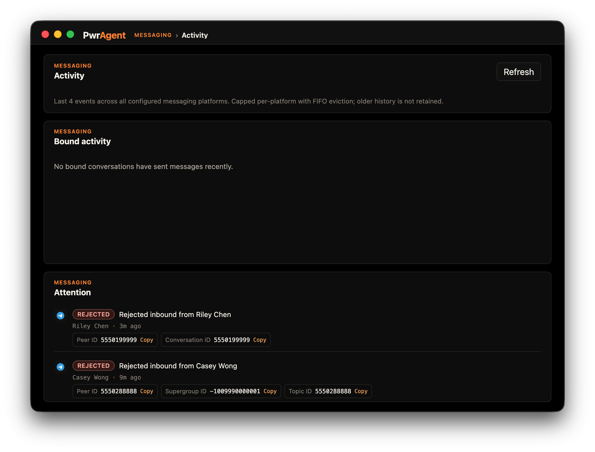

# Pairing

PwrAgent's **pairing flow** populates the user-allowlist (and the
shared-space allowlist) for every supported messaging platform
without you needing to find a numeric platform ID anywhere. Same
mechanic across Telegram, Discord, Slack, Mattermost, Feishu / Lark,
and LINE — the screenshots below are Telegram for illustration but
the flow is platform-agnostic.

For the conceptual two-phase model and the per-platform list of
space types you can pair (DM vs supergroup vs server vs channel
vs room), see
[Using Codex via Messaging → Pairing](../../using-codex/#pairing--how-you-populate-the-allowlists).

## The three-step flow

### 1. Generate the pairing token

In **Settings → Messaging → \<platform\>**, click the **Generate**
button on the Pairing field. PwrAgent shows a short one-time code
that expires after a few minutes.

### 2. Send the code to the bot

From the account you want to authorize, send the code to the bot —
in a DM where direct messages exist, or from inside the space you
want to pair when the platform doesn't have DMs. PwrAgent observes
the bot receiving the code; the actor's resolved name and chat
appear in the Pairing row, and the row prompts you to **Approve**.

### 3. Approve

Click **Approve** in the Settings panel. PwrAgent writes the
user's stable platform ID to the **Authorized User IDs** list
below, with the resolved display name beside it for your benefit.
The approval prompt clears.

### Phase 2: pair a shared space

Once you're an authorized user, the same flow authorizes a Slack
workspace, Discord server, Telegram supergroup, Mattermost team,
Feishu group chat, or LINE group / room — generate a token, post
it in the space you want to allowlist, approve on the desktop. The
user who pairs a space has to already be on the user allowlist;
that's the two-keyed authorization model in action.

## Troubleshooting: "I sent the code but nothing happened"

When the bot receives a message from someone who isn't yet on the
user allowlist, the message is **denied silently** — the bot
doesn't reply (that would leak its existence to the unauthorized
sender). The denial is logged to **Settings → Messaging → Activity**
under the **Attention** section so you can see what's stuck and
copy the peer / actor / channel ID into the allowlist directly if
the pairing flow doesn't work.

What this surface gives you for each rejected message:

- The platform's **stable peer / actor ID** — the field PwrAgent
  matches against the allowlist. Copy → paste into Authorized
  User IDs and the next inbound from that account is admitted.
- The **conversation / channel / supergroup / topic ID** — for
  shared spaces, the second key in the two-keyed authorization
  model. Copy into the per-platform space allowlist.
- The **resolved display name** — for sanity-checking that the
  ID belongs to the person you think it does.

Common reasons a pairing code doesn't observe:

- **The bot isn't actually receiving messages on that platform yet.**
  Check Settings → Messaging → \<platform\> → Connection test.
  If Test fails, fix the credentials before retrying pairing.
- **The platform requires the bot to be in a shared space first.**
  On Discord, the bot has to be installed in a server with the
  `applications.commands` scope before it can DM. On Slack, the
  bot needs to be in the workspace. On Telegram, just `/start`-ing
  the bot from your account is enough.
- **The pairing token expired.** Codes are short-lived; if too much
  time passed between Generate and the message reaching the bot,
  click **Generate** again and resend.
- **You sent the code from a different platform user than the one
  you wanted to authorize.** PwrAgent allowlists the user who
  *sent* the code — make sure that's the right account.
- **The platform mangled the code.** Some clients autocorrect or
  insert spaces. Send the code as a plain text message; for
  Telegram this is the default but on iOS clients with autocaps
  you may need to disable autocorrect for the DM.

## See also

- **[Using Codex via Messaging → Who can talk to the bot](../../using-codex/#who-can-talk)**
  — the closed-by-default model and the two-keyed authorization
  contract pairing populates.
- **[Per-provider setup pages](../../providers/)** — the rest of
  each platform's setup (Connection test, scopes, allowlists) lives
  with the provider-specific page.
- **[Discovery-mode fallback](../../using-codex/#discovery-mode-fallback)**
  — if you'd rather skip pairing and copy peer IDs from the
  Activity screen by hand, that path works on every provider too.
