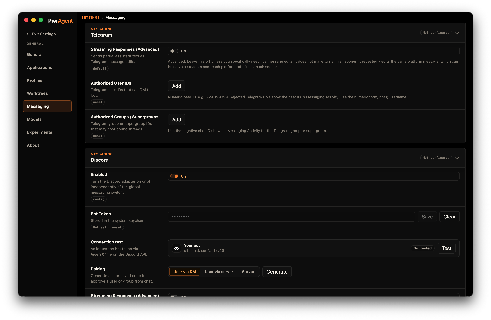

# Discord

PwrAgent's Discord adapter uses the Gateway WebSocket — PwrAgent dials
out to Discord and receives messages and component interactions over
that long-lived connection. No public callback URL is needed.

## What you need to get started

- **A bot token** from the
  [Discord Developer Portal](https://discord.com/developers/applications).
- **The application ID** (also visible in the Developer Portal — needed
  for the bot to recognize its own `@mention` text).
- **The bot installed in your server / DM target** with the
  `applications.commands` scope and the **Message Content Intent**
  enabled.

You do not need to know your own Discord user ID up front. The pairing
flow or discovery-mode logging will surface it after the bot is online.

## Step by step

1. **Create the application.** Go to the
   [Discord Developer Portal](https://discord.com/developers/applications),
   click **New Application**, name it (e.g. `PwrAgent`).
2. **Create the bot.** In the **Bot** tab, click **Add Bot**. Enable
   the **Message Content Intent** — without it, the adapter cannot
   read message text and `@mention`-style invocation does not work.
3. **Copy the bot token.** Also from the Bot tab. Treat it like a
   password.
4. **Copy the Application ID.** It's on the **General Information** tab.
5. **Install the bot.** In **OAuth2 → URL Generator**, select the
   `bot` and `applications.commands` scopes. Pick the bot permissions
   you want (at minimum: Send Messages, Read Message History, Embed
   Links, Use Slash Commands). Open the generated URL and authorize
   the bot into your server, or into a personal DM context.
6. **Open Settings → Messaging → Discord** in PwrAgent.
7. **Paste the bot token and the Application ID.** Click **Save**.
8. **Click Test.** PwrAgent calls Discord's `/users/@me` endpoint to
   verify the token.
9. **Enable Discord** with the toggle at the top of the panel.
10. **Generate a pairing token** and **DM it to the bot**, or send the
    bot any message and copy your user ID out of Settings →
    Messaging → Activity (the unauthorized-message path).
11. **Try `/resume`.** Send `/resume` from the DM or any allowlisted
    channel; the bot replies with the thread picker.

## Pairing

For the captured walkthrough of the pairing flow (generate → send
code → approve), and the troubleshooting Activity screen that shows
blocked inbound messages, see
[Messaging → Pairing](../../messaging/pairing/). Same flow on every
supported platform; the screenshots there happen to be Telegram.

## Settings reference

### Required (above the Test button)

| Setting | What it does |
|---|---|
| **Enabled** | Top-of-panel toggle. When off, the adapter doesn't start. |
| **Bot Token** | From the Discord Developer Portal Bot tab. Stored in macOS Keychain. |
| **Application ID** | From the General Information tab. Needed for slash-command reconciliation and `@mention` parsing. |
| **Authorized User IDs** | Comma-separated list of Discord user IDs (numeric snowflakes). The pairing flow or activity-log discovery populates this. |

### Optional (below the Test button)

| Setting | Default | What it does | When to change |
|---|---|---|---|
| **Streaming Responses** | Off | Bot edits its reply message in place as the response streams in. | Leave off unless you have a specific reason. See [Streaming responses](/streaming/). |
| **Tool Usage Notifications** | Show Some | Same semantics as the global Tools setting. | `Show More` for visibility, `Show Less`/`None` to quiet the channel. Per-binding override on the status card. |
| **Image Upload Profile** | medium | Quality used when forwarding inbound images to the model. | `low`/`high`/`actual` per your bandwidth / fidelity tradeoff. |

## Discord-specific notes

- **Privileged Message Content Intent must be on** in the Developer
  Portal. Without it, the bot sees empty message bodies and the adapter
  silently fails to parse mentions and free-form text.
- **Mention parsing matches on the application ID.** If Application ID
  is not configured, `@PwrAgent resume` won't work — slash commands
  still will.
- **Slash command reconciliation runs on adapter startup.** PwrAgent
  reads existing commands, then creates / patches / deletes only the
  commands whose definitions differ. It does not bulk-overwrite every
  startup.
- **Status cards degrade to ordinary messages on Discord.** The
  Discord adapter does not currently pin or edit status cards;
  expect repeated status posts rather than an in-place update.
  (Telegram and Mattermost handle this.)
- **Edit rate is permissive** compared to Telegram — Discord returned
  an edit bucket of 5 requests / 1 second in our probes, with no 429s
  through 60 edits/minute on a single message — but edits still count
  as REST requests and can hit route or global buckets under load.

## See also

- [Using Codex via Messaging](/using-codex/)
- [Streaming responses](/streaming/)
