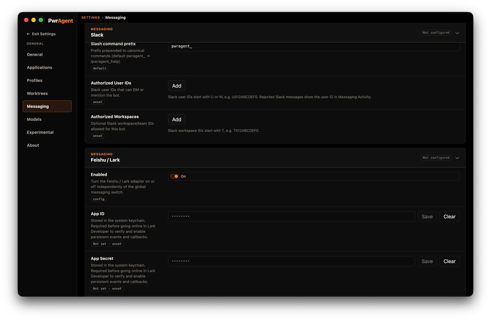

# Feishu / Lark

Feishu (the China-region brand) and Lark (international) share the
same Open Platform protocol. PwrAgent uses `feishu` as the internal
code identifier and exposes the region as a setting.

The default and recommended transport is the **persistent SDK
WebSocket** — PwrAgent dials out, and operators don't need to expose a
localhost listener. Webhook mode exists as a fallback; see
[Webhooks — a security note](/webhook-dangers/) before enabling it.

## What you need to get started

- A **custom app** in the Feishu / Lark Open Platform console with the
  Bot capability enabled.
- The app's **App ID** and **App Secret**.
- The right region selected — Feishu (`open.feishu.cn`) or Lark
  (`open.larksuite.com`).

The persistent-connection path does not require an Encryption Key or
Verification Token. Encryption is recommended; if you enable it in the
console, also store the Encryption Key in PwrAgent so events can be
decrypted before dispatch.

## Step by step

1. **Create the custom app.** In the Feishu / Lark Open Platform
   console, create a custom app. Enable the **Bot** capability.
2. **Copy the App ID and App Secret.**
3. **Open Settings → Messaging → Feishu / Lark** in PwrAgent.
4. **Pick the tenant region** — Feishu or Lark.
5. **Paste the App ID and App Secret.** Click **Save**.
6. **Click Test.** PwrAgent mints a tenant access token and calls
   `/open-apis/bot/v3/info` to confirm the credentials.
7. **Enable Feishu / Lark** with the toggle at the top of the panel.
8. **Configure events in the Open Platform console.**
   - Go to **Event Configuration** and pick **Receive events through
     persistent connection** (this is PwrAgent's default).
   - Subscribe to `im.message.receive_v1` (required for DMs and group
     mentions).
   - Optionally subscribe to `im.chat.access_event.bot_p2p_chat_entered_v1`
     to avoid noisy "no handler" SDK logs.
9. **Configure card callbacks in the same way.**
   - Go to **Callback Configuration** and pick **Receive callbacks
     through persistent connection**.
   - Add `card.action.trigger` so the bot receives clicks on
     interactive card buttons (Resume, status card actions, etc.).
10. **Grant permissions.** In the console, grant the messaging scopes
    described in "Permission scopes" below. Then **publish a version**
    of the internal app — Feishu / Lark does not apply event
    subscriptions or scope changes until a new app version is
    published.
11. **Add allowlisted user IDs.** Feishu `open_id` values look like
    `ou_…`. For shared chats, also add chat IDs (`oc_…`) or tenant keys
    to the corresponding allowlists.
12. **Try `@PwrAgent resume`** in a DM or, in a group chat, type `@`,
    pick the bot from the suggestion list, then `resume`.

## Permission scopes

Required for the current adapter shape:

- `im:message.group_at_msg:readonly` — receive user mentions in group
  chats. `im:message.group_at_msg.include_bot:readonly` is broader and
  needed only if you want events for mentions sent by other bots.
- `im:message:send_as_bot` — send messages and post status cards as
  the bot.

Recommended:

- `im:message:readonly` — read direct and group messages; also needed
  for image / file resource downloads.
- `im:message:update` — refresh or dismiss status cards instead of
  posting duplicates.
- `im:chat:readonly` — group membership and chat metadata for
  shared-chat bindings.

Broad shortcut: `im:message` covers multiple message read/send
capabilities. Fine for a private internal app; narrower scopes above
are easier to get approved.

## Pairing

For the captured walkthrough of the pairing flow (generate → send
code → approve), and the troubleshooting Activity screen that shows
blocked inbound messages, see
[Messaging → Pairing](../../messaging/pairing/). Same flow on every
supported platform; the screenshots there happen to be Telegram.

## Settings reference

### Required (above the Test button)

| Setting | What it does |
|---|---|
| **Enabled** | Top-of-panel toggle. When off, the adapter doesn't start. |
| **Tenant Region** | `feishu` or `lark`. Determines which API host PwrAgent uses. |
| **App ID** | From the Open Platform console. |
| **App Secret** | From the Open Platform console. Stored in macOS Keychain. |
| **Authorized User IDs** | Comma-separated Feishu `open_id` values (`ou_…`). |

### Optional (below the Test button)

| Setting | Default | What it does | When to change |
|---|---|---|---|
| **Inbound Mode** | persistent | Use the persistent WebSocket or a public webhook. | Leave on `persistent`. Switching to `webhook` requires running a tunneled HTTP listener — see [Webhooks — a security note](/webhook-dangers/). |
| **Tenant URL** | (region default) | Override the API host. | Only for self-hosted Lark deployments or special tenants. |
| **Callback Base URL** | (blank) | Public URL for webhook mode. | Only required if you set Inbound Mode to webhook. |
| **Verification Token** | (blank) | Webhook event verification token. | Only required in webhook mode. |
| **Encryption Key** | (blank) | Encrypts event envelopes from the platform. Recommended in either mode. | Set to the value from the console's Event Subscriptions → Encryption Key field. Stored in macOS Keychain. |
| **Authorized Chats** | (empty) | Allowlist of group chat IDs (`oc_…`) the bot will respond in. | Required for any group chat the bot should accept events from. |
| **Authorized Tenants** | (empty) | Allowlist of tenant keys for shared workspaces. | Use for multi-tenant deployments where you want the bot to scope to specific tenants. |
| **Slash Command Prefix** | pwragent_ | Prefix prepended to registered slash commands. | Set to empty to register bare triggers; accept the collision risk. |
| **Register Slash Commands** | Off | Reconcile native slash commands on startup. | Turn on if you want `/pwragent_resume` etc. in the console-registered slash menu. |
| **Streaming Responses** | Off | Bot edits its reply message in place as text streams in. | Leave off. See [Streaming responses](/streaming/). |
| **Tool Usage Notifications** | Show Some | Same as the global Tools setting. | Per-binding override on the status card. |
| **Image Upload Profile** | medium | Quality used when forwarding inbound images to the model. | Tune per bandwidth / fidelity tradeoff. |

## Feishu-specific notes

- **In group chats, PwrAgent's supported path is mention-triggered** —
  type `@`, pick the bot, then send the message. DMs work without a
  mention. Tenants that grant broader group-message read permissions
  do not change the recommended adapter path.
- **Interactive card buttons carry only signed opaque callback handles.**
  The actual action ID, binding ID, and routing state live in PwrAgent's
  callback handle store, so buttons survive app restarts and fail
  closed after expiry.
- **Audio and video messages are unsupported** today and arrive as
  rejected attachments.

## See also

- [Using Codex via Messaging](/using-codex/)
- [Streaming responses](/streaming/)
- [Webhooks — a security note](/webhook-dangers/) — only relevant if
  you switch off persistent mode.
