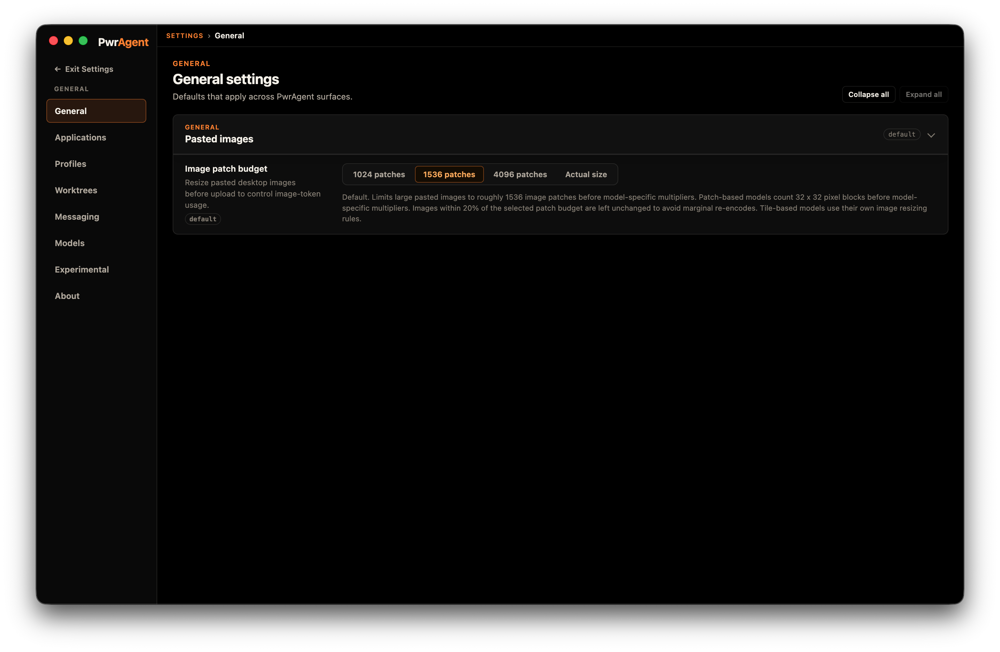
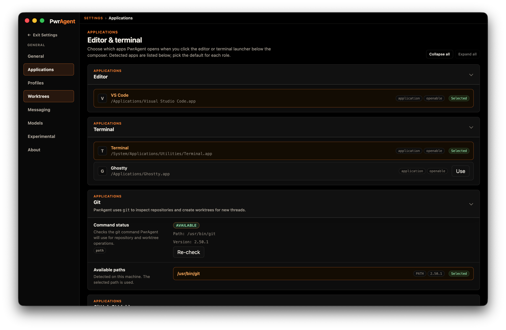
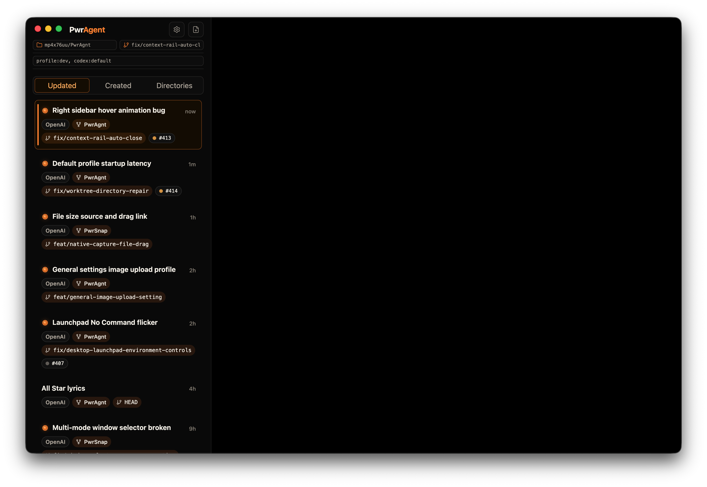
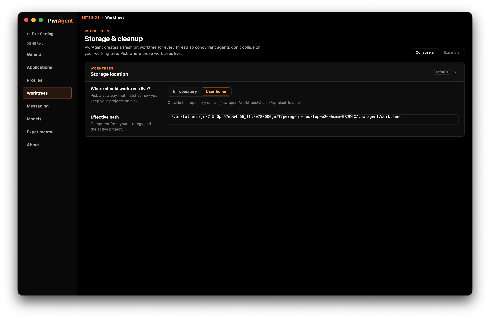
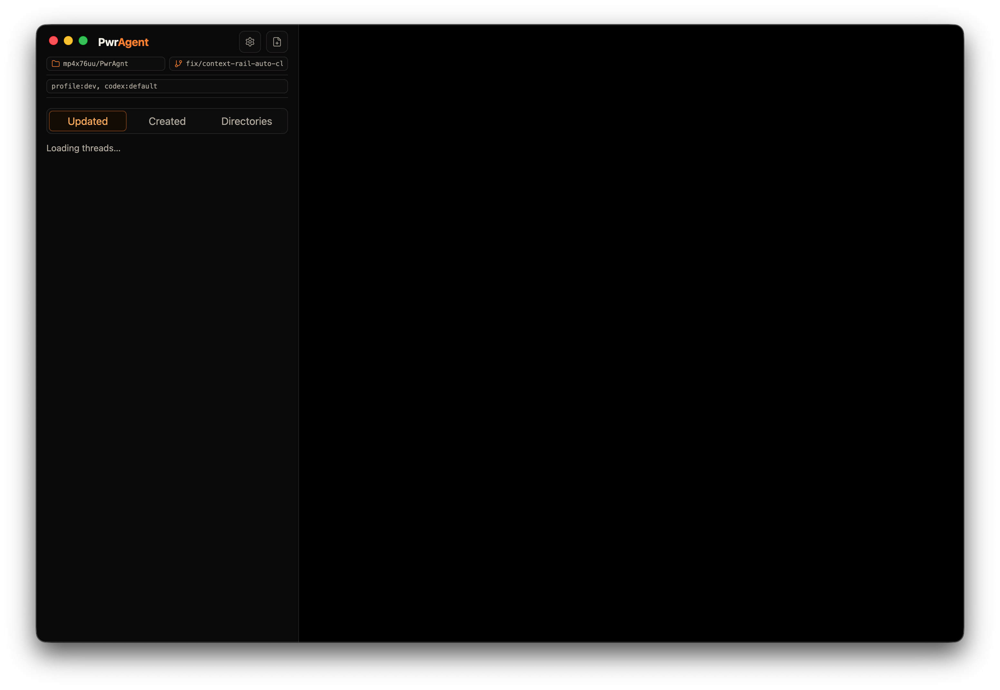
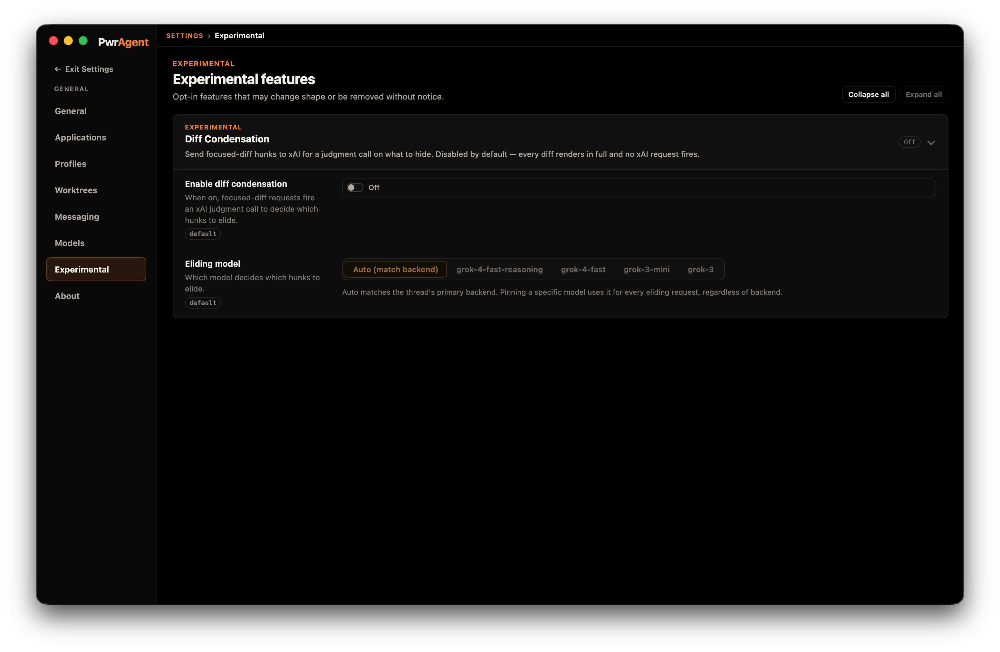

# Settings

Non-messaging settings for the PwrAgent desktop app. Messaging
configuration lives under each provider page — see
[Messaging → Providers](../messaging/#setting-up-providers).

Everything below is reachable from **Settings** in the desktop app.
The left-nav layout is roughly:

- **General** — desktop-wide defaults (image-paste budget, etc.).
- **Applications** — terminal, editor, git, `gh` CLI.
- **Profiles** — PwrAgent profile management; see
  [Desktop → Multiple profiles](../desktop/#multiple-profiles).
- **Worktrees** — where worktrees get stored.
- **Messaging** — per-provider config; see
  [Messaging → Setting up providers](../messaging/#setting-up-providers).
- **Models** — Codex App Server discovery, version, Codex auth
  profile selection.
- **Experimental** — opt-in features that are still in flux.

## General

Desktop-wide defaults that don't fit anywhere more specific. The
load-bearing setting today is the **pasted image patch budget**,
which caps how aggressively PwrAgent resizes large images you paste
into the composer before they're forwarded to the model.

| Option | What it means |
|---|---|
| `1024 patches` | Caps square images at about 1024 32px patches before model-specific multipliers. |
| `1536 patches` *(default)* | Limits large pasted images to roughly 1536 image patches. Sensible balance for typical screenshots. |
| `4096 patches` | Allows roughly a 2048×2048 square image before model-specific multipliers. |
| `Actual size` | Preserves pasted image dimensions before upload. |

The same patch budget affects messaging-side image attachments
similarly. See [Using Codex via Messaging → Image upload profile](../using-codex/#image-upload-profile)
for the messaging-side knob.

## Application discovery

PwrAgent shells out to several command-line tools you've already
installed. On launch it discovers:

| Tool | Used for |
|---|---|
| **Terminal** | Opening the thread's workspace in a terminal window. |
| **Editor** | Opening the workspace in your IDE / editor of choice. |
| **`git`** | Repository inspection, worktree creation, branch metadata. |
| **`gh` CLI** | GitHub-specific actions (PR numbers in sidebar filters, etc.). |

If the auto-discovery picks the wrong binary or doesn't find one,
override the path in **Settings → Applications**. Paths are
per-tool; an explicit value beats the auto-discovered one.

Codex App Server discovery is its own beast — see
[Models / Codex App Server](#models--codex-app-server) below.

## Profiles

PwrAgent has two profile mechanisms — **PwrAgent profiles** (this
panel) for desktop-app state and **Codex auth profiles** (under
[Models / Codex App Server](#models--codex-app-server)) for
isolating Codex `CODEX_HOME` directories. Both compose; see
[Desktop → Multiple profiles](../desktop/#multiple-profiles) for
the full conceptual model.

The Profiles panel lets you list, create, switch between, and
delete PwrAgent profiles. Each row shows the on-disk profile dir,
the Codex auth profile bound to it, and which one's active /
configured to launch by default.

Launches via `--profile <name>` (or `PWRAGENT_PROFILE=<name>`)
still override the startup default — see
[Desktop → Launching a profile from the command line](../desktop/#launching-a-profile-from-the-command-line)
for the CLI launch flag.

## Worktrees

PwrAgent stores managed worktrees outside of your repo so they
don't clutter your working checkout. The default storage location
is **`~/.pwragent/worktrees/`**.

You can change the location in **Settings → Worktrees → Worktree
storage location**. Pick a path on the same filesystem as your
repos — `git worktree` requires that, and putting the storage on a
different volume will produce surprising errors at handoff.

When PwrAgent creates a worktree for a thread, it lands at
`<worktree-storage>/<hash>/<project-folder-name>` where `<hash>` is
a short timestamp-derived directory. You'll see the full path on
the thread's status card.

## Models / Codex App Server

PwrAgent is a **client** of Codex App Server — it doesn't ship its
own copy. The desktop discovers Codex App Server from any of:

- **Codex Desktop** (the official Codex desktop app, if you have
  it installed).
- **Homebrew-installed Codex CLI** (`brew install codex` or
  equivalent).
- **Other Codex CLI install paths** PwrAgent knows to check.

On launch, PwrAgent scans those sources, picks the **newest working
version** it finds, and uses that as the Codex App Server backing
your threads. The version currently in use is shown in **Settings →
Models** — same panel where you'd verify which models are available
and which one PwrAgent thinks you're logged into.

### Keeping the App Server up to date

Because PwrAgent uses the newest working install it finds, **it
inherits whatever updates you apply to the underlying Codex
installation.** That means:

- If you **never run Codex Desktop** (and don't update via the CLI
  path), your PwrAgent stays pinned at whatever Codex App Server
  version was current when you last updated either source.
- The most reliable way to keep PwrAgent current is to **run Codex
  Desktop periodically** and let it self-update.
- If you do all your dev in PwrAgent and never open Codex Desktop,
  consider updating the **Codex CLI** instead — `brew upgrade codex`
  on Homebrew, or whatever your install path's update mechanism is.

Either source on its own is fine. You don't need to keep both
current; PwrAgent picks whichever is newest at launch.

### Authentication

**PwrAgent does not ship its own Codex authentication flow.** It
piggybacks on whatever Codex auth state your underlying install
has.

If you need to **log out and back in**, or your tokens have expired
and PwrAgent shows you signed out:

1. Open **Codex Desktop**.
2. Sign in / re-authenticate there.
3. Restart PwrAgent (or wait for it to pick up the refreshed
   credentials).

There's no equivalent flow in PwrAgent's UI — by design, since
duplicating the auth state would mean it could diverge from Codex
Desktop's truth.

### Testing the connection

The **Test** button in Settings → Models calls the discovered Codex
App Server's health endpoint and reports the version, the
authenticated account (if any), and any error from the App Server
itself. If Test fails:

- Confirm Codex Desktop or the Codex CLI is actually installed at
  one of the paths PwrAgent scans.
- Confirm you're authenticated — open Codex Desktop and check.
- Confirm the App Server binary is executable on your account
  (rare, but Gatekeeper / `xattr -d com.apple.quarantine` can come
  into play on freshly-downloaded binaries).

## Experimental

Opt-in features that are still in flux. Today the panel hosts:

- **Diff condensation** — when on, focused-diff requests fire an
  xAI judgment call to decide which hunks to elide. Useful when
  diff payloads bloat past comfortable model-context sizes; off by
  default.

Expect this section to grow as features cycle through the
experimental phase before promotion.

## See also

- **[Desktop](../desktop/)** — the app's overall feature set,
  workspaces (Local vs. Worktree), per-thread model / fast /
  reasoning / permissions, multi-profile model.
- **[Messaging](../messaging/)** — messenger-specific Settings panels
  live under each [provider setup page](../providers/).
