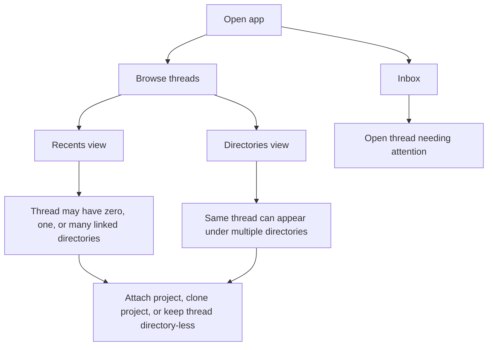

# Thread-Centric Agent Desktop

## Problem Frame

Current coding agents are too directory-first. They assume a thread starts inside one repo, stays attached to that repo, and is easiest to find later by browsing project folders. That breaks down for real work that spans multiple repositories, starts as an idea before any repo is chosen, or needs user attention across many active threads.

This product should make the thread, not the directory, the primary object. Users should be able to start a thread from nowhere, attach one or more projects later, and still find urgent work quickly through an inbox and recent activity view. The result should feel immediately stronger than Codex or Claude Code in thread navigation while still being a real coding agent with provider abstraction, extensibility, and system-maintained memory.

## Requirements

**Thread Creation and Identity**
- R1. Users can create a thread without selecting any directory.
- R2. Users can also create a thread from a directory-oriented view, in which case that directory is attached at creation time.
- R3. A thread can gain directories later as work becomes concrete, including by locating an existing project on disk or cloning it when needed.
- R4. Threads remain first-class objects even when they have no attached directory.

**Navigation and Surfacing**
- R5. The left-rail navigation is anchored by an Inbox section above the general thread browsing controls.
- R6. Inbox is a live operational queue that includes any thread that is active, blocked, waiting, or newly completed enough to warrant attention.
- R7. Below Inbox, users can switch between Recents and Directories as alternate browsing lenses.
- R8. Recents is the default browsing lens for the product home state.
- R9. Directory browsing must not "steal" a thread out of Recents or Inbox; the same thread can surface in multiple views at once.

**Thread Context Visibility**
- R10. In thread lists, users can see enough context at a glance to understand which linked directories a thread is using.
- R11. When opening a thread, users can see which linked directories, working directories, branches, and pull requests are involved, including when work spans multiple repos or stacked PRs.

**Directory Association Model**
- R12. Threads may be linked to multiple Git directories at the same time.
- R13. In directory view, the same thread appears under every linked Git directory rather than under a single canonical project only.
- R14. When a thread uses both a primary Git repo and a worktree or other working directory, navigation groups and labels the thread by the Git directory rather than the worktree path.
- R15. In local execution mode, the Git directory and working directory may be the same; in worktree-oriented execution they may differ.

**Execution Trust Model**
- R16. Each thread has an execution mode of either guarded or full access.
- R17. Guarded mode uses risk-based approval prompts rather than prompting for every command.
- R18. Full-access mode allows broad execution with visibility into what happened, without constant approval interruptions.
- R19. The trust model leaves room for later command-safety cop agents and credential mediation without making them mandatory for the first milestone.

**Core Agent Capability**
- R20. The first milestone includes a real provider and agent harness, not a fake or stubbed conversation shell.
- R21. The system is Grok-first for the interview target while remaining provider-agnostic enough to support any model backend that can satisfy a responses-style interface.
- R22. The first milestone supports the core coding loop: create/open a thread, attach projects, run agent work, inspect progress, and review results inside the app.

**Extensibility and Memory**
- R23. The first milestone includes a real skills/plugins capability rather than deferring extensibility entirely.
- R24. The product maintains its own memory and guidance system so users are not pushed toward hand-writing fragile system prompts and setup rituals.
- R25. That memory system is exposed as a navigable wiki the user can inspect and lightly edit.
- R26. The wiki supports both lexical search and semantic search so prior guidance and project knowledge can be reused without copy-paste setup work.

## Success Criteria

- A first-time viewer can tell within minutes that thread navigation is the product's differentiator.
- Users can start a thread before choosing a repo and later turn it into real work without losing context.
- A cross-project thread can be found from Inbox, from Recents, and from every linked directory listing.
- Users can tell at a glance which repos a thread touches and, when opened, what branches or pull requests it is working through.
- The first milestone demonstrates real coding-agent behavior against at least one production model provider rather than a mocked shell.
- Skills/plugins and wiki memory are present enough that the product feels extensible and accumulative, not stateless.

## Scope Boundaries

- The first milestone does not need a custom in-app credential unlock or SSH-agent replacement.
- The first milestone does not need to solve maximum-security sandboxing; the product assumes users often want powerful agent execution.
- The first milestone does not need user-defined inbox rules or advanced manual pinning systems.
- The first milestone does not need equal investment across every differentiator; thread navigation is the hero, while trust, providers, extensibility, and memory are enabling systems.

## Key Decisions

- Thread-first product surface: the thread is the main object, with directories as attachable context rather than ownership.
- Inbox above browsing lenses: urgent or active work is surfaced before folder-style exploration.
- Recents as default lens: users should land in a global view first and drill into directories only when needed.
- Many-to-many directory associations: a single thread can appear under multiple linked Git directories.
- Real systems in milestone one: provider/harness, skills/plugins, and wiki memory are in scope for v1; credential mediation is not.
- Execution mode per thread: guarded and full-access modes balance usability and trust without forcing one global policy.

## Dependencies / Assumptions

- The desktop product will be allowed to access local projects, create or attach working directories, and execute agent actions on the user's machine.
- At least one responses-style provider integration is achievable early enough to support a real end-to-end demo.
- Directory discovery and cloning can be made simple enough that users are not asked to do repetitive repo setup work before the agent can help.

## Outstanding Questions

### Deferred to Planning
- [Affects R6][Technical] What concrete signals and ranking rules determine Inbox ordering so it stays useful rather than noisy?
- [Affects R10][Technical] What exact list-row metadata should be shown so linked directories are useful at a glance without making thread lists visually noisy?
- [Affects R12][Technical] How should linked directories be persisted, displayed, and updated when repos move, are missing, or are renamed on disk?
- [Affects R14][Technical] What exact relationship model should represent Git roots versus worktrees versus other working directories?
- [Affects R21][Needs research] What is the thinnest provider contract that keeps Grok-first development simple while still accommodating OpenAI-style responses backends?
- [Affects R23][Technical] What is the smallest plugin/skill model that feels real in v1 without locking the product into a bad extension API?
- [Affects R26][Needs research] What search architecture gives the wiki credible lexical and semantic recall without overbuilding the first milestone?

## Next Steps

-> `/prompts:ce-plan` for structured implementation planning
