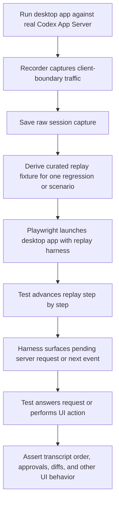

# Desktop Integration Test Replay Harness

## Problem Frame

The desktop app currently has useful renderer and client normalization tests, but they are still synthetic. They prove local component behavior and selected protocol parsing, not that the full desktop surface behaves correctly when driven by the real Codex App Server message stream.

That leaves a gap in two places. First, regressions discovered in real sessions are hard to turn into durable tests. Second, there is no practical way to build a broad "lock down current behavior" suite against the desktop app without hand-authoring large fake protocol sequences. The result is that UI bugs tied to real session ordering, notifications, approvals, or edited-change rendering can slip through even when lower-level tests are green.

The first durable capability should be a record/replay testing pattern for the desktop app. The recorder should capture the exact protocol traffic the desktop client sees from the real Codex App Server, including messages the app does not yet process. The harness should let tests replay that traffic deterministically inside the desktop app, pause at decision points, and explicitly provide the next desktop response or UI action.

## Requirements

**Capture Pipeline**
- R1. Recording must happen at the desktop app's Codex transport or client boundary so captures reflect exactly what the desktop app consumed and emitted.
- R2. The recorder must capture outbound requests, inbound responses, inbound notifications, and inbound server requests that expect a desktop-side response.
- R3. The recorder must retain messages the current desktop app does not understand or process, rather than filtering them out.
- R4. Each raw capture must preserve enough metadata to reconstruct event order and request-response relationships, including direction, method, ids, and capture sequence.
- R5. The initial capture workflow must support "record from now" for a live desktop session.
- R6. The overall pattern must also support a later "export by session id" workflow that builds a raw capture from local desktop-side artifacts when available and fails clearly when the required artifacts do not exist.

**Replay Fixtures and Harness**
- R7. Raw captures are source artifacts; tests must run from derived replay fixtures rather than directly from the full raw capture.
- R8. The derived replay fixture must be a normalized scripted artifact with ordered steps, explicit checkpoints, and exact protocol payloads embedded where needed.
- R9. The replay harness must be step-gated: it only advances when the test explicitly requests the next step.
- R10. The replay harness must support replaying the same protocol classes captured by the recorder: requests, responses, notifications, and inbound server requests.
- R11. When replay reaches an inbound server request that needs a desktop response, the harness must surface that request to the test and wait for the test to submit the response explicitly.
- R12. The replay harness must support controlled fault injection and mutation of the recorded flow so tests can verify desktop behavior under protocol errors, reordered steps, or altered payloads.

**Test Runner and Coverage Shape**
- R13. The first supported end-to-end consumer of the replay harness must be full Electron desktop tests driven by Playwright.
- R14. The first proof scenario must be turning a real session into a regression test for a desktop UI bug, rather than starting with a broad generic matrix.
- R15. After the framework exists, the same pattern must be usable to expand into a larger regression suite that captures the desktop behaviors that currently work.
- R16. The framework must make it practical to assert UI behavior that depends on real message ordering, including transcript ordering, edited-change expansion, approval handling, and turn progression.

**Source-of-Truth and Maintenance**
- R17. Each replay-backed regression should keep the raw capture and the derived fixture paired so future maintainers can trace the scripted test back to the original session evidence.
- R18. Fixture derivation must allow curating a smaller scenario from a longer raw session without losing the exact protocol payloads needed for the assertion.
- R19. The framework must favor deterministic replay over recorded wall-clock timing so regressions stay stable in local and CI runs.

## Success Criteria
- A developer can record a real desktop session against the real Codex App Server and save a raw capture without patching the server.
- A developer can derive a smaller replay fixture from that capture and use it in a Playwright-driven Electron test.
- The first target regression can prove that expanding edited changes keeps the diff content in the correct transcript position instead of jumping above unrelated messages.
- Unknown or currently unhandled protocol messages are still present in the raw capture, so fixture derivation does not silently erase future debugging value.
- The framework is usable as the base for a broader desktop regression suite rather than as a one-off bug harness.

## Scope Boundaries
- This brainstorm defines the desktop integration testing pattern and the first capture-to-regression workflow; it does not define the full implementation plan, fixture file layout, or exact internal APIs.
- The first milestone does not need a complete retrospective export pipeline from any historical server session source; "record from now" ships first.
- The first milestone does not need a comprehensive catalog of every desktop scenario. One real-session regression is enough to validate the pattern.
- The first milestone does not require replaying original timing or animation cadence unless a later test proves that timing fidelity is necessary.

## Key Decisions
- Record at the desktop client boundary: this captures exactly what the app saw, including unknown messages, and avoids coupling the test pattern to server internals.
- Keep raw captures and derive curated replay fixtures: the raw capture remains evidence, while the scripted fixture keeps tests small and understandable.
- Use step-gated replay: deterministic advancement is more important than time-faithful playback for stable UI regression tests.
- Start with Playwright-driven Electron tests: the goal is real desktop integration coverage, not another layer of renderer-only mocks.
- Include fault injection in v1: the framework should be useful for both regression replay and robustness checks, not only happy-path playback.
- Ship "record from now" first and "export by session id" next: that gives a working capture path quickly without blocking on artifact archaeology.

## Dependencies / Assumptions
- The desktop app's Codex client boundary is stable enough to host a recorder without distorting normal protocol handling.
- Local desktop-side artifacts will exist for at least some sessions, making a later session-id export path feasible.
- Playwright can be introduced as an Electron test runner for the desktop app without changing the core product architecture.

## Outstanding Questions

### Deferred to Planning
- [Affects R6][Needs research] Which existing local desktop artifacts can reliably support "export by session id," and what gaps would still require new persisted capture data?
- [Affects R8][Technical] What exact schema should the normalized replay fixture use so it preserves protocol truth without becoming difficult to author or diff?
- [Affects R12][Technical] How should fault injection be expressed so tests can mutate the recorded flow without making fixtures unreadable?
- [Affects R13][Needs research] What is the cleanest way to boot the Electron app under Playwright with the replay harness enabled in local development and CI?

## Next Steps
→ /prompts:ce-plan for structured implementation planning
