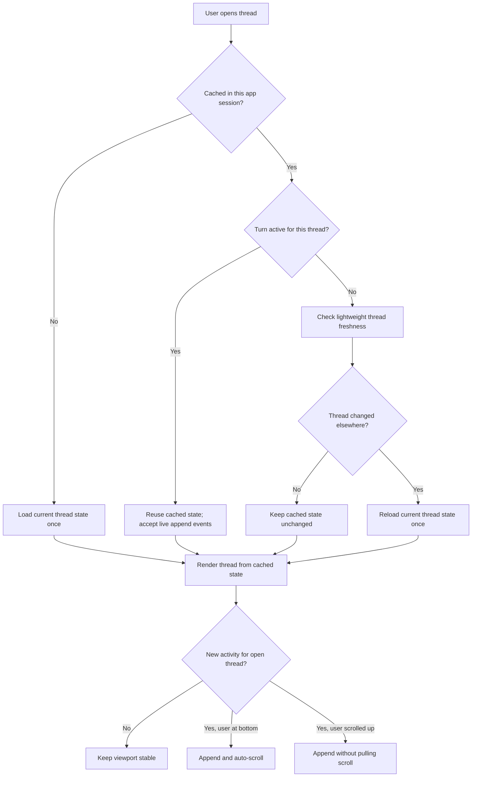

# Desktop Thread Refresh Model

## Problem Frame

The current desktop refresh behavior is too broad and too eager. Navigation refreshes, transcript rereads, and skill reloads are coupled tightly enough that normal activity can cause the open thread view to jump, the composer to show repeated skill-loading states, and unrelated thread updates to perturb the currently focused conversation. The result is a UI that feels unstable and likely does more work than needed.

This feature should replace broad refresh behavior with thread-scoped, event-driven updates. The selected thread should remain visually stable unless that thread itself changed, while the sidebar may continue to reflect unread and ordering changes. The model should favor cached thread state, append-only updates for active conversations, and targeted stale checks when a thread is revisited.

## Requirements

**Refresh Ownership**
- R1. The thread detail view must not expose a manual `Refresh` button.
- R2. The app must not perform automatic whole-window refreshes on desktop window focus in this iteration.
- R3. The open thread view must update automatically only for activity that belongs to the selected thread.
- R4. Activity on non-selected threads may update inbox state, unread state, and sidebar ordering, but must not cause the selected thread transcript or composer state to jump or rerender unnecessarily.

**Open Thread Update Model**
- R5. Live updates for the selected thread must be append-driven from thread events rather than driven by repeated full transcript rereads during an active turn.
- R6. When a user selects a thread that is not already cached in the current app session, the app must load that thread's current state once before rendering it as the active conversation.
- R7. When a user re-selects a thread that is already cached and that thread currently has an active turn in this app instance, the app must reuse the cached state without performing a freshness reload.
- R8. When a user re-selects a thread that is already cached and does not have an active turn, the app must perform a lightweight freshness check before deciding whether to reload the full thread state.
- R9. If the freshness check indicates that the thread was changed elsewhere, the app must reload the current thread state once and reconcile the cache.
- R10. If the freshness check indicates that nothing materially changed, the app must preserve the cached thread state without visible transcript repaint.

**Scroll and Viewport Stability**
- R11. When new activity is appended to the selected thread while the user is reading the bottom of the conversation, the thread view must follow the new bottom content automatically.
- R12. When new activity is appended to the selected thread while the user has scrolled up away from the bottom, the thread view must preserve the reader's current viewport and must not pull the scroll position to the newest message.
- R13. Appending new activity to the selected thread must not repaint the entire transcript when an incremental append is sufficient.

**Skills Loading**
- R14. Skills are treated as thread-scoped state in the desktop UI.
- R15. The app must not load skills automatically when a thread becomes selected.
- R16. The app must load skills lazily the first time the user types a skill trigger in that thread.
- R17. After skills have been loaded once for a thread during the current app session, the app must reuse the cached skill list for that thread and must not reload it again automatically.
- R18. Reloading skills manually is out of scope for this iteration and may be added later as a separate feature.

**In-Memory Thread Retention**
- R19. The app must retain in memory any thread that the user sent a message in during the current app session.
- R20. For retained interacted threads, the app must track at least the last time the user sent a message and whether the latest assistant response has been read.
- R21. Threads that were only opened and viewed, but never sent a message in this app session, must still be eligible for short-term in-memory reuse.
- R22. The app must distinguish between interacted retained threads and view-only retained threads so that future eviction logic can treat them differently.
- R23. The app must keep no more than ten view-only retained threads in memory at a time.
- R24. View-only retained threads are the first candidates for eviction when the app needs to reduce memory usage.

## Success Criteria

- The open thread view no longer jumps when unrelated threads receive updates.
- The composer no longer shows repeated skill-loading states for the same thread during normal use.
- During an active turn, the selected thread can continue to stream or append activity without relying on repeated full transcript reloads.
- Re-entering an unchanged cached thread is visually stable and does not trigger unnecessary transcript repaint.
- Re-entering a cached thread that changed elsewhere refreshes correctly and only when needed.
- Sidebar unread and ordering changes remain functional without destabilizing the active thread view.

## Scope Boundaries

- This iteration does not reintroduce any automatic refresh-on-window-focus behavior.
- This iteration does not add a manual skill reload control.
- This iteration does not require a full memory-pressure sweeper implementation; it only defines retention and eviction priority rules.
- This iteration does not require a broader protocol redesign, though planning may propose a minimal freshness mechanism if the current app-server surface is insufficient.

## Key Decisions

- Event-driven append is the default model for the selected thread during active work.
- Selection-time freshness checks replace broad refresh behavior for cached threads without active turns.
- Skills move from eager thread-selection loading to lazy first-use loading per thread.
- Sidebar freshness is allowed to move independently from transcript freshness.
- Interacted threads are treated as more valuable session state than threads that were only viewed.

## Dependencies / Assumptions

- The current desktop app server surface includes `thread/list`, `thread/read`, and `skills/list`, and does not currently expose a dedicated lightweight per-thread freshness RPC.
- Existing thread metadata such as `updatedAt`, `lastUserMessage`, and `lastAssistantMessage` may be sufficient for a first stale-check design, but that must be validated during planning.
- The selected thread view can receive enough thread-local events to support append-driven updates without periodic full rereads during active turns.

## Outstanding Questions

### Deferred to Planning
- [Affects R8][Technical] What concrete freshness signal should the app use for cached threads without active turns: existing thread-list metadata, an augmented summary response, or a new lightweight RPC?
- [Affects R11][Technical] What scroll-anchoring approach will preserve viewport stability while still following new content when the user is at the bottom?
- [Affects R20][Technical] What exact state transition marks the latest assistant response as "read" for retention and future eviction decisions?
- [Affects R23][Technical] Where should per-thread cached transcript, skill, and retention metadata live so sidebar updates do not invalidate the active thread view?

## Next Steps

-> `/prompts:ce-plan` for structured implementation planning
