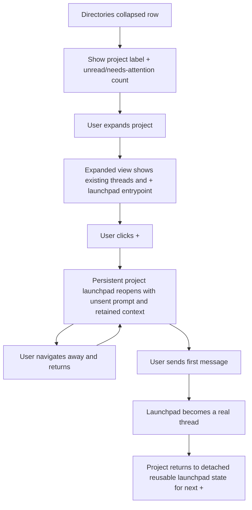

# Directories Launchpad

## Problem Frame

The current Directories lens spends too much vertical space on each project, uses a header-and-count pattern that does not align with Recents, and treats "new thread" like a one-shot action instead of durable project-scoped work in progress. That makes directory browsing feel less dense, less operational, and less consistent with the thread-first product direction.

The Directories lens should become a compact project browser that stays visually close to Recents while giving users a better way to start work from a directory. Instead of exposing a large section header plus a raw thread count, each directory should collapse to a dense row with a needs-attention signal. Expanding that row should reveal existing threads plus a persistent launchpad draft that reopens when the user clicks `+`, preserves unsent work, and only becomes a real thread when the user sends the first message.

## Requirements

**Directory List Density and Structure**
- R1. The Directories lens uses compact per-directory rows rather than tall section headers with detached thread-count labels.
- R2. The collapsed directory row should stay stylistically close to the Recents row pattern rather than introducing a separate visual language.
- R3. The collapsed directory row should prioritize an unread or needs-attention count over a raw thread count as its primary summary signal.
- R4. Expanding a directory row reveals the threads for that directory inline beneath the directory summary row.

**Directory Status and Git Context**
- R5. For Git directories, the expanded row should show informational repository context including the current branch and whether it is in sync, ahead, or behind the default pull remote for that branch.
- R6. Repository status shown in the Directories row is informational; the Directories lens must not directly switch the checked-out branch from that row.
- R7. For non-Git directories, the expanded row should expose the directory's threads and the `+` entrypoint without a Git-status control area.
- R8. Branch, access mode, model, reasoning, fast mode, and similar thread-setup controls do not live in the expanded directory row itself.

**Launchpad Draft Model**
- R9. Clicking `+` on a directory opens a project-scoped launchpad that appears as a thread draft for that directory rather than immediately creating a full thread.
- R10. Each directory has exactly one persistent unsent launchpad draft.
- R11. Re-clicking `+` for a directory reopens that same unsent launchpad draft until the draft is sent.
- R12. If the user types a prompt without sending it, the launchpad must retain that unsent prompt when the user leaves and later reopens the launchpad.
- R13. If the user changes launchpad context such as local versus worktree execution, branch choice, access mode, model, reasoning, or fast mode, the launchpad must retain that unsent context when the user leaves and later reopens it.
- R14. The launchpad should snapshot the current sticky defaults for new-thread setup as soon as the user changes a relevant setting or begins composing the prompt, so reopening it restores the in-progress setup rather than re-reading newer defaults.
- R15. Sending the launchpad's first message converts the launchpad into a real thread in that directory.
- R16. After the first send, the project returns to a detached reusable launchpad state so a future `+` opens a fresh draft rather than reopening the already-created thread.

**Thread Setup Controls**
- R17. Access mode is surfaced with the composer area below the thread reply box rather than in the Directories row.
- R18. Changing access mode updates the sticky default used for future new launchpads and new threads, but it does not rewrite the settings of existing threads.
- R19. Model, reasoning, and later fast-mode controls are surfaced with the composer area below the thread reply box rather than in the Directories row.
- R20. Changing model, reasoning, or fast mode updates the sticky default used for future new launchpads and new threads, but it does not rewrite the settings of existing threads.
- R21. Branch selection is part of launchpad context, but branch choice is not a global sticky default that automatically changes future launchpads unless the user explicitly sets it in that launchpad.

## Success Criteria

- The Directories lens feels visibly denser and more consistent with Recents without losing scannability.
- Users can tell which directories need attention without relying on a detached raw thread-count label.
- Users can start drafting work from a directory, navigate away, return via `+`, and find the draft unchanged.
- A project launchpad only becomes a real thread when the user sends the first message.
- Git directories surface enough status to orient the user without turning the Directories lens into a full branch-management UI.
- Access mode and later model/reasoning controls are easier to discover during composition because they live with the reply workflow instead of being hidden in a distant footer-only control.

## Scope Boundaries

- This change does not turn the Directories lens into a direct branch-switching surface.
- This change does not keep multiple unsent launchpad drafts per directory.
- This change does not make access mode, model, reasoning, or branch selectors permanent controls in the expanded directory row.
- This change does not require raw thread count to remain the dominant collapsed-row summary signal.

## Key Decisions

- Recents-aligned density: Directories should adopt the calmer, denser thread-row language already used by Recents instead of maintaining a tall grouped-section layout.
- Needs-attention over raw count: the collapsed row should summarize urgency, not just container size.
- Launchpad instead of instant thread creation: `+` reopens persistent project-scoped draft work rather than firing an immediate create-thread action.
- One draft per directory: launchpad state stays simple and predictable by limiting each directory to one unsent draft.
- Repo status is informational in Directories: branch and ahead/behind indicators help orientation, but editing repo state belongs elsewhere.
- Composer-owned setup controls: access mode, model, reasoning, fast mode, and launchpad context belong near the reply workflow rather than in the directory list row.

## Dependencies / Assumptions

- The product can distinguish unread or needs-attention state for directory-linked threads well enough to summarize that state at the directory row level.
- Git metadata can be read reliably enough to surface current branch and ahead/behind status for Git directories.
- The product can persist unsent launchpad drafts independently from fully created threads.

## Outstanding Questions

### Deferred to Planning
- [Affects R3][Technical] What exact rules compute the collapsed-row unread or needs-attention count for a directory when a thread may appear in Inbox, Recents, and multiple linked directories?
- [Affects R5][Technical] What exact remote-selection rule defines the "default pull remote" for ahead/behind status when Git config is ambiguous?
- [Affects R9][Technical] Where and how should persistent unsent launchpad state be stored so it survives navigation and restart without colliding with real thread identity?
- [Affects R14][Technical] What exact event boundary should freeze launchpad defaults into a project draft: first keystroke, first non-empty prompt, first setting change, or all of the above?
- [Affects R17][Technical] How should composer-area controls differ between a detached launchpad draft and an already-created thread so users understand which settings are still draft context versus thread state?

## Next Steps

-> `/prompts:ce-plan` for structured implementation planning
