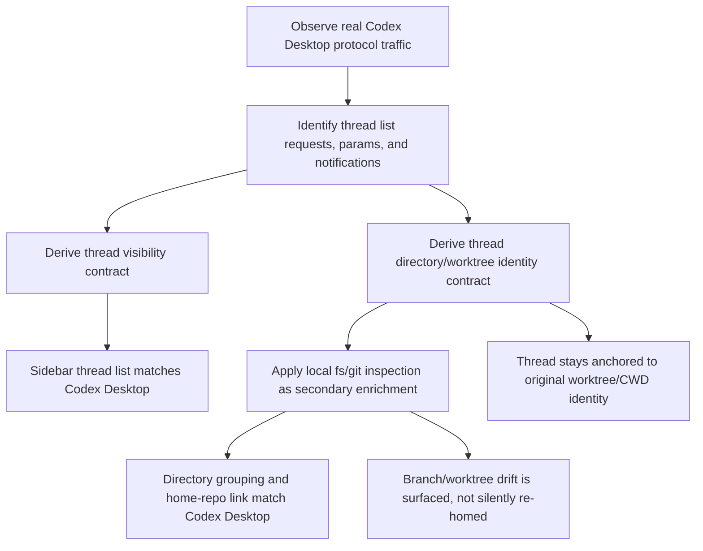

# Codex Desktop Protocol Parity

## Problem Frame

The desktop app previously matched Codex Desktop more closely for directory grouping and home-repo/worktree linking, but it achieved that by reading rollout files directly. That is not an acceptable integration boundary. The replacement must recover the same user-visible grouping quality using supported Codex app-server behavior plus local filesystem and git inspection where appropriate.

This is not primarily a startup optimization problem anymore. It is a protocol-parity problem. The app needs to determine which non-archived threads Codex Desktop actually surfaces, which directory/worktree identity each thread belongs to, and how Codex Desktop derives the home repo link for worktree-backed threads, all without reading rollout files.

## Requirements

**Protocol Source of Truth**
- R1. The desktop app must restore Codex Desktop parity for thread visibility, directory grouping, and home-repo/worktree linking using supported protocol behavior rather than rollout-file reads.
- R2. Real Codex Desktop protocol traffic is the source of truth for this work, even if the relevant fields or request variants are not yet documented elsewhere in the repo.
- R3. The desktop Codex client must not read rollout files or use rollout-path metadata as an identity fallback.
- R4. The app must determine the startup/sidebar-visible Codex thread set from supported app-server requests, responses, and notifications rather than from local transcript or rollout inspection.

**Thread Visibility and Selection**
- R5. The visible non-archived Codex thread set shown by the desktop app must match what Codex Desktop shows for the same account and state.
- R6. When request variants, params, or notifications affect which threads are visible, the desktop app must mirror the Codex Desktop contract rather than approximating it with local heuristics.
- R7. Directory grouping must be correct immediately from startup/sidebar thread-list data; correctness must not depend on opening a thread first with `thread/read`.

**Directory Identity and Grouping**
- R8. Each thread is anchored to the worktree/CWD identity that Codex associated with that thread; the app must not migrate a thread to another worktree just because the same branch exists elsewhere.
- R9. The app must reproduce Codex Desktop’s grouping of threads under directories and the correct home-repo/worktree relationship for worktree-backed threads.
- R10. The app may use local filesystem and git inspection as a secondary step after protocol establishes a thread’s canonical directory identity.
- R11. Local filesystem and git inspection may enrich grouping and linking, but must not replace protocol as the primary source of thread identity.

**Drift and Divergence**
- R12. If local git inspection shows that the currently checked-out branch or repo state for the anchored directory has diverged from what Codex last knew, the app must surface that divergence to the user.
- R13. Divergence detection must annotate the anchored thread association rather than silently re-home the thread to a different worktree or directory group.
- R14. If protocol-derived association and local inspection disagree, the app must preserve the protocol-chosen association and present local drift as an explicit state difference.

**Verification and Follow-up**
- R15. Completion of this work means runtime behavior matches Codex Desktop for startup grouping and directory/home-repo linking; refreshing replay fixtures and E2E captures is a follow-up activity rather than part of the acceptance gate.
- R16. The work must still identify which unit tests, replay fixtures, or E2E scenarios became invalid after rollout-file access was removed, so follow-up fixture repair can be targeted instead of broad.

## Success Criteria

- On startup, the sidebar places Codex threads into the same directory groups Codex Desktop uses, without waiting for `thread/read`.
- Worktree-backed threads show the same home-repo/worktree relationship Codex Desktop shows.
- The desktop Codex client no longer reads rollout files at all.
- If a thread’s anchored worktree has drifted locally, the app surfaces that drift without reassigning the thread to a different worktree.
- Comparing the app against a real Codex Desktop session shows no meaningful mismatch in directory grouping for the same thread set.

## Scope Boundaries

- This work does not treat replay-fixture refresh as part of the acceptance gate, though it must identify what broke so fixture repair can follow.
- This work does not reintroduce rollout-file access in any form, including “temporary” fallbacks.
- This work does not allow local git inspection to move a thread from its anchored worktree/CWD to another worktree just because the branch exists there.
- This work does not require solving every possible thread metadata discrepancy across all backends; the focus is Codex Desktop parity.

## Key Decisions

- Protocol-first parity: runtime behavior must be driven by observed Codex Desktop protocol traffic rather than inferred from local files.
- Anchored thread identity: a thread belongs to its original worktree/CWD identity first, even if local git state later changes.
- Local enrichment is allowed: filesystem and git inspection may refine grouping and annotate drift after protocol identity is known.
- No silent re-homing: branch appearance in another worktree is not a reason to move a thread’s directory association.
- Runtime first: restoring live behavior is the definition of done; replay fixture repair comes after the runtime contract is understood.

## Dependencies / Assumptions

- Real Codex Desktop protocol traffic can be captured or otherwise observed from this repo’s existing desktop protocol tooling.
- The supported protocol surface already contains enough information to recover the correct thread visibility and directory identity contract, even if the relevant fields or request variants are not yet understood.
- Local git inspection can still be used safely as secondary enrichment for repo/worktree status and drift without violating the intended integration boundary.

## Outstanding Questions

### Deferred to Planning
- [Affects R4][Needs research] Which exact `thread/list`, `thread/loaded/list`, `thread/read`, and notification combinations Codex Desktop uses to derive the visible non-archived thread set?
- [Affects R7][Needs research] What concrete field or request variant provides enough startup/sidebar data to derive correct directory grouping before a thread is opened?
- [Affects R9][Needs research] Which protocol fields identify the home repo versus the active worktree for worktree-backed threads, and where does local git enrichment need to fill gaps?
- [Affects R12][Technical] How should drift be represented in the desktop UI so users can tell “Codex thought this thread belonged here, but the local branch/worktree state changed”?
- [Affects R16][Technical] Which broken unit tests, replay fixtures, or E2E expectations should be updated versus replaced once the runtime protocol contract is re-established?

## Next Steps

-> `/prompts:ce-plan` for structured implementation planning
