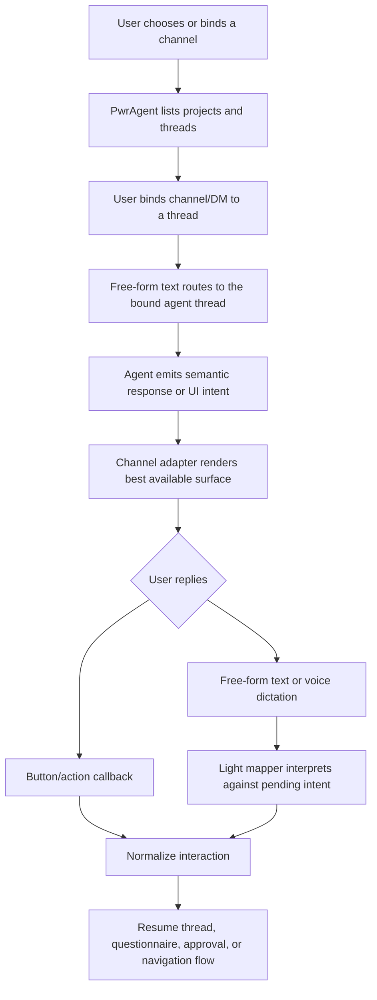

# Messaging Platform Integration

## Problem Frame

PwrAgent needs a messaging integration that lets a user operate agent threads from chat surfaces, including mobile and voice-driven situations where the user may not be at the desktop. The durable goal is to code from CarPlay through Siri, while still getting useful rich chat controls in Telegram, Discord, Mattermost, Feishu/Lark, and the broader channel set proven out by OpenClaw.

The integration should not make PwrAgent business logic depend on Telegram, Discord, Chat SDK, or OpenClaw-specific channel APIs. PwrAgent should own a semantic conversation surface contract. Channel adapters translate that contract into the best available platform rendering and return opaque routing state needed to continue the interaction.

## Requirements

**Owned Conversation Surface**
- R1. PwrAgent must define and own a channel-agnostic conversation surface contract for outbound messages, inbound events, bindings, routing state, and delivery results.
- R2. Product and agent workflow logic must target the PwrAgent surface contract only; it must not branch on Telegram, Discord, Mattermost, Feishu/Lark, or any other channel except through adapter-owned capability handling.
- R3. Outbound surface requests must be semantic intents, not platform payloads. The first version must cover `message`, `status`, `progress`, `thread_picker`, `project_picker`, `single_select`, `multi_select`, `questionnaire`, `approval`, `confirmation`, `error`, and `dismiss`-class intents.
- R4. Channel adapters must receive enough structured content to render text, markdown, code spans, code blocks, images, files, buttons, select-like choices, and navigation controls when supported.
- R5. Channel adapters must return opaque state for any managed surface or binding they create. PwrAgent may store and echo that state, but must not derive channel message IDs, callback IDs, thread IDs, or permission semantics from it.
- R6. Surface updates and dismissals must be best-effort. If an adapter cannot update an existing surface, it may post a fresh message and report the actual delivery outcome.

**Thread, Project, and Binding Behavior**
- R7. Users must be able to enumerate available projects and agent threads from a messaging channel.
- R8. Users must be able to bind a channel, DM, or platform-native thread to an existing PwrAgent agent thread.
- R9. Users must be able to start a new agent thread from a selected project through the messaging surface.
- R10. Once bound, ordinary free-form text in that conversation must route to the bound agent thread without requiring repeated commands.
- R11. Bindings must preserve enough channel routing state to reply to the same conversation after process restarts.
- R12. Bindings must be detachable or replaceable so a channel conversation can stop controlling a thread or switch to a different thread.

**Rich Interaction MVP**
- R13. The first milestone must target full workflow parity for Telegram and Discord, not just plain chat: thread/project pagination, back/forward navigation, plan mode questionnaires, approval prompts, status panels, markdown, code formatting, images, and button-driven choices are in scope. Rendering may differ by channel, but the user must be able to complete the same workflows.
- R14. Plan mode questionnaires must be operable through buttons when available and through free-form text when buttons are unavailable or inconvenient.
- R15. Approval prompts must make the pending action clear, support accept/decline/cancel-class decisions, and preserve enough context for free-form responses such as "yes for this session" or "no, explain why".
- R16. Thread and project pickers must support pagination and filtering without exposing channel-specific callback mechanics to the picker logic.
- R17. Long assistant responses must be chunked, summarized, or attached according to adapter policy while preserving the user's ability to continue the thread.

**Fallback and Light-Agent Mapping**
- R18. Every interactive prompt must have a text fallback that a user can respond to by voice dictation or ordinary text.
- R19. When a pending intent exists and the user responds with free-form text, PwrAgent should use a lightweight mapper to decide whether the user was trying to activate one of the offered controls or is changing direction.
- R20. If the mapper identifies a likely control choice, PwrAgent must normalize it into the same interaction envelope as a native button/action callback.
- R21. If the mapper identifies a new instruction instead of an interaction choice, PwrAgent must route the text to the bound agent thread as normal user input.
- R22. The mapper must be scoped to the pending intent and should not become a general autonomous agent that can mutate thread state outside the current interaction.

**Channel Coverage and Adapter Policy**
- R23. Telegram and Discord are the first testable adapters because they are configured and available for end-to-end validation.
- R24. The surface contract must be able to support the broader OpenClaw-style channel set over time, including Slack, Mattermost, Feishu/Lark, Google Chat, Microsoft Teams, Matrix, IRC, iMessage, Signal, WhatsApp, Line, Zalo, Nextcloud Talk, Synology Chat, Twitch, Nostr, QQ Bot, BlueBubbles, Tlon, and voice-call style channels.
- R25. Adapters may expose richer channel-native rendering over time, but those improvements must be expressed by extending the generic surface contract or adapter policy, not by pushing channel-specific logic into thread/project/questionnaire flows.
- R26. Channel adapters must own platform limits, markdown dialect conversion, media upload constraints, button count limits, callback payload limits, message edit support, and permission degradation.
- R27. Channels with weak interaction support must still be usable through text fallback, numeric choices, and light-agent mapping.

**Chat SDK Decision**
- R28. The first implementation must not depend on Vercel Chat SDK as a runtime abstraction.
- R29. Chat SDK may remain research input for adapter ideas, but PwrAgent should not wrap its cards/actions/thread APIs for the MVP because current maturity concerns include open issues or PRs around markdown support and image/media attachment behavior.
- R30. If Chat SDK becomes materially more mature later, it may be reconsidered as an implementation detail behind the PwrAgent adapter boundary, without changing product workflow logic.

**Security and Authorization**
- R31. Channel binding must be authorized before a messaging conversation can control a PwrAgent thread.
- R32. The authorization model must distinguish at least the channel account/bot identity, the human sender identity when available, and the target PwrAgent thread owner or allowed operator.
- R33. Adapters must treat inbound channel payloads, callback data, free-form text, media, and opaque state as untrusted input.
- R34. Secrets and channel credentials must stay outside transcripts, logs, callback payloads, and user-visible fallback text.
- R35. The system must provide a way to revoke bindings and invalidate stale pending intents or callback state.
- R36. Security-sensitive actions such as approval decisions must preserve the acting user identity and enough audit context for later inspection.

**Future iOS App**
- R37. The future iOS React Native app is not required for the first milestone.
- R38. The surface contract should not preclude a first-party iOS app from acting as either a normal channel adapter or a richer remote-view client later.
- R39. Decisions about a full remote-view protocol are deferred; the messaging MVP should solve conversation control and rich intent rendering first.

## Success Criteria

- An authorized user can bind Telegram or Discord to a PwrAgent thread, drive the thread with ordinary text, and complete rich flows such as thread selection, project selection, approvals, and plan questionnaires.
- The same thread/project/questionnaire logic runs for Telegram and Discord without channel-specific branches outside the adapter layer.
- Free-form text responses to pending buttons or choices are handled correctly often enough to support voice-dictated use.
- Markdown, code formatting, images, and long responses render acceptably within each channel's limits.
- The design can add Feishu/Lark or Mattermost later by implementing a new adapter, without rewriting thread, project, binding, questionnaire, or approval logic.

## Scope Boundaries

- In scope: PwrAgent-owned semantic surface contract, channel binding behavior, Telegram and Discord MVP behavior, rich intent fallback, and light-agent response mapping.
- In scope: high-level adapter policy for the broader OpenClaw-style channel set.
- Out of scope: using Chat SDK as the MVP runtime abstraction.
- Out of scope: implementing every OpenClaw channel in the first milestone.
- Out of scope: a first-party iOS app, CarPlay-specific UI, or a full remote-view protocol.
- Out of scope: channel-specific schemas, database migrations, endpoint layouts, SDK package choices, and exact wire types; those belong in planning.

## Key Decisions

- Own the core interface: PwrAgent should own the semantic conversation surface because the product goal is remote agent control, not generic bot portability.
- Start rich, not text-only: the MVP should prove full workflow parity on Telegram and Discord so the abstraction is shaped by real workflows rather than a narrow chat echo path.
- Use direct adapters first: Chat SDK should not be a runtime dependency for the MVP due to maturity concerns around markdown and media behavior.
- Normalize free-form fallback through a light mapper: voice and driving use cases require buttons to be optional, not mandatory.
- Treat channel state as opaque: adapter-owned routing state prevents PwrAgent workflows from depending on fragile platform identifiers or callback formats.

## Dependencies / Assumptions

- Existing PwrAgent app-server and navigation contracts already expose thread summaries, project/directory grouping, pending input, plans, images, and thread turn routing that can inform the messaging surface.
- The copied OpenClaw source brainstorm in `docs/brainstorms/2026-04-30-openclaw-codex-conversation-ui-intent-interface-source.md` is valid context for semantic intents, opaque surface IDs, and best-effort lifecycle semantics.
- Telegram and Discord credentials are available to the user for manual end-to-end validation.
- The broader OpenClaw channel list is a target compatibility horizon, not a first-release adapter list.

## Outstanding Questions

### Resolve Before Planning

- None.

### Deferred to Planning

- [Affects R1][Technical] Where the surface contract should live in the PwrAgent package split so desktop, app-server, and future mobile clients can share it cleanly.
- [Affects R5][Technical] What persistence model should store bindings, opaque surface state, pending intent state, and restart recovery metadata.
- [Affects R13][Needs research] Which Telegram and Discord SDKs or APIs should be used directly for webhook/polling, markdown conversion, media upload, and interactive callbacks.
- [Affects R18][Technical] What prompt, model, latency budget, and deterministic fallback rules should the light mapper use.
- [Affects R31][Technical] What first-release authorization policy should gate binding, approval decisions, and thread control from external channels.
- [Affects R24][Needs research] Which OpenClaw channel adapters can be ported or referenced safely, and which channels need fresh implementations.
- [Affects R38][Technical] What boundary would let the future iOS app reuse the same semantic surface while optionally adding richer remote-view behavior.

## Alternatives Considered

| Approach | Decision | Rationale |
| --- | --- | --- |
| Use Chat SDK as the primary abstraction | Rejected for MVP | It has useful ideas and some relevant adapters, but current maturity concerns around markdown and media make it risky as the core runtime boundary. |
| Port OpenClaw's channel/plugin shape directly | Rejected as default | OpenClaw proves the channel set and intent direction, but PwrAgent should avoid inheriting channel-coupled Codex plugin behavior. |
| Build PwrAgent-owned semantic surface with direct Telegram/Discord adapters | Selected | This keeps agent workflows stable, proves rich controls early, and leaves room to add Mattermost, Feishu/Lark, and mobile clients behind the same boundary. |

## Next Steps

→ /prompts:ce-plan for structured implementation planning
