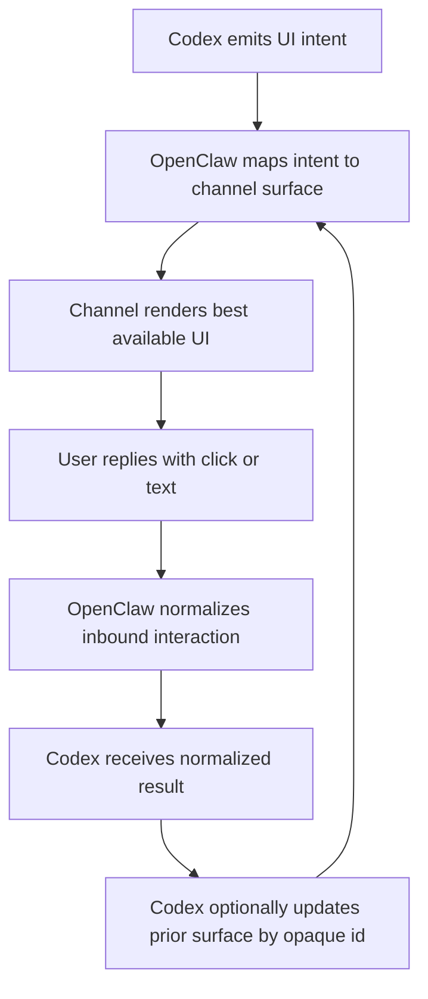

# OpenClaw Codex Conversation UI Intent Interface Source

This file is a repo-local copy of the OpenClaw brainstorm that informed the
PwrAgent messaging platform integration requirements. It is retained as source
context only; the PwrAgent design should not inherit OpenClaw's channel-coupled
implementation shape.

## Problem Frame

The current native Codex conversation binding can route plain text between OpenClaw conversations and Codex app-server threads, but richer interactive behavior is fragmented. The older external `openclaw-codex-app-server` plugin proved that chat-bound Codex control is useful, but it crossed channel boundaries directly by owning Telegram and Discord client behavior. That shape is brittle against plugin SDK and channel runtime changes.

The new interface should let Codex express interactive conversational UI in a channel-agnostic way while OpenClaw remains the owner of channel rendering, callback handling, message lifecycle, and capability degradation.

## Requirements

**Intent Model**
- R1. The interface must be intent-first: Codex emits semantic conversational UI intents rather than Telegram-, Discord-, or channel-specific payloads.
- R2. The first version must support the full interactive chat surface, including at least `message`, `confirm`, `single_select`, `multi_select`, `status`, `questionnaire`, `approval`, `progress`, `error`, and `dismiss`-class intents.
- R3. Codex must remain the source of truth for canonical user-facing copy for every intent; OpenClaw may reshape layout and add renderer-required affordances, but must not replace the underlying interaction text.

**Surface Lifecycle**
- R4. The renderer must be able to return an optional opaque `surfaceId` for any rendered intent.
- R5. The interface must allow unmanaged replies by explicitly supporting the absence of a `surfaceId`.
- R6. Codex must be able to reference a previously returned `surfaceId` when requesting updates or dismissal of a prior surface.
- R7. `surfaceId` values must be renderer-owned and opaque to Codex; Codex may store and echo them back, but must not derive meaning from their contents.

**Update and Fallback Behavior**
- R8. Surface updates must be best-effort rather than strict: when Codex targets an existing `surfaceId`, OpenClaw should try to replace or update that surface if the channel supports it.
- R9. If an update cannot be applied, OpenClaw may fall back to presenting a fresh message without treating the original `surfaceId` as invalid.
- R10. A fallback-posted fresh message must not require automatic `surfaceId` rotation; Codex may continue attempting to use the original `surfaceId` on future updates.
- R11. The renderer must report a delivery result back to Codex indicating what actually happened, including outcomes such as `updated`, `presented_new`, `dismissed`, `fallback_posted`, or `unsupported`.

**Inbound Interaction**
- R12. OpenClaw must normalize inbound user interaction into a single callback envelope that can carry either a scalar identifier/value or a structured payload.
- R13. The normalized inbound shape must support callbacks originating from both explicit channel interaction affordances and text-only fallbacks such as typed numeric or textual responses.
- R14. Channel adapters may preserve as much structure as they can, but Codex must be able to consume a single normalized interaction format regardless of the original channel behavior.

**Channel Ownership and Capability Handling**
- R15. Codex must not receive channel-specific capability details such as button counts, label limits, select menu limits, or repaint semantics.
- R16. OpenClaw must own capability matching, truncation, degradation, and text fallback behavior based on channel support and policy.
- R17. The contract must allow OpenClaw to decline managed surfaces or richer interaction forms when channel support, account configuration, or permissions do not allow them.

## Success Criteria

- Codex can express interactive conversation flows once, without branching on Telegram, Discord, or other channel details.
- OpenClaw can render the same intent appropriately on rich and weak channel surfaces, including text-only fallback paths.
- Conversation-bound Codex workflows such as thread selection, bind confirmation, status/control panels, approvals, and multi-step questionnaires can move onto the native harness without direct access to channel API keys.
- Planning for the implementation can proceed without inventing the core contract boundary between Codex and channel renderers.

## Scope Boundaries

- This brainstorm defines the product and interface contract, not the wire format, TypeScript types, storage schema, or migration plan.
- This brainstorm does not define translation/localization strategy beyond preserving Codex as the canonical copy source.
- This brainstorm does not require the first implementation to expose a low-level widget API directly to Codex.
- This brainstorm does not require Codex to learn channel capability matrices or channel-native message ids.

## Key Decisions

- Intent-first contract: Codex emits semantic UI intents, and OpenClaw renders them per channel because channel-specific payload ownership belongs on the OpenClaw side.
- Full-surface first version: the interface should cover not just selection and confirmation, but also status/control, questionnaires, approvals, progress, and dismissal so the contract does not need an immediate second redesign.
- Opaque optional surface ids: renderer-owned handles avoid leaking channel message identity and lifecycle rules into Codex.
- Best-effort update semantics: missing edit support, transient failures, or permission limits should degrade to fresh messages instead of turning surface targeting into a fragile protocol.
- Canonical text stays with Codex: OpenClaw may annotate or degrade presentation, but should not become the author of interaction copy.
- No capability object exposed to Codex: OpenClaw already owns channel capability and interactive payload layers, so Codex should over-emit semantically rich intents and let OpenClaw degrade them.

## Dependencies / Assumptions

- Existing generic interactive payload machinery in `src/interactive/payload.ts` can inform but should not constrain the new semantic contract.
- Existing channel capability handling in `src/config/channel-capabilities.ts` and channel renderers can remain OpenClaw-owned.
- The native Codex harness described in `docs/plugins/codex-harness.md` remains the target runtime path for future conversation-bound Codex control.

## Outstanding Questions

### Resolve Before Planning

- None.

### Deferred to Planning

- [Affects R2][Technical] Whether the semantic intent model should compile into the existing block-based `InteractiveReply` / `MessagePresentation` types or replace them with a new intermediate representation.
- [Affects R4][Technical] Where renderer-owned `surfaceId` mappings should live, including expiry, garbage collection, and cross-process persistence expectations.
- [Affects R11][Technical] The exact delivery result schema and which outcomes must be durable versus best-effort telemetry.
- [Affects R12][Technical] The exact normalized callback envelope shape, including how text fallback, scalar values, and structured payloads co-exist.
- [Affects R17][Needs research] Which existing channel surfaces can support managed updates, dismissal, or interactive affordances without extra permissions or config changes.
- [Affects R3][Needs research] How localization should eventually layer onto Codex-owned canonical copy without moving copy authorship back into channel renderers.

## Next Steps

Source context only.
