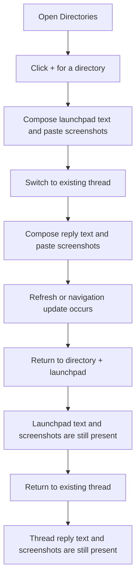

# Desktop Composer Draft Persistence Regression

## Problem Frame

Unsent composer content in the desktop app is user data. A user can start a Directories launchpad draft with screenshots and text, switch to an existing thread, add text and screenshots there, and then return to find the draft partially or entirely gone. This is unacceptable because the app is losing work before the user has sent it.

The regression appears concentrated around the current Tiptap composer path and around refresh/navigation boundaries. Existing coverage verifies some adjacent behavior, but it does not exercise the full end-to-end workflow that failed: Directories `+` launchpad plus pasted images plus text, switching to a real thread with its own unsent text and images, and returning after refresh-capable navigation events.

## Requirements

**Draft Persistence Contract**
- R1. Unsent Directories launchpad prompt text must survive switching away from the launchpad and reopening the same directory `+` entrypoint.
- R2. Unsent Directories launchpad pasted image attachments must survive switching away from the launchpad and reopening the same directory `+` entrypoint.
- R3. Launchpad text and image attachments must be persisted as one coherent draft state; navigation must not preserve one while losing the other.
- R4. Unsent existing-thread reply text must survive switching to another thread, opening settings, returning from settings, and navigation refreshes.
- R5. Unsent existing-thread reply image attachments must survive switching to another thread, opening settings, returning from settings, and navigation refreshes.
- R6. Existing-thread reply text and image attachments must be retained together; refresh or rerender paths must not clear both, clear only text, or clear only images.

**Tiptap Primary Path**
- R7. The Tiptap composer variants currently used by the desktop app must be first-class in persistence behavior, not treated as secondary alternatives to the textarea implementation.
- R8. Draft persistence tests must assert the canonical draft value exposed by the Tiptap editor as well as visible attachment chips/previews.
- R9. Persistence behavior must be equivalent across plain text, skill-token text, and multiline Tiptap content unless a specific composer mode documents an intentional limitation.

**Refresh and Race Resistance**
- R10. A sidebar/navigation refresh must not overwrite newer local unsent composer state with older launchpad or thread state.
- R11. Debounced launchpad autosave must not create a window where a fast navigation preserves pasted images but loses the prompt text.
- R12. Image normalization that completes after the user switches away must attach the image to the original composer scope without overwriting newer text for that scope.
- R13. Sticky launchpad settings updates must not reset prompt text or image attachments for the active launchpad.

**Regression Coverage**
- R14. Add a desktop E2E that reproduces the reported workflow using the Tiptap composer: open Directories, click `+`, enter text, paste at least one image, switch to an existing thread, enter text, paste at least one image, return to the launchpad, and assert both text and images remain.
- R15. The same E2E must return to the existing thread and assert its unsent text and pasted image attachments remain.
- R16. The E2E must include a refresh-capable boundary, such as a replayed thread lifecycle/navigation update or an explicit navigation snapshot refresh, before the final assertions.
- R17. Unit or component coverage may remain, but it is not sufficient by itself; this regression requires an app-level test because the failure crosses composer, navigation, persistence, and refresh behavior.

## Success Criteria

- The reported workflow no longer loses text or screenshots in either the Directories launchpad or existing-thread reply composer.
- Tiptap is covered directly in the regression tests.
- A navigation refresh cannot wipe unsent composer state.
- Launchpad sticky settings can change without resetting unsent launchpad text or images.
- The E2E suite fails if launchpad text is dropped while screenshots survive, or if existing-thread text and screenshots are dropped after switching away and back.

## Scope Boundaries

- This work does not redesign the composer UI.
- This work does not add multiple launchpad drafts per directory.
- This work does not change the send semantics for turning a launchpad into a real thread.
- This work does not require cross-app restart persistence for existing-thread reply drafts unless planning determines that is already intended behavior.
- This work does not broaden image support beyond the existing pasted-image attachment behavior.

## Key Decisions

- Treat unsent composer content as user data: Draft text and images must be protected with the same seriousness as sent transcript content until the user sends or explicitly clears them.
- Test Tiptap first: The app is now primarily using Tiptap, so regression protection must exercise Tiptap rather than relying on textarea-only coverage.
- Require app-level coverage: Component tests are useful, but they did not catch this regression because refresh and navigation participate in the failure.
- Preserve coherent draft state: The system must avoid partial persistence where screenshots survive but text does not, or where text survives but images do not.

## Dependencies / Assumptions

- The desktop app can already run replay-backed Electron E2Es for navigation and composer workflows.
- Existing Tiptap E2Es cover skill and formatting behavior, but current coverage does not appear to cover the reported combined Tiptap text-plus-image persistence workflow.
- Existing launchpad component tests cover image persistence on the default composer path, but those tests do not substitute for a Tiptap app-level regression.

## Outstanding Questions

### Deferred to Planning
- [Affects R3, R10-R12][Technical] Should launchpad text autosave become immediate on scope switch, should autosave state be flushed before navigation selection changes, or should navigation merge newer local draft state after refresh?
- [Affects R4-R6][Technical] Should existing-thread reply drafts remain renderer-session state, move into the same overlay persistence layer as launchpads, or use a separate scoped draft store?
- [Affects R16][Technical] What is the most deterministic replay event for proving that navigation refresh cannot wipe the active and inactive composer drafts?
- [Affects R13][Technical] Which sticky setting updates currently cause launchpad rerenders, and which ones can reset Tiptap editor state?

## Next Steps

-> `/prompts:ce-plan` for structured implementation planning
