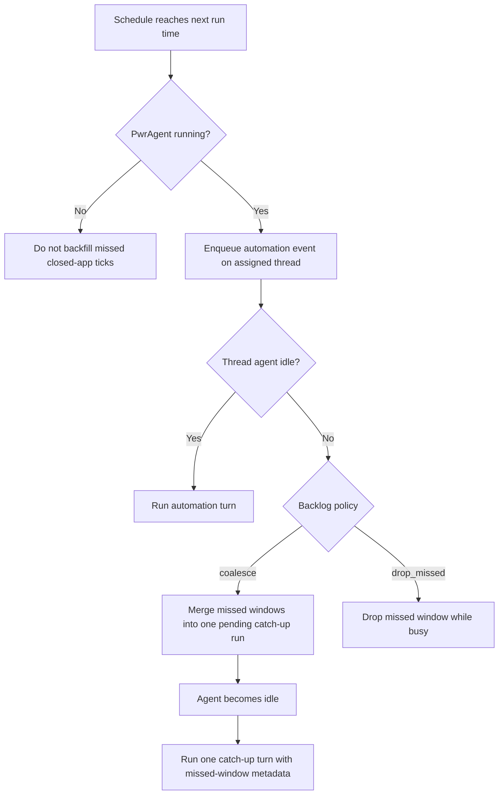

# Automation Scheduling

## Problem Frame

PwrAgent should support intentional recurring automations without pretending
that an agent can run overlapping work on the same thread. A scheduled
automation belongs to a thread, fires while the desktop app is running, and
enters the same serial queue as manual user messages for that thread. If the
agent is already working, the automation's configured backlog policy decides
whether missed schedule windows are coalesced into one catch-up run or dropped.

The design should make contention visible instead of surprising. A user should
understand that interacting manually with an automation thread is possible, but
that doing so changes the same context and queue that scheduled work depends on.

## Requirements

**Scheduling Model**
- R1. Users must be able to create recurring automations assigned to an existing
  thread.
- R2. V1 schedule inputs must support friendly interval and calendar-style
  schedules such as "every 5 minutes", "hourly", "weekdays at 9 AM", and
  "Fridays at 4 PM"; raw cron is out of scope for the first version.
- R3. Scheduled automation ticks must run only while the desktop app is running.
  If PwrAgent is closed, missed ticks are not replayed on the next launch.
- R4. Each automation must expose next run, last run, enabled/paused state, and
  the assigned thread.

**Serial Queue Contract**
- R5. A thread must execute at most one agent turn at a time across manual
  messages and scheduled automation runs.
- R6. Manual messages and scheduled automation runs must share a single FIFO
  queue ordered by enqueue time.
- R7. The UI and copy must state that automation threads are normal threads, but
  manual interaction changes the same context and queue used by the automation.
- R8. Users must be able to inspect an automation thread to ask what happened,
  while receiving clear affordances that the thread is primarily scheduled work.

**Backlog Policies**
- R9. Each automation must choose one of two backlog policies:

  | Policy | Behavior | Best For |
  |---|---|---|
  | `coalesce` | Missed windows while the thread is busy collapse into one pending catch-up run. | Work that should catch up on elapsed time without running every stale tick. |
  | `drop_missed` | Ticks that fire while the thread is busy are skipped. | Freshness-oriented checks where stale runs are not useful. |

- R10. `coalesce` must be the default backlog policy.
- R11. When `coalesce` creates a catch-up run, the agent prompt must include
  explicit missed-window metadata, such as which scheduled times were collapsed
  and why the run is executing once now.
- R12. While a coalesced catch-up run is pending, later missed ticks for the
  same automation must merge into that pending run rather than creating
  additional queued automation runs.
- R13. When `drop_missed` skips a tick, the UI must preserve enough history for
  the user to see that the schedule fired and was skipped because the assigned
  thread was busy.
- R14. The first version must not offer a "run every missed tick" backlog mode.

**Management Surfaces**
- R15. The primary management surface must be thread-first: an assigned thread
  shows its automations, next run, pending/coalesced state, last run, pause or
  resume, run now, and delete.
- R16. "Run now" must enqueue an explicit automation run on the same thread FIFO
  queue; it must not bypass an in-flight manual message or scheduled run.
- R17. A secondary global Automations view must list automations across threads
  for discovery and status scanning, while preserving the thread assignment as a
  first-class column or grouping.
- R18. The global view may remain secondary in V1, but it must not imply that
  automations are detached from thread queues.

**Run History and Auditability**
- R19. Automation history must distinguish completed runs, failed runs, skipped
  ticks, pending coalesced catch-up runs, and manually-triggered runs.
- R20. Run history must be visible from the thread context where the automation
  executes.
- R21. A user inspecting a catch-up run must be able to see which schedule
  windows were covered by that run.

**Deferred Personality Profiles**
- R22. V1 does not need to implement automation personality profiles.
- R23. The requirements and later UI copy should leave room for future
  thread-level personality profiles, including short context files such as
  `SOUL.md`, but must warn that long instruction bundles degrade usefulness.
- R24. Future personality guidance should recommend keeping the total custom
  instruction footprint around 300 lines or less across personality/context
  files.

## Success Criteria

- A user can schedule "check email every 5 minutes" on a thread and understand
  exactly what happens when one run takes 8 minutes.
- No schedule can cause overlapping turns on the same thread.
- The default `coalesce` behavior produces one visible catch-up run for missed
  windows rather than accumulating stale work indefinitely.
- `drop_missed` gives users a clear freshness-oriented alternative without
  adding a large policy matrix.
- Manual messages, scheduled runs, run history, and coalesced/skipped state are
  visible enough that users can debug "what happened?" without reading logs.

## Scope Boundaries

- In scope: local desktop scheduling while PwrAgent is running, recurring
  interval/calendar schedules, per-automation backlog policy, serial thread queue
  semantics, thread-first management, secondary global visibility, and run
  history.
- Out of scope for V1: raw cron entry, cloud or daemon scheduling while the app
  is closed, replaying missed closed-app ticks, detached background automation
  runs, "run every missed tick" backlog mode, automation-specific priorities,
  and personality profile management.
- Out of scope: changing existing manual turn semantics except where manual
  messages share the same per-thread serial queue with automation runs.

## Key Decisions

- Automations are assigned to threads: this reinforces that scheduled work runs
  through a concrete agent context, not an invisible background worker.
- One serial queue per thread: this makes contention understandable and avoids
  overlapping agent runs.
- FIFO across manual and scheduled input: this keeps the first version honest and
  predictable.
- `coalesce` default with `drop_missed` option: this gives users a useful policy
  choice without exposing a high-risk "run all stale ticks" backlog.
- Local-only V1: scheduled ticks require the desktop app to be running; no
  launch-time backfill and no background service are required.
- Personality profiles are deferred: they are important future context controls,
  but they should not expand the scheduling MVP.

## Dependencies / Assumptions

- Existing PwrAgent turn-admission and permission-mode queue work provides
  product precedent for visible queuing instead of pretending mid-turn changes or
  follow-ups apply immediately.
- Codex exposes personality fields in its protocol, but this repo does not yet
  have a `SOUL.md` product convention; personality profile behavior should be
  defined later instead of assumed in scheduling V1.

## Alternatives Considered

| Alternative | Decision | Rationale |
|---|---|---|
| Coalesce-only policy | Rejected | Simpler, but users also need an explicit freshness-over-catch-up mode. |
| Full OpenClaw-style policy matrix | Deferred | More expressive, but too much v1 UI/support surface for the core scheduling story. |
| Detached background runs | Rejected for V1 | Useful later, but weaker for explaining serial agent queues and thread context. |
| Cron-first schedules | Rejected for V1 | Precise, but less aligned with the intended user-facing mental model. |
| Backfill missed closed-app ticks | Rejected for V1 | Creates surprising launch-time work and implies scheduler durability that local desktop scheduling does not provide. |

## Source Context

- OpenAI Codex Automations frames scheduled tasks as recurring Codex work that
  can run from a conversation context: https://openai.com/academy/codex-automations/
- OpenClaw command queue docs describe explicit queue modes including collect,
  debounce, caps, and overflow behavior: https://docs.openclaw.ai/concepts/queue
- OpenClaw task docs distinguish background task tracking from ordinary command
  queueing: https://docs.openclaw.ai/automation/tasks
- PwrAgent has adjacent queue precedents in
  `docs/plans/2026-05-03-001-fix-messaging-turn-admission-plan.md`,
  `docs/plans/2026-05-07-001-feat-codex-single-instance-queued-permissions-plan.md`,
  and `docs/plans/2026-05-09-001-feat-messaging-rate-limit-slow-mode-plan.md`.

## Outstanding Questions

### Resolve Before Planning

- None.

### Deferred to Planning

- [Affects R2][Technical] How friendly interval/calendar schedule input should
  be parsed and validated.
- [Affects R5-R6][Technical] Whether the existing thread admission queue can be
  extended for scheduled runs or needs a scheduler-owned admission layer.
- [Affects R11-R13][Technical] Exact run-history persistence and display model
  for skipped and coalesced schedule windows.
- [Affects R15-R18][Design] Exact thread-first and global Automations view layout
  in the desktop UI.

## Next Steps

→ `/prompts:ce-plan` for structured implementation planning.
