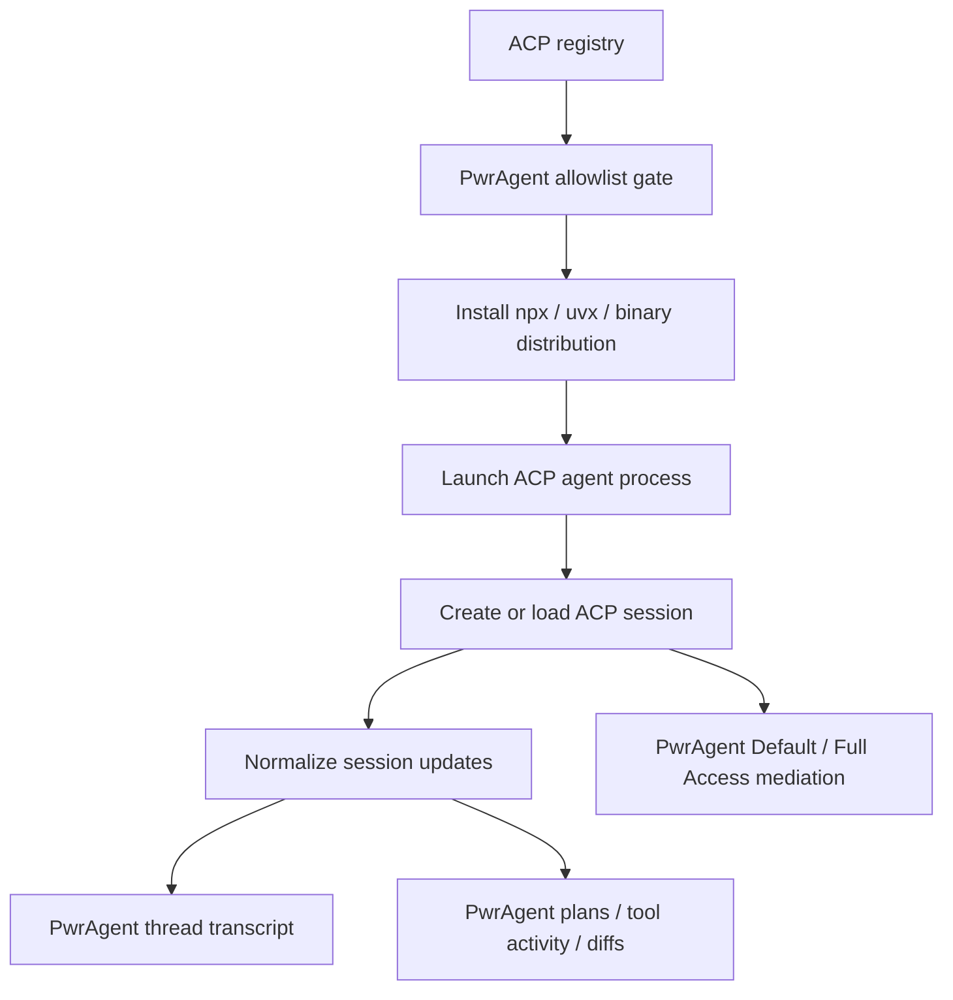

# ACP Registry Backends

## Problem Frame

PwrAgent already treats Codex and Grok as thread-oriented coding backends with
shared desktop UI, messaging, workspace, and access-mode behavior. Agent Client
Protocol (ACP) creates a different expansion path: instead of adding more raw
model providers to Agent Core, PwrAgent can host external ACP-compatible coding
agents as first-class backends.

The first useful product outcome is registry-backed ACP agent installation and
execution. Users should be able to discover allowed ACP agents from the public
registry, install them through PwrAgent, authenticate them when required, start
threads against them, and see their messages, plans, tool activity, file
changes, terminal work, and cancellation state through the same thread-first
experience they use for Codex and Grok.

## Requirements

**Registry and Discovery**
- R1. PwrAgent must fetch ACP registry metadata from the public registry and
  present ACP-compatible agents as installable options only when they pass a
  PwrAgent-controlled allowlist.
- R2. The allowlist must be configurable before launch so PwrAgent can support
  full registry distribution mechanics without exposing every registry entry to
  users.
- R3. Registry entries must show enough trust and provenance information for a
  user to make an informed install decision, including agent name, description,
  version, authors, license, repository or website links, distribution type, and
  authentication requirements when known.
- R4. PwrAgent must treat registry availability as dynamic. A stale or
  unreachable registry must not break already-installed ACP agents.

**Installation and Authentication**
- R5. PwrAgent must support all ACP registry distribution types in scope for the
  registry format: `npx`, `uvx`, and platform-specific binary distributions.
- R6. Binary distribution support must include download, archive extraction for
  supported archive formats, executable resolution, and launch preparation for
  the current platform.
- R7. PwrAgent must record install provenance for every ACP agent, including
  registry id, version, distribution source, resolved package or archive URL,
  install time, and the allowlist rule that permitted installation.
- R8. Installing or launching any ACP registry agent must require explicit user
  confirmation before PwrAgent executes third-party code for the first time.
- R9. ACP authentication flows must be surfaced as a normal setup state. PwrAgent
  must support both agent-managed auth flows and terminal auth flows for agents
  that advertise them.
- R10. Failed installs, unsupported platform targets, missing launch tools, and
  auth failures must leave the agent in a clear unavailable state with a
  recoverable retry path.
- R11. For binary downloads, PwrAgent must verify checksums or signatures when
  registry metadata provides them. When registry metadata lacks verifiable
  integrity data, the allowlist must explicitly permit that agent/version and
  the install UI must disclose the unverified binary source.

**Backend and Thread Model**
- R12. Each installed ACP agent must appear as its own backend in PwrAgent,
  using the registry agent name as the user-facing backend label rather than a
  single generic "ACP" backend.
- R13. ACP agent threads must participate in the same top-level browsing model
  as Codex and Grok threads, including thread creation, reading, active turn
  state, interruption or cancellation where supported, and backend labels on
  thread rows and chips.
- R14. ACP sessions, session lists, session loads, and session resumes must be
  normalized into PwrAgent's existing thread model without making Agent Core the
  owner of external ACP agent behavior.
- R15. ACP session updates must render in the existing transcript surfaces as
  messages, plans, tool activity, terminal activity, file activity, and reviewable
  status where the ACP event stream provides enough information.
- R16. ACP agent capabilities must be reflected honestly. Unsupported features
  such as resume, session close, terminal access, filesystem access, or mode
  switching must be unavailable or hidden for that specific backend instead of
  papered over.

**Access Modes and Trust Boundaries**
- R17. ACP backends must use PwrAgent's existing Default Access and Full Access
  model wherever ACP gives the client control over filesystem, terminal, or
  permission-request behavior.
- R18. In Default Access, PwrAgent must mediate ACP client-owned file writes,
  terminal creation, and permission requests through the same user-visible
  access posture users already understand for Codex.
- R19. In Full Access, PwrAgent may grant broader filesystem and terminal
  execution behavior, but the selected mode must be visible on the thread and
  preserved across thread/session lifecycle events where possible.
- R20. PwrAgent must clearly distinguish actions it can enforce through ACP
  client-owned APIs from actions an ACP agent performs internally and merely
  reports as tool activity.
- R21. Registry install and backend detail UI must communicate that ACP agents
  are third-party executables and may have their own internal tool execution or
  credential behavior outside PwrAgent's direct mediation.

**Scope and Product Fit**
- R22. The first ACP integration is a PwrAgent client adapter for external ACP
  agents, not an ACP export layer for PwrAgent's own Grok-backed Agent Core.
- R23. ACP must not replace the normalized PwrAgent backend contract. It should
  feed that contract so existing desktop UI, messaging, thread browsing, and
  workspace behavior continue to work.
- R24. Adding ACP must not be positioned as instant raw-model access. The user
  value is access to compatible coding agents, some of which may themselves
  expose multiple models.

## Success Criteria

- A user can browse the allowlisted ACP registry entries, inspect provenance and
  install information, and install an allowed agent.
- PwrAgent can install and launch ACP agents from `npx`, `uvx`, and supported
  binary distributions on the current platform.
- Installed ACP agents retain provenance records, and binary installs disclose
  whether their downloaded archive was cryptographically verified.
- Each installed ACP agent appears as its own backend next to Codex and Grok.
- A user can create a thread against an installed ACP backend, send a prompt,
  observe streamed messages, plans, tool calls, file changes, terminal activity,
  and cancel or interrupt where the agent supports it.
- Default Access and Full Access apply to ACP client-owned filesystem,
  terminal, and permission flows, with clear visibility into what PwrAgent can
  and cannot enforce.
- Existing Codex and Grok behavior remains unchanged except for shared UI
  surfaces that intentionally become backend-extensible.

## Scope Boundaries

- This work does not add new raw LLM providers to Agent Core.
- This work does not make Agent Core speak ACP for external clients.
- This work does not expose every public registry entry by default; launch
  exposure is controlled by PwrAgent's allowlist.
- This work does not claim PwrAgent can sandbox or mediate behavior an ACP agent
  performs internally outside ACP client-owned filesystem and terminal APIs.
- This work does not require ACP agents to support every PwrAgent backend
  capability; capability gaps should be represented per backend.

## Key Decisions

- Client adapter first: PwrAgent should consume ACP agents before exporting its
  own Agent Core over ACP.
- Registry-backed from the start: the first product slice should include the ACP
  registry rather than only manual command configuration.
- Full distribution mechanics with allowlist exposure: PwrAgent should support
  `npx`, `uvx`, and binary registry distribution types while gating which agents
  are visible or launchable before product launch.
- Installed ACP agents are individual backends: users should see "Claude Agent",
  "Gemini CLI", "OpenCode", or similar labels alongside Codex and Grok.
- PwrAgent access modes remain authoritative: Default Access and Full Access are
  the user-facing permission model for ACP client-owned filesystem, terminal,
  and permission flows.
- ACP is an ecosystem-agent path, not a model-provider shortcut: additional
  model access only arrives when a selected ACP agent exposes it.

## Dependencies / Assumptions

- ACP registry metadata is available from
  `https://cdn.agentclientprotocol.com/registry/v1/latest/registry.json`.
- The ACP registry format currently describes `npx`, `uvx`, and binary
  distribution types, including platform targets for binary packages.
- The registry currently requires listed agents to support user authentication,
  with agent-managed auth and terminal auth as supported registry auth methods.
- ACP client filesystem and terminal APIs give PwrAgent a direct enforcement
  point for file reads, file writes, and command execution when agents use those
  APIs.
- Some ACP agents may execute tools internally; PwrAgent can display reported
  tool activity but cannot guarantee mediation for behavior outside ACP
  client-owned APIs.
- The current PwrAgent backend kind model is specialized around Codex and Grok,
  so planning must decide how to represent dynamic installed ACP backends without
  weakening dependency boundaries.

## Alternatives Considered

| Alternative | Why not first |
|---|---|
| Manual ACP command configuration | Useful for a spike, but it misses the product goal of registry-backed discovery and install. |
| One generic ACP backend with an agent picker | Hides the identity and trust boundary of each third-party executable, and makes thread ownership less clear. |
| ACP export for Agent Core | Valuable later, but it does not answer the immediate question of what PwrAgent gains from ACP registry adoption. |
| Sandbox-only ACP support | Safer as a preview, but too limited to prove ACP coding-agent value because file and terminal work are central to the protocol. |

## Outstanding Questions

### Deferred to Planning

- [Affects R1-R4][Technical] Where should the allowlist live so it can be
  updated before launch without hard-coding every registry decision into the
  backend adapter?
- [Affects R5-R11][Needs research] Which installer/runtime prerequisites should
  PwrAgent manage directly versus detect and ask the user to install, especially
  for `npx`, `uvx`, archive extraction, executable permissions, and Windows
  platform behavior?
- [Affects R12-R16][Technical] How should dynamic ACP backend identifiers fit
  into contracts that currently model backend kind as Codex or Grok?
- [Affects R15][Needs research] Which ACP session update variants map cleanly to
  existing PwrAgent transcript entry types, and which require a new normalized
  entry shape?
- [Affects R17-R20][Technical] How should Default Access and Full Access map to
  ACP session config options, session modes, client filesystem capabilities,
  terminal capabilities, and permission-request responses for agents with
  different capability sets?
- [Affects R20-R21][Needs research] What minimum trust warning or audit surface
  is needed for ACP agents that perform internal tool execution outside
  client-owned filesystem and terminal APIs?
- [Affects R13][Technical] Which ACP session lifecycle capabilities are required
  for parity with PwrAgent thread operations, and how should unsupported resume,
  close, or cancellation be represented?

## Next Steps

-> `/prompts:ce-plan` for structured implementation planning
