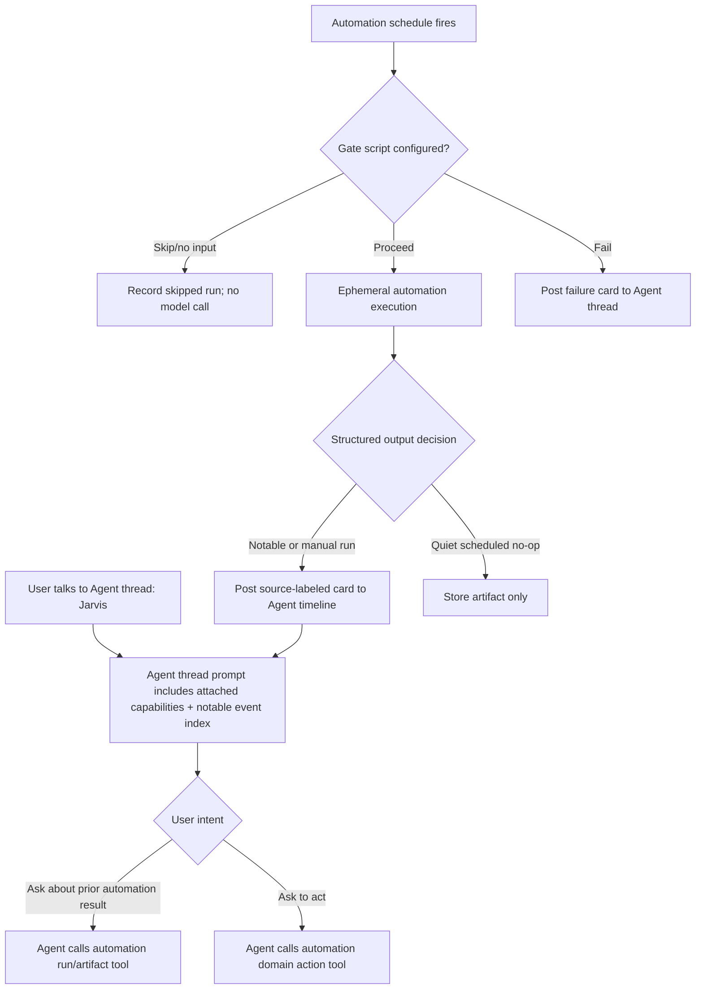

# Agent Threads with Attached Automations

## Problem Frame

PwrAgent automations should feel like capabilities attached to a personal Agent,
not like isolated cron chats that force users to jump across many Telegram
topics or desktop threads. A user should be able to talk to one Agent thread,
such as "Jarvis", and ask about email triage, trading activity, sprinkler
schedules, or other attached automations from that same conversation.

Automations remain independently scheduled and headless. They run ephemeral
executions, persist run artifacts and transcripts, and post notable cards into
their attached Agent thread. The Agent thread sees a compact list of attached
automation capabilities plus recent notable events, then fetches details through
namespaced tools only when the user asks.

## Requirements

**Agent Threads**
- R1. PwrAgent must support intentional Agent threads / Persona threads that are
  distinct from ordinary work threads.
- R2. An Agent thread must have a name and short persona instructions in V1.
  Persona instructions should stay compact, with guidance to keep them under
  roughly 200 lines and include tone, chattiness, priorities, and short behavior
  examples.
- R3. Agent threads may be attached to messaging surfaces such as Telegram DMs
  or topics through an Agent picker, so a user can bind "Jarvis" today and later
  switch that surface to "Jeeves".
- R4. V1 must not add a new RBAC or permission model for Agent threads.
  Execution follows the current thread/access configuration; future RBAC work
  may make this more granular.

**Attached Automations**
- R5. Each automation must attach to exactly one Agent thread in V1.
- R6. Automations must attach only to Agent threads, not arbitrary ordinary
  work threads.
- R7. Creating an automation should make it easy to create a new Agent thread
  inline if the right Agent does not already exist.
- R8. The attached Agent thread is the required reporting and control target for
  the automation's notable results, failures, and user follow-up.
- R9. Agent thread UI must show attached automations/capabilities, recent
  notable events, last/next run health, and a way to open the automation detail.
- R10. A secondary global Automations view must still exist for scanning and
  managing all automations across Agents.

**Headless Automation Execution**
- R11. An automation is a headless execution configuration, similar to a thread
  with chat input disabled and replaced by scheduled invocations.
- R12. The automation configuration must own its execution settings, including
  provider/backend, model, reasoning effort, fast mode, access mode, working
  directory or linked resources, system instructions, task prompt, schedule,
  gates, output policy, and attached Agent thread.
- R13. Scheduled automation executions must be ephemeral in V1. They start from
  the automation definition, invocation metadata, gate output when present, and
  the latest prior run summary; they do not depend on accumulated chat context
  or require context compaction.
- R14. Scheduled executions may explicitly fetch additional prior run history
  through tools when needed.
- R15. Every run must persist a durable artifact and a read-only run transcript
  showing the scheduled event/input, assistant output, tool activity, errors,
  and final structured result.
- R16. Users may inspect read-only run transcripts to understand why a card was
  produced, but normal conversation happens in the Agent thread.

**Agent Context and Tools**
- R17. When an Agent thread receives a user message, its prompt context should
  include the attached automation capability list and a compact notable recent
  event index, not full automation histories.
- R18. Attached automation tools must be namespaced by automation, for example
  `email_triage.latest_result` and `trader_bot.close_positions`.
- R19. Attached automations may expose both run/artifact inspection tools and
  domain action tools.
- R20. Automation attachments advertise capabilities; they must not stuff large
  domain state or full run outputs directly into the Agent prompt.
- R21. If user language, reply target, or recent card focus implies a specific
  automation/run, the Agent should use that focus. If a destructive request
  remains ambiguous, the Agent should ask before acting.

**Cards, Notifications, and Quiet Runs**
- R22. Notable automation outputs must appear as source-labeled cards in the
  same Agent chat timeline as user and assistant messages.
- R23. Automation cards are not assistant messages from the Agent thread and
  must not trigger the Agent to take an automatic turn.
- R24. Scheduled successful runs post cards only when their structured output
  decision says to post.
- R25. Scheduled failures must always post failure cards to the attached Agent
  thread, even when the automation is otherwise quiet.
- R26. Manual `run_now` requests from the Agent thread must execute
  asynchronously by default and always produce a completion or failure notice.
- R27. Cards should contain summary, severity/status, source automation, run
  time, expandable details, and text suggested actions when available.
- R28. V1 cards should not include executable action buttons. Users ask the
  Agent to act in natural language, and the Agent invokes tools.

**Input Gates**
- R29. V1 should support optional script gates that run before the AI
  invocation and can skip model execution when no meaningful input exists.
- R30. Gate scripts must run under the automation's configured working
  directory/access environment and may maintain their own instance state, such
  as an append-only JSONL rollout file.
- R31. Gate result mapping should be simple: exit code `0` means proceed, exit
  code `10` means skip/no input, and other non-zero exits mean gate failure.
- R32. If a gate proceeds, bounded stdout/stderr metadata must be included in
  the AI invocation context.
- R33. Gate output included in prompt context must be bounded, with a default
  around 16 KB for stdout and a smaller diagnostic cap for stderr. Truncation
  must be explicit.
- R34. Gate skips must record history without invoking the model. Gate failures
  must record history and post failure cards.

**Structured Run Results**
- R35. Automation runs should produce a structured result artifact with an
  explicit output decision, including fields such as `post_card`, severity,
  summary, notability reason, details reference, and suggested actions.
- R36. Structured result parsing is best-effort in V1. If parsing fails, store
  raw final output, mark the artifact as parse-failed, and treat scheduled output
  as notable by default rather than silently dropping it.
- R37. Scheduled quiet/no-op results should still be stored as artifacts even
  when no card is posted.

**Skill-Backed Automation Packages**
- R38. Automations should be backed by skill-like packages that can contain
  prompts, scripts, tool definitions, docs, default output shape, and setup
  guidance.
- R39. Automation instances configure when/how a package runs: name, schedule,
  attached Agent, execution settings, output policy, local state, and user
  configuration.
- R40. Normal scheduled runs must treat skill/package files as immutable.
  Runtime state and artifacts live in per-instance state/history locations.
- R41. Explicit maintenance/authoring workflows may edit both the reusable
  skill/package and the individual automation instance config.
- R42. Maintenance workflows must produce an audit summary covering the trigger,
  recent failures inspected, files/config changed, validation run, and what
  future runs will use.
- R43. In desktop, maintenance should prefer opening or suggesting a separate
  maintenance thread/workspace to avoid polluting the Agent conversation. In
  messaging or voice contexts, maintenance may proceed inline with concise
  progress and summary.

## Success Criteria

- A user can bind one Telegram DM to "Jarvis" and naturally ask about email,
  trading, and sprinkler automations without switching topics or threads.
- Scheduled automation runs can complete and post cards while the user is
  conversing with the Agent thread about prior results.
- Quiet automations do not spam the Agent timeline, but failures and manual
  runs always produce visible feedback.
- The Agent can answer questions about recent automation outputs by discovering
  attached automation capabilities and fetching artifacts by tool.
- Advanced users can add script gates and maintain automation packages without
  normal scheduled runs mutating their own skill files.

## Scope Boundaries

- In scope: Agent thread concept, one attached Agent per automation, ephemeral
  scheduled runs, read-only run transcripts, artifact-backed cards, capability
  advertising, namespaced tools, script gates, structured result artifacts,
  skill-backed automation packages, and explicit maintenance workflows.
- Out of scope for this brainstorm: cloud scheduling, daemon execution while the
  app is closed, multi-Agent delivery, automatic cross-Agent orchestration,
  executable action buttons in cards, automation templates for novice users,
  long-form persona/context files, and new RBAC/permissions semantics.
- Out of scope: treating every automation result as an ordinary assistant
  message or replaying all automation outputs into the Agent prompt.

## Key Decisions

- Default automation UX is Agent-centric: users talk to an Agent thread such as
  Jarvis, and automations attach capabilities and notable events to that Agent.
- Automations are headless execution configs: users can open and configure them,
  but scheduled runs are not chat-interactive.
- Scheduled runs are ephemeral: this avoids context compaction costs and makes
  runs easier to audit and reproduce.
- Latest prior run summary is included by default; deeper history is fetched by
  tool when needed.
- Notable cards share the Agent timeline but do not trigger automatic Agent
  responses.
- Script gates are the V1 input-filtering mechanism; novice templates can come
  later.
- Normal runs cannot rewrite skill packages; explicit maintenance workflows can.

## Dependencies / Assumptions

- Existing thread access modes remain the permission mechanism for V1.
- Future RBAC may introduce Agent roles, user roles, and finer-grained tool
  invocation rules.
- The current skill system is the conceptual basis for automation packages, but
  planning must determine how much packaging support already exists versus what
  needs to be added.
- Messaging bindings can present Agent threads as attachable targets through an
  Agent picker.

## Alternatives Considered

| Alternative | Decision | Rationale |
|---|---|---|
| One result thread per automation | Rejected | Too many Telegram topics/threads; does not match how users think about one assistant persona. |
| Shared conversation thread for scheduled runs and user chat | Rejected as default | User conversation can block cron and scheduled runs inherit confusing chat context. |
| Stateful scheduled execution thread | Rejected for V1 | Requires compaction and makes run behavior harder to reproduce. |
| Ad hoc automation configs without skill packages | Rejected | Harder to reuse, inspect, version, and maintain through agent-assisted authoring. |
| AI prompt gates | Rejected for V1 | Spending model tokens to decide whether to spend model tokens defeats the purpose of gates. |
| Executable card buttons | Deferred | Useful later, but adds callback routing, action identity, and platform-specific behavior. |

## Outstanding Questions

### Resolve Before Planning

- None.

### Deferred to Planning

- [Affects R1-R4][Design] Exact Agent thread creation, navigation, and messaging
  attachment UI.
- [Affects R12][Technical] Which current thread execution settings can be reused
  directly for headless automation configs.
- [Affects R17-R21][Technical] Exact capability registry and tool discovery
  mechanism for attached automations.
- [Affects R29-R34][Technical] Script gate timeout, environment variables,
  output capture caps, and state/artifact paths.
- [Affects R35-R37][Technical] Structured result schema and fallback parsing
  behavior.
- [Affects R38-R43][Technical] How automation packages map onto the existing
  skill system and how maintenance workflows safely edit them.

## Next Steps

→ `/prompts:ce-plan` for structured implementation planning.
