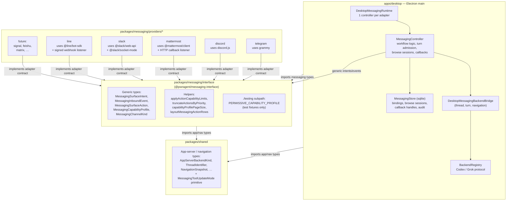
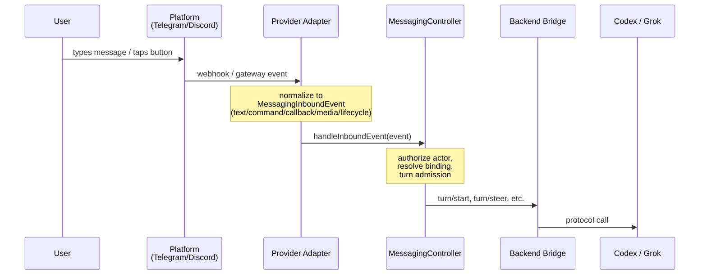
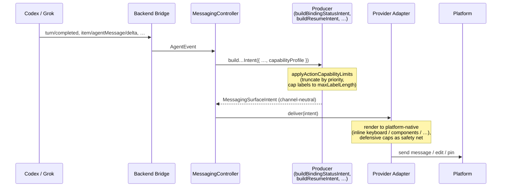
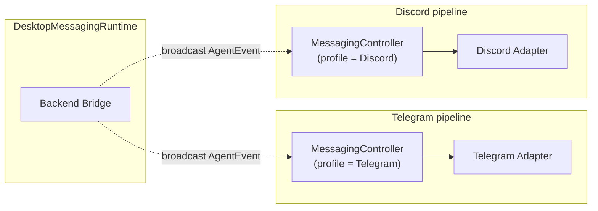
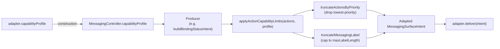

# Messaging Architecture

How the messaging system is layered, where types live, how messages flow, and how the capability-profile system lets providers declare their constraints without producers ever branching on platform names.

For setup and operator-facing commands see [`docs/messaging-platform-integration.md`](messaging-platform-integration.md). For the adapter contract that platform implementers must satisfy see [`docs/messaging-adapter-contract.md`](messaging-adapter-contract.md). For package boundary enforcement see [`packages/messaging/AGENTS.md`](../packages/messaging/AGENTS.md).

## Layers and separation of concerns



**Three packages, three jobs:**

| Layer | Package | Job |
|---|---|---|
| Generic contract | `@pwragent/messaging-interface` | Channel-neutral types, capability profile, layout helpers, runtime helpers like `applyActionCapabilityLimits`. **No provider names. No SDK imports.** |
| Provider adapters | `@pwragent/messaging-provider-{telegram,discord,…}` | Translate intents → platform messages, translate platform events → inbound events. **Each adapter is its own package; cannot import other providers, cannot import desktop or app-server code.** |
| Workflow orchestration | `apps/desktop/src/main/messaging/` | Turn admission, binding lifecycle, picker state machines, audit trails, sqlite persistence. **Speaks only the generic interface.** |

`@pwragent/shared` carries cross-package types that are not messaging-specific (app-server protocol enums, navigation snapshots, thread identifiers). It also holds one messaging primitive — `MessagingToolUpdateMode` — because desktop settings need it without depending on the messaging interface. Everything else messaging-related lives in `@pwragent/messaging-interface`.

The dependency direction is one-way: `interface → shared`, `providers → interface`, `desktop → interface (+ providers via the loader)`. Enforced by `pnpm lint:boundaries` (`.dependency-cruiser.cjs`).

## Data flow

### Inbound (user message arrives at the bot)



The adapter's job ends at "I converted a platform-specific event into a `MessagingInboundEvent`". Workflow decisions — debouncing, queueing, steering, binding resolution — all live in `MessagingController`. Adapters must not call `turn/start` themselves.

### Outbound (agent produces output)



**Key invariant:** the producer never sees the adapter, the channel kind, or any provider name. It receives a `MessagingCapabilityProfile` describing what the destination supports and adapts content to fit. Producers thread through the controller's `this.capabilityProfile`, which the controller reads once at construction from `options.adapter.capabilityProfile`.

## 1:1 controller:adapter mapping

Each adapter gets its own controller. Backend events broadcast to all controllers in parallel; each one decides whether the event is relevant to any of its bindings and renders to its own adapter.



Why this shape:
- Each controller owns one capability profile, so producers can adapt deterministically.
- A thread bound to both Telegram and Discord renders independently per channel — Discord users see Discord-native buttons, Telegram users see Telegram-native buttons. No cross-channel contamination.
- Shared state lives only in the sqlite `MessagingStore` (bindings, browse sessions, callback handles). Both controllers read/write the same store but never reach into each other's runtime state.

## Callback delivery models

Different platforms deliver button clicks back to the bot through different transports. The interface is the same on PwrAgent's side (`MessagingInboundEvent.kind = "callback"`), but the adapter has to bridge whatever the platform does:

| Provider | Transport | Listener |
|---|---|---|
| Telegram | Long-poll callbacks via `grammy` | The same connection used for `posted`-style events. |
| Discord | Gateway component-interaction events via `discord.js` | The same gateway connection. |
| **Mattermost** | **Out-of-band HTTP POST** to a URL the bot supplies as `integration.url` on each rendered button | **A small HTTP listener bound to `127.0.0.1:<port>`** inside the adapter package. Production deployments expose it through Cloudflare Tunnel or Tailscale Funnel; the listener never binds to a public interface. HMAC-signed `integration.context` defends against forged callbacks (the platform doesn't sign them). |
| Slack | Socket Mode events via `@slack/socket-mode` | The outbound WebSocket carries message events, button clicks, and slash-command payloads. No public callback URL is needed for v1. |
| LINE | Signed webhooks via `X-Line-Signature` | LINE is webhook-only. The adapter verifies the HMAC-SHA256 signature over the raw body before parsing, then normalizes message/postback/follow/join events. Production deployments expose the localhost listener through the same tunnel pattern as Mattermost. |

Inline-stream providers don't need a listener — clicks ride back over their existing connection. HTTP-callback providers need an authenticated, tunneled listener; PwrAgent's pattern uses HMAC over `(intentId, actionId, issuedAt)` with a persistent deployment secret when callbacks need to survive adapter restarts. See [`docs/messaging-platform-integration.md`](messaging-platform-integration.md) for the recommended Cloudflare Tunnel + Zero Trust deployment posture and the Tailscale Funnel free-ish alternative.

Every provider persists callback handle records with the same delivery-scoped model: the platform payload contains a compact opaque handle, while the sqlite store record includes the semantic action, delivered conversation, full allowed actor set, and routed binding id (`intent.audit?.bindingId ?? intent.bindingId`). Callback handles use a long shared TTL so pinned/status buttons survive idle time and restarts; pending approvals, browse sessions, and other domain records enforce their own expiry after the handle resolves. This keeps restart, fan-out delivery, and rebind cleanup behavior consistent across Telegram, Discord, Slack, Mattermost, and LINE.

## Capability profile

Providers declare what they can render. Producers consume the declaration to adapt output. No producer ever branches on a channel name.

### What a profile declares

```typescript
type MessagingCapabilityProfile = {
  // omit `actions` for text-only providers (e.g., a future Signal adapter)
  actions?: {
    maxActions: number;          // Discord: 25, Telegram: 100
    maxActionsPerRow: number;    // Discord: 5, Telegram: 8
    maxRows?: number;            // Discord: 5, Telegram: unlimited
    maxLabelLength: number;      // Discord: 80, Telegram: 64
    supportsStyles: boolean;     // Discord: true, Telegram: false
    supportsDisabled: boolean;
    supportsLayoutHints: boolean;
    maxCallbackPayloadBytes: number;
  };
  text: {
    maxLength: number;
    encoding: "utf8-bytes" | "utf16-units" | "characters";
    markdownDialect: "plain" | "html" | "slack-mrkdwn" | "discord-markdown" | "markdown";
    supportsCodeBlocks: boolean;
    supportsBold: boolean;
    supportsItalic: boolean;
    supportsLinks: boolean;
    supportsInlineCode: boolean;
    maxCaptionLength?: number;
    supportsMessageEdit: boolean;
  };
  inboundAttachments?: { /* user-upload limits */ };
  outboundAttachments?: { /* file-delivery limits — see Plan/Review delivery issue */ };
};
```

Each provider declares its own profile literal at the top of its `*ProviderAdapter` class. Discord and Telegram declarations live at:
- `packages/messaging/providers/discord/src/discord-adapter.ts:236-265`
- `packages/messaging/providers/telegram/src/telegram-adapter.ts:339-372`

### What producers consume



`applyActionCapabilityLimits(actions, profile)` does both action-count truncation (by priority) and label-length truncation in one pass. It returns `[]` when the profile declares no `actions` capability — the caller is then expected to render text-only.

`MessagingSurfaceAction` carries a `priority?: number` field. **Lower numbers are higher priority.** Actions without an explicit priority are treated as lowest (dropped first). Status card example:

```typescript
const actions = [
  { id: "status:model", label: "Model", priority: 4 },
  { id: "status:reasoning", label: "…", priority: 5 },
  // … 8 more …
  { id: "status:stop", label: "Stop", priority: 1 },     // always kept
  { id: "status:refresh", label: "Refresh", priority: 2 },
  { id: "status:detach", label: "Detach", priority: 3 },
];
```

On a hypothetical 5-button provider, `Stop` / `Refresh` / `Detach` / `Model` / `Reasoning` survive truncation; the rest drop and remain accessible via text-reply fallback.

### Page-size adaptation

The resume browser computes its page size from the profile rather than a constant:

```typescript
const pageSize = capabilityProfilePageSize(
  profile,             // adapter's declared profile
  navActionCount,      // 5 for Prev/Next/Projects/New/Cancel
  RESUME_BROWSER_MAX,  // soft cap of 8 to keep UX readable
);
```

For Discord (`maxActions: 25`) and Telegram (`maxActions: 100`) this resolves to the soft cap of 8 — preserving the established UX. A provider with tighter limits gets fewer items per page automatically. A text-only provider returns a larger page size (20) since there are no buttons to budget against.

The handoff branch picker uses the same helper with a two-pass calc: try `navActionCount = 3` first (Back/Refresh/Cancel only), and if branches don't all fit on one page, recompute with `navActionCount = 5` to leave room for `Previous` and `Next` on middle pages.

### Adapter-side defensive caps

Producers should already have applied all limits before the intent reaches the adapter. The adapter still enforces them as a safety net:

```typescript
// inside Discord buildDiscordComponents
const maxActions = profile?.actions?.maxActions ?? 25;
const maxLabelLength = profile?.actions?.maxLabelLength ?? 80;
const items = actions
  .filter((action) => !action.disabled)
  .slice(0, maxActions)
  .map((action) => ({
    component: { label: action.label.slice(0, maxLabelLength), ... },
  }));
```

If the producer respected the profile, the slices are no-ops. If the producer somehow emitted too much, the adapter clips it rather than letting the platform reject the request. The numbers come from the same profile the adapter declared, so producer and adapter caps stay in sync.

## Architectural principles

These rules exist to make adding the next ten messaging platforms a quiet, mechanical exercise. Every line of platform-branching code in the desktop or interface layer is a future bug; every direct DB import inside a provider is a future migration mess. Treat them as non-negotiable.

### Single platform-agnostic detach pipeline

The detach flow — retire the channel's status surface, revoke the binding in the store, deliver a "Thread detached" confirmation — has exactly one implementation: `MessagingController.runDetachPipeline`. Every detach origin (Discord `/detach`, Telegram `/detach`, the desktop right-click "Unbind" chip, future archive-on-delete flows, future "Unbind all") routes through it.

The pipeline is platform-agnostic because the only platform-shaped seam is `adapter.deliver(intent)`, which every adapter already implements as part of the inbound-message contract. **A new platform inherits detach for free** by registering as an adapter — no detach-specific code is required in any provider, controller, IPC handler, or runtime call site.

If you find yourself writing `if (binding.channel.channel === "discord") …` or wiring up a per-platform "tell platform X about detach" method, stop: the pipeline already does this through the generic adapter dispatch. Add the missing capability to the adapter contract instead.

### Bus-driven cross-layer coordination

Layers above the controller (Electron IPC handlers, desktop windowing code, future CLI / scheduled-task entry points) **must not import controller classes or call controller methods directly**. They emit events on the runtime bus; the runtime fans them out to whichever controller's adapter scopes the affected binding's channel.

Two reasons: it prevents circular references between IPC and controller modules (IPC imports runtime, runtime imports controller; controller never sees IPC), and it stops every new caller from learning the per-platform layout. The right-click "Unbind" handler does not look up `DiscordMessagingController`; it calls `runtime.requestBindingRevoke({ bindingId, origin: "ui" })` and the runtime routes by binding metadata.

Available command-bus entry points today, all on `DesktopMessagingRuntime`:

| Method | Origin examples | Direction |
|---|---|---|
| `requestBindingRevoke(req)` | UI context-menu unbind, future archive flow on a single binding | caller → controllers |
| `requestBindingRevokeAllForThread(req)` | Future "Unbind all" context-menu item, implicit unbind on thread archive | caller → controllers |
| `notifyBindingsChanged()` | Controller mutations after bind/sync/detach | controllers → renderer |

**Direction-typed events.** Each topic flows in one direction only. `notifyBindingsChanged` is mutation-broadcast (controllers and the runtime fallback emit; renderer subscribes). The two `request*` methods are commands (callers emit; controllers handle). Do not invert either — a command that broadcasts to the renderer becomes a state-mutation race; a mutation event that controllers subscribe to becomes a re-entrancy footgun.

If no controller's scope matches a `request*` event (messaging is disabled, or the platform's adapter failed to start), the runtime falls back to a store-only revoke so the renderer chip clears regardless. Best-effort platform notification, guaranteed local cleanup.

### Permission-mode queue audit messages

When a user toggles a thread's permission mode (Default Access ↔ Full Access) while a turn is running, the registry queues the change at the resume boundary instead of applying it immediately. The messaging controller surfaces this lifecycle in the bound conversation as audit chat messages, so users on Telegram and Discord see the same story the desktop transcript tells:

```
⏳ Permissions queue: Default Access → Full Access.
   Will apply at end of current turn.   [Cancel]

(turn ends)

🔓 Permissions changed: Default Access → Full Access at 2:19 PM (submitted)
```

If the user clicks Cancel before the turn ends, the controller edits the queued message in place to:

```
✕ Cancelled queued permissions change (Default Access → Full Access)
```

The lifecycle uses three bus events from the registry:

- `thread/executionMode/queued` — controller posts a fresh audit message with a Cancel button. The button's `actionId` is `permissions:queue:cancel:${queueId}` so subsequent clicks route deterministically to `cancelThreadExecutionModeQueue` on the registry.
- `thread/executionMode/queueCleared { reason: "cancelled" | "applied" }` — controller edits the previously-posted message to the cancelled-or-submitted state. The `MessagingController.pendingQueueAuditMessages` map keyed by `${backend}:${threadId}` holds the message reference between post and edit.
- `thread/executionMode/updated` — fires immediately before `queueCleared { reason: "applied" }`. The controller's existing `refreshStatusSurfacesForThread` handler picks this up and re-renders the status card, which now shows the new applied mode (the queue is gone).

Edit-failure on Telegram/Discord falls back to posting a fresh message via the existing `delivery.fallback: "present_new"` policy on the `MessagingDeliveryIntent` shape — same pattern as approval surfaces and status cards.

The status card label adapts when a queue is pending: `Permissions: Default Access → Full Access (queued)` instead of just `Permissions: Default`. The label is computed from `MessagingResolvedThreadState.queuedExecutionMode`, which in turn is sourced from `NavigationThreadSummary.queuedExecutionMode` on the snapshot.

### Providers never touch persistence directly

Provider packages under `packages/messaging/providers/*` **must not** import any of:

- `apps/desktop/**` (any path)
- `better-sqlite3`, `drizzle`, or any DB driver
- The desktop store implementation (`apps/desktop/src/main/state/messaging-store-sqlite.ts`)
- Any module that exposes raw SQL or schema definitions

Providers receive persistent state only through opaque interfaces declared in `@pwragent/messaging-interface` — today that's `MessagingCallbackHandleStore` (`resolveCallbackHandle` / `upsertCallbackHandle`), and `MessagingAdapterState.opaque` for routing/surface state that the workflow layer echoes but never parses. New persistence needs become new interface methods, not new tables.

This is enforced by package boundaries (`pnpm lint:boundaries`) and reinforced in [`packages/messaging/AGENTS.md`](../packages/messaging/AGENTS.md). The reason matters as much as the rule: providers come and go, the schema is shared, and a provider that owns its own table effectively owns a piece of the desktop migration plan it has no business owning. Keep the seam at the interface, not the database.

## Canonical command catalog

The slash-command surface every messaging provider exposes — `resume`, `status`, `detach`, `help` — is defined in a single channel-neutral catalog at [`apps/desktop/src/main/messaging/core/messaging-command-catalog.ts`](../apps/desktop/src/main/messaging/core/messaging-command-catalog.ts).

Four things consume the catalog:

1. **The controller's `handleCommand` dispatch.** `matchMessagingCommandVerb` resolves an inbound `MessagingInboundCommandEvent.command` to a known verb (or `undefined` for unrecognized commands). Verbs in the catalog dispatch to typed handlers; everything else falls through to the help surface.
2. **The user-facing `/help` body.** `formatMessagingCommandHelpBody` derives the prose bullet list from the catalog so adding or renaming a verb in one place updates the help text everywhere it's rendered.
3. **The `/help` action row.** `paginateHelpCatalog` + `buildHelpActions` render one `command:<verb>` button per catalog entry on the current page. Pages overflow with capability-aware Prev/Next/Cancel navigation when the catalog grows past the profile's action budget; for today's small catalog every button fits on one page and no nav row is rendered. The `Resume` button is styled primary to match the previous single-button shape; everything else is neutral. Pagination is **stateless** — the next/previous page index travels in `action.value.pageIndex` and comes back through `MessagingInboundCallbackEvent.value`, so the controller can re-render without persistent session state (unlike the resume browser which uses a `MessagingBrowseSessionRecord`).
4. **Provider adapters that register native slash commands.** Today each adapter maintains its own list (`packages/messaging/providers/discord/src/discord-commands.ts`, `packages/messaging/providers/mattermost/src/mattermost-commands.ts`). A future refactor can collapse those onto the shared catalog so a new verb only requires touching one file. Until then, adapter-side lists must stay in sync with the catalog by convention.

To add a new canonical verb:

1. Add an entry to `MESSAGING_COMMAND_CATALOG` with a stable `verb` string and a one-line description.
2. Bump the `MessagingCommandVerb` union type.
3. Wire a handler branch in `MessagingController.handleCommand` that calls `matchMessagingCommandVerb` and dispatches.
4. For each provider adapter that registers native slash commands, add the verb to its own canonical-bases array (Discord's `DISCORD_APPLICATION_COMMANDS`, Mattermost's `CANONICAL_COMMAND_BASES`, etc.).

The help surface and unknown-command fallback automatically pick up the new verb from the catalog — no string-list to update separately.

## How to add a provider

The full hands-on walkthrough — including a capability-profile workshop, the inbound/outbound translation tables, the callback-handle round-trip pattern, and the Cloudflare-Tunnel deployment guidance for HTTP-callback platforms — is in [`docs/messaging-adding-a-provider.md`](messaging-adding-a-provider.md). The formal contract every adapter must satisfy is in [`docs/messaging-adapter-contract.md`](messaging-adapter-contract.md). At a high level:

1. Create `packages/messaging/providers/<channel>/` with its own `package.json` and `tsconfig.json`. Depends only on `@pwragent/messaging-interface` and the channel's own SDK.
2. Implement the adapter shape: `start(listener)`, `stop()`, `deliver(intent)`, `downloadAttachment?`, `setConversationTitle?`.
3. Declare the `capabilityProfile` literal at the top of the class with real numbers researched from the platform's docs.
4. Translate inbound platform events into `MessagingInboundEvent`. Authorize on stable platform user IDs. Use compact opaque callback handles persisted in the messaging store with delivery-scoped record IDs.
5. Translate outbound `MessagingSurfaceIntent` into platform-native messages. Apply defensive caps from the profile. Stay channel-neutral — the workflow logic in `MessagingController` should not need any changes.
6. Add to `apps/desktop/src/main/messaging/provider-loader.ts` so the desktop runtime can load it.
7. Export `validateCredentials(config)` from the package barrel using the platform's real SDK in a non-disruptive smoke-check call (e.g. `grammy.Bot.api.getMe()` for Telegram, `discord.js.REST.get(Routes.user("@me"))` for Discord). Add a `<Channel>CredentialValidationConfig` type to `packages/messaging/interface/src/index.ts` and extend `CredentialValidationRequest` in `apps/desktop/src/main/messaging/messaging-runtime.ts` with the new channel branch. The desktop runtime dynamically imports the provider package on first Test click, so the Settings → Connection-test button stays decoupled from boot-time provider load. Full contract: [`docs/messaging-adapter-contract.md`](messaging-adapter-contract.md) § "Credential Validation".
8. Tests cover: command normalization, authorization, callbacks, markdown rendering, long-text chunking, inbound media handling, restart-safe binding behavior, capability-profile reads in the formatter, and `validateCredentials` ok / failed / unset paths.

## File map

| Path | What's there |
|---|---|
| `packages/messaging/interface/src/index.ts` | Generic types, `applyActionCapabilityLimits`, `truncateActionsByPriority`, `capabilityProfilePageSize`, `truncateMessagingLabel`, `layoutMessagingActionRows`, intent shapes, callback-handle store contract |
| `packages/messaging/interface/src/testing.ts` | `PERMISSIVE_CAPABILITY_PROFILE` for test mocks. Imported via `@pwragent/messaging-interface/testing`. **Production code must not import from this path.** |
| `packages/messaging/interface/AGENTS.md` | Package guidance |
| `packages/messaging/providers/<channel>/src/<channel>-adapter.ts` | The adapter class, capability profile declaration, inbound event translation, outbound intent rendering |
| `packages/messaging/providers/<channel>/src/<channel>-formatting.ts` | Pure formatters that turn intents into platform-native components/text. Reads the profile for layout caps. |
| `packages/messaging/providers/<channel>/src/validate-credentials.ts` | Top-level `validateCredentials(config)` exported from the package barrel. Stateless smoke check using the platform's real SDK (`grammy.Bot.api.getMe()`, `discord.js.REST.get(Routes.user("@me"))`, …). Driven by Settings → Connection-test via `DesktopMessagingRuntime.requestCredentialValidation`. Contract: [`docs/messaging-adapter-contract.md`](messaging-adapter-contract.md) § "Credential Validation". |
| `packages/messaging/providers/mattermost/src/mattermost-callback-server.ts` | (HTTP-callback providers only) Localhost-bound HTTP listener with HMAC verification — bridges out-of-band button clicks back into the controller. |
| `apps/desktop/src/main/messaging/messaging-runtime.ts` | Constructs one controller per adapter, wires backend events |
| `apps/desktop/src/main/messaging/core/messaging-controller.ts` | Workflow logic — turn admission, picker state, status card, handoff flow, audit |
| `apps/desktop/src/main/messaging/core/messaging-command-catalog.ts` | Canonical command catalog (verb + description), `matchMessagingCommandVerb` for dispatch lookup, `formatMessagingCommandHelpBody` for `/help` body generation, `paginateHelpCatalog` + `buildHelpActions` for the paginated command-button row |
| `apps/desktop/src/main/messaging/core/messaging-renderer.ts` | Producers for thread picker, confirmation, questionnaire, error |
| `apps/desktop/src/main/messaging/core/messaging-status-card.ts` | Producers for status card, model picker, reasoning picker, handoff overview/branch-picker/confirmation |
| `apps/desktop/src/main/messaging/core/messaging-resume-browser.ts` | Producer for resume browser (`/resume`) — picker pagination, project/thread filtering |
| `apps/desktop/src/main/messaging/core/messaging-approval-renderer.ts` | Producer for approval prompts |
| `apps/desktop/src/main/messaging/core/messaging-attachment-processor.ts` | Inbound attachment normalization (size caps, MIME sniffing, image conversion) |
| `apps/desktop/src/main/messaging/core/messaging-store.ts` | Persistence interface (bindings, browse sessions, callback handles, pending intents) |
| `apps/desktop/src/main/state/messaging-store-sqlite.ts` | Sqlite implementation of the store |

## Cross-references

- [`docs/messaging-adding-a-provider.md`](messaging-adding-a-provider.md) — hands-on walkthrough for adding a new platform adapter
- [`docs/messaging-platform-integration.md`](messaging-platform-integration.md) — operator setup, command surface, button layout policy, Cloudflare-Tunnel / Tailscale-Funnel deployment for HTTP-callback providers
- [`docs/messaging-adapter-contract.md`](messaging-adapter-contract.md) — the formal contract for new platform adapters
- [`packages/messaging/AGENTS.md`](../packages/messaging/AGENTS.md) — package boundary rules and enforcement
- [`docs/plans/2026-05-04-002-feat-messaging-capability-discovery-plan.md`](plans/2026-05-04-002-feat-messaging-capability-discovery-plan.md) — the design plan that introduced the capability profile system
- [`docs/plans/2026-05-05-002-feat-messaging-plan-review-attachment-delivery-plan.md`](plans/2026-05-05-002-feat-messaging-plan-review-attachment-delivery-plan.md) — planned consumer of `outboundAttachments` for plan/review surface delivery
- [`docs/plans/2026-05-06-001-feat-messaging-mattermost-adapter-and-provider-guide-plan.md`](plans/2026-05-06-001-feat-messaging-mattermost-adapter-and-provider-guide-plan.md) — the Mattermost adapter implementation plan
