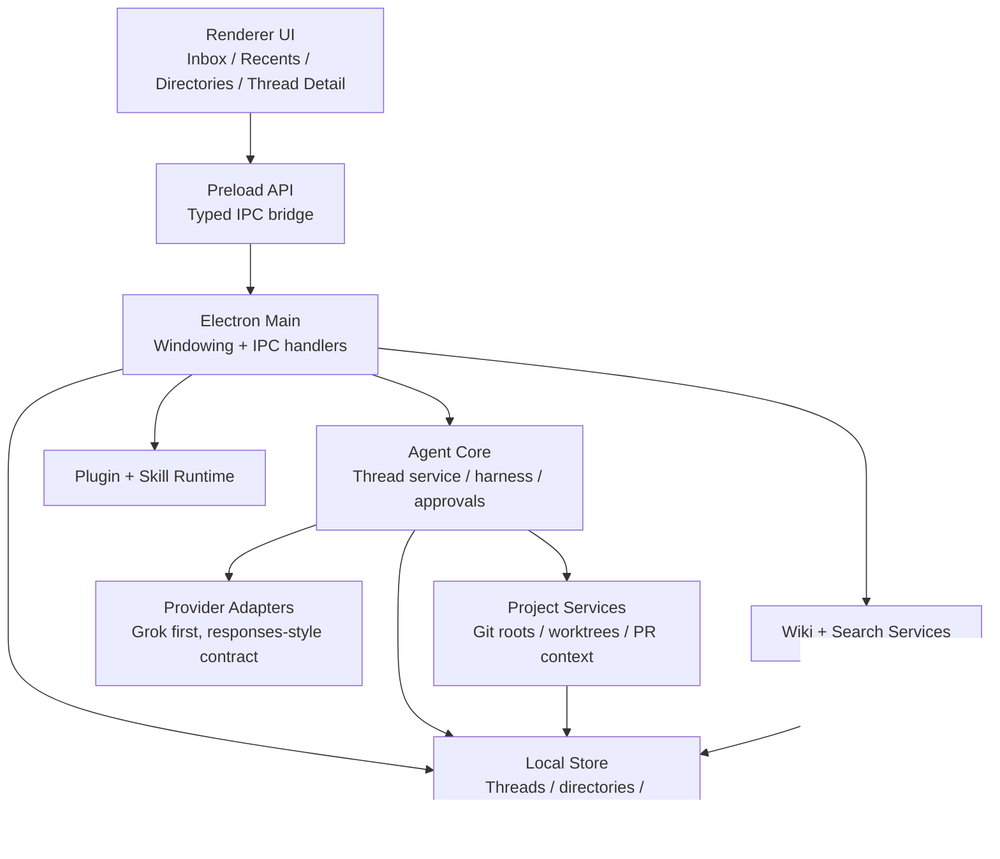

# feat: Thread-centric agent desktop foundation

## Overview

Build the first real version of a desktop coding agent whose differentiator is thread navigation rather than repo-first attachment. The milestone should ship a runnable Electron app with a real provider/harness path, desktop-owned overlay state, Inbox plus Recents plus Directories navigation, multi-directory thread associations, backend-aware thread creation, and enough plugin/wiki infrastructure that the product already feels accumulative instead of stateless.

## Problem Frame

The origin requirements define a thread-first product surface where users can start from a blank thread, attach repos later, and find important work from Inbox before drilling into Recents or Directories (see origin: `docs/brainstorms/2026-04-16-thread-centric-agent-desktop-requirements.md`). The current desktop code now has real Codex and Grok backend integration, but the renderer still loads navigation and transcripts as Codex-only and exposes no shipped "New thread" entrypoint. This plan update closes that gap by making backend choice explicit at thread creation time and by making backend provenance visible in thread lists without turning backend choice into a new primary navigation lens.

## Requirements Trace

- R1-R4. Support thread creation with or without directories and preserve thread identity independent of repo attachment.
- R5-R11. Deliver Inbox-first navigation, Recents and Directories lenses, and enough thread context visibility to understand linked repos and PR/worktree status.
- R12-R15. Model many-to-many Git directory links plus working-directory distinctions such as worktrees.
- R16-R19. Support guarded versus full-access execution modes with a risk-based approval layer.
- R20-R22. Provide a real Grok-first but provider-agnostic agent harness and core coding loop.
- R23-R26. Include real skills/plugins and wiki memory foundations with lexical and semantic search paths.
- User-request refinement on R1, R10, R21, and R22. Users can start a thread against either Codex or Grok, and every thread-list row should expose that backend relationship at a glance through compact chip metadata.

## Scope Boundaries

- No custom credential unlock agent or in-app SSH-agent replacement in this milestone.
- No hardening for maximum-sandbox security posture beyond the guarded/full-access split.
- No custom inbox-rule editor, pinning system, or advanced project organization beyond Inbox, Recents, and Directories.
- No attempt to finish every long-tail feature implied by plugins or wiki memory; only the smallest real end-to-end slice is in scope.

## Context & Research

### Relevant Code and Patterns

- `apps/desktop/src/main/app-server/backend-registry.ts` already normalizes Codex and Grok clients behind one desktop registry and exposes per-backend capabilities plus `startThread`, `startTurn`, and `readThread`.
- `packages/shared/src/contracts/app-server.ts` and `packages/shared/src/contracts/navigation.ts` already carry per-thread backend/source metadata, so the renderer can show backend provenance without inventing a second model.
- `apps/desktop/src/renderer/src/lib/useThreadNavigation.ts` and `apps/desktop/src/renderer/src/lib/useThreadTranscript.ts` still hard-code `backend: "codex"` for snapshot reads, mark-seen writes, and transcript loads.
- `packages/agent-core/src/persistence/overlay-store.ts` and `packages/agent-core/src/persistence/migrations.ts` currently key overlay state by bare `threadId`, which is acceptable for single-backend snapshots but unsafe once Codex and Grok threads can coexist in one navigation surface.
- `apps/desktop/src/renderer/src/features/navigation/RecentsList.tsx`, `InboxList.tsx`, and `DirectoriesList.tsx` already use shared chip styling (`thread-row__chip`), which gives the plan a local pattern for adding a backend pill without new visual primitives.

### Institutional Learnings

- No relevant `docs/solutions/` artifacts exist yet in this repository.

### External References

- Electron process model: [electronjs.org/docs/latest/tutorial/process-model](https://www.electronjs.org/docs/latest/tutorial/process-model)
- Electron preload guidance: [electronjs.org/docs/latest/tutorial/tutorial-preload](https://www.electronjs.org/docs/latest/tutorial/tutorial-preload)
- Electron IPC guidance: [electronjs.org/docs/latest/tutorial/ipc](https://www.electronjs.org/docs/latest/tutorial/ipc)
- Electron renderer sandboxing notes: [electronjs.org/docs/latest/tutorial/sandbox](https://www.electronjs.org/docs/latest/tutorial/sandbox)

## Key Technical Decisions

- Use a `pnpm` workspace from day one so the Electron app, shared contracts, agent runtime, plugin runtime, and wiki services can evolve without immediate repo surgery.
- Keep privileged orchestration in the Electron main process, expose only typed preload APIs to the renderer, and treat renderer code as unprivileged UI per Electron's process and preload model.
- Use TypeScript across the workspace so IPC contracts, persisted thread models, provider interfaces, and plugin manifests share one type system.
- Persist desktop-owned navigation data in a local store, starting with the file-backed overlay state already shipped for inbox and refresh reconciliation, and defer heavier relational storage until thread, project, or wiki features truly need it.
- Keep Git roots and working directories as separate persisted concepts so local mode and worktree mode can share one thread model.
- Start with one internal plugin/skill registration path that the app itself consumes, then generalize only after the first milestone proves the shape.
- Treat semantic wiki search as a service boundary, not a UI trick, so the first milestone can start with a pluggable indexer and avoid hard-coding one search backend into the renderer.
- For Grok-based desktop integration, target the OpenClaw-consumed Codex App Server subset rather than a turn-only proof of concept, so the desktop can rely on one existing client contract for thread discovery, turn control, review, and compaction.
- Treat sidebar navigation as a mixed-backend surface by default. Backend is provenance metadata on each thread row, not a replacement for Inbox, Recents, or Directories as the primary browsing lenses.
- Put the first shipped "New thread" action in the sidebar masthead, because the style guide expects global actions at the top of the operating rail and the current shell already reserves that space beside refresh.
- Qualify desktop overlay identity by backend plus thread id rather than bare thread id so seen state, inbox reconciliation, and extra linked directories cannot bleed across Codex and Grok threads that happen to share ids.
- Render backend provenance from the stable thread `source` field using compact title-case chips (`Codex`, `Grok`) in thread rows. Do not depend on verbose backend status labels like "Codex app server" for row metadata.

## Open Questions

### Resolved During Planning

- Workspace shape: use a single workspace repo with one Electron app and a small number of packages rather than one large app folder.
- Process split: place agent runtime, git/project services, approvals, plugin loading, and wiki indexing behind main-process services; renderer consumes them through typed preload APIs.
- Persistence model: keep the current file-backed overlay store for desktop-only navigation state, and introduce heavier storage only when later units need richer cross-feature queries.
- Milestone emphasis: prioritize thread navigation and agent/provider reality first; credential mediation stays deferred.
- Mixed-backend thread browsing: navigation should merge available Codex and Grok threads into one recents or inbox surface, sorted by activity, with backend chips used for provenance.
- Backend-picker scope: the first shipped picker should offer only currently available backends that advertise `createThread`, rather than introducing a broader model picker or provider settings surface.
- Backend row labeling: use compact backend-kind chips in list rows and header metadata, while keeping the fuller backend availability list in the context rail.

### Deferred to Implementation

- Exact scoring weights for Inbox ordering should be tuned while wiring real event flows rather than guessed fully in the plan.
- Exact semantic-search backend can be finalized once the first wiki corpus and performance envelope are known.
- Exact provider adapter edge cases, especially tool streaming and interruption behavior, should be finalized while integrating the first real provider.
- The exact interaction pattern for the backend picker can settle during implementation as long as it stays in the sidebar masthead and exposes only available create-thread targets with clear disabled-state copy.

## High-Level Technical Design

> *This illustrates the intended approach and is directional guidance for review, not implementation specification. The implementing agent should treat it as context, not code to reproduce.*

## Phased Delivery

### Phase 1
- Workspace scaffold, Electron shell, typed IPC foundation, shared contracts, and persistence skeleton.

### Phase 2
- Agent harness, provider abstraction, thread persistence, and the first runnable coding loop.

### Phase 3
- Thread-first renderer surfaces: Inbox, Recents, Directories, thread detail, and multi-directory visibility.

### Phase 4
- Plugin/skill and wiki/search foundations to make the product feel extensible and accumulative.

## Implementation Units

- [x] **Unit 1: Establish the workspace and desktop shell**

**Goal:** Create the monorepo structure, Electron app shell, shared TypeScript configuration, and baseline test harness that every later unit can build on.

**Requirements:** R20-R22

**Dependencies:** None

**Files:**
- Create: `package.json`
- Create: `pnpm-workspace.yaml`
- Create: `tsconfig.base.json`
- Create: `.gitignore`
- Create: `README.md`
- Create: `apps/desktop/package.json`
- Create: `apps/desktop/electron.vite.config.ts`
- Create: `apps/desktop/src/main/index.ts`
- Create: `apps/desktop/src/main/window.ts`
- Create: `apps/desktop/src/preload/index.ts`
- Create: `apps/desktop/src/renderer/index.html`
- Create: `apps/desktop/src/renderer/src/main.tsx`
- Create: `apps/desktop/src/renderer/src/App.tsx`
- Create: `packages/shared/package.json`
- Create: `packages/shared/src/index.ts`
- Create: `packages/agent-core/package.json`
- Create: `packages/agent-core/src/index.ts`
- Create: `vitest.workspace.ts`
- Test: `apps/desktop/src/main/__tests__/app-bootstrap.test.ts`
- Test: `apps/desktop/src/renderer/src/__tests__/app-shell.test.tsx`

**Approach:**
- Use a single Electron app with explicit `main`, `preload`, and `renderer` entrypoints.
- Create `packages/shared` for IPC-safe DTOs and domain types; create `packages/agent-core` for thread, provider, approval, plugin, and wiki services that the main process will compose.
- Establish Vitest for package and renderer tests now so later units can land with real coverage instead of retrofitted scaffolding.

**Patterns to follow:**
- No local code patterns exist yet; this unit establishes the default patterns for the repo.

**Test scenarios:**
- Happy path: app bootstrap creates a BrowserWindow with preload configured and the renderer entry loaded.
- Happy path: renderer shell mounts and shows placeholder navigation regions without requiring privileged APIs.
- Error path: preload export surface remains defined even when no thread data exists yet.

**Verification:**
- A developer can install dependencies and launch a blank but running desktop shell with passing baseline tests.

- [x] **Unit 2: Add desktop overlay state, inbox state, and refresh reconciliation**

**Goal:** Create the desktop-owned persistence layer for inbox state, extra directory associations, lightweight selection/view state, and refresh reconciliation without duplicating canonical thread or transcript state already owned by the app server.

**Requirements:** R1-R6, R5-R11, R12-R15

**Dependencies:** Unit 1

**Files:**
- Create: `packages/agent-core/src/domain/inbox.ts`
- Create: `packages/agent-core/src/domain/navigation-state.ts`
- Create: `packages/agent-core/src/persistence/overlay-store.ts`
- Create: `packages/agent-core/src/persistence/migrations.ts`
- Create: `packages/shared/src/contracts/navigation.ts`
- Create: `apps/desktop/src/main/window-focus-sync.ts`
- Test: `packages/agent-core/src/__tests__/overlay-store.test.ts`
- Test: `packages/agent-core/src/__tests__/refresh-reconciliation.test.ts`
- Test: `packages/agent-core/src/__tests__/inbox-ranking.test.ts`

**Approach:**
- Treat the app server as the source of truth for thread identity, transcript history, and run state; persist only the desktop overlay state the app server does not model.
- Persist inbox signals, dismiss/snooze state, last-seen timestamps, material-change hashes, and any extra linked Git directories needed to make basic single-directory app servers behave like multi-project threads in the desktop UI.
- Add refresh-on-focus behavior that re-fetches thread lists in the background, compares them against the last known snapshot, and avoids visible UI churn when nothing material changed.
- Keep transcript scrollback out of this persistence unit; real thread history remains an app-server read concern and should surface in the renderer through richer `thread/read` contracts rather than a duplicated local transcript store.

**Patterns to follow:**
- Follow the type and package boundaries established in Unit 1.

**Test scenarios:**
- Happy path: inbox dismiss/snooze state persists locally and survives app restart without modifying the app-server-owned thread.
- Happy path: a Codex-backed thread can carry additional linked Git directories in desktop overlay state and surface under all relevant directory views.
- Happy path: focus-triggered refresh detects a changed thread snapshot and updates inbox membership and recents ordering.
- Edge case: focus-triggered refresh sees no material change and does not clear selection, reorder rows, or show blocking loading state.
- Edge case: overlay directory link points at a missing path and is marked degraded without deleting the thread from the UI.
- Integration: inbox query returns active, blocked, and newly completed threads in rank order from overlay state plus the latest app-server snapshot.

**Verification:**
- Main-process services can store desktop-only inbox/navigation metadata, reconcile fresh app-server thread snapshots on focus, and preserve a stable UI when nothing materially changed.

**Status note:** Completed with a narrowed persistence scope. The desktop now uses the file-backed overlay store and refresh reconciliation needed for inbox/navigation behavior; the heavier relational-store direction originally described for this unit was intentionally deferred.

- [x] **Unit 3: Integrate the Grok app server and normalize backend thread loading**

**Goal:** Wire the existing Grok app server into the desktop beside Codex App Server, normalize the minimum thread-loading and run-lifecycle contracts across both backends, and expose capability-aware IPC without rebuilding `agent-core` abstractions that already exist.

**Requirements:** R16-R22

**Dependencies:** Unit 2

**Files:**
- Create: `packages/shared/src/contracts/backend.ts`
- Create: `packages/shared/src/contracts/agent.ts`
- Create: `apps/desktop/src/main/grok-app-server/client.ts`
- Create: `apps/desktop/src/main/app-server/backend-registry.ts`
- Create: `apps/desktop/src/main/ipc/agent-ipc.ts`
- Update: `apps/desktop/src/main/ipc/app-server.ts`
- Update: `apps/desktop/src/preload/index.ts`
- Update: `apps/desktop/src/shared/ipc.ts`
- Test: `apps/desktop/src/main/__tests__/grok-app-server-client.test.ts`
- Test: `apps/desktop/src/main/__tests__/agent-ipc.test.ts`
- Test: `apps/desktop/src/main/__tests__/backend-registry.test.ts`

**Approach:**
- Treat `packages/agent-core` as the existing Grok app server implementation rather than re-planning a new provider or harness layer.
- Add a desktop main-process client for the Grok app server that mirrors the role of the Codex App Server client while respecting the Grok server's current limitations.
- Normalize the desktop-facing contract around the backend operations the UI actually needs now: initialize, list threads, create/resume threads, read threads, start turns, observe notifications, and cancel when supported.
- Introduce backend capability metadata so the renderer can tell the difference between "not implemented yet" and "unsupported by this backend" for tools, approvals, transcript pagination, steering, and interruption.
- Keep tool execution, code search, and richer command/approval behavior out of this unit unless they are already available from the backing app server; the desktop should integrate real capability, not invent fake parity.

**Execution note:** Start with failing tests around backend capability reporting, Grok thread loading, and notification normalization before wiring the live desktop integration.

**Patterns to follow:**
- Typed IPC and domain contracts from Units 1 and 2.
- Reuse the existing `agent-core` app-server protocol and runners instead of creating parallel runtime abstractions in the desktop layer.

**Test scenarios:**
- Happy path: desktop can initialize both Codex and Grok backends and read capability metadata for each.
- Happy path: Grok-backed threads can be listed, started, read, and surfaced through the same navigation pipeline as Codex-backed threads.
- Happy path: starting a Grok run through desktop IPC yields normalized lifecycle updates that the renderer can consume without backend-specific branching everywhere.
- Edge case: a backend lacking transcript pagination reports that capability clearly and still supports one-shot `thread/read`.
- Edge case: a backend lacking interruption, steering, tool use, or approvals reports those gaps without breaking thread loading or run start.
- Error path: backend request failure surfaces as normalized desktop state instead of wedging the selected thread or navigation model.
- Integration: renderer-to-main IPC can choose a backend, start a thread/run, and receive normalized updates from either Codex or Grok.

**Verification:**
- The desktop can load and run threads from both Codex and Grok backends, while accurately representing each backend's current feature envelope instead of assuming parity.

**Status note:** Completed. The desktop now initializes Codex and Grok backends through the backend registry, exposes backend capability metadata over typed IPC, and normalizes backend thread loading and lifecycle events for the renderer.

- [x] **Unit 4: Ship Inbox, Recents, Directories, and thread detail UI**

**Goal:** Build the renderer experience that makes thread navigation visibly better than repo-first tools, including a real transcript view with thread history scrollback instead of the current last-user/last-assistant placeholder cards.

**Requirements:** R5-R13, R20-R22

**Dependencies:** Unit 3

**Files:**
- Create: `apps/desktop/src/renderer/src/features/navigation/Sidebar.tsx`
- Create: `apps/desktop/src/renderer/src/features/navigation/InboxList.tsx`
- Create: `apps/desktop/src/renderer/src/features/navigation/RecentsList.tsx`
- Create: `apps/desktop/src/renderer/src/features/navigation/DirectoriesList.tsx`
- Create: `apps/desktop/src/renderer/src/features/thread-detail/ThreadView.tsx`
- Create: `apps/desktop/src/renderer/src/features/thread-detail/ThreadHeader.tsx`
- Create: `apps/desktop/src/renderer/src/features/thread-detail/ThreadContextPanel.tsx`
- Create: `apps/desktop/src/renderer/src/features/thread-detail/TranscriptList.tsx`
- Create: `apps/desktop/src/renderer/src/features/thread-detail/TranscriptMessage.tsx`
- Create: `apps/desktop/src/renderer/src/features/composer/Composer.tsx`
- Create: `apps/desktop/src/renderer/src/lib/useThreadNavigation.ts`
- Create: `apps/desktop/src/renderer/src/lib/useThreadTranscript.ts`
- Create: `apps/desktop/src/renderer/src/styles/app.css`
- Test: `apps/desktop/src/renderer/src/features/navigation/__tests__/sidebar.test.tsx`
- Test: `apps/desktop/src/renderer/src/features/thread-detail/__tests__/thread-view.test.tsx`
- Test: `apps/desktop/src/renderer/src/features/thread-detail/__tests__/transcript-list.test.tsx`
- Test: `apps/desktop/e2e/thread-navigation.spec.ts`

**Approach:**
- Make Inbox the top section of the sidebar, with Recents and Directories presented as alternate browsing lenses below it.
- Treat Unit 3's backend integration as the data boundary for this renderer work: the UI should consume normalized thread loading, run lifecycle, capability metadata, and `thread/read` responses without embedding backend-specific protocol logic.
- Ensure thread rows can display linked-directory summary text without requiring users to open the thread first.
- Replace the current Telegram-era stopgap of “Last user message” and “Last assistant message” with a real transcript surface that renders normalized messages returned by `thread/read`.
- Support scrollable thread history and incremental scrollback/pagination whenever the backing app server can provide it, while still degrading to a complete one-shot read when pagination is unavailable.
- In thread detail, surface linked Git directories, working directories, branches, and PR/stacked-PR context alongside the transcript so multi-repo work is legible.

**Patterns to follow:**
- Renderer feature-folder pattern established in Unit 1.

**Test scenarios:**
- Happy path: sidebar opens with Inbox first and Recents as the default lens beneath it.
- Happy path: a cross-project thread appears under both linked directories in directory mode.
- Happy path: a thread can appear in Inbox and still appear in Recents without duplication bugs in thread identity.
- Happy path: selecting a thread renders a real transcript history rather than only the latest request/response pair.
- Happy path: scrolling upward loads additional transcript history when the provider/app server supports incremental pagination.
- Edge case: a directory-less thread still renders meaningfully in Recents and thread detail.
- Edge case: long linked-directory labels truncate safely without hiding the fact that multiple repos are attached.
- Edge case: transcript pagination unavailable falls back to a non-paginated thread read without breaking the thread detail surface.
- Integration: clicking a thread from Inbox preserves selected thread state while switching the underlying browse lens.

**Verification:**
- A demo user can understand the app's thread-first model from the sidebar and can scroll through real thread history from thread detail alone.

**Status note:** Completed, with the originally planned end-to-end Playwright spec still deferred. The renderer now ships Inbox-first navigation, Recents and Directories lenses, thread detail, transcript history with pagination-aware loading, and context/sidebar refinements that make multi-directory thread work legible.

- [x] **Unit 5: Add backend-aware thread creation and backend provenance in navigation**

**Goal:** Let users create a new thread on either Codex or Grok from the existing sidebar shell, and make mixed-backend threads legible in Inbox, Recents, and Directories without opening thread detail.

**Requirements:** R1-R4, R10, R21-R22

**Dependencies:** Unit 4

**Files:**
- Modify: `packages/shared/src/contracts/navigation.ts`
- Modify: `packages/agent-core/src/domain/navigation-state.ts`
- Modify: `packages/agent-core/src/persistence/overlay-store.ts`
- Modify: `packages/agent-core/src/persistence/migrations.ts`
- Modify: `packages/agent-core/src/__tests__/overlay-store.test.ts`
- Modify: `packages/agent-core/src/__tests__/refresh-reconciliation.test.ts`
- Modify: `apps/desktop/src/main/ipc/app-server.ts`
- Modify: `apps/desktop/src/preload/index.ts`
- Modify: `apps/desktop/src/renderer/src/lib/desktop-api.ts`
- Modify: `apps/desktop/src/renderer/src/App.tsx`
- Modify: `apps/desktop/src/renderer/src/lib/useThreadNavigation.ts`
- Modify: `apps/desktop/src/renderer/src/lib/useThreadTranscript.ts`
- Modify: `apps/desktop/src/renderer/src/features/navigation/Sidebar.tsx`
- Modify: `apps/desktop/src/renderer/src/features/navigation/InboxList.tsx`
- Modify: `apps/desktop/src/renderer/src/features/navigation/RecentsList.tsx`
- Modify: `apps/desktop/src/renderer/src/features/navigation/DirectoriesList.tsx`
- Modify: `apps/desktop/src/renderer/src/features/thread-detail/ThreadHeader.tsx`
- Modify: `apps/desktop/src/renderer/src/styles/app.css`
- Test: `apps/desktop/src/main/__tests__/agent-ipc.test.ts`
- Test: `apps/desktop/src/main/__tests__/app-server-ipc.test.ts`
- Test: `apps/desktop/src/renderer/src/features/navigation/__tests__/sidebar.test.tsx`
- Test: `apps/desktop/src/renderer/src/features/thread-detail/__tests__/thread-view.test.tsx`
- Test: `apps/desktop/src/renderer/src/__tests__/app-shell.test.tsx`

**Approach:**
- Change desktop navigation from a Codex-only fetch to an aggregated snapshot that can contain threads from every available backend, while preserving `thread.source` as the read or write routing key for later transcript and run actions.
- Update overlay persistence and migration logic so desktop-only state is keyed by backend-qualified thread identity instead of bare `threadId`; this avoids collisions when Codex and Grok emit the same thread id value.
- Reuse the existing `AGENT_START_THREAD_CHANNEL` path and backend capability metadata for the new thread action rather than inventing a second create-thread transport.
- Add a compact backend picker in the sidebar masthead. It should list only available backends that advertise `createThread`, surface disabled or unavailable reasons clearly, and select the new thread immediately after creation.
- Reuse the existing thread-row chip pattern for backend provenance in Inbox, Recents, and Directories. The chip should stay compact and secondary to thread title, summary, directory chips, and branch metadata.
- Route transcript reads, mark-seen writes, and future thread-scoped actions from the selected thread's backend source instead of assuming Codex everywhere.
- Keep backend status and capability detail in the context rail; the list-row chip should answer only "which backend owns this thread?"

**Patterns to follow:**
- Typed preload and IPC boundaries from Units 1 and 3.
- Existing `thread-row__chip` styling and compact sidebar metadata treatment from Unit 4.
- Existing backend capability summaries from `apps/desktop/src/main/app-server/backend-registry.ts`.

**Test scenarios:**
- Happy path: the sidebar masthead exposes a "New thread" action that offers both Codex and Grok when both are available and create-thread capable.
- Happy path: choosing Grok creates a Grok-backed thread, selects it immediately, reads transcript history through Grok, and shows a `Grok` chip in Inbox, Recents, and Directories.
- Happy path: choosing Codex creates a Codex-backed thread and preserves the same selection and transcript-loading behavior.
- Happy path: a mixed Codex/Grok snapshot sorts threads together by `updatedAt` while keeping backend provenance visible on every row.
- Edge case: a backend that is unavailable or lacks `createThread` is visibly disabled in the picker and cannot be selected accidentally.
- Edge case: Codex and Grok threads sharing the same `threadId` keep separate seen state, inbox membership, and extra linked-directory overlays after the migration.
- Error path: create-thread failure leaves the existing selection intact and surfaces an actionable error near the sidebar action instead of wedging the shell.
- Integration: selecting a Grok-backed thread and marking it seen no longer writes to Codex overlay state or falls back to Codex transcript reads.

**Verification:**
- A user can create a thread on either backend from the sidebar and can distinguish mixed-backend threads at a glance everywhere they browse them.

**Status note:** Completed. The desktop now loads aggregated thread navigation across backends, keys overlay state by backend-qualified thread identity, lets users start a new Codex or Grok thread from the sidebar masthead, and shows backend chips in Inbox, Recents, Directories, and thread detail.

- [ ] **Unit 6: Add project attachment, worktree awareness, and repo-status enrichment**

**Goal:** Let threads attach projects after creation, distinguish Git roots from working directories, and surface branch/PR/worktree context cleanly.

**Requirements:** R1-R4, R10-R15

**Dependencies:** Unit 4

**Files:**
- Create: `packages/agent-core/src/projects/project-locator.ts`
- Create: `packages/agent-core/src/projects/project-link-service.ts`
- Create: `packages/agent-core/src/projects/git-context-service.ts`
- Create: `packages/agent-core/src/projects/worktree-service.ts`
- Create: `apps/desktop/src/main/ipc/project-ipc.ts`
- Modify: `apps/desktop/src/renderer/src/features/thread-detail/ThreadContextPanel.tsx`
- Modify: `apps/desktop/src/renderer/src/features/composer/Composer.tsx`
- Test: `packages/agent-core/src/__tests__/project-link-service.test.ts`
- Test: `packages/agent-core/src/__tests__/git-context-service.test.ts`
- Test: `apps/desktop/src/main/__tests__/project-ipc.test.ts`
- Test: `apps/desktop/e2e/project-attachment.spec.ts`

**Approach:**
- Support two attachment paths: start from a known directory, or mention a project later and resolve it through locator/clone flows.
- Keep Git-root identity separate from working-directory identity so UI grouping always follows the Git directory even when execution happens in worktrees.
- Enrich thread detail with branch and PR metadata from the linked project services rather than storing UI-only denormalizations in renderer state.

**Patterns to follow:**
- Persistence and IPC patterns from Units 2 and 3.

**Test scenarios:**
- Happy path: a directory-less thread can attach an existing local repo and immediately surface under that directory.
- Happy path: a thread with two linked repos renders under both directory listings and shows both in thread detail.
- Happy path: worktree-mode thread groups under the Git root while showing the worktree path in thread context.
- Edge case: project lookup fails and the thread remains usable with an actionable attachment error.
- Edge case: repo metadata refresh updates branch/PR status without duplicating directory links.
- Integration: attaching a repo from the composer updates persistence, directory view, and thread detail in one flow.

**Verification:**
- Users can start vague, then concretize a thread into one or more repos without reopening or recreating the thread.

- [ ] **Unit 7: Introduce the first real plugin and skill runtime**

**Goal:** Make extensibility real enough that internal and future external capabilities can register tools, prompts, and metadata without hard-coding everything into the harness.

**Requirements:** R23-R24

**Dependencies:** Unit 3

**Files:**
- Create: `packages/shared/src/contracts/plugin.ts`
- Create: `packages/agent-core/src/plugins/plugin-manifest.ts`
- Create: `packages/agent-core/src/plugins/plugin-registry.ts`
- Create: `packages/agent-core/src/plugins/skill-registry.ts`
- Create: `packages/agent-core/src/plugins/builtin/thread-navigation-plugin.ts`
- Create: `apps/desktop/src/main/ipc/plugin-ipc.ts`
- Create: `apps/desktop/src/renderer/src/features/plugins/PluginsView.tsx`
- Test: `packages/agent-core/src/__tests__/plugin-registry.test.ts`
- Test: `packages/agent-core/src/__tests__/skill-registry.test.ts`
- Test: `apps/desktop/src/renderer/src/features/plugins/__tests__/plugins-view.test.tsx`

**Approach:**
- Start with manifest-based registration and a small built-in plugin so the system proves discovery, registration, and renderer visibility before tackling a marketplace.
- Keep plugin and skill metadata in shared contracts so renderer listings and harness loading speak the same language.
- Route plugin-triggered capability loading through the main process to avoid renderer privilege creep.

**Patterns to follow:**
- Shared contract registration style from Units 1 and 3.

**Test scenarios:**
- Happy path: built-in plugin registers on startup and is visible to both the runtime and the UI.
- Happy path: skill metadata can be enumerated and associated with plugin-provided capabilities.
- Error path: invalid manifest is rejected without crashing app startup.
- Integration: enabling a built-in plugin makes its capability available to the harness through the registry.

**Verification:**
- The app can prove that capabilities are discovered through a registry rather than hard-coded directly into the renderer or harness.

- [ ] **Unit 8: Add the maintained wiki and searchable memory foundation**

**Goal:** Create a first-class memory/wiki subsystem that the product maintains and the user can browse, search, and lightly edit.

**Requirements:** R24-R26

**Dependencies:** Unit 7

**Files:**
- Create: `packages/shared/src/contracts/wiki.ts`
- Create: `packages/agent-core/src/wiki/wiki-store.ts`
- Create: `packages/agent-core/src/wiki/wiki-search.ts`
- Create: `packages/agent-core/src/wiki/wiki-sync.ts`
- Create: `apps/desktop/src/main/ipc/wiki-ipc.ts`
- Create: `apps/desktop/src/renderer/src/features/wiki/WikiView.tsx`
- Create: `apps/desktop/src/renderer/src/features/wiki/WikiSearch.tsx`
- Create: `apps/desktop/src/renderer/src/features/wiki/WikiEditor.tsx`
- Test: `packages/agent-core/src/__tests__/wiki-store.test.ts`
- Test: `packages/agent-core/src/__tests__/wiki-search.test.ts`
- Test: `apps/desktop/src/renderer/src/features/wiki/__tests__/wiki-view.test.tsx`
- Test: `apps/desktop/e2e/wiki-search.spec.ts`

**Approach:**
- Persist wiki entries separately from transient thread state so memory survives thread churn and can be reused across projects.
- Implement lexical search first-class and keep semantic search behind a swappable index interface so the milestone can ship real search without prematurely locking the embedding backend.
- Expose the wiki in the UI as inspectable and lightly editable system memory rather than a hidden settings blob.

**Patterns to follow:**
- Registry/service patterns from Units 2, 3, and 7.

**Test scenarios:**
- Happy path: creating a wiki entry makes it retrievable through lexical search.
- Happy path: semantic-search adapter can be called through the shared interface without changing renderer behavior.
- Edge case: empty search query returns a sensible browse view rather than an error.
- Error path: semantic index backend unavailable falls back to lexical search with an explicit degraded-state indicator.
- Integration: wiki edits from the renderer persist and become visible to the agent-side wiki service.

**Verification:**
- Users can browse and search maintained memory in-app, and the runtime has a service boundary it can query for reusable guidance.

## System-Wide Impact

- **Interaction graph:** renderer -> preload -> main IPC -> agent core services -> local store/provider/git/plugin/wiki services.
- **Error propagation:** provider, git, search, plugin, or create-thread failures should surface as thread or feature-level state without crashing the renderer or corrupting persisted thread state.
- **State lifecycle risks:** thread runs, approvals, backend selection, and directory attachments can race with navigation updates; the overlay store must remain the source of truth for desktop-only inbox and refresh state, while the app server remains the source of truth for transcript and run history.
- **API surface parity:** provider adapters, plugin manifests, wiki search interfaces, and thread IPC payloads all depend on stable shared contracts in `packages/shared`.
- **Integration coverage:** cross-layer tests are required for provider event flow, mixed-backend thread creation, project attachment flow, and wiki edit/search flow because unit tests alone will not prove IPC and persistence behavior.
- **Unchanged invariants:** credential mediation stays out of scope; thread-first navigation remains the hero even as plugins and wiki memory are added.

## Risk Analysis & Mitigation

| Risk | Likelihood | Impact | Mitigation |
|------|-----------|--------|------------|
| Over-scoping the first milestone into a general-purpose IDE shell | Medium | High | Keep all units tied back to thread navigation, provider reality, plugins, or wiki memory; cut polish before adding new systems |
| Electron IPC boundary becomes ad hoc and insecure | Medium | High | Centralize typed preload APIs and IPC contracts in shared packages from Unit 1 onward |
| Many-to-many directory modeling becomes confusing in UI | Medium | High | Treat persisted thread identity as canonical and add list/detail visibility tests for multi-directory cases |
| Provider abstraction collapses into Grok-specific behavior | Medium | High | Implement a second responses-style adapter in the same milestone to force normalization early |
| Mixed-backend overlay migration corrupts seen state or extra directory links | Medium | High | Migrate to backend-qualified overlay identity, add collision-focused tests, and preserve legacy Codex-only records during upgrade |
| Inbox becomes noisy and fails the product promise | High | Medium | Persist explicit inbox signals and keep ranking logic isolated and testable rather than buried in UI components |
| Wiki semantic search becomes a rabbit hole | Medium | Medium | Keep semantic search behind an interface and ship lexical search as the guaranteed fallback |

## Documentation Plan

- Add onboarding/setup instructions to the root `README.md` as Unit 1 lands.
- Add a short architecture note once Units 2 and 3 land, covering process boundaries and shared contracts.
- Document the desktop navigation contract once Unit 5 lands, especially mixed-backend thread identity and backend-qualified overlay keys.
- Add user-facing documentation for plugin discovery and wiki behavior once Units 7 and 8 land.

## Sources & References

- **Origin document:** [docs/brainstorms/2026-04-16-thread-centric-agent-desktop-requirements.md](../brainstorms/2026-04-16-thread-centric-agent-desktop-requirements.md)
- Related code: `apps/desktop/src/main/app-server/backend-registry.ts`
- Related code: `apps/desktop/src/renderer/src/lib/useThreadNavigation.ts`
- Related code: `apps/desktop/src/renderer/src/lib/useThreadTranscript.ts`
- Related code: `packages/agent-core/src/persistence/overlay-store.ts`
- External docs: [Electron process model](https://www.electronjs.org/docs/latest/tutorial/process-model)
- External docs: [Electron preload](https://www.electronjs.org/docs/latest/tutorial/tutorial-preload)
- External docs: [Electron IPC](https://www.electronjs.org/docs/latest/tutorial/ipc)
- External docs: [Electron sandboxing](https://www.electronjs.org/docs/latest/tutorial/sandbox)
