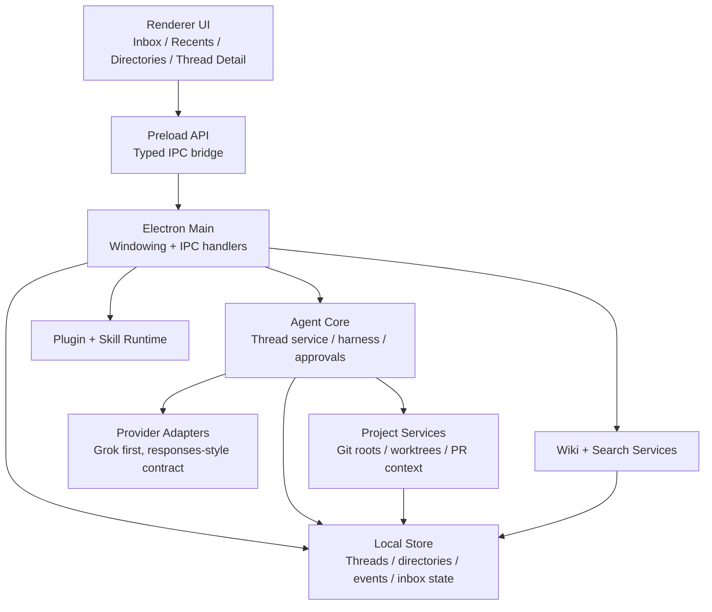

# feat: Thread-centric agent desktop foundation

## Overview

Build the first real version of a desktop coding agent whose differentiator is thread navigation rather than repo-first attachment. The milestone should ship a runnable Electron app with a real provider/harness path, thread persistence, Inbox plus Recents plus Directories navigation, multi-directory thread associations, and enough plugin/wiki infrastructure that the product already feels accumulative instead of stateless.

## Problem Frame

The origin requirements define a thread-first product surface where users can start from a blank thread, attach repos later, and find important work from Inbox before drilling into Recents or Directories (see origin: `docs/brainstorms/2026-04-16-thread-centric-agent-desktop-requirements.md`). The technical plan must preserve that product behavior while creating the repo structure, local persistence, IPC boundaries, and provider abstraction needed for a credible interview-ready demo.

## Requirements Trace

- R1-R4. Support thread creation with or without directories and preserve thread identity independent of repo attachment.
- R5-R11. Deliver Inbox-first navigation, Recents and Directories lenses, and enough thread context visibility to understand linked repos and PR/worktree status.
- R12-R15. Model many-to-many Git directory links plus working-directory distinctions such as worktrees.
- R16-R19. Support guarded versus full-access execution modes with a risk-based approval layer.
- R20-R22. Provide a real Grok-first but provider-agnostic agent harness and core coding loop.
- R23-R26. Include real skills/plugins and wiki memory foundations with lexical and semantic search paths.

## Scope Boundaries

- No custom credential unlock agent or in-app SSH-agent replacement in this milestone.
- No hardening for maximum-sandbox security posture beyond the guarded/full-access split.
- No custom inbox-rule editor, pinning system, or advanced project organization beyond Inbox, Recents, and Directories.
- No attempt to finish every long-tail feature implied by plugins or wiki memory; only the smallest real end-to-end slice is in scope.

## Context & Research

### Relevant Code and Patterns

- The repo is currently greenfield aside from the brainstorm document.
- There are no local implementation patterns yet, so Unit 1 must establish the workspace, testing, typing, and package boundaries that later units follow.

### Institutional Learnings

- No relevant `docs/solutions/` artifacts exist yet in this repository.

### External References

- Electron process model: [electronjs.org/docs/latest/tutorial/process-model](https://www.electronjs.org/docs/latest/tutorial/process-model)
- Electron preload guidance: [electronjs.org/docs/latest/tutorial/tutorial-preload](https://www.electronjs.org/docs/latest/tutorial/tutorial-preload)
- Electron IPC guidance: [electronjs.org/docs/latest/tutorial/ipc](https://www.electronjs.org/docs/latest/tutorial/ipc)
- Electron renderer sandboxing notes: [electronjs.org/docs/latest/tutorial/sandbox](https://www.electronjs.org/docs/latest/tutorial/sandbox)

## Key Technical Decisions

- Use a `pnpm` workspace from day one so the Electron app, shared contracts, agent runtime, plugin runtime, and wiki services can evolve without immediate repo surgery.
- Keep privileged orchestration in the Electron main process, expose only typed preload APIs to the renderer, and treat renderer code as unprivileged UI per Electron's process and preload model.
- Use TypeScript across the workspace so IPC contracts, persisted thread models, provider interfaces, and plugin manifests share one type system.
- Persist thread, directory, execution-mode, inbox-state, and message/event data in a local relational store so many-to-many thread-to-directory navigation remains queryable.
- Keep Git roots and working directories as separate persisted concepts so local mode and worktree mode can share one thread model.
- Start with one internal plugin/skill registration path that the app itself consumes, then generalize only after the first milestone proves the shape.
- Treat semantic wiki search as a service boundary, not a UI trick, so the first milestone can start with a pluggable indexer and avoid hard-coding one search backend into the renderer.

## Open Questions

### Resolved During Planning

- Workspace shape: use a single workspace repo with one Electron app and a small number of packages rather than one large app folder.
- Process split: place agent runtime, git/project services, approvals, plugin loading, and wiki indexing behind main-process services; renderer consumes them through typed preload APIs.
- Persistence model: use a relational local store for thread navigation and directory associations instead of file-name-driven discovery or ad hoc JSON blobs.
- Milestone emphasis: prioritize thread navigation and agent/provider reality first; credential mediation stays deferred.

### Deferred to Implementation

- Exact scoring weights for Inbox ordering should be tuned while wiring real event flows rather than guessed fully in the plan.
- Exact semantic-search backend can be finalized once the first wiki corpus and performance envelope are known.
- Exact provider adapter edge cases, especially tool streaming and interruption behavior, should be finalized while integrating the first real provider.

## High-Level Technical Design

> *This illustrates the intended approach and is directional guidance for review, not implementation specification. The implementing agent should treat it as context, not code to reproduce.*

## Phased Delivery

### Phase 1
- Workspace scaffold, Electron shell, typed IPC foundation, shared contracts, and persistence skeleton.

### Phase 2
- Agent harness, provider abstraction, thread persistence, and the first runnable coding loop.

### Phase 3
- Thread-first renderer surfaces: Inbox, Recents, Directories, thread detail, and multi-directory visibility.

### Phase 4
- Plugin/skill and wiki/search foundations to make the product feel extensible and accumulative.

## Implementation Units

- [ ] **Unit 1: Establish the workspace and desktop shell**

**Goal:** Create the monorepo structure, Electron app shell, shared TypeScript configuration, and baseline test harness that every later unit can build on.

**Requirements:** R20-R22

**Dependencies:** None

**Files:**
- Create: `package.json`
- Create: `pnpm-workspace.yaml`
- Create: `tsconfig.base.json`
- Create: `.gitignore`
- Create: `README.md`
- Create: `apps/desktop/package.json`
- Create: `apps/desktop/electron.vite.config.ts`
- Create: `apps/desktop/src/main/index.ts`
- Create: `apps/desktop/src/main/window.ts`
- Create: `apps/desktop/src/preload/index.ts`
- Create: `apps/desktop/src/renderer/index.html`
- Create: `apps/desktop/src/renderer/src/main.tsx`
- Create: `apps/desktop/src/renderer/src/App.tsx`
- Create: `packages/shared/package.json`
- Create: `packages/shared/src/index.ts`
- Create: `packages/agent-core/package.json`
- Create: `packages/agent-core/src/index.ts`
- Create: `vitest.workspace.ts`
- Test: `apps/desktop/src/main/__tests__/app-bootstrap.test.ts`
- Test: `apps/desktop/src/renderer/src/__tests__/app-shell.test.tsx`

**Approach:**
- Use a single Electron app with explicit `main`, `preload`, and `renderer` entrypoints.
- Create `packages/shared` for IPC-safe DTOs and domain types; create `packages/agent-core` for thread, provider, approval, plugin, and wiki services that the main process will compose.
- Establish Vitest for package and renderer tests now so later units can land with real coverage instead of retrofitted scaffolding.

**Patterns to follow:**
- No local code patterns exist yet; this unit establishes the default patterns for the repo.

**Test scenarios:**
- Happy path: app bootstrap creates a BrowserWindow with preload configured and the renderer entry loaded.
- Happy path: renderer shell mounts and shows placeholder navigation regions without requiring privileged APIs.
- Error path: preload export surface remains defined even when no thread data exists yet.

**Verification:**
- A developer can install dependencies and launch a blank but running desktop shell with passing baseline tests.

- [ ] **Unit 2: Model thread, directory, and inbox persistence**

**Goal:** Create the persisted domain model for threads, linked Git directories, working directories, inbox state, execution mode, and thread events/messages.

**Requirements:** R1-R6, R12-R19

**Dependencies:** Unit 1

**Files:**
- Create: `packages/agent-core/src/domain/thread.ts`
- Create: `packages/agent-core/src/domain/project.ts`
- Create: `packages/agent-core/src/domain/inbox.ts`
- Create: `packages/agent-core/src/persistence/store.ts`
- Create: `packages/agent-core/src/persistence/migrations.ts`
- Create: `packages/shared/src/contracts/threading.ts`
- Create: `packages/shared/src/contracts/navigation.ts`
- Test: `packages/agent-core/src/__tests__/thread-store.test.ts`
- Test: `packages/agent-core/src/__tests__/directory-linking.test.ts`
- Test: `packages/agent-core/src/__tests__/inbox-ranking.test.ts`

**Approach:**
- Represent threads, Git directories, and working directories as separate entities with explicit join records so one thread can surface under multiple directories without inventing a fake primary owner.
- Persist execution mode on the thread and inbox membership/ranking as derived-but-stored state so Inbox queries remain fast and explainable.
- Store thread events/messages in the same persistence boundary as navigation metadata so the UI can correlate status, approvals, and results.

**Patterns to follow:**
- Follow the type and package boundaries established in Unit 1.

**Test scenarios:**
- Happy path: creating a thread without a directory persists successfully and remains queryable in Recents.
- Happy path: attaching two Git directories to one thread makes the thread queryable under both directories.
- Edge case: local-mode thread stores identical Git and working directory identifiers without duplicate-link corruption.
- Edge case: worktree-mode thread stores distinct Git-root and working-directory records and resolves both correctly.
- Error path: linking a missing or moved directory marks the association degraded without deleting the thread.
- Integration: inbox query returns active, blocked, and newly completed threads in rank order from persisted state.

**Verification:**
- Main-process services can create, update, and query threads and directory links entirely from the local store without renderer-specific logic.

- [ ] **Unit 3: Build the provider contract and agent harness**

**Goal:** Deliver the first real agent runtime with a Grok-first adapter, a generic responses-style provider contract, command execution hooks, and thread event emission.

**Requirements:** R16-R22

**Dependencies:** Unit 2

**Files:**
- Create: `packages/shared/src/contracts/provider.ts`
- Create: `packages/shared/src/contracts/agent.ts`
- Create: `packages/agent-core/src/providers/provider-registry.ts`
- Create: `packages/agent-core/src/providers/grok-provider.ts`
- Create: `packages/agent-core/src/providers/responses-provider.ts`
- Create: `packages/agent-core/src/runtime/agent-harness.ts`
- Create: `packages/agent-core/src/runtime/command-runner.ts`
- Create: `packages/agent-core/src/runtime/approval-policy.ts`
- Create: `apps/desktop/src/main/ipc/agent-ipc.ts`
- Test: `packages/agent-core/src/__tests__/agent-harness.test.ts`
- Test: `packages/agent-core/src/__tests__/approval-policy.test.ts`
- Test: `apps/desktop/src/main/__tests__/agent-ipc.test.ts`

**Approach:**
- Define one provider interface that covers request submission, streaming responses/events, tool or command intents, cancellation, and structured error reporting.
- Implement Grok first behind that interface, then add a second generic responses-style adapter to prove the abstraction is not fake.
- Keep command execution and approval checks in the harness boundary so thread events, logs, and user prompts share one source of truth.

**Execution note:** Start with failing tests around provider event translation and approval decisions before wiring the live adapter.

**Patterns to follow:**
- Typed IPC and domain contracts from Units 1 and 2.

**Test scenarios:**
- Happy path: harness starts a thread run, streams provider output, and persists thread events.
- Happy path: Grok adapter satisfies the shared provider contract and emits normalized events.
- Happy path: generic responses-style adapter can be registered beside Grok without changing harness code.
- Edge case: user cancels an in-flight run and the thread returns to a non-running state with a persisted cancellation event.
- Error path: provider error surfaces as a thread event and does not corrupt prior transcript state.
- Error path: guarded-mode destructive command request triggers approval-needed status instead of executing immediately.
- Integration: IPC call from renderer starts a harness run and returns normalized state updates to the UI.

**Verification:**
- The app can run a real provider-backed thread and produce persisted messages/events with guarded/full-access behavior.

- [ ] **Unit 4: Ship Inbox, Recents, Directories, and thread detail UI**

**Goal:** Build the renderer experience that makes thread navigation visibly better than repo-first tools.

**Requirements:** R5-R13, R20-R22

**Dependencies:** Unit 3

**Files:**
- Create: `apps/desktop/src/renderer/src/features/navigation/Sidebar.tsx`
- Create: `apps/desktop/src/renderer/src/features/navigation/InboxList.tsx`
- Create: `apps/desktop/src/renderer/src/features/navigation/RecentsList.tsx`
- Create: `apps/desktop/src/renderer/src/features/navigation/DirectoriesList.tsx`
- Create: `apps/desktop/src/renderer/src/features/thread-detail/ThreadView.tsx`
- Create: `apps/desktop/src/renderer/src/features/thread-detail/ThreadHeader.tsx`
- Create: `apps/desktop/src/renderer/src/features/thread-detail/ThreadContextPanel.tsx`
- Create: `apps/desktop/src/renderer/src/features/composer/Composer.tsx`
- Create: `apps/desktop/src/renderer/src/lib/useThreadNavigation.ts`
- Create: `apps/desktop/src/renderer/src/styles/app.css`
- Test: `apps/desktop/src/renderer/src/features/navigation/__tests__/sidebar.test.tsx`
- Test: `apps/desktop/src/renderer/src/features/thread-detail/__tests__/thread-view.test.tsx`
- Test: `apps/desktop/e2e/thread-navigation.spec.ts`

**Approach:**
- Make Inbox the top section of the sidebar, with Recents and Directories presented as alternate browsing lenses below it.
- Ensure thread rows can display linked-directory summary text without requiring users to open the thread first.
- In thread detail, surface linked Git directories, working directories, branches, and PR/stacked-PR context in one place so multi-repo work is legible.

**Patterns to follow:**
- Renderer feature-folder pattern established in Unit 1.

**Test scenarios:**
- Happy path: sidebar opens with Inbox first and Recents as the default lens beneath it.
- Happy path: a cross-project thread appears under both linked directories in directory mode.
- Happy path: a thread can appear in Inbox and still appear in Recents without duplication bugs in thread identity.
- Edge case: a directory-less thread still renders meaningfully in Recents and thread detail.
- Edge case: long linked-directory labels truncate safely without hiding the fact that multiple repos are attached.
- Integration: clicking a thread from Inbox preserves selected thread state while switching the underlying browse lens.

**Verification:**
- A demo user can understand the app's thread-first model from the sidebar and thread detail alone.

- [ ] **Unit 5: Add project attachment, worktree awareness, and repo-status enrichment**

**Goal:** Let threads attach projects after creation, distinguish Git roots from working directories, and surface branch/PR/worktree context cleanly.

**Requirements:** R1-R4, R10-R15

**Dependencies:** Unit 4

**Files:**
- Create: `packages/agent-core/src/projects/project-locator.ts`
- Create: `packages/agent-core/src/projects/project-link-service.ts`
- Create: `packages/agent-core/src/projects/git-context-service.ts`
- Create: `packages/agent-core/src/projects/worktree-service.ts`
- Create: `apps/desktop/src/main/ipc/project-ipc.ts`
- Modify: `apps/desktop/src/renderer/src/features/thread-detail/ThreadContextPanel.tsx`
- Modify: `apps/desktop/src/renderer/src/features/composer/Composer.tsx`
- Test: `packages/agent-core/src/__tests__/project-link-service.test.ts`
- Test: `packages/agent-core/src/__tests__/git-context-service.test.ts`
- Test: `apps/desktop/src/main/__tests__/project-ipc.test.ts`
- Test: `apps/desktop/e2e/project-attachment.spec.ts`

**Approach:**
- Support two attachment paths: start from a known directory, or mention a project later and resolve it through locator/clone flows.
- Keep Git-root identity separate from working-directory identity so UI grouping always follows the Git directory even when execution happens in worktrees.
- Enrich thread detail with branch and PR metadata from the linked project services rather than storing UI-only denormalizations in renderer state.

**Patterns to follow:**
- Persistence and IPC patterns from Units 2 and 3.

**Test scenarios:**
- Happy path: a directory-less thread can attach an existing local repo and immediately surface under that directory.
- Happy path: a thread with two linked repos renders under both directory listings and shows both in thread detail.
- Happy path: worktree-mode thread groups under the Git root while showing the worktree path in thread context.
- Edge case: project lookup fails and the thread remains usable with an actionable attachment error.
- Edge case: repo metadata refresh updates branch/PR status without duplicating directory links.
- Integration: attaching a repo from the composer updates persistence, directory view, and thread detail in one flow.

**Verification:**
- Users can start vague, then concretize a thread into one or more repos without reopening or recreating the thread.

- [ ] **Unit 6: Introduce the first real plugin and skill runtime**

**Goal:** Make extensibility real enough that internal and future external capabilities can register tools, prompts, and metadata without hard-coding everything into the harness.

**Requirements:** R23-R24

**Dependencies:** Unit 3

**Files:**
- Create: `packages/shared/src/contracts/plugin.ts`
- Create: `packages/agent-core/src/plugins/plugin-manifest.ts`
- Create: `packages/agent-core/src/plugins/plugin-registry.ts`
- Create: `packages/agent-core/src/plugins/skill-registry.ts`
- Create: `packages/agent-core/src/plugins/builtin/thread-navigation-plugin.ts`
- Create: `apps/desktop/src/main/ipc/plugin-ipc.ts`
- Create: `apps/desktop/src/renderer/src/features/plugins/PluginsView.tsx`
- Test: `packages/agent-core/src/__tests__/plugin-registry.test.ts`
- Test: `packages/agent-core/src/__tests__/skill-registry.test.ts`
- Test: `apps/desktop/src/renderer/src/features/plugins/__tests__/plugins-view.test.tsx`

**Approach:**
- Start with manifest-based registration and a small built-in plugin so the system proves discovery, registration, and renderer visibility before tackling a marketplace.
- Keep plugin and skill metadata in shared contracts so renderer listings and harness loading speak the same language.
- Route plugin-triggered capability loading through the main process to avoid renderer privilege creep.

**Patterns to follow:**
- Shared contract registration style from Units 1 and 3.

**Test scenarios:**
- Happy path: built-in plugin registers on startup and is visible to both the runtime and the UI.
- Happy path: skill metadata can be enumerated and associated with plugin-provided capabilities.
- Error path: invalid manifest is rejected without crashing app startup.
- Integration: enabling a built-in plugin makes its capability available to the harness through the registry.

**Verification:**
- The app can prove that capabilities are discovered through a registry rather than hard-coded directly into the renderer or harness.

- [ ] **Unit 7: Add the maintained wiki and searchable memory foundation**

**Goal:** Create a first-class memory/wiki subsystem that the product maintains and the user can browse, search, and lightly edit.

**Requirements:** R24-R26

**Dependencies:** Unit 6

**Files:**
- Create: `packages/shared/src/contracts/wiki.ts`
- Create: `packages/agent-core/src/wiki/wiki-store.ts`
- Create: `packages/agent-core/src/wiki/wiki-search.ts`
- Create: `packages/agent-core/src/wiki/wiki-sync.ts`
- Create: `apps/desktop/src/main/ipc/wiki-ipc.ts`
- Create: `apps/desktop/src/renderer/src/features/wiki/WikiView.tsx`
- Create: `apps/desktop/src/renderer/src/features/wiki/WikiSearch.tsx`
- Create: `apps/desktop/src/renderer/src/features/wiki/WikiEditor.tsx`
- Test: `packages/agent-core/src/__tests__/wiki-store.test.ts`
- Test: `packages/agent-core/src/__tests__/wiki-search.test.ts`
- Test: `apps/desktop/src/renderer/src/features/wiki/__tests__/wiki-view.test.tsx`
- Test: `apps/desktop/e2e/wiki-search.spec.ts`

**Approach:**
- Persist wiki entries separately from transient thread state so memory survives thread churn and can be reused across projects.
- Implement lexical search first-class and keep semantic search behind a swappable index interface so the milestone can ship real search without prematurely locking the embedding backend.
- Expose the wiki in the UI as inspectable and lightly editable system memory rather than a hidden settings blob.

**Patterns to follow:**
- Registry/service patterns from Units 2, 3, and 6.

**Test scenarios:**
- Happy path: creating a wiki entry makes it retrievable through lexical search.
- Happy path: semantic-search adapter can be called through the shared interface without changing renderer behavior.
- Edge case: empty search query returns a sensible browse view rather than an error.
- Error path: semantic index backend unavailable falls back to lexical search with an explicit degraded-state indicator.
- Integration: wiki edits from the renderer persist and become visible to the agent-side wiki service.

**Verification:**
- Users can browse and search maintained memory in-app, and the runtime has a service boundary it can query for reusable guidance.

## System-Wide Impact

- **Interaction graph:** renderer -> preload -> main IPC -> agent core services -> local store/provider/git/plugin/wiki services.
- **Error propagation:** provider, git, search, or plugin failures should surface as thread or feature-level state without crashing the renderer or corrupting persisted thread state.
- **State lifecycle risks:** thread runs, approvals, and directory attachments can race with navigation updates; the store must remain the source of truth for derived Inbox and directory views.
- **API surface parity:** provider adapters, plugin manifests, wiki search interfaces, and thread IPC payloads all depend on stable shared contracts in `packages/shared`.
- **Integration coverage:** cross-layer tests are required for provider event flow, project attachment flow, and wiki edit/search flow because unit tests alone will not prove IPC and persistence behavior.
- **Unchanged invariants:** credential mediation stays out of scope; thread-first navigation remains the hero even as plugins and wiki memory are added.

## Risk Analysis & Mitigation

| Risk | Likelihood | Impact | Mitigation |
|------|-----------|--------|------------|
| Over-scoping the first milestone into a general-purpose IDE shell | Medium | High | Keep all units tied back to thread navigation, provider reality, plugins, or wiki memory; cut polish before adding new systems |
| Electron IPC boundary becomes ad hoc and insecure | Medium | High | Centralize typed preload APIs and IPC contracts in shared packages from Unit 1 onward |
| Many-to-many directory modeling becomes confusing in UI | Medium | High | Treat persisted thread identity as canonical and add list/detail visibility tests for multi-directory cases |
| Provider abstraction collapses into Grok-specific behavior | Medium | High | Implement a second responses-style adapter in the same milestone to force normalization early |
| Inbox becomes noisy and fails the product promise | High | Medium | Persist explicit inbox signals and keep ranking logic isolated and testable rather than buried in UI components |
| Wiki semantic search becomes a rabbit hole | Medium | Medium | Keep semantic search behind an interface and ship lexical search as the guaranteed fallback |

## Documentation Plan

- Add onboarding/setup instructions to the root `README.md` as Unit 1 lands.
- Add a short architecture note once Units 2 and 3 land, covering process boundaries and shared contracts.
- Add user-facing documentation for plugin discovery and wiki behavior once Units 6 and 7 land.

## Sources & References

- **Origin document:** [docs/brainstorms/2026-04-16-thread-centric-agent-desktop-requirements.md](../brainstorms/2026-04-16-thread-centric-agent-desktop-requirements.md)
- External docs: [Electron process model](https://www.electronjs.org/docs/latest/tutorial/process-model)
- External docs: [Electron preload](https://www.electronjs.org/docs/latest/tutorial/tutorial-preload)
- External docs: [Electron IPC](https://www.electronjs.org/docs/latest/tutorial/ipc)
- External docs: [Electron sandboxing](https://www.electronjs.org/docs/latest/tutorial/sandbox)
