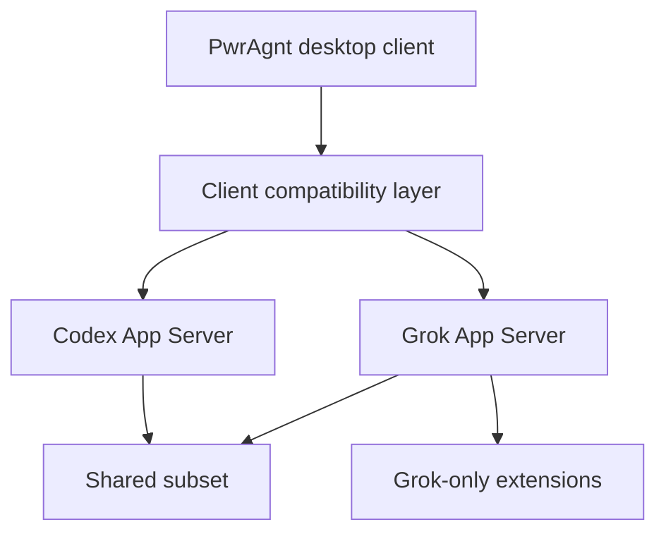

# feat: Define app-server protocol compatibility strategy

## Overview

Define how PwrAgnt should use the Codex App Server JSON-RPC protocol and how a future Grok App Server should interoperate with the same desktop client without introducing extra proxy or worker processes. The outcome of this plan is a clear protocol strategy, a minimum compatible subset, and an implementation path that lets PwrAgnt speak directly to both Codex App Server and a custom Grok App Server.

## Problem Frame

PwrAgnt needs a real agent backend contract soon enough that the desktop app does not drift into a UI shell without a durable execution surface. The user already has a working TypeScript client for Codex App Server behavior in a local project and wants to reuse as much of that as possible, but does not want two additional worker processes standing between the desktop app and the actual agent server.

This plan therefore assumes:

- PwrAgnt is a direct client of Codex App Server
- PwrAgnt is also a direct client of a future Grok App Server
- compatibility logic may live in the desktop client for now
- Grok may expose protocol extensions that Codex does not, especially for multi-project behavior

That approach still needs a disciplined spec, otherwise the client will collapse into ad hoc method branching and incompatible assumptions about turns, approvals, and thread lifecycle.

## Requirements Trace

- R1-R4. Threads must remain first-class even when they start without a directory, so the protocol strategy cannot assume a single cwd-first model only.
- R10-R15. Multi-directory and worktree-aware thread behavior must fit either the common protocol subset or Grok-only extensions.
- R16-R19. Guarded vs full-access execution and approval flows must map cleanly to the chosen server contract.
- R20-R22. The desktop app needs a real provider and agent harness boundary; protocol strategy is part of that boundary.
- R23-R26. Skills/plugins and maintained memory may later need protocol exposure, so the compatibility model cannot paint the app into a Codex-only corner.

## Scope Boundaries

- No extra proxy layer or intermediary worker process between PwrAgnt and Codex App Server.
- No attempt to redesign the upstream Codex protocol.
- No requirement that Grok implement every Codex-specific method in milestone one.
- No requirement that PwrAgnt invent a perfectly provider-neutral internal ontology before shipping.
- No packaging, auth, or deployment work for the Grok App Server in this plan.

## Context & Research

### Relevant Code and Patterns

- The main local reference is [openclaw-codex-app-server/src/client.ts](/Users/huntharo/pwrdrvr/openclaw-codex-app-server/src/client.ts), which already implements a TypeScript JSON-RPC client with:
  - stdio and websocket transports
  - `initialize` / `initialized`
  - request fallbacks across multiple Codex method names
  - notification normalization
  - interactive server-request handling for approvals and questionnaires
- The same project already documents a known protocol-specific trap around trust, sandbox policy, and file-edit approvals in [openclaw-codex-app-server/docs/specs/PERMISSIONS.md](/Users/huntharo/pwrdrvr/openclaw-codex-app-server/docs/specs/PERMISSIONS.md).
- The current PwrAgnt repo already has an active desktop foundation plan in [2026-04-16-001-feat-thread-centric-agent-desktop-plan.md](/Users/huntharo/pwrdrvr/PwrAgnt/docs/plans/2026-04-16-001-feat-thread-centric-agent-desktop-plan.md), where Unit 3 expects a provider and harness boundary.

### Institutional Learnings

- No existing `docs/solutions/` artifacts yet cover protocol compatibility or app-server integration in this repository.

### External References

- OpenAI’s App Server article states that App Server is the primary maintained integration path and that the protocol is fully bidirectional JSON-RPC over stdio/JSONL: [Unlocking the Codex harness: how we built the App Server](https://openai.com/index/unlocking-the-codex-harness/)
- OpenAI’s Codex repository guidance says active app-server API work should happen in v2 and calls out method naming and TypeScript/schema generation conventions: [openai/codex AGENTS.md](https://github.com/openai/codex/blob/main/AGENTS.md)

## Key Technical Decisions

- **PwrAgnt will be a direct app-server client, not a client of a local protocol bridge.** This keeps runtime topology simple and avoids adding a second client/server hop just to normalize Codex.
- **Codex App Server v2-compatible behavior is the interop target, not the internal truth model.** PwrAgnt may reuse large portions of the OpenClaw client logic, but should still treat the protocol as an external boundary.
- **The first compatibility target is a minimum common subset, not the full Codex surface.** This keeps Grok App Server scope bounded while still allowing real dual-backend support.
- **Grok-only behavior will use explicit extension methods or payloads gated by capability discovery, not silent divergence inside shared methods.** This avoids claiming compatibility where semantics differ.
- **Multi-project behavior will be a Grok extension first.** Codex compatibility should remain intact even if Codex cannot express the same thread-to-many-project model.
- **Client-side compatibility logic is acceptable for now.** The immediate goal is shipping a working desktop client, not building a perfect protocol abstraction layer before usage pressure exists.

## Open Questions

### Resolved During Planning

- Should PwrAgnt introduce an extra worker/proxy process to bridge between the app and Codex App Server? No. The desktop app should connect directly.
- Should PwrAgnt wait for a fully provider-neutral internal protocol before supporting both backends? No. A direct Codex-compatible client plus a direct Grok client is acceptable for now.
- Should Grok be forced to mimic every Codex method immediately? No. Grok should implement the shared subset first and add explicit extensions where needed.

### Deferred to Implementation

- What exact capability advertisement shape should Grok use for extension discovery: `serverInfo.capabilities`, `experimentalApi`, or a dedicated capability method?
- Which Codex-compatible methods should be treated as hard requirements for the first desktop milestone versus soft optional enhancements?
- Should Grok-only methods use a `grok/*` namespace immediately, or a more neutral extension namespace once the first extensions are clearer?
- How much of the OpenClaw normalization layer can be lifted directly before it brings in chat-client-specific assumptions?

## High-Level Technical Design

> *This illustrates the intended approach and is directional guidance for review, not implementation specification. The implementing agent should treat it as context, not code to reproduce.*

### Minimum Shared Subset

The first dual-backend surface should be limited to the methods and notifications PwrAgnt actually needs for thread and turn UX.

| Surface | Shared subset target | Notes |
|---|---|---|
| Handshake | `initialize`, `initialized` | Required for both backends |
| Thread discovery | `thread/list` | Codex compatibility baseline |
| Thread creation | `thread/start` or `thread/new` compatibility handling in client | Client may need fallback logic |
| Thread load/resume | `thread/resume` | Required for reopening threads |
| Thread read | `thread/read` | Needed for transcript/context hydration |
| Thread naming | `thread/name/set` | Useful but still part of common thread UX |
| Turn start | `turn/start` | Core execution entrypoint |
| Turn control | `turn/steer`, `turn/interrupt` | Required for interactive agent control |
| Progress notifications | `item/started`, `item/completed` | Shared event lifecycle target |
| Terminal notifications | `turn/completed`, `turn/failed`, `turn/cancelled` | Required for turn end-state |
| Interactive requests | approval/questionnaire-style server requests plus `serverRequest/resolved` | Required for guarded mode |

### Grok-Only Extensions

Grok-specific protocol additions should remain outside the shared subset and be gated by capability discovery. The first likely extension family is multi-project thread behavior, for example:

- listing or resolving multiple project roots
- linking multiple projects to one thread
- returning richer thread-to-project associations than Codex can express

The guiding rule is:

- **shared methods when semantics truly match**
- **extension methods when semantics diverge**

## Implementation Units

- [ ] **Unit 1: Write the protocol strategy spec**

**Goal:** Capture the compatibility strategy in a durable protocol spec document that future client and server work can follow.

**Requirements:** R20-R22

**Dependencies:** None

**Files:**
- Create: `docs/specs/app-server-protocol-compatibility.md`
- Modify: `docs/plans/2026-04-16-001-feat-thread-centric-agent-desktop-plan.md`
- Test: none -- documentation and planning unit

**Approach:**
- Turn this plan’s decisions into a concise spec that names the minimum shared subset, extension boundaries, and direct-client topology.
- Explicitly document that PwrAgnt is a direct client of Codex App Server and a direct client of Grok App Server.
- Call out what is safe to “steal” from the OpenClaw client and what remains Codex-specific baggage.

**Patterns to follow:**
- [openclaw-codex-app-server/src/client.ts](/Users/huntharo/pwrdrvr/openclaw-codex-app-server/src/client.ts)
- [openclaw-codex-app-server/docs/specs/PERMISSIONS.md](/Users/huntharo/pwrdrvr/openclaw-codex-app-server/docs/specs/PERMISSIONS.md)

**Test scenarios:**
- Test expectation: none -- documentation and strategy artifact only

**Verification:**
- A new contributor can answer which methods are baseline-compatible, which are Grok-only, and where protocol normalization belongs without re-reading this conversation.

- [ ] **Unit 2: Build the shared JSON-RPC transport and compatibility client**

**Goal:** Create a reusable client layer in PwrAgnt that can talk directly to Codex App Server and Grok App Server over the same transport primitives.

**Requirements:** R20-R22

**Dependencies:** Unit 1

**Files:**
- Create: `packages/agent-core/src/app-server/json-rpc-client.ts`
- Create: `packages/agent-core/src/app-server/stdio-transport.ts`
- Create: `packages/agent-core/src/app-server/websocket-transport.ts`
- Create: `packages/agent-core/src/app-server/compatibility-client.ts`
- Create: `packages/shared/src/contracts/app-server.ts`
- Test: `packages/agent-core/src/app-server/__tests__/json-rpc-client.test.ts`
- Test: `packages/agent-core/src/app-server/__tests__/compatibility-client.test.ts`

**Approach:**
- Lift the transport and request/notification handling ideas from the OpenClaw client, but separate them from chat-plugin-specific state and formatting.
- Normalize only the method-shape drift that is necessary for Codex compatibility.
- Keep the client layer focused on protocol IO and event normalization, not UI decisions.

**Execution note:** Start with failing transport and method-fallback tests before implementing the client surface.

**Patterns to follow:**
- [openclaw-codex-app-server/src/client.ts](/Users/huntharo/pwrdrvr/openclaw-codex-app-server/src/client.ts)

**Test scenarios:**
- Happy path: stdio transport can initialize and exchange JSON-RPC requests/responses with a mock server.
- Happy path: websocket transport can initialize and exchange the same envelope shape.
- Happy path: compatibility client falls back across supported Codex method aliases and returns one normalized result.
- Error path: transport close while a request is pending rejects with a stable client error.
- Integration: a server-initiated interactive request is surfaced to the client request handler and resolved back across JSON-RPC correctly.

**Verification:**
- PwrAgnt has one tested client layer that can speak the shared subset over both supported transports.

- [ ] **Unit 3: Implement the Codex-compatible subset contract in PwrAgnt**

**Goal:** Define the exact desktop-facing contract PwrAgnt will rely on when speaking to Codex App Server.

**Requirements:** R16-R22

**Dependencies:** Unit 2

**Files:**
- Create: `packages/agent-core/src/app-server/codex-subset.ts`
- Create: `packages/agent-core/src/app-server/codex-mappers.ts`
- Create: `packages/shared/src/contracts/agent-events.ts`
- Test: `packages/agent-core/src/app-server/__tests__/codex-subset.test.ts`
- Test: `packages/agent-core/src/app-server/__tests__/codex-mappers.test.ts`

**Approach:**
- Encode the minimum shared subset as explicit request and event mappers rather than sprinkling method names around the app.
- Normalize Codex notifications into desktop-facing thread, turn, approval, and file-change events.
- Keep optional Codex-only methods such as compaction, MCP listing, or rate-limit/account reads outside the minimum required subset unless the desktop product truly depends on them.

**Patterns to follow:**
- [openclaw-codex-app-server/src/client.ts](/Users/huntharo/pwrdrvr/openclaw-codex-app-server/src/client.ts)

**Test scenarios:**
- Happy path: `thread/start`, `thread/resume`, `thread/read`, and `turn/start` map into stable desktop events.
- Happy path: `item/started` and `item/completed` notifications yield normalized item lifecycle events.
- Edge case: Codex method fallback from `thread/new` to `thread/start` still produces the same normalized thread-start result.
- Error path: `turn/failed` with structured error data maps into a stable terminal error object.
- Integration: a full turn request plus streamed notifications yields one coherent normalized turn timeline.

**Verification:**
- PwrAgnt can treat Codex App Server as one explicit supported backend contract instead of a pile of raw method strings.

- [ ] **Unit 4: Define Grok App Server shared-subset support and extension rules**

**Goal:** Specify how the Grok App Server should implement the Codex-compatible subset and advertise any extra capabilities.

**Requirements:** R10-R15, R20-R22

**Dependencies:** Unit 3

**Files:**
- Create: `docs/specs/grok-app-server-protocol.md`
- Create: `packages/shared/src/contracts/grok-capabilities.ts`
- Test: `packages/agent-core/src/app-server/__tests__/grok-capabilities.test.ts`

**Approach:**
- Require Grok App Server to implement the minimum shared subset first.
- Introduce explicit capability discovery for Grok-only features rather than overloading the shared Codex-compatible methods with incompatible semantics.
- Define the first extension family around multi-project thread behavior and richer thread-to-project association data.

**Technical design:** *(directional guidance, not implementation specification)*
- Shared subset:
  - handshake
  - thread lifecycle
  - turn lifecycle
  - approvals
- Extension subset:
  - multi-project thread attachment
  - richer linked-project read models
  - any future Grok-only memory/tool surfaces

**Patterns to follow:**
- [openclaw-codex-app-server/src/client.ts](/Users/huntharo/pwrdrvr/openclaw-codex-app-server/src/client.ts)
- [openai.com Codex App Server article](https://openai.com/index/unlocking-the-codex-harness/)

**Test scenarios:**
- Happy path: Grok capability discovery indicates only shared-subset support and the client stays on baseline methods.
- Happy path: Grok capability discovery indicates multi-project support and the client enables extension calls.
- Error path: missing or malformed capability advertisement causes the client to fall back to shared-subset assumptions.
- Integration: the client can connect to Codex and Grok servers with different capability sets without changing UI-facing contracts.

**Verification:**
- The Grok server contract is explicit enough that server work can begin without guessing which Codex behaviors are required and which are extension-only.

- [ ] **Unit 5: Integrate backend selection into the desktop runtime**

**Goal:** Thread the chosen app-server backend through the desktop runtime so PwrAgnt can select Codex or Grok per thread or environment.

**Requirements:** R1-R4, R16-R22

**Dependencies:** Unit 4

**Files:**
- Modify: `packages/agent-core/src/index.ts`
- Create: `packages/agent-core/src/runtime/app-server-session.ts`
- Create: `packages/agent-core/src/runtime/backend-selection.ts`
- Modify: `apps/desktop/src/main/ipc/agent-ipc.ts`
- Test: `packages/agent-core/src/runtime/__tests__/backend-selection.test.ts`
- Test: `apps/desktop/src/main/__tests__/agent-ipc.test.ts`

**Approach:**
- Treat backend choice as runtime configuration associated with a thread or session, not as a global compile-time choice.
- Keep selection logic in the main-process/runtime boundary, not the renderer.
- Ensure the desktop app can speak directly to either server using the same normalized event surface where the subset applies.

**Patterns to follow:**
- [2026-04-16-001-feat-thread-centric-agent-desktop-plan.md](/Users/huntharo/pwrdrvr/PwrAgnt/docs/plans/2026-04-16-001-feat-thread-centric-agent-desktop-plan.md)

**Test scenarios:**
- Happy path: starting a thread against Codex selects the Codex-compatible backend path.
- Happy path: starting a thread against Grok selects the Grok backend path and still uses the shared subset for baseline turn UX.
- Edge case: a Grok-only extension is unavailable and the thread still functions on the shared subset.
- Error path: unsupported backend configuration is rejected with a stable runtime error.
- Integration: IPC-triggered thread startup reaches the correct backend session factory based on runtime configuration.

**Verification:**
- The desktop runtime can choose Codex or Grok without introducing a proxy service and without exposing raw backend divergence to the renderer.

## System-Wide Impact

- **Interaction graph:** renderer -> main IPC -> agent runtime -> app-server compatibility client -> Codex App Server or Grok App Server.
- **Error propagation:** transport failures, unsupported methods, capability mismatches, and approval-request handling errors must surface as stable runtime/backend errors rather than raw JSON-RPC noise.
- **State lifecycle risks:** thread identity, turn identity, pending approvals, and file-change proposals must remain coherent when different backends emit similar but not identical event sequences.
- **API surface parity:** the desktop client must preserve one minimum common subset across backends even while Grok adds extensions.
- **Integration coverage:** end-to-end tests are required around initialize/turn/approval/terminal flows because unit tests alone will not prove backend compatibility behavior.
- **Unchanged invariants:** PwrAgnt remains thread-first; no additional proxy layer is introduced; Codex compatibility is additive rather than rewritten.

## Risks & Dependencies

| Risk | Mitigation |
|------|------------|
| The team overestimates how much of Codex App Server is generic | Lock the first milestone to a documented minimum shared subset |
| Grok extensions bleed into the shared contract and break compatibility claims | Gate extensions behind explicit capability discovery and keep them out of shared methods unless semantics truly match |
| Reused OpenClaw logic drags in chat-plugin assumptions | Lift transport and normalization patterns selectively, with fresh tests in PwrAgnt |
| Codex protocol drift makes the client brittle | Centralize method fallback and event mapping in one compatibility client layer |
| Multi-project support distorts the baseline thread model too early | Treat multi-project as Grok-only first and keep Codex support on the baseline subset |

## Documentation / Operational Notes

- Add the protocol strategy spec before deeper backend implementation so future work references one durable contract.
- Keep any later Grok App Server documentation clearly marked as “shared subset” vs “extension surface.”
- This change has no production rollout or monitoring implications yet because it is planning and protocol definition only.

## Sources & References

- **Origin document:** [docs/brainstorms/2026-04-16-thread-centric-agent-desktop-requirements.md](../brainstorms/2026-04-16-thread-centric-agent-desktop-requirements.md)
- Existing desktop foundation plan: [docs/plans/2026-04-16-001-feat-thread-centric-agent-desktop-plan.md](/Users/huntharo/pwrdrvr/PwrAgnt/docs/plans/2026-04-16-001-feat-thread-centric-agent-desktop-plan.md)
- Local reference client: [openclaw-codex-app-server/src/client.ts](/Users/huntharo/pwrdrvr/openclaw-codex-app-server/src/client.ts)
- Local permissions notes: [openclaw-codex-app-server/docs/specs/PERMISSIONS.md](/Users/huntharo/pwrdrvr/openclaw-codex-app-server/docs/specs/PERMISSIONS.md)
- External article: [Unlocking the Codex harness: how we built the App Server](https://openai.com/index/unlocking-the-codex-harness/)
- Upstream app-server guidance: [openai/codex AGENTS.md](https://github.com/openai/codex/blob/main/AGENTS.md)
