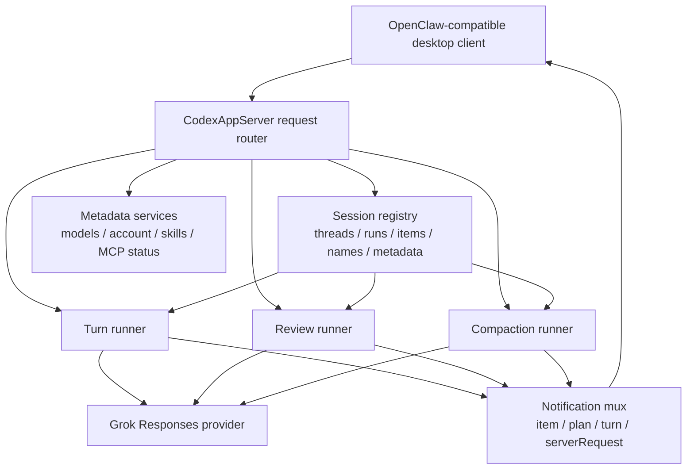

# feat: Flesh out app-server compatibility for OpenClaw usage

## Overview

Expand the active app-server compatibility plan so `packages/agent-core` grows from a minimal Grok-backed Codex app-server skeleton into an implementation that satisfies the Codex App Server functionality already consumed by `/Users/huntharo/pwrdrvr/openclaw-codex-app-server`. The goal is concrete interoperability, not abstract protocol discussion: the Grok app server should support the methods, payload tolerance, and notification flow that OpenClaw already relies on for thread discovery, turn control, metadata reads, review, and compaction.

## Problem Frame

The repo now has a working baseline from the merged Grok test-suite work:

- `packages/agent-core/src/app-server/codex-app-server.ts` handles `initialize`, `thread/start`, `thread/new`, `thread/resume`, `thread/read`, `turn/start`, `turn/steer`, and `turn/interrupt`
- `packages/agent-core/src/providers/grok-provider.ts` and `xai-responses-client.ts` prove the xAI Responses path works for basic turns
- deterministic tests and a live-gated xAI smoke test already exist

That baseline is enough to prove the direction, but it is still narrower than the consumer we actually want to support. The OpenClaw client currently calls or listens for a larger surface:

- `thread/list` or `thread/loaded/list`
- `model/list`
- `skills/list`
- `experimentalFeature/list`
- `mcpServerStatus/list`
- `account/rateLimits/read`
- `account/read`
- `thread/name/set`
- `thread/compact/start`
- `review/start`
- progress and plan notifications such as `item/started`, `item/completed`, `item/plan/delta`, `turn/plan/updated`
- interactive request flows plus `serverRequest/resolved`

If PwrAgnt stops at the current subset, the desktop client will either fail against the Grok server or accumulate client-side special cases that undercut the whole point of a shared app-server contract. This plan turns the remaining compatibility gap into a concrete implementation backlog.

## Requirements Trace

- R16-R19. Guarded versus full-access execution settings, approvals, and interruption must remain observable and controllable through the app-server contract.
- R20. The server must stay backed by a real provider path, not a fake compatibility shell.
- R21. Grok remains the first real provider, but the server surface must look like the Codex App Server interface the desktop client already knows how to consume.
- R22. The core coding loop must include thread start or resume, thread readback, turn start, steer, interrupt, review, and compaction.
- Consumer parity requirement: implement at least the Codex App Server functionality currently used by `/Users/huntharo/pwrdrvr/openclaw-codex-app-server/src/client.ts`.
- Compatibility requirement: tolerate optional payload fields OpenClaw already sends, including `persistExtendedHistory`, `includeTurns`, and `collaborationMode` or `collaboration_mode`, even if milestone one only stores or ignores some of them.

## Scope Boundaries

- In scope: the methods and notifications OpenClaw consumes today, plus the server-side state and tests needed to support them.
- In scope: returning stable empty or derived data for metadata endpoints when the backing subsystem does not exist yet.
- Out of scope: full Codex App Server v2 surface beyond what OpenClaw currently uses.
- Out of scope: durable cross-process thread persistence; this plan may continue to use in-memory session state as long as the interface is compatible within one server process.
- Out of scope: implementing a real MCP runtime, skill runtime, or account-management backend; shape-first compatibility is acceptable for those endpoints in this phase.
- Out of scope: adding another provider beyond Grok.

## Context & Research

### Relevant Code and Patterns

- `packages/agent-core/src/app-server/codex-app-server.ts` currently advertises only eight methods and only emits terminal turn notifications.
- `packages/agent-core/src/app-server/protocol.ts` currently models thread state, thread replay, and terminal turn notifications, but not discovery lists, metadata reads, progress notifications, pending input, review, or compaction.
- `packages/agent-core/src/app-server/session-state.ts` is an in-memory registry with thread state, replay messages, previous xAI response ids, and active runs. It has no listing metadata, thread names, item tracking, or review/compaction state.
- `docs/plans/2026-04-16-002-feat-grok-app-server-tests-plan.md` is complete and already delivered the baseline Grok harness and tests. This plan is the next layer on top of that merged work, not a restart.
- `/Users/huntharo/pwrdrvr/openclaw-codex-app-server/src/client.ts` is the primary consumer contract. It shows the exact method names, fallback ordering, payload variants, and notification parsing the new server must satisfy.

### Institutional Learnings

- No relevant `docs/solutions/` artifacts exist yet for app-server compatibility in this repository.

### OpenClaw Consumer Contract Snapshot

OpenClaw currently depends on this app-server surface:

| Surface | OpenClaw usage | Current `agent-core` state | Target in this plan |
|---|---|---|---|
| Handshake | `initialize`, `initialized` | supported | keep as-is, expand method list |
| Thread discovery | `thread/list`, fallback `thread/loaded/list` | missing | list active threads with stable summaries |
| Thread creation | `thread/start`, fallback `thread/new` | supported | keep, remain lenient on optional fields |
| Thread mutation | `thread/resume`, `thread/name/set` | partial | add naming and richer mutable state |
| Thread replay | `thread/read` with `includeTurns: true` | partial | accept replay flags and return richer context |
| Metadata reads | `model/list`, `skills/list`, `experimentalFeature/list`, `mcpServerStatus/list`, `account/rateLimits/read`, `account/read` | missing | implement stable response shapes |
| Turn lifecycle | `turn/start`, `turn/steer`, `turn/interrupt` | partial | add progress, plan, file-edit, and interactive-request support |
| Review | `review/start` | missing | implement inline review runner |
| Compaction | `thread/compact/start` | missing | implement summarize-and-notify flow |
| Notifications | `item/started`, `item/completed`, `item/plan/delta`, `turn/plan/updated`, `serverRequest/resolved`, `turn/completed`, `turn/failed`, `turn/cancelled`, `thread/compacted` | terminal only | implement the full consumed notification set |

### Notification and Request Details Worth Preserving

- OpenClaw treats interactive server requests generically by method name and currently recognizes request flows whose method names include `requestUserInput` or `requestApproval`.
- OpenClaw enriches file-change approvals by correlating `item/started` notifications and later approval requests, so the server should keep item ids stable across the turn lifecycle.
- OpenClaw uses `turn/plan/updated`, `item/plan/delta`, and `item/completed` to reconstruct plan artifacts incrementally. The Grok app server does not need to match Codex internals exactly, but it does need to emit consistent envelopes the client can consume.
- OpenClaw waits on `thread/compact/start` completion through a mix of `item/*`, usage snapshots, and `thread/compacted`. The server should therefore emit both progress and a terminal compaction signal.

### External References

- xAI Responses API docs show OpenAI-compatible usage against `https://api.x.ai/v1`, including `previous_response_id` chaining for conversation continuity: https://docs.x.ai/developers/model-capabilities/text/generate-text
- xAI model docs show text and image input shapes that matter for the existing multimodal turn support and any review or compaction prompts that reuse the same provider boundary: https://docs.x.ai/docs/models

## Key Technical Decisions

- Use the OpenClaw client as the executable contract anchor. The Grok app server should satisfy the request and notification patterns the client already uses instead of inventing a separate "close enough" dialect.
- Update the existing active compatibility plan in place rather than creating a third parallel plan for the same protocol surface.
- Be permissive on optional payload fields that OpenClaw already emits. Unsupported optional fields may be ignored in milestone one, but they must not cause protocol errors.
- Add server-side support for alias methods where the cost is low, especially `thread/list` plus `thread/loaded/list` and `thread/start` plus `thread/new`. This reduces client branching and keeps the Grok server straightforward to consume.
- Treat metadata endpoints as compatibility surfaces, not as proof that the backing subsystem is complete. Returning a stable empty list or an `available: false` style status is acceptable when the real system does not exist yet.
- Model `review/start` and `thread/compact/start` as specialized runners built on the same session state and provider boundary as ordinary turns. They should not become disconnected one-off code paths.
- Expand the app-server protocol types first, then the server router, then the provider-facing runners, then consumer-sequence tests. That order keeps the work grounded in observable contract changes.

## Open Questions

### Resolved During Planning

- Which plan should be updated? The active protocol compatibility plan should be updated in place; the completed Grok test plan remains a historical record of what already landed.
- What is the minimum target? At least the exact functionality OpenClaw currently uses, not a broader "eventual Codex parity" ambition.
- Do metadata endpoints need full backing systems now? No. Stable shape and explicit "not yet backed" semantics are enough for this phase.
- Should review and compaction be separate subsystems from turns? No. They should reuse the same provider/session infrastructure, with purpose-specific prompts and notifications layered on top.

### Deferred to Implementation

- Whether `account/read` should expose only configured model-provider metadata or also carry a user/account identity when no auth subsystem exists yet.
- Whether compaction should replace stored replay content with a summary marker or append a synthetic summary event while retaining the full in-memory transcript.
- How much of the plan-update event stream should be synthesized from Grok output versus emitted only when a turn explicitly enters planning mode.
- Whether `review/start` needs steer support immediately or only interrupt plus final inline review text for the first pass.

## High-Level Technical Design

> *This illustrates the intended approach and is directional guidance for review, not implementation specification. The implementing agent should treat it as context, not code to reproduce.*

### Compatibility Rules

- **Method compatibility first:** if OpenClaw already calls a method, the Grok server should implement it directly unless there is a strong reason to rely on client fallback.
- **Lenient request parsing:** ignore unsupported optional fields instead of rejecting them.
- **Stable ids:** thread ids, run ids, item ids, and request ids must remain stable across related notifications and interactive requests.
- **Observable state transitions:** review, compaction, interruption, and pending-input resolution must produce notifications the client can correlate without hidden server-side state.
- **Provider isolation:** xAI request and response details stay behind the provider boundary; the app-server surface speaks in threads, runs, items, plans, approvals, and summaries.

## Phased Delivery

### Phase 1

Expand protocol and session types so the server can represent all consumed method results and notification envelopes.

### Phase 2

Implement discovery, metadata, and richer turn lifecycle behavior in the Grok app server.

### Phase 3

Add review and compaction flows, then lock the whole surface down with consumer-sequence compatibility tests and a narrow live smoke pass.

## Implementation Units

- [x] **Unit 1: Ship the baseline Grok app-server skeleton**

**Goal:** Land the first working Grok-backed app-server subset and its deterministic plus live-gated tests.

**Requirements:** R20-R22

**Dependencies:** None

**Files already landed:**
- `packages/agent-core/src/app-server/codex-app-server.ts`
- `packages/agent-core/src/app-server/protocol.ts`
- `packages/agent-core/src/app-server/session-state.ts`
- `packages/agent-core/src/providers/grok-provider.ts`
- `packages/agent-core/src/providers/xai-responses-client.ts`
- `packages/agent-core/src/providers/response-normalizer.ts`
- `packages/agent-core/src/__tests__/codex-app-server-contract.test.ts`
- `packages/agent-core/src/__tests__/codex-turn-lifecycle.test.ts`
- `packages/agent-core/src/__tests__/grok-provider.test.ts`
- `packages/agent-core/src/__tests__/xai-response-normalizer.test.ts`
- `packages/agent-core/src/__tests__/grok-live.test.ts`

**Delivered behavior:**
- `initialize`, `thread/start`, `thread/new`, `thread/resume`, `thread/read`, `turn/start`, `turn/steer`, and `turn/interrupt`
- Grok Responses request shaping and prior-response chaining
- local `.env.local` convention with `.env.local.example`

**Verification already achieved:**
- deterministic `agent-core` tests pass without secrets
- live xAI smoke stays opt-in

- [x] **Unit 2: Expand protocol types and session state for parity surfaces**

**Goal:** Make the in-process contract rich enough to represent the remaining OpenClaw-consumed methods and notifications without ad hoc blobs.

**Requirements:** R16-R22

**Dependencies:** Unit 1

**Files:**
- Modify: `packages/agent-core/src/app-server/protocol.ts`
- Modify: `packages/agent-core/src/app-server/session-state.ts`
- Create: `packages/agent-core/src/app-server/metadata.ts`
- Create: `packages/agent-core/src/app-server/notification-items.ts`
- Test: `packages/agent-core/src/__tests__/app-server-protocol.test.ts`
- Test: `packages/agent-core/src/__tests__/session-state.test.ts`

**Approach:**
- Add thread summary types for discovery endpoints, thread naming, model summaries, skill summaries, MCP server status summaries, feature summaries, account summaries, and rate-limit summaries.
- Extend run state to track item ids, pending interactive request ids, plan drafts, compaction state, and review state.
- Add notification envelope types for `item/started`, `item/completed`, `item/plan/delta`, `turn/plan/updated`, `serverRequest/resolved`, and `thread/compacted`.
- Keep request parsing lenient so extra OpenClaw fields are accepted even when unused.

**Patterns to follow:**
- `packages/agent-core/src/app-server/protocol.ts`
- `/Users/huntharo/pwrdrvr/openclaw-codex-app-server/src/client.ts`

**Test scenarios:**
- Happy path: thread summaries preserve thread id, cwd, name, model, and updated timestamps.
- Happy path: protocol types support turn progress, plan deltas, and terminal states without `unknown` payloads.
- Edge case: optional payload fields like `includeTurns`, `persistExtendedHistory`, and `collaborationMode` do not trigger protocol errors.
- Error path: unsupported required fields still fail with stable app-server protocol errors.

**Verification:**
- The server can express every result and notification shape needed by the remaining implementation units without type escapes.

- [x] **Unit 3: Implement thread discovery and metadata endpoints**

**Goal:** Add the non-turn request surface OpenClaw reads before and around live turns.

**Requirements:** R20-R22

**Dependencies:** Unit 2

**Files:**
- Modify: `packages/agent-core/src/app-server/codex-app-server.ts`
- Modify: `packages/agent-core/src/app-server/session-state.ts`
- Create: `packages/agent-core/src/app-server/metadata-service.ts`
- Test: `packages/agent-core/src/__tests__/codex-metadata-contract.test.ts`

**Approach:**
- Implement `thread/list` and `thread/loaded/list` as aliases over the in-memory thread registry.
- Implement `thread/name/set` so thread summaries and replay surfaces can expose human-friendly names.
- Implement `model/list` from configured provider defaults and allowed overrides.
- Implement `skills/list`, `experimentalFeature/list`, and `mcpServerStatus/list` with stable empty-or-derived shapes until those runtimes exist.
- Implement `account/rateLimits/read` and `account/read` with explicit compatibility payloads, even if they currently expose limited data.

**Patterns to follow:**
- `/Users/huntharo/pwrdrvr/openclaw-codex-app-server/src/client.ts`

**Test scenarios:**
- Happy path: `thread/list` and `thread/loaded/list` both return the created threads OpenClaw can resume.
- Happy path: `thread/name/set` updates thread summaries and subsequent `thread/read` calls retain the same thread id.
- Happy path: `model/list` returns at least the default Grok model and optional override metadata.
- Happy path: `skills/list`, `experimentalFeature/list`, and `mcpServerStatus/list` return stable collection shapes even when empty.
- Error path: `thread/name/set` for a missing thread returns a deterministic protocol error.

**Verification:**
- OpenClaw can populate its thread and metadata UI against the Grok server without method-missing failures.

- [x] **Unit 4: Implement richer turn notifications and interactive request flow**

**Goal:** Expand `turn/start`, `turn/steer`, and `turn/interrupt` so they emit the progress, plan, file-edit, and interactive-request signals OpenClaw already expects.

**Requirements:** R16-R22

**Dependencies:** Unit 3

**Files:**
- Modify: `packages/agent-core/src/app-server/codex-app-server.ts`
- Create: `packages/agent-core/src/app-server/turn-runner.ts`
- Create: `packages/agent-core/src/app-server/pending-input.ts`
- Modify: `packages/agent-core/src/providers/provider-contract.ts`
- Test: `packages/agent-core/src/__tests__/codex-turn-progress.test.ts`
- Test: `packages/agent-core/src/__tests__/pending-input.test.ts`

**Approach:**
- Move turn orchestration into a dedicated runner that can emit item lifecycle events, plan deltas, and terminal notifications coherently.
- Add a pending-input coordinator so the server can expose approval or questionnaire requests and later emit `serverRequest/resolved`.
- Keep file-edit and plan-update events normalized at the app-server layer rather than leaking provider-specific response chunks.
- Preserve current steer and interrupt semantics while making them work alongside pending-input and plan state.

**Patterns to follow:**
- `/Users/huntharo/pwrdrvr/openclaw-codex-app-server/src/client.ts`
- `packages/agent-core/src/__tests__/codex-turn-lifecycle.test.ts`

**Test scenarios:**
- Happy path: a planning turn emits `turn/plan/updated` and final terminal notifications in one coherent order.
- Happy path: incremental plan text can be emitted through `item/plan/delta` and finalized through `item/completed`.
- Happy path: an interactive approval request emits a pending-input event, accepts a response, and later emits `serverRequest/resolved`.
- Edge case: steering during a pending-input flow reaches the active run and does not corrupt the request queue.
- Error path: interrupted turns clear pending interactive state and emit `turn/cancelled`.

**Verification:**
- OpenClaw can drive an active turn, observe progress, answer approvals, and recover a final outcome without Grok-specific client code.

- [x] **Unit 5: Add compaction and review runners**

**Goal:** Implement the two remaining action surfaces OpenClaw treats as first-class operations: thread compaction and review.

**Requirements:** R16-R22

**Dependencies:** Unit 4

**Files:**
- Modify: `packages/agent-core/src/app-server/codex-app-server.ts`
- Create: `packages/agent-core/src/app-server/compaction-runner.ts`
- Create: `packages/agent-core/src/app-server/review-runner.ts`
- Test: `packages/agent-core/src/__tests__/thread-compaction.test.ts`
- Test: `packages/agent-core/src/__tests__/review-start.test.ts`

**Approach:**
- Implement `thread/compact/start` as a provider-backed summarization flow that emits `item/started`, optional usage snapshots, and `thread/compacted` on success.
- Implement `review/start` as an inline review flow that reuses the same run/session machinery, emits normal progress and terminal events, and returns review text OpenClaw can display.
- Keep both runners resumable through existing thread state instead of inventing new thread identities.

**Patterns to follow:**
- `/Users/huntharo/pwrdrvr/openclaw-codex-app-server/src/client.ts`

**Test scenarios:**
- Happy path: `thread/compact/start` emits start and completion notifications tied to the target thread id.
- Happy path: `review/start` returns inline review text and a stable review thread or run id.
- Edge case: compaction on a thread with little or no history still completes deterministically.
- Error path: provider failure during review or compaction emits `turn/failed` with stable ids and leaves thread state readable.

**Verification:**
- OpenClaw can invoke review and compaction flows against the Grok server without special-case fallbacks.

- [x] **Unit 6: Lock parity with consumer-sequence compatibility tests**

**Goal:** Prove the Grok app server satisfies the request and notification sequences OpenClaw actually drives today.

**Requirements:** R20-R22

**Dependencies:** Unit 5

**Files:**
- Create: `packages/agent-core/src/__tests__/openclaw-compat-sequences.test.ts`
- Modify: `packages/agent-core/package.json`

**Approach:**
- Build test fixtures from the method ordering and payload variants used in `/Users/huntharo/pwrdrvr/openclaw-codex-app-server/src/client.ts`.
- Verify alias methods, optional fields, request fallbacks, and notification ordering through a harness that talks to the real `CodexAppServer` request router.
- Prefer consumer-sequence tests over speculative server-only cases whenever there is a direct OpenClaw behavior to replay.

**Patterns to follow:**
- `/Users/huntharo/pwrdrvr/openclaw-codex-app-server/src/client.ts`
- `/Users/huntharo/pwrdrvr/openclaw-codex-app-server/src/client.test.ts`

**Test scenarios:**
- Happy path: OpenClaw-style startup can initialize, list models, list threads, create a thread, run a turn, and read the thread back.
- Happy path: OpenClaw-style review and compaction sequences complete against the same thread.
- Edge case: fallback from `thread/list` to `thread/loaded/list` and from `thread/start` to `thread/new` remains harmless.
- Edge case: OpenClaw optional fields are ignored safely when the Grok server does not use them yet.
- Error path: unsupported methods outside the consumed surface still fail clearly rather than pretending to work.

**Verification:**
- The app-server contract is locked to the real consumer instead of drifting behind hand-written protocol assumptions.

- [x] **Unit 7: Extend live smoke coverage and update docs**

**Goal:** Prove the expanded compatibility surface still works against real xAI calls where it matters, and document the supported subset clearly.

**Requirements:** R20-R22

**Dependencies:** Unit 6

**Files:**
- Modify: `packages/agent-core/src/__tests__/grok-live.test.ts`
- Modify: `packages/agent-core/.env.local.example`
- Modify: `README.md`
- Modify: `docs/plans/2026-04-16-001-feat-thread-centric-agent-desktop-plan.md`

**Approach:**
- Keep the default suite deterministic, but add one or two live-gated cases that cover the expanded surface most likely to regress against xAI, especially thread continuation and one non-trivial runner such as review or compaction.
- Document the exact supported Codex App Server subset and the known shape-first endpoints that intentionally return empty or limited data.
- Update the desktop foundation plan to reference this richer compatibility target rather than the earlier minimal subset.

**Patterns to follow:**
- `packages/agent-core/src/__tests__/grok-live.test.ts`

**Test scenarios:**
- Happy path: live start or resume plus follow-up turn still works after the richer session-state changes.
- Happy path: one live advanced flow, preferably review or compaction, succeeds when credentials are present.
- Error path: missing or invalid xAI credentials continue to skip or fail only the live path with an actionable message.

**Verification:**
- The expanded compatibility surface remains grounded in the real Grok provider path, and the repo documents exactly what the server does today.
