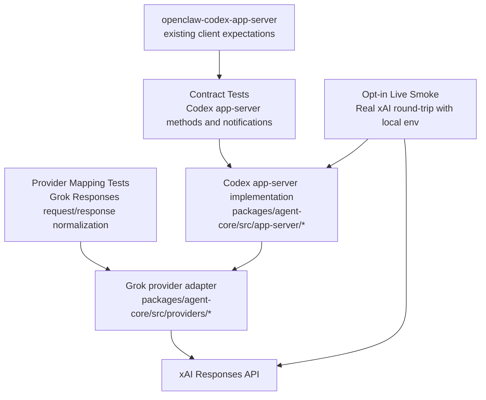

# feat: Grok app-server contract test suite

## Overview

Build the first real test suite for the Grok-backed Codex app-server implementation in `packages/agent-core`. The suite should lock down the Codex app-server contract that downstream consumers expect, prove the Grok Responses adapter can satisfy that contract, and keep live xAI coverage opt-in so normal local and CI runs stay deterministic.

## Problem Frame

The active desktop plan already commits the repo to a Grok-first but responses-style provider layer for the first real agent runtime (see origin: `docs/brainstorms/2026-04-16-thread-centric-agent-desktop-requirements.md` and parent plan: `docs/plans/2026-04-16-001-feat-thread-centric-agent-desktop-plan.md`). `packages/agent-core` is still scaffold-only, so starting implementation without tests would leave both sides of the integration underspecified:

- the server side has no locked contract for `initialize`, thread lifecycle, and turn lifecycle behavior
- the provider side has no proof that Grok Responses payloads can be normalized into the Codex app-server interface
- the repo has no secret-handling convention for the first live xAI smoke coverage

The user also pointed to `openclaw-codex-app-server` as the in-project usage to follow. That repository already captures the client-side expectations for Codex app-server methods, fallback behavior, and exact payload shapes. This plan uses that codebase as the primary local contract reference rather than inventing a new dialect.

## Requirements Trace

- R16-R19. The server must preserve guarded vs full-access thread settings and expose failure or approval states without corrupting thread lifecycle behavior.
- R20. The test suite must enable a real provider-backed server implementation, not a fake shell that only passes unit stubs.
- R21. The server must stay Grok-first while proving the abstraction is thin enough to fit a responses-style backend.
- R22. The tests must cover the core coding loop surfaces the desktop app will rely on: create or resume a thread, start a turn, continue it, interrupt it, and inspect normalized results.
- User requirement: follow the testing style and consumer expectations already used in `/Users/huntharo/pwrdrvr/openclaw-codex-app-server`.
- User requirement: use Grok Responses API support, with a local ignored `.env.local` path for the eventual xAI key.

## Scope Boundaries

- This plan covers the test suite and the minimum implementation structure that those tests force into `packages/agent-core`; it does not plan the renderer, IPC polish, or the rest of the desktop milestone.
- The default workspace test run must not require a real xAI key.
- The live xAI smoke path is intentionally narrow and opt-in; it is not a full reliability or load test plan.
- This plan does not broaden into a generic multi-provider matrix beyond what is needed to keep the Grok adapter honest against a responses-style contract.

## Context & Research

### Relevant Code and Patterns

- `packages/agent-core/package.json` and `packages/agent-core/src/index.ts` currently provide only package scaffolding, so this work establishes the first package-local test conventions.
- `vitest.workspace.ts` currently includes only `apps/desktop` projects. `packages/agent-core` needs to join the workspace test runner explicitly.
- `/Users/huntharo/pwrdrvr/openclaw-codex-app-server/src/client.ts` is the strongest local contract reference for Codex app-server method usage. It calls `initialize`, `thread/start` or `thread/new`, `thread/resume`, `thread/read`, `turn/start`, `turn/steer`, and `turn/interrupt`, and it depends on stable ids and notification shapes.
- `/Users/huntharo/pwrdrvr/openclaw-codex-app-server/src/client.test.ts` shows the preferred testing style for protocol-facing code in this project family: exact payload assertions, tight helper exports such as `__testing`, and focused cases around fallback variants.
- `/Users/huntharo/pwrdrvr/openclaw-codex-app-server/src/state.test.ts` and `/Users/huntharo/pwrdrvr/openclaw-codex-app-server/src/controller.test.ts` show the preferred shape for temporary state directories, mocked collaborators, and integration-style harness tests without overusing global fixtures.

### Institutional Learnings

- No `docs/solutions/` artifacts exist yet in this repository.

### External References

- xAI quickstart shows OpenAI-compatible client usage against `https://api.x.ai/v1` with `XAI_API_KEY`, and current examples use `grok-4.20-reasoning`: [docs.x.ai/developers/quickstart](https://docs.x.ai/developers/quickstart)
- xAI Responses guidance documents stateful response chaining by response id and notes that the `instructions` request parameter is not supported, which affects how developer/system context must be represented: [docs.x.ai/developers/model-capabilities/text/generate-text](https://docs.x.ai/developers/model-capabilities/text/generate-text)
- xAI streaming and sync docs show tools and synchronous `responses.create(...)` usage on the same OpenAI-compatible endpoint, which is relevant for future turn lifecycle expansion: [docs.x.ai/developers/tools/streaming-and-sync](https://docs.x.ai/developers/tools/streaming-and-sync)

## Key Technical Decisions

- Use the `openclaw-codex-app-server` client as the contract anchor for the first method surface. The new tests should prove compatibility with the consumer we already have instead of designing a speculative server API.
- Split coverage into three layers: protocol-contract tests, provider-mapping tests, and live-gated integration tests. This keeps fast deterministic coverage separate from network-dependent smoke coverage.
- Add `packages/agent-core` to the root Vitest workspace rather than creating a disconnected package-only runner. The root `pnpm test` command should exercise the new suite automatically.
- Load the eventual xAI key from `packages/agent-core/.env.local`, keep that file ignored by git, and optionally commit `packages/agent-core/.env.local.example` so setup is discoverable without checking in secrets.
- Treat developer/system instructions as message content assembled into the Responses API `input` payload rather than relying on the unsupported `instructions` parameter.
- Keep live tests opt-in and serialized. Missing credentials should produce an explicit skip, not a failing default test run.

## Open Questions

### Resolved During Planning

- Where should the xAI key live? Use `packages/agent-core/.env.local` so the secret stays scoped to the package currently integrating Grok, and add that path to the root `.gitignore`.
- When is the xAI key actually needed? Not for the first two units. It is only required once the live smoke test in Unit 4 is ready to run.
- Which model should the first live smoke target? Default to `grok-4.20-reasoning`, matching current xAI documentation as of March 30, 2026, while allowing an env override for later changes.
- How should the first contract be chosen? Start from the concrete methods already exercised by `/Users/huntharo/pwrdrvr/openclaw-codex-app-server/src/client.ts` and expand only after that client can talk to the new server implementation.

### Deferred to Implementation

- Whether the first live turn test should assert streaming events, synchronous completion, or both is best finalized once the in-memory server harness exists.
- The exact persistence model for mapping Codex thread ids to xAI response ids should be finalized when the thread store from the parent desktop plan is implemented.
- Whether the first implementation uses the OpenAI SDK directly or a thinner internal HTTP wrapper can stay open as long as the contract tests bind the observable request and response behavior.

## High-Level Technical Design

> *This illustrates the intended approach and is directional guidance for review, not implementation specification. The implementing agent should treat it as context, not code to reproduce.*

## Implementation Units

- [ ] **Unit 1: Wire `packages/agent-core` into the workspace test runner**

**Goal:** Establish the package-local test harness, fixture helpers, and env-loading conventions so later contract and adapter tests have one stable home.

**Requirements:** R20-R22

**Dependencies:** None

**Files:**
- Modify: `vitest.workspace.ts`
- Modify: `packages/agent-core/package.json`
- Modify: `packages/agent-core/src/index.ts`
- Create: `packages/agent-core/src/testing/load-local-env.ts`
- Create: `packages/agent-core/src/testing/test-harness.ts`
- Create: `packages/agent-core/src/testing/xai-fixtures.ts`
- Test: `packages/agent-core/src/__tests__/test-harness.test.ts`

**Approach:**
- Add a dedicated `agent-core` Vitest project in `node` environment so the suite participates in the existing root test command.
- Keep test helpers inside `src/testing/` rather than hidden shell setup so contract tests can reuse the same in-memory server and xAI fixture builders.
- Load `packages/agent-core/.env.local` only from live-oriented helpers. Pure unit and contract tests should remain completely independent of secret loading.

**Execution note:** Start with a failing package-discovery test so the new suite proves it is actually wired into `pnpm test`.

**Patterns to follow:**
- `/Users/huntharo/pwrdrvr/openclaw-codex-app-server/src/client.test.ts`
- `/Users/huntharo/pwrdrvr/openclaw-codex-app-server/src/state.test.ts`

**Test scenarios:**
- Happy path: the root Vitest workspace discovers and runs `packages/agent-core` tests.
- Happy path: temporary harness state can be created and torn down without leaking filesystem artifacts between tests.
- Edge case: missing `packages/agent-core/.env.local` leaves the default suite green and reports a clear skip reason for live-only helpers.
- Error path: malformed `.env.local` values surface as actionable configuration errors from the helper rather than vague provider failures.

**Verification:**
- Running the root workspace tests includes a new `agent-core` project, and all non-live tests pass without any local xAI configuration.

- [ ] **Unit 2: Lock the Codex app-server contract from the consumer side**

**Goal:** Capture the minimal Codex app-server method and notification contract that the Grok server must satisfy for current consumers.

**Requirements:** R16-R22

**Dependencies:** Unit 1

**Files:**
- Create: `packages/agent-core/src/app-server/codex-app-server.ts`
- Create: `packages/agent-core/src/app-server/protocol.ts`
- Create: `packages/agent-core/src/app-server/session-state.ts`
- Test: `packages/agent-core/src/__tests__/codex-app-server-contract.test.ts`
- Test: `packages/agent-core/src/__tests__/codex-turn-lifecycle.test.ts`

**Approach:**
- Model the contract around the exact surfaces `openclaw-codex-app-server` currently exercises: `initialize`, `thread/start` or `thread/new`, `thread/resume`, `thread/read`, `turn/start`, `turn/steer`, and `turn/interrupt`.
- Use an in-memory transport or direct handler harness so tests assert request payloads, ids, and emitted notifications without needing a spawned CLI process.
- Keep the contract narrow and explicit: the first goal is to make one downstream client work cleanly, not to expose every future app-server method on day one.

**Execution note:** Implement these tests first and let them drive the first server entrypoint and lifecycle state shape.

**Patterns to follow:**
- `/Users/huntharo/pwrdrvr/openclaw-codex-app-server/src/client.ts`
- `/Users/huntharo/pwrdrvr/openclaw-codex-app-server/src/client.test.ts`

**Test scenarios:**
- Happy path: `initialize` returns server identity and advertises the methods required by the current client contract.
- Happy path: `thread/start` returns a stable thread id and thread state when called with a workspace path and optional model.
- Happy path: `thread/resume` updates mutable thread settings such as model, approval policy, or sandbox without requiring `cwd` to be resent.
- Happy path: `thread/read` returns enough replay state for a consumer to recover the most recent assistant and user context after a resume.
- Happy path: `turn/start` accepts text-only input and returns ids that subsequent notifications and steer calls can reference.
- Edge case: `turn/start` accepts mixed multimodal input without collapsing image parts into plain text.
- Edge case: `turn/steer` rejects a stale or mismatched turn id with a deterministic protocol error rather than mutating the wrong run.
- Error path: `turn/interrupt` on a missing or already-terminal turn returns a stable error and leaves thread state intact.
- Integration: terminal notifications for completed, failed, and cancelled turns always include ids and normalized assistant output fields the consumer can extract.

**Verification:**
- The server harness can satisfy the method lifecycle currently assumed by the OpenClaw client without fallback-specific hacks in the client.

- [ ] **Unit 3: Add Grok Responses adapter and normalization tests**

**Goal:** Prove that Grok Responses requests and responses can be translated into the Codex app-server contract without Grok-specific leakage.

**Requirements:** R20-R22

**Dependencies:** Unit 2

**Files:**
- Create: `packages/agent-core/src/providers/grok-provider.ts`
- Create: `packages/agent-core/src/providers/xai-responses-client.ts`
- Create: `packages/agent-core/src/providers/response-normalizer.ts`
- Modify: `packages/agent-core/src/app-server/session-state.ts`
- Test: `packages/agent-core/src/__tests__/grok-provider.test.ts`
- Test: `packages/agent-core/src/__tests__/xai-response-normalizer.test.ts`

**Approach:**
- Build tests around request formation first: model, base URL, message assembly, prior-response chaining, and error mapping.
- Keep xAI-specific request shaping isolated to one client boundary so the app-server layer speaks only in normalized thread, turn, and event concepts.
- Persist enough session state to continue a conversation through xAI response chaining while still allowing local recovery when that state is absent or stale.
- Normalize provider output into the same item and terminal event shapes used by the contract tests so the server can swap between mocked and live backends without changing its public interface.

**Execution note:** Implement new domain behavior test-first, especially around prior-response chaining and error translation.

**Patterns to follow:**
- `docs/plans/2026-04-16-001-feat-thread-centric-agent-desktop-plan.md` Unit 3
- `/Users/huntharo/pwrdrvr/openclaw-codex-app-server/src/client.test.ts`

**Test scenarios:**
- Happy path: the first Grok request builds a Responses API payload with the configured model and ordered message content.
- Happy path: a follow-up turn reuses the prior xAI response id for conversation continuity instead of always replaying the full transcript.
- Happy path: normalized provider output becomes assistant text and terminal turn status that match the app-server contract tests.
- Edge case: when prior response metadata is missing, the adapter falls back to a deterministic recovery path instead of crashing the thread.
- Edge case: mixed text and image turn input maps to the correct xAI content-part shapes.
- Error path: xAI authentication or transport failures become normalized failed-turn events with actionable error text.
- Error path: unsupported request fields such as direct `instructions` are not emitted by the provider client.
- Integration: the app-server session state stores and retrieves the data needed to map a Codex thread/run back onto xAI conversation continuity.

**Verification:**
- The Grok adapter can satisfy the contract suite using only normalized app-server structures, with no test that depends on raw xAI response envelopes outside the provider boundary.

- [ ] **Unit 4: Add opt-in live smoke coverage and local secret handling**

**Goal:** Add the smallest live test path that proves the in-memory server can talk to xAI for real, while keeping secrets local and default runs deterministic.

**Requirements:** R20-R22

**Dependencies:** Unit 3

**Files:**
- Modify: `.gitignore`
- Create: `packages/agent-core/.env.local.example`
- Create: `packages/agent-core/src/__tests__/grok-live.test.ts`
- Modify: `packages/agent-core/package.json`
- Modify: `README.md`

**Approach:**
- Reserve the xAI-dependent coverage for a dedicated live test file that is skipped unless `packages/agent-core/.env.local` or equivalent process env values are present.
- Keep the live path small: start or resume a thread, run one turn, then continue or interrupt it through the same public server harness used in the contract suite.
- Document the local setup in repo docs and keep the real `.env.local` file ignored from git.

**Execution note:** Ask the user for the xAI key only when this unit is ready to run. Until then, keep implementation and review on deterministic fixtures.

**Patterns to follow:**
- `/Users/huntharo/pwrdrvr/openclaw-codex-app-server/README.md`
- `/Users/huntharo/pwrdrvr/openclaw-codex-app-server/AGENTS.md`

**Test scenarios:**
- Happy path: with a valid xAI key, the live smoke test creates a Grok-backed thread, runs a turn, and receives non-empty assistant output.
- Happy path: a second live interaction reuses the same thread or prior response chain rather than creating an isolated exchange.
- Edge case: missing `packages/agent-core/.env.local` skips the live suite with an explicit explanation instead of failing.
- Error path: an invalid xAI key produces a clear auth failure classification rather than a timeout or opaque transport error.
- Integration: the live test exercises the same app-server entrypoint used by the contract tests, proving the public interface and Grok adapter work together.

**Verification:**
- Developers can run the normal suite with no xAI setup, then opt into a real xAI smoke test by creating `packages/agent-core/.env.local`.

## System-Wide Impact

- **Interaction graph:** desktop main-process consumers -> `packages/agent-core` app-server handlers -> Grok provider adapter -> xAI Responses API.
- **Error propagation:** protocol errors, provider errors, and auth failures must surface as failed-turn or request-level errors without leaving orphaned active runs in session state.
- **State lifecycle risks:** the server must keep Codex thread ids, active turn ids, and xAI response ids synchronized enough to resume, steer, and interrupt safely.
- **API surface parity:** the contract must stay aligned with the current `openclaw-codex-app-server` client expectations; if the server changes first, that client becomes the earliest regression detector.
- **Integration coverage:** protocol-only tests are not enough because the provider boundary can still drift on request shape, response normalization, or auth handling.
- **Unchanged invariants:** the repo-wide `pnpm test` and `pnpm typecheck` flows remain the default validation path; live xAI coverage is additive and opt-in.

## Risks & Dependencies

| Risk | Mitigation |
|------|------------|
| The Grok adapter bakes in xAI-specific behavior that leaks through the public app-server contract | Keep xAI request/response details isolated to provider tests and normalize everything at the app-server boundary |
| Consumer and server drift on method names or payload shapes | Use `/Users/huntharo/pwrdrvr/openclaw-codex-app-server/src/client.ts` as the first contract oracle and mirror its exercised method surface in Unit 2 |
| Live tests become flaky or expensive enough that they stop being trusted | Keep Unit 4 as a short smoke suite, serialized and opt-in, with deterministic skips when credentials are absent |
| Secret handling becomes ad hoc and lands in git history | Use `packages/agent-core/.env.local`, add it to `.gitignore`, and commit only `packages/agent-core/.env.local.example` |
| xAI Responses API assumptions drift from OpenAI-style defaults | Bind request-shape tests to current xAI docs, especially response chaining and the unsupported `instructions` parameter |

## Documentation / Operational Notes

- Update the root `README.md` so contributors know that `packages/agent-core` now contains a package-local test suite and an optional live Grok smoke path.
- When Unit 4 begins, ask the user for the xAI key and direct them to create `packages/agent-core/.env.local` with `XAI_API_KEY`, plus optional `XAI_BASE_URL` and `GROK_MODEL` overrides.
- Keep the committed example file intentionally minimal so it documents setup without implying production secret-management guarantees.

## Sources & References

- **Origin document:** [docs/brainstorms/2026-04-16-thread-centric-agent-desktop-requirements.md](../brainstorms/2026-04-16-thread-centric-agent-desktop-requirements.md)
- **Parent plan:** [docs/plans/2026-04-16-001-feat-thread-centric-agent-desktop-plan.md](./2026-04-16-001-feat-thread-centric-agent-desktop-plan.md)
- Related code: `/Users/huntharo/pwrdrvr/openclaw-codex-app-server/src/client.ts`
- Related tests: `/Users/huntharo/pwrdrvr/openclaw-codex-app-server/src/client.test.ts`
- Related tests: `/Users/huntharo/pwrdrvr/openclaw-codex-app-server/src/state.test.ts`
- External docs: [xAI Quickstart](https://docs.x.ai/developers/quickstart)
- External docs: [xAI Generate Text / Responses](https://docs.x.ai/developers/model-capabilities/text/generate-text)
- External docs: [xAI Streaming & Sync](https://docs.x.ai/developers/tools/streaming-and-sync)
