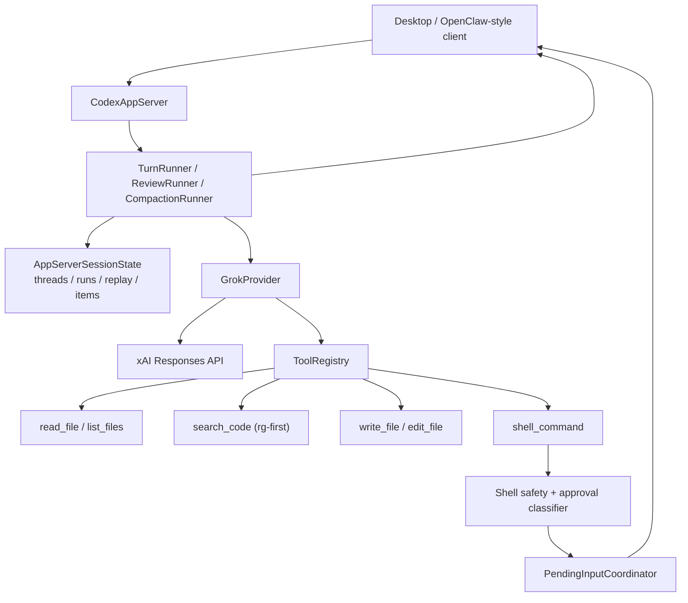

# feat: Add Grok tool usage and ripgrep-backed code search

## Overview

Turn the initial Grok-backed app-server implementation in `packages/agent-core` into a usable coding runtime by adding model-callable tools, ripgrep-backed code search, safe shell execution, and structured tool notifications that match the Codex app-server style already consumed by downstream clients. The implementation target is this repository, but the reference contracts come from `/Users/huntharo/github/grok-cli` and `/Users/huntharo/github/codex`.

## Problem Frame

The merged Grok app-server baseline proves that `packages/agent-core` can start threads, run turns, and talk to the xAI Responses API, but it is still text-only:

- `packages/agent-core/src/providers/grok-provider.ts` issues one synchronous xAI response request and returns only final assistant text
- `packages/agent-core/src/providers/response-normalizer.ts` only extracts text, not tool calls, tool results, or iterative tool rounds
- `packages/agent-core/src/app-server/protocol.ts` and `turn-runner.ts` can emit progress and pending-input events, but there is no tool runtime feeding those events
- `thread/read`, `review/start`, and `thread/compact/start` currently operate on replay state that contains user and assistant text, not durable tool activity

That leaves the Grok app server well short of the coding workflow expected from the surrounding product direction. The user explicitly wants tool usage and code search, especially ripgrep-style search. The two local reference implementations point toward the right shape:

- `/Users/huntharo/github/grok-cli` exposes explicit tools such as `bash`, `read_file`, `write_file`, and `edit_file`, then loops tool calls back through the model runtime
- `/Users/huntharo/github/codex` treats shell activity and tool calls as first-class app-server items, classifies command actions like `read`, `listFiles`, and `search`, and applies approval policy around unsafe commands

The plan here is not to clone either codebase. It is to implement the smallest durable subset in `packages/agent-core` that makes the Grok app server useful for repository work and keeps the app-server contract moving toward the Codex/OpenClaw shape already in use.

## Requirements Trace

- R16-R19. Guarded versus full-access execution settings, approvals, and interruption must remain observable and controllable through the app-server contract.
- R20. The server must stay backed by a real provider path, not a fake compatibility shell.
- R21. Grok remains the first real provider, but the server surface should continue converging on the Codex app-server interface already known by clients.
- R22. The core coding loop must include thread start or resume, thread readback, turn start, steer, interrupt, review, and compaction.
- User requirement: evaluate tool usage patterns in both `/Users/huntharo/github/grok-cli` and `/Users/huntharo/github/codex`.
- User requirement: implement code-search behavior centered on ripgrep rather than hand-rolled scanning alone.
- Compatibility requirement: preserve the OpenClaw-relevant app-server surface while adding tool-bearing behavior instead of inventing a separate Grok-only dialect.

## Scope Boundaries

- In scope: tool usage and code-search implementation inside `packages/agent-core`.
- In scope: model-facing tools for repository work, especially file reading, file listing, content search, file edits, and shell execution.
- In scope: structured tool notifications and replay persistence so turns, reviews, and compaction can observe tool activity.
- In scope: approval and interruption behavior for tool execution, using the existing app-server request flow.
- In scope: deterministic tests plus narrow live-gated coverage using the existing `live-agent-core` CI job.
- Out of scope: modifying `/Users/huntharo/github/grok-cli` or `/Users/huntharo/github/codex` directly as part of this plan.
- Out of scope: full Codex App Server v2 parity, full MCP runtime parity, browser or computer-use tools, media tools, or sub-agent orchestration.
- Out of scope: fuzzy file-name search UI parity with Codex in this first pass. The immediate target is repository search and coding tools, not composer popups.

## Context & Research

### Current `agent-core` state

- `packages/agent-core/src/providers/grok-provider.ts` currently has no tool loop, no subscription-backed provider events, and no iterative response chaining beyond `previousResponseId`.
- `packages/agent-core/src/providers/xai-responses-client.ts` sends `stream: false` requests and does not yet send any tool definitions or tool outputs.
- `packages/agent-core/src/providers/response-normalizer.ts` only collects assistant text from `output_text` and `output[].content[].text`.
- `packages/agent-core/src/app-server/turn-runner.ts` already knows how to turn provider events into `item/started`, `item/completed`, `item/plan/delta`, `turn/plan/updated`, and `serverRequest/resolved`, which is a good fit for tool progress once the provider can emit those events.
- `packages/agent-core/src/testing/test-harness.ts` already provides a fake provider with event subscriptions, so the new tool-bearing provider paths can be tested without spinning up a real server process.

### Grok CLI reference

Relevant files:

- `/Users/huntharo/github/grok-cli/src/grok/tools.ts`
- `/Users/huntharo/github/grok-cli/src/tools/bash.ts`
- `/Users/huntharo/github/grok-cli/src/tools/file.ts`
- `/Users/huntharo/github/grok-cli/src/agent/agent.ts`
- `/Users/huntharo/github/grok-cli/src/types/index.ts`

Useful patterns:

- Grok CLI separates tool definition from execution. `createTools(...)` builds a registry, while the agent loop executes tool calls and feeds tool results back into later model rounds.
- File tools are explicit and durable: `read_file`, `write_file`, and `edit_file` are distinct from `bash`.
- Shell is still important, but Grok CLI pushes the model toward dedicated file tools for durable edits and uses `bash` for search, git inspection, builds, and tests.
- The runtime emits `tool_calls`, `tool_result`, and `tool_approval_request` events, which maps well onto the provider-event mechanism already present in `agent-core`.

### Codex reference

Relevant files:

- `/Users/huntharo/github/codex/codex-rs/app-server-protocol/src/protocol/v2.rs`
- `/Users/huntharo/github/codex/codex-rs/shell-command/src/command_safety/is_safe_command.rs`
- `/Users/huntharo/github/codex/codex-rs/app-server/tests/suite/v2/thread_shell_command.rs`
- `/Users/huntharo/github/codex/codex-rs/app-server/tests/suite/v2/dynamic_tools.rs`
- `/Users/huntharo/github/codex/codex-rs/file-search/src/lib.rs`

Useful patterns:

- Codex distinguishes shell activity from generic tool calls. `ThreadItem::CommandExecution` carries shell semantics, while `ThreadItem::DynamicToolCall` carries explicit tool/function calls.
- Codex classifies shell commands into semantic actions via `CommandAction::{Read,ListFiles,Search,Unknown}`. That is a useful lightweight contract for app-server notifications and replay, even if the underlying runtime stays much smaller.
- Codex auto-approves a constrained read-only shell subset and explicitly treats unsafe ripgrep flags such as `--pre` and `--search-zip` as non-safe.
- Codex persists structured thread items rather than flattening everything into assistant text, which matters for `thread/read`, review, and compaction consistency.

### Local comparison and implications

| Concern | Grok CLI | Codex | Implication for `agent-core` |
|---|---|---|---|
| Model-facing tool surface | Explicit built-in tools in `src/grok/tools.ts` | Dynamic tools plus shell commands | Use an explicit local tool registry and keep shell separate from dedicated file/search tools |
| Code search | Mostly via `bash` and repository tools | Shell commands plus semantic `search` classification | Add a first-class `search_code` tool and classify shell `rg` invocations for notifications and approvals |
| File IO | Dedicated file tools | File change items plus shell/file approvals | Add explicit file tools so durable edits do not depend solely on shell side effects |
| Approval flow | Tool approval events in the streaming runtime | Structured command and file-change approvals | Reuse `PendingInputCoordinator` and app-server request handling for risky tool actions |
| Replay model | Chat entries with `tool_call` and `tool_result` | Persisted structured `ThreadItem`s | Extend session replay beyond plain user/assistant messages |

### Institutional learnings

- No relevant `docs/solutions/` artifacts exist yet in this repository.

### External research decision

Skipped. The codebases already contain direct local examples for tool registries, ripgrep safety, command classification, and app-server eventing. External documentation would add little planning value relative to the local references.

## Key Technical Decisions

- Implement the tool runtime in `packages/agent-core`; treat `grok-cli` and `codex` as design references, not code-copy targets.
- Keep shell and explicit tools separate. Shell execution should produce command-style items and approval semantics; file and search helpers should be explicit tools with stable arguments and outputs.
- Make ripgrep a first-class path, not a prompt convention. The server should provide a dedicated search tool that uses `rg` directly when available, with bounded output and semantic parameters.
- Preserve a small, opinionated initial tool subset:
  - `read_file`
  - `list_files`
  - `search_code`
  - `write_file`
  - `edit_file`
  - `shell_command`
- Treat `read_file`, `list_files`, and `search_code` as read-only by default and auto-approvable under guarded settings; require approval for mutation tools and non-safe shell commands.
- Model explicit tools as dynamic tool calls and shell as command execution. That gives `agent-core` a clean line between stable high-signal tools and arbitrary shell commands while staying compatible with Codex-style semantics.
- Persist structured tool items into thread state and replay so `thread/read`, `review/start`, and `thread/compact/start` operate on the same observable history the provider already advanced through.
- Extend the existing live xAI path rather than creating a second integration mechanism. The current `live-agent-core` CI job is the right home for tool-loop smoke coverage.

## Open Questions

### Resolved during planning

- Should the implementation target be `codex`, `grok-cli`, or this repo? This repo. The other two are references.
- Should ripgrep be exposed only through shell? No. It should also exist as a dedicated search tool so the model has a stable, obvious path for code search.
- Should shell safety be all-or-nothing? No. A read-only safe subset should auto-approve, with approval requests for risky invocations.
- Should fuzzy file-name search ship in the same pass? No. The first milestone should focus on coding tools and content search.

### Deferred to implementation

- Whether `list_files` should always rely on `rg --files` or use a hybrid `rg` plus Node walker approach when `rg` is unavailable.
- Whether `write_file` should emit file diffs immediately in tool results or leave diff rendering solely to replay items.
- How much command output should be stored in replay versus only emitted live, especially for long-running shell commands.
- Whether the first xAI tool loop should stay synchronous round-by-round or move directly to streamed Responses support.

## High-Level Technical Design

> *This is directional guidance for review, not implementation specification.*

## Phased Delivery

### Phase 1

Extend protocol and session state to represent tool-bearing replay and notifications without breaking the existing app-server surface.

### Phase 2

Implement the local tool registry and the read-only repository tools, centered on ripgrep-backed search.

### Phase 3

Add mutation tools and shell safety, then wire the full Grok Responses tool loop.

### Phase 4

Lock the behavior down with deterministic contract tests and a live-gated tool-loop smoke test.

## Implementation Units

- [x] **Unit 1: Extend protocol and replay state for tool-bearing turns**

**Goal:** Make `agent-core` capable of representing shell commands and explicit tool calls as durable app-server items instead of flattening everything into assistant text.

**Requirements:** R16-R22

**Dependencies:** None

**Files:**
- Modify: `packages/agent-core/src/app-server/protocol.ts`
- Modify: `packages/agent-core/src/app-server/session-state.ts`
- Modify: `packages/agent-core/src/app-server/turn-runner.ts`
- Modify: `packages/agent-core/src/app-server/review-runner.ts`
- Modify: `packages/agent-core/src/app-server/compaction-runner.ts`
- Test: `packages/agent-core/src/__tests__/session-state.test.ts`
- Test: `packages/agent-core/src/__tests__/codex-tool-progress.test.ts`

**Approach:**
- Add structured item types for command execution and dynamic tool calls, keeping the current lightweight app-server protocol rather than importing Codex v2 wholesale.
- Extend thread replay to preserve structured items alongside user and assistant text so later prompts, review, and compaction can see the same local history.
- Make specialized runners persist their output the same way ordinary turns do, so replay does not diverge from provider chaining.

**Patterns to follow:**
- `packages/agent-core/src/app-server/turn-runner.ts`
- `/Users/huntharo/github/codex/codex-rs/app-server-protocol/src/protocol/v2.rs`

**Test scenarios:**
- Happy path: a completed dynamic tool call is visible in `thread/read` after the turn completes.
- Happy path: a completed shell command is visible in `thread/read` with its status and summarized output.
- Edge case: cancelled tool-bearing turns do not leave orphaned active-run state.
- Edge case: `review/start` and `thread/compact/start` append their final output to replay just like ordinary turns.
- Error path: failed tool calls emit failed items and preserve enough replay state for debugging without marking the whole thread unreadable.

**Verification:**
- `thread/read` reflects the tool-bearing turn history needed by later phases.

- [x] **Unit 2: Add a local tool contract and registry**

**Goal:** Create one internal place where model-visible tools are declared, validated, executed, and mapped back into provider and app-server events.

**Requirements:** R20-R22

**Dependencies:** Unit 1

**Files:**
- Create: `packages/agent-core/src/tools/tool-contract.ts`
- Create: `packages/agent-core/src/tools/tool-registry.ts`
- Create: `packages/agent-core/src/tools/tool-execution.ts`
- Create: `packages/agent-core/src/tools/tool-errors.ts`
- Modify: `packages/agent-core/src/providers/provider-contract.ts`
- Test: `packages/agent-core/src/__tests__/tool-registry.test.ts`

**Approach:**
- Define a normalized tool spec format that can describe input schema, read-only versus mutating behavior, approval requirements, and result rendering.
- Keep the registry small and explicit so the initial Grok tool loop remains predictable.
- Extend the provider contract so a provider can emit started and completed tool items without knowing the underlying tool implementation details.

**Patterns to follow:**
- `/Users/huntharo/github/grok-cli/src/grok/tools.ts`
- `packages/agent-core/src/providers/provider-contract.ts`

**Test scenarios:**
- Happy path: the registry exposes the expected initial tool names and schemas.
- Happy path: a valid tool invocation returns normalized output and metadata suitable for provider/app-server events.
- Edge case: invalid arguments fail before execution with stable error text.
- Error path: requesting an unknown tool returns a deterministic error and does not crash the turn loop.

**Verification:**
- Provider code can request a tool by name without importing the tool implementation directly.

- [x] **Unit 3: Implement read-only repository tools with ripgrep-first search**

**Goal:** Give the model stable, high-signal tools for reading files, listing files, and searching repository contents without forcing it to synthesize shell every time.

**Requirements:** R20-R22

**Dependencies:** Unit 2

**Files:**
- Create: `packages/agent-core/src/tools/read-file-tool.ts`
- Create: `packages/agent-core/src/tools/list-files-tool.ts`
- Create: `packages/agent-core/src/tools/search-code-tool.ts`
- Modify: `packages/agent-core/src/tools/tool-registry.ts`
- Test: `packages/agent-core/src/__tests__/read-file-tool.test.ts`
- Test: `packages/agent-core/src/__tests__/list-files-tool.test.ts`
- Test: `packages/agent-core/src/__tests__/search-code-tool.test.ts`

**Approach:**
- Implement `read_file` with stable line-numbered output and path resolution relative to thread `cwd`.
- Implement `list_files` with `rg --files` when available and a deterministic filesystem fallback when it is not.
- Implement `search_code` as a ripgrep-first content search tool with bounded output, file paths, line numbers, and a clear distinction between no matches and execution failure.
- Respect ignore files by default and keep output size bounded so tool results remain useful as model context.

**Patterns to follow:**
- `/Users/huntharo/github/grok-cli/src/tools/file.ts`
- `/Users/huntharo/github/codex/codex-rs/shell-command/src/command_safety/is_safe_command.rs`

**Test scenarios:**
- Happy path: `read_file` returns numbered lines for a requested range.
- Happy path: `list_files` returns repository-relative paths for a nested workspace.
- Happy path: `search_code` returns filename, line number, and matched text for a unique identifier found via `rg`.
- Edge case: searching with no matches returns a successful empty result instead of a thrown error.
- Edge case: binary files and unreadable paths are skipped or reported cleanly.
- Error path: a missing target file or unreadable path returns actionable tool output.

**Verification:**
- The model has dedicated repository exploration tools and no longer needs shell for every read-only operation.

- [x] **Unit 4: Add mutation tools and shell safety with approval policy**

**Goal:** Support durable edits and shell execution while preserving guarded behavior and transparent approvals.

**Requirements:** R16-R19, R20-R22

**Dependencies:** Unit 3

**Files:**
- Create: `packages/agent-core/src/tools/write-file-tool.ts`
- Create: `packages/agent-core/src/tools/edit-file-tool.ts`
- Create: `packages/agent-core/src/tools/shell-command-tool.ts`
- Create: `packages/agent-core/src/tools/shell-safety.ts`
- Modify: `packages/agent-core/src/tools/tool-registry.ts`
- Modify: `packages/agent-core/src/app-server/pending-input.ts`
- Modify: `packages/agent-core/src/app-server/turn-runner.ts`
- Test: `packages/agent-core/src/__tests__/write-file-tool.test.ts`
- Test: `packages/agent-core/src/__tests__/edit-file-tool.test.ts`
- Test: `packages/agent-core/src/__tests__/shell-safety.test.ts`
- Test: `packages/agent-core/src/__tests__/shell-command-tool.test.ts`
- Test: `packages/agent-core/src/__tests__/pending-input.test.ts`

**Approach:**
- Add durable file mutation tools for the common edit cases Grok CLI already handles explicitly.
- Implement a right-sized shell safety classifier based on the Codex allowlist: safe read-only commands auto-run, while mutating or ambiguous commands go through approval.
- Explicitly treat unsafe ripgrep flags like `--pre`, `--hostname-bin`, `--search-zip`, and `-z` as non-safe.
- Ensure cancellation clears queued pending-input work so stale approval requests cannot outlive a cancelled turn.

**Patterns to follow:**
- `/Users/huntharo/github/grok-cli/src/tools/bash.ts`
- `/Users/huntharo/github/grok-cli/src/tools/file.ts`
- `/Users/huntharo/github/codex/codex-rs/shell-command/src/command_safety/is_safe_command.rs`

**Test scenarios:**
- Happy path: `write_file` creates a new file and returns a concise success result.
- Happy path: `edit_file` rejects non-unique edit anchors and succeeds on a unique replacement.
- Happy path: a safe shell read command such as `rg foo src` or `git status` runs without approval.
- Edge case: a shell command with unsafe ripgrep flags requests approval instead of auto-running.
- Edge case: cancellation while approvals are queued leaves no stray pending-input requests behind.
- Error path: a declined approval produces a completed tool item with a clear decline outcome and no side effects.

**Verification:**
- Guarded tool execution is observable, cancellable, and aligned with the current app-server approval flow.

- [x] **Unit 5: Wire the Grok Responses tool loop**

**Goal:** Teach the Grok provider to advertise tools to xAI, execute tool calls locally, and continue the conversation until the provider reaches a terminal assistant response.

**Requirements:** R20-R22

**Dependencies:** Unit 4

**Files:**
- Modify: `packages/agent-core/src/providers/grok-provider.ts`
- Modify: `packages/agent-core/src/providers/xai-responses-client.ts`
- Modify: `packages/agent-core/src/providers/response-normalizer.ts`
- Modify: `packages/agent-core/src/providers/provider-contract.ts`
- Create: `packages/agent-core/src/providers/responses-tool-loop.ts`
- Modify: `packages/agent-core/src/testing/xai-fixtures.ts`
- Test: `packages/agent-core/src/__tests__/grok-provider-tools.test.ts`
- Test: `packages/agent-core/src/__tests__/xai-response-normalizer.test.ts`

**Approach:**
- Extend xAI request shaping so tool definitions are included in the Responses payload.
- Parse tool-call responses from xAI, execute the matching local tool, and submit tool outputs back into the next response round using `previous_response_id`.
- Emit provider events for tool start, tool completion, approvals, and final assistant output through the existing subscription interface.
- Keep a round limit so malformed tool loops fail deterministically instead of spinning forever.

**Patterns to follow:**
- `/Users/huntharo/github/grok-cli/src/agent/agent.ts`
- `packages/agent-core/src/providers/grok-provider.ts`

**Test scenarios:**
- Happy path: a single tool call followed by a final assistant response completes in two provider rounds.
- Happy path: multiple tool calls in one turn produce ordered started and completed events.
- Edge case: tool output is chained through `previousResponseId` rather than replaying the full transcript every round.
- Edge case: tool schema and argument parsing errors become failed tool items rather than crashing the provider.
- Error path: hitting the max tool round limit yields a failed turn with clear error text.

**Verification:**
- A Grok turn can perform at least one real repository tool call before producing final assistant text.

- [x] **Unit 6: Lock down app-server compatibility and live coverage for tool-bearing turns**

**Goal:** Prove that the new tool runtime works through the public app-server surface and in the real xAI-backed live path.

**Requirements:** R16-R22

**Dependencies:** Unit 5

**Files:**
- Modify: `packages/agent-core/src/__tests__/openclaw-compat-sequences.test.ts`
- Modify: `packages/agent-core/src/__tests__/review-start.test.ts`
- Modify: `packages/agent-core/src/__tests__/thread-compaction.test.ts`
- Modify: `packages/agent-core/src/__tests__/grok-live.test.ts`
- Modify: `.github/workflows/ci.yml`
- Modify: `README.md`

**Approach:**
- Expand deterministic compatibility sequences so they assert tool-bearing notifications and replay behavior, not just plain text turns.
- Add a narrow live smoke that creates a temporary workspace, asks the model to find a unique string via repository tools, and asserts that the final answer reflects the search result.
- Reuse the existing `live-agent-core` job and `XAI_API_KEY` secret instead of creating a second live-test path.
- Document the local expectations so contributors know that `packages/agent-core/.env.local` remains the local override and CI uses the existing secret-backed job.

**Patterns to follow:**
- `packages/agent-core/src/__tests__/grok-live.test.ts`
- `.github/workflows/ci.yml`

**Test scenarios:**
- Happy path: a public app-server turn emits `item/started` and `item/completed` for a repository search before `turn/completed`.
- Happy path: `thread/read` after a tool-bearing turn shows both replay text and structured tool history.
- Edge case: review and compaction over a tool-bearing thread see the updated local replay rather than stale pre-tool state.
- Edge case: live smoke skips cleanly when no xAI credentials are available locally.
- Error path: live tool smoke fails loudly when the model never uses the provided repository tools or returns an inconsistent result.

**Verification:**
- The feature is covered end to end through both deterministic tests and the existing secret-backed live CI lane.

## System-Wide Impact

- `packages/agent-core` moves from a text-only provider shell toward an actual coding runtime.
- `thread/read`, review, and compaction become more trustworthy because local replay will include tool-bearing state, not just assistant prose.
- Approval behavior becomes meaningfully observable through the existing app-server request flow instead of being deferred until later.
- The live xAI coverage becomes more valuable because it will exercise tool usage, not just plain prompt-response turns.

## Risks and Mitigations

- **Risk:** xAI tool-call payloads differ from the assumptions borrowed from Grok CLI.
  **Mitigation:** isolate parsing in `response-normalizer.ts` and fixture it heavily before live testing.

- **Risk:** unbounded search or shell output bloats model context and replay.
  **Mitigation:** enforce output limits and truncate with explicit markers.

- **Risk:** approvals and cancellation race each other, leaving stale queued requests.
  **Mitigation:** clear queued pending-input requests on cancel and test that path directly.

- **Risk:** shell safety rules become either too loose or too strict.
  **Mitigation:** start with a narrow, Codex-inspired allowlist and widen only when concrete use cases demand it.

- **Risk:** replay changes break current OpenClaw-style consumers.
  **Mitigation:** extend the existing compatibility tests rather than relying on internal-only unit coverage.

## Recommended Execution Posture

Characterization-first for the provider and replay layers, then test-first for each new tool and approval rule. The tricky part here is not code volume; it is making sure tool calls, replay state, and app-server notifications all describe the same turn consistently.
