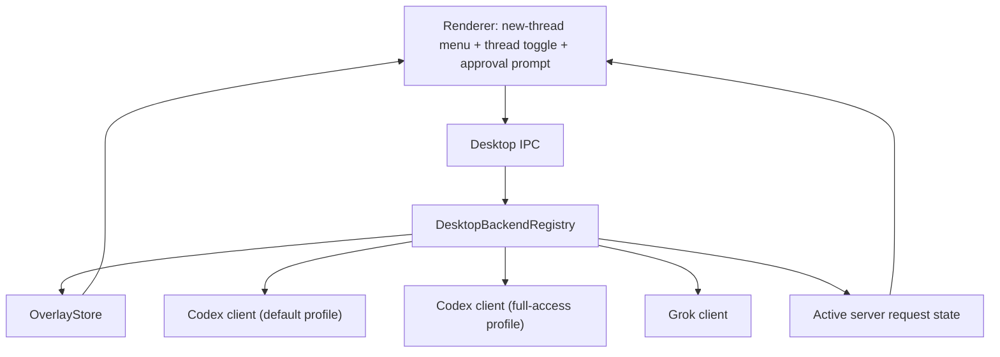

# feat: Add Codex access-mode toggle to desktop threads

## Overview

Add the missing `Default Access` / `Full Access` thread control to the desktop app, route those modes through two Codex App Server client instances rather than treating them as cosmetic labels, and wire approval requests through the desktop so guarded/default threads can actually ask the user before leaving the sandbox or applying risky actions. The desktop should let users choose a Codex access mode when creating a thread, show the current mode on existing threads, switch it later, surface pending approval questions inline, and use the selected mode consistently for reads, turns, interrupts, and approval resolution.

## Problem Frame

The current desktop shell models thread creation only as `backend: "codex" | "grok"`. There is no thread-level execution-mode field in the renderer contracts, no persistent overlay state for mode selection, no IPC for changing it later, and only one Codex App Server client process in the main process. On top of that, the desktop layer currently forwards terminal notifications but not interactive server requests, even though `agent-core` already supports approval prompts such as `turn/requestApproval`. As a result:

- the UI cannot render the `Default Access` / `Full Access` control called for by the product direction in the origin requirements and desktop style guide
- a new Codex thread cannot be created directly in full-access mode
- an existing Codex thread has no persisted routing choice for later turns
- the main process cannot follow the OpenClaw pattern where default and full-access work are sent to different Codex App Server instances
- a guarded/default Codex thread can fail with a sandbox/network error path like `npm view dive` without ever surfacing a real approval prompt to the user
- the transcript and composer surfaces have no durable place to show “this turn is waiting on your approval” or to collect approve/decline input

OpenClaw already solved the server-side shape we need to mirror. Its `CodexAppServerModeClient` keeps `default` and `full-access` clients side by side, builds the full-access profile by appending `-c approval_policy="never"` and `-c sandbox_mode="danger-full-access"`, and stores the chosen permissions mode separately from thread listing. That is the correct local precedent for this repo.

## Requirements Trace

- R16-R19. Each thread needs an execution mode with a practical guarded/default vs full-access split, not a global one.
- R20-R22. The first milestone must support real thread creation, run execution, and result inspection inside the desktop shell.
- Style-guide requirement: user-facing mode copy should read `Default Access` / `Full Access`, while internal state can stay `default` / `full-access`.
- Local parity requirement: Codex access modes must route through distinct Codex App Server instances following `/Users/huntharo/pwrdrvr/openclaw-codex-app-server`.
- Approval-loop requirement: in `Default Access`, server requests such as “approve exiting the sandbox” must be surfaced to the user and answered in-app rather than failing silently or only appearing as a later error message.
- UX requirement: the desktop must expose both a create-time mode picker and an in-thread mode toggle for Codex threads.

## Scope Boundaries

- In scope: Codex-backed desktop threads, including creation, persisted mode state, mode display, and later turn routing.
- In scope: exposing mode availability to the renderer so unavailable full-access sessions can be explained rather than silently omitted.
- In scope: surfacing interactive approval requests for guarded/default threads and sending the user’s response back to the active app-server run.
- In scope: keeping the existing `backend: "codex"` identity stable while layering access mode underneath it.
- Out of scope: broader Grok trust-mode parity beyond reporting its currently supported mode envelope.
- Out of scope: redesigning the entire thread composer or backend picker beyond what is needed to create and toggle Codex access modes cleanly.
- Out of scope: implementing upstream Codex project-trust management; the desktop only chooses request/profile behavior, not Codex trust state itself.

## Context & Research

### Relevant Code and Patterns

- [docs/brainstorms/2026-04-16-thread-centric-agent-desktop-requirements.md](/Users/huntharo/.codex/worktrees/3595/PwrAgent/docs/brainstorms/2026-04-16-thread-centric-agent-desktop-requirements.md) defines the per-thread guarded/full-access requirement (R16-R19).
- [docs/design/desktop-style-guide.md](/Users/huntharo/.codex/worktrees/3595/PwrAgent/docs/design/desktop-style-guide.md) already names mode badges as a first-class UI element.
- [apps/desktop/src/main/app-server/backend-registry.ts](/Users/huntharo/.codex/worktrees/3595/PwrAgent/apps/desktop/src/main/app-server/backend-registry.ts) is the current routing boundary for thread creation, thread reads, and turn lifecycle.
- [apps/desktop/src/main/codex-app-server/client.ts](/Users/huntharo/.codex/worktrees/3595/PwrAgent/apps/desktop/src/main/codex-app-server/client.ts) currently creates one Codex transport and already contains the `isUnmaterializedThreadError` pattern the mode toggle should reuse.
- [packages/shared/src/contracts/app-server.ts](/Users/huntharo/.codex/worktrees/3595/PwrAgent/packages/shared/src/contracts/app-server.ts) is the current home for cross-cutting backend identity types and should stay the canonical source for any shared execution-mode enum.
- [packages/agent-core/src/persistence/overlay-store.ts](/Users/huntharo/.codex/worktrees/3595/PwrAgent/packages/agent-core/src/persistence/overlay-store.ts) and [packages/agent-core/src/domain/navigation-state.ts](/Users/huntharo/.codex/worktrees/3595/PwrAgent/packages/agent-core/src/domain/navigation-state.ts) are the existing desktop-only persistence layer for per-thread state the app server does not own.
- [apps/desktop/src/renderer/src/features/navigation/Sidebar.tsx](/Users/huntharo/.codex/worktrees/3595/PwrAgent/apps/desktop/src/renderer/src/features/navigation/Sidebar.tsx), [apps/desktop/src/renderer/src/lib/useThreadNavigation.ts](/Users/huntharo/.codex/worktrees/3595/PwrAgent/apps/desktop/src/renderer/src/lib/useThreadNavigation.ts), and [apps/desktop/src/renderer/src/features/thread-detail/ThreadContextPanel.tsx](/Users/huntharo/.codex/worktrees/3595/PwrAgent/apps/desktop/src/renderer/src/features/thread-detail/ThreadContextPanel.tsx) are the renderer surfaces that currently expose backend choice and thread context but not execution mode.
- [packages/agent-core/src/__tests__/pending-input.test.ts](/Users/huntharo/.codex/worktrees/3595/PwrAgent/packages/agent-core/src/__tests__/pending-input.test.ts) proves the app-server layer already emits interactive requests such as `turn/requestApproval` and `serverRequest/resolved`.
- [packages/agent-core/src/app-server/turn-runner.ts](/Users/huntharo/.codex/worktrees/3595/PwrAgent/packages/agent-core/src/app-server/turn-runner.ts) shows that request handling already exists below the desktop layer; the desktop gap is transport and UI, not provider capability.
- [apps/desktop/src/renderer/src/features/composer/Composer.tsx](/Users/huntharo/.codex/worktrees/3595/PwrAgent/apps/desktop/src/renderer/src/features/composer/Composer.tsx) currently reacts only to terminal run events and has no state for pending approvals.
- [docs/plans/2026-04-16-001-feat-thread-centric-agent-desktop-plan.md](/Users/huntharo/.codex/worktrees/3595/PwrAgent/docs/plans/2026-04-16-001-feat-thread-centric-agent-desktop-plan.md) and [docs/plans/2026-04-16-002-feat-app-server-protocol-compatibility-plan.md](/Users/huntharo/.codex/worktrees/3595/PwrAgent/docs/plans/2026-04-16-002-feat-app-server-protocol-compatibility-plan.md) already established the thread-centric shell and Codex/Grok backend registry, so this work should extend those boundaries rather than replace them.

### Institutional Learnings

- No `docs/solutions/` entry currently covers desktop access-mode routing. This plan should treat OpenClaw as the nearest local prior art.

### Local Prior Art

- [/Users/huntharo/pwrdrvr/openclaw-codex-app-server/src/client.ts](/Users/huntharo/pwrdrvr/openclaw-codex-app-server/src/client.ts) provides the concrete `CodexAppServerModeClient` pattern and the full-access client bootstrap args.
- [/Users/huntharo/pwrdrvr/openclaw-codex-app-server/docs/specs/PERMISSIONS.md](/Users/huntharo/pwrdrvr/openclaw-codex-app-server/docs/specs/PERMISSIONS.md) documents the exact approval/sandbox mapping and the distinction between Codex trust state and request-time overrides.

## Key Technical Decisions

- Keep `backend` and `executionMode` separate. `codex` remains one backend; `default` and `full-access` are routing profiles underneath it. This avoids duplicate thread identities and keeps existing navigation semantics intact.
- Persist mode in the desktop overlay store keyed by `backend + threadId`. The Codex thread list does not currently return access mode, so overlay persistence is the only reliable desktop-visible source of truth.
- Aggregate Codex thread discovery across the default and full-access clients, then de-duplicate by thread id while preferring any persisted overlay mode. This keeps full-access-only threads visible without leaking duplicate rows into navigation.
- Route Codex `startThread`, `readThread`, `startTurn`, and `interruptTurn` through the persisted execution mode when one is known, falling back to `default` when no overlay state exists yet.
- Expose execution-mode availability in backend summaries. The UI needs to distinguish “Full Access is supported and selectable” from “this Codex Desktop session only has the default profile available.”
- Use the OpenClaw permission mapping verbatim: `default -> approvalPolicy: "on-request", sandbox: "workspace-write"` and `full-access -> approvalPolicy: "never", sandbox: "danger-full-access"`.
- Apply mode changes optimistically only when the failure is the known unmaterialized-thread class; otherwise persist the new mode only after the Codex app server accepts the change. This preserves a usable toggle for newly created empty threads without hiding real routing failures.
- Treat approval requests as first-class run events, not as generic error text. The desktop should forward request notifications from the app server to the renderer, display them inline in thread detail, and submit explicit approve/decline/cancel responses back to the active run.
- Keep approval UX anchored to the current thread surface. The request should appear in the thread transcript/composer area so the user can see what action is blocked and answer it without leaving the thread.

## Open Questions

### Resolved During Planning

- Should this update the broader thread-centric plan in place? No. That plan is already serving as the larger product artifact; this is a focused follow-on plan for a concrete missing capability.
- Should `Full Access` be represented as a second backend? No. That would leak an implementation detail into thread identity, duplicate list results, and complicate every renderer lookup.
- Where should execution mode live for the desktop? In desktop overlay state, projected into `NavigationThreadSummary`, because current app-server thread summaries do not carry it.
- How should a full-access Codex client be built? Follow OpenClaw and append CLI overrides to the normal `codex app-server` launch args rather than inventing a second bespoke command.
- Why did the current desktop miss approval prompting? Because the desktop contracts and main-process bridge currently model completion and `serverRequest/resolved`, but not the request notification itself or a response IPC path.

### Deferred to Implementation

- Whether the renderer should expose the mode badge in recents rows immediately or only in the thread header/context panel for the first pass.
- Whether a rejected mode change on an actively running thread should hard-error immediately or also offer a non-blocking “apply after this turn” note in the UI.
- Whether approval prompts should render as an inline transcript card, a fixed composer-adjacent banner, or both when the request remains pending after the user scrolls away.

## High-Level Technical Design

> *This illustrates the intended approach and is directional guidance for review, not implementation specification. The implementing agent should treat it as context, not code to reproduce.*

### Routing Rules

| Operation | Backend | Mode source | Expected route |
|---|---|---|---|
| List Codex threads | `codex` | overlay mode when present | aggregate both Codex profiles, de-duplicate by thread id, and prefer the persisted mode |
| Create Codex thread | `codex` | sidebar selection | chosen Codex profile, then persist overlay mode |
| Toggle existing Codex thread | `codex` | user action | chosen Codex profile plus permission mapping, then persist overlay mode |
| Read / start / interrupt Codex thread | `codex` | overlay execution mode | stored profile, default fallback when unknown |
| Approval request while a turn is running | `codex` or `grok` | active run event | forward request to renderer, await user decision, then resolve via app-server request channel |
| Any Grok thread operation | `grok` | backend capability summary | existing Grok client path |

## Implementation Units

- [x] **Unit 1: Add execution-mode contracts and persistence**

**Goal:** Model per-thread execution mode explicitly across shared contracts, navigation snapshots, and overlay persistence so the renderer and main process can speak about the same state.

**Requirements:** R16-R19, style-guide requirement

**Dependencies:** None

**Files:**
- Modify: `packages/shared/src/contracts/app-server.ts`
- Modify: `packages/shared/src/contracts/backend.ts`
- Modify: `packages/shared/src/contracts/agent.ts`
- Modify: `packages/shared/src/contracts/navigation.ts`
- Modify: `packages/agent-core/src/persistence/migrations.ts`
- Modify: `packages/agent-core/src/persistence/overlay-store.ts`
- Modify: `packages/agent-core/src/domain/navigation-state.ts`
- Test: `packages/agent-core/src/__tests__/overlay-store.test.ts`

**Approach:**
- Introduce a shared execution-mode type in the base app-server contract module, then reuse it in backend summaries, start-thread requests, and navigation state.
- Extend the shared desktop app-server contract with explicit interactive-request shapes so `turn/requestApproval` and similar events can cross the preload bridge instead of being dropped.
- Extend `ThreadOverlayState` and `NavigationThreadSummary` to carry the selected execution mode, defaulting missing historical data to `default`.
- Add overlay-store helpers to read and write execution mode without coupling the renderer to Codex transport details.
- Include execution mode in navigation snapshot hashing so mode changes refresh the UI without fake thread mutations.

**Patterns to follow:**
- Reuse the existing overlay-store migration pattern in `packages/agent-core/src/persistence/migrations.ts`.
- Follow the typed shared-contract style already used in `packages/shared/src/contracts/agent.ts` and `packages/shared/src/contracts/backend.ts`.

**Test scenarios:**
- Happy path: an overlay entry persisted with `full-access` rehydrates and surfaces that mode in the navigation snapshot.
- Happy path: a historical overlay file with no execution-mode field migrates cleanly to `default`.
- Happy path: a shared request-notification payload can represent `turn/requestApproval` with prompt, options, thread id, run id, and request id.
- Edge case: a thread with no overlay entry still materializes as `default` instead of `undefined`.
- Edge case: navigation snapshot hashing changes when only execution mode changes, so the renderer is refreshed.
- Integration: backend summaries can report a backend as available while marking `full-access` unavailable.

**Verification:**
- Shared desktop contracts and overlay persistence can describe thread mode and backend mode availability without inventing a second backend identity.

- [x] **Unit 2: Route Codex work through default and full-access clients**

**Goal:** Teach the main process to launch and use two Codex App Server profiles, persist the selected mode, and route later Codex operations through the correct instance.

**Requirements:** R16-R22, local parity requirement

**Dependencies:** Unit 1

**Files:**
- Create: `apps/desktop/src/main/app-server/desktop-overlay-store.ts`
- Modify: `apps/desktop/src/main/codex-app-server/client.ts`
- Modify: `apps/desktop/src/main/grok-app-server/client.ts`
- Modify: `apps/desktop/src/main/app-server/backend-registry.ts`
- Modify: `apps/desktop/src/main/ipc/agent-ipc.ts`
- Modify: `apps/desktop/src/main/ipc/app-server.ts`
- Modify: `apps/desktop/src/preload/index.ts`
- Modify: `apps/desktop/src/shared/ipc.ts`
- Test: `apps/desktop/src/main/__tests__/codex-client.test.ts`
- Test: `apps/desktop/src/main/__tests__/grok-app-server-client.test.ts`
- Test: `apps/desktop/src/main/__tests__/backend-registry.test.ts`
- Test: `apps/desktop/src/main/__tests__/agent-ipc.test.ts`

**Approach:**
- Mirror the OpenClaw `CodexAppServerModeClient` structure inside the desktop Codex client layer so default and full-access profiles can share one high-level API.
- Build the full-access profile by appending the OpenClaw-proven CLI overrides instead of requiring a second user-managed binary or config file.
- Move overlay-store access behind a reusable desktop-main helper so `agent-ipc` and `app-server` IPC handlers read and write the same persisted thread state.
- Extend `startThread` to accept an execution mode, persist the chosen mode immediately, and route the create request through the matching Codex profile.
- Add a focused `setThreadExecutionMode` IPC path that maps mode to `approvalPolicy` + `sandbox`, writes overlay state, and special-cases the known unmaterialized-thread error so empty newly created threads can still be switched before the first message.
- Extend the backend-client abstraction with request listeners and response submission so interactive requests from `agent-core` can be forwarded through desktop IPC instead of disappearing between the app server and the renderer.
- Track the active pending request per thread or run in main-process state so approval responses can be correlated safely and duplicate submissions can be ignored.
- Track active runs per thread in the registry well enough to reject mid-turn mode flips instead of silently changing routing while a run is live.
- Keep Codex listing on the default profile only, while `readThread`, `startTurn`, and `interruptTurn` resolve the current mode from overlay state.

**Execution note:** Start with failing main-process contract tests for profile selection, mode persistence, and mode-switch error handling before changing transport code.

**Patterns to follow:**
- `/Users/huntharo/pwrdrvr/openclaw-codex-app-server/src/client.ts`
- `/Users/huntharo/pwrdrvr/openclaw-codex-app-server/docs/specs/PERMISSIONS.md`
- Existing unmaterialized-thread handling in `apps/desktop/src/main/codex-app-server/client.ts`

**Test scenarios:**
- Happy path: creating a Codex thread with `full-access` uses the full-access client profile and persists `full-access` in overlay state.
- Happy path: a Codex thread marked `full-access` routes later `startTurn` and `interruptTurn` calls through the full-access profile.
- Happy path: a mode toggle on an existing Codex thread calls the permission-mapping resume path and updates persisted overlay state.
- Happy path: a guarded/default turn that emits `turn/requestApproval` is forwarded through the desktop registry and remains pending until the renderer submits approve or decline.
- Happy path: after the renderer submits an approval decision, the matching run emits `serverRequest/resolved` and continues or stops accordingly.
- Edge case: full-access profile initialization fails while default remains available, and backend summaries report that partial availability cleanly.
- Edge case: listing Codex threads does not duplicate results just because two profiles exist.
- Edge case: toggling a newly created but unmaterialized thread stores the requested mode and does not treat the known materialization error as a hard failure.
- Edge case: if the request is cancelled because the run is interrupted, the desktop clears pending request state and does not leave stale approval UI behind.
- Error path: toggling a thread while a run is active is rejected with a clear error and leaves persisted mode unchanged.
- Error path: a renderer approval response with an unknown or stale request id is rejected without corrupting the active run.
- Integration: renderer IPC can create a full-access Codex thread, refresh navigation, and then send the first turn through the matching profile.

**Verification:**
- The main process can describe, create, update, and route Codex threads by execution mode without duplicating thread identities or hiding profile-availability problems.

- [x] **Unit 3: Surface mode choice in the renderer**

**Goal:** Let users choose `Default Access` or `Full Access` in the desktop UI, see the current thread mode, and change it from thread detail when the backend supports it.

**Requirements:** R16-R19, R20-R22, style-guide requirement

**Dependencies:** Unit 2

**Files:**
- Modify: `apps/desktop/src/renderer/src/lib/desktop-api.ts`
- Modify: `apps/desktop/src/renderer/src/lib/useBackendSummaries.ts`
- Modify: `apps/desktop/src/renderer/src/lib/useThreadNavigation.ts`
- Modify: `apps/desktop/src/renderer/src/App.tsx`
- Modify: `apps/desktop/src/renderer/src/features/navigation/Sidebar.tsx`
- Modify: `apps/desktop/src/renderer/src/features/thread-detail/ThreadView.tsx`
- Modify: `apps/desktop/src/renderer/src/features/thread-detail/ThreadHeader.tsx`
- Modify: `apps/desktop/src/renderer/src/features/thread-detail/ThreadContextPanel.tsx`
- Modify: `apps/desktop/src/renderer/src/features/thread-detail/TranscriptList.tsx`
- Modify: `apps/desktop/src/renderer/src/features/composer/Composer.tsx`
- Modify: `apps/desktop/src/renderer/src/styles/app.css`
- Test: `apps/desktop/src/renderer/src/features/navigation/__tests__/sidebar.test.tsx`
- Test: `apps/desktop/src/renderer/src/features/thread-detail/__tests__/thread-view.test.tsx`
- Test: `apps/desktop/src/renderer/src/features/composer/__tests__/composer.test.tsx`
- Test: `apps/desktop/src/renderer/src/features/thread-detail/__tests__/transcript-list.test.tsx`
- Test: `apps/desktop/src/renderer/src/__tests__/app-shell.test.tsx`

**Approach:**
- Expand the sidebar “New thread” menu so Codex thread creation can choose `Default Access` or `Full Access` directly, while backends with only one supported mode keep a simple single option.
- Render the selected mode as a badge in thread detail and place the interactive toggle inside the execution-context area rather than inventing a separate settings page.
- Drive the renderer entirely from backend summaries plus the selected thread’s `executionMode`; avoid hard-coded Codex-only assumptions beyond labels derived from backend capability data.
- Render active approval requests inline in thread detail with the blocked action’s prompt and explicit approve/decline controls, and reflect the waiting state in the composer so the user can tell the turn is paused on them rather than silently failing.
- Refresh navigation state after create and toggle mutations, while keeping optimistic thread selection for newly created threads so the user does not lose focus during list lag.
- Show a clear unavailable explanation when full access is not available in the current Codex Desktop session.

**Patterns to follow:**
- Reuse the current sidebar menu and thread-detail composition patterns instead of adding another top-level settings surface.
- Follow the badge and compact-control guidance in `docs/design/desktop-style-guide.md`.

**Test scenarios:**
- Happy path: the new-thread menu offers separate Codex `Default Access` and `Full Access` actions when both modes are available.
- Happy path: creating a full-access Codex thread keeps that optimistic thread selected and displays the correct mode badge after navigation refresh.
- Happy path: thread detail renders the current execution mode and lets the user switch modes when the selected backend reports multiple available modes.
- Happy path: when a default-mode run requests approval to execute a sandbox-exiting command, the thread view renders the prompt before the final assistant message and the user can approve it inline.
- Happy path: declining the approval removes the pending request UI, clears the waiting state, and leaves the thread in `Default Access`.
- Edge case: when full access is unavailable, the UI explains that state and disables the full-access control without hiding the default path.
- Edge case: a mode-toggle failure leaves the prior mode visible and surfaces an actionable error message.
- Edge case: switching a thread from `Default Access` to `Full Access` while an approval request is visible clears or invalidates the stale request UI instead of letting the user answer against the wrong run state.
- Integration: after switching a selected Codex thread to `full-access`, sending the next message still uses the same thread id and succeeds through the main-process routing layer.
- Integration: the `npm view dive` style flow produces a visible approval step between the user’s message and the eventual result, rather than jumping directly from the ask to a later error.

**Verification:**
- Users can see and control Codex access mode from the main desktop workflow without leaving the thread-centric shell.

## System-Wide Impact

- **Interaction graph:** sidebar creation flow, navigation snapshot hydration, thread header/context panel, main-process backend registry, Codex transport bootstrap, and overlay persistence all change together.
- **Error propagation:** profile bootstrap failures, approval-request delivery failures, and rejected mode switches must surface as backend/mutation errors in the renderer rather than silently collapsing to default mode.
- **State lifecycle risks:** optimistic new-thread selection, persisted overlay mode, and later `startTurn` routing must stay aligned even before the first turn materializes server-side state.
- **Pending-request risks:** approval requests are tied to run ids and request ids; stale or duplicated renderer actions must not be applied to a different run.
- **API surface parity:** the preload bridge, shared IPC channel list, and shared contracts must all move together so the renderer and main process stay in lockstep.
- **Integration coverage:** unit tests alone are not enough; the app-shell tests need to prove create -> refresh -> send flows still work with access-mode selection added.
- **Unchanged invariants:** thread identity remains `backend + threadId`; the change must not split `codex` into two visible backends or duplicate thread rows.

## Risks & Dependencies

| Risk | Mitigation |
|------|------------|
| Full-access Codex profile is unavailable in a given local Codex Desktop session | Report mode availability separately from backend availability, disable the full-access controls, and keep default-mode operations working |
| Two Codex profiles accidentally produce duplicate thread rows | Restrict thread listing to the default profile and treat execution mode as overlay metadata, not list provenance |
| Mode changes drift from persisted overlay state | Persist overlay mode only after successful server acceptance except for the known unmaterialized-thread case, and refresh navigation immediately afterward |
| Approval requests are emitted by the app server but never reach the renderer | Add explicit request-event contracts, main-process forwarding, and renderer tests that assert a pending approval card appears before the final result |
| A thread changes mode while a run is active | Track active runs in the registry and reject mid-run mode flips with a clear error |

## Documentation / Operational Notes

- Main-process logs should include both backend and execution mode when starting a thread, changing mode, or routing a turn so local debugging can distinguish profile mistakes from protocol failures.
- Main-process logs should include request ids for approval flows so missing “why was there no prompt?” reports can be traced across app-server request emission, renderer delivery, and resolution.
- A follow-up `docs/solutions/` note would be worthwhile once implementation settles, because this is the first desktop feature that layers a second routing axis under an existing backend identity.

## Sources & References

- **Origin document:** [docs/brainstorms/2026-04-16-thread-centric-agent-desktop-requirements.md](/Users/huntharo/.codex/worktrees/3595/PwrAgent/docs/brainstorms/2026-04-16-thread-centric-agent-desktop-requirements.md)
- Related design: [docs/design/desktop-style-guide.md](/Users/huntharo/.codex/worktrees/3595/PwrAgent/docs/design/desktop-style-guide.md)
- Related code: [apps/desktop/src/main/app-server/backend-registry.ts](/Users/huntharo/.codex/worktrees/3595/PwrAgent/apps/desktop/src/main/app-server/backend-registry.ts)
- Related code: [apps/desktop/src/main/codex-app-server/client.ts](/Users/huntharo/.codex/worktrees/3595/PwrAgent/apps/desktop/src/main/codex-app-server/client.ts)
- Related code: [packages/agent-core/src/persistence/overlay-store.ts](/Users/huntharo/.codex/worktrees/3595/PwrAgent/packages/agent-core/src/persistence/overlay-store.ts)
- Local prior art: [/Users/huntharo/pwrdrvr/openclaw-codex-app-server/src/client.ts](/Users/huntharo/pwrdrvr/openclaw-codex-app-server/src/client.ts)
- Local prior art: [/Users/huntharo/pwrdrvr/openclaw-codex-app-server/docs/specs/PERMISSIONS.md](/Users/huntharo/pwrdrvr/openclaw-codex-app-server/docs/specs/PERMISSIONS.md)
