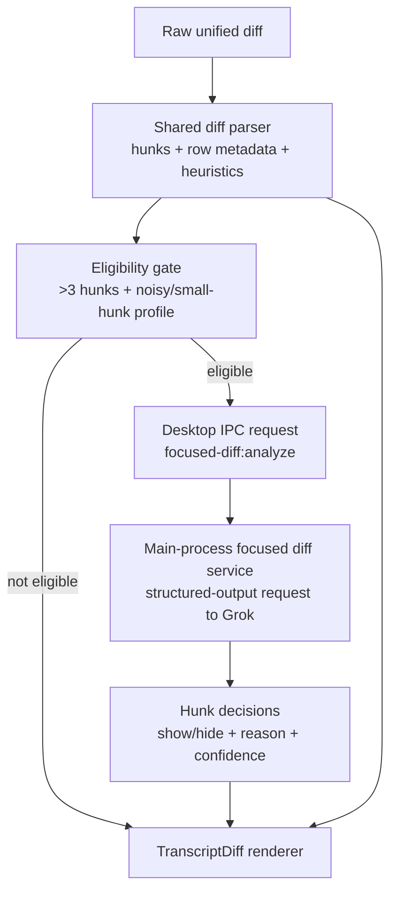

# feat: Add Grok-focused diff zoom view

## Overview

Add a smarter default "zoomed out" diff view in the desktop transcript that can hide low-signal hunks for noisy multi-hunk diffs, while always preserving a one-click full diff view. The first pass should stay cheap and safe: deterministic compression remains the baseline, Grok analysis is optional and gated, and the full patch remains the source of truth.

## Problem Frame

The current desktop diff renderer only compresses unchanged context within a unified diff. That helps, but it still leaves busy patches hard to scan when a file contains many tiny hunks such as import churn, comment updates, or repetitive one-line edits spread across the file. The user wants a real zoom in/out behavior where the default view can skip low-value hunks, but not at the cost of hiding the only trustworthy view. This plan therefore treats Grok as a ranking pass for a secondary focused view, not as an authority that replaces the full diff.

## Requirements Trace

- R1. Keep the full diff available at all times; the focused view must be additive, not destructive.
- R2. Only invoke Grok for diffs that are likely to benefit from hunk-level ranking, rather than for every patch.
- R3. Do not require function/tool calling for this feature; use the simplest reliable xAI path.
- R4. Preserve deterministic fallback behavior when Grok is unavailable, slow, schema-invalid, or low confidence.
- R5. Only show zoom controls when the zoomed-out view actually hides material relative to the full diff.
- R6. Keep the implementation inside the existing desktop main/preload/renderer contract patterns.
- R7. Bound cost and latency with explicit gating, caching, and request shaping.

## Scope Boundaries

- No change to transcript replay persistence; focused-hunk decisions are ephemeral UI data, not thread history.
- No attempt to summarize or rewrite diff prose in the first pass; the model only decides which hunks to hide.
- No provider-general abstraction for third-party diff ranking beyond the existing Grok-first path.
- No background prefetch for every diff in the transcript list; analysis should be requested on demand for an opened activity item.

## Context & Research

### Relevant Code and Patterns

- `apps/desktop/src/renderer/src/features/thread-detail/TranscriptDiff.tsx` already parses unified diffs into rows and supports a simple full-versus-condensed toggle.
- `apps/desktop/src/renderer/src/features/thread-detail/TranscriptActivity.tsx` is the current expansion boundary for transcript activity details; it is the natural place to trigger focused analysis when a write detail becomes visible.
- `apps/desktop/src/main/ipc/app-server.ts`, `apps/desktop/src/preload/index.ts`, `apps/desktop/src/shared/ipc.ts`, and `apps/desktop/src/renderer/src/lib/desktop-api.ts` define the established main/preload/renderer bridge pattern.
- `apps/desktop/src/main/grok-app-server/client.ts` already knows how to load Grok configuration through `@pwragent/agent-core`; the focused-diff service should follow that pattern rather than inventing a separate config path.
- `packages/agent-core/src/providers/xai-responses-client.ts` is the existing xAI Responses API wrapper; it is the right reuse point if the focused-diff service needs prompt-cache-related request fields or headers.
- `apps/desktop/src/renderer/src/features/thread-detail/__tests__/transcript-list.test.tsx` already covers transcript diff behavior and should stay the renderer contract anchor.

### Institutional Learnings

- No relevant `docs/solutions/` artifacts exist yet in this repository.

### External References

- xAI structured outputs guarantee schema-shaped responses and are supported by language models, which is a better fit here than parsing free-form prose: [docs.x.ai/developers/model-capabilities/text/structured-outputs](https://docs.x.ai/developers/model-capabilities/text/structured-outputs)
- xAI function calling exists, but this feature does not need a tool loop because the desktop can submit a single ranking request and consume structured JSON directly: [docs.x.ai/developers/tools/function-calling](https://docs.x.ai/developers/tools/function-calling)
- xAI prompt caching for Responses API can reduce repeated-prefix cost; the docs recommend `x-grok-conv-id` and mention `prompt_cache_key` for Responses API: [docs.x.ai/developers/advanced-api-usage/prompt-caching](https://docs.x.ai/developers/advanced-api-usage/prompt-caching)
- Responses API cache hits are observable through `usage.input_tokens_details.cached_tokens`, which makes it feasible to verify whether the focused-diff prompt is actually benefiting from caching: [docs.x.ai/developers/advanced-api-usage/prompt-caching/usage-and-pricing](https://docs.x.ai/developers/advanced-api-usage/prompt-caching/usage-and-pricing)
- Grok 4.20 currently supports structured outputs and function calling and has a 2,000,000-token context window, which removes immediate prompt-size pressure for the first implementation: [docs.x.ai/developers/models](https://docs.x.ai/developers/models)

## Key Technical Decisions

- Use structured outputs, not function calling, for the hunk-ranking request. This keeps the analysis path to one request/response exchange and avoids a tool loop the feature does not need.
- Keep focused-hunk decisions ephemeral in the desktop layer. The transcript replay remains an accurate record of what happened; the focused view is a presentation concern.
- Gate model calls aggressively. The first eligibility rule should be: more than 3 hunks, plus a high context-to-change ratio, plus at least 2 "small" hunks where the changed lines are minimal. This matches the user problem instead of paying for analysis on every patch.
- Ask Grok to classify hunks into `show` versus `hide` with reasons and confidence, then auto-hide only the hunks that meet explicit confidence and reason constraints. This reduces the chance that the model silently hides meaningful changes.
- Keep the current deterministic row-level context compression even when focused analysis is active. Focused-hunk hiding and local context elision solve different noise problems and should compose.
- Show zoom controls only when the zoomed-out view hides material. For low-hunk or low-noise diffs, the UI should simply render the full patch without a meaningless toggle.
- Reuse existing Grok config loading and xAI client code, but extend the xAI client only where needed for caching-related request metadata. Do not create a second bespoke fetch stack unless reuse proves awkward during implementation.

## Open Questions

### Resolved During Planning

- Should this use function calling? No. Structured outputs are enough and materially simpler.
- Should focused-hunk decisions be persisted into replay or thread state? No. They are a desktop presentation layer concern.
- Should the model-picked view replace the full diff? No. Full diff remains the authoritative view and must be one click away.
- Should the feature run for all diffs? No. It should be gated to noisy multi-hunk diffs to control cost and latency.

### Deferred to Implementation

- Exact prompt wording and confidence thresholds should be tuned once the first focused-view examples can be inspected against real diffs.
- The exact cache key format can be finalized while wiring the service, as long as it is stable for the static prompt prefix and observable in usage metrics.
- Whether the analysis result should be memoized only in-memory or also across a short-lived desktop session can be decided while implementing the service cache.

## High-Level Technical Design

> *This illustrates the intended approach and is directional guidance for review, not implementation specification. The implementing agent should treat it as context, not code to reproduce.*



## Implementation Units

- [x] **Unit 1: Extract shared diff/hunk metadata and local zoom eligibility**

**Goal:** Replace the row-only patch parsing with a shared diff model that can describe hunks, changed-line density, and whether a zoomed-out view would actually hide meaningful material.

**Requirements:** R1, R2, R5, R6

**Dependencies:** None

**Files:**
- Create: `apps/desktop/src/shared/diff-focus.ts`
- Modify: `apps/desktop/src/renderer/src/features/thread-detail/TranscriptDiff.tsx`
- Test: `apps/desktop/src/shared/__tests__/diff-focus.test.ts`
- Test: `apps/desktop/src/renderer/src/features/thread-detail/__tests__/transcript-list.test.tsx`

**Approach:**
- Move unified-diff parsing out of `TranscriptDiff.tsx` into a shared pure helper so both the renderer and main-process analysis service can consume the same hunk model.
- The helper should return:
  - ordered hunks with header text, changed lines, context lines, and line numbers
  - row groups for full view and local condensed view
  - a visibility decision for whether the zoom controls should render at all
- Introduce a first-pass eligibility heuristic that identifies "noisy small-hunk diffs" without any model call. The initial rule should bias toward false negatives, not false positives: only mark diffs eligible when they clearly have more than 3 hunks and a high context-to-change ratio.
- Preserve the current deterministic row-compaction behavior as the local fallback and baseline implementation.

**Execution note:** Start with failing pure-data tests for multi-hunk parsing and zoom-control eligibility before rewiring the renderer.

**Patterns to follow:**
- `apps/desktop/src/renderer/src/features/thread-detail/TranscriptDiff.tsx`
- `apps/desktop/src/renderer/src/features/thread-detail/__tests__/transcript-list.test.tsx`

**Test scenarios:**
- Happy path: a single-hunk diff with minimal context returns one hunk and reports that no zoom controls are needed.
- Happy path: a diff with 4 small hunks and large untouched gaps reports eligible-for-focus and produces local condensed rows.
- Edge case: adjacent hunks remain separate when the unified diff contains multiple `@@` headers close together.
- Edge case: file headers (`---`, `+++`) and patch metadata are excluded from hunk content rows.
- Error path: empty or malformed diff text returns a safe empty model and disables zoom controls.

**Verification:**
- The desktop has one shared, test-covered diff model that can answer "should we show zoom controls?" before any network call happens.

- [x] **Unit 2: Add a main-process Grok focused-diff analysis service and IPC contract**

**Goal:** Introduce a small desktop service that can ask Grok which hunks are low-signal for eligible diffs and return a structured decision object to the renderer.

**Requirements:** R1, R2, R3, R4, R6, R7

**Dependencies:** Unit 1

**Files:**
- Create: `packages/shared/src/contracts/diff-focus.ts`
- Modify: `packages/shared/src/index.ts`
- Modify: `apps/desktop/src/shared/ipc.ts`
- Modify: `apps/desktop/src/preload/index.ts`
- Modify: `apps/desktop/src/renderer/src/lib/desktop-api.ts`
- Create: `apps/desktop/src/main/diff-focus/focused-diff-service.ts`
- Modify: `apps/desktop/src/main/ipc/app-server.ts`
- Modify: `packages/agent-core/src/providers/xai-responses-client.ts`
- Test: `apps/desktop/src/main/__tests__/focused-diff-service.test.ts`

**Approach:**
- Define a desktop-only request/response contract for focused diff analysis. The request should include the file path, raw diff, parsed hunk summaries, and a stable diff identifier; the response should include hunk indices to show/hide, per-hunk reasons, confidence, and request metadata such as whether the result came from cache or fallback.
- Implement a main-process service that:
  - reuses Grok config loading already established by `GrokAppServerClient`
  - exits early when there is no xAI configuration, when the diff is not eligible, or when the diff is too small to benefit
  - sends a single structured-output request asking Grok to classify hunks, not summarize the whole patch
  - validates the response schema before returning any hide decisions to the renderer
  - downgrades to a safe "show all hunks" result whenever the response is invalid, low-confidence, or timed out
- Extend the xAI Responses client only as far as needed to support prompt-caching-friendly request metadata for this flow.
- Use a stable cache key derived from the static prompt version plus the diff fingerprint so repeated toggle/open cycles do not repeatedly pay for the same analysis during a session.

**Technical design:** *(directional guidance, not implementation specification)*

```text
focusedDiffRequest -> eligibility check
  -> in-memory result cache lookup
  -> if miss and xAI configured:
       create structured-output request with:
         - system instructions for low-signal hunk classification
         - compact hunk array input
         - response schema: show_hunks, hide_hunks, reasons, confidence
       validate schema
       discard hide decisions below confidence threshold
  -> return normalized result:
       mode = "focused" | "fallback" | "full"
       hidden_hunk_count
       hidden_hunks[]
       shown_hunks[]
```

**Patterns to follow:**
- `apps/desktop/src/main/grok-app-server/client.ts`
- `apps/desktop/src/main/ipc/app-server.ts`
- `packages/agent-core/src/providers/xai-responses-client.ts`

**Test scenarios:**
- Happy path: an eligible 4-hunk diff returns a structured decision that hides at least one low-signal hunk and preserves the rest.
- Happy path: repeated analysis of the same diff reuses the in-memory or prompt-cache path instead of issuing a wholly fresh request every time.
- Edge case: missing `XAI_API_KEY` or Grok config returns a normalized fallback result without throwing through IPC.
- Edge case: a schema-invalid or low-confidence response downgrades to `show all hunks` and records no hidden hunks.
- Error path: xAI request failure or timeout returns a normalized fallback result and does not wedge transcript rendering.

**Verification:**
- The desktop can ask Grok for focused hunk ranking through a typed IPC path, but any failure still leaves the full diff available and the UI operable.

- [x] **Unit 3: Integrate the focused view into TranscriptDiff and hide only low-signal hunks by default**

**Goal:** Make the renderer default to a focused zoomed-out view for eligible diffs with accepted hide decisions, while keeping full view and local deterministic fallback intuitive.

**Requirements:** R1, R4, R5, R6

**Dependencies:** Unit 2

**Files:**
- Modify: `apps/desktop/src/renderer/src/features/thread-detail/TranscriptActivity.tsx`
- Modify: `apps/desktop/src/renderer/src/features/thread-detail/TranscriptDiff.tsx`
- Modify: `apps/desktop/src/renderer/src/styles/app.css`
- Test: `apps/desktop/src/renderer/src/features/thread-detail/__tests__/transcript-list.test.tsx`
- Test: `apps/desktop/src/renderer/src/features/thread-detail/__tests__/transcript-diff.test.tsx`

**Approach:**
- When a write detail is expanded, request focused analysis only if Unit 1 marks the diff eligible; otherwise render the local deterministic view only.
- Default view modes:
  - **Full** for non-eligible diffs
  - **Focused** for eligible diffs where Grok returns at least one accepted hide decision
  - **Condensed local** for eligible diffs when Grok is unavailable or returns no acceptable hide decisions
- Only render zoom controls when the current default view hides something compared with the full diff. If the default and full views are identical, the control should disappear.
- Show a clear count of hidden hunks or hidden lines when the focused view is active so users understand why the zoomed-out view is shorter.
- Keep the button semantics simple:
  - default state: zoomed out
  - `Zoom in`: reveal the full patch
  - `Zoom out`: return to the focused/default view
- Do not hide hunk headers for shown hunks; the reader still needs anchoring within the file.

**Execution note:** Add characterization coverage for existing zoom behavior before changing the button visibility rules.

**Patterns to follow:**
- `apps/desktop/src/renderer/src/features/thread-detail/TranscriptDiff.tsx`
- `apps/desktop/src/renderer/src/features/thread-detail/TranscriptActivity.tsx`
- `apps/desktop/src/renderer/src/styles/app.css`

**Test scenarios:**
- Happy path: an eligible diff with accepted hide decisions defaults to focused view, reports hidden hunks, and reveals all hunks on `Zoom in`.
- Happy path: a non-eligible single-hunk diff renders fully and shows no zoom controls.
- Edge case: an eligible diff whose Grok result hides zero hunks falls back to the deterministic local view and suppresses meaningless controls if nothing is hidden.
- Edge case: expanding and collapsing the parent activity row does not leak stale focused-diff state between different file details.
- Error path: an IPC analysis failure leaves the renderer on a safe deterministic view and still allows `Zoom in` if local condensation hid rows.

**Verification:**
- The transcript diff surface only shows zoom controls when they matter, defaults to the focused view when it has a credible reason to do so, and always lets the user reach the untouched full diff.

## System-Wide Impact

- **Interaction graph:** Transcript activity expansion will now cross the renderer -> preload -> main-process IPC boundary for eligible diffs, then return to the renderer as transient view state.
- **Error propagation:** xAI failures, invalid structured output, and configuration gaps should collapse into a normalized fallback result, not renderer exceptions.
- **State lifecycle risks:** Focused-hunk decisions are ephemeral and keyed by diff identity; stale decisions must not bleed across files or survive when the underlying diff changes.
- **API surface parity:** The new IPC contract is desktop-specific and should not mutate the existing app-server replay contract. Both Codex-backed and Grok-backed thread transcripts should be able to use the same focused-view feature because it operates on normalized desktop diff data.
- **Integration coverage:** Tests need at least one end-to-end renderer/main-process scenario proving that an eligible diff can request focused analysis and still recover safely from analysis failure.
- **Unchanged invariants:** Thread replay remains authoritative, full diff remains available, and transcript activity order/structure does not change.

## Risks & Dependencies

| Risk | Mitigation |
|------|------------|
| Grok hides a semantically important hunk | Keep full diff one click away, require confidence/reason gating, and bias the classifier toward hiding only obvious low-signal churn |
| The feature becomes expensive if called for every diff | Gate by hunk/noise heuristics and use request/result caching |
| xAI structured output drifts or fails validation | Validate schema strictly and fall back to showing all hunks |
| Focused analysis adds UI latency when expanding a diff | Request on demand, render deterministic fallback immediately, and upgrade to focused view only when the response arrives |
| Reusing the xAI client requires small protocol changes | Keep those changes additive and scoped to prompt-cache metadata rather than broad provider refactors |

## Documentation / Operational Notes

- No end-user documentation change is required for the first pass.
- Add a brief internal note in the PR description that focused diff analysis is heuristic and non-authoritative.
- During manual verification, inspect whether `cached_tokens` appears in the xAI response path for repeated analysis of the same diff so the team can verify that the intended cache strategy is actually helping.

## Sources & References

- Related code: `apps/desktop/src/renderer/src/features/thread-detail/TranscriptDiff.tsx`
- Related code: `apps/desktop/src/main/ipc/app-server.ts`
- Related code: `apps/desktop/src/main/grok-app-server/client.ts`
- Related code: `packages/agent-core/src/providers/xai-responses-client.ts`
- External docs: [xAI Structured Outputs](https://docs.x.ai/developers/model-capabilities/text/structured-outputs)
- External docs: [xAI Function Calling](https://docs.x.ai/developers/tools/function-calling)
- External docs: [xAI Prompt Caching](https://docs.x.ai/developers/advanced-api-usage/prompt-caching)
- External docs: [xAI Prompt Caching Usage & Pricing](https://docs.x.ai/developers/advanced-api-usage/prompt-caching/usage-and-pricing)
- External docs: [xAI Models](https://docs.x.ai/developers/models)
