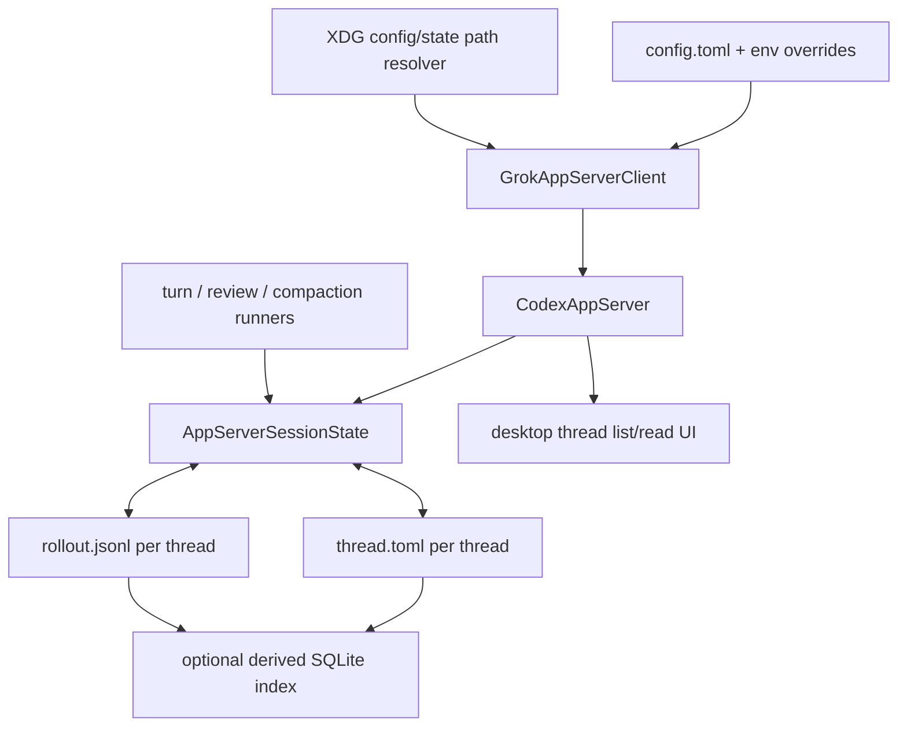

# feat: Add durable thread storage for the Grok app server

## Overview

Add durable Grok thread storage so Grok-backed threads survive desktop app restarts, remain readable through `thread/list` and `thread/read`, and keep enough provider state to continue the conversation after a restart. At the same time, replace the Grok app-server's current env-file-only configuration with a user-editable TOML config under XDG config paths, while storing thread history as grep-friendly JSONL rollout files under XDG state paths. If indexing later becomes necessary for scale, SQLite should be introduced as a derived cache, not the source of truth.

## Problem Frame

The current Grok app-server path is effectively stateless across process restarts:

- [`apps/desktop/src/main/grok-app-server/client.ts`](/Users/huntharo/.codex/worktrees/4978/PwrAgent/apps/desktop/src/main/grok-app-server/client.ts) creates an in-process `CodexAppServer`
- [`packages/agent-core/src/app-server/codex-app-server.ts`](/Users/huntharo/.codex/worktrees/4978/PwrAgent/packages/agent-core/src/app-server/codex-app-server.ts) owns an in-memory `AppServerSessionState`
- [`packages/agent-core/src/app-server/session-state.ts`](/Users/huntharo/.codex/worktrees/4978/PwrAgent/packages/agent-core/src/app-server/session-state.ts) stores threads, messages, replay items, previous response ids, and active runs only in maps

That is why restarting the desktop app drops every Grok thread. The app already persists navigation overlay state through [`packages/agent-core/src/persistence/overlay-store.ts`](/Users/huntharo/.codex/worktrees/4978/PwrAgent/packages/agent-core/src/persistence/overlay-store.ts), but the server-side thread data the desktop actually needs to render and resume Grok threads is not durable.

The current config story is also awkward. Runtime code imports [`packages/agent-core/src/testing/load-local-env.ts`](/Users/huntharo/.codex/worktrees/4978/PwrAgent/packages/agent-core/src/testing/load-local-env.ts), which loads `XAI_API_KEY`, `XAI_BASE_URL`, and `GROK_MODEL` from `~/.config/grok-app-server/config.env` or legacy `.env` files. That helper works, but it couples production startup to a testing-oriented env parser and gives us no clean place to put storage settings.

The earlier draft of this plan leaned toward SQLite as the canonical runtime store. That is operationally tidy, but it fights the way this product is likely to be debugged and inspected. For Grok threads, plain text matters:

- humans should be able to inspect raw thread artifacts
- `rg` should work over stored transcripts
- agents should be able to search thread history without a custom database query path
- restart durability should not require opaque binary state as the only source of truth

This revision therefore fixes both issues together:

- durable thread persistence for the Grok app server
- a clearer XDG config/state split
- text-first JSONL rollouts as canonical thread storage

## Requirements Trace

- R4. Threads remain first-class objects even when they have no attached directory.
- R8. Recents is the default browsing lens, which only works if completed and inactive threads still exist after restart.
- R20. The first milestone includes a real provider and agent harness, not a fake shell.
- R21. The system is Grok-first for the first milestone.
- R22. The first milestone supports the core coding loop: create or open a thread, run agent work, inspect progress, and review results inside the app.
- R24-R26. The product should not feel stateless; its memory and guidance systems must accumulate over time.
- User-requested durability requirement. Restarting the desktop app must not erase Grok threads.
- Derived continuity requirement. A persisted thread must retain enough provider continuity data to support a follow-up Grok turn after restart, not just a read-only transcript.
- Derived operability requirement. Stored Grok thread artifacts should remain inspectable and searchable with ordinary filesystem tools such as `rg`.

## Scope Boundaries

- In scope: the Grok app-server persistence path used by the desktop app.
- In scope: durable storage for thread metadata, transcript content, replay items, and provider continuation metadata.
- In scope: replacing the Grok app-server config file format with TOML, plus a compatibility fallback for existing env files.
- In scope: XDG-based config and state paths.
- In scope: JSONL rollouts as canonical thread history storage.
- In scope: an optional derived SQLite index only if needed for list or search performance.
- In scope: restart recovery for completed or idle threads.
- Out of scope: changing Codex thread persistence.
- Out of scope: syncing threads across machines or user accounts.
- Out of scope: persisting live provider handles or resuming in-flight turns exactly where they left off after process death.
- Out of scope: full parity with Codex's rollout tree, indexing rules, and broader state-db architecture.

## Context & Research

### Relevant Code and Patterns

- [`packages/agent-core/src/app-server/session-state.ts`](/Users/huntharo/.codex/worktrees/4978/PwrAgent/packages/agent-core/src/app-server/session-state.ts) is the direct source of the restart bug. It owns the thread registry, transcript messages, replay items, previous response ids, and run map entirely in memory.
- [`packages/agent-core/src/app-server/codex-app-server.ts`](/Users/huntharo/.codex/worktrees/4978/PwrAgent/packages/agent-core/src/app-server/codex-app-server.ts) creates `AppServerSessionState` internally, so persistence has to be wired through the server constructor rather than bolted on in the desktop shell.
- [`packages/agent-core/src/app-server/turn-runner.ts`](/Users/huntharo/.codex/worktrees/4978/PwrAgent/packages/agent-core/src/app-server/turn-runner.ts), [`packages/agent-core/src/app-server/compaction-runner.ts`](/Users/huntharo/.codex/worktrees/4978/PwrAgent/packages/agent-core/src/app-server/compaction-runner.ts), and [`packages/agent-core/src/app-server/review-runner.ts`](/Users/huntharo/.codex/worktrees/4978/PwrAgent/packages/agent-core/src/app-server/review-runner.ts) already funnel all durable thread mutations through `AppServerSessionState`. That makes a write-through persistence layer feasible without rewriting the runners.
- [`apps/desktop/src/main/grok-app-server/client.ts`](/Users/huntharo/.codex/worktrees/4978/PwrAgent/apps/desktop/src/main/grok-app-server/client.ts) currently loads env defaults and instantiates `CodexAppServer` directly. That is the right integration point for config loading and storage-path wiring.
- [`packages/agent-core/src/persistence/overlay-store.ts`](/Users/huntharo/.codex/worktrees/4978/PwrAgent/packages/agent-core/src/persistence/overlay-store.ts) shows the existing local persistence style in this repo: simple durable files, explicit migrations, and atomic writes for small metadata payloads.
- [`docs/plans/2026-04-16-002-feat-app-server-protocol-compatibility-plan.md`](/Users/huntharo/.codex/worktrees/4978/PwrAgent/docs/plans/2026-04-16-002-feat-app-server-protocol-compatibility-plan.md) explicitly left durable cross-process thread persistence out of scope. This plan is the follow-on that closes that gap.

### Comparison: `codex`

- `codex` keeps human-edited configuration in `~/.codex/config.toml`.
- It stores thread rollouts on disk as JSONL under `~/.codex/sessions/YYYY/MM/DD/rollout-...jsonl`.
- It also maintains SQLite state and logs databases under `CODEX_HOME` for metadata and indexing.

Relevant references:

- `/Users/huntharo/github/codex/codex-rs/config/src/types.rs`
- `/Users/huntharo/github/codex/codex-rs/rollout/src/list.rs`
- `/Users/huntharo/github/codex/codex-rs/state/src/runtime.rs`

What matters here is not copying Codex wholesale. The useful patterns are:

- TOML for user-managed configuration
- appendable text artifacts for thread history
- optional database indexing layered on top of those artifacts

### Comparison: `grok-cli`

- `grok-cli` stores user settings separately from runtime state.
- It uses `~/.grok/grok.db` as the durable runtime store.
- Its SQLite schema persists sessions, messages, tool calls, tool results, usage, and compactions.

Relevant references:

- `/Users/huntharo/github/grok-cli/src/storage/db.ts`
- `/Users/huntharo/github/grok-cli/src/storage/migrations.ts`
- `/Users/huntharo/github/grok-cli/src/storage/sessions.ts`
- `/Users/huntharo/github/grok-cli/src/storage/transcript.ts`

`grok-cli` is still useful as a schema-design reference, especially for what data should be persisted. But for PwrAgent, its SQLite-first storage shape is a worse fit than Codex's text-first artifacts because the desktop app and this repo benefit more from inspectable files than from database-only storage.

### Institutional Learnings

- No `docs/solutions/` documents exist yet for Grok app-server persistence in this repository.

### External Research

- Skipped. The repo and the adjacent `codex` and `grok-cli` codebases already provide the relevant storage and config patterns for this decision.

## Key Technical Decisions

- Use an XDG split for config and state:
  - `XDG_CONFIG_HOME/grok-app-server/config.toml` with fallback `~/.config/grok-app-server/config.toml`
  - `XDG_STATE_HOME/grok-app-server/...` with fallback `~/.local/state/grok-app-server/...`
  This is the standard, unsurprising place for a cross-platform developer tool that wants to remain compatible with XDG-aware setups.
- Use TOML for Grok app-server configuration. It is a better fit than env files for structured defaults and a better fit than YAML for low-surprise local editing.
- Keep environment variables as highest-precedence overrides, then read `config.toml`, then fall back to legacy env files during the migration window. This preserves current operator behavior and avoids breaking existing setups on day one.
- Store Grok thread history canonically as text-first rollout artifacts under the XDG state directory. The rollout data should be searchable with `rg` and inspectable without custom tooling.
- Use a per-thread directory layout under state root, for example:
  - `threads/<thread-id>/thread.toml`
  - `threads/<thread-id>/rollout.jsonl`
  `thread.toml` holds durable summary metadata. `rollout.jsonl` holds append-only message and replay events.
- If list or query performance later becomes a real problem, add SQLite only as a derived index or cache that can be rebuilt from the rollout files. SQLite should not be the only authoritative copy of thread history.
- Encapsulate persistence behind a narrow app-server storage adapter and keep `AppServerSessionState` as the main mutation surface. That preserves the existing turn, compaction, and review runner structure instead of scattering filesystem logic across the app-server.
- Persist only durable, restart-safe state:
  - thread metadata
  - ordered user and assistant transcript messages
  - replay items used by the desktop transcript surfaces
  - previous provider response id
  - created and updated timestamps
  Do not attempt to persist live provider handles, pending approval callbacks, or active-run subscriptions.
- On startup, treat any previously active run as no longer resumable. The persisted thread remains readable and usable for a new turn, but the server does not promise exact mid-turn recovery after a crash or restart.

## Open Questions

### Resolved During Planning

- Should thread data live in the existing config directory? No. Keep config and runtime state separate even if both are under the Grok app-server namespace.
- Should the new config remain env-shaped? No. Use TOML for the config file and keep env vars as overrides.
- Should PwrAgent use XDG paths? Yes. Use XDG config and state locations with the standard `~/.config` and `~/.local/state` fallbacks.
- Should PwrAgent copy Codex's JSONL rollout idea? Yes, at the level of canonical text-first thread artifacts, but not the full Codex rollout-plus-state-db architecture.
- Should SQLite be the source of truth? No. If SQLite appears later, it should be a derived index, not the canonical history store.
- Should the first persistence pass try to recover in-flight runs? No. Persist completed thread history and allow new turns after restart; do not promise crash-exact active turn recovery.

### Deferred to Implementation

- Whether the migration experience should create `config.toml` automatically from a detected legacy env file or only continue reading the env file until the user opts in.
- Whether replay-item payloads should live entirely in rollout JSONL or split between `thread.toml` summary fields and rollout events for faster summary reads.
- Whether the first pass should ship with no SQLite index at all, or with a minimal rebuildable index for `thread/list` performance once the thread count grows.
- Whether stale active runs should be marked as `cancelled` during hydration or simply omitted from the active run set while preserving prior completed replay items.

## High-Level Technical Design

> *This illustrates the intended approach and is directional guidance for review, not implementation specification. The implementing agent should treat it as context, not code to reproduce.*

### Data Shape Guidance

- `thread.toml`
  - thread id
  - thread name
  - cwd
  - model
  - model provider
  - previous response id
  - created and updated timestamps
- `rollout.jsonl`
  - ordered user and assistant messages
  - replay items with stable item ids
  - command or tool metadata needed by transcript surfaces
  - compaction and review outputs as normal persisted events
- optional `index.sqlite`
  - derived summaries for fast `thread/list`
  - rebuildable from `thread.toml` plus `rollout.jsonl`

The persistence adapter should hydrate the in-memory session state at boot and then write through on thread mutations. `thread/list` and `thread/read` stay routed through the same app-server APIs the desktop already consumes.

## Alternative Approaches Considered

- Single JSON file under `XDG_STATE_HOME/grok-app-server/`
  - Rejected because it mixes many threads into one mutable blob, rewrites too much data on each change, and scales poorly as transcript size grows.
- SQLite-only canonical storage
  - Rejected because it hides the source of truth behind a database, makes `rg` and manual inspection much worse, and creates an unnecessary custom-query barrier for debugging.
- Full Codex-style rollout tree plus state-db indexing from day one
  - Rejected because it imports more architecture than this repo currently needs.
- JSON or YAML for config
  - JSON is workable but awkward for user-edited local config.
  - YAML adds parsing edge cases and more surface area than this repo needs.
  - TOML is the best fit for a small structured local config file.

## Implementation Units

- [x] **Unit 1: Replace env-only Grok app-server config with a runtime config module**

**Goal:** Move Grok app-server configuration out of the testing helper and into a runtime config loader that supports TOML, XDG paths, and compatibility fallbacks.

**Requirements:** R20, R21, R22, user-requested durability requirement

**Dependencies:** None

**Files:**
- Create: `packages/agent-core/src/config/grok-app-server-config.ts`
- Modify: `packages/agent-core/src/index.ts`
- Modify: `apps/desktop/src/main/grok-app-server/client.ts`
- Test: `packages/agent-core/src/__tests__/test-harness.test.ts`
- Test: `apps/desktop/src/main/__tests__/grok-app-server-client.test.ts`

**Approach:**
- Introduce helpers for default XDG config and state paths under the Grok app-server namespace.
- Parse `config.toml` for Grok settings and storage options.
- Preserve current environment-variable override behavior.
- Keep the current `config.env` or `.env` loading path as a compatibility fallback during migration rather than breaking existing users immediately.

**Patterns to follow:**
- [`packages/agent-core/src/testing/load-local-env.ts`](/Users/huntharo/.codex/worktrees/4978/PwrAgent/packages/agent-core/src/testing/load-local-env.ts)
- `/Users/huntharo/github/codex/codex-rs/config/src/types.rs`

**Test scenarios:**
- Happy path: when `config.toml` exists, the loader returns configured model, base URL, and state-root values.
- Happy path: explicit process env values override TOML defaults.
- Edge case: when `config.toml` is absent, legacy `config.env` or `.env` files still initialize the Grok client.
- Edge case: custom `XDG_CONFIG_HOME` and `XDG_STATE_HOME` values redirect the resolved paths correctly.
- Error path: malformed TOML returns a helpful startup error that identifies the file path.
- Integration: `GrokAppServerClient` bootstraps from the new config loader without changing the desktop call sites.

**Verification:**
- The desktop can initialize the Grok app server from TOML-backed XDG config without importing testing-only env helpers.

- [x] **Unit 2: Add a canonical Grok rollout store for durable thread artifacts**

**Goal:** Create the text-first storage layer that persists and reloads Grok thread state across process restarts.

**Requirements:** R4, R20-R22, derived continuity requirement, derived operability requirement

**Dependencies:** Unit 1

**Files:**
- Create: `packages/agent-core/src/persistence/grok-rollout-store.ts`
- Create: `packages/agent-core/src/persistence/grok-rollout-records.ts`
- Modify: `packages/agent-core/src/app-server/protocol.ts`
- Modify: `packages/agent-core/src/app-server/session-state.ts`
- Test: `packages/agent-core/src/__tests__/grok-rollout-store.test.ts`
- Test: `packages/agent-core/src/__tests__/session-state.test.ts`

**Approach:**
- Add a storage adapter that persists each thread into its own directory under the XDG state root.
- Use `thread.toml` for thread summary metadata and `rollout.jsonl` for append-only transcript and replay events.
- Keep the persisted event shapes aligned with the current `AppServerSessionState` model rather than inventing a second conversation model.
- Hydrate `AppServerSessionState` from the store at startup.
- Write through on thread creation, thread mutation, user message append, assistant message append, replay item updates, and previous response id changes.
- Keep active run handles in memory only.

**Execution note:** Implement new store behavior test-first because this unit changes persistent state and restart semantics.

**Patterns to follow:**
- [`packages/agent-core/src/persistence/overlay-store.ts`](/Users/huntharo/.codex/worktrees/4978/PwrAgent/packages/agent-core/src/persistence/overlay-store.ts)
- `/Users/huntharo/github/codex/codex-rs/rollout/src/list.rs`

**Test scenarios:**
- Happy path: a persisted thread reloads with the same id, name, cwd, model, and timestamps after a new state instance is created.
- Happy path: persisted rollout messages reload in order and reproduce `lastUserMessage` and `lastAssistantMessage`.
- Happy path: persisted previous response id reloads and is available for the next turn.
- Edge case: directory-less threads persist and reload without a cwd.
- Edge case: replay items with command and tool metadata round-trip through rollout records.
- Error path: malformed `thread.toml` or corrupted JSONL event lines fail with a deterministic storage error that identifies the thread path.
- Integration: a compaction or review output persisted through the rollout store is visible in a subsequent `readThread` call after rehydration.

**Verification:**
- A fresh `AppServerSessionState` instance pointed at the same state root can list and read previously stored Grok threads correctly from text artifacts alone.

- [ ] **Unit 3: Add an optional derived index path without changing the source of truth**

**Goal:** Leave room for fast listing at scale without making SQLite authoritative.

**Requirements:** R20-R22, derived operability requirement

**Dependencies:** Unit 2

**Files:**
- Create: `packages/agent-core/src/persistence/grok-thread-index.ts`
- Create: `packages/agent-core/src/persistence/grok-thread-index-migrations.ts`
- Test: `packages/agent-core/src/__tests__/grok-thread-index.test.ts`

**Approach:**
- Keep this unit narrow and optional.
- Design a rebuildable index that summarizes per-thread metadata and last-activity timestamps from `thread.toml` and `rollout.jsonl`.
- Make the server able to fall back to direct filesystem scans when the index is absent or stale.
- Do not require this unit for correctness; it is purely a performance path.

**Patterns to follow:**
- `/Users/huntharo/github/codex/codex-rs/state/src/runtime.rs`
- `/Users/huntharo/github/grok-cli/src/storage/migrations.ts`

**Test scenarios:**
- Happy path: the derived index can be rebuilt from rollout files and returns the same thread summaries as a direct file scan.
- Edge case: deleting the index does not lose thread history because rollout files remain canonical.
- Error path: a stale or unreadable index causes a fallback to direct file scanning rather than an empty thread list.

**Verification:**
- Performance optimizations remain decoupled from correctness and inspectability.

- [x] **Unit 4: Wire persistent session state into the Grok app server**

**Goal:** Make the real server use the new rollout store without changing the desktop's app-server contract.

**Requirements:** R20-R22, user-requested durability requirement, derived continuity requirement

**Dependencies:** Unit 2

**Files:**
- Modify: `packages/agent-core/src/app-server/codex-app-server.ts`
- Modify: `packages/agent-core/src/app-server/turn-runner.ts`
- Modify: `packages/agent-core/src/app-server/compaction-runner.ts`
- Modify: `packages/agent-core/src/app-server/review-runner.ts`
- Create: `packages/agent-core/src/__tests__/codex-app-server-persistence.test.ts`
- Modify: `packages/agent-core/src/__tests__/codex-app-server-contract.test.ts`

**Approach:**
- Extend `CodexAppServer` construction so callers can pass a persistent session-state dependency instead of always creating a blank in-memory state.
- Keep request routing and notification shapes unchanged.
- Ensure runner-driven mutations continue to flow through `AppServerSessionState`, so persistence remains centralized.
- Define restart behavior for stale active runs: thread data reloads, but active subscriptions do not.
- Optionally layer the derived index in for listing if Unit 3 exists, but keep file-based hydration as the fallback path.

**Patterns to follow:**
- [`packages/agent-core/src/app-server/codex-app-server.ts`](/Users/huntharo/.codex/worktrees/4978/PwrAgent/packages/agent-core/src/app-server/codex-app-server.ts)
- [`packages/agent-core/src/app-server/turn-runner.ts`](/Users/huntharo/.codex/worktrees/4978/PwrAgent/packages/agent-core/src/app-server/turn-runner.ts)

**Test scenarios:**
- Happy path: a server instance creates a thread, records a completed turn, shuts down, and a new server instance on the same state root returns the same thread from `thread/list`.
- Happy path: the reloaded thread can be opened with `thread/read` and then used for a new `turn/start`.
- Edge case: restarting after a thread rename preserves the human title.
- Edge case: restarting after compaction preserves the compacted transcript state used by later prompts.
- Error path: a missing thread still returns the existing protocol error after persistence wiring.
- Integration: `previousResponseId` survives server recreation so follow-up turns continue the same Grok conversation instead of silently starting over.

**Verification:**
- The in-process Grok app server behaves like a durable service rather than a per-process scratchpad.

- [x] **Unit 5: Connect desktop startup to persistent Grok storage and verify restart behavior**

**Goal:** Ensure the desktop integration actually benefits from the new persistence path, including the restart case the user reported.

**Requirements:** R4, R8, R21, R22, user-requested durability requirement

**Dependencies:** Unit 4

**Files:**
- Modify: `apps/desktop/src/main/grok-app-server/client.ts`
- Modify: `apps/desktop/src/main/app-server/backend-registry.ts`
- Modify: `apps/desktop/src/main/__tests__/grok-app-server-client.test.ts`
- Modify: `apps/desktop/src/main/__tests__/backend-registry.test.ts`

**Approach:**
- Pass the resolved state root into the Grok app-server constructor from the desktop main process.
- Keep backend capability detection and list or read behavior unchanged from the renderer's perspective.
- Add a desktop-level restart-style test that creates one Grok client, writes thread state, disposes it, then recreates the client against the same state root and verifies the thread is still present.

**Patterns to follow:**
- [`apps/desktop/src/main/grok-app-server/client.ts`](/Users/huntharo/.codex/worktrees/4978/PwrAgent/apps/desktop/src/main/grok-app-server/client.ts)
- [`apps/desktop/src/main/app-server/backend-registry.ts`](/Users/huntharo/.codex/worktrees/4978/PwrAgent/apps/desktop/src/main/app-server/backend-registry.ts)

**Test scenarios:**
- Happy path: a thread created through `GrokAppServerClient` survives client teardown and re-creation.
- Happy path: backend registry thread listing includes persisted Grok threads after reinitialization.
- Edge case: a thread with no linked directory still reappears in the desktop Grok thread list.
- Error path: an unreadable rollout root surfaces a clear Grok backend availability error rather than silently returning an empty list.
- Integration: desktop readback after restart shows transcript content from before restart, not just thread shell metadata.

**Verification:**
- The original bug is closed at the desktop integration level, not only in isolated `agent-core` tests.

- [ ] **Unit 6: Document the config migration and storage contract**

**Goal:** Make the new storage layout and compatibility story explicit so future work builds on the same assumptions.

**Requirements:** R20-R22

**Dependencies:** Unit 5

**Files:**
- Modify: `README.md`
- Modify: `docs/plans/2026-04-16-002-feat-app-server-protocol-compatibility-plan.md`

**Approach:**
- Document the new XDG config path, XDG state path, per-thread rollout layout, precedence rules, and legacy env fallback.
- Update the app-server compatibility plan to remove durable persistence from the "out of scope" bucket now that this plan covers it.
- Call out the restart semantics explicitly: historical threads survive restart, active runs do not resume in place.
- Document that rollout files are canonical and any SQLite index is rebuildable.

**Patterns to follow:**
- Existing plan-document style in [`docs/plans/2026-04-16-002-feat-app-server-protocol-compatibility-plan.md`](/Users/huntharo/.codex/worktrees/4978/PwrAgent/docs/plans/2026-04-16-002-feat-app-server-protocol-compatibility-plan.md)

**Test scenarios:**
- Test expectation: none -- documentation-only unit.

**Verification:**
- Future implementers and users can discover the new Grok config and storage contract without reverse-engineering the code.

## System-Wide Impact

- **Interaction graph:** desktop main process -> `GrokAppServerClient` -> `CodexAppServer` -> `AppServerSessionState` -> `thread.toml` plus `rollout.jsonl` -> optional derived SQLite index
- **Error propagation:** config parse failures and storage-open failures should surface as Grok backend availability errors, not as silently empty thread lists
- **State lifecycle risks:** thread metadata, transcript messages, replay items, and previous response ids must stay consistent across restarts; active run handles must never be deserialized as if they were valid
- **API surface parity:** `thread/list`, `thread/read`, and `turn/start` behavior must stay compatible with the existing desktop and OpenClaw-oriented app-server contract while storage moves underneath them
- **Integration coverage:** restart tests must prove list, read, and follow-up turn behavior against persisted rollout artifacts; unit tests alone will not catch continuity regressions
- **Unchanged invariants:** the desktop renderer and shared app-server request or response contracts should not need new persistence-specific branches to consume Grok threads

## Risks & Dependencies

| Risk | Mitigation |
|------|------------|
| `thread.toml` and `rollout.jsonl` drift out of sync | Keep summary metadata updates narrowly scoped, derive as much as possible from rollout events, and test rehydration from disk rather than only in-memory state |
| Direct filesystem scans become slow with many threads | Keep the optional derived-index path available, but treat it as rebuildable and non-authoritative |
| Config migration breaks existing users with `config.env` or `.env` files | Keep legacy env fallback during the migration window and test both paths |
| Persisting only transcript text but not provider continuation metadata causes restarted threads to fork silently | Persist `previousResponseId` in `thread.toml` and cover it in restart tests |
| Attempting to persist active runs creates false expectations of crash-exact recovery | Explicitly treat active runs as non-durable and document the restart semantics |
| Corrupted rollout artifacts cause the Grok backend to appear empty | Fail loudly with path-specific storage errors and targeted corruption tests |

## Documentation / Operational Notes

- The new config format should be documented as TOML-first, env-compatible during migration, and XDG-style in location.
- Keep the config and state path helpers centralized so later storage additions, such as wiki memory or cached skill indexes, follow the same layout.
- Treat rollout files as source artifacts suitable for manual inspection, grep, backup, and export.
- If the implementation later needs cross-process access, revisit file-locking and append semantics explicitly rather than assuming the single-process desktop defaults still hold.

## Sources & References

- **Origin document:** [docs/brainstorms/2026-04-16-thread-centric-agent-desktop-requirements.md](/Users/huntharo/.codex/worktrees/4978/PwrAgent/docs/brainstorms/2026-04-16-thread-centric-agent-desktop-requirements.md)
- Related code: [apps/desktop/src/main/grok-app-server/client.ts](/Users/huntharo/.codex/worktrees/4978/PwrAgent/apps/desktop/src/main/grok-app-server/client.ts)
- Related code: [packages/agent-core/src/app-server/codex-app-server.ts](/Users/huntharo/.codex/worktrees/4978/PwrAgent/packages/agent-core/src/app-server/codex-app-server.ts)
- Related code: [packages/agent-core/src/app-server/session-state.ts](/Users/huntharo/.codex/worktrees/4978/PwrAgent/packages/agent-core/src/app-server/session-state.ts)
- Related code: [packages/agent-core/src/persistence/overlay-store.ts](/Users/huntharo/.codex/worktrees/4978/PwrAgent/packages/agent-core/src/persistence/overlay-store.ts)
- Related plan: [docs/plans/2026-04-16-002-feat-app-server-protocol-compatibility-plan.md](/Users/huntharo/.codex/worktrees/4978/PwrAgent/docs/plans/2026-04-16-002-feat-app-server-protocol-compatibility-plan.md)
- Comparison repo: `/Users/huntharo/github/codex/codex-rs/config/src/types.rs`
- Comparison repo: `/Users/huntharo/github/codex/codex-rs/rollout/src/list.rs`
- Comparison repo: `/Users/huntharo/github/codex/codex-rs/state/src/runtime.rs`
- Comparison repo: `/Users/huntharo/github/grok-cli/src/storage/db.ts`
- Comparison repo: `/Users/huntharo/github/grok-cli/src/storage/migrations.ts`
- Comparison repo: `/Users/huntharo/github/grok-cli/src/storage/transcript.ts`
