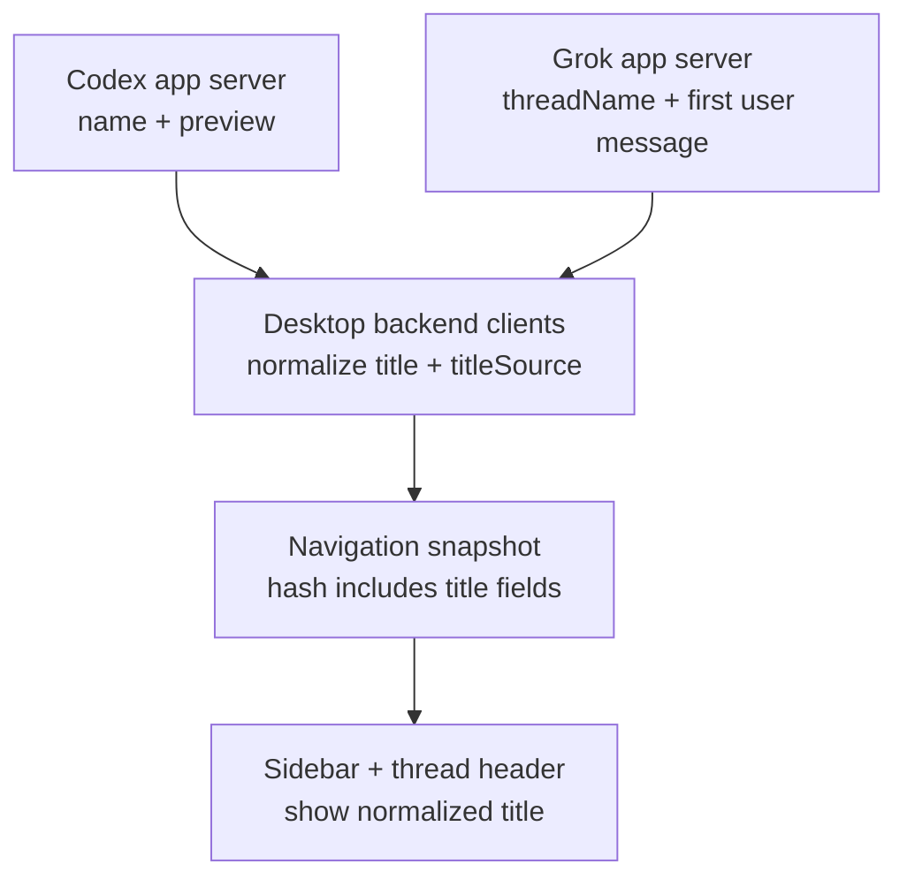

# feat: Normalize thread naming across Codex and Grok

## Overview

Make thread naming behave the way Codex actually behaves instead of the way the current desktop assumes it behaves. The desktop should show a meaningful thread title as soon as the first user turn exists, while still distinguishing between an explicit user-set name and a derived first-message title. Grok should participate in the same model so the mixed-backend sidebar does not treat Codex and Grok threads as different kinds of objects.

## Problem Frame

The desktop currently treats `title/name` as the only real thread title and treats `summary/preview` as secondary metadata. In the inspected Codex implementation, that is not how thread identity works. A fresh thread starts with no `name`, and the first durable label is the first user message, which is stored as both `first_user_message` and the initial metadata `title`. Codex only surfaces a distinct `name` when the thread is explicitly renamed. The app-server then suppresses `name` when it matches `first_user_message`, which means the default Codex thread-row label is effectively "first user message as preview," not a hidden model-generated title.

That matters for PwrAgent because the desktop currently converts Codex `preview` into `summary` and falls back to `"Untitled thread"` for `title`, so meaningful Codex threads remain visually untitled. Grok currently has the same conceptual gap in a different form: it stores an explicit `threadName` plus a synthesized summary from recent messages, but it does not separately model the first user message as the default thread label. If the product is truly thread-first, "unnamed but already has a clear derived title" needs to be a first-class state across both backends.

## Requirements Trace

- R1-R4. Threads remain first-class objects even before users attach repos or explicitly rename them; a newly started thread still needs recognizable identity.
- R5-R11. Thread lists and thread detail surfaces must show enough context to understand what a thread is at a glance.
- R20-R22. The real coding loop must feel coherent across Codex and Grok, not like two different products with different naming semantics.
- User request requirement. Determine whether Codex generates a hidden LLM naming prompt or simply derives thread identity from visible thread state, then implement parity in the correct layer.
- Compatibility requirement. Grok must participate in the same naming model so the sidebar can render mixed-backend threads consistently.

## Scope Boundaries

- In scope: desktop normalization of Codex thread metadata, Grok-side parity for explicit versus derived titles, and live refresh behavior so title changes appear promptly in the UI.
- In scope: in-memory Grok session-state changes that establish the naming contract before the parallel persistence work lands.
- In scope: notification and snapshot updates needed for title changes to propagate without relying on window focus refresh.
- Out of scope: designing a new AI-generated summarization feature for titles. The inspected Codex code does not show that behavior, so this plan does not add it.
- Out of scope: full durable Grok persistence design. This plan only defines the semantics that the separate persistence branch should preserve.
- Out of scope: adding a rename UI workflow if one does not already exist in the desktop shell.

## Context & Research

### Relevant Code and Patterns

- `/Users/huntharo/github/codex/codex-rs/app-server/tests/suite/v2/thread_start.rs` shows new Codex threads serialize `name: null` on `thread/start` and `thread/started`.
- `/Users/huntharo/github/codex/codex-rs/state/src/extract.rs` applies `EventMsg::UserMessage` by setting `first_user_message` and the initial metadata `title` from the visible user message, and only replaces that title when `EventMsg::ThreadNameUpdated` appears.
- `/Users/huntharo/github/codex/codex-rs/app-server/src/codex_message_processor.rs` uses `distinct_title()` to suppress `thread.name` when the stored title equals `first_user_message`, and otherwise attaches a title only from persisted metadata or explicit rename state.
- `/Users/huntharo/github/codex/codex-rs/app-server/tests/suite/v2/thread_name_websocket.rs` shows `thread/name/set` is an explicit metadata mutation that emits `thread/name/updated`; it is not a hidden side effect of normal turns.
- `apps/desktop/src/main/codex-app-server/client.ts` currently maps `title/name` to the desktop thread title and maps `summary/preview` to the desktop summary, which produces `"Untitled thread"` for Codex threads that only have preview-derived identity.
- `apps/desktop/src/main/grok-app-server/client.ts` currently trusts `thread.title` from the Grok server and otherwise falls back to `"Untitled thread"`.
- `packages/agent-core/src/app-server/session-state.ts` currently stores only `threadName` plus message history; it does not separately preserve a first-user-message-derived title.
- `packages/shared/src/contracts/app-server.ts` currently requires a single `title` string and has no way to tell whether that title is explicit, derived, or fallback.
- `packages/agent-core/src/domain/navigation-state.ts` hashes thread snapshots without `title` or `summary`, so metadata-only naming changes can be treated as unchanged.
- `apps/desktop/src/renderer/src/lib/useThreadNavigation.ts` refreshes on focus and optimistic thread creation, but not on metadata-affecting agent events.

### Institutional Learnings

- No relevant `docs/solutions/` artifacts exist yet for thread naming or mixed-backend title normalization in this repository.

### External References

- None beyond the inspected local Codex source tree. The open-source Codex implementation is the authoritative reference for this feature.

## Key Technical Decisions

- Treat Codex's first visible user message as a derived thread title, not as summary-only metadata. That matches the inspected Codex state and app-server code.
- Model thread title state explicitly in shared contracts with three modes: `explicit`, `derived`, and `fallback`. The desktop should display all three, but only `explicit` means the thread has been user-renamed.
- Implement Codex parity in the desktop client layer, because the Codex app server already emits the necessary inputs (`name` and `preview`) and the inspected code shows no hidden title-generation prompt to capture.
- Implement Grok parity in server/session-state semantics, because the Grok side currently owns the shape of its thread-list payloads and should converge on the same explicit-versus-derived contract.
- Refresh navigation on metadata-affecting events and include title fields in snapshot hashing. Without that, correct naming semantics still will not appear live in the UI.
- Keep explicit name and first-user-message-derived title as separate stored concepts so the parallel Grok persistence work can merge cleanly without conflating them.

## Open Questions

### Resolved During Planning

- Does Codex send a hidden synthetic prompt to name the thread? Based on the inspected open-source `codex-rs` app-server and state code, no evidence of a hidden naming prompt was found. The default label comes from the first visible user message, and explicit names come from `thread/name/set` or persisted `ThreadNameUpdated` events.
- Is the missing behavior primarily an app-server protocol catch-up or a desktop normalization bug? For Codex, it is primarily a desktop normalization bug. For Grok, it is a server-plus-client parity gap.
- Should PwrAgent wait for Grok persistence before fixing the UI behavior? No. The semantic split can ship against in-memory Grok state first, and the persistence branch can adopt the same fields afterward.

### Deferred to Implementation

- Whether the UI should visually indicate `derived` versus `explicit` title state in the thread row or thread header, beyond the internal contract field.
- Whether Grok should emit a dedicated metadata notification when the first user message establishes a derived title, or whether `turn/completed`-triggered refresh is sufficient for the first pass.
- Whether persisted overlay state should remember a local rename-draft or pinning concept later; this plan does not introduce local title overrides.

## High-Level Technical Design

> *This illustrates the intended approach and is directional guidance for review, not implementation specification. The implementing agent should treat it as context, not code to reproduce.*

| Backend state | Raw backend fields | Desktop normalized title | `titleSource` | Desktop summary |
|---|---|---|---|---|
| Fresh new thread | no explicit name, no first user message | `Untitled thread` | `fallback` | none |
| First user turn exists, no explicit rename | first user message / preview present, explicit name absent | first user message | `derived` | omit if duplicate; otherwise keep secondary preview/snippet |
| Explicit rename exists | explicit name present | explicit name | `explicit` | first user message or other secondary preview when non-duplicate |

## Implementation Units

- [x] **Unit 1: Normalize Codex thread metadata into explicit versus derived title states**

**Goal:** Stop treating Codex `preview` as summary-only metadata and instead produce the correct desktop title for Codex threads before any explicit rename exists.

**Requirements:** R1-R4, R5-R11, R20-R22

**Dependencies:** None

**Files:**
- Modify: `packages/shared/src/contracts/app-server.ts`
- Modify: `apps/desktop/src/main/codex-app-server/client.ts`
- Modify: `apps/desktop/src/main/__tests__/codex-client.test.ts`
- Test: `apps/desktop/src/main/__tests__/backend-registry.test.ts`

**Approach:**
- Extend `AppServerThreadSummary` with a lightweight title provenance field such as `titleSource`.
- In the Codex desktop client, derive `title` from `name` when present, otherwise from `preview`/`first_user_message` style fields, and fall back to `"Untitled thread"` only when neither exists.
- When the derived title and summary candidate are the same string, drop the summary so the row does not duplicate itself.
- Keep the normalizer conservative by reusing existing trimming and summary-suppression heuristics rather than blindly promoting long or noisy preview strings.

**Patterns to follow:**
- `apps/desktop/src/main/codex-app-server/client.ts`
- `/Users/huntharo/github/codex/codex-rs/state/src/extract.rs`
- `/Users/huntharo/github/codex/codex-rs/app-server/src/codex_message_processor.rs`

**Test scenarios:**
- Happy path: a Codex thread list item with `name: "Renamed thread"` returns `title: "Renamed thread"` and `titleSource: "explicit"`.
- Happy path: a Codex thread list item with no `name` but `preview: "Investigate thread naming"` returns `title: "Investigate thread naming"` and `titleSource: "derived"`.
- Edge case: a fresh Codex thread with neither `name` nor `preview` returns `title: "Untitled thread"` and `titleSource: "fallback"`.
- Edge case: when `preview` and the summary candidate are identical after normalization, the summary is omitted.
- Error path: malformed or empty list entries still normalize without throwing and keep the thread discoverable.

**Verification:**
- Codex-backed threads show a meaningful label in thread discovery immediately after the first user turn, without requiring an explicit rename.

- [x] **Unit 2: Make Grok thread state preserve explicit names and first-user-message-derived titles separately**

**Goal:** Bring Grok onto the same naming model as Codex so mixed-backend thread rows mean the same thing.

**Requirements:** R1-R4, R5-R11, R20-R22

**Dependencies:** Unit 1

**Files:**
- Modify: `packages/agent-core/src/app-server/protocol.ts`
- Modify: `packages/agent-core/src/app-server/session-state.ts`
- Modify: `packages/agent-core/src/app-server/codex-app-server.ts`
- Modify: `apps/desktop/src/main/grok-app-server/client.ts`
- Test: `packages/agent-core/src/__tests__/session-state.test.ts`
- Test: `packages/agent-core/src/__tests__/codex-app-server-contract.test.ts`
- Test: `apps/desktop/src/main/__tests__/grok-app-server-client.test.ts`

**Approach:**
- Add an internal first-user-message field to Grok session state that is populated from the earliest meaningful user text and is not overwritten by later assistant output.
- Keep explicit `threadName` as a separate field that overrides the derived title when present.
- Return list/read payloads that let the desktop normalize Grok threads with the same `titleSource` semantics as Codex.
- Emit `thread/name/updated` for explicit rename calls so Grok matches the Codex metadata update surface where practical.
- Keep the new fields local to session state and protocol DTOs so the parallel persistence work can adopt them without changing the desktop contract again.

**Patterns to follow:**
- `packages/agent-core/src/app-server/session-state.ts`
- `packages/agent-core/src/app-server/codex-app-server.ts`
- `/Users/huntharo/github/codex/codex-rs/app-server/tests/suite/v2/thread_name_websocket.rs`

**Test scenarios:**
- Happy path: after the first Grok user turn, `thread/list` returns that user text as the title with `titleSource: "derived"`.
- Happy path: after `thread/name/set`, `thread/list` returns the explicit name with `titleSource: "explicit"` and retains the original first user message separately for summary/replay use.
- Edge case: image-only or blank initial turns do not create a bogus derived title and still fall back to `"Untitled thread"`.
- Error path: renaming an unknown Grok thread continues to return a deterministic protocol error.
- Integration: `thread/read` and `thread/list` stay consistent about which value is explicit name versus derived title.

**Verification:**
- Grok and Codex threads follow the same naming rules in the desktop sidebar even before Grok persistence lands.

- [x] **Unit 3: Propagate naming changes live through desktop navigation**

**Goal:** Ensure derived or explicit title changes actually appear in the renderer without waiting for a manual refresh or window-focus event.

**Requirements:** R5-R11, R20-R22

**Dependencies:** Units 1-2

**Files:**
- Modify: `packages/shared/src/contracts/app-server.ts`
- Modify: `packages/shared/src/contracts/agent.ts`
- Modify: `packages/agent-core/src/domain/navigation-state.ts`
- Modify: `apps/desktop/src/renderer/src/lib/useThreadNavigation.ts`
- Test: `packages/agent-core/src/__tests__/refresh-reconciliation.test.ts`
- Test: `apps/desktop/src/renderer/src/__tests__/app-shell.test.tsx`
- Test: `apps/desktop/src/main/__tests__/agent-ipc.test.ts`

**Approach:**
- Extend shared notification types to include the thread metadata events the desktop actually needs to react to, especially rename-style updates; treat `turn/completed` as the fallback signal for first-message-derived title changes.
- Update navigation snapshot hashing so title, title provenance, and summary changes count as material updates.
- Subscribe `useThreadNavigation` to agent events that affect list metadata and refresh in the background while preserving current selection and optimistic rows.
- Keep refresh throttling and unchanged-snapshot fast paths intact so title correctness does not create noisy rerenders.

**Patterns to follow:**
- `apps/desktop/src/renderer/src/lib/useThreadNavigation.ts`
- `packages/agent-core/src/domain/navigation-state.ts`
- `apps/desktop/src/main/app-server/backend-registry.ts`

**Test scenarios:**
- Happy path: when a new first user turn completes, the selected thread row updates from `"Untitled thread"` to the derived title without requiring focus change.
- Happy path: when `thread/name/updated` arrives, the row and thread header update to the explicit title while keeping the same thread id and selection.
- Edge case: a metadata-only title change still produces a non-unchanged navigation snapshot.
- Edge case: unrelated turn notifications for another backend or thread do not refresh the selected thread unnecessarily.
- Integration: optimistic new-thread rows are replaced cleanly by fetched rows once the backend exposes the derived or explicit title.

**Verification:**
- Title changes become visible in the thread list and thread header during normal use, not only after a full refresh cycle.

- [x] **Unit 4: Lock the naming contract down with mixed-backend regression coverage**

**Goal:** Prevent future protocol and persistence work from regressing naming semantics, especially while Grok persistence is landing in parallel.

**Requirements:** R20-R22

**Dependencies:** Units 1-3

**Files:**
- Modify: `packages/agent-core/src/__tests__/codex-metadata-contract.test.ts`
- Modify: `packages/agent-core/src/__tests__/refresh-reconciliation.test.ts`
- Modify: `apps/desktop/src/main/__tests__/backend-registry.test.ts`
- Modify: `apps/desktop/src/renderer/src/__tests__/app-shell.test.tsx`

**Approach:**
- Add contract tests that assert Codex and Grok produce the same desktop-visible title states for fresh, derived, and explicit-name cases.
- Add reconciliation tests that prove title-only changes are treated as material snapshot changes.
- Add mixed-backend tests for duplicate thread ids so title updates do not bleed across `codex:<id>` and `grok:<id>` identities.
- Keep the tests focused on observable metadata and UI behavior so the parallel persistence branch can merge them even if storage internals change.

**Patterns to follow:**
- `packages/agent-core/src/__tests__/codex-metadata-contract.test.ts`
- `packages/agent-core/src/__tests__/refresh-reconciliation.test.ts`
- `apps/desktop/src/main/__tests__/backend-registry.test.ts`

**Test scenarios:**
- Happy path: Codex and Grok both surface the first user message as a derived title after the first turn.
- Happy path: explicit rename wins over the derived title for both backends.
- Edge case: duplicate backend ids remain isolated by `source:id` identity keys during title updates.
- Edge case: fallback `"Untitled thread"` remains only for threads with no explicit name and no usable first user message.
- Integration: renderer thread header and sidebar row stay in sync for derived and explicit titles.

**Verification:**
- The repo has regression coverage for the exact naming semantics this plan introduces, making later persistence and protocol work safer to merge.

## System-Wide Impact

- **Interaction graph:** backend payloads feed desktop backend clients, which feed navigation snapshots, which feed the sidebar and thread header. Grok session state is the local source of truth for naming semantics until persistence is added.
- **Error propagation:** malformed or missing title fields should degrade to `"Untitled thread"` instead of breaking thread discovery or selection.
- **State lifecycle risks:** derived title must be created once from the first meaningful user turn, explicit rename must override without destroying first-user-message context, and snapshot reconciliation must recognize title-only changes.
- **API surface parity:** `AppServerThreadSummary`, app-server notification unions, and Grok protocol DTOs all change together; they must stay aligned across `packages/shared`, `packages/agent-core`, and the desktop clients.
- **Integration coverage:** thread start, first turn completion, explicit rename, mixed-backend duplicate ids, and metadata-only refreshes all need end-to-end verification.
- **Unchanged invariants:** thread ids, backend identity keys, linked-directory overlay behavior, and transcript replay ordering should remain unchanged.

## Risks & Dependencies

| Risk | Mitigation |
|------|------------|
| The parallel Grok persistence branch touches the same session-state files. | Keep the semantic change small and centered on explicit-name versus first-user-message fields so the persistence branch can adopt the same field split with minimal conflict. |
| Codex preview text may sometimes be noisy or duplicate the summary. | Reuse the existing summary normalization and drop duplicate secondary text after promoting preview to derived title. |
| Title changes may still not show up because navigation treats them as unchanged. | Include title fields in snapshot hashing and cover metadata-only updates in reconciliation tests. |
| Shared notification typing may lag raw backend behavior. | Extend shared notification unions only for the metadata events the renderer truly consumes, and keep `turn/completed` as a safe fallback refresh trigger. |

## Documentation / Operational Notes

- The plan assumes the inspected local Codex source tree is representative of the open-source app-server behavior for thread naming as of 2026-04-16.
- When the separate Grok persistence work lands, it should preserve three states explicitly: explicit thread name, first meaningful user message, and fallback untitled state.
- If a future product decision adds true model-generated titles, that should be treated as a new feature with a new contract field rather than overloading `derived` to mean two different things.

## Sources & References

- **Origin document:** `docs/brainstorms/2026-04-16-thread-centric-agent-desktop-requirements.md`
- Related current-repo code: `apps/desktop/src/main/codex-app-server/client.ts`
- Related current-repo code: `apps/desktop/src/main/grok-app-server/client.ts`
- Related current-repo code: `packages/agent-core/src/app-server/session-state.ts`
- Related current-repo code: `packages/agent-core/src/domain/navigation-state.ts`
- Related Codex reference: `/Users/huntharo/github/codex/codex-rs/state/src/extract.rs`
- Related Codex reference: `/Users/huntharo/github/codex/codex-rs/app-server/src/codex_message_processor.rs`
- Related Codex reference: `/Users/huntharo/github/codex/codex-rs/app-server/tests/suite/v2/thread_start.rs`
- Related Codex reference: `/Users/huntharo/github/codex/codex-rs/app-server/tests/suite/v2/thread_name_websocket.rs`
