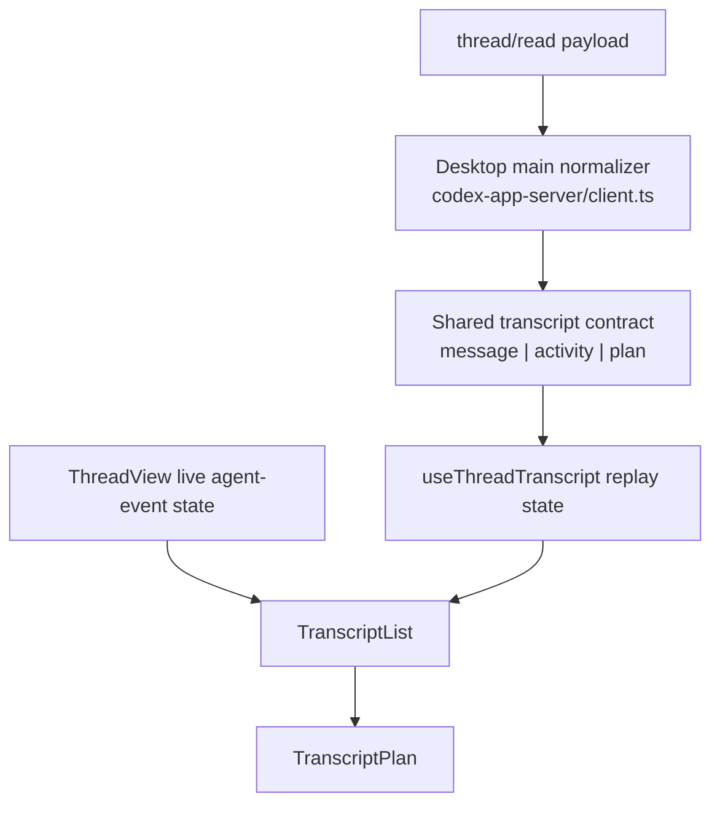

# feat: Render plan progress in the desktop thread transcript

## Overview

Add first-class transcript rendering for agent plans in the desktop app so historical replay and live updates can show the same task-list progress already present in the underlying app-server events. The immediate trigger is the Codex thread `019d99bf-f7f0-7531-99b9-850b300dde5a`, where around 2026-04-17 13:39 EDT another surface rendered a three-step task list while PwrAgent showed only ordinary transcript content.

## Problem Frame

The desktop product direction says users should be able to inspect progress and results inside the app, with the thread as the primary surface (see origin: `docs/brainstorms/2026-04-16-thread-centric-agent-desktop-requirements.md`). The protocol layer is already close to supporting that:

- `packages/shared/src/contracts/app-server.ts` already models `item/plan/delta` and `turn/plan/updated`
- `packages/agent-core/src/app-server/turn-runner.ts` already emits those notifications
- `packages/agent-core/src/app-server/session-state.ts` already persists replay items of type `plan`

The missing behavior is in the desktop client and renderer:

- `apps/desktop/src/main/codex-app-server/client.ts` only normalizes replay entries into `message` and `activity`
- `apps/desktop/src/renderer/src/features/thread-detail/TranscriptList.tsx` only renders those two entry types
- `apps/desktop/src/renderer/src/features/thread-detail/ThreadView.tsx` listens for live assistant deltas and approval requests, but not live plan updates

As a result, plan state exists on the wire but disappears before it reaches the transcript UI. The desktop app therefore fails a concrete progress-inspection use case already happening in real threads.

## Requirements Trace

- R1-R4. Threads remain first-class even when work starts before a repo is chosen; transcript progress should belong to the thread, not to a directory-specific side surface.
- R10-R11. When a thread is opened, users should see enough operational context to understand what the agent is doing.
- R22. The first milestone must let users run agent work, inspect progress, and review results inside the app.
- User requirement: when a thread contains plan/task-list progress like the example from `019d99bf-f7f0-7531-99b9-850b300dde5a`, the desktop transcript should render it instead of dropping it.
- Compatibility requirement: consume the existing app-server replay and notification surfaces rather than introducing a desktop-only task system.

## Scope Boundaries

- In scope: replay normalization for plan-bearing thread history in the desktop main process.
- In scope: live renderer updates for `turn/plan/updated` and related plan progress while a selected thread is open.
- In scope: dedicated transcript UI for plan/task-list state, including completion counts and step statuses.
- In scope: tolerant handling of both durable `plan` replay items and recognizable Codex `update_plan`-style replay shapes when they appear in `thread/read`.
- Out of scope: changing `packages/agent-core` notification semantics unless desktop integration reveals a contract gap.
- Out of scope: sidebar, inbox, or navigation changes.
- Out of scope: creating a standalone task manager, editable checklist UI, or a new authoring flow for plans.

## Context & Research

### Relevant Code and Patterns

- `packages/shared/src/contracts/app-server.ts` currently defines only two transcript entry variants: `message` and `activity`. It already carries the live plan notification types the renderer needs.
- `apps/desktop/src/main/codex-app-server/client.ts` contains the replay normalizer. `extractThreadEntries(...)` currently flushes message items and command/file activity only; everything else is ignored.
- `apps/desktop/src/renderer/src/features/thread-detail/ThreadView.tsx` is already the boundary where live `onAgentEvent` notifications are filtered by backend plus thread id and turned into transient transcript state.
- `apps/desktop/src/renderer/src/features/thread-detail/TranscriptList.tsx` is the existing chronological transcript container with scroll anchoring, pending status rendering, and entry-type dispatch.
- `apps/desktop/src/renderer/src/features/thread-detail/TranscriptActivity.tsx` is the local pattern for a compact, transcript-native non-message artifact. It is useful as a structural reference, but plan state should not be squeezed into generic activity.
- `apps/desktop/src/renderer/src/styles/app.css` is the renderer stylesheet source of truth for transcript surfaces.
- `apps/desktop/src/main/__tests__/codex-client.test.ts`, `apps/desktop/src/renderer/src/features/thread-detail/__tests__/transcript-list.test.tsx`, `apps/desktop/src/renderer/src/features/thread-detail/__tests__/thread-view.test.tsx`, and `apps/desktop/src/renderer/src/__tests__/app-shell.test.tsx` already cover the relevant replay, transcript, and live-event seams.

### Existing Protocol Evidence

- `packages/agent-core/src/__tests__/codex-turn-progress.test.ts` proves the server emits `turn/plan/updated` before terminal completion.
- `packages/agent-core/src/__tests__/codex-tool-progress.test.ts` proves replay can persist `plan` items with accumulated text.
- The existing app-server compatibility plan in `docs/plans/2026-04-16-002-feat-app-server-protocol-compatibility-plan.md` already calls out that OpenClaw reconstructs plan artifacts from `turn/plan/updated`, `item/plan/delta`, and `item/completed`.

### Institutional Learnings

- No relevant `docs/solutions/` artifacts exist yet for this area.

### External Research Decision

Skipped. The problem is local contract consumption and renderer presentation, and this repository already contains the protocol types, test coverage, and desktop patterns needed to plan the work.

## Key Technical Decisions

- Add a dedicated `plan` transcript entry type to `packages/shared/src/contracts/app-server.ts` instead of overloading `activity`. Plan progress is a first-class thread artifact with different semantics, status display, and live-update behavior.
- Normalize plan replay in the desktop main process, not in the renderer. The renderer should consume a stable transcript contract, not parse raw Codex or Grok read payloads.
- Keep live plan state at the `ThreadView` boundary beside the existing live assistant-delta and approval-request handling. That keeps backend/thread filtering in one place and avoids turning `useThreadTranscript.ts` into a second event bus.
- Render plans inline in transcript chronology rather than in a side panel. This preserves the thread-first information hierarchy and keeps progress attached to the point in the conversation where it occurred.
- Derive completion counts strictly from step statuses. Do not invent inferred completion or hide unknown states behind optimistic UI.
- Be tolerant of replay shape differences. Directionally, the desktop client should map both explicit replay items of type `plan` and recognizable `update_plan`/plan-output records into the same transcript entry when those shapes are present.
- Follow the desktop style guide: neutral surfaces, compact layout, one accent color, no nested decorative cards, and radius at or below `8px`.

## Open Questions

### Resolved During Planning

- Should plan progress be rendered as generic transcript activity? No. It needs a dedicated entry shape and component.
- Should live updates wait for a manual refresh? No. The selected thread should update immediately on `turn/plan/updated`.
- Where should plan parsing live? In the desktop main-process read normalizer, not the renderer.
- Should the feature depend on new server work first? No. Existing server-side plan notifications and replay persistence are already sufficient for a desktop follow-on.

### Deferred to Implementation

- Whether incomplete plan replay that only has freeform delta text and no structured steps should render as a draft plan card or stay hidden until a structured update arrives.
- Whether very long plans should gain a collapsed secondary state in the first pass or only after real usage shows they dominate transcript height.
- Whether `item/completed` for plan items should alter the visible plan card in addition to `turn/plan/updated`, or only remain a replay detail for parity.

## High-Level Technical Design

> This is directional guidance for review, not implementation specification.

### Compatibility Rules

- The renderer should only depend on normalized `AppServerThreadEntry` values, never on raw backend payload shapes.
- Live plan updates must be ignored unless both `backend` and `threadId` match the selected thread.
- Replay and live plan rendering should converge on one visual component so historical and in-flight states do not drift.
- Unknown or malformed plan payloads should fail soft by omission rather than corrupting the rest of the transcript.

## Phased Delivery

### Phase 1

Extend the shared desktop transcript contract and desktop read normalizer so plan-bearing replay survives `thread/read`.

### Phase 2

Add live selected-thread plan state driven by app-server notifications.

### Phase 3

Ship a dedicated transcript plan component, styling, and regression coverage for replay plus live updates.

## Implementation Units

- [x] **Unit 1: Extend transcript contracts and replay normalization for plans**

**Goal:** Preserve plan/task-list artifacts when the desktop main process converts backend thread history into transcript entries.

**Requirements:** R22, user requirement, compatibility requirement

**Dependencies:** None

**Files:**
- Modify: `packages/shared/src/contracts/app-server.ts`
- Modify: `apps/desktop/src/main/codex-app-server/client.ts`
- Test: `apps/desktop/src/main/__tests__/codex-client.test.ts`

**Approach:**
- Add a `AppServerThreadPlanEntry` type that can carry an optional explanation, ordered steps, and summary counts needed by the renderer.
- Update the desktop replay normalizer to emit `plan` entries from structured replay items when present.
- Add tolerant parsing for recognizable Codex `update_plan`-style replay data when the read payload exposes plan state through function-call artifacts instead of explicit `plan` items.
- Keep plan entries ordered within the same turn chronology as neighboring messages and activity summaries.

**Patterns to follow:**
- `apps/desktop/src/main/codex-app-server/client.ts`
- `packages/agent-core/src/__tests__/codex-turn-progress.test.ts`
- `packages/agent-core/src/__tests__/codex-tool-progress.test.ts`

**Test scenarios:**
- Happy path: `thread/read` payload with a structured `plan` item becomes a `plan` transcript entry with step statuses preserved.
- Happy path: `thread/read` payload with recognizable `update_plan` call output becomes the same `plan` transcript entry shape.
- Edge case: malformed or unrelated function-call items do not produce false-positive plan entries.
- Edge case: a turn containing message, activity, and plan artifacts preserves transcript ordering.
- Error path: unknown plan statuses or missing step text are ignored or sanitized without throwing away the rest of the thread replay.

**Verification:**
- `readThread(...)` returns replay entries that include plan artifacts instead of dropping them.

- [x] **Unit 2: Add live plan progress state for the selected thread**

**Goal:** Let the open thread update immediately when a running turn emits structured plan progress.

**Requirements:** R22, user requirement

**Dependencies:** Unit 1

**Files:**
- Modify: `apps/desktop/src/renderer/src/features/thread-detail/ThreadView.tsx`
- Modify: `apps/desktop/src/renderer/src/features/thread-detail/__tests__/thread-view.test.tsx`
- Test: `apps/desktop/src/renderer/src/__tests__/app-shell.test.tsx`

**Approach:**
- Extend the existing `onAgentEvent` handling in `ThreadView.tsx` to track the latest plan state for the selected thread.
- Listen for `turn/plan/updated` as the primary structured source of truth for live task-list progress.
- Clear or reconcile the transient live plan state on thread switches and terminal turn events so stale progress does not bleed into another thread.
- Keep the change additive and local; do not refactor message replay loading and live event handling into one large new hook in the first pass.

**Patterns to follow:**
- `apps/desktop/src/renderer/src/features/thread-detail/ThreadView.tsx`
- `apps/desktop/src/renderer/src/features/thread-detail/__tests__/thread-view.test.tsx`

**Test scenarios:**
- Happy path: `turn/plan/updated` for the selected Codex thread renders live progress without a refresh.
- Happy path: terminal completion leaves the latest visible plan intact until persisted replay catches up.
- Edge case: plan notifications for a different backend or different thread id are ignored.
- Edge case: selecting a new thread clears the previous thread's transient live plan state.
- Integration: after refresh or replay reload, the persisted plan entry replaces the transient live version without duplication.

**Verification:**
- A running turn can show evolving plan state in the thread detail view before the next manual refresh.

- [x] **Unit 3: Build the transcript-native plan card and lock down renderer regressions**

**Goal:** Present plan progress in a compact desktop transcript surface that matches the existing shell tone and remains testable.

**Requirements:** R10-R11, R22, user requirement

**Dependencies:** Units 1 and 2

**Files:**
- Create: `apps/desktop/src/renderer/src/features/thread-detail/TranscriptPlan.tsx`
- Modify: `apps/desktop/src/renderer/src/features/thread-detail/TranscriptList.tsx`
- Modify: `apps/desktop/src/renderer/src/styles/app.css`
- Test: `apps/desktop/src/renderer/src/features/thread-detail/__tests__/transcript-list.test.tsx`
- Test: `apps/desktop/src/renderer/src/__tests__/app-shell.test.tsx`

**Approach:**
- Add a dedicated `TranscriptPlan` component that renders plan title/explanation, completed-step count, and ordered step rows with stable status treatment.
- Teach `TranscriptList.tsx` to dispatch `plan` entries alongside existing message and activity entries while preserving current scroll anchoring behavior.
- Style the plan surface as transcript-native UI rather than a floating modal/card stack: compact spacing, subtle border treatment, and accent usage only for active/completed emphasis.
- Cover both replayed and live plan rendering in renderer tests so future transcript work cannot silently regress this feature.

**Patterns to follow:**
- `apps/desktop/src/renderer/src/features/thread-detail/TranscriptActivity.tsx`
- `apps/desktop/src/renderer/src/styles/app.css`
- `docs/design/desktop-style-guide.md`

**Test scenarios:**
- Happy path: a replayed plan entry renders `0 out of 3 tasks completed`-style summary plus ordered step rows.
- Happy path: step statuses map to distinct but muted visual treatments for pending, in-progress, and completed.
- Edge case: plans with explanation text but no steps still render cleanly without empty-list chrome.
- Edge case: long step text wraps without changing surrounding transcript layout.
- Edge case: transcript scroll anchoring still behaves correctly when a plan entry is appended or prepended.
- Integration: the full app shell can read a thread containing plan replay and display it in the selected thread transcript.

**Verification:**
- The desktop transcript visibly renders the same class of plan/task-list progress that other app-server consumers already show.
