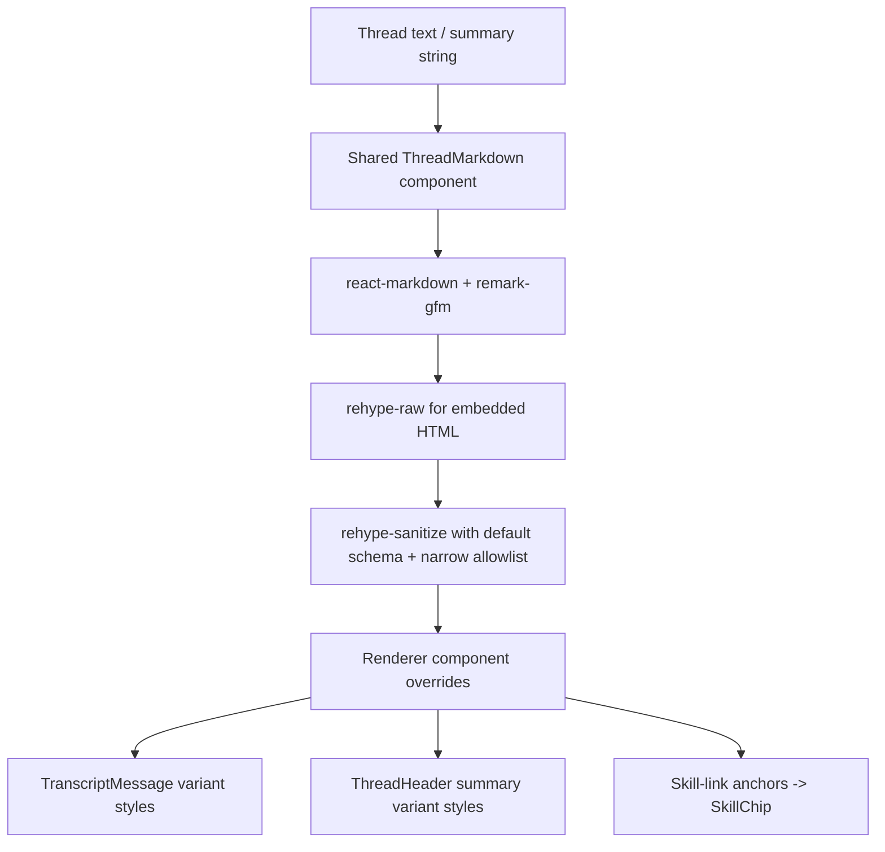

# feat: Standardize thread-detail markdown rendering

## Overview

Replace the desktop thread-detail markdown path with `react-markdown` plus `remark-gfm`, apply the same renderer to transcript messages and thread summaries, and support raw HTML only through a sanitized allowlist. The implementation should remove the hand-rolled `MarkdownText` parser from the thread-detail path, preserve existing skill-chip affordances, and keep the current desktop styling calm and compact.

## Problem Frame

Thread detail currently renders markdown inconsistently. Transcript messages go through a custom parser in `apps/desktop/src/renderer/src/features/thread-detail/MarkdownText.tsx`, which only handles a small markdown subset and misses basic constructs such as `**bold**`. Thread summaries in `apps/desktop/src/renderer/src/features/thread-detail/ThreadHeader.tsx` bypass markdown entirely and render raw text. That produces visible correctness bugs, forces the desktop app to maintain custom parsing logic, and diverges from the maintained-library approach used by comparable chat products (see origin: `docs/brainstorms/2026-04-17-thread-detail-markdown-rendering-requirements.md`).

The scoped goal is narrow: fix transcript-message and thread-summary rendering in thread detail without broad markdown standardization elsewhere in the desktop app.

## Requirements Trace

- R1-R3. Replace the custom thread-detail markdown path with `react-markdown` on transcript messages and thread summaries only.
- R4-R5. Use `remark-gfm` so standard emphasis and other GitHub-flavored markdown constructs render correctly on persisted and refreshed thread-detail content.
- R6. Preserve existing skill-chip affordances, or handle them intentionally within the new renderer path instead of falling back to the old parser.
- R7-R9. Support raw HTML only through sanitization, not by trusting backend or model output wholesale.
- R10-R11. Improve correctness while reducing maintenance burden and keeping the current desktop visual tone.

## Scope Boundaries

- In scope: thread-detail transcript messages, including live pending assistant messages that already reuse `TranscriptMessage`.
- In scope: thread-detail header summaries.
- In scope: dependency wiring, sanitizer configuration, renderer-specific styling, and renderer-focused tests for those surfaces.
- Out of scope: markdown standardization for other desktop surfaces outside thread detail.
- Out of scope: streaming-optimized markdown adoption such as `streamdown`.
- Out of scope: unsanitized raw HTML rendering from model or backend output.

## Context & Research

### Relevant Code and Patterns

- `apps/desktop/src/renderer/src/features/thread-detail/TranscriptMessage.tsx` is the main transcript-message rendering boundary and already centralizes persisted plus live assistant message rendering.
- `apps/desktop/src/renderer/src/features/thread-detail/ThreadHeader.tsx` owns thread-summary rendering and currently outputs summary text directly.
- `apps/desktop/src/renderer/src/features/thread-detail/MarkdownText.tsx` is the custom parser being replaced; its CSS contracts are already represented in `apps/desktop/src/renderer/src/styles/app.css` via classes such as `transcript-message__paragraph`, `transcript-message__list`, `transcript-message__blockquote`, and `transcript-message__link`.
- `apps/desktop/src/renderer/src/lib/skill-mentions.ts` already defines the skill-link markdown format and remains the canonical source for identifying skill mentions.
- `apps/desktop/src/renderer/src/features/thread-detail/__tests__/transcript-list.test.tsx` covers transcript rendering, live pending assistant messages, and skill-chip behavior.
- `apps/desktop/src/renderer/src/features/thread-detail/__tests__/thread-view.test.tsx` covers the thread-detail shell and thread header rendering.
- `apps/desktop/package.json` currently has no markdown-rendering dependency in the renderer bundle, so the chosen stack must be introduced here and captured in `pnpm-lock.yaml`.

### Institutional Learnings

- No `docs/solutions/` directory exists in this repo today, so there is no institutional markdown-rendering guidance to inherit.

### External References

- `react-markdown` is safe by default, supports React component overrides, and reaches GFM compliance when paired with `remark-gfm`: <https://github.com/remarkjs/react-markdown>
- `remark-gfm` adds GitHub-flavored markdown behavior such as autolinks, tables, task lists, and strikethrough: <https://github.com/remarkjs/remark-gfm>
- `rehype-raw` is the supported path for embedded HTML in markdown when React output needs actual nodes: <https://github.com/rehypejs/rehype-raw>
- `rehype-sanitize` defaults to a GitHub-style sanitation schema and is the recommended safety layer for untrusted HTML content: <https://github.com/rehypejs/rehype-sanitize>
- Comparable chat-style apps use maintained markdown stacks rather than hand-rolled parsers:
  - LibreChat uses `react-markdown` with GFM/math/highlight plugins.
  - Continue uses unified-based markdown rendering in its GUI preview pipeline.
  - LobeChat uses `react-markdown` plus `remark-gfm` for chat rendering and reserves `marked` for export-oriented paths.

## Key Technical Decisions

- Use `react-markdown` in the desktop renderer rather than extending `MarkdownText`. This directly satisfies the maintained-renderer requirement and avoids further investment in a bespoke parser.
- Use `remark-gfm` for the baseline markdown feature set. This matches user expectations around `**bold**` and other GitHub-flavored constructs without inventing app-specific markdown behavior.
- Support raw HTML with `rehype-raw` only when paired with `rehype-sanitize`. This preserves the user’s chosen HTML-support direction while keeping the trust boundary explicit.
- Start from `rehype-sanitize`’s default GitHub-style schema and widen it only if thread-detail tests prove a specific safe attribute or tag is needed. This keeps the HTML subset narrow by default.
- Preserve skill mentions by handling them inside the new markdown renderer path rather than branching back to a plain-text parser. The cleanest fit is to treat skill markdown links as anchors in the markdown AST and render matching anchors as `SkillChip` components.
- Keep thread-detail styling stable by using renderer component overrides to attach the existing transcript CSS classes instead of restyling raw HTML elements globally.
- Use one shared thread-detail markdown component for transcript messages and summaries, with lightweight variants for surface-specific wrappers and typography.

## Open Questions

### Resolved During Planning

- Should this adopt `streamdown` instead of `react-markdown`? No. The scoped work is static/history-first thread-detail rendering, not a streaming-markdown initiative, and `react-markdown` fits the current Electron/React setup with less styling overhead.
- How should skill mentions compose with the new renderer? Treat them as markdown links in the parsed output and render recognized skill links as `SkillChip` components via renderer overrides.
- Should raw HTML be fully trusted because it comes from app-server backends? No. The renderer should parse it only behind `rehype-raw` and immediately sanitize it with a defined schema.

### Deferred to Implementation

- Whether the sanitizer schema needs a narrow extension beyond the default GitHub-style allowlist for any thread-detail-specific raw HTML examples encountered in tests.
- Whether summary-specific spacing needs a dedicated wrapper class in addition to shared renderer element classes once the real rendered output is visible in tests.

## High-Level Technical Design

> *This illustrates the intended approach and is directional guidance for review, not implementation specification. The implementing agent should treat it as context, not code to reproduce.*

### Renderer Composition Rules

| Concern | Planned handling |
|---|---|
| Standard markdown and GFM | `react-markdown` with `remark-gfm` |
| Embedded raw HTML | `rehype-raw` followed immediately by `rehype-sanitize` |
| Transcript typography | Component overrides that keep existing transcript CSS classes |
| Summary typography | Same renderer with a summary-specific wrapper or class mapping |
| Skill mentions | Anchor override that recognizes skill-link markdown and renders `SkillChip` |
| Local file links | Keep the existing safe-link transform behavior within the new renderer path |

## Implementation Units

- [x] **Unit 1: Introduce the shared thread-detail markdown renderer**

**Goal:** Add the maintained markdown dependency stack and create one reusable renderer component that encapsulates GFM support, raw-HTML sanitization, link handling, and style-preserving element overrides.

**Requirements:** R1-R5, R7-R11

**Dependencies:** None

**Files:**
- Modify: `apps/desktop/package.json`
- Modify: `pnpm-lock.yaml`
- Create: `apps/desktop/src/renderer/src/features/thread-detail/ThreadMarkdown.tsx`
- Modify: `apps/desktop/src/renderer/src/styles/app.css`
- Test: `apps/desktop/src/renderer/src/features/thread-detail/__tests__/thread-markdown.test.tsx`

**Approach:**
- Add `react-markdown`, `remark-gfm`, `rehype-raw`, and `rehype-sanitize` to the desktop workspace package.
- Build a shared `ThreadMarkdown` renderer component in the thread-detail feature area so transcript messages and summaries can share one implementation without pulling markdown concerns into unrelated renderer surfaces.
- Centralize markdown-specific link normalization in the new component so existing local-file link behavior does not regress when `MarkdownText` is removed.
- Use renderer component overrides for paragraphs, headings, lists, blockquotes, inline code, fenced code blocks, and anchors so the rendered DOM keeps the current CSS contract instead of requiring a global typography reset.
- Start from `rehype-sanitize`’s default schema and make any necessary schema extension explicit in the component file, not ad hoc in consumers.

**Patterns to follow:**
- Follow the current thread-detail feature boundary used by `TranscriptMessage.tsx` and `ThreadHeader.tsx`.
- Preserve the existing CSS class contract in `apps/desktop/src/renderer/src/styles/app.css` rather than introducing one-off inline styles.
- Follow `react-markdown`’s documented component-override and plugin pipeline.

**Test scenarios:**
- Happy path: `**bold**`, inline code, blockquotes, headings, and lists render as styled React elements in the shared component.
- Happy path: GFM constructs such as strikethrough or autolink-style URLs render through `remark-gfm` as expected.
- Error path: unsafe raw HTML attributes and script-like content are stripped by the sanitizer instead of rendering through to the DOM.
- Edge case: supported raw HTML such as a simple `<em>` or `<strong>` fragment survives parsing and sanitization when it falls within the allowlist.
- Edge case: absolute local file links continue to normalize to `file://` URLs, while unsupported protocols stay inert.
- Integration: renderer component overrides attach the existing transcript-detail CSS classes so rendered DOM structure remains style-compatible.

**Verification:**
- A dedicated renderer test file proves the markdown stack, sanitizer, and style-preserving overrides work before any thread-detail consumer is migrated.

- [x] **Unit 2: Migrate transcript messages to the shared renderer and preserve skill-chip behavior**

**Goal:** Move transcript message rendering onto the shared markdown component, remove the custom parser path from transcript messages, and keep skill mentions working within the new markdown flow.

**Requirements:** R1-R6, R10-R11

**Dependencies:** Unit 1

**Files:**
- Modify: `apps/desktop/src/renderer/src/features/thread-detail/TranscriptMessage.tsx`
- Modify: `apps/desktop/src/renderer/src/lib/skill-mentions.ts`
- Delete: `apps/desktop/src/renderer/src/features/thread-detail/MarkdownText.tsx`
- Modify: `apps/desktop/src/renderer/src/features/thread-detail/__tests__/transcript-list.test.tsx`
- Test: `apps/desktop/src/renderer/src/features/thread-detail/__tests__/thread-markdown.test.tsx`

**Approach:**
- Replace the `MarkdownText` import in `TranscriptMessage.tsx` with the new shared renderer component.
- Remove the current `hasSkillMention` branch that bypasses markdown for any message containing a skill link.
- Preserve skill mention affordances by reusing the existing skill-link markdown format and recognizing those anchors inside the renderer override layer, rendering `SkillChip` where the anchor target matches a known skill path or skill-link shape.
- Keep the transcript message shell, header, role badge, and timestamp logic unchanged so the migration stays within the content-rendering boundary.
- Delete `MarkdownText.tsx` once transcript messages no longer depend on it.

**Execution note:** Start with a failing transcript-list test for bold transcript content plus a skill-link transcript message before removing the old branch.

**Patterns to follow:**
- Keep `TranscriptMessage.tsx` as the sole message-level container and move only the text-rendering concern underneath it.
- Reuse `skill-mentions.ts` as the source of truth for skill-link syntax instead of inventing a second mention parser.

**Test scenarios:**
- Happy path: a transcript message containing `**bold**` renders bold text instead of literal asterisks.
- Happy path: a live pending assistant message rendered through `TranscriptMessage` also picks up the new markdown behavior.
- Happy path: a recognized skill markdown link still renders as a `SkillChip` in the transcript.
- Edge case: a normal markdown link that is not a skill link still renders as a regular link and is not converted into a chip.
- Edge case: a message containing both markdown formatting and a skill link renders both correctly in the same transcript bubble.
- Error path: malformed or unrecognized skill-link-shaped anchors fall back to safe link rendering rather than crashing or silently dropping content.
- Integration: transcript-list regression coverage still passes for activity rows, pending status text, and live assistant messages while message rendering changes underneath.

**Verification:**
- Transcript-list coverage proves persisted messages, pending messages, and skill-link messages all render through the shared markdown path without regressing non-message transcript behavior.

- [x] **Unit 3: Migrate thread summaries and finalize thread-detail styling regressions**

**Goal:** Apply the shared markdown renderer to thread summaries, close any summary-specific spacing or typography gaps, and verify the full thread-detail surface still reads cleanly.

**Requirements:** R2-R5, R7-R10

**Dependencies:** Units 1-2

**Files:**
- Modify: `apps/desktop/src/renderer/src/features/thread-detail/ThreadHeader.tsx`
- Modify: `apps/desktop/src/renderer/src/features/thread-detail/__tests__/thread-view.test.tsx`
- Modify: `apps/desktop/src/renderer/src/styles/app.css`
- Test: `apps/desktop/src/renderer/src/features/thread-detail/__tests__/thread-markdown.test.tsx`

**Approach:**
- Replace plain-text summary rendering in `ThreadHeader.tsx` with the shared markdown renderer using the summary variant.
- Keep the thread title, backend chip, mode chip, and stats layout unchanged; only the summary content path should move.
- Add only the CSS needed to keep summary spacing and typography aligned with the current desktop style guide once markdown elements can appear inside the summary wrapper.
- Use the summary migration to verify that the sanitizer policy is applied consistently across both thread-detail surfaces called out in the requirements.

**Patterns to follow:**
- Preserve the current `ThreadHeader` ownership boundary and avoid pushing summary concerns up into `ThreadView.tsx`.
- Keep summary styling grouped with existing thread-detail CSS rather than introducing a new global markdown stylesheet.

**Test scenarios:**
- Happy path: a thread summary containing `**bold**` renders bold text in the header.
- Happy path: the same summary renderer accepts safe markdown links and formats them consistently with thread-detail styling.
- Edge case: a summary containing multiple markdown blocks keeps compact spacing and does not push the header into card-like nested framing.
- Error path: unsafe raw HTML in the summary is sanitized just as it is in transcript messages.
- Integration: the existing thread-view test coverage still proves the selected thread shell, context rail behavior, and composer affordances remain intact while summary rendering changes underneath.

**Verification:**
- Thread-header summary content renders through the same maintained markdown path as transcript messages, and thread-detail visual regressions are contained to intentional style updates.

## System-Wide Impact

- **Interaction graph:** `ThreadView` continues to own thread-detail composition, while `TranscriptMessage` and `ThreadHeader` become consumers of a new shared thread-detail markdown renderer.
- **Error propagation:** Markdown parsing and sanitization failures should stay bounded to renderer-level output and surface as safe escaped or stripped content rather than breaking the surrounding thread-detail shell.
- **State lifecycle risks:** No persistent state changes are involved, but the live pending assistant message path is implicitly affected because it already routes through `TranscriptMessage`.
- **API surface parity:** This plan intentionally does not standardize markdown rendering in other desktop surfaces; reviewers should treat that boundary as unchanged.
- **Integration coverage:** Cross-surface tests are needed because the same renderer stack will serve both transcript messages and header summaries, while also special-casing skill-link anchors.
- **Unchanged invariants:** Activity rows, pending approval UI, transcript pagination, and non-thread-detail surfaces keep their existing rendering paths.

## Risks & Dependencies

| Risk | Mitigation |
|------|------------|
| Skill-chip rendering regresses when transcript messages stop bypassing markdown | Resolve skill mentions inside renderer anchor overrides and keep transcript-list regression coverage focused on chip rendering alongside markdown formatting |
| Sanitizer configuration is too permissive or too restrictive | Start from `rehype-sanitize`’s default schema, add tests for both allowed and stripped HTML, and widen the allowlist only when a concrete safe case demands it |
| Rendered markdown elements disturb current spacing or density in the thread header | Use a summary-specific renderer variant and verify summary typography with dedicated tests plus thread-view regression coverage |
| Dependency additions create avoidable bundle or compatibility churn | Scope dependencies to `apps/desktop/package.json` only and avoid optional plugins such as math or syntax highlighting in this first pass |

## Documentation / Operational Notes

- No user-facing documentation update is required for the first pass.
- If the implementation reveals a reusable markdown pattern for other desktop surfaces, capture that later as a `docs/solutions/` entry after execution rather than broadening this plan.

## Sources & References

- **Origin document:** [docs/brainstorms/2026-04-17-thread-detail-markdown-rendering-requirements.md](/Users/huntharo/.codex/worktrees/5b80/PwrAgent/docs/brainstorms/2026-04-17-thread-detail-markdown-rendering-requirements.md)
- Related code: `apps/desktop/src/renderer/src/features/thread-detail/TranscriptMessage.tsx`
- Related code: `apps/desktop/src/renderer/src/features/thread-detail/ThreadHeader.tsx`
- Related code: `apps/desktop/src/renderer/src/lib/skill-mentions.ts`
- External docs: <https://github.com/remarkjs/react-markdown>
- External docs: <https://github.com/remarkjs/remark-gfm>
- External docs: <https://github.com/rehypejs/rehype-raw>
- External docs: <https://github.com/rehypejs/rehype-sanitize>
