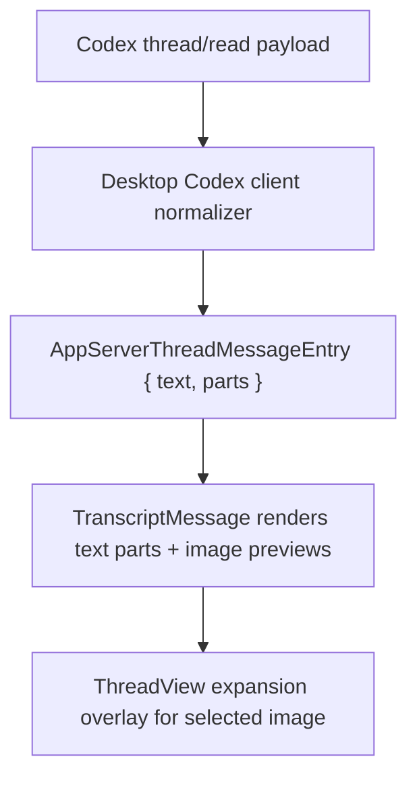

# fix: Render transcript image previews in desktop chat

## Overview

Make desktop thread transcripts render user-posted images inline and allow them to be expanded from the thread-detail surface. The immediate repro is Codex session `019d9c9a-3ea6-70e3-a65c-4844b8ca859b`, where a user image is present in the source thread but the desktop transcript shows no image at all.

## Problem Frame

The desktop transcript pipeline currently assumes every transcript message is plain text. That assumption holds in the renderer, where `TranscriptMessage` only knows how to render `message.text`, but the failure starts earlier in the main-process Codex client. `apps/desktop/src/main/codex-app-server/client.ts` flattens `thread/read` payloads through `collectMessageText()`, which only collects text-like keys and silently ignores image payloads such as `input_image` / `image_url`. If a turn is image-only, the normalized text becomes empty and the message is dropped from `extractThreadEntries()` entirely.

That produces two user-facing regressions:

- image-only user turns disappear from the transcript
- mixed text-plus-image turns lose the image, so the desktop transcript does not match the underlying thread

The desktop already has the right product surface for this fix: thread transcripts are first-class, the shared contracts already model multimodal turn input, and the thread-detail renderer owns compact, inspectable interaction patterns like diff expansion. What is missing is a transcript content model that preserves image parts through normalization and a renderer path that can preview and enlarge them without breaking existing text, skill-chip, activity, and pagination behavior.

## Requirements Trace

- R1. A transcript message with one or more image parts renders a visible inline preview instead of disappearing or collapsing to text-only output.
- R2. Image-only transcript turns still appear as messages and continue to count toward thread message totals and ordering.
- R3. Mixed text-plus-image turns preserve message order and keep existing text rendering behavior for text segments.
- R4. A user can expand a transcript image from the thread-detail surface and dismiss it without losing thread context.
- R5. Existing transcript behaviors remain intact: skill chips, markdown-like text formatting, activity cards, approval cards, refresh, and pagination.
- R6. The change is scoped to transcript read/render behavior; compose-side image attachment UI is not added by this fix.

## Scope Boundaries

- In scope: Codex `thread/read` normalization for image-bearing transcript messages, shared transcript message contract updates, inline transcript image previews, and image expansion inside thread detail.
- In scope: support for both remote image URLs and local file-backed image references once they are normalized into renderable sources.
- Out of scope: new composer UI for attaching images, drag-and-drop upload, or paste-to-attach flows.
- Out of scope: replacing the current lightweight markdown renderer with a full markdown library.
- Out of scope: generic non-image attachment rendering such as PDFs, audio, or arbitrary binary files.

## Context & Research

### Relevant Code and Patterns

- `packages/shared/src/contracts/app-server.ts` defines transcript message shapes and already exposes multimodal turn input item types, but transcript messages themselves remain text-only.
- `apps/desktop/src/main/codex-app-server/client.ts` owns Codex `thread/read` normalization through `collectText()`, `collectMessageText()`, `extractConversationMessages()`, `extractThreadEntries()`, and `extractThreadReplayFromReadResult()`.
- `apps/desktop/src/main/__tests__/codex-client.test.ts` already exercises `thread/read` normalization with realistic fixture payloads and is the natural place to pin multimodal transcript behavior.
- `apps/desktop/src/renderer/src/features/thread-detail/TranscriptMessage.tsx` is the message bubble renderer and currently assumes every message is reducible to `message.text`.
- `apps/desktop/src/renderer/src/features/thread-detail/MarkdownText.tsx` should remain the text-only renderer for text parts; this fix should not force images through the markdown parser.
- `apps/desktop/src/renderer/src/features/thread-detail/ThreadView.tsx` is the natural owner for thread-scoped expansion state because it already manages pending assistant/request state for the selected thread.
- `apps/desktop/src/renderer/src/features/thread-detail/TranscriptDiff.tsx` shows the local pattern for transcript-local expansion controls that stay compact until the user asks for detail.
- `apps/desktop/src/renderer/src/styles/app.css` already contains transcript bubble styling and should remain the single styling surface for preview and overlay states.

### Institutional Learnings

- No `docs/solutions/` artifacts exist yet for multimodal transcript rendering in this repository.
- `docs/plans/2026-04-16-001-feat-thread-centric-agent-desktop-plan.md` established the current transcript surface and its renderer boundaries.
- `docs/plans/2026-04-16-002-feat-app-server-protocol-compatibility-plan.md` already noted multimodal input shapes as part of backend compatibility work, which supports preserving image parts instead of flattening them away.

### External References

- None. The codebase already has strong local evidence for the affected surfaces, and this plan is grounded in current repo behavior rather than external framework guidance.

## Key Technical Decisions

- Preserve backward compatibility by extending transcript messages with structured `parts` rather than replacing the existing `text` field. `text` remains the textual projection for current consumers; `parts` becomes the source of truth for rich rendering.
- Normalize image parts in the desktop Codex client, not in the renderer. The main-process client already owns unknown `thread/read` payload parsing, so the renderer should receive a stable, explicit transcript shape instead of re-parsing provider-specific JSON.
- Emit image-only messages with empty textual projection rather than dropping them. Presence in the transcript is more important than forcing a placeholder string, and empty `text` is less misleading than synthetic copy.
- Keep image expansion state thread-scoped in `ThreadView` so switching threads clears the overlay naturally and the feature does not leak into app-global shell state.
- Reuse the existing compact transcript aesthetic: image previews should feel like part of the message bubble, not a separate card or gallery surface.

## Open Questions

### Resolved During Planning

- Should this fix replace `message.text` everywhere with rich content parts? No. That would create unnecessary churn across hooks and tests. A compatibility projection plus optional structured parts is the safer shape.
- Should the normalization change happen in the renderer or the desktop backend client? In the desktop backend client. Provider-specific `thread/read` payload parsing already lives there.
- Does this plan need to change Grok transcript normalization immediately? No. The current repro is Codex-backed, and the shared contract can be expanded in a backward-compatible way so Grok can adopt it later without blocking this fix.

### Deferred to Implementation

- Whether Codex `thread/read` emits any additional image metadata worth preserving beyond a renderable source and stable part ordering.
- Whether the first pass should show image dimensions or source labels in the expansion overlay, or keep the overlay intentionally minimal.
- Whether assistant-side future image outputs need separate affordances once a backend starts emitting them through the same contract.

## High-Level Technical Design

> *This illustrates the intended approach and is directional guidance for review, not implementation specification. The implementing agent should treat it as context, not code to reproduce.*

| Stage | Input shape | Normalized desktop shape | Renderer behavior |
|---|---|---|---|
| Codex `thread/read` user/assistant item with text only | `content[]` / `text` text entries | `message.text` plus `parts:[text]` | current text rendering path |
| Codex item with text and image | mixed text and image records | `message.text` plus ordered `parts:[text,image]` | text block(s) plus inline preview button |
| Codex item with image only | image record, no text | `message.text: ""` plus `parts:[image]` | image-only message bubble |

## Implementation Units

- [x] **Unit 1: Extend transcript normalization to preserve image parts**

**Goal:** Keep image-bearing Codex transcript messages in the replay instead of flattening them to text-only or dropping them outright.

**Requirements:** R1, R2, R3, R5

**Dependencies:** None

**Files:**
- Modify: `packages/shared/src/contracts/app-server.ts`
- Modify: `apps/desktop/src/main/codex-app-server/client.ts`
- Test: `apps/desktop/src/main/__tests__/codex-client.test.ts`

**Approach:**
- Add an optional structured transcript-part model to `AppServerThreadMessage` / `AppServerThreadMessageEntry`, with enough information to distinguish text parts from image parts while keeping ordering stable.
- Refactor the Codex desktop client so message extraction reads structured content arrays first and derives `message.text` from text parts instead of treating text flattening as the only representation.
- Recognize image records from the Codex `thread/read` payload shapes already adjacent to current fixtures, including remote image URLs and local file-backed image references that can be normalized to a renderable source.
- Keep activity-item extraction unchanged so file reads, commands, and diffs continue to group exactly as they do today.

**Patterns to follow:**
- `apps/desktop/src/main/codex-app-server/client.ts`
- `apps/desktop/src/main/__tests__/codex-client.test.ts`
- `packages/shared/src/contracts/app-server.ts`

**Test scenarios:**
- Happy path: a `userMessage` with ordered text and image content returns one transcript message entry with ordered text and image parts, plus the expected text projection.
- Happy path: an image-only `userMessage` still produces a message entry and appears in both `entries` and `messages` with an empty text projection.
- Edge case: a local file-backed image reference is normalized into a renderer-safe source instead of being discarded as unknown content.
- Edge case: existing text-only commentary and final assistant messages still normalize exactly as before.
- Error path: malformed image content is skipped without aborting the whole transcript read, and neighboring valid parts still render.

**Verification:**
- `readThread()` returns stable transcript entries for image-bearing Codex turns, and image-only messages no longer disappear from replay data.

- [x] **Unit 2: Render inline image previews inside transcript messages**

**Goal:** Show image parts inside transcript bubbles without regressing existing text, markdown-like formatting, or skill-chip behavior.

**Requirements:** R1, R2, R3, R5

**Dependencies:** Unit 1

**Files:**
- Modify: `apps/desktop/src/renderer/src/features/thread-detail/TranscriptMessage.tsx`
- Modify: `apps/desktop/src/renderer/src/features/thread-detail/TranscriptList.tsx`
- Modify: `apps/desktop/src/renderer/src/styles/app.css`
- Test: `apps/desktop/src/renderer/src/features/thread-detail/__tests__/transcript-list.test.tsx`

**Approach:**
- Teach `TranscriptMessage` to render ordered message parts instead of assuming a single text blob. Text parts should continue to use the current text rendering path, while image parts render as compact inline previews inside the same message bubble.
- Keep skill-chip handling compatible by applying it only to text parts that actually contain skill-mention syntax, rather than forcing the whole multimodal message through the skill-chip-only branch.
- Pass preview activation through `TranscriptList` using a narrow callback surface so the list remains responsible for ordering and scrolling, not modal state.
- Add transcript-specific preview styles that follow the desktop style guide: compact radius, neutral framing, and no gallery-card treatment.

**Patterns to follow:**
- `apps/desktop/src/renderer/src/features/thread-detail/TranscriptMessage.tsx`
- `apps/desktop/src/renderer/src/features/thread-detail/MarkdownText.tsx`
- `apps/desktop/src/renderer/src/features/thread-detail/TranscriptDiff.tsx`

**Test scenarios:**
- Happy path: a message with text then image renders the text content first and a clickable preview beneath it in the same bubble.
- Happy path: an image-only message renders a preview bubble with the correct role styling and timestamp chrome intact.
- Edge case: a message with multiple image parts preserves part ordering and exposes a separate clickable preview for each image.
- Edge case: a text part containing a skill mention still renders the skill chip while sibling image parts remain visible.
- Error path: a message with empty `text` but valid image parts does not fall back to the transcript empty state or disappear from the list.

**Verification:**
- Transcript rows visibly include image previews wherever the normalized replay contains image parts, while text-only messages continue to render unchanged.

- [x] **Unit 3: Add thread-scoped image expansion and dismissal behavior**

**Goal:** Let users enlarge transcript images from thread detail without leaving the conversation or destabilizing transcript state.

**Requirements:** R4, R5

**Dependencies:** Unit 2

**Files:**
- Create: `apps/desktop/src/renderer/src/features/thread-detail/TranscriptImageLightbox.tsx`
- Modify: `apps/desktop/src/renderer/src/features/thread-detail/ThreadView.tsx`
- Modify: `apps/desktop/src/renderer/src/features/thread-detail/TranscriptList.tsx`
- Modify: `apps/desktop/src/renderer/src/styles/app.css`
- Test: `apps/desktop/src/renderer/src/features/thread-detail/__tests__/thread-view.test.tsx`
- Test: `apps/desktop/src/renderer/src/features/thread-detail/__tests__/transcript-list.test.tsx`

**Approach:**
- Store the currently expanded transcript image in `ThreadView`, alongside other selected-thread transient UI state, and clear it when the selected thread changes.
- Render a lightweight overlay/lightbox component from `ThreadView` so expansion is scoped to the thread-detail surface rather than to individual message bubbles.
- Support mouse and keyboard dismissal paths that are standard for desktop inspection flows: explicit close control, backdrop click, and `Escape`.
- Keep pagination, scroll anchoring, and pending-message behavior unchanged by ensuring image expansion state does not mutate transcript entry identity or ordering.

**Patterns to follow:**
- `apps/desktop/src/renderer/src/features/thread-detail/ThreadView.tsx`
- `apps/desktop/src/renderer/src/features/thread-detail/TranscriptDiff.tsx`
- `apps/desktop/src/renderer/src/features/thread-detail/__tests__/thread-view.test.tsx`

**Test scenarios:**
- Happy path: clicking a transcript image preview opens the enlarged image overlay for the selected thread.
- Happy path: pressing `Escape` or activating the close control dismisses the overlay and leaves the transcript visible underneath.
- Edge case: selecting another thread clears any open image overlay instead of carrying media state across threads.
- Edge case: opening one image while another is already expanded swaps the selected image without duplicating overlays.
- Integration: prepending older transcript pages still preserves scroll position and does not break preview click targets or overlay dismissal.

**Verification:**
- Users can inspect transcript images in place, then close the enlarged view and continue reading the same thread without losing context or transcript position.

## System-Wide Impact

- **Interaction graph:** `thread/read` -> desktop backend client normalization -> shared replay contract -> `useThreadTranscript` -> `TranscriptList` / `TranscriptMessage` -> thread-scoped image overlay.
- **Error propagation:** malformed or unsupported image records should degrade by omission of that part, not by failing the entire transcript read or crashing the renderer.
- **State lifecycle risks:** image expansion state must reset on thread changes; image-only messages must retain stable ids so pagination merging and list ordering still work.
- **API surface parity:** the shared contract expansion should be backward-compatible so Grok can keep returning text-only messages until it adopts transcript parts.
- **Integration coverage:** one end-to-end fixture path should prove that a Codex `thread/read` payload with image parts survives normalization and becomes a clickable preview in the renderer.
- **Unchanged invariants:** activity grouping, approval prompts, markdown-like text rendering, optimistic text compose behavior, and transcript pagination mechanics should remain unchanged.

## Risks & Dependencies

| Risk | Mitigation |
|------|------------|
| Codex `thread/read` may emit image references in more than one shape, causing partial support or brittle parsing. | Centralize image-part normalization in one helper and cover mixed, image-only, remote, and local-file fixtures in `codex-client.test.ts`. |
| A contract change could force broad renderer churn if `text` stops being reliable for current consumers. | Keep `text` as a compatibility projection and add `parts` as optional structured data. |
| Image-only messages could regress transcript counts, empty-state logic, or optimistic dedupe assumptions. | Emit stable message ids even with empty `text`, and add renderer tests that assert message presence and message-count behavior for image-only entries. |
| Expansion UI could leak state across thread switches or interfere with transcript scrolling. | Keep the selected-image state in `ThreadView`, clear it on thread change, and cover scroll/pagination regression scenarios in renderer tests. |

## Documentation / Operational Notes

- No rollout or migration work is expected; this is a desktop-only behavior fix guarded by existing test suites.
- No user-facing docs update is required for the first pass unless the product later adds composer-side image attachment UI.

## Sources & References

- Related code: `packages/shared/src/contracts/app-server.ts`
- Related code: `apps/desktop/src/main/codex-app-server/client.ts`
- Related code: `apps/desktop/src/renderer/src/features/thread-detail/TranscriptMessage.tsx`
- Related code: `apps/desktop/src/renderer/src/features/thread-detail/ThreadView.tsx`
- Related tests: `apps/desktop/src/main/__tests__/codex-client.test.ts`
- Related tests: `apps/desktop/src/renderer/src/features/thread-detail/__tests__/transcript-list.test.tsx`
- Related tests: `apps/desktop/src/renderer/src/features/thread-detail/__tests__/thread-view.test.tsx`
- Related plan: `docs/plans/2026-04-16-001-feat-thread-centric-agent-desktop-plan.md`
- Related plan: `docs/plans/2026-04-16-002-feat-app-server-protocol-compatibility-plan.md`
