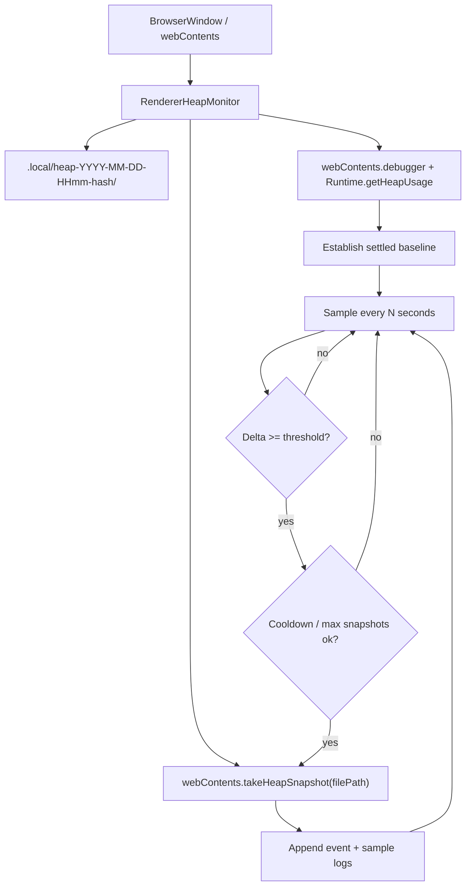

# feat: Add desktop renderer heap diagnostics

## Overview

Add an opt-in desktop diagnostics path that measures renderer memory after startup, samples it every few seconds, and automatically captures heap snapshots into a single `.local/heap-YYYY-MM-DD-HHmm-<hash>/` session directory when JavaScript heap usage jumps sharply between samples.

The first milestone is about making memory regressions diagnosable, not automatically fixing leaks. The output should be a stable artifact directory a developer can hand back for analysis.

## Problem Frame

The current desktop app has no built-in way to capture renderer heap growth over time. When the renderer OOMs, the evidence disappears with it. The user wants a repeatable way to:

- record a post-startup baseline
- sample JS heap usage every 5-10 seconds
- take heap snapshots whenever heap usage jumps by roughly 100 MB between adjacent samples
- log when and why snapshots were taken
- store every artifact for one monitoring run in a single deterministic `.local/` directory so the path can be shared for diagnosis

This needs to fit the existing Electron architecture, where window creation and `webContents` lifecycle live in the main process (`apps/desktop/src/main/window.ts`) and the renderer stays behind the preload bridge (`apps/desktop/src/preload/index.ts`).

## Requirements Trace

- R1. Capture a startup baseline after the renderer has finished loading and settled.
- R2. Sample renderer JS heap usage on a recurring interval in the 5-10 second range.
- R3. Trigger heap snapshots when JS heap usage increases by about 100 MB between consecutive samples.
- R4. Save all artifacts for one monitoring session under a single repo-local directory named like `.local/heap-YYYY-MM-DD-HHmm-<hash>/`.
- R5. Persist human-readable logs showing when monitoring started, when snapshots were triggered, and any failures or detach events.
- R6. Make the diagnostics path safe enough for repeated repro attempts by throttling snapshot frequency and bounding runaway artifact capture.
- R7. Keep the feature opt-in so normal desktop startup and production behavior do not pay for this instrumentation by default.
- R8. Preserve enough metadata in the artifact directory that a later analysis pass can identify the session, thresholds, sample history, and snapshot files without reconstructing context from memory.

## Scope Boundaries

- In scope: opt-in desktop diagnostics for the renderer process used by the main application window.
- In scope: periodic JS heap polling, threshold detection, heap snapshot capture, session-directory layout, and logging.
- In scope: test coverage for the sampling state machine, session storage, and BrowserWindow lifecycle wiring.
- Out of scope: automatic heap diff analysis or leak classification.
- Out of scope: always-on production telemetry or remote artifact upload.
- Out of scope: renderer UI for browsing or visualizing captured sessions in the first pass.
- Out of scope: fixing any specific memory regression beyond making it diagnosable.

## Context & Research

### Relevant Code and Patterns

- `apps/desktop/src/main/window.ts` owns `BrowserWindow` construction and already attaches `webContents` lifecycle listeners such as `did-fail-load`, `render-process-gone`, `console-message`, and `did-finish-load`. This is the natural place to start and stop diagnostics for the main renderer.
- `apps/desktop/src/main/index.ts` is the app bootstrap boundary and is the right place for global registration/cleanup if the diagnostics path needs process-level lifecycle hooks.
- `apps/desktop/src/shared/ipc.ts`, `apps/desktop/src/preload/index.ts`, and `apps/desktop/src/renderer/src/lib/desktop-api.ts` define the typed IPC bridge pattern if later work needs a renderer-visible status or manual trigger. The first milestone does not require new renderer UI, so this should stay optional.
- `apps/desktop/src/main/__tests__/app-bootstrap.test.ts` already mocks `BrowserWindow` creation and window lifecycle wiring, which provides a local test pattern for verifying the diagnostics bootstrap without launching a real renderer.
- `.gitignore` does not currently ignore `.local/`, so repo-local artifact output needs an explicit ignore entry before this feature starts writing snapshots.
- There is no existing `docs/solutions/` memory-diagnostics guidance in this repo.

### Institutional Learnings

- No relevant `docs/solutions/` artifacts exist yet for desktop memory diagnostics or heap snapshot capture.

### External References

- Electron `webContents` API, including `takeHeapSnapshot(filePath)` and renderer lifecycle ownership: [electronjs.org/docs/latest/api/web-contents](https://www.electronjs.org/docs/latest/api/web-contents)
- Electron `debugger` API for attaching to a `webContents` and sending Chrome DevTools Protocol commands: [electronjs.org/docs/latest/api/debugger](https://www.electronjs.org/docs/latest/api/debugger)
- Chrome DevTools Protocol `Runtime.getHeapUsage`, which returns isolate-level JS heap usage: [chromedevtools.github.io/devtools-protocol/v8/Runtime/#method-getHeapUsage](https://chromedevtools.github.io/devtools-protocol/v8/Runtime/#method-getHeapUsage)
- Electron `process` memory APIs, useful as secondary context or future extensions: [electronjs.org/docs/latest/api/process](https://www.electronjs.org/docs/latest/api/process)

## Key Technical Decisions

- Make the diagnostics path **main-process-owned and opt-in**, enabled by a desktop-specific environment flag rather than always running. This keeps normal app behavior unchanged and lets the main process own artifact writing to `.local/`.
- Use `webContents.debugger` plus Chrome DevTools Protocol `Runtime.getHeapUsage` for recurring JS heap samples. This gives the metric the user asked for: actual JavaScript heap usage in bytes, not just coarse OS process memory.
- Use `webContents.takeHeapSnapshot(filePath)` for snapshot capture instead of implementing raw `HeapProfiler.addHeapSnapshotChunk` streaming. The built-in Electron API already writes snapshot files directly to disk and keeps the implementation smaller.
- Store artifacts in an append-friendly session layout under `.local/heap-YYYY-MM-DD-HHmm-<hash>/` with:
  - `session.json` for metadata and thresholds
  - `samples.ndjson` for timestamped heap samples
  - `events.ndjson` for trigger, failure, attach, detach, and shutdown events
  - `heap-0001.heapsnapshot`, `heap-0002.heapsnapshot`, etc. for captured snapshots
- Treat the trigger condition as **adjacent-sample delta** rather than “growth from startup baseline.” This matches the user’s request to react to any 100 MB jump between two deltas and reduces false positives after slow, intentional growth.
- Add snapshot cooldown and session caps as first-class behavior. Heap snapshots are expensive and can worsen memory pressure, so the monitor should not capture unbounded snapshots on every sample once a leak has gone pathological.
- Keep diagnostics logging in both the app console and the session directory. Console output makes the feature visible during a repro run; the on-disk event log survives crashes and gives later analysis stable timestamps.

## Open Questions

### Resolved During Planning

- **Where should the monitor live?** In the main process, attached to the main `BrowserWindow` / `webContents` lifecycle in `apps/desktop/src/main/window.ts`.
- **How should JS heap usage be sampled?** Via `webContents.debugger.sendCommand("Runtime.getHeapUsage")`, because it returns isolate-level heap usage without requiring renderer UI changes.
- **How should snapshots be written?** Via `webContents.takeHeapSnapshot(filePath)` into a per-session `.local/` directory.
- **Should this always run?** No. The first version should be opt-in through a diagnostics-specific environment toggle so the normal desktop app stays quiet and cheap.
- **Should artifacts be crash-tolerant?** Yes. Use append-only NDJSON logs and per-snapshot files so a renderer crash still leaves partial evidence behind.

### Deferred to Implementation

- The exact environment variable names and default values for interval, settle delay, delta threshold, cooldown, and maximum snapshot count.
- Whether secondary process-memory metrics should be recorded in the first pass alongside JS heap usage or deferred until the JS-heap path is working.
- Whether a follow-up should expose the active diagnostics session path through the preload bridge or keep the feature console/file driven only.

## High-Level Technical Design

> *This illustrates the intended approach and is directional guidance for review, not implementation specification. The implementing agent should treat it as context, not code to reproduce.*



## Implementation Units

- [x] **Unit 1: Add session storage and diagnostics configuration primitives**

**Goal:** Define the local artifact layout, session identifier format, repo-local output path, and configuration values that the monitor will use.

**Requirements:** R4, R5, R6, R7, R8

**Dependencies:** None

**Files:**
- Modify: `.gitignore`
- Create: `apps/desktop/src/main/diagnostics/heap-session.ts`
- Create: `apps/desktop/src/main/diagnostics/heap-monitor-config.ts`
- Test: `apps/desktop/src/main/__tests__/heap-session.test.ts`

**Approach:**
- Add `.local/` to `.gitignore` so captured snapshots never appear as accidental repo changes.
- Create a small main-process diagnostics module responsible for:
  - determining whether diagnostics are enabled
  - generating a session id and directory name
  - creating the session directory under repo root
  - writing `session.json`
  - appending structured sample and event logs
- Standardize the directory naming contract the user requested: `.local/heap-YYYY-MM-DD-HHmm-<hash>/`.
- Keep the artifact writer append-only so partially completed sessions remain usable after renderer crashes.
- Include enough session metadata in `session.json` to make later diagnosis portable: created-at timestamp, threshold, interval, settle delay, app versions, and snapshot filenames written during the run.

**Execution note:** Start with unit tests around naming, output-root resolution, and append-only log writing before wiring live BrowserWindow behavior.

**Patterns to follow:**
- Follow the existing main-process module structure under `apps/desktop/src/main/`.
- Mirror the repo’s existing main-process test style from `apps/desktop/src/main/__tests__/app-bootstrap.test.ts`.

**Test scenarios:**
- Happy path: enabling diagnostics creates exactly one session directory under `.local/` with a timestamp-plus-hash name and a `session.json` manifest.
- Happy path: appending multiple samples/events preserves valid NDJSON ordering without truncating prior entries.
- Edge case: when diagnostics are disabled, the config layer returns a clean “off” state and does not create `.local/` output.
- Edge case: when `.local/` does not yet exist, the session writer creates the required directory structure.
- Error path: a filesystem write failure is surfaced to the caller as a typed failure result instead of crashing the app bootstrap path.

**Verification:**
- A developer can enable the feature and immediately see a predictable, ignored session directory appear under `.local/` with metadata and appendable log files.

- [x] **Unit 2: Implement renderer heap polling, delta detection, and snapshot capture**

**Goal:** Build the state machine that establishes a settled baseline, samples JS heap usage on an interval, detects sharp adjacent-sample growth, and captures heap snapshots with throttling.

**Requirements:** R1, R2, R3, R5, R6, R8

**Dependencies:** Unit 1

**Files:**
- Create: `apps/desktop/src/main/diagnostics/renderer-heap-monitor.ts`
- Modify: `apps/desktop/src/main/diagnostics/heap-session.ts`
- Test: `apps/desktop/src/main/__tests__/renderer-heap-monitor.test.ts`

**Approach:**
- Build a `RendererHeapMonitor` that accepts a target `webContents`, a session writer, and resolved config.
- On start:
  - attach `webContents.debugger`
  - wait for a short settle period after `did-finish-load`
  - record the initial baseline sample
- On each interval:
  - request `Runtime.getHeapUsage`
  - append the sample to `samples.ndjson`
  - compare the current `usedSize` to the previous sample
  - if the delta crosses the configured threshold, record a trigger event and capture `webContents.takeHeapSnapshot(...)`
- Include first-pass safeguards:
  - only one snapshot in flight at a time
  - cooldown between snapshots
  - maximum snapshots per session
  - explicit event logging when snapshotting is skipped due to cooldown or caps
- Handle debugger lifecycle explicitly. If Electron detaches the debugger, log the reason, pause JS heap polling, and avoid crashing the window. This is especially important because invoking DevTools can terminate the debugger session.
- Keep the monitor focused on capture, not diagnosis. It should not try to diff snapshots or guess leak roots.

**Technical design:** *(directional guidance, not implementation specification)*

```text
state = idle -> settling -> monitoring -> paused(detached) -> stopped

on sample:
  sample = getHeapUsage()
  write sample
  if previousSample exists and sample.usedSize - previousSample.usedSize >= threshold:
    if no snapshot in flight and cooldown satisfied and snapshotCount < maxSnapshots:
      log trigger event
      takeHeapSnapshot()
      log snapshot-complete or snapshot-failed event
```

**Patterns to follow:**
- Follow Electron’s `webContents` event ownership pattern already used in `apps/desktop/src/main/window.ts`.
- Keep async command handling promise-based and explicit, matching the style used in main-process IPC modules.

**Test scenarios:**
- Happy path: after the settle period, the monitor records a baseline sample and recurring follow-up samples at the configured interval.
- Happy path: a sample-to-sample increase over the threshold triggers one heap snapshot file and a matching trigger event.
- Happy path: a second threshold crossing after cooldown creates a second numbered snapshot in the same session directory.
- Edge case: a large total increase spread across many smaller deltas does not trigger snapshots when no adjacent delta crosses the threshold.
- Edge case: when a snapshot is already in flight, the monitor logs a skipped trigger instead of starting another snapshot concurrently.
- Edge case: after the session reaches its snapshot cap, further threshold crossings are logged but do not create more snapshots.
- Error path: `Runtime.getHeapUsage` failure logs an error event and keeps the monitor from crashing the window process.
- Error path: debugger detachment logs the detach reason and suspends monitoring cleanly.
- Integration: a snapshot trigger produces both the `.heapsnapshot` file and matching `events.ndjson` entries with timestamps and filenames.

**Verification:**
- With diagnostics enabled, a developer can reproduce heap growth and find timestamped samples, trigger events, and numbered heap snapshots in one session directory.

- [x] **Unit 3: Wire the monitor into desktop startup and document the repro workflow**

**Goal:** Attach the monitor to the app’s main renderer lifecycle, stop it cleanly, and document how developers use the captured artifact directory.

**Requirements:** R1, R4, R5, R7, R8

**Dependencies:** Units 1-2

**Files:**
- Modify: `apps/desktop/src/main/window.ts`
- Modify: `apps/desktop/src/main/index.ts`
- Modify: `apps/desktop/src/main/__tests__/app-bootstrap.test.ts`
- Modify: `README.md`
- Test: `apps/desktop/src/main/__tests__/app-bootstrap.test.ts`

**Approach:**
- Start the monitor only when diagnostics are enabled and the main window’s renderer has finished loading.
- Log the session directory path once at monitor startup so developers can immediately find the artifact root during a repro run.
- Stop the monitor cleanly on relevant lifecycle boundaries such as window close, app quit, and `render-process-gone`.
- Keep the first version console/file driven. Do not add renderer UI unless the implementation proves that developers cannot reliably discover the session path from logs alone.
- Document the developer workflow at a lightweight level:
  - how diagnostics are enabled
  - where session directories are written
  - what files to expect inside the directory
  - how to share the resulting path for later analysis

**Patterns to follow:**
- Reuse the existing BrowserWindow bootstrap and event wiring in `apps/desktop/src/main/window.ts`.
- Follow the repo’s existing README style rather than inventing a separate diagnostics guide for the first pass.

**Test scenarios:**
- Happy path: when diagnostics are enabled, window creation starts the monitor after renderer load and logs the session directory path.
- Happy path: when diagnostics are disabled, the window boot path remains unchanged and no diagnostics session is created.
- Edge case: renderer crash or `render-process-gone` stops monitoring and records a terminal event instead of leaving the monitor active.
- Edge case: app shutdown disposes the monitor without throwing when no session was ever started.
- Integration: the app bootstrap test proves diagnostics wiring composes with existing window creation rather than replacing it.

**Verification:**
- A developer can enable diagnostics, reproduce a memory problem, and walk away with a single `.local/heap-.../` path that contains the sample history, event log, and any snapshots taken during the run.

## System-Wide Impact

- **Interaction graph:** main-process window lifecycle gains a diagnostics sidecar; no thread, transcript, or provider contract changes are required in the first pass.
- **Error propagation:** diagnostics failures should be logged and isolated; they must not take down normal renderer startup or thread browsing behavior.
- **State lifecycle risks:** incomplete sessions are expected when the renderer crashes, so logs and snapshot files must remain useful without a graceful shutdown step.
- **API surface parity:** the first pass deliberately avoids a new preload or renderer-facing diagnostics API unless implementation proves it is necessary.
- **Integration coverage:** window lifecycle wiring and debugger detach behavior need coverage because unit tests of the state machine alone will not prove safe startup/shutdown composition.
- **Unchanged invariants:** desktop thread navigation, transcript rendering, and app-server IPC behavior should remain unchanged when diagnostics are off.

## Risks & Dependencies

| Risk | Mitigation |
|------|------------|
| Snapshot capture increases memory pressure and makes the repro worse | Add cooldown, max snapshot count, and single-snapshot-in-flight behavior from the first implementation unit |
| `webContents.debugger` is detached when DevTools is opened | Log detach events explicitly, pause monitoring cleanly, and document that this diagnostics mode expects exclusive ownership of the debugger transport |
| `.local/` output grows without bound during repeated repro attempts | Scope output to one session directory per run and document manual cleanup expectations; cap snapshots per session |
| Filesystem writes fail during an already unstable memory incident | Keep writes append-only, log failures, and isolate diagnostics errors so they do not crash the app |
| The monitor proves too noisy or expensive in normal usage | Keep the feature opt-in behind diagnostics configuration rather than always on |

## Documentation / Operational Notes

- Add a short README section for enabling diagnostics and locating `.local/heap-.../` session directories.
- Prefer a simple session layout over compression or upload in the first pass; the immediate goal is “artifact path I can hand back for diagnosis.”
- If this proves useful, a follow-up can add a lightweight renderer status surface or offline analysis helper, but neither should block the first artifact-capture version.

## Sources & References

- Related code: `apps/desktop/src/main/window.ts`
- Related code: `apps/desktop/src/main/index.ts`
- Related code: `apps/desktop/src/preload/index.ts`
- Related code: `apps/desktop/src/shared/ipc.ts`
- Related code: `apps/desktop/src/main/__tests__/app-bootstrap.test.ts`
- External docs: [Electron webContents](https://www.electronjs.org/docs/latest/api/web-contents)
- External docs: [Electron debugger](https://www.electronjs.org/docs/latest/api/debugger)
- External docs: [Chrome DevTools Protocol Runtime.getHeapUsage](https://chromedevtools.github.io/devtools-protocol/v8/Runtime/#method-getHeapUsage)
- External docs: [Electron process API](https://www.electronjs.org/docs/latest/api/process)
