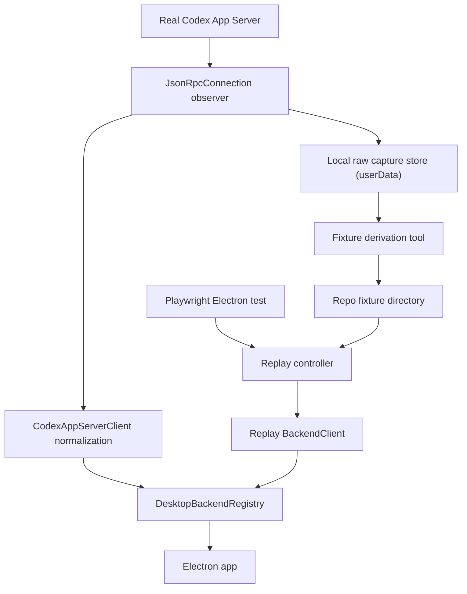
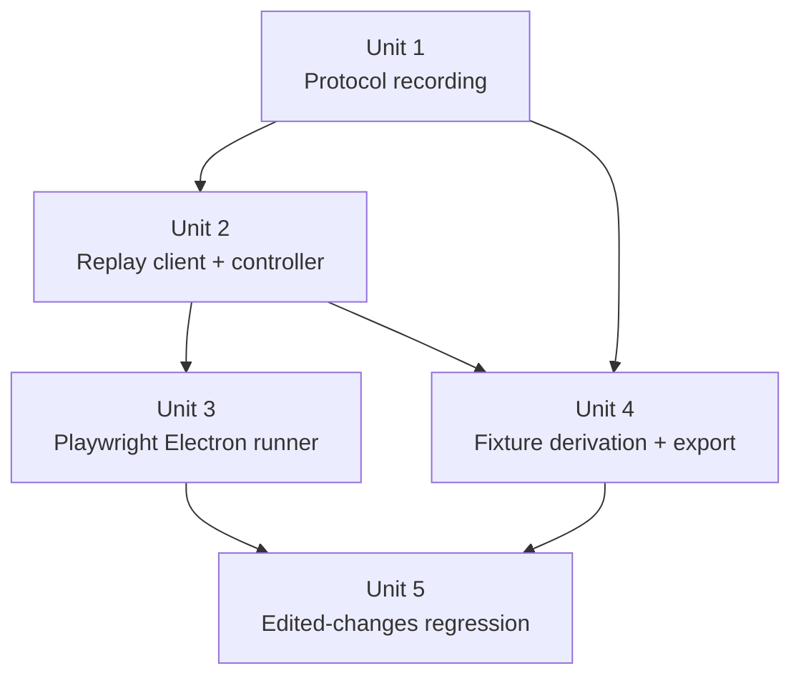

# feat: Desktop replay harness for integration testing

## Overview

Add a desktop integration testing pattern that can record real Codex App Server traffic at the desktop client boundary, derive curated replay fixtures from those recordings, and drive the real Electron app under Playwright through a deterministic step-gated replay backend. The first proof is an end-to-end regression for the edited-changes ordering bug, but the framework is intentionally shaped to support a larger suite of replay-backed desktop regressions.

## Problem Frame

The current desktop test surface is split between renderer tests that stub `window.pwragnt` and main-process tests that mock JSON-RPC payloads. That gives decent local confidence, but it does not prove the actual Electron app behaves correctly when fed the real Codex App Server protocol stream. The result is that bugs tied to message ordering, approval requests, unknown notifications, and transcript rendering are still discovered manually in live sessions.

The origin requirements document defines the desired product shape: record what the desktop client actually sees, keep raw captures as evidence, replay derived scripted fixtures deterministically, and use Playwright-driven Electron tests as the first real consumer (see origin: `docs/brainstorms/2026-04-18-desktop-integration-test-replay-harness-requirements.md`).

## Requirements Trace

- R1-R5. Recording happens at the desktop Codex client boundary, preserves full protocol traffic, and supports an immediate "record from now" workflow.
- R6. A later session-id export path must work from local desktop-side artifacts when available and fail clearly when they are not.
- R7-R12. Tests consume derived scripted fixtures through a step-gated replay harness that can surface pending server requests and apply controlled mutations.
- R13-R16. The first end-to-end consumer is Playwright + Electron, and the first proof locks down the edited-changes ordering regression while keeping the framework reusable for broader desktop behavior coverage.
- R17-R19. Raw captures remain source artifacts, curated fixtures stay traceable back to them, and replay prioritizes determinism over original timing.

## Scope Boundaries

- In scope: Codex-side protocol recording, replay backend integration for the desktop app, fixture derivation tooling, Playwright Electron setup, and the first edited-changes regression.
- In scope: test-only control surfaces needed to advance replay, answer pending server requests, and inject protocol mutations during Playwright tests.
- Out of scope: reconstructing arbitrary historical Codex sessions that were never recorded by the desktop app.
- Out of scope: replacing existing renderer and main-process Vitest coverage; this work adds an integration layer above them.
- Out of scope: reproducing original wall-clock timing or animation cadence unless a later regression proves that timing fidelity is required.

## Context & Research

### Relevant Code and Patterns

- `apps/desktop/src/main/codex-app-server/client.ts` already centralizes Codex JSON-RPC handling, known-notification filtering, and inbound request handling. This is the narrowest stable client-boundary seam for recording real Codex traffic.
- `apps/desktop/src/main/codex-app-server/json-rpc.ts` owns raw JSON-RPC send/receive behavior and request correlation. It is the cleanest place to observe outbound requests, inbound responses, inbound notifications, and inbound requests before app-specific normalization.
- `apps/desktop/src/main/app-server/backend-registry.ts` already routes desktop behavior through injected backend clients and keeps pending request bookkeeping. Its constructor accepts client overrides, which makes it the right insertion point for a replay backend in test mode.
- `apps/desktop/src/main/index.ts`, `apps/desktop/src/main/window.ts`, and `apps/desktop/src/preload/index.ts` define the actual Electron boot path. The renderer already loads from built files when `ELECTRON_RENDERER_URL` is absent, which makes packaged-style Playwright launches simpler than coordinating a dev server.
- `apps/desktop/src/renderer/src/__tests__/app-shell.test.tsx`, `apps/desktop/src/renderer/src/features/thread-detail/__tests__/transcript-list.test.tsx`, and `apps/desktop/src/renderer/src/features/thread-detail/__tests__/thread-view.test.tsx` show the current UI assertions to preserve, especially diff expansion and transcript ordering behavior.
- `packages/agent-core/src/testing/test-harness.ts` is the strongest local harness pattern to mirror: a focused fake provider, captured notifications and requests, and direct control over pending interactions.
- `packages/agent-core/src/persistence/grok-rollout-store.ts` is the closest local persistence pattern for append-only JSONL session artifacts. It should inform capture storage shape, not be copied wholesale.

### Institutional Learnings

- No `docs/solutions/` artifacts currently exist for this topic.

### External References

- Electron’s automated testing guide recommends Playwright’s `_electron.launch` flow for Electron development-mode E2E tests and shows direct access to the main process and first BrowserWindow: [Electron automated testing](https://www.electronjs.org/docs/latest/tutorial/automated-testing)
- Playwright’s Electron API documents `_electron.launch`, `electronApp.evaluate`, `firstWindow`, launch `env`, and artifact directories, which map directly onto a replay-enabled Electron harness: [Playwright Electron API](https://playwright.dev/docs/api/class-electron)
- Playwright’s best-practice guidance recommends isolated tests, user-visible assertions, resilient locators, and traces for CI debugging rather than leaning on implementation details: [Playwright best practices](https://playwright.dev/docs/best-practices)

## Key Technical Decisions

- Record at the JSON-RPC connection seam rather than deeper inside renderer IPC or farther out in the server process. This satisfies R1-R4 with the least distortion because the recorder sees the same envelopes the desktop client actually consumed and emitted.
- Start "record from now" at desktop app launch when recording mode is enabled, then index the capture by backend and any thread ids observed during the session. This removes the need to guess the true start of a session after the fact and answers the user’s initialization concern without server changes.
- Treat raw captures and replay fixtures as separate artifacts. Raw captures are append-only evidence stored outside the repo by default; curated fixture directories checked into the repo contain a sanitized raw capture copy plus a smaller replay script for the specific regression.
- Use a replay backend that implements the same `BackendClient` contract as the real desktop clients and plugs into `DesktopBackendRegistry`. This keeps the Electron shell, preload bridge, IPC handlers, navigation hooks, and transcript rendering on the real code path.
- Express replay fixtures as JSON scripts with named steps and explicit checkpoints, while keeping fault injection outside the canonical fixture via test-supplied step overrides keyed by step id. This keeps fixtures readable and diffable without giving up mutation support.
- Launch Playwright against the built Electron main entry and file-backed renderer instead of a live `electron-vite` dev server. That reduces coordination risk in CI and keeps the harness closer to the shipped app boot path.
- Scope the first version of session-id export to recorder-produced local capture directories, with best-effort metadata discovery from existing local artifacts such as rollout paths when present. If a requested session was never recorded locally, the export command must fail clearly rather than fabricate a partial protocol history.

## Open Questions

### Resolved During Planning

- How should recording start? Enable it explicitly at desktop app launch via a test or debug mode and capture the entire client-side session from the first `initialize` onward.
- What should the replay fixture format be? A normalized JSON script with metadata, initial context, ordered steps, and named checkpoints, paired with a sanitized raw JSONL capture.
- How should fault injection work without making fixtures unreadable? Keep the canonical fixture honest and apply optional step-targeted overrides from the Playwright test harness.
- How should Playwright launch the app? Build the desktop app first and launch the compiled Electron main entry with replay-mode environment variables rather than coordinating a dev server.

### Deferred to Implementation

- The exact JSON field names for the capture and replay artifacts should be finalized when the first derivation tool is written and reviewed against a real session capture.
- The degree of redaction automation needed during fixture derivation should be finalized after inspecting the first real raw capture from a Codex session.
- Whether replay control is exposed through a dedicated main-process test driver module or a thinner global helper can stay open as long as production renderer APIs remain unchanged.

## High-Level Technical Design

> *This illustrates the intended approach and is directional guidance for review, not implementation specification. The implementing agent should treat it as context, not code to reproduce.*



Directional replay fixture shape:

```json
{
  "metadata": {
    "backend": "codex",
    "sourceCaptureId": "2026-04-18T14-22-11Z-codex",
    "threadId": "thread-123",
    "scenario": "edited-changes-order"
  },
  "initialState": {
    "selectedThread": "codex:thread-123"
  },
  "steps": [
    {
      "id": "read-thread",
      "kind": "response",
      "method": "thread/read",
      "result": {}
    },
    {
      "id": "delta-1",
      "kind": "notification",
      "method": "item/agentMessage/delta",
      "params": {}
    },
    {
      "id": "approval-1",
      "kind": "request",
      "method": "turn/requestApproval",
      "params": {}
    }
  ]
}
```

## Implementation Units



- [x] **Unit 1: Add client-boundary protocol recording and local capture storage**

**Goal:** Capture raw Codex JSON-RPC traffic as the desktop client sees it, without changing normal desktop behavior.

**Requirements:** R1, R2, R3, R4, R5, R17, R19

**Dependencies:** None

**Files:**
- Create: `apps/desktop/src/main/testing/protocol-capture.ts`
- Create: `apps/desktop/src/main/testing/capture-store.ts`
- Modify: `apps/desktop/src/main/codex-app-server/json-rpc.ts`
- Modify: `apps/desktop/src/main/codex-app-server/client.ts`
- Modify: `apps/desktop/src/main/index.ts`
- Test: `apps/desktop/src/main/__tests__/protocol-capture.test.ts`
- Test: `apps/desktop/src/main/__tests__/codex-client-recording.test.ts`

**Approach:**
- Add an observer interface at the JSON-RPC connection layer so every outbound envelope and inbound envelope can be captured with a stable sequence number, raw JSON payload, parsed method or id, direction, and correlation metadata.
- Keep recording opt-in via environment or launch configuration so normal app usage stays unchanged.
- Store local captures under an app-owned directory derived from Electron user data, with one capture session per app launch and a lightweight index that can later be queried by backend and observed thread ids.
- Record unknown notifications and inbound requests exactly as received; logging and normalization can remain selective, but capture must not be selective.

**Execution note:** Start with failing main-process tests that prove unknown notifications and inbound requests are preserved even when the current client treats them as unhandled.

**Patterns to follow:**
- `apps/desktop/src/main/codex-app-server/json-rpc.ts`
- `apps/desktop/src/main/codex-app-server/client.ts`
- `packages/agent-core/src/persistence/grok-rollout-store.ts`

**Test scenarios:**
- Happy path: when recording mode is enabled, an outbound request and matching inbound response are appended to the same raw capture with stable ordering and request id correlation.
- Happy path: inbound notifications and inbound requests are captured even when the desktop client has no specialized handling for their method.
- Edge case: multiple notifications arriving between a request and its response preserve raw order in the capture output.
- Error path: malformed inbound JSON is ignored by the connection without corrupting the current capture file.
- Error path: when recording mode is disabled, the desktop client behaves as it does today and no capture artifacts are written.
- Integration: a real `CodexAppServerClient` instance configured with a mocked transport records initialize, request, notification, and inbound request traffic without changing listener behavior.

**Verification:**
- Launching the desktop app in record mode produces a local raw capture that can be matched back to the observed backend and thread ids, and turning recording off restores current behavior with no capture output.

- [x] **Unit 2: Add replay fixture types, controller, and registry-backed replay client**

**Goal:** Replay curated protocol scripts through the real desktop backend registry with explicit test-controlled progression.

**Requirements:** R7, R8, R9, R10, R11, R12, R15, R16, R18, R19

**Dependencies:** Unit 1

**Files:**
- Create: `apps/desktop/src/main/testing/replay-fixture.ts`
- Create: `apps/desktop/src/main/testing/replay-controller.ts`
- Create: `apps/desktop/src/main/testing/replay-client.ts`
- Modify: `apps/desktop/src/main/app-server/backend-registry.ts`
- Modify: `apps/desktop/src/main/index.ts`
- Test: `apps/desktop/src/main/__tests__/replay-client.test.ts`
- Test: `apps/desktop/src/main/__tests__/backend-registry-replay.test.ts`

**Approach:**
- Define a replay fixture contract that models initial backend state plus ordered scripted steps for responses, notifications, and inbound requests.
- Implement a replay controller that owns fixture loading, step advancement, pending-request bookkeeping, and optional step overrides for fault injection.
- Implement a `ReplayClient` that satisfies the existing `BackendClient` shape and emits the same notifications and pending request callbacks `DesktopBackendRegistry` already expects from real clients.
- Gate replay mode at app startup so Electron tests can swap the real Codex client for the replay client without changing renderer code or the preload bridge.
- Keep fault injection readable by applying overrides keyed by step id at replay time instead of baking synthetic corruption into the canonical fixture.

**Execution note:** Implement new replay behavior test-first at the main-process layer before wiring it into Electron boot.

**Technical design:** *(directional guidance, not implementation specification)* The replay controller should behave like a deterministic queue with three core commands: `loadFixture`, `advance(stepId?)`, and `respondToPendingRequest(requestId, response, overrides?)`. The controller owns state transitions; `ReplayClient` remains a thin adapter that translates those transitions into the existing backend listener contract.

**Patterns to follow:**
- `apps/desktop/src/main/app-server/backend-registry.ts`
- `packages/agent-core/src/testing/test-harness.ts`
- `packages/shared/src/contracts/app-server.ts`

**Test scenarios:**
- Happy path: loading a fixture and advancing one step emits the next scripted notification to registry listeners without skipping ahead.
- Happy path: replaying a scripted inbound server request blocks further advancement until the test submits a response through the controller.
- Edge case: advancing past the end of the fixture returns a stable terminal result instead of emitting duplicate events.
- Edge case: a fixture step override replaces one step’s payload without mutating the original fixture object.
- Error path: attempting to answer a request id that is not currently pending fails with a deterministic error.
- Error path: fixture validation rejects unknown step kinds or missing required method or payload fields before replay starts.
- Integration: `DesktopBackendRegistry` in replay mode routes notifications, pending requests, and `submitServerRequest` through the replay client with the same event surface used by the real clients.

**Verification:**
- The desktop main process can boot in replay mode, load a fixture, advance scripted steps deterministically, and complete a pending request round-trip without touching the renderer implementation.

- [x] **Unit 3: Add Playwright Electron runner and main-process replay driver**

**Goal:** Run the real Electron app under Playwright with replay-mode control and stable test ergonomics.

**Requirements:** R9, R11, R13, R15, R16, R19

**Dependencies:** Unit 2

**Files:**
- Create: `apps/desktop/playwright.config.ts`
- Create: `apps/desktop/e2e/fixtures/electron-app.ts`
- Create: `apps/desktop/e2e/smoke.spec.ts`
- Modify: `apps/desktop/package.json`
- Modify: `package.json`
- Test: `apps/desktop/e2e/smoke.spec.ts`

**Approach:**
- Add Playwright as a dedicated Electron E2E layer for the desktop app rather than trying to wedge Electron execution into the existing Vitest workspace.
- Build the desktop app before E2E runs and launch `apps/desktop/out/main/index.js` with the default Electron binary, allowing the app to load `apps/desktop/out/renderer/index.html` through the same file-backed boot path `window.ts` already uses outside development.
- Use Playwright’s Electron APIs to access both the renderer window and the main process, so tests can drive the UI via user-visible locators while advancing replay or answering pending requests through a main-process helper.
- Configure traces for retries and keep tests isolated per fixture, matching Playwright’s guidance for reproducible E2E coverage.

**Patterns to follow:**
- `apps/desktop/src/main/window.ts`
- `apps/desktop/src/preload/index.ts`
- [Electron automated testing](https://www.electronjs.org/docs/latest/tutorial/automated-testing)
- [Playwright Electron API](https://playwright.dev/docs/api/class-electron)

**Test scenarios:**
- Happy path: Playwright launches the built Electron app, waits for the first window, and confirms the replay driver is available in main-process context.
- Happy path: a Playwright test advances replay and asserts visible UI state through role- and text-based locators.
- Edge case: each test boots a fresh replay fixture and does not inherit pending replay state from a previous test.
- Error path: when replay-mode environment variables are missing or invalid, the E2E harness fails early with a clear configuration error.
- Integration: a smoke test proves the renderer, preload bridge, backend registry, and replay client all participate in the same Electron run.

**Verification:**
- `test:e2e` can launch the built desktop app under Playwright, drive the first window, and coordinate replay advancement from the test without starting a separate renderer dev server.

- [x] **Unit 4: Add fixture derivation tooling and best-effort session-id export**

**Goal:** Turn local raw captures into curated repo fixtures and support later lookup by session id when a recorded capture exists.

**Requirements:** R6, R7, R8, R17, R18

**Dependencies:** Unit 1, Unit 2

**Files:**
- Create: `apps/desktop/src/main/testing/fixture-derivation.ts`
- Create: `apps/desktop/scripts/derive-replay-fixture.ts`
- Create: `apps/desktop/scripts/export-session-capture.ts`
- Modify: `apps/desktop/package.json`
- Test: `apps/desktop/src/main/__tests__/fixture-derivation.test.ts`

**Approach:**
- Keep derivation logic in a testable library module and make the scripts thin wrappers around it.
- Derivation should read a raw capture, let the caller select a scenario window, preserve exact payloads for the chosen steps, and emit a fixture directory containing a sanitized raw capture copy and the smaller replay script.
- Session-id export should resolve against the capture index written by Unit 1 first. In practice, the first supported lookup should accept backend-qualified thread identity and optional capture id aliases, because that is the stable identifier the desktop app actually knows today. Existing rollout-like local artifacts can enrich metadata or help identify the right thread, but they must not be treated as a substitute for missing raw protocol captures.
- Fail clearly when a requested session has no local recorded capture instead of attempting lossy reconstruction.

**Execution note:** Add characterization coverage around the first real raw capture shape before finalizing the derivation output schema.

**Patterns to follow:**
- `packages/agent-core/src/persistence/grok-rollout-store.ts`
- `apps/desktop/src/main/codex-app-server/client.ts`

**Test scenarios:**
- Happy path: derivation trims a longer raw capture down to a smaller replay fixture while preserving exact payload bodies for the selected steps.
- Happy path: exporting by backend-qualified thread id locates a recorder-produced capture and emits a portable raw capture artifact.
- Edge case: derivation preserves unknown notifications and unhandled requests when they are inside the selected scenario range.
- Edge case: derivation can rename or label steps for readability without changing their payload content.
- Error path: exporting a session id with no recorded capture returns a path-specific error that explains the session was never locally recorded.
- Error path: derivation rejects malformed raw capture records with the offending sequence or file location.

**Verification:**
- A developer can take a locally recorded Codex session, derive a smaller replay fixture from it, and promote that fixture into the repo without hand-editing protocol payloads.

- [x] **Unit 5: Land the first edited-changes regression and document the workflow**

**Goal:** Prove the framework on the real bug target and document how future regressions should be captured and promoted.

**Requirements:** R14, R15, R16, R17, R18

**Dependencies:** Unit 2, Unit 3, Unit 4

**Files:**
- Create: `apps/desktop/e2e/fixtures/edited-changes-order/raw.capture.jsonl`
- Create: `apps/desktop/e2e/fixtures/edited-changes-order/replay.fixture.json`
- Create: `apps/desktop/e2e/edited-changes-order.spec.ts`
- Modify: `README.md`
- Test: `apps/desktop/e2e/edited-changes-order.spec.ts`

**Approach:**
- Capture one real Codex session that exhibits the edited-changes ordering problem, derive a focused fixture from it, and check in both the sanitized raw capture and replay script together.
- Write the Playwright test against user-visible transcript behavior: expand the edited changes entry, assert the diff content renders under the edited-changes activity block, and confirm it does not jump above unrelated transcript messages.
- Document the capture-promote workflow in the repo so future regressions use the same raw-capture, derivation, and replay pattern instead of ad hoc mocks.

**Patterns to follow:**
- `apps/desktop/src/renderer/src/features/thread-detail/__tests__/transcript-list.test.tsx`
- `apps/desktop/src/renderer/src/__tests__/app-shell.test.tsx`
- [Playwright best practices](https://playwright.dev/docs/best-practices)

**Test scenarios:**
- Happy path: expanding the edited-changes activity reveals the expected diff rows at the bottom of the relevant activity block.
- Happy path: unrelated transcript messages remain in their original order before and after expansion.
- Edge case: replaying the same fixture twice in separate tests yields the same visible transcript ordering.
- Error path: if the replay fixture is missing the edited-changes detail step, the test fails with a targeted fixture expectation rather than a generic timeout.
- Integration: the regression runs through the real Electron shell, replay backend, preload bridge, navigation selection, and transcript renderer without mocking `window.pwragnt`.

**Verification:**
- The repo contains one replay-backed Electron regression that reproduces the original edited-changes scenario and fails if transcript ordering regresses.

## System-Wide Impact

- **Interaction graph:** `JsonRpcConnection` gains protocol observation, `CodexAppServerClient` gains optional capture wiring, `DesktopBackendRegistry` gains replay-mode client substitution, Electron boot gains test-mode selection, and Playwright becomes a new top-level desktop test surface.
- **Error propagation:** recorder failures should not crash normal desktop usage; replay configuration failures should fail fast during test startup; pending-request errors should surface deterministically through the replay controller and `submitServerRequest`.
- **State lifecycle risks:** raw captures will include real prompt and path data unless derivation or redaction removes them; replay state must fully reset between tests; capture indexes must not cross-wire backends or thread ids.
- **API surface parity:** production renderer APIs exposed through preload should remain unchanged; test-only control should live in main-process replay helpers or explicit test mode rather than broadening `window.pwragnt`.
- **Integration coverage:** only Electron E2E tests will prove the full path from backend registry through preload and renderer. Existing Vitest suites still cover lower-level normalization and component behavior.
- **Unchanged invariants:** backend-qualified thread identity, existing desktop IPC channel names, renderer component contracts, and current Vitest projects remain intact.

## Risks & Dependencies

| Risk | Mitigation |
|------|------------|
| Raw captures contain sensitive prompts, filesystem paths, or other local data | Keep initial captures outside the repo, add a curation step during derivation, and only check in sanitized raw capture copies with the replay fixtures |
| Recorder instrumentation changes live desktop behavior | Keep recording opt-in, observe at the JSON-RPC seam without altering request flow, and add characterization tests against the existing client behavior |
| Replay harness diverges from the real desktop backend contract | Implement replay through the existing `BackendClient` and `DesktopBackendRegistry` interfaces instead of creating a separate renderer-only mock API |
| Playwright Electron tests become flaky | Launch the built app, keep replay deterministic, use user-visible locators, and enable traces on retry for targeted debugging |
| Session-id export is overpromised | Scope the command to recorder-produced local capture indexes first and fail clearly when no matching raw capture exists |

## Documentation / Operational Notes

- The capture directory written under Electron user data should be ignored by git and treated as disposable local evidence until a curated fixture is promoted into the repo.
- The README update should explain three workflows: record a session, derive a fixture, and run the desktop E2E suite.
- Promoted fixture directories should keep the sanitized raw capture and replay script together so future changes can be traced back to the original evidence.

## Sources & References

- **Origin document:** [docs/brainstorms/2026-04-18-desktop-integration-test-replay-harness-requirements.md](/Users/huntharo/.codex/worktrees/ef86/PwrAgnt/docs/brainstorms/2026-04-18-desktop-integration-test-replay-harness-requirements.md)
- Related code: [apps/desktop/src/main/codex-app-server/client.ts](/Users/huntharo/.codex/worktrees/ef86/PwrAgnt/apps/desktop/src/main/codex-app-server/client.ts)
- Related code: [apps/desktop/src/main/codex-app-server/json-rpc.ts](/Users/huntharo/.codex/worktrees/ef86/PwrAgnt/apps/desktop/src/main/codex-app-server/json-rpc.ts)
- Related code: [apps/desktop/src/main/app-server/backend-registry.ts](/Users/huntharo/.codex/worktrees/ef86/PwrAgnt/apps/desktop/src/main/app-server/backend-registry.ts)
- Related code: [apps/desktop/src/main/window.ts](/Users/huntharo/.codex/worktrees/ef86/PwrAgnt/apps/desktop/src/main/window.ts)
- Related code: [packages/agent-core/src/testing/test-harness.ts](/Users/huntharo/.codex/worktrees/ef86/PwrAgnt/packages/agent-core/src/testing/test-harness.ts)
- External docs: [Electron automated testing](https://www.electronjs.org/docs/latest/tutorial/automated-testing)
- External docs: [Playwright Electron API](https://playwright.dev/docs/api/class-electron)
- External docs: [Playwright best practices](https://playwright.dev/docs/best-practices)
