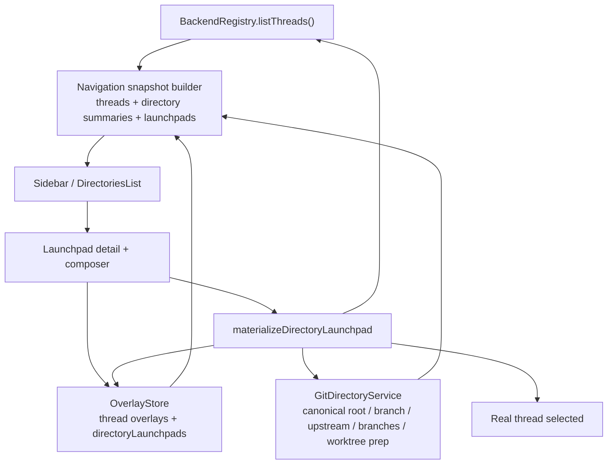
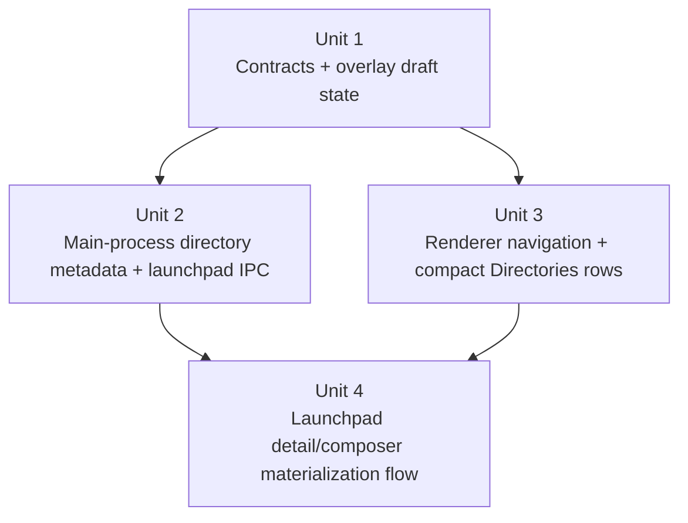

# feat: Add Directories launchpad flow

## Overview

Rework the Directories lens from a tall grouped-thread list into a compact project browser with inline expansion, a per-directory needs-attention badge, informational Git status, and a persistent launchpad draft that only becomes a real thread on first send. The implementation should preserve the repo's existing thread-first model by keeping launchpads separate from thread identity, routing thread creation through the current desktop backend registry, and moving new-thread setup ownership into the launchpad composer surface instead of the directory row.

## Problem Frame

The origin requirements define a denser Directories experience that stays visually aligned with Recents, replaces detached thread counts with a needs-attention signal, and turns `+` into a durable project-scoped launchpad rather than an immediate create-thread action (see origin: `docs/brainstorms/2026-04-18-directories-launchpad-requirements.md`). The current desktop code does not have a place to represent a non-thread draft: [`apps/desktop/src/renderer/src/features/navigation/DirectoriesList.tsx`](/Users/huntharo/.codex/worktrees/c913/PwrAgent/apps/desktop/src/renderer/src/features/navigation/DirectoriesList.tsx) derives grouped sections directly from thread summaries, [`apps/desktop/src/renderer/src/lib/useThreadNavigation.ts`](/Users/huntharo/.codex/worktrees/c913/PwrAgent/apps/desktop/src/renderer/src/lib/useThreadNavigation.ts) only selects real threads, and [`apps/desktop/src/renderer/src/features/composer/Composer.tsx`](/Users/huntharo/.codex/worktrees/c913/PwrAgent/apps/desktop/src/renderer/src/features/composer/Composer.tsx) only knows how to submit turns against an existing thread id.

At the same time, the current stack already has most of the infrastructure the launchpad needs:
- [`packages/agent-core/src/persistence/overlay-store.ts`](/Users/huntharo/.codex/worktrees/c913/PwrAgent/packages/agent-core/src/persistence/overlay-store.ts) persists desktop-only state keyed outside the backing app server
- [`packages/agent-core/src/domain/navigation-state.ts`](/Users/huntharo/.codex/worktrees/c913/PwrAgent/packages/agent-core/src/domain/navigation-state.ts) already materializes navigation snapshots from thread summaries plus overlay data
- [`apps/desktop/src/main/app-server/backend-registry.ts`](/Users/huntharo/.codex/worktrees/c913/PwrAgent/apps/desktop/src/main/app-server/backend-registry.ts) already owns thread creation, execution-mode routing, and request/response orchestration
- [`apps/desktop/src/main/codex-app-server/client.ts`](/Users/huntharo/.codex/worktrees/c913/PwrAgent/apps/desktop/src/main/codex-app-server/client.ts) already resolves Git roots, worktrees, and thread-level branch metadata

This plan extends those boundaries rather than replacing them.

## Requirements Trace

- R1-R4. Replace tall grouped directory sections with compact expandable directory rows that stay visually consistent with Recents.
- R5-R8. Surface Git branch and ahead/behind context in Directories as informational metadata only, while keeping branch- and setup-editing controls out of the directory row itself.
- R9-R16. Add one persistent unsent launchpad draft per directory that retains prompt and setup context across navigation until the first send materializes a real thread.
- R17-R18. Move new-thread access-mode ownership into the launchpad composer workflow and make it a sticky default for future launchpads without rewriting existing thread state.
- R19-R20. Carry model/reasoning/fast-mode setup through the same launchpad-owned sticky-default mechanism when backend metadata can support real choices, without inventing unsupported values.
- R21. Treat branch choice as launchpad-local context, not a global sticky default.

## Scope Boundaries

- Do not turn the Directories lens into a branch-switching UI.
- Do not create multiple concurrent unsent launchpads per directory.
- Do not redefine existing thread ids or merge launchpad drafts into thread identity.
- Do not move thread-specific execution-mode controls out of the thread detail context rail in this pass; the new composer-owned controls apply to launchpad/new-thread setup.
- Do not invent hard-coded model or reasoning taxonomies for backends that cannot advertise valid options yet.

## Context & Research

### Relevant Code and Patterns

- [`docs/design/desktop-style-guide.md`](/Users/huntharo/.codex/worktrees/c913/PwrAgent/docs/design/desktop-style-guide.md) explicitly calls for calm, dense sidebar rows and warns against ad hoc grouped-card styling.
- [`docs/brainstorms/2026-04-16-thread-centric-agent-desktop-requirements.md`](/Users/huntharo/.codex/worktrees/c913/PwrAgent/docs/brainstorms/2026-04-16-thread-centric-agent-desktop-requirements.md) already establishes directory view as an alternate lens over thread-first navigation, not a replacement object model.
- [`apps/desktop/src/renderer/src/features/navigation/DirectoriesList.tsx`](/Users/huntharo/.codex/worktrees/c913/PwrAgent/apps/desktop/src/renderer/src/features/navigation/DirectoriesList.tsx) currently groups threads client-side and is the main renderer entry point that needs restructuring.
- [`apps/desktop/src/renderer/src/features/navigation/Sidebar.tsx`](/Users/huntharo/.codex/worktrees/c913/PwrAgent/apps/desktop/src/renderer/src/features/navigation/Sidebar.tsx) already owns the browse-lens switch and current sidebar creation affordances.
- [`apps/desktop/src/renderer/src/lib/useThreadNavigation.ts`](/Users/huntharo/.codex/worktrees/c913/PwrAgent/apps/desktop/src/renderer/src/lib/useThreadNavigation.ts) is the current selection, snapshot refresh, and optimistic-thread boundary.
- [`apps/desktop/src/renderer/src/features/thread-detail/ThreadView.tsx`](/Users/huntharo/.codex/worktrees/c913/PwrAgent/apps/desktop/src/renderer/src/features/thread-detail/ThreadView.tsx) and [`apps/desktop/src/renderer/src/features/composer/Composer.tsx`](/Users/huntharo/.codex/worktrees/c913/PwrAgent/apps/desktop/src/renderer/src/features/composer/Composer.tsx) define the current thread-detail and reply workflow that the launchpad needs to mirror.
- [`packages/shared/src/contracts/navigation.ts`](/Users/huntharo/.codex/worktrees/c913/PwrAgent/packages/shared/src/contracts/navigation.ts) and [`packages/shared/src/contracts/agent.ts`](/Users/huntharo/.codex/worktrees/c913/PwrAgent/packages/shared/src/contracts/agent.ts) are the shared contract boundaries for navigation snapshots and desktop IPC.
- [`packages/agent-core/src/persistence/migrations.ts`](/Users/huntharo/.codex/worktrees/c913/PwrAgent/packages/agent-core/src/persistence/migrations.ts) and [`packages/agent-core/src/persistence/overlay-store.ts`](/Users/huntharo/.codex/worktrees/c913/PwrAgent/packages/agent-core/src/persistence/overlay-store.ts) are the persistence path for desktop-owned state and already handle versioned overlay migrations.
- [`apps/desktop/src/main/ipc/app-server.ts`](/Users/huntharo/.codex/worktrees/c913/PwrAgent/apps/desktop/src/main/ipc/app-server.ts) currently builds navigation snapshots from `listThreads()` plus overlay reconciliation, which is the natural place to add directory summaries.
- [`docs/plans/2026-04-16-004-feat-codex-access-mode-toggle-plan.md`](/Users/huntharo/.codex/worktrees/c913/PwrAgent/docs/plans/2026-04-16-004-feat-codex-access-mode-toggle-plan.md) already established execution-mode persistence in the overlay store and current renderer exposure for existing threads.
- [`docs/plans/2026-04-16-002-feat-app-server-protocol-compatibility-plan.md`](/Users/huntharo/.codex/worktrees/c913/PwrAgent/docs/plans/2026-04-16-002-feat-app-server-protocol-compatibility-plan.md) confirms `model/list` is part of the longer-term protocol surface, which matters for how aggressively this plan should promise model/reasoning UI.

### Institutional Learnings

- No relevant `docs/solutions/` artifacts exist yet in this repository.

### External References

- None. The repo already has strong local patterns for navigation snapshots, overlay persistence, desktop IPC, and thread/composer rendering, so additional external research would add little practical value here.

## Key Technical Decisions

- Represent launchpads as persisted directory-scoped drafts, not optimistic placeholder threads. This preserves thread identity and avoids mixing unsent draft state into thread lists that are sourced from the app server.
- Build stable directory summaries in the main process rather than re-deriving groups purely in the renderer. The renderer needs directory-level state that threads alone cannot provide: needs-attention counts, repo status, and launchpad presence.
- Persist launchpad drafts in the overlay store under a dedicated `directoryLaunchpads` map keyed by a stable directory key derived from the canonical Git root when available, otherwise the directory path. This keeps launchpad state durable across navigation and restart without colliding with thread ids.
- Compute the collapsed-row needs-attention badge from the count of distinct grouped threads whose `inbox.inInbox` flag is true. That reuses the existing desktop attention signal instead of inventing a second unread system.
- Use the Git upstream branch as the only ahead/behind source. If a directory has no upstream tracking branch, show branch information but omit sync-state claims rather than guessing a “default pull remote.”
- Treat launchpad send as one desktop-orchestrated materialization flow that prepares the working directory, starts the thread with the launchpad settings, and starts the first turn. This keeps the draft-to-thread transition coherent and minimizes renderer half-states.
- Keep composer-owned setup controls launchpad-specific in this pass. Existing threads retain their current thread-state controls, while launchpads own sticky defaults for future new threads. This honors the requirement that sticky changes should not rewrite existing thread settings.
- Make model/reasoning/fast-mode controls capability-driven. Persist those fields generically in launchpad state, but only render editable controls when the selected backend can advertise safe options or defaults; do not hard-code speculative model catalogs.

## Open Questions

### Resolved During Planning

- How should the collapsed-row attention badge be computed? Count distinct grouped threads where `thread.inbox.inInbox === true`.
- What remote should define sync state? Use the branch upstream when configured; otherwise mark sync status unavailable.
- Where should launchpad drafts live? In the desktop overlay store under a directory-keyed draft map separate from thread overlay records.
- When should sticky defaults freeze into a draft? Create or update the persisted launchpad draft on the first non-empty prompt input or any setup-field mutation, and from then on treat the draft as the source of truth until materialization or reset.
- How should launchpad controls differ from an existing thread? The launchpad composer owns editable setup fields; existing threads keep their current thread-state behavior and do not inherit later sticky-default edits.

### Deferred to Implementation

- What autosave debounce interval feels responsive without writing overlay state on every keystroke? This depends on the final renderer update pattern and can be tuned during implementation.
- How should the branch picker behave for very large repositories with many local branches? The implementation can choose between a simple select and a searchable list once the actual branch counts are visible.
- What path-naming strategy should new worktrees use when the preferred branch-slug path already exists? The implementation should settle the collision strategy once the worktree-preparation helper exists.

## High-Level Technical Design

> *This illustrates the intended approach and is directional guidance for review, not implementation specification. The implementing agent should treat it as context, not code to reproduce.*

## Implementation Units

- [ ] **Unit 1: Add directory launchpad contracts and persistence**

**Goal:** Introduce shared types and overlay-store structures for directory summaries, launchpad drafts, and launchpad-owned sticky setup fields without changing thread identity.

**Requirements:** R1-R4, R9-R16, R17-R21

**Dependencies:** None

**Files:**
- Modify: `packages/shared/src/contracts/app-server.ts`
- Modify: `packages/shared/src/contracts/navigation.ts`
- Modify: `packages/shared/src/contracts/agent.ts`
- Modify: `packages/shared/src/contracts/backend.ts`
- Create: `packages/agent-core/src/domain/directory-navigation.ts`
- Modify: `packages/agent-core/src/domain/navigation-state.ts`
- Modify: `packages/agent-core/src/persistence/migrations.ts`
- Modify: `packages/agent-core/src/persistence/overlay-store.ts`
- Test: `packages/agent-core/src/__tests__/overlay-store.test.ts`
- Test: `packages/agent-core/src/__tests__/directory-navigation.test.ts`

**Approach:**
- Add shared navigation types for directory summaries and launchpad drafts, including stable directory keys, needs-attention counts, optional Git status metadata, and launchpad-owned setup fields such as backend, execution mode, branch choice, worktree/local choice, and optional model/reasoning/service-tier values.
- Extend overlay persistence with a dedicated directory-launchpad map instead of stuffing launchpad state into `ThreadOverlayState`.
- Split directory aggregation logic into a focused domain helper so directory-level grouping, needs-attention counting, and launchpad attachment stay testable outside the Electron layer.
- Extend desktop IPC request/response types for “ensure/update/materialize/reset directory launchpad” so the renderer has explicit draft operations rather than piggybacking on `startThread`.
- Extend backend summary metadata only enough to expose launchpad-setup options safely. If a backend cannot advertise a real option list yet, the contract should allow omission rather than fake data.

**Execution note:** Start with migration and aggregation tests before changing the renderer shape.

**Patterns to follow:**
- [`packages/shared/src/contracts/navigation.ts`](/Users/huntharo/.codex/worktrees/c913/PwrAgent/packages/shared/src/contracts/navigation.ts)
- [`packages/agent-core/src/persistence/migrations.ts`](/Users/huntharo/.codex/worktrees/c913/PwrAgent/packages/agent-core/src/persistence/migrations.ts)
- [`packages/agent-core/src/domain/navigation-state.ts`](/Users/huntharo/.codex/worktrees/c913/PwrAgent/packages/agent-core/src/domain/navigation-state.ts)

**Test scenarios:**
- Happy path: a persisted launchpad draft rehydrates after restart with prompt text, execution mode, branch choice, and worktree/local preference intact.
- Happy path: directory aggregation produces one stable directory summary with the correct needs-attention count even when the same thread appears in multiple views.
- Happy path: a launchpad draft and a real thread with the same directory key coexist without key collisions.
- Edge case: older overlay data with no `directoryLaunchpads` field migrates cleanly with existing thread overlays preserved.
- Edge case: a directory with no Git metadata still materializes a summary and can own a launchpad draft.
- Error path: invalid persisted execution/model/reasoning values normalize to safe defaults or absent metadata rather than crashing snapshot generation.

**Verification:**
- Navigation snapshots can carry directory summaries plus launchpad drafts without inventing synthetic thread ids.

- [ ] **Unit 2: Add main-process directory metadata and launchpad orchestration**

**Goal:** Teach the main process to build directory-level Git metadata, persist/reopen launchpads, and materialize a launchpad into a real thread on first send.

**Requirements:** R3-R8, R9-R16, R17-R21

**Dependencies:** Unit 1

**Files:**
- Create: `apps/desktop/src/main/app-server/git-directory-service.ts`
- Modify: `apps/desktop/src/main/app-server/backend-registry.ts`
- Modify: `apps/desktop/src/main/ipc/app-server.ts`
- Modify: `apps/desktop/src/main/ipc/agent-ipc.ts`
- Modify: `apps/desktop/src/main/codex-app-server/client.ts`
- Modify: `apps/desktop/src/main/grok-app-server/client.ts`
- Modify: `apps/desktop/src/preload/index.ts`
- Modify: `apps/desktop/src/shared/ipc.ts`
- Test: `apps/desktop/src/main/__tests__/backend-registry.test.ts`
- Test: `apps/desktop/src/main/__tests__/agent-ipc.test.ts`
- Test: `apps/desktop/src/main/__tests__/app-server-ipc.test.ts`

**Approach:**
- Add a main-process Git directory service that can canonicalize a directory key, detect whether the directory is a Git repo, read current branch/upstream status, list branch choices for launchpads, and prepare a working directory for “local” versus “new worktree” launchpad materialization.
- Move directory-summary assembly to the navigation snapshot path so the renderer receives precomputed directory rows instead of having to infer them from thread arrays alone.
- Add explicit launchpad IPC methods:
  - ensure/open a directory launchpad
  - update autosaved launchpad state
  - discard/reset the directory launchpad after materialization
  - materialize the launchpad into a thread + first turn
- Keep `materializeDirectoryLaunchpad` in the main process so it can sequence worktree preparation, `startThread`, and `startTurn`, then clear/reset the draft only after the transition is coherent.
- Extend backend metadata enough to expose launchpad setup options when available. Use current backend defaults as the floor, but avoid shipping made-up lists for unsupported backends.

**Patterns to follow:**
- [`apps/desktop/src/main/ipc/app-server.ts`](/Users/huntharo/.codex/worktrees/c913/PwrAgent/apps/desktop/src/main/ipc/app-server.ts)
- [`apps/desktop/src/main/ipc/agent-ipc.ts`](/Users/huntharo/.codex/worktrees/c913/PwrAgent/apps/desktop/src/main/ipc/agent-ipc.ts)
- [`apps/desktop/src/main/app-server/backend-registry.ts`](/Users/huntharo/.codex/worktrees/c913/PwrAgent/apps/desktop/src/main/app-server/backend-registry.ts)
- [`apps/desktop/src/main/codex-app-server/client.ts`](/Users/huntharo/.codex/worktrees/c913/PwrAgent/apps/desktop/src/main/codex-app-server/client.ts)

**Test scenarios:**
- Happy path: a Git directory summary reports its current branch plus `ahead/behind` counts when an upstream branch exists.
- Happy path: a directory without an upstream branch reports branch information but omits sync-state claims.
- Happy path: opening a launchpad for a directory with no existing draft returns the sticky defaults seeded from current backend availability.
- Happy path: re-opening a directory launchpad returns the persisted unsent prompt and setup fields unchanged.
- Happy path: materializing a “local” launchpad starts the thread against the repo root and clears the directory draft after the first turn starts.
- Happy path: materializing a “new worktree” launchpad prepares a worktree cwd, starts the thread there, and preserves the canonical git-root directory summary.
- Error path: if Git status probing fails, the directory summary degrades to “status unavailable” without breaking the rest of the snapshot.
- Error path: if worktree creation fails, the draft remains intact and the user-visible error is returned without creating a thread.
- Error path: if `startThread` succeeds but `startTurn` fails, the created thread is still selectable and the original launchpad prompt is preserved for retry in the materialized thread surface rather than being lost.

**Verification:**
- The main process can return directory summaries and launchpad data in one snapshot and can materialize a launchpad into a working thread without dropping unsent user input.

- [ ] **Unit 3: Replace grouped Directories sections with compact expandable rows**

**Goal:** Rebuild the renderer’s Directories lens around stable directory summaries, inline expansion, and launchpad selection while keeping Recents and Inbox behavior intact.

**Requirements:** R1-R8, R9-R11

**Dependencies:** Unit 1, Unit 2

**Files:**
- Modify: `apps/desktop/src/renderer/src/lib/desktop-api.ts`
- Modify: `apps/desktop/src/renderer/src/lib/useThreadNavigation.ts`
- Modify: `apps/desktop/src/renderer/src/App.tsx`
- Modify: `apps/desktop/src/renderer/src/features/navigation/Sidebar.tsx`
- Modify: `apps/desktop/src/renderer/src/features/navigation/DirectoriesList.tsx`
- Modify: `apps/desktop/src/renderer/src/styles/app.css`
- Test: `apps/desktop/src/renderer/src/features/navigation/__tests__/sidebar.test.tsx`
- Test: `apps/desktop/src/renderer/src/__tests__/app-shell.test.tsx`

**Approach:**
- Stop grouping threads on the fly inside `DirectoriesList`; consume server-provided directory summaries with stable keys, launchpad metadata, and directory-level Git status.
- Change navigation selection from “selected thread only” to a small union of “selected thread” or “selected launchpad,” preserving the existing thread-key format for real threads so Recents and Inbox do not need a parallel rewrite.
- Add local expansion state per directory row in the renderer and render existing threads inline under the compact summary row.
- Replace the detached thread-count label with a compact needs-attention badge, while keeping the row styling aligned with the existing Recents row tokens and density.
- Keep Git status informational in the expanded row only: branch text, sync status when known, and `+` entrypoint. Do not add branch-switching actions here.

**Patterns to follow:**
- [`apps/desktop/src/renderer/src/features/navigation/Sidebar.tsx`](/Users/huntharo/.codex/worktrees/c913/PwrAgent/apps/desktop/src/renderer/src/features/navigation/Sidebar.tsx)
- [`apps/desktop/src/renderer/src/features/navigation/RecentsList.tsx`](/Users/huntharo/.codex/worktrees/c913/PwrAgent/apps/desktop/src/renderer/src/features/navigation/RecentsList.tsx)
- [`docs/design/desktop-style-guide.md`](/Users/huntharo/.codex/worktrees/c913/PwrAgent/docs/design/desktop-style-guide.md)

**Test scenarios:**
- Happy path: the collapsed directory row shows label plus needs-attention badge and no detached raw thread-count label.
- Happy path: expanding a Git directory reveals inline threads, informational branch/sync metadata, and a `+` entrypoint.
- Happy path: expanding a non-Git directory reveals inline threads and `+` but no Git-status area.
- Happy path: clicking `+` on a directory selects the existing launchpad draft when one already exists instead of creating a second draft.
- Edge case: a directory with zero needs-attention threads renders without a badge but remains expandable.
- Edge case: selecting a launchpad does not mark any real thread as seen or disturb Inbox bookkeeping.
- Integration: Recents and Inbox continue to render real threads off the same navigation snapshot without being polluted by launchpad-only rows.

**Verification:**
- The sidebar shows compact directory rows with inline expansion and can target either a real thread or a launchpad without regressions in Recents/Inbox.

- [ ] **Unit 4: Add launchpad detail and composer-owned setup workflow**

**Goal:** Render the launchpad as a thread-like draft surface, autosave prompt/setup edits, and materialize it into a real thread on send while keeping existing-thread behavior predictable.

**Requirements:** R9-R21

**Dependencies:** Unit 2, Unit 3

**Files:**
- Modify: `apps/desktop/src/renderer/src/features/thread-detail/ThreadView.tsx`
- Modify: `apps/desktop/src/renderer/src/features/thread-detail/ThreadHeader.tsx`
- Modify: `apps/desktop/src/renderer/src/features/thread-detail/ThreadContextPanel.tsx`
- Modify: `apps/desktop/src/renderer/src/features/composer/Composer.tsx`
- Modify: `apps/desktop/src/renderer/src/lib/useThreadTranscript.ts`
- Modify: `apps/desktop/src/renderer/src/lib/useThreadSkills.ts`
- Modify: `apps/desktop/src/renderer/src/features/thread-detail/__tests__/thread-view.test.tsx`
- Modify: `apps/desktop/src/renderer/src/features/composer/__tests__/composer.test.tsx`

**Approach:**
- Teach `ThreadView` to render either a real thread or a selected launchpad draft. The launchpad should reuse the thread detail layout enough to “look like a thread in that project” while clearly remaining a pre-thread draft.
- Update transcript and skill-loading hooks so launchpad selection does not trigger `thread/read` for a non-existent thread id and so skill lookup can key off the draft's directory/worktree context instead of an existing thread summary.
- Extend the composer to support two modes:
  - real-thread reply mode, preserving existing behavior
  - launchpad mode, where text entry and setup controls autosave into the persisted draft
- Move new-thread setup ownership into the launchpad composer: access mode is editable here and updates sticky defaults for future launchpads; model/reasoning/fast-mode controls render here only when the selected backend advertises valid options.
- Keep branch choice and local/worktree mode as launchpad-local context fields that are retained in the draft but do not become global sticky defaults.
- On send from a launchpad, call the materialization API, transition selection to the created thread, and reset the directory launchpad to a detached fresh state for the next `+`.
- Leave current thread-specific execution-mode switching in the context rail for existing threads so sticky launchpad defaults are not confused with retroactive thread edits.

**Patterns to follow:**
- [`apps/desktop/src/renderer/src/features/thread-detail/ThreadView.tsx`](/Users/huntharo/.codex/worktrees/c913/PwrAgent/apps/desktop/src/renderer/src/features/thread-detail/ThreadView.tsx)
- [`apps/desktop/src/renderer/src/features/composer/Composer.tsx`](/Users/huntharo/.codex/worktrees/c913/PwrAgent/apps/desktop/src/renderer/src/features/composer/Composer.tsx)
- [`apps/desktop/src/renderer/src/features/thread-detail/ThreadContextPanel.tsx`](/Users/huntharo/.codex/worktrees/c913/PwrAgent/apps/desktop/src/renderer/src/features/thread-detail/ThreadContextPanel.tsx)

**Test scenarios:**
- Happy path: editing a launchpad prompt autosaves it, navigating away, and reopening the launchpad restores the draft unchanged.
- Happy path: changing launchpad access mode updates the persisted draft and the sticky default used for the next new launchpad, while an existing thread’s execution mode remains unchanged.
- Happy path: changing launchpad branch or local/worktree choice affects only that launchpad draft and is restored when the draft is reopened.
- Happy path: sending a launchpad materializes a real thread, selects it, and resets the directory’s next launchpad to a fresh detached draft.
- Happy path: when backend setup options are advertised, model/reasoning/fast-mode controls render in the launchpad composer and persist their selections.
- Happy path: selecting a launchpad skips transcript fetches for real-thread history and loads skills using the launchpad's current directory/worktree context.
- Edge case: when backend setup options are not advertised, the launchpad composer remains layout-stable and does not invent unsupported selectors.
- Error path: a failed materialization leaves the launchpad prompt and settings available for retry if no thread was created, or hands them off to the created thread surface if thread creation already succeeded.
- Integration: existing thread reply behavior, optimistic user messages, approval handling, and interrupt controls continue to work unchanged outside launchpad mode.

**Verification:**
- Users can treat `+` as a durable per-directory launchpad, leave mid-composition, return later, and only create a real thread when they actually send.

## System-Wide Impact

- **Interaction graph:** `DesktopAppServerService.getNavigationSnapshot()` must now combine backend thread lists, overlay draft state, and Git-directory metadata before the renderer can build the Directories lens.
- **Error propagation:** Git metadata failures should degrade to missing status on a row, not break navigation. Launchpad materialization failures should preserve recoverable user input instead of dropping the draft silently.
- **State lifecycle risks:** Launchpad drafts and thread overlays now evolve independently. Clearing a draft at the wrong moment or keying it inconsistently with directory summaries would create lost work or duplicate drafts.
- **API surface parity:** Preload, shared IPC constants, desktop API types, and main-process handlers all need to evolve together for launchpad operations and directory summaries.
- **Integration coverage:** Cross-layer tests need to prove autosave persistence, directory summary assembly, launchpad materialization, and selection transitions; unit tests alone will not catch those seams.
- **Unchanged invariants:** Real thread ids, Inbox semantics, Recents ordering, and thread-specific transcript/reply behavior remain the existing source of truth and must not be rewritten around launchpad state.

## Risks & Dependencies

| Risk | Mitigation |
|------|------------|
| Launchpad drafts collide when the same repo appears through multiple worktree paths | Key drafts and directory summaries by canonical git root when available, with path fallback for non-Git directories |
| Git shellouts slow down snapshot refresh | Scope status lookup to visible/stable directory roots and cache per refresh cycle; degrade gracefully to “status unavailable” on failure |
| A send path creates a thread but loses the draft text on later failure | Centralize materialization in the main process and explicitly preserve the prompt until the created thread can own it |
| Model/reasoning controls drift from real backend support | Make those controls capability-driven and allow omission when backend metadata is unavailable |

## Documentation / Operational Notes

- Overlay persistence will require a versioned migration and restart-safe tests because launchpad drafts are stored in `overlay-state.json`.
- The resulting interaction model should be reflected in the desktop app guidance and any future contributor docs once implementation lands, because Directories will no longer be “threads grouped by path.”

## Sources & References

- **Origin document:** [docs/brainstorms/2026-04-18-directories-launchpad-requirements.md](/Users/huntharo/.codex/worktrees/c913/PwrAgent/docs/brainstorms/2026-04-18-directories-launchpad-requirements.md)
- Related requirements: [docs/brainstorms/2026-04-16-thread-centric-agent-desktop-requirements.md](/Users/huntharo/.codex/worktrees/c913/PwrAgent/docs/brainstorms/2026-04-16-thread-centric-agent-desktop-requirements.md)
- Related design: [docs/design/desktop-style-guide.md](/Users/huntharo/.codex/worktrees/c913/PwrAgent/docs/design/desktop-style-guide.md)
- Related plan: [docs/plans/2026-04-16-004-feat-codex-access-mode-toggle-plan.md](/Users/huntharo/.codex/worktrees/c913/PwrAgent/docs/plans/2026-04-16-004-feat-codex-access-mode-toggle-plan.md)
- Related plan: [docs/plans/2026-04-16-002-feat-app-server-protocol-compatibility-plan.md](/Users/huntharo/.codex/worktrees/c913/PwrAgent/docs/plans/2026-04-16-002-feat-app-server-protocol-compatibility-plan.md)
- Related code: [apps/desktop/src/renderer/src/features/navigation/DirectoriesList.tsx](/Users/huntharo/.codex/worktrees/c913/PwrAgent/apps/desktop/src/renderer/src/features/navigation/DirectoriesList.tsx)
- Related code: [apps/desktop/src/renderer/src/lib/useThreadNavigation.ts](/Users/huntharo/.codex/worktrees/c913/PwrAgent/apps/desktop/src/renderer/src/lib/useThreadNavigation.ts)
- Related code: [apps/desktop/src/main/app-server/backend-registry.ts](/Users/huntharo/.codex/worktrees/c913/PwrAgent/apps/desktop/src/main/app-server/backend-registry.ts)
- Related code: [packages/agent-core/src/persistence/overlay-store.ts](/Users/huntharo/.codex/worktrees/c913/PwrAgent/packages/agent-core/src/persistence/overlay-store.ts)
