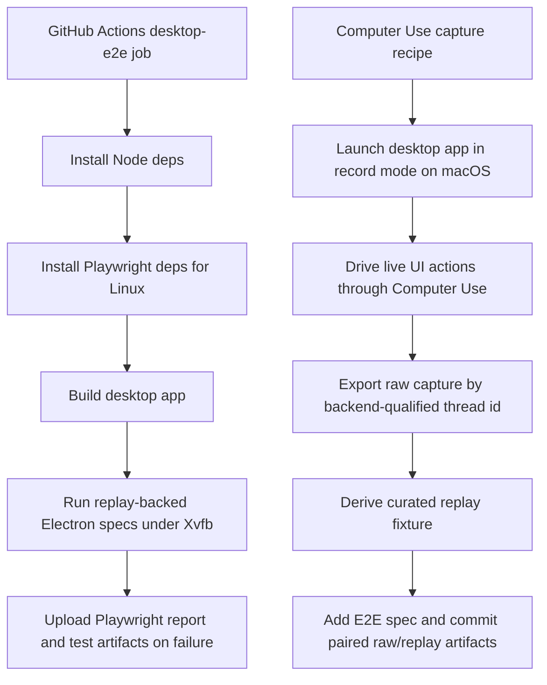
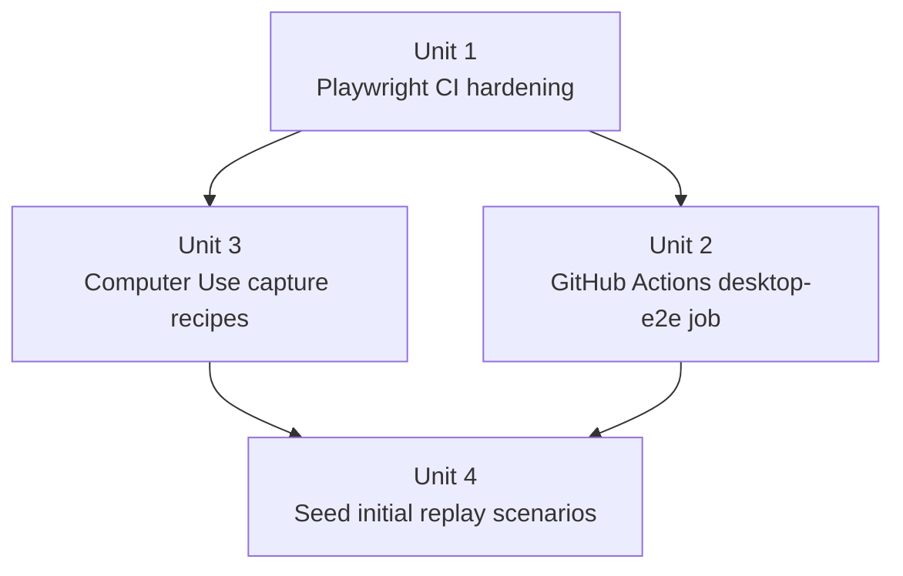

# feat: Add desktop E2E CI coverage and computer-use fixture seeding

## Overview

Operationalize the replay-backed desktop E2E harness in two directions: run the Electron replay specs in CI on every PR, and define a repeatable seeding workflow for capturing the next batch of replay fixtures with Computer Use against the live desktop app.

## Problem Frame

The replay harness now exists locally, but it is still missing two things that turn it into durable engineering infrastructure. First, the replay-backed Electron specs do not run in GitHub Actions, so regressions in the most realistic desktop test surface can still slip past PRs. Second, there is no codified workflow for using Computer Use to drive the live desktop app in record mode and promote the resulting sessions into the next batch of checked-in fixtures.

The original replay-harness requirements explicitly targeted broader desktop regression coverage after the framework existed, and required that the framework be practical for building a larger suite from real sessions (see origin: `docs/brainstorms/2026-04-18-desktop-integration-test-replay-harness-requirements.md`). This follow-on plan turns that latent capability into an operational path: deterministic replay tests in CI, and a disciplined capture workflow for seeding initial scenarios with Computer Use.

## Requirements Trace

- R1-R19. Preserve the replay-harness invariants already established in the origin document: replay fixtures remain deterministic, traceable back to raw captures, and runnable through the real Electron shell.
- R20. The replay-backed desktop E2E suite must run automatically in GitHub Actions on pull requests and pushes to `main`.
- R21. The CI job must be stable on Linux-hosted runners, capture useful debugging artifacts on failure, and avoid overloading the runner with unnecessary parallelism.
- R22. Fixture seeding must use the existing record/export/derive pipeline rather than introducing a second capture format or ad hoc manual editing.
- R23. The first seeding workflow must explicitly support Computer Use-driven capture sessions against the live desktop app on macOS.
- R24. The repo must codify the first batch of Computer Use capture scenarios so future sessions can repeat them consistently instead of improvising UI actions.
- R25. The initial seeded scenarios should focus on current high-value desktop behaviors that are cross-layer, user-visible, and not already well protected by renderer-only tests.

## Scope Boundaries

- In scope: GitHub Actions coverage for replay-backed desktop E2E tests, CI-focused Playwright hardening, Computer Use capture recipes, and the first batch of seeded replay scenarios.
- In scope: documentation and repo-local artifacts that make fixture seeding repeatable for future captures.
- Out of scope: running Computer Use itself inside CI. Computer Use is for live capture seeding; CI remains replay-only.
- Out of scope: broadening the product’s shipped UI automation surface or adding end-user-facing controls for capture mode.
- Out of scope: replacing the existing Vitest suites. This work adds a CI lane and a fixture-seeding workflow around the replay harness.

## Context & Research

### Relevant Code and Patterns

- `.github/workflows/ci.yml` already defines `install-deps`, `lint`, `build`, `test`, and `live-agent-core` jobs, all built around `pwrdrvr/configure-nodejs@v1`. The desktop E2E lane should follow that existing job shape instead of inventing a separate workflow style.
- `package.json` already exposes `pnpm test:desktop-e2e`, which builds the desktop app and runs the Playwright suite. That root script is the narrowest stable CI entry point for replay-backed Electron tests.
- `apps/desktop/playwright.config.ts` already sets CI retries and an HTML reporter, but it does not yet encode CI worker limits or explicit artifact paths.
- `apps/desktop/e2e/fixtures/electron-app.ts` launches the compiled Electron main entry through Playwright’s `_electron.launch` path, which is already the same boot shape the replay-harness plan chose for local and CI execution.
- `apps/desktop/scripts/export-session-capture.ts` and `apps/desktop/scripts/derive-replay-fixture.ts` already provide the record -> export -> derive primitives needed for promotion. The missing piece is a documented, repeatable capture recipe around them.
- `apps/desktop/e2e/edited-changes-order.spec.ts` and `apps/desktop/e2e/smoke.spec.ts` show the current user-visible assertion style to preserve as the suite expands.
- Renderer tests in `apps/desktop/src/renderer/src/features/thread-detail/__tests__/thread-view.test.tsx`, `apps/desktop/src/renderer/src/features/thread-detail/__tests__/transcript-list.test.tsx`, and `apps/desktop/src/renderer/src/features/composer/__tests__/composer.test.tsx` identify the next high-value cross-layer scenarios to seed: approval state, turn progression, stop-button lifecycle, and context visibility.

### Institutional Learnings

- No `docs/solutions/` artifacts currently exist for desktop replay seeding or desktop E2E CI.

### External References

- Playwright’s CI guidance recommends installing dependencies via `playwright install --with-deps`, limiting CI workers to `1` for stability, and uploading `playwright-report` artifacts from GitHub Actions: [Playwright CI](https://playwright.dev/docs/ci)
- Playwright’s CI docs also note that headed Linux execution requires Xvfb, which matters here because Electron replay tests launch a real desktop window rather than a browser-only headless context: [Playwright CI](https://playwright.dev/docs/ci)
- Playwright’s Electron API documents `_electron.launch`, `cwd`, `env`, and artifact handling, which matches the current desktop harness shape and should remain the CI launch path: [Playwright Electron API](https://playwright.dev/docs/api/class-electron)
- Electron’s automated testing guide continues to recommend Playwright for Electron app automation rather than bespoke app-driver code: [Electron automated testing](https://www.electronjs.org/docs/latest/tutorial/automated-testing)

## Key Technical Decisions

- Add a dedicated `desktop-e2e` job to the existing `ci.yml` instead of creating a second workflow file. The current repo already centralizes validation in one CI workflow, and this keeps branch protection configuration simple.
- Run the replay-backed Electron tests on `ubuntu-latest` under Xvfb rather than shifting the lane to macOS. CI needs deterministic replay, not live Computer Use, and Linux runners are cheaper, faster, and already aligned with Playwright’s official CI guidance.
- Keep CI replay-only and treat Computer Use as a seeding tool for live capture generation on macOS. This preserves the determinism boundary: CI validates curated fixtures, while Computer Use bootstraps future fixtures from real app behavior.
- Codify capture recipes as repo-local artifacts next to the replay fixtures they are meant to produce. The recipe should describe the live setup, expected UI actions, export target, and scenario window hints so maintainers can reproduce the same capture shape later.
- Seed the first batch around high-value cross-layer behaviors that already have renderer-level signal but still benefit from live desktop capture: approval-pending state, turn-start/turn-complete lifecycle, and the existing edited-changes regression as the reference promotion pattern.

## Open Questions

### Resolved During Planning

- Should CI run the replay-backed Electron suite on Linux or macOS? Linux, under Xvfb, because the CI job is replay-only and official Playwright guidance already covers headed Linux execution.
- Should Computer Use participate in CI execution? No. Computer Use is for live session seeding; CI should remain deterministic and fixture-backed.
- Should the seeding workflow invent a new automation format? No. It should build on the existing capture root, export script, and replay-derivation script, with recipe artifacts only for repeatability.

### Deferred to Implementation

- The exact artifact retention policy for CI uploads can be tuned once the first few failing runs show how large Playwright traces and reports are in this repo.
- The final recipe artifact format (`.md`, `.json`, or paired human/machine-readable files) should be chosen during implementation based on whichever shape is easiest to review and actually follow in a Codex session.
- The exact initial scenario names may shift slightly if implementation uncovers a more precise title that better matches the captured thread and fixture directory names.

## High-Level Technical Design

> *This illustrates the intended approach and is directional guidance for review, not implementation specification. The implementing agent should treat it as context, not code to reproduce.*

Initial seeded scenario target set:

| Scenario | Why it belongs in the first batch | Existing signal to preserve |
|---|---|---|
| Approval pending | Exercises inbound server requests, transcript pending state, and composer waiting copy | `TranscriptList` and `ThreadView` approval handling |
| Turn lifecycle / stop state | Exercises `turn/started`, `turn/completed`, and the composer stop-button lifecycle | `Composer` and `ThreadView` notification handling |
| Edited changes ordering | Keeps the current regression as the reference end-to-end promotion pattern | Existing replay-backed Electron regression |

## Implementation Units

- [x] **Unit 1: Harden the desktop Playwright surface for CI execution**

**Goal:** Make the existing replay-backed Electron suite explicitly CI-friendly before wiring it into GitHub Actions.

**Requirements:** R20, R21

**Dependencies:** None

**Files:**
- Modify: `apps/desktop/playwright.config.ts`
- Modify: `apps/desktop/package.json`
- Modify: `package.json`
- Test: `apps/desktop/e2e/smoke.spec.ts`
- Test: `apps/desktop/e2e/edited-changes-order.spec.ts`

**Approach:**
- Add the CI-specific Playwright settings the current config is still missing: `workers: 1` on CI, explicit artifact/report directories, and any trace/video/report options needed for actionable GitHub Actions debugging.
- Keep the root `pnpm test:desktop-e2e` script as the single stable entry point for CI, but add package-level affordances only if they make the workflow or artifact paths clearer.
- Do not broaden the suite into environment-sensitive live tests; the CI target remains the built replay-backed Electron app.

**Patterns to follow:**
- `apps/desktop/playwright.config.ts`
- `apps/desktop/e2e/fixtures/electron-app.ts`
- `package.json`

**Test scenarios:**
- Happy path: replay-backed Electron specs still pass locally with the new Playwright config and script surface.
- Edge case: CI configuration constrains workers to a stable single-worker run without changing local developer defaults.
- Error path: failing CI runs emit trace/report artifacts in predictable directories that can be uploaded by GitHub Actions.
- Integration: the existing `smoke` and `edited-changes-order` specs continue to run against the built Electron app through `_electron.launch`.

**Verification:**
- A developer can run the exact CI entry point locally and get deterministic replay-backed Electron results plus predictable artifact output paths.

- [x] **Unit 2: Add a dedicated desktop E2E lane to GitHub Actions**

**Goal:** Run the replay-backed desktop Electron suite automatically in CI on every PR and push to `main`.

**Requirements:** R20, R21

**Dependencies:** Unit 1

**Files:**
- Modify: `.github/workflows/ci.yml`
- Test: `apps/desktop/e2e/smoke.spec.ts`
- Test: `apps/desktop/e2e/edited-changes-order.spec.ts`

**Approach:**
- Add a `desktop-e2e` job alongside the existing validation jobs in `ci.yml`, reusing `pwrdrvr/configure-nodejs@v1`.
- Install the Linux dependencies required for headed Electron execution using the Playwright-supported path, then run the replay-backed suite under `xvfb-run`.
- Upload Playwright reports and test artifacts on failure or cancellation so CI regressions are inspectable without rerunning locally.
- Keep this job independent from `live-agent-core`; the replay-backed suite should not depend on external credentials or live services.

**Execution note:** Start by proving the GitHub Actions job shape against the current two replay specs before expanding the scenario count.

**Patterns to follow:**
- `.github/workflows/ci.yml`
- `README.md`
- [Playwright CI](https://playwright.dev/docs/ci)

**Test scenarios:**
- Happy path: pull requests to `main` run the `desktop-e2e` job and execute the replay-backed Electron suite successfully on Linux.
- Edge case: the job stays green when the suite is serial and built from a clean checkout with no local cache assumptions.
- Error path: when a replay-backed Electron spec fails, GitHub Actions uploads the Playwright report and test artifacts instead of discarding them.
- Integration: the CI job exercises the exact root script (`pnpm test:desktop-e2e`) the repo documents for local use.

**Verification:**
- A PR to `main` triggers a distinct `desktop-e2e` CI job that runs the replay-backed Electron suite and exposes artifacts for debugging failures.

- [x] **Unit 3: Codify the Computer Use capture recipe workflow**

**Goal:** Make live replay-fixture seeding repeatable by capturing the exact UI recipe a Codex session should follow with Computer Use.

**Requirements:** R22, R23, R24

**Dependencies:** Unit 1

**Files:**
- Create: `apps/desktop/e2e/fixtures/README.md`
- Create: `apps/desktop/e2e/fixtures/approval-pending/capture-recipe.md`
- Create: `apps/desktop/e2e/fixtures/turn-lifecycle/capture-recipe.md`
- Modify: `apps/desktop/e2e/fixtures/edited-changes-order/` companion docs or recipe artifact
- Modify: `README.md`

**Approach:**
- Co-locate a capture recipe with each seeded scenario so the fixture directory contains both evidence (`raw.capture.jsonl`, `replay.fixture.json`) and the instructions that produced it.
- Each recipe should specify: launch mode and env vars, the prompt or interaction to perform, the thread-selection cue, any UI actions Computer Use should take (`click`, `type`, `press key`, `open context rail`, etc.), the expected stopping point for export, and export/derive hints such as thread selector and likely sequence window.
- Document that Computer Use is the recommended seeding tool because the available primitives (`get_app_state`, `click`, `type_text`, `press_key`, `scroll`) match the required live desktop interactions without adding app-specific test hooks.
- Keep recipes human-reviewable and deterministic enough that future fixture refreshes do not depend on oral knowledge.

**Patterns to follow:**
- `README.md`
- `apps/desktop/e2e/fixtures/edited-changes-order/`
- Existing capture/export/derive workflow in the replay-harness plan and docs

**Test scenarios:**
- Test expectation: none -- this unit codifies the operator workflow and recipe artifacts rather than adding product behavior.

**Verification:**
- A maintainer can open a fixture directory and follow a documented Computer Use recipe to reproduce the live capture path that generated that scenario.

- [x] **Unit 4: Seed the first batch of live-captured replay scenarios**

**Goal:** Promote the next set of replay-backed Electron regressions from live desktop sessions captured with Computer Use.

**Requirements:** R22, R23, R24, R25

**Dependencies:** Unit 2, Unit 3

**Files:**
- Create: `apps/desktop/e2e/fixtures/approval-pending/raw.capture.jsonl`
- Create: `apps/desktop/e2e/fixtures/approval-pending/replay.fixture.json`
- Create: `apps/desktop/e2e/approval-pending.spec.ts`
- Create: `apps/desktop/e2e/fixtures/turn-lifecycle/raw.capture.jsonl`
- Create: `apps/desktop/e2e/fixtures/turn-lifecycle/replay.fixture.json`
- Create: `apps/desktop/e2e/turn-lifecycle.spec.ts`
- Modify: `apps/desktop/e2e/fixtures/electron-app.ts` (only if the new assertions need shared helpers)
- Modify: `README.md`
- Test: `apps/desktop/e2e/approval-pending.spec.ts`
- Test: `apps/desktop/e2e/turn-lifecycle.spec.ts`
- Test: `apps/desktop/e2e/edited-changes-order.spec.ts`

**Approach:**
- Use the recipe artifacts from Unit 3 to drive live sessions with Computer Use on macOS while the desktop app runs in record mode.
- Export the resulting sessions through `export-session-capture`, derive curated replay fixtures with `derive-replay-fixture`, and check in both raw and replay artifacts for each scenario.
- Keep the first batch intentionally small and high-value: approval-pending state, turn lifecycle/stop-state behavior, and a refresh of the edited-changes workflow as the reference scenario.
- Write Playwright Electron assertions against user-visible outcomes rather than protocol internals: pending-approval UI, stop-button / status copy transitions, transcript ordering, and visible completion state.

**Execution note:** Characterize each scenario with a real Computer Use-driven live capture before writing the final replay assertion, so the replay fixture is grounded in observed desktop behavior rather than hand-authored guesses.

**Patterns to follow:**
- `apps/desktop/e2e/edited-changes-order.spec.ts`
- `apps/desktop/e2e/smoke.spec.ts`
- `apps/desktop/src/renderer/src/features/thread-detail/__tests__/thread-view.test.tsx`
- `apps/desktop/src/renderer/src/features/thread-detail/__tests__/transcript-list.test.tsx`
- `apps/desktop/src/renderer/src/features/composer/__tests__/composer.test.tsx`

**Test scenarios:**
- Happy path: a replayed approval-pending fixture shows the transcript approval block and the composer waiting state in the same live ordering as the recorded session.
- Happy path: a replayed turn-lifecycle fixture shows turn-start and turn-complete state changes without leaving stale pending UI behind.
- Edge case: replaying the seeded scenarios on CI yields the same visible state as local runs, with no dependence on live services or recorded timing.
- Error path: if a seeded fixture is missing the live step that drives the intended UI state, the corresponding E2E spec fails with a targeted expectation rather than a generic timeout.
- Integration: each seeded spec runs through the real Electron shell, replay backend, preload bridge, renderer state subscriptions, and transcript/composer UI without mocking `window.pwragent`.

**Verification:**
- The repo contains at least two additional replay-backed Electron regressions seeded from live Computer Use captures, and the full replay-backed suite passes both locally and in CI.

## System-Wide Impact

- **Interaction graph:** CI now treats the replay-backed Electron suite as a first-class validation lane, while fixture seeding adds a documented bridge from live desktop sessions to checked-in replay artifacts.
- **Error propagation:** CI failures should preserve Playwright traces and reports for debugging; fixture-seeding failures should fail clearly at the export/derive step rather than producing partial artifacts.
- **State lifecycle risks:** Seeded captures can drift if recipes are underspecified; colocated recipe artifacts and paired raw/replay files reduce that drift risk.
- **API surface parity:** No production desktop API should widen for Computer Use. The capture workflow should stay outside the shipped app surface and rely on existing env vars plus external UI control.
- **Integration coverage:** Approval handling, turn lifecycle, and edited-changes ordering are specifically valuable because mocks and renderer tests alone do not prove the full backend-registry-to-renderer chain.
- **Unchanged invariants:** The replay harness remains deterministic, CI remains replay-only, and live external services remain isolated to seeding sessions rather than the PR validation path.

## Risks & Dependencies

| Risk | Mitigation |
|------|------------|
| Electron replay tests are flaky on Linux CI because they require a display server | Run the suite under Xvfb and keep CI workers at 1, following Playwright’s headed Linux guidance |
| CI artifact paths are unclear, making failures hard to debug | Set explicit Playwright artifact/report paths and upload them in the `desktop-e2e` job |
| Computer Use seeding becomes tribal knowledge | Co-locate per-scenario capture recipes with fixture directories and document the full promotion path in `README.md` |
| Seeded scenarios become too broad or expensive to maintain | Keep the first batch intentionally small and centered on user-visible, cross-layer behaviors already known to be important |
| Future maintainers mistake Computer Use for a CI dependency | State clearly in docs and plan artifacts that Computer Use is only for live fixture seeding, never for deterministic CI replay |

## Documentation / Operational Notes

- Update `README.md` so the desktop replay workflow has three explicit modes: local replay execution, CI replay execution, and live capture seeding with Computer Use.
- Treat the recipe artifact as part of the fixture bundle, not as optional supporting material.
- Expect the first implementation pass to validate the CI job on the existing two specs before seeding the next fixture batch.

## Sources & References

- **Origin document:** [docs/brainstorms/2026-04-18-desktop-integration-test-replay-harness-requirements.md](/Users/huntharo/.codex/worktrees/ef86/PwrAgent/docs/brainstorms/2026-04-18-desktop-integration-test-replay-harness-requirements.md)
- Related plan: [docs/plans/2026-04-18-001-feat-desktop-replay-harness-plan.md](/Users/huntharo/.codex/worktrees/ef86/PwrAgent/docs/plans/2026-04-18-001-feat-desktop-replay-harness-plan.md)
- Related code: [.github/workflows/ci.yml](/Users/huntharo/.codex/worktrees/ef86/PwrAgent/.github/workflows/ci.yml)
- Related code: [apps/desktop/playwright.config.ts](/Users/huntharo/.codex/worktrees/ef86/PwrAgent/apps/desktop/playwright.config.ts)
- Related code: [apps/desktop/scripts/export-session-capture.ts](/Users/huntharo/.codex/worktrees/ef86/PwrAgent/apps/desktop/scripts/export-session-capture.ts)
- Related code: [apps/desktop/scripts/derive-replay-fixture.ts](/Users/huntharo/.codex/worktrees/ef86/PwrAgent/apps/desktop/scripts/derive-replay-fixture.ts)
- External docs: [Playwright CI](https://playwright.dev/docs/ci)
- External docs: [Playwright Electron API](https://playwright.dev/docs/api/class-electron)
- External docs: [Electron automated testing](https://www.electronjs.org/docs/latest/tutorial/automated-testing)
