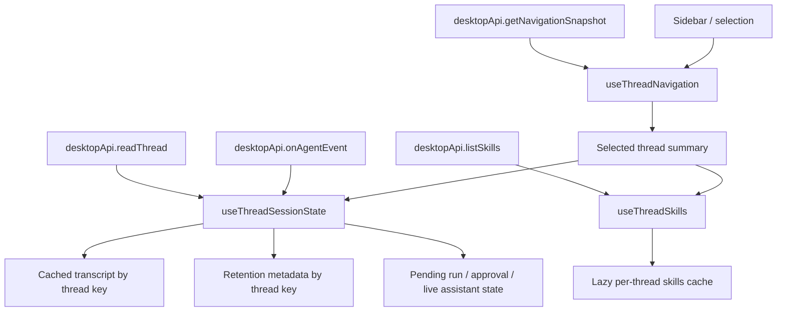
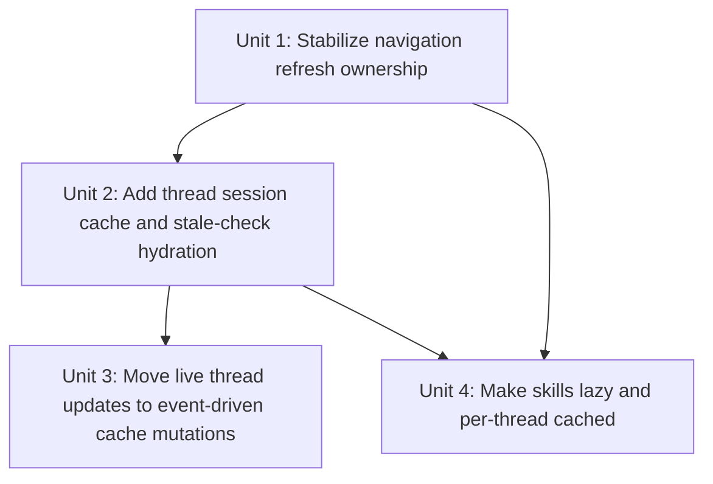

# fix: Stabilize desktop thread refresh and session state

## Overview

Replace the desktop app's eager refresh model with a thread-keyed session model. Sidebar metadata can keep updating for inbox and ordering behavior, but the selected thread transcript, composer, and skill state should remain stable unless that specific thread changed.

## Problem Frame

The current renderer splits refresh ownership across `useThreadNavigation`, `useThreadTranscript`, `useThreadSkills`, `ThreadView`, and `Composer`. That split makes normal lifecycle events fan out into broad list refreshes, full transcript rereads, and repeated skill fetches. The result matches the origin requirements doc: UI jumpiness, unnecessary loading states, and avoidable memory churn. This plan keeps the thread-detail surface calm by separating summary refresh from thread runtime state and by making the selected thread event-driven during active work. (see origin: `docs/brainstorms/2026-04-18-desktop-thread-refresh-model-requirements.md`)

## Requirements Trace

- R1, R2. Remove manual and focus-driven refresh surfaces from the thread UI.
- R3, R4. Keep non-selected thread updates confined to sidebar metadata and unread ordering.
- R5, R11, R12, R13. Drive selected-thread updates from events and preserve transcript scroll behavior.
- R6, R7, R8, R9, R10. Use cached thread state plus lightweight freshness checks before deciding to reread the full thread.
- R14, R15, R16, R17, R18. Convert skills loading to lazy, per-thread, session-cached behavior.
- R19, R20, R21, R22, R23, R24. Track thread retention state in memory and distinguish interacted threads from view-only threads.

## Scope Boundaries

- No window-focus auto-refresh behavior in this pass.
- No manual thread refresh button or manual skill reload control in this pass.
- No broader app-server protocol redesign in this pass.
- No memory-pressure sweeper implementation in this pass beyond storing eviction priority metadata and enforcing the 10-thread cap for view-only cached threads.

## Context & Research

### Relevant Code and Patterns

- `apps/desktop/src/renderer/src/App.tsx` currently composes `useThreadNavigation`, `useThreadTranscript`, and `useThreadSkills` independently, which is the root of selected-thread invalidation fan-out.
- `apps/desktop/src/renderer/src/lib/useThreadNavigation.ts` owns selection, `markThreadSeen`, focus refresh, and turn-complete navigation refresh. It currently rebuilds selected thread objects whenever a snapshot changes.
- `apps/desktop/src/renderer/src/lib/useThreadTranscript.ts` eagerly rereads `thread/read` whenever the selected `thread` object changes.
- `apps/desktop/src/renderer/src/lib/useThreadSkills.ts` eagerly calls `listSkills` whenever the selected `thread` object changes.
- `apps/desktop/src/renderer/src/features/composer/Composer.tsx` currently calls `props.onRefresh()` on turn lifecycle events, which forces full transcript rereads after active turns.
- `apps/desktop/src/renderer/src/features/thread-detail/ThreadView.tsx` currently exposes a thread-level `Refresh` button and holds live assistant/pending-request state locally instead of in a thread-keyed session cache.
- `apps/desktop/src/renderer/src/features/thread-detail/TranscriptList.tsx` already has the right scroll-anchoring pattern for append vs prepend behavior; the plan should preserve that component's assumptions by stabilizing entry identity and limiting full transcript resets.
- `packages/shared/src/contracts/app-server.ts` already exposes enough turn and item notifications (`turn/started`, `item/agentMessage/delta`, `item/started`, `item/completed`, `turn/completed`, `thread/status/changed`) to support a renderer-side event reducer for selected-thread runtime state.
- `apps/desktop/src/renderer/src/__tests__/app-shell.test.tsx` is the best integration seam to prove that sidebar refreshes no longer perturb the open thread, while feature-level tests in `composer`, `thread-detail`, and `navigation` remain the right place for focused behavior coverage.

### Institutional Learnings

- No `docs/solutions/` artifacts exist yet for desktop refresh ownership or thread session caching in this repository.
- `docs/plans/2026-04-16-004-feat-thread-naming-parity-plan.md` already identified that metadata correctness should not rely on window-focus refresh and that refresh churn should stay contained.
- `docs/plans/2026-04-17-001-fix-transcript-image-preview-plan.md` shows the current plan format and confirms `ThreadView` plus `TranscriptList` as the thread-detail ownership boundary.

### External References

- None. The affected behavior is driven by current repo architecture, and the local renderer/main patterns are strong enough for planning without external framework research.

## Key Technical Decisions

- **Separate summary state from thread runtime state:** `useThreadNavigation` remains responsible for sidebar metadata and selection, while a new renderer-local session hook becomes the source of truth for transcript cache, active-turn state, pending approval state, lazy skill state, and retention metadata. This directly addresses the current invalidation fan-out.
- **Use navigation `updatedAt` as the first-pass freshness token:** on re-selecting a cached thread without an active turn, refresh the navigation snapshot as the lightweight summary source, compare the selected thread's `updatedAt` to the cached hydration token, and only call `readThread` when that summary changed. This keeps the first pass inside the current repo surface and avoids inventing a new app-server method prematurely.
- **Preserve object identity for unchanged thread summaries in the renderer:** `useThreadNavigation` should reconcile incoming snapshot rows by thread key so unrelated sidebar changes do not manufacture a new selected-thread object unnecessarily.
- **Make active-thread transcript updates event-driven:** selected-thread turns should mutate cached transcript state from agent events and finalize assistant output from `turn/completed`, instead of treating turn completion as a cue to reread the full transcript immediately.
- **Keep skills on the existing `skills/list(cwds)` path, but cache by thread key:** the protocol is currently cwd-scoped, so the desktop app should treat the result as thread-scoped session state and load it lazily on first `$` trigger within that thread.

## Alternative Approaches Considered

- **Add a new per-thread summary RPC immediately:** rejected for this pass because the current repo already has a workable summary signal (`updatedAt`) and the user-facing problem is UI invalidation more than transport cost. A narrower protocol method remains a fallback if `updatedAt` proves too coarse in implementation.
- **Keep the existing split hooks and only tweak dependencies:** rejected because it leaves refresh ownership distributed across `App`, `Composer`, and `ThreadView`, which is the core reason the current behavior is hard to reason about and easy to re-break.

## Open Questions

### Resolved During Planning

- **Should this first pass add a new protocol method for lightweight stale checks?** No. Use navigation snapshot metadata as the lightweight summary source first and keep protocol expansion as a fallback if implementation proves `updatedAt` is insufficient.
- **Should the selected thread runtime continue to live in `ThreadView` and `Composer` local state?** No. Those components should become renderers/dispatchers over thread-keyed session state so unrelated thread updates cannot perturb the current thread view.
- **Should skill caching be global or thread-keyed?** Thread-keyed. The desktop behavior should stay per-thread even though the transport call is currently cwd-based.

### Deferred to Implementation

- What exact reducer/action split best expresses transcript cache mutations without making the new session hook too opaque.
- Whether the first pass should render live `item/started` / `item/completed` entries as full activity cards immediately or keep them as lightweight pending activity state until a later follow-up.
- The exact heuristic that marks "latest assistant response has been read" for retention metadata, especially when the user is scrolled away from bottom.

## High-Level Technical Design

> *This illustrates the intended approach and is directional guidance for review, not implementation specification. The implementing agent should treat it as context, not code to reproduce.*

| Selection state | Active turn? | Summary changed? | Expected behavior |
|---|---|---|---|
| Uncached thread | N/A | N/A | Load `readThread` once, cache result, render thread |
| Cached thread | Yes | Any | Reuse cached transcript and continue event-driven updates |
| Cached thread | No | No | Reuse cached transcript with no visible repaint |
| Cached thread | No | Yes | Read fresh transcript once and replace that thread's cached state |

## Implementation Units

- [ ] **Unit 1: Stabilize navigation refresh ownership**

**Goal:** Remove refresh surfaces that destabilize the UI and make navigation updates preserve unchanged thread identity.

**Requirements:** R1, R2, R3, R4

**Dependencies:** None

**Files:**
- Modify: `apps/desktop/src/renderer/src/lib/useThreadNavigation.ts`
- Modify: `apps/desktop/src/renderer/src/lib/useBackendSummaries.ts`
- Modify: `apps/desktop/src/renderer/src/features/navigation/Sidebar.tsx`
- Modify: `apps/desktop/src/renderer/src/features/thread-detail/ThreadView.tsx`
- Modify: `apps/desktop/src/renderer/src/App.tsx`
- Test: `apps/desktop/src/renderer/src/features/navigation/__tests__/sidebar.test.tsx`
- Test: `apps/desktop/src/renderer/src/__tests__/app-shell.test.tsx`

**Approach:**
- Remove the thread-detail and sidebar refresh buttons from the renderer surface and stop passing refresh callbacks into those views as user-facing controls.
- Drop the `onWindowFocus` subscriptions in `useThreadNavigation` and `useBackendSummaries` so focus changes no longer trigger broad refreshes.
- Reconcile incoming navigation snapshot rows by thread key inside `useThreadNavigation`, reusing prior `NavigationThreadSummary` objects when their relevant metadata has not changed. This protects the selected thread summary from unrelated sidebar reordering or unread-state churn.
- When a thread selection needs both `markThreadSeen` and a lightweight stale-check summary refresh, coalesce them onto one navigation refresh path instead of issuing separate broad summary refreshes for the same interaction.
- Keep navigation refresh on meaningful data changes such as `markThreadSeen`, thread creation, execution mode changes, and thread lifecycle agent events, but let those updates stay in the summary lane rather than driving transcript rereads directly.

**Patterns to follow:**
- `apps/desktop/src/renderer/src/lib/useThreadNavigation.ts`
- `packages/agent-core/src/domain/navigation-state.ts`
- `apps/desktop/src/renderer/src/features/navigation/Sidebar.tsx`

**Test scenarios:**
- Happy path: the sidebar renders without `Refresh threads`, and the thread detail header renders without the thread-level `Refresh` button.
- Happy path: a navigation snapshot update that changes inbox ordering for another thread preserves the selected thread summary identity and does not trigger a new selected-thread transcript fetch.
- Edge case: `markThreadSeen` still updates inbox state correctly after selection without requiring focus refresh support.
- Edge case: creating a thread or changing execution mode still refreshes navigation metadata and keeps the intended thread selected.
- Integration: a non-selected thread receiving a completion event updates sidebar ordering/unread state while the open thread transcript remains unchanged.

**Verification:**
- Sidebar and thread-detail metadata can refresh in normal lifecycle paths, but focus regain and unrelated thread churn no longer manufacture visible thread-detail resets.

- [ ] **Unit 2: Add thread-keyed session cache and stale-check hydration**

**Goal:** Make the selected thread read from a renderer-local cache first, then conditionally reread from `thread/read` only when the cached thread is stale.

**Requirements:** R6, R7, R8, R9, R10, R19, R20, R21, R22, R23, R24

**Dependencies:** Unit 1

**Files:**
- Create: `apps/desktop/src/renderer/src/lib/useThreadSessionState.ts`
- Create: `apps/desktop/src/renderer/src/lib/__tests__/useThreadSessionState.test.tsx`
- Modify: `apps/desktop/src/renderer/src/App.tsx`
- Modify: `apps/desktop/src/renderer/src/lib/useThreadTranscript.ts`
- Test: `apps/desktop/src/renderer/src/__tests__/app-shell.test.tsx`

**Approach:**
- Introduce a thread-keyed session cache hook that stores hydrated transcript state, the `updatedAt` value observed when that transcript was loaded, active-turn markers, pending approval state, and retention metadata for each visited thread.
- On selecting an uncached thread, hydrate from `readThread` once and mark the cache entry as either interacted or view-only depending on whether the user later sends a message.
- On selecting a cached thread with no active turn, invoke the existing navigation refresh as the lightweight summary source, compare the selected summary's `updatedAt` against the cached hydration token, and only call `readThread` if it changed.
- Move optimistic local user messages into the same thread-keyed cache entry so a thread the user just sent in can be revisited without losing in-flight local state.
- Enforce the view-only retention cap by evicting the oldest clean/view-only cache entries once more than ten are retained, while preserving interacted threads for the session.
- Track the metadata needed for later sweep logic now: last local send time, whether the latest assistant response has been read, and whether the thread was ever interacted with in this session.

**Execution note:** Add focused hook-level coverage before rewiring `App.tsx` so cache and stale-check behavior is pinned independently from UI chrome.

**Patterns to follow:**
- `apps/desktop/src/renderer/src/lib/useThreadTranscript.ts`
- `apps/desktop/src/renderer/src/App.tsx`
- `apps/desktop/src/renderer/src/__tests__/app-shell.test.tsx`

**Test scenarios:**
- Happy path: selecting an uncached thread triggers one `readThread` call, caches the transcript, and renders the loaded state.
- Happy path: re-selecting a cached thread with matching `updatedAt` reuses the cached transcript without issuing another `readThread`.
- Happy path: re-selecting a cached thread whose summary `updatedAt` increased issues one fresh `readThread` and replaces only that thread's cached transcript.
- Edge case: a cached thread with an active local turn skips the summary stale-check path and continues from the cached active-turn state.
- Edge case: after a local send, switching away from the thread and back again preserves the optimistic user message and interacted-thread retention metadata.
- Edge case: opening more than ten view-only threads evicts the oldest clean entries first while leaving interacted-thread cache entries intact.
- Error path: a stale-check summary refresh failure leaves the last known cached transcript visible instead of blanking the open thread.
- Integration: switching between two cached threads where only one changed elsewhere reloads only the changed thread and preserves the other thread's in-memory state.

**Verification:**
- Thread selection becomes cache-first and only performs `readThread` when the selected thread is uncached or actually stale.

- [ ] **Unit 3: Move live selected-thread updates to event-driven cache mutations**

**Goal:** Stop treating turn lifecycle events as cues to reread the transcript and instead fold them directly into the selected thread's cached runtime state.

**Requirements:** R3, R4, R5, R11, R12, R13

**Dependencies:** Unit 2

**Files:**
- Modify: `apps/desktop/src/renderer/src/lib/useThreadSessionState.ts`
- Modify: `apps/desktop/src/renderer/src/features/thread-detail/ThreadView.tsx`
- Modify: `apps/desktop/src/renderer/src/features/composer/Composer.tsx`
- Modify: `apps/desktop/src/renderer/src/features/thread-detail/TranscriptList.tsx`
- Test: `apps/desktop/src/renderer/src/features/thread-detail/__tests__/thread-view.test.tsx`
- Test: `apps/desktop/src/renderer/src/features/composer/__tests__/composer.test.tsx`
- Test: `apps/desktop/src/renderer/src/__tests__/app-shell.test.tsx`

**Approach:**
- Move live assistant delta, pending approval, and turn lifecycle handling out of `ThreadView`/`Composer` local refresh loops and into the new session hook so those events mutate one thread-keyed cache entry instead of asking the whole app to refresh.
- Finalize assistant output on `turn/completed` by promoting the accumulated delta or `turn.output` into the cached transcript entry rather than clearing transient UI state and forcing `readThread`.
- Keep event application scoped by thread key so non-selected thread events can update sidebar metadata or off-screen cache state without perturbing the current thread view.
- Preserve `TranscriptList`'s scroll assumptions by appending new entries in place, keeping existing ids stable, and only resetting list state when a true stale reload replaces the selected thread transcript.
- Continue clearing or downgrading transient pending state on failure, cancellation, or idle transitions, but do so in cache state rather than through component-local resets.

**Patterns to follow:**
- `apps/desktop/src/renderer/src/features/thread-detail/ThreadView.tsx`
- `apps/desktop/src/renderer/src/features/thread-detail/TranscriptList.tsx`
- `apps/desktop/src/renderer/src/features/composer/Composer.tsx`

**Test scenarios:**
- Happy path: `item/agentMessage/delta` notifications append live assistant text to the selected thread without issuing `readThread`.
- Happy path: `turn/completed` finalizes the assistant reply into the cached transcript and leaves the message visible after pending state clears.
- Edge case: when the selected thread is scrolled to bottom, appended live activity auto-scrolls to the new bottom.
- Edge case: when the user is scrolled away from bottom, appended live activity does not pull the viewport to the latest message.
- Edge case: non-selected thread lifecycle events do not change the selected thread transcript entries, pending state, or scroll position.
- Error path: `turn/failed` or `turn/cancelled` clears transient pending state without wiping the previously cached transcript.
- Integration: sending a message in one thread, switching away, and returning before completion preserves the active-turn cache and resumes from live events instead of rereading immediately.

**Verification:**
- Selected-thread transcript changes are driven by thread-local events and preserve scroll stability, with no full reread on every turn completion.

- [ ] **Unit 4: Make skills lazy and per-thread cached**

**Goal:** Stop eager skill loading on thread selection and load skills only on first skill-trigger use within a thread.

**Requirements:** R14, R15, R16, R17, R18

**Dependencies:** Unit 1

**Files:**
- Modify: `apps/desktop/src/renderer/src/lib/useThreadSkills.ts`
- Modify: `apps/desktop/src/renderer/src/features/composer/Composer.tsx`
- Modify: `apps/desktop/src/renderer/src/App.tsx`
- Test: `apps/desktop/src/renderer/src/features/composer/__tests__/composer.test.tsx`
- Test: `apps/desktop/src/renderer/src/__tests__/app-shell.test.tsx`

**Approach:**
- Replace the current selected-thread effect in `useThreadSkills` with a thread-keyed cache and an explicit `ensureSkillsLoaded(thread)` entry point that loads only once per thread per app session.
- Trigger `ensureSkillsLoaded` from `Composer` when the user first enters a skill trigger for a Codex-backed thread, rather than on thread selection.
- Continue using the existing `listSkills({ backend, cwds })` transport path, but store the result under the selected thread key so repeated visits to the same thread do not re-fetch skills.
- Keep the loading and error surface local to skill-trigger use so the composer does not show `Loading skills…` during ordinary thread selection or unrelated sidebar activity.

**Patterns to follow:**
- `apps/desktop/src/renderer/src/lib/useThreadSkills.ts`
- `apps/desktop/src/renderer/src/features/composer/Composer.tsx`
- `apps/desktop/src/renderer/src/features/composer/__tests__/composer.test.tsx`

**Test scenarios:**
- Happy path: selecting a Codex thread does not call `listSkills` until the user types `$`.
- Happy path: the first `$` trigger in a thread calls `listSkills` once and enables autocomplete for subsequent trigger edits in that thread.
- Edge case: revisiting a thread whose skills were already loaded does not call `listSkills` again.
- Edge case: switching to a different thread keeps its skills unloaded until the first trigger in that thread.
- Edge case: non-Codex threads never attempt to load skills, even if the user types `$`.
- Error path: a failed skill load surfaces an error only for that thread and does not poison already cached skill lists for other threads.

**Verification:**
- Skill loading becomes lazy, thread-keyed, and invisible during ordinary navigation.

## System-Wide Impact

- **Interaction graph:** `getNavigationSnapshot` updates sidebar summary state; `useThreadSessionState` owns selected-thread runtime; `readThread` hydrates or rehydrates individual thread cache entries; `onAgentEvent` mutates cache entries for the affected thread; `useThreadSkills` handles lazy thread-keyed autocomplete data.
- **Error propagation:** summary refresh failures should preserve existing cached thread content; `readThread` failures should leave the last known transcript visible with an error state instead of blanking the entire view; skill-load failures should stay scoped to the requesting thread.
- **State lifecycle risks:** thread-keyed cache entries need explicit ownership boundaries so interacted-thread retention does not accidentally pin ephemeral pending state forever; view-only eviction must not remove the currently selected thread.
- **API surface parity:** the plan intentionally keeps the existing desktop-to-app-server method surface (`getNavigationSnapshot`, `readThread`, `listSkills`) for the first pass, so no cross-repo protocol rollout is required.
- **Integration coverage:** the app-shell tests need to prove that sidebar reorder, thread selection, active turns, and lazy skills can all coexist without the selected thread rereading or jumping unexpectedly.
- **Unchanged invariants:** inbox semantics, thread creation flow, execution-mode toggling, transcript pagination, and markdown/image transcript rendering should continue to work as they do today.

## Risks & Dependencies

| Risk | Mitigation |
|------|------------|
| `updatedAt` may be too coarse as the only stale-check signal for all backends. | Build the first pass around `updatedAt`, but isolate the stale-check decision in the session hook so a minimal thread-summary protocol can be added later without another renderer rewrite. |
| Moving turn lifecycle state into a session hook could make the new logic harder to understand if reducer boundaries are vague. | Keep cache mutations grouped by concern (hydration, active-turn events, retention metadata, skill cache) and pin the selection/stale-check logic with focused hook tests. |
| Sidebar metadata refreshes may still cause thread-detail rerenders if summary identity reconciliation is incomplete. | Reconcile rows by thread key and compare the exact fields that matter to thread-detail consumers before replacing an existing summary object. |
| View-only cache eviction could accidentally evict a thread the user is actively reading. | Exclude the selected thread and active-turn threads from the view-only eviction pool and cover this behavior in hook tests. |
| Lazy skill loading could regress autocomplete UX if trigger detection fires too often. | Trigger the load only on the first unresolved skill request per thread and keep the loaded result cached for the rest of the session. |

## Documentation / Operational Notes

- No user-facing documentation update is required for this pass; the behavior change is internal to the desktop experience.
- If implementation reveals that `updatedAt` is not a reliable stale-check token, capture that as a follow-on protocol task rather than widening this fix mid-stream.

## Sources & References

- **Origin document:** [docs/brainstorms/2026-04-18-desktop-thread-refresh-model-requirements.md](/Users/huntharo/pwrdrvr/PwrAgent/docs/brainstorms/2026-04-18-desktop-thread-refresh-model-requirements.md)
- Related code: `apps/desktop/src/renderer/src/App.tsx`
- Related code: `apps/desktop/src/renderer/src/lib/useThreadNavigation.ts`
- Related code: `apps/desktop/src/renderer/src/lib/useThreadTranscript.ts`
- Related code: `apps/desktop/src/renderer/src/lib/useThreadSkills.ts`
- Related code: `apps/desktop/src/renderer/src/features/composer/Composer.tsx`
- Related code: `apps/desktop/src/renderer/src/features/thread-detail/ThreadView.tsx`
- Related code: `apps/desktop/src/renderer/src/features/thread-detail/TranscriptList.tsx`
- Related tests: `apps/desktop/src/renderer/src/__tests__/app-shell.test.tsx`
- Related tests: `apps/desktop/src/renderer/src/features/composer/__tests__/composer.test.tsx`
- Related tests: `apps/desktop/src/renderer/src/features/navigation/__tests__/sidebar.test.tsx`
- Related tests: `apps/desktop/src/renderer/src/features/thread-detail/__tests__/thread-view.test.tsx`
- Related plan: `docs/plans/2026-04-16-004-feat-thread-naming-parity-plan.md`
- Related plan: `docs/plans/2026-04-17-001-fix-transcript-image-preview-plan.md`
