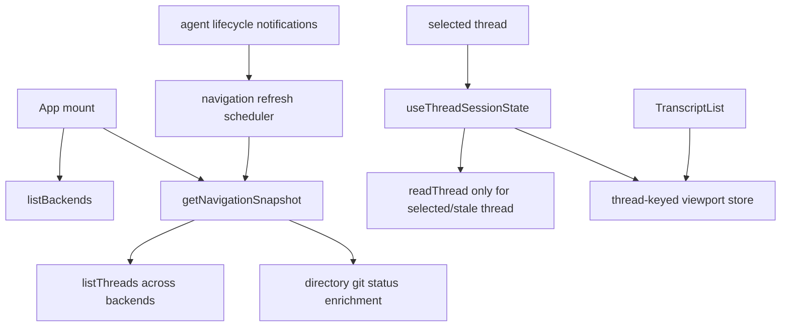
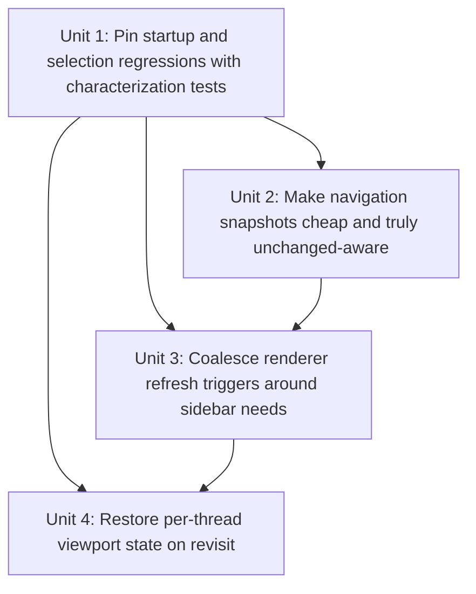

# fix: Reduce desktop startup CPU and preserve thread viewport state

## Overview

Tighten the desktop app's startup and navigation path so connecting to Codex does not trigger seconds of Electron-side refresh churn, and so revisiting a cached thread restores the reader's prior viewport instead of replaying a top-to-bottom scroll every time.

## Problem Frame

The current code already avoids a truly naive "read every thread replay on startup" path. The selected thread alone is passed into the session hook from [`apps/desktop/src/renderer/src/App.tsx`](/Users/huntharo/.codex/worktrees/2f1c/PwrAgnt/apps/desktop/src/renderer/src/App.tsx), and `useThreadSessionState` only calls `readThread` for the selected thread when no cached response exists or the selected summary's `updatedAt` changed. That means the user's suspicion about eagerly hydrating every thread history does not match the current renderer path.

The real hot path is broader and more expensive:

- Navigation refresh still rebuilds the whole snapshot on mount and again on every global `turn/completed`, `turn/failed`, and `turn/cancelled` notification in [`apps/desktop/src/renderer/src/lib/useThreadNavigation.ts`](/Users/huntharo/.codex/worktrees/2f1c/PwrAgnt/apps/desktop/src/renderer/src/lib/useThreadNavigation.ts).
- Each `getNavigationSnapshot()` call lists threads across backends and then recomputes git status for every directory in [`apps/desktop/src/main/ipc/app-server.ts`](/Users/huntharo/.codex/worktrees/2f1c/PwrAgnt/apps/desktop/src/main/ipc/app-server.ts) and [`apps/desktop/src/main/app-server/git-directory-service.ts`](/Users/huntharo/.codex/worktrees/2f1c/PwrAgnt/apps/desktop/src/main/app-server/git-directory-service.ts).
- Codex thread listing fans out to both default-access and full-access clients in [`apps/desktop/src/main/app-server/backend-registry.ts`](/Users/huntharo/.codex/worktrees/2f1c/PwrAgnt/apps/desktop/src/main/app-server/backend-registry.ts), so one renderer refresh can already imply multiple backend calls.
- The current `unchanged` flag is effectively disabled whenever directories have git status, so the renderer rarely gets to short-circuit redundant snapshot application.
- Transcript scroll state is not retained per thread. [`apps/desktop/src/renderer/src/features/thread-detail/TranscriptList.tsx`](/Users/huntharo/.codex/worktrees/2f1c/PwrAgnt/apps/desktop/src/renderer/src/features/thread-detail/TranscriptList.tsx) sets `shouldScrollToBottomRef.current = true` on every `threadId` change, which guarantees a bottom jump even when the transcript was already cached.

Together these behaviors fit the reported symptoms: heavy startup CPU during Codex connect, repeated whole-window work when thread lifecycle notifications arrive, and thread switching that visibly replays the same scroll-to-bottom behavior instead of restoring prior in-memory state. This plan is a focused follow-up to the broader refresh-model work in [`docs/plans/2026-04-18-003-fix-desktop-thread-refresh-model-plan.md`](/Users/huntharo/.codex/worktrees/2f1c/PwrAgnt/docs/plans/2026-04-18-003-fix-desktop-thread-refresh-model-plan.md).

## Requirements Trace

- R0. From the user report: connecting to Codex must not drive roughly 10 seconds of 100% CPU in the Electron process through avoidable startup refresh churn.
- R1. From the user report: revisiting a previously opened thread must restore in-memory transcript state and viewport instead of replaying a top-to-bottom scroll on each selection.
- R3, R4. Non-selected thread activity may update sidebar metadata, but must not destabilize the selected thread transcript or viewport. (see origin: `docs/brainstorms/2026-04-18-desktop-thread-refresh-model-requirements.md`)
- R6, R7, R8, R9, R10. Cached threads should remain cache-first, with full rereads only when the selected thread is actually stale. (see origin: `docs/brainstorms/2026-04-18-desktop-thread-refresh-model-requirements.md`)
- R11, R12, R13. Transcript scrolling should follow new bottom content only when the reader is already at bottom, and must preserve viewport otherwise. (see origin: `docs/brainstorms/2026-04-18-desktop-thread-refresh-model-requirements.md`)
- R15, R16, R17. Skill loading must stay lazy and thread-scoped; startup work must not reintroduce eager skill fetches. (see origin: `docs/brainstorms/2026-04-18-desktop-thread-refresh-model-requirements.md`)
- R19, R21, R22, R23, R24. Viewed and interacted threads remain session-retained and eligible for in-memory reuse. (see origin: `docs/brainstorms/2026-04-18-desktop-thread-refresh-model-requirements.md`)

## Scope Boundaries

- No new app-server RPC is required in the first pass.
- No redesign of transcript item normalization or plan rendering is in scope.
- No manual refresh control is being reintroduced.
- No attempt to solve every sidebar performance issue is in scope; the target is startup/connect thrash, redundant summary refreshes, and per-thread viewport restoration.
- No memory-pressure sweeper beyond existing session-retention rules is planned here.

## Context & Research

### Relevant Code and Patterns

- [`apps/desktop/src/renderer/src/App.tsx`](/Users/huntharo/.codex/worktrees/2f1c/PwrAgnt/apps/desktop/src/renderer/src/App.tsx) passes only `navigation.selectedThread` into `useThreadSessionState`, which is strong evidence that thread replay is selected-thread scoped today.
- [`apps/desktop/src/renderer/src/lib/useThreadSessionState.ts`](/Users/huntharo/.codex/worktrees/2f1c/PwrAgnt/apps/desktop/src/renderer/src/lib/useThreadSessionState.ts) already implements per-thread cached transcript state and `updatedAt`-based stale detection for the selected thread. That is the pattern to preserve rather than replace.
- [`apps/desktop/src/renderer/src/lib/useThreadNavigation.ts`](/Users/huntharo/.codex/worktrees/2f1c/PwrAgnt/apps/desktop/src/renderer/src/lib/useThreadNavigation.ts) is still the broad refresh owner. It runs an initial `getNavigationSnapshot()` on mount and triggers another full refresh on every turn completion/failure/cancel event, regardless of whether the selected-thread session cache already reconciled the change.
- [`apps/desktop/src/main/ipc/app-server.ts`](/Users/huntharo/.codex/worktrees/2f1c/PwrAgnt/apps/desktop/src/main/ipc/app-server.ts) builds navigation snapshots by listing threads and then reading git status for every directory. The returned `unchanged` flag is currently forced false whenever any directory has a `gitStatus`, so renderer short-circuiting cannot work reliably.
- [`apps/desktop/src/main/app-server/backend-registry.ts`](/Users/huntharo/.codex/worktrees/2f1c/PwrAgnt/apps/desktop/src/main/app-server/backend-registry.ts) lists Codex threads from both default and full-access clients, then reconciles overlays per thread. This is legitimate, but it means renderer refresh count matters because each refresh is already expensive.
- [`apps/desktop/src/main/app-server/git-directory-service.ts`](/Users/huntharo/.codex/worktrees/2f1c/PwrAgnt/apps/desktop/src/main/app-server/git-directory-service.ts) shells out to multiple git commands per directory for every status read. Repeating this across startup event bursts is a plausible source of the Electron CPU spike.
- [`apps/desktop/src/renderer/src/lib/useThreadSkills.ts`](/Users/huntharo/.codex/worktrees/2f1c/PwrAgnt/apps/desktop/src/renderer/src/lib/useThreadSkills.ts) is already lazy and thread-keyed. It should remain uninvolved in startup work.
- [`apps/desktop/src/renderer/src/features/thread-detail/TranscriptList.tsx`](/Users/huntharo/.codex/worktrees/2f1c/PwrAgnt/apps/desktop/src/renderer/src/features/thread-detail/TranscriptList.tsx) already handles prepend-vs-append scroll anchoring well; the missing piece is per-thread viewport persistence across selection changes.
- Existing tests in [`apps/desktop/src/renderer/src/__tests__/app-shell.test.tsx`](/Users/huntharo/.codex/worktrees/2f1c/PwrAgnt/apps/desktop/src/renderer/src/__tests__/app-shell.test.tsx), [`apps/desktop/src/renderer/src/features/thread-detail/__tests__/transcript-list.test.tsx`](/Users/huntharo/.codex/worktrees/2f1c/PwrAgnt/apps/desktop/src/renderer/src/features/thread-detail/__tests__/transcript-list.test.tsx), and [`apps/desktop/src/main/__tests__/app-server-ipc.test.ts`](/Users/huntharo/.codex/worktrees/2f1c/PwrAgnt/apps/desktop/src/main/__tests__/app-server-ipc.test.ts) provide the best coverage seams.

### Institutional Learnings

- [`docs/plans/2026-04-18-003-fix-desktop-thread-refresh-model-plan.md`](/Users/huntharo/.codex/worktrees/2f1c/PwrAgnt/docs/plans/2026-04-18-003-fix-desktop-thread-refresh-model-plan.md) already established the intended direction: event-driven selected-thread updates, cache-first thread hydration, and lazy thread-scoped skills. This plan narrows in on the remaining startup and viewport regressions.
- [`docs/plans/2026-04-18-001-feat-desktop-heap-diagnostics-plan.md`](/Users/huntharo/.codex/worktrees/2f1c/PwrAgnt/docs/plans/2026-04-18-001-feat-desktop-heap-diagnostics-plan.md) is relevant background if targeted heap/session instrumentation becomes necessary, but the current evidence points more strongly at refresh churn and git-status recomputation than at a pure leak.

### External References

- None. The problem is dominated by local renderer/main-process behavior and existing repo patterns are sufficient.

## Key Technical Decisions

- **Treat startup CPU as a navigation-refresh problem, not a replay-hydration problem.** The selected-thread session hook is already scoped to one thread, so the fix should focus on global snapshot churn and expensive snapshot assembly rather than inventing a second transcript cache.
- **Make `getNavigationSnapshot().unchanged` truthful across directory status enrichment.** The current `unchanged` contract is undermined by post-hash git-status injection. The main process should reuse or compare directory status results so the renderer can skip redundant snapshot application.
- **Coalesce and narrow renderer refresh triggers.** `useThreadNavigation` should stop treating every turn completion/failure/cancel event as an immediate whole-snapshot reload. Refreshes should be deduped, reasoned about, and limited to cases that can actually change sidebar-visible metadata.
- **Store viewport state by thread key and restore it on revisit.** Scroll position is thread session state, not transient component state. Returning to a cached thread should restore the prior viewport unless the underlying transcript was reloaded because it actually changed.
- **Preserve existing lazy skill behavior.** Startup fixes must not regress skill loading back into an eager selection-time request path.

## Alternative Approaches Considered

- **Add a new lightweight backend freshness RPC immediately:** not chosen for the first pass because the current issue is dominated by redundant refresh triggers and expensive snapshot assembly, both of which can be improved inside the existing surface.
- **Disable all sidebar refresh on turn lifecycle events:** not chosen because sidebar ordering, inbox state, and renamed/new threads still need eventual consistency. The right move is coalesced refresh, not permanent staleness.
- **Keep viewport state local to `TranscriptList` only:** rejected because switching away from a thread unmounts or rebinds the component. Per-thread restoration needs state that survives selection changes.

## Open Questions

### Resolved During Planning

- **Are we currently reading every thread history on startup?** No. Current code routes `readThread` through the selected-thread session path only.
- **Should this fix introduce a new protocol method before tightening the existing refresh path?** No. The first pass should use the current navigation and thread-read surface more efficiently.
- **Should per-thread viewport restoration be bolted into `TranscriptList` refs alone?** No. Restoration needs thread-keyed state owned above the list component.

### Deferred to Implementation

- Whether viewport restoration should store raw `scrollTop`, distance-from-bottom, or an anchor-id hybrid for the best behavior after pagination and appended items.
- Whether navigation refresh coalescing should use a microtask, animation frame, or short timeout once the existing tests expose the actual event burst shape.
- Whether directory-status caching needs explicit invalidation hooks for launchpad materialization or if TTL plus refresh reasons is sufficient for the first pass.

## High-Level Technical Design

> *This illustrates the intended approach and is directional guidance for review, not implementation specification. The implementing agent should treat it as context, not code to reproduce.*

| Situation | Current behavior | Planned behavior |
|---|---|---|
| Initial connect to Codex | Multiple expensive global refreshes can stack while both Codex clients connect and events arrive | One initial navigation snapshot, then coalesced follow-up refreshes only when sidebar-relevant metadata changes |
| Cached thread re-selected without new activity | `TranscriptList` forces scroll-to-bottom because `threadId` changed | Prior viewport is restored from thread-keyed state with no forced bottom jump |
| Non-selected thread completes | Selected thread is stable, but navigation may still perform full repeated refreshes | Selected thread stays stable and sidebar refresh is batched/deduped |
| Snapshot data unchanged except git status cache hit | `unchanged` is effectively false once any `gitStatus` exists | Renderer receives a true unchanged result and skips redundant state application |

## Implementation Units

- [x] **Unit 1: Pin startup and selection regressions with characterization tests**

**Goal:** Add coverage that captures the bad behavior directly so the implementation can tighten refresh logic without guesswork.

**Requirements:** R0, R1, R3, R4, R6, R7, R8, R10, R11, R12, R13

**Dependencies:** None

**Files:**
- Modify: `apps/desktop/src/renderer/src/__tests__/app-shell.test.tsx`
- Modify: `apps/desktop/src/renderer/src/features/thread-detail/__tests__/transcript-list.test.tsx`
- Modify: `apps/desktop/src/main/__tests__/app-server-ipc.test.ts`
- Create: `apps/desktop/src/renderer/src/lib/__tests__/useThreadNavigation.test.tsx`

**Approach:**
- Add renderer characterization coverage that simulates startup plus repeated turn lifecycle notifications and asserts navigation refreshes are bounded rather than one-per-event.
- Extend app-shell coverage to assert that `readThread` is invoked only for the selected thread during initial hydration and re-selection, so the team does not regress into eager per-thread replay reads while fixing the CPU issue.
- Add transcript-list coverage that models switching from thread A to thread B and back again, asserting the prior viewport is restored instead of forcing a bottom jump.
- Add main-process coverage for `getNavigationSnapshot()` so unchanged snapshots can stay unchanged after directory git-status enrichment when the status data itself did not change.

**Execution note:** Start characterization-first. The first implementation step should make the failing refresh-count and viewport-restoration tests explicit before changing runtime behavior.

**Patterns to follow:**
- `apps/desktop/src/renderer/src/__tests__/app-shell.test.tsx`
- `apps/desktop/src/renderer/src/features/thread-detail/__tests__/transcript-list.test.tsx`
- `apps/desktop/src/main/__tests__/app-server-ipc.test.ts`

**Test scenarios:**
- Happy path: app startup selects one thread and performs exactly one selected-thread `readThread` hydration even when multiple thread summaries exist.
- Happy path: a burst of `turn/completed` notifications for the same backend coalesces into one navigation refresh rather than N full refreshes.
- Edge case: duplicate completion notifications from the two Codex clients do not multiply navigation refresh work.
- Edge case: re-selecting a cached unchanged thread does not trigger a second `readThread`.
- Edge case: switching away from a scrolled-up thread and back restores the prior viewport rather than forcing bottom scroll.
- Integration: unchanged navigation snapshots with unchanged directory statuses do not cause the renderer to apply a new navigation response.

**Verification:**
- The failing tests describe the startup CPU and thread-switch regressions concretely enough that the subsequent units can be implemented against them.

- [x] **Unit 2: Make navigation snapshots cheap and truly unchanged-aware**

**Goal:** Remove avoidable main-process work from repeated navigation refreshes and make the `unchanged` contract meaningful again.

**Requirements:** R0, R3, R4, R6, R8, R9, R10

**Dependencies:** Unit 1

**Files:**
- Modify: `apps/desktop/src/main/ipc/app-server.ts`
- Modify: `apps/desktop/src/main/app-server/backend-registry.ts`
- Modify: `apps/desktop/src/main/app-server/git-directory-service.ts`
- Modify: `apps/desktop/src/main/__tests__/app-server-ipc.test.ts`
- Modify: `apps/desktop/src/main/__tests__/backend-registry.test.ts`

**Approach:**
- Add a session-level directory-status cache in `GitDirectoryService` with in-flight deduplication and conservative freshness rules so repeated navigation refreshes do not shell out to git for every directory on every event burst.
- Rework `getNavigationSnapshot()` so the returned `unchanged` flag reflects both thread-summary equality and directory-status equality, instead of forcing `unchanged: false` whenever any enriched directory has a `gitStatus`.
- Keep Codex thread listing semantically the same, but avoid unnecessary repeated overlay and sorting work where the snapshot request is already known unchanged or where one refresh supersedes another.
- Preserve failure isolation: a directory-status lookup failure should degrade that directory's status field, not invalidate the entire snapshot or trigger retry storms.

**Patterns to follow:**
- `apps/desktop/src/main/ipc/app-server.ts`
- `apps/desktop/src/main/app-server/git-directory-service.ts`
- `packages/agent-core/src/persistence/overlay-store.ts`

**Test scenarios:**
- Happy path: two consecutive navigation snapshot reads with identical thread and directory status data return `unchanged: true` on the second call.
- Happy path: repeated snapshot reads for the same directories reuse cached git status rather than spawning a fresh git process set each time.
- Edge case: a directory with no git status continues to behave as before and does not break unchanged detection.
- Edge case: when one directory's branch/sync state changes, only that change flips the snapshot back to changed.
- Error path: git-status failure for one directory returns a degraded status for that directory but still produces a usable navigation snapshot.
- Integration: Codex default/full-access thread reconciliation still produces one normalized summary per thread id after the snapshot optimization work.

**Verification:**
- Navigation snapshots can be read repeatedly during startup or event bursts without recomputing identical directory status state or falsely reporting a changed snapshot.

- [x] **Unit 3: Coalesce renderer refresh triggers around sidebar needs**

**Goal:** Stop broad renderer refresh storms from global lifecycle events while preserving sidebar correctness.

**Requirements:** R0, R3, R4, R6, R7, R8, R9, R10

**Dependencies:** Unit 2

**Files:**
- Modify: `apps/desktop/src/renderer/src/lib/useThreadNavigation.ts`
- Modify: `apps/desktop/src/renderer/src/lib/useThreadSessionState.ts`
- Modify: `apps/desktop/src/renderer/src/__tests__/app-shell.test.tsx`
- Modify: `apps/desktop/src/renderer/src/lib/__tests__/useThreadNavigation.test.tsx`

**Approach:**
- Replace the current unconditional `void refresh()` on every turn completion/failure/cancel notification with a scheduled refresh coordinator that batches multiple lifecycle events into one navigation refresh.
- Gate refresh scheduling by reason: selected-thread transcript and pending state should continue to reconcile through `useThreadSessionState`, while navigation refresh should be reserved for sidebar-visible changes such as summary/title/inbox/order changes.
- Prevent overlapping refreshes from stacking by collapsing in-flight requests and replaying only the newest pending reason once the current refresh completes.
- Preserve the selected item key and selected thread object identity when the new snapshot is meaningfully unchanged, so session hydration logic does not see synthetic churn.

**Patterns to follow:**
- `apps/desktop/src/renderer/src/lib/useThreadNavigation.ts`
- `apps/desktop/src/renderer/src/lib/useThreadSessionState.ts`
- `apps/desktop/src/renderer/src/__tests__/app-shell.test.tsx`

**Test scenarios:**
- Happy path: a burst of selected-thread completion notifications updates session state immediately but performs at most one coalesced navigation refresh.
- Happy path: a non-selected thread completion refreshes sidebar metadata without forcing selected-thread transcript reload.
- Edge case: duplicate notifications for the same thread from different Codex client connections collapse into one navigation refresh cycle.
- Edge case: a refresh arriving while another is in flight queues at most one follow-up refresh with the newest reason.
- Error path: failed navigation refresh leaves the last good snapshot and selected thread intact without clearing session state.
- Integration: switching between two cached threads after unrelated thread activity does not trigger `readThread` on the unchanged thread.

**Verification:**
- Startup and reconnect event bursts no longer translate into one full navigation refresh per lifecycle event, while sidebar correctness remains intact.

- [x] **Unit 4: Restore per-thread viewport state on revisit**

**Goal:** Preserve each cached thread's reading position and only auto-follow bottom content when the user was already at bottom.

**Requirements:** R1, R7, R10, R11, R12, R13, R21

**Dependencies:** Unit 3

**Files:**
- Modify: `apps/desktop/src/renderer/src/lib/useThreadSessionState.ts`
- Modify: `apps/desktop/src/renderer/src/features/thread-detail/TranscriptList.tsx`
- Modify: `apps/desktop/src/renderer/src/features/thread-detail/ThreadView.tsx`
- Modify: `apps/desktop/src/renderer/src/features/thread-detail/__tests__/transcript-list.test.tsx`
- Modify: `apps/desktop/src/renderer/src/__tests__/app-shell.test.tsx`

**Approach:**
- Add thread-keyed viewport metadata to the existing session state (or a tightly adjacent thread-view state map) so scroll position survives selection changes the same way cached transcript data already does.
- Change `TranscriptList` from "always scroll to bottom when `threadId` changes" to "restore saved viewport when present, otherwise use first-open auto-scroll behavior."
- Preserve existing prepend/append logic by storing enough data to distinguish "restore prior reading position" from "user was at bottom, so follow appended content."
- Ensure real thread reloads still behave sensibly: if a stale thread is rehydrated because its summary changed elsewhere, the restored viewport should adapt rather than blindly pinning to invalid coordinates.

**Patterns to follow:**
- `apps/desktop/src/renderer/src/features/thread-detail/TranscriptList.tsx`
- `apps/desktop/src/renderer/src/lib/useThreadSessionState.ts`
- `apps/desktop/src/renderer/src/features/thread-detail/__tests__/transcript-list.test.tsx`

**Test scenarios:**
- Happy path: switching from thread A to thread B and back restores thread A's previous scroll position.
- Happy path: when the user is already at bottom, appended content in the selected thread still auto-scrolls to the latest message.
- Edge case: when the user has scrolled up in a cached thread, new appended content does not pull the viewport on re-entry or during live updates.
- Edge case: loading older messages in a thread and then switching away/back preserves the reader's anchored position.
- Edge case: first opening a thread with no saved viewport still lands at the latest content.
- Integration: a cached thread that becomes stale and reloads once can still restore a sensible viewport without replaying a visible top-to-bottom scroll animation.

**Verification:**
- Re-entering cached threads feels stable: the transcript stays where the user left it unless there is genuinely new bottom content to follow.

## System-Wide Impact

- **Interaction graph:** `DesktopBackendRegistry` and `DesktopAppServerService` shape snapshot cost; `useThreadNavigation` controls when that cost is paid; `useThreadSessionState` owns selected-thread replay state; `TranscriptList` owns visible scroll behavior.
- **Error propagation:** navigation refresh failures should leave the last good snapshot and selected-thread cache intact; git-status failures should degrade one directory's status rather than blanking the sidebar.
- **State lifecycle risks:** coalescing refreshes introduces risk of briefly stale sidebar metadata; viewport restoration introduces risk of restoring stale coordinates after reload; both should prefer stable UI over aggressive recomputation.
- **API surface parity:** no shared protocol contract changes are required in the first pass; behavior remains desktop-local.
- **Integration coverage:** startup connect with both Codex clients present, repeated lifecycle notifications, and multi-thread switching must be covered because isolated hook tests will not prove the whole path.
- **Unchanged invariants:** `readThread` remains selected-thread scoped; skills stay lazy; selected-thread live updates still flow through session state instead of full rereads on every turn completion.

## Risks & Dependencies

| Risk | Mitigation |
|------|------------|
| Coalescing refreshes could leave sidebar ordering briefly stale | Keep the batching window short, flush the newest pending reason after in-flight refreshes, and cover the behavior with app-shell tests |
| Directory-status caching could surface slightly stale git state | Use conservative freshness rules plus invalidation on explicit directory-affecting actions, and treat stale git metadata as acceptable for a short interval compared with CPU saturation |
| Viewport restoration may misbehave after stale transcript reloads or pagination | Store restoration data that can adapt to prepend/append cases and cover stale-reload plus pagination paths in transcript tests |
| Fixing renderer refresh churn without making `unchanged` truthful in the main process will only partially improve CPU | Land Units 2 and 3 together or in immediate succession so both trigger volume and per-trigger cost are reduced |

## Documentation / Operational Notes

- No user-facing docs change is required.
- If the issue remains hard to reproduce after the characterization tests land, reuse the existing heap/session diagnostics work to capture one startup session before widening scope beyond refresh churn.

## Sources & References

- **Origin document:** [`docs/brainstorms/2026-04-18-desktop-thread-refresh-model-requirements.md`](/Users/huntharo/.codex/worktrees/2f1c/PwrAgnt/docs/brainstorms/2026-04-18-desktop-thread-refresh-model-requirements.md)
- Related plan: [`docs/plans/2026-04-18-003-fix-desktop-thread-refresh-model-plan.md`](/Users/huntharo/.codex/worktrees/2f1c/PwrAgnt/docs/plans/2026-04-18-003-fix-desktop-thread-refresh-model-plan.md)
- Related plan: [`docs/plans/2026-04-18-001-feat-desktop-heap-diagnostics-plan.md`](/Users/huntharo/.codex/worktrees/2f1c/PwrAgnt/docs/plans/2026-04-18-001-feat-desktop-heap-diagnostics-plan.md)
- Related code: [`apps/desktop/src/renderer/src/lib/useThreadNavigation.ts`](/Users/huntharo/.codex/worktrees/2f1c/PwrAgnt/apps/desktop/src/renderer/src/lib/useThreadNavigation.ts)
- Related code: [`apps/desktop/src/renderer/src/lib/useThreadSessionState.ts`](/Users/huntharo/.codex/worktrees/2f1c/PwrAgnt/apps/desktop/src/renderer/src/lib/useThreadSessionState.ts)
- Related code: [`apps/desktop/src/renderer/src/features/thread-detail/TranscriptList.tsx`](/Users/huntharo/.codex/worktrees/2f1c/PwrAgnt/apps/desktop/src/renderer/src/features/thread-detail/TranscriptList.tsx)
- Related code: [`apps/desktop/src/main/ipc/app-server.ts`](/Users/huntharo/.codex/worktrees/2f1c/PwrAgnt/apps/desktop/src/main/ipc/app-server.ts)
- Related code: [`apps/desktop/src/main/app-server/backend-registry.ts`](/Users/huntharo/.codex/worktrees/2f1c/PwrAgnt/apps/desktop/src/main/app-server/backend-registry.ts)
- Related code: [`apps/desktop/src/main/app-server/git-directory-service.ts`](/Users/huntharo/.codex/worktrees/2f1c/PwrAgnt/apps/desktop/src/main/app-server/git-directory-service.ts)
