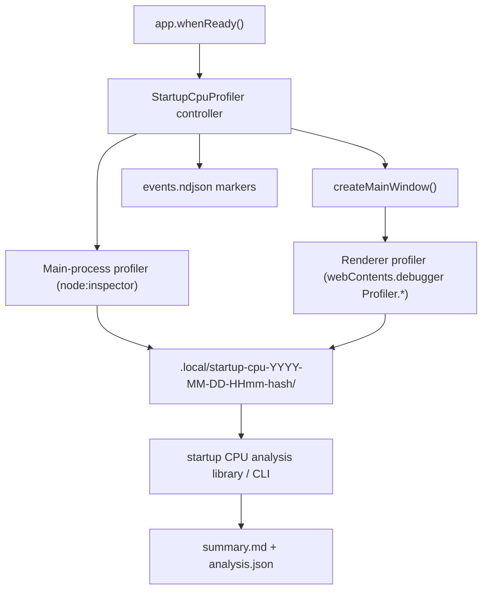
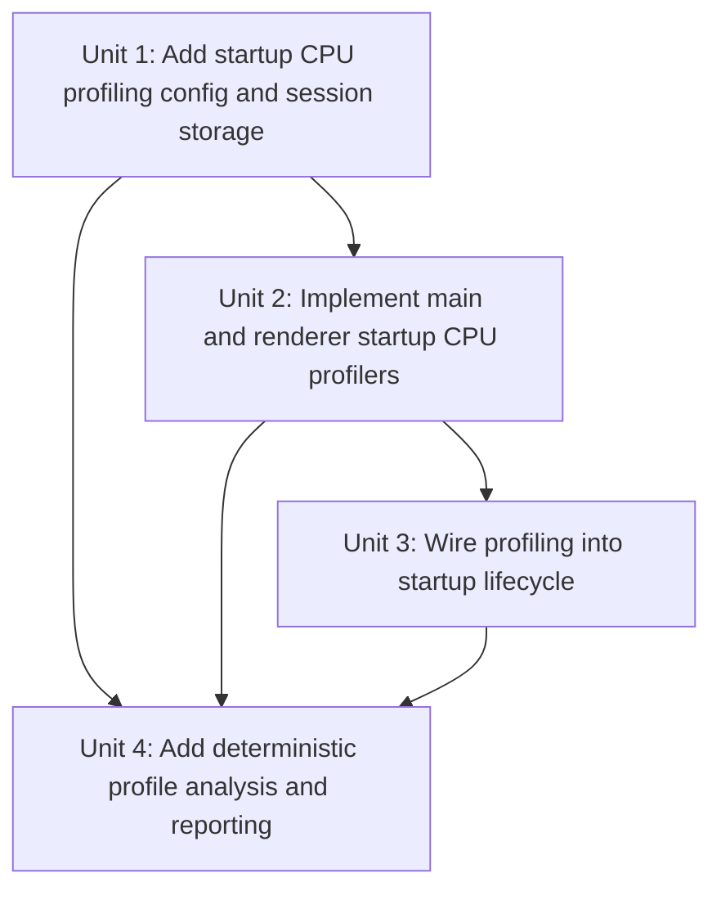

# feat: Add desktop startup CPU profiling and analysis

## Overview

Add an opt-in startup CPU profiling workflow for the desktop app that captures bounded CPU profiles for the main and renderer processes, stores them in one repo-local session directory, and generates a ranked analysis summary that points at the biggest startup hotspots.

The goal of this work is to stop guessing. The previous startup fixes reduced CPU time materially, but the app still spends about five CPU seconds during startup. The next pass should be driven by captured evidence, not another round of speculative optimizations.

## Problem Frame

The current desktop startup issue has moved from obvious refresh churn to a narrower set of remaining hotspots. We now need tooling that can answer:

- which process is still spending the CPU budget
- which functions or modules dominate startup time
- whether the work is app-owned JavaScript, Electron/Chromium internals, or both
- which codepaths deserve the first optimization pass

The repo already has a strong diagnostics precedent in the existing heap-monitoring path under [`apps/desktop/src/main/diagnostics/`](/Users/huntharo/.codex/worktrees/2f1c/PwrAgnt/apps/desktop/src/main/diagnostics), plus bootstrap coverage in [`apps/desktop/src/main/__tests__/app-bootstrap.test.ts`](/Users/huntharo/.codex/worktrees/2f1c/PwrAgnt/apps/desktop/src/main/__tests__/app-bootstrap.test.ts). This plan should reuse that shape rather than inventing a second unrelated diagnostics subsystem.

This is a follow-up to the completed startup stability work in [`docs/plans/2026-04-19-001-fix-desktop-startup-thread-stability-plan.md`](/Users/huntharo/.codex/worktrees/2f1c/PwrAgnt/docs/plans/2026-04-19-001-fix-desktop-startup-thread-stability-plan.md). That work reduced redundant startup activity, but the remaining issue now needs direct CPU evidence.

## Requirements Trace

- R1. The desktop app must support an opt-in startup CPU profiling mode that leaves normal startup behavior unchanged when disabled.
- R2. One profiling run must capture bounded startup CPU profiles for both the Electron main process and the first renderer window involved in app startup.
- R3. The capture window must include the startup/connect period that still consumes about five CPU seconds, not just steady-state post-startup behavior.
- R4. Each profiling run must persist raw artifacts in a deterministic repo-local session directory under `.local/`.
- R5. Each session must also include machine-readable and human-readable analysis output that ranks the biggest contributors by process, function, and source/module grouping.
- R6. The analysis output must be actionable enough to guide the first optimization pass without requiring a human to manually inspect raw `.cpuprofile` files first.
- R7. Profiling failures or debugger detachment must degrade safely: diagnostics can fail, but app startup must continue.
- R8. The implementation must come with targeted tests and a documented repro workflow so future startup regressions can be profiled the same way.
- R9. This plan must not pre-commit to concrete optimization file targets before a real captured session exists; evidence comes first, fixes second.

## Scope Boundaries

- In scope: opt-in startup CPU profile capture for main and renderer processes.
- In scope: session-directory layout, event logging, raw profile storage, and generated analysis summary artifacts.
- In scope: bootstrap wiring, bounded capture windows, and safe shutdown behavior.
- In scope: documentation for capturing and reviewing a startup session.
- Out of scope: guessing the actual optimization patches before a profile exists.
- Out of scope: always-on production telemetry, remote upload, or UI for browsing profile sessions.
- Out of scope: general-purpose performance tracing for every desktop workflow; this is startup-focused.
- Out of scope: a full diagnostics unification refactor across heap and CPU tooling unless implementation proves a small shared helper is necessary.

## Context & Research

### Relevant Code and Patterns

- [`apps/desktop/src/main/window.ts`](/Users/huntharo/.codex/worktrees/2f1c/PwrAgnt/apps/desktop/src/main/window.ts) already owns the main window lifecycle, attaches renderer diagnostics, and is the natural place to attach renderer CPU profiling before and through first load.
- [`apps/desktop/src/main/index.ts`](/Users/huntharo/.codex/worktrees/2f1c/PwrAgnt/apps/desktop/src/main/index.ts) is the earliest stable app bootstrap boundary after `app.whenReady()`, and is the right seam for starting main-process profiling before window creation and IPC registration.
- [`apps/desktop/src/main/diagnostics/heap-monitor-config.ts`](/Users/huntharo/.codex/worktrees/2f1c/PwrAgnt/apps/desktop/src/main/diagnostics/heap-monitor-config.ts) shows the existing opt-in env-config pattern for diagnostics flags and tuning.
- [`apps/desktop/src/main/diagnostics/heap-session.ts`](/Users/huntharo/.codex/worktrees/2f1c/PwrAgnt/apps/desktop/src/main/diagnostics/heap-session.ts) shows the repo’s current pattern for repo-local diagnostics session directories, manifests, append-only logs, and artifact registration.
- [`apps/desktop/src/main/diagnostics/renderer-heap-monitor.ts`](/Users/huntharo/.codex/worktrees/2f1c/PwrAgnt/apps/desktop/src/main/diagnostics/renderer-heap-monitor.ts) already uses `webContents.debugger`, including attach/detach handling, and is the best local pattern for renderer-owned CPU capture.
- [`apps/desktop/src/main/diagnostics/main-process-heap-monitor.ts`](/Users/huntharo/.codex/worktrees/2f1c/PwrAgnt/apps/desktop/src/main/diagnostics/main-process-heap-monitor.ts) shows the repo’s pattern for a main-process diagnostics sidecar with bounded timers and on-disk session logging.
- [`apps/desktop/src/main/__tests__/app-bootstrap.test.ts`](/Users/huntharo/.codex/worktrees/2f1c/PwrAgnt/apps/desktop/src/main/__tests__/app-bootstrap.test.ts) already mocks `BrowserWindow`, `webContents.debugger`, and diagnostics bootstrap, which gives this work an existing integration-test seam.
- [`apps/desktop/package.json`](/Users/huntharo/.codex/worktrees/2f1c/PwrAgnt/apps/desktop/package.json) and the existing scripts under [`apps/desktop/scripts/`](/Users/huntharo/.codex/worktrees/2f1c/PwrAgnt/apps/desktop/scripts) show the preferred pattern for small repo-local analysis CLIs using `tsx`.
- [`README.md`](/Users/huntharo/.codex/worktrees/2f1c/PwrAgnt/README.md) already documents heap diagnostics, so startup CPU profiling should extend the same operational section instead of creating a separate doc.

### Institutional Learnings

- [`docs/plans/2026-04-18-001-feat-desktop-heap-diagnostics-plan.md`](/Users/huntharo/.codex/worktrees/2f1c/PwrAgnt/docs/plans/2026-04-18-001-feat-desktop-heap-diagnostics-plan.md) established a good local rule: diagnostics are main-process-owned, opt-in, file-backed, and must not destabilize startup when off or when capture fails.
- [`docs/plans/2026-04-19-001-fix-desktop-startup-thread-stability-plan.md`](/Users/huntharo/.codex/worktrees/2f1c/PwrAgnt/docs/plans/2026-04-19-001-fix-desktop-startup-thread-stability-plan.md) already reduced known churn sources. The remaining startup CPU work should now be evidence-first rather than another hypothesis-only pass.
- No relevant `docs/solutions/` artifact exists yet for startup CPU profiling or `.cpuprofile` analysis in this repo.

### External References

- Electron `Debugger` API, including attach/detach and `sendCommand()` for Chrome DevTools Protocol methods: [electronjs.org/docs/latest/api/debugger](https://www.electronjs.org/docs/latest/api/debugger)
- Electron `contentTracing`, which records cross-process Chromium trace data and is relevant as an alternative approach: [electronjs.org/docs/latest/api/content-tracing](https://www.electronjs.org/docs/latest/api/content-tracing/)
- Node inspector CPU profiler example using `Profiler.enable`, `Profiler.start`, and `Profiler.stop`: [nodejs.org/docs/api/inspector.html](https://nodejs.org/download/release/v24.1.0/docs/api/inspector.html)
- Electron performance guidance noting that `.cpuprofile` artifacts can be analyzed in Chrome DevTools and emphasizing blocking-I/O / renderer-hot-path diagnosis: [electronjs.org/docs/latest/tutorial/performance](https://www.electronjs.org/docs/latest/tutorial/performance)

## Key Technical Decisions

- **Capture both main and renderer startup CPU, not just one side.** The remaining startup cost could still be split across the Electron main process and the renderer’s initial navigation/connect path. Profiling only one side risks another misleading partial fix.
- **Keep startup CPU profiling opt-in and bounded.** This follows the existing heap diagnostics philosophy and limits observer effect. One bounded startup window is enough for this regression; always-on profiling is not.
- **Store raw `.cpuprofile` artifacts plus a generated summary in one session directory.** The summary makes the workflow repeatable and actionable, while the raw profiles preserve full-fidelity evidence for deeper inspection in DevTools.
- **Prefer raw CPU profiles over `contentTracing` for the first pass.** `contentTracing` can capture more of Chromium’s cross-process timeline, but it produces larger, more general traces and weaker direct JavaScript hotspot attribution. For this startup problem, main/renderer `.cpuprofile` artifacts are a better first tool. This is an inference from the official docs and the repo’s current CPU-focused need.
- **Reuse diagnostics patterns, but do not force a generic diagnostics refactor up front.** The heap diagnostics modules already provide good patterns for env config, session directories, logging, and lifecycle wiring. Reusing those ideas is good; turning everything into a generalized observability framework before the first startup CPU capture is not.
- **Generate a ranked findings artifact automatically at the end of capture.** The user wants to fix the biggest contributors we actually find. That means the profiling path should produce a stable summary that names the dominant stacks/modules and makes the next optimization pass obvious.
- **Do not pre-plan concrete optimization patches before evidence exists.** This plan should produce the evidence needed for the optimization pass, but specific fix file targets must come from the first captured startup session.

## Alternative Approaches Considered

- **Use `contentTracing` as the only artifact source.** Rejected for the first pass because it captures much broader data than needed and is less direct for ranking JavaScript hotspots by function and module ownership.
- **Rely on manual DevTools profiling only.** Rejected because it is not reproducible enough for repeated regressions, and it collides with the existing use of `webContents.debugger` patterns already in the repo.
- **Profile renderer only.** Rejected because prior fixes already touched both main-process and renderer-side startup paths; the remaining five CPU seconds may still span both.
- **Refactor heap and CPU diagnostics into one abstract framework immediately.** Rejected because it increases scope before we have even captured the first actionable startup CPU session.

## Open Questions

### Resolved During Planning

- **Should this capture main, renderer, or both?** Both. Startup cost is still distributed enough that a one-sided profile would be risky.
- **Should the first pass use `contentTracing`?** No. Raw `.cpuprofile` capture plus an automated summary is the better first instrument for this specific problem.
- **Should the analysis be manual-only?** No. The workflow should generate an on-disk summary automatically or via a lightweight repo-local script so contributors do not need to hand-inspect every raw profile first.
- **Should this reuse the existing diagnostics shape?** Yes. The plan should reuse the heap-diagnostics conventions for env config, repo-local session output, and bootstrap testing rather than inventing a new style.
- **Should the plan pre-commit to concrete fix files now?** No. The optimization pass must be driven by the first captured startup profile, not by further intuition.

### Deferred to Implementation

- The exact default capture window, including whether stop timing should be a fixed post-load timeout, a configurable window after `did-finish-load`, or a small two-stage combination.
- Whether the generated analysis should group stacks by source URL only, by normalized repo file path, or by both.
- Whether the first pass should automatically regenerate the summary at capture stop time, expose a CLI-only analysis path, or do both.
- Whether a later follow-up should add optional `contentTracing` support for cases where raw CPU profiles show most time in Chromium/Electron internals rather than app-owned JavaScript.

## High-Level Technical Design

> *This illustrates the intended approach and is directional guidance for review, not implementation specification. The implementing agent should treat it as context, not code to reproduce.*



| Artifact | Purpose | Consumer |
|---|---|---|
| `main.cpuprofile` | Raw V8 CPU profile for the Electron main process during startup | DevTools or repo-local analyzer |
| `renderer.cpuprofile` | Raw CPU profile for the first renderer window during startup | DevTools or repo-local analyzer |
| `events.ndjson` | Startup phase markers, profiler start/stop, detach/failure notes | Analyzer and humans |
| `session.json` | Manifest with timing/config/session metadata | Analyzer and later repro comparison |
| `analysis.json` | Machine-readable ranked hotspot output | Future tooling and regression comparison |
| `summary.md` | Human-readable top contributors with likely owner files/modules | The next optimization pass |

## Implementation Units



- [x] **Unit 1: Add startup CPU profiling config and session storage**

**Goal:** Define the opt-in configuration and repo-local artifact layout for one startup CPU profiling run.

**Requirements:** R1, R3, R4, R7, R8

**Dependencies:** None

**Files:**
- Create: `apps/desktop/src/main/diagnostics/startup-cpu-profile-config.ts`
- Create: `apps/desktop/src/main/diagnostics/startup-cpu-profile-session.ts`
- Modify: `README.md`
- Test: `apps/desktop/src/main/__tests__/startup-cpu-profile-session.test.ts`

**Approach:**
- Follow the same opt-in env-config pattern already used by heap diagnostics, but define startup-CPU-specific flags and naming so the workflow is independently discoverable.
- Create a dedicated session directory layout under `.local/` for startup CPU runs, with a manifest, raw profile file registration, and append-only event logging.
- Include enough metadata in the manifest to make profiles interpretable later: created-at timestamp, configured startup window, relevant app versions, output file names, and whether profiling completed cleanly.
- Keep the implementation CPU-specific rather than prematurely generalizing the heap session writer. Reuse the same structural ideas and naming discipline.

**Execution note:** Start with failing unit tests around env parsing, directory naming, manifest writing, and append-only event output before wiring the live profilers.

**Patterns to follow:**
- `apps/desktop/src/main/diagnostics/heap-monitor-config.ts`
- `apps/desktop/src/main/diagnostics/heap-session.ts`
- `apps/desktop/src/main/__tests__/heap-session.test.ts`

**Test scenarios:**
- Happy path: enabling startup CPU profiling resolves a config with deterministic defaults and a repo-local `.local/` output root.
- Happy path: creating a session writes one manifest and prepares paths for both main and renderer profile artifacts.
- Edge case: when profiling is disabled, the config resolves to an off state and does not create any output directory.
- Edge case: session creation succeeds when `.local/` does not already exist.
- Error path: a filesystem write failure returns a typed session-creation failure instead of crashing startup.

**Verification:**
- A developer can enable the feature and immediately get one deterministic startup CPU session directory under `.local/` with a manifest and event log targets ready for profiler output.

- [x] **Unit 2: Implement bounded main and renderer startup CPU profilers**

**Goal:** Capture raw `.cpuprofile` artifacts for the main process and first renderer window during the bounded startup window.

**Requirements:** R1, R2, R3, R4, R7

**Dependencies:** Unit 1

**Files:**
- Create: `apps/desktop/src/main/diagnostics/main-process-cpu-profiler.ts`
- Create: `apps/desktop/src/main/diagnostics/renderer-startup-cpu-profiler.ts`
- Modify: `apps/desktop/src/main/diagnostics/startup-cpu-profile-session.ts`
- Test: `apps/desktop/src/main/__tests__/main-process-cpu-profiler.test.ts`
- Test: `apps/desktop/src/main/__tests__/renderer-startup-cpu-profiler.test.ts`

**Approach:**
- Implement the main-process CPU profiler with Node’s inspector session using `Profiler.enable`, `Profiler.start`, and `Profiler.stop`, writing the returned profile JSON to disk as `main.cpuprofile`.
- Implement the renderer profiler using `webContents.debugger` and the DevTools Protocol `Profiler.*` commands, following the same attach/detach safety patterns already used by `RendererHeapMonitor`.
- Keep both profilers bounded to a startup-focused capture window rather than a recurring monitor. This is capture-once startup evidence, not continuous profiling.
- Record start/stop, attach, detach, and failure markers in the session event log so later analysis can distinguish real hotspots from incomplete captures.
- Allow either side to fail independently: a renderer attach failure should still preserve the main profile, and vice versa.

**Technical design:** *(directional guidance, not implementation specification)*

```text
main:
  connect inspector
  Profiler.enable
  Profiler.start
  ...startup window...
  Profiler.stop -> write main.cpuprofile

renderer:
  attach webContents.debugger before load
  Profiler.enable
  Profiler.start
  ...through first renderer load + bounded post-load window...
  Profiler.stop -> write renderer.cpuprofile
```

**Patterns to follow:**
- `apps/desktop/src/main/diagnostics/renderer-heap-monitor.ts`
- `apps/desktop/src/main/diagnostics/main-process-heap-monitor.ts`
- `apps/desktop/src/main/window.ts`

**Test scenarios:**
- Happy path: the main-process profiler starts, stops, and writes a valid `main.cpuprofile` artifact once the startup window closes.
- Happy path: the renderer profiler attaches through `webContents.debugger`, captures the startup window, and writes `renderer.cpuprofile`.
- Edge case: if the renderer debugger is already attached or later detached, the profiler records the event and degrades cleanly without crashing startup.
- Edge case: window close or render-process-gone before the normal stop point still yields a partial-but-valid session with explicit failure/stop markers.
- Error path: a `Profiler.stop` failure on either process records an error event and preserves whatever other artifacts were successfully captured.
- Integration: one enabled startup run writes both profile files plus matching start/stop events in the same session directory.

**Verification:**
- One opt-in startup run produces bounded raw CPU profile artifacts for both processes without taking down the app when profiling fails on one side.

- [x] **Unit 3: Wire profiling into the desktop startup lifecycle**

**Goal:** Start profiling early enough to capture the real startup/connect hotspot window and stop it cleanly once startup has settled.

**Requirements:** R2, R3, R7, R8

**Dependencies:** Unit 2

**Files:**
- Create: `apps/desktop/src/main/diagnostics/startup-cpu-profiler.ts`
- Modify: `apps/desktop/src/main/index.ts`
- Modify: `apps/desktop/src/main/window.ts`
- Modify: `apps/desktop/src/main/__tests__/app-bootstrap.test.ts`
- Test: `apps/desktop/src/main/__tests__/startup-cpu-profiler.test.ts`

**Approach:**
- Add a small startup-profiling controller that owns one session, one main-process profiler, and one renderer profiler for the first main window.
- Start the main-process profiler at the earliest practical bootstrap point after `app.whenReady()` and before the expensive startup/bootstrap path continues.
- Attach the renderer profiler before the first window navigation begins so the capture includes renderer initialization and the remaining Codex-connect startup work.
- Stop both profilers after a bounded post-load startup window, while still handling early termination paths such as `render-process-gone`, `did-fail-load`, or window close.
- Emit startup phase markers into the event log so the later analyzer can distinguish early app bootstrap, first renderer load, and post-load warmup/connect activity.

**Patterns to follow:**
- `apps/desktop/src/main/index.ts`
- `apps/desktop/src/main/window.ts`
- `apps/desktop/src/main/__tests__/app-bootstrap.test.ts`

**Test scenarios:**
- Happy path: enabling startup CPU profiling starts main profiling before window creation and renderer profiling before the first navigation, then stops both after the bounded startup window.
- Happy path: the bootstrap path logs the session directory so a developer can immediately find the artifacts from the terminal output.
- Edge case: when profiling is disabled, startup bootstrap remains unchanged and no profiler/controller is created.
- Edge case: when a second window is opened later, the profiling controller does not incorrectly restart a fresh startup capture.
- Error path: startup continues even if session creation or one profiler bootstrap step fails.
- Integration: app bootstrap tests prove the profiling controller composes with the existing heap diagnostics and window lifecycle rather than replacing them.

**Verification:**
- A developer can enable startup CPU profiling, launch the desktop app once, and reliably get a single startup-focused capture session for the first window without manual DevTools steps.

- [x] **Unit 4: Add deterministic CPU profile analysis and reporting**

**Goal:** Turn raw `.cpuprofile` artifacts into an actionable ranked hotspot summary that can drive the next optimization pass.

**Requirements:** R4, R5, R6, R8, R9

**Dependencies:** Units 1-3

**Files:**
- Create: `apps/desktop/src/main/diagnostics/startup-cpu-analysis.ts`
- Create: `apps/desktop/scripts/analyze-startup-cpu-profile.ts`
- Modify: `apps/desktop/package.json`
- Modify: `README.md`
- Test: `apps/desktop/src/main/__tests__/startup-cpu-analysis.test.ts`

**Approach:**
- Add a small analysis library that reads one startup session directory, parses `main.cpuprofile` and `renderer.cpuprofile`, and computes ranked hotspot summaries by self time and total time.
- Normalize frames into buckets that are useful for the repo: app-owned source files/modules when possible, Electron/Chromium internals when not, and an explicit “unmapped” bucket instead of silently dropping data.
- Emit both a machine-readable `analysis.json` and a human-readable `summary.md` in the session directory. The summary should call out the top contributors per process and a short “first optimization candidates” section grounded in the measured evidence.
- Expose the analyzer as a repo-local CLI so contributors can rerun summary generation after editing or sharing a session directory.
- Keep the output focused on ranking and attribution. It should not attempt automatic code rewriting or pretend to know the final fix, but it should make the next optimization target obvious.

**Execution note:** Implement this unit test-first with small fixture `.cpuprofile` inputs so ranking math and source bucketing are pinned down before wiring the CLI and session integration.

**Patterns to follow:**
- `apps/desktop/package.json`
- `apps/desktop/scripts/export-session-capture.ts`
- `README.md`

**Test scenarios:**
- Happy path: analyzing one session with both main and renderer profiles produces a stable `analysis.json` and `summary.md` with ranked contributors for each process.
- Happy path: grouped output correctly attributes app-owned frames to repo file/module paths when the profile contains resolvable URLs or script ids.
- Edge case: when one process profile is missing, analysis still succeeds for the other process and reports the partial capture explicitly.
- Edge case: Electron/Chromium internal frames are grouped separately rather than being mislabeled as repo-owned code.
- Error path: malformed or truncated `.cpuprofile` input yields a clear analysis failure message instead of a silent empty report.
- Integration: the summary’s top-ranked hotspots match the input profile weights closely enough that the next optimization candidate would be obvious to a reviewer.

**Verification:**
- One completed startup profile session ends with raw artifacts plus an actionable ranked summary that can be used to choose the first evidence-backed optimization target.

## System-Wide Impact

- **Interaction graph:** app bootstrap, main-window lifecycle, `webContents.debugger`, Node inspector sessions, and repo-local diagnostics output all become part of the startup profiling path.
- **Error propagation:** session creation, profiler attach/start/stop, and analysis failures must log to the diagnostics session and main logger without aborting normal startup.
- **State lifecycle risks:** the profiler controller must not leak active timers, attached debuggers, or inspector sessions after startup finishes or the window exits early.
- **API surface parity:** this plan intentionally avoids a new preload or renderer-facing diagnostics API; the first pass stays console/file driven, consistent with current heap diagnostics.
- **Integration coverage:** bootstrap wiring, early-stop behavior, and debugger-detach paths need integration coverage because isolated unit tests will not prove safe startup composition.
- **Unchanged invariants:** normal startup, thread navigation, transcript behavior, and existing heap diagnostics behavior must remain unchanged when startup CPU profiling is disabled.

## Risks & Dependencies

| Risk | Mitigation |
|------|------------|
| Profiling overhead perturbs startup enough to blur the real hotspot picture | Keep the feature opt-in, bounded to a short startup window, and document that comparisons should be made across similarly captured runs rather than against non-profiled wall time alone |
| `webContents.debugger` ownership conflicts with DevTools or other diagnostics | Reuse the existing detach-handling pattern, log ownership loss explicitly, and keep the first pass file-driven rather than requiring simultaneous DevTools attachment |
| Raw `.cpuprofile` artifacts are too noisy to identify repo-owned code quickly | Add an automated bucketing and ranking layer that separates repo-owned paths from Electron/Chromium internals and highlights the dominant app-owned contributors |
| The first captured session shows hotspots in code not yet named in this plan | Accept that outcome explicitly; this plan is designed to produce evidence, not to guess future fix files |
| Scope balloons into a generalized observability platform | Keep the implementation focused on startup capture, session writing, and analysis only; defer broader tracing or UI work |

## Documentation / Operational Notes

- Extend the existing README diagnostics section with a startup CPU profiling workflow adjacent to heap diagnostics.
- Document the environment flag(s), session directory naming, expected artifacts, and how to rerun the analyzer.
- The first optimization pass after this plan should be constrained to the top 1-3 hotspots called out in `summary.md`; additional speculative cleanups should be deferred until the evidence-backed fixes land.

## Sources & References

- Related plan: [2026-04-19-001-fix-desktop-startup-thread-stability-plan.md](/Users/huntharo/.codex/worktrees/2f1c/PwrAgnt/docs/plans/2026-04-19-001-fix-desktop-startup-thread-stability-plan.md)
- Related plan: [2026-04-18-001-feat-desktop-heap-diagnostics-plan.md](/Users/huntharo/.codex/worktrees/2f1c/PwrAgnt/docs/plans/2026-04-18-001-feat-desktop-heap-diagnostics-plan.md)
- Related code: [window.ts](/Users/huntharo/.codex/worktrees/2f1c/PwrAgnt/apps/desktop/src/main/window.ts)
- Related code: [index.ts](/Users/huntharo/.codex/worktrees/2f1c/PwrAgnt/apps/desktop/src/main/index.ts)
- Related code: [heap-session.ts](/Users/huntharo/.codex/worktrees/2f1c/PwrAgnt/apps/desktop/src/main/diagnostics/heap-session.ts)
- External docs: [Electron Debugger API](https://www.electronjs.org/docs/latest/api/debugger/)
- External docs: [Electron contentTracing](https://www.electronjs.org/docs/latest/api/content-tracing/)
- External docs: [Node inspector CPU profiler](https://nodejs.org/download/release/v24.1.0/docs/api/inspector.html)
- External docs: [Electron performance guide](https://www.electronjs.org/docs/latest/tutorial/performance)
