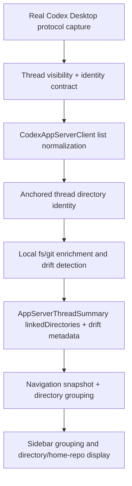
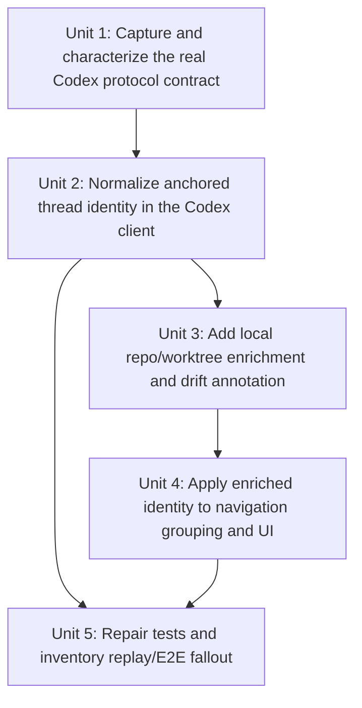

# fix: Restore Codex Desktop protocol parity for thread directory identity

## Overview

Restore Codex Desktop parity for sidebar thread visibility, directory grouping, and home-repo/worktree linking without reading rollout files. The runtime contract must come from observed Codex app-server protocol behavior first, with local filesystem and git inspection used only as secondary enrichment and drift detection.

## Problem Frame

The desktop app previously achieved better grouping quality by reading rollout files directly. Removing that access fixed the integration boundary and removed a startup CPU hotspot, but it also exposed that the current Codex client is still approximating thread identity from incomplete list-time metadata. The result is the exact gap described in the requirements doc: runtime parity regressed even though the rollout-file removal itself was correct.

This is now a protocol-parity problem, not a rollout-replacement problem. The app needs to learn what Codex Desktop actually requests, which list-time fields it uses to decide thread visibility and directory identity, and how it derives the home repo for worktree-backed threads. Only after that identity is anchored should local git inspection refine repo/worktree linking and annotate branch drift.

## Requirements Trace

- R1, R2, R3, R4. Re-establish Codex parity from supported protocol traffic and keep rollout files completely out of the client.
- R5, R6, R7. Match Codex Desktop's visible non-archived thread set and derive correct grouping directly from startup/sidebar data.
- R8, R9, R10, R11. Anchor each thread to Codex's original worktree/CWD identity, then use local filesystem and git inspection only as secondary enrichment.
- R12, R13, R14. Detect local drift relative to Codex's last-known branch/worktree state without silently re-homing threads.
- R15, R16. Treat runtime parity as the acceptance gate while still identifying the exact unit, replay, and E2E fallout caused by rollout removal.

## Scope Boundaries

- No rollout-file reads, fallback rollout metadata, or "temporary" protocol escape hatches.
- No thread re-homing because the same branch exists in another worktree.
- No requirement to refresh replay fixtures or E2E captures as part of the acceptance gate for this pass.
- No broad redesign of app-server thread contracts beyond the fields needed for Codex parity and drift display.

## Context & Research

### Relevant Code and Patterns

- `apps/desktop/src/main/codex-app-server/client.ts` currently owns thread discovery, payload fallback order, field extraction, and immediate linked-directory resolution. It is the core parity seam.
- `apps/desktop/src/main/testing/protocol-capture.ts` and `apps/desktop/src/main/testing/capture-store.ts` already provide a real protocol capture path for requests, responses, and notifications. That tooling should drive the first implementation unit instead of inventing new instrumentation.
- `apps/desktop/src/main/testing/replay-client.ts` and `apps/desktop/e2e/fixtures/README.md` show where replay fixtures and E2E captures depend on the current protocol assumptions.
- `apps/desktop/src/main/app-server/backend-registry.ts` is the composition boundary where Codex thread summaries enter the rest of the desktop app.
- `packages/agent-core/src/domain/navigation-state.ts` and `packages/agent-core/src/domain/directory-navigation.ts` own grouping behavior after linked directories are resolved. The current classifier still treats Codex worktrees as separate rows keyed by their worktree path.
- `packages/agent-core/src/__tests__/directory-navigation.test.ts` currently encodes that "same-named Codex worktrees stay separate" behavior, which is likely incompatible with the required home-repo parity.
- `apps/desktop/src/main/app-server/git-directory-service.ts` already provides bounded git inspection and status caching. It is the natural place to extend local branch/worktree drift annotation rather than spawning ad hoc git calls from the renderer.

### Institutional Learnings

- The startup CPU profiling work already identified rollout parsing and git process spawning inside the main process as a material startup hotspot. Any parity fix needs to preserve that startup win and avoid reintroducing eager per-thread filesystem churn.
- The recent thread-refresh work established that startup/sidebar behavior must remain cheap and stable; grouping correctness cannot come from repeatedly rereading full thread detail.
- No `docs/solutions/` artifact currently documents the Codex protocol contract for thread visibility or directory identity, so this plan must treat real captured protocol traffic as the immediate source of truth.

### External References

- None. This work depends on local repo behavior and observed Codex protocol traffic, not third-party library research.

## Key Technical Decisions

- **Protocol evidence comes first.** The first implementation unit must characterize real Codex Desktop request/response/notification traffic before changing runtime assumptions in `CodexAppServerClient`.
- **Separate protocol identity from local enrichment.** The current client blends list parsing, project-key inference, and linked-directory git probing too early. The fix should split "what Codex says this thread belongs to" from "what the local filesystem says about that anchored path now."
- **List-time correctness is mandatory.** Directory grouping and thread visibility must be correct from startup/sidebar data. `thread/read` can validate or deepen details later, but it cannot be the first source of grouping truth.
- **Anchored identity wins over local heuristics.** If protocol-derived identity and local inspection disagree, preserve the protocol-chosen association and surface the disagreement as drift.
- **Runtime parity precedes fixture parity.** Broken fixtures and tests need to be inventoried during implementation, but replay refresh is follow-up work after the runtime contract is correct.

## Alternative Approaches Considered

- **Replace rollout reads with more aggressive local filesystem or git heuristics.** Rejected because it would keep the wrong integration boundary and could still drift away from Codex Desktop's real thread set.
- **Delay grouping until `thread/read` after selection.** Rejected because the requirements explicitly call for startup/sidebar correctness before a thread is opened.
- **Continue treating Codex worktrees as separate directory rows by path.** Rejected as the default assumption because the required behavior is parity with Codex Desktop's home-repo/worktree relationship, not preservation of the current local classifier.

## Open Questions

### Resolved During Planning

- **Can rollout files be used as a fallback if protocol fields are incomplete?** No.
- **Can local git inspection still be used?** Yes, but only after protocol establishes the canonical thread association.
- **Can branch matches in another worktree move a thread?** No. Drift is annotated, not re-homed.
- **Is runtime grouping parity or fixture refresh the acceptance gate?** Runtime parity.

### Deferred to Implementation

- Which exact `thread/list`, `thread/loaded/list`, and notification sequence Codex Desktop uses to define the visible non-archived thread set.
- Which concrete list-time fields carry the home-repo/worktree identity needed for grouping parity.
- What minimal shared-contract additions are required to represent anchored-directory drift cleanly in the desktop UI.

## High-Level Technical Design

> This is directional guidance for review. The implementing agent should treat it as design context, not literal code to reproduce.

| Layer | Responsibility | Must not do |
|---|---|---|
| Protocol characterization | Identify actual Codex Desktop list/filter/notification contract | Guess from rollout files |
| Codex client normalization | Convert protocol payloads into anchored thread identity | Resolve grouping from branch-only heuristics |
| Local git enrichment | Map anchored paths to repo/worktree/home-repo relationships and drift state | Reassign a thread to a different worktree |
| Navigation grouping | Group threads the way Codex Desktop presents them | Treat every Codex worktree path as inherently distinct |

## Implementation Units

- [x] **Unit 1: Capture and characterize the real Codex protocol contract**

**Goal:** Turn real Codex Desktop app-server traffic into a concrete contract for thread visibility, list-time identity fields, and relevant notifications.

**Requirements:** R1, R2, R4, R5, R6, R7

**Dependencies:** None

**Files:**
- Create: `apps/desktop/scripts/analyze-codex-thread-protocol.ts`
- Modify: `apps/desktop/src/main/testing/capture-store.ts`
- Modify: `apps/desktop/src/main/__tests__/protocol-capture.test.ts`
- Create: `apps/desktop/src/main/__tests__/codex-thread-protocol-analysis.test.ts`

**Approach:**
- Reuse the existing protocol-capture path to record a real Codex Desktop session that includes startup/sidebar thread loading and thread switching.
- Add a small repo-local analyzer that reads capture JSONL and summarizes the exact request methods, payload variants, response fields, and notifications touching thread visibility and directory identity.
- Make the analyzer explicitly report candidate identity fields such as `cwd`, `projectKey`, `gitInfo`, session metadata, and any home-repo/worktree hints so implementation work is driven by evidence rather than memory.
- Capture which request variants correspond to non-archived thread visibility and whether Codex Desktop relies on list-time notifications or a second list/read pass to refine the sidebar.

**Patterns to follow:**
- `apps/desktop/src/main/testing/protocol-capture.ts`
- `apps/desktop/src/main/testing/capture-store.ts`
- `apps/desktop/e2e/fixtures/README.md`

**Test scenarios:**
- Happy path: a capture containing `thread/list`, `thread/loaded/list`, and notifications can be summarized into a deterministic analysis output.
- Happy path: the analyzer identifies list payload keys and result fields used for identity extraction.
- Edge case: captures that lack one expected method still produce a partial summary instead of failing silently.
- Error path: malformed capture records are reported clearly and excluded from the final contract summary.

**Verification:**
- One checked-in analysis path can answer, from captured traffic, which methods and fields Codex Desktop actually uses for visible-thread selection and directory identity.

- [x] **Unit 2: Normalize anchored thread identity in the Codex client**

**Goal:** Update `CodexAppServerClient` so thread visibility and directory identity come from the observed protocol contract, not current approximations.

**Requirements:** R1, R3, R4, R5, R6, R7, R8

**Dependencies:** Unit 1

**Files:**
- Modify: `apps/desktop/src/main/codex-app-server/client.ts`
- Modify: `apps/desktop/src/main/__tests__/codex-client.test.ts`
- Create: `apps/desktop/src/main/codex-app-server/codex-thread-identity.ts`
- Create: `apps/desktop/src/main/__tests__/codex-thread-identity.test.ts`

**Approach:**
- Introduce a small normalization layer that extracts anchored thread identity from the actual list-time protocol fields and keeps that logic separate from linked-directory probing.
- Adjust thread discovery request ordering and filter payload shapes to mirror the captured Codex Desktop sequence for visible non-archived threads.
- Preserve the no-rollout invariant in both code and tests by keeping rollout access out of the identity path entirely.
- Keep archived metadata hydration only if the captured protocol contract shows it is part of Codex Desktop's visibility logic; otherwise reduce unnecessary list calls.

**Patterns to follow:**
- `apps/desktop/src/main/codex-app-server/client.ts`
- `apps/desktop/src/main/__tests__/codex-client.test.ts`

**Test scenarios:**
- Happy path: the client sends the same thread-list payload variants the captured contract requires for visible non-archived threads.
- Happy path: list-time protocol metadata yields a stable anchored identity for a worktree-backed thread before `thread/read`.
- Edge case: missing identity fields leave the thread explicitly unlinked rather than inferring from unsupported local metadata.
- Regression: the client never reads rollout files, even when list payloads contain only partial directory metadata.

**Verification:**
- The Codex client can build the same startup/sidebar thread set and anchored identity Codex Desktop uses without any rollout access.

- [x] **Unit 3: Add local repo/worktree enrichment and drift annotation**

**Goal:** Map anchored thread identity to the correct home-repo/worktree relationship locally and surface branch drift without changing the anchored association.

**Requirements:** R9, R10, R11, R12, R13, R14

**Dependencies:** Unit 2

**Files:**
- Create: `apps/desktop/src/main/codex-app-server/thread-directory-enricher.ts`
- Modify: `apps/desktop/src/main/app-server/git-directory-service.ts`
- Modify: `packages/shared/src/contracts/app-server.ts`
- Create: `apps/desktop/src/main/__tests__/thread-directory-enricher.test.ts`
- Create: `apps/desktop/src/main/__tests__/git-directory-service.test.ts`

**Approach:**
- Resolve anchored protocol identity into linked directory summaries that distinguish the active worktree path from the home repo path where the local git layout makes that possible.
- Reuse bounded git inspection and caching so parity fixes do not recreate the original startup CPU problem with eager per-thread git churn.
- Extend directory/git metadata only enough to represent the drift state the UI needs: current branch, last-known branch when available, and an explicit divergence flag or reason.
- Keep all enrichment logic one-way: protocol picks the thread's home, local inspection only decorates that home with repo/worktree structure and drift.

**Patterns to follow:**
- `apps/desktop/src/main/app-server/git-directory-service.ts`
- `apps/desktop/src/main/codex-app-server/client.ts`

**Test scenarios:**
- Happy path: a Codex worktree path resolves to the expected home repo plus active worktree linkage.
- Happy path: if local git shows the anchored worktree branch changed, the returned metadata marks drift instead of moving the thread.
- Edge case: a matching branch found in another worktree does not change the anchored directory association.
- Edge case: missing local paths or git failures preserve protocol identity and degrade to explicit status-unavailable metadata.

**Verification:**
- Local enrichment produces Codex-like home-repo/worktree linking while preserving anchored thread identity under branch/worktree drift.

- [x] **Unit 4: Apply enriched identity to navigation grouping and UI**

**Goal:** Update grouping and directory display so the desktop sidebar matches Codex Desktop's directory/home-repo presentation.

**Requirements:** R7, R8, R9, R12, R13, R14, R15

**Dependencies:** Unit 3

**Files:**
- Modify: `packages/agent-core/src/domain/directory-navigation.ts`
- Modify: `packages/agent-core/src/domain/navigation-state.ts`
- Modify: `packages/agent-core/src/__tests__/directory-navigation.test.ts`
- Modify: `apps/desktop/src/renderer/src/features/navigation/DirectoriesList.tsx`
- Modify: `apps/desktop/src/renderer/src/features/navigation/ThreadMetaChips.tsx`
- Modify: `apps/desktop/src/renderer/src/features/navigation/Sidebar.tsx`
- Test: `apps/desktop/src/renderer/src/__tests__/app-shell.test.tsx`

**Approach:**
- Change directory classification so Codex worktree-backed threads group under the same canonical directory/home-repo identity Codex Desktop uses rather than defaulting to raw worktree-path separation.
- Pass through enough enriched metadata for the renderer to show the correct home repo, active worktree context, and branch drift warning where appropriate.
- Keep the grouping contract stable for non-Codex and launchpad directories; this plan is about parity, not a broad cross-backend navigation rewrite.
- Update renderer tests to assert immediate startup grouping correctness from thread-list data instead of relying on post-selection behavior.

**Patterns to follow:**
- `packages/agent-core/src/domain/directory-navigation.ts`
- `packages/agent-core/src/__tests__/directory-navigation.test.ts`
- `apps/desktop/src/renderer/src/features/navigation/DirectoriesList.tsx`

**Test scenarios:**
- Happy path: two threads from worktrees belonging to the same home repo group the way Codex Desktop groups them.
- Happy path: directory grouping is correct before any `thread/read` call for the selected thread.
- Edge case: unlinked threads remain in the unlinked bucket when protocol identity is absent.
- Edge case: drift state is visible in the UI without changing the directory row the thread belongs to.

**Verification:**
- Sidebar grouping and directory metadata match Codex Desktop's home-repo/worktree presentation from startup data alone.

- [x] **Unit 5: Repair tests and inventory replay/E2E fallout**

**Goal:** Update the runtime test suite to the new parity contract and explicitly identify which replay fixtures and E2E scenarios no longer match after rollout removal.

**Requirements:** R3, R15, R16

**Dependencies:** Units 2 and 4

**Files:**
- Modify: `apps/desktop/src/main/__tests__/codex-client.test.ts`
- Modify: `apps/desktop/src/main/testing/replay-client.ts`
- Modify: `apps/desktop/e2e/fixtures/README.md`
- Modify: affected desktop renderer and main-process tests discovered during implementation
- Create: `docs/solutions/` artifact only if implementation reveals a stable reusable protocol pattern worth capturing

**Approach:**
- Update unit and integration tests so they assert protocol-derived identity, no-rollout behavior, and startup grouping parity.
- Run targeted replay and E2E-related checks to identify which captured fixtures still encode rollout-era assumptions.
- Record fixture fallout precisely so a later fixture-refresh pass can be narrow and deliberate instead of regenerating every desktop artifact blindly.
- Leave fixture regeneration out of this pass unless a specific targeted fixture update is required to keep critical parity tests meaningful.

**Patterns to follow:**
- `apps/desktop/src/main/testing/replay-client.ts`
- `apps/desktop/e2e/fixtures/README.md`
- `apps/desktop/src/main/__tests__/codex-client.test.ts`

**Test scenarios:**
- Happy path: unit and integration tests cover no-rollout identity extraction and home-repo grouping.
- Edge case: replay fixtures with missing parity fields fail in a way that points directly at the stale fixture assumption.
- Regression: tests protect against reintroducing eager startup directory probing across the entire visible thread list.

**Verification:**
- The repo has an updated parity-focused runtime test surface plus a clear inventory of replay and E2E artifacts that need follow-up refresh.

## Risks and Mitigations

- **Risk: captured protocol traffic still appears ambiguous.** Mitigation: make Unit 1 produce an explicit unknowns report so implementation blocks on evidence instead of silently filling gaps with heuristics.
- **Risk: local git enrichment reintroduces startup CPU cost.** Mitigation: keep enrichment bounded, cached, and downstream of protocol identity normalization rather than probing every possible fallback path.
- **Risk: grouping changes destabilize non-Codex navigation behavior.** Mitigation: constrain classifier changes to the Codex worktree/home-repo path and keep existing launchpad and local-directory tests in place.
- **Risk: renderer/UI drift state becomes under-specified.** Mitigation: add the smallest shared-contract fields needed for explicit drift representation rather than burying that state inside label strings.

## Verification Strategy

- Compare desktop runtime behavior against a real Codex Desktop session captured through the existing protocol tooling.
- Keep targeted unit coverage around protocol normalization, directory enrichment, and directory grouping.
- Run the affected desktop main-process and renderer tests after each parity unit lands.
- Treat replay/E2E breakage as an inventory output for this pass unless a specific stale fixture blocks confidence in the runtime contract.

## Suggested Execution Order

1. Capture and analyze real Codex Desktop traffic for startup/sidebar thread loading.
2. Update `CodexAppServerClient` to match the observed list/filter/identity contract.
3. Add local repo/worktree enrichment and drift annotation behind the anchored protocol identity.
4. Update navigation grouping and renderer display to consume the enriched identity.
5. Repair tests and document replay/E2E fallout for the follow-up fixture pass.
