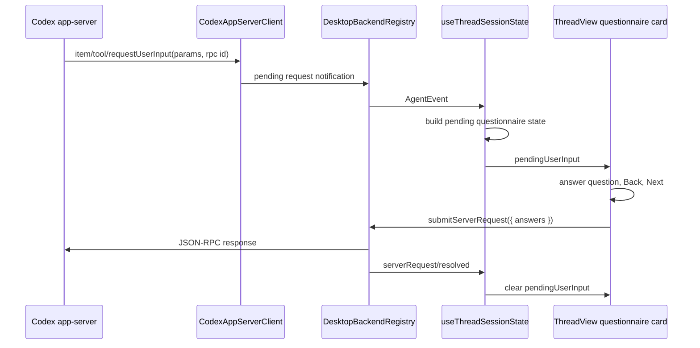
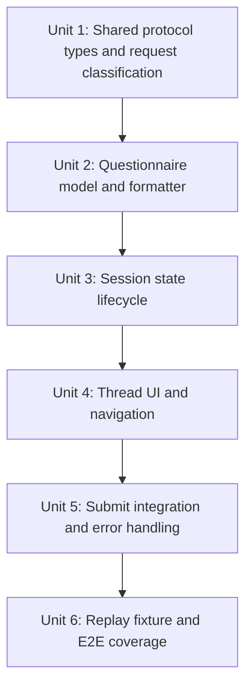

# feat: Add Plan questionnaire navigation to the desktop app

## Overview

Bring Codex `request_user_input` Plan-mode questionnaires into the desktop thread view as a first-class pending-input surface with Back, Next, and Submit navigation. This is separate from command/file approval prompts: questionnaire requests must never appear as Approve/Decline cards and must respond with the Codex app-server `ToolRequestUserInputResponse` shape.

This plan treats `/Users/huntharo/pwrdrvr/openclaw-codex-app-server` as prior art and this PwrAgent desktop app as the target. OpenClaw already has useful questionnaire state and response-formatting concepts, but its chat callback queue is platform-specific and should not be copied into the Electron renderer.

## Problem Frame

The recent approval work restored command/file approval cards and intentionally excluded `item/permissions/requestApproval` from the generic approval matcher. That avoids invalid approval responses, but it does not solve Plan-mode questions. Codex plan questionnaires arrive as `item/tool/requestUserInput` JSON-RPC requests with structured `questions`, `options`, and an expected response payload of `{ answers: { [questionId]: { answers: string[] } } }`.

Without a dedicated UI and response path, the desktop app either ignores those requests or risks routing future input prompts through approval-shaped decisions. Plan mode needs a compact, thread-native questionnaire card that can show one question at a time, preserve answers while navigating backward and forward, handle recommended and free-form options, and submit the exact app-server response contract.

## Requirements Trace

- R1, R2, R4 from the origin parity requirements: match supported Codex Desktop protocol behavior and treat real app-server traffic as the source of truth.
- R3, R4 from the origin parity requirements: do not recover this from rollout files or private session artifacts.
- R15, R16 from the origin parity requirements: close the behavior with targeted unit, replay, and E2E coverage.

Derived requirements for this feature:

- RQ1. Surface `item/tool/requestUserInput` as pending user input, not as pending approval.
- RQ2. Preserve Codex response compatibility by submitting `{ answers: Record<string, { answers: string[] }> }`.
- RQ3. Render structured questions with headers, prompt text, option labels, descriptions, recommended labels, and optional free-form/Other input.
- RQ4. Support Back and Next navigation across multi-question questionnaires while preserving answers.
- RQ5. Gate Submit until every question has a valid answer; gate Next until the current question is answered.
- RQ6. Keep pending questionnaire state scoped to backend, thread id, and request id, and clear it on successful submit, server resolution, turn cancellation, turn failure, or thread change.
- RQ7. Cover the behavior with failing-first unit tests and a replay-backed Electron E2E test.

## Scope Boundaries

- In scope: Codex `item/tool/requestUserInput` structured Plan-mode questionnaires.
- In scope: renderer state, thread UI, response formatting, bridge typing, and replay/E2E coverage.
- In scope: borrowing OpenClaw questionnaire parsing/state ideas where they map directly to Codex structured requests.
- Out of scope: `item/permissions/requestApproval`; its response contract is different and should stay excluded from approval cards until it gets a dedicated implementation.
- Out of scope: chat-platform callback tokens, compact text parsing for legacy chat prompts, or OpenClaw message queue behavior.
- Out of scope: adding new Plan-mode behavior to the model or Codex CLI.

## Context & Research

### PwrAgent Surfaces

- `packages/shared/src/contracts/app-server.ts` currently has a broad `AppServerPendingRequestNotification` type and a notification union that is approval-oriented in its named variants.
- `packages/shared/src/contracts/agent.ts` already lets `SubmitServerRequestRequest.response` be any `Record<string, unknown>`, which is broad enough for questionnaire answers.
- `apps/desktop/src/main/codex-app-server/client.ts` already normalizes inbound JSON-RPC requests into pending request notifications and uses the JSON-RPC id as a fallback `requestId`.
- `apps/desktop/src/main/app-server/backend-registry.ts` already stores pending server requests and resolves them through `submitServerRequest`.
- `apps/desktop/src/renderer/src/lib/useThreadSessionState.ts` currently promotes only supported command/file approval request methods into `pendingRequest`.
- `apps/desktop/src/renderer/src/features/thread-detail/ThreadView.tsx` currently builds approval-shaped responses and clears approval state after submit.
- `apps/desktop/src/renderer/src/features/thread-detail/TranscriptList.tsx` currently renders pending approvals in the transcript.
- `apps/desktop/e2e/approval-pending.spec.ts` and `apps/desktop/e2e/fixtures/approval-pending/replay.fixture.json` provide the closest replay-backed E2E pattern.

### OpenClaw Prior Art

- `/Users/huntharo/pwrdrvr/openclaw-codex-app-server/src/types.ts` defines `PendingQuestionnaireQuestion`, `PendingQuestionnaireOption`, `PendingQuestionnaireAnswer`, and `PendingQuestionnaireState`.
- `/Users/huntharo/pwrdrvr/openclaw-codex-app-server/src/pending-input.ts` has `extractQuestionnaireFromStructuredRequest`, `formatPendingQuestionnairePrompt`, `buildPendingQuestionnaireResponse`, `questionnaireIsComplete`, and `questionnaireCurrentQuestionHasAnswer`.
- `/Users/huntharo/pwrdrvr/openclaw-codex-app-server/src/client.ts` keeps approval response mapping separate from non-approval pending input responses.
- `/Users/huntharo/pwrdrvr/openclaw-codex-app-server/src/controller.test.ts` includes coverage that a visible questionnaire suppresses plan keepalive chatter.

OpenClaw's useful ideas are the normalized questionnaire model, completion helpers, and response formatter. Its callback queue, compact text parser, and chat message formatting should remain OpenClaw-specific.

### Codex Protocol Source

Local Codex protocol definitions show the exact request and response contract:

- `/Users/huntharo/github/codex/codex-rs/app-server-protocol/src/protocol/common.rs` maps tool user input to `item/tool/requestUserInput`.
- `/Users/huntharo/github/codex/codex-rs/app-server-protocol/src/protocol/v2.rs` defines `ToolRequestUserInputParams`, `ToolRequestUserInputQuestion`, `ToolRequestUserInputOption`, `ToolRequestUserInputAnswer`, and `ToolRequestUserInputResponse`.
- `/Users/huntharo/github/codex/codex-rs/app-server-protocol/schema/typescript/v2/ToolRequestUserInputResponse.ts` confirms the response shape is `{ answers: { [key in string]?: { answers: string[] } } }`.

### Institutional Learnings

No `docs/solutions/` artifacts were present for this topic. Existing plans for protocol parity and the replay harness are the relevant local guidance.

### External References

None. The authoritative references are the local Codex protocol definitions, OpenClaw prior art, and PwrAgent's existing desktop replay harness.

## Key Technical Decisions

- **Use separate state for questionnaire requests.** Do not widen `pendingRequest` approvals to include user-input prompts. Add a distinct pending questionnaire/user-input state so approval response helpers cannot accidentally submit `{ decision: ... }`.
- **Keep the response formatter protocol-shaped.** The renderer should emit `ToolRequestUserInputResponse` directly: one answer map entry per question id, each containing a string array.
- **Borrow the model, not the transport.** Adapt OpenClaw's questionnaire state, completion helpers, and formatter; do not bring over callback ids, chat prompt rendering, or compact text parsing.
- **Render the question card in the thread detail surface.** The questionnaire is part of the active turn, so it should appear where approval cards appear today, with composer affordances disabled while the request is pending.
- **Store navigation locally and deterministically.** `currentIndex` and `answers` belong in renderer state keyed by request id. Server state only needs the final response.
- **Treat replay as the E2E source.** Use a small replay fixture for `item/tool/requestUserInput` rather than relying on a live Plan-mode run for CI.

## Open Questions

### Resolved During Planning

- Should Plan-mode questionnaires be approval cards? No. They have a different method and response contract.
- Can `SubmitServerRequestRequest.response` carry the response? Yes, it is already `Record<string, unknown>`.
- Do we need to support legacy compact text questionnaires first? No. Structured `questions` are the Codex app-server contract to target.
- Should permissions approval be fixed as part of this? No. It remains a separate response contract.

### Deferred to Implementation

- Whether the UI should call the component "Pending input", "Plan question", or another short label after a screenshot pass.
- Whether free-form answers should be represented as an always-visible "Other" text field or a selected Other option that reveals a field.
- Whether `isSecret` needs masked input immediately; the protocol supports it, but current Plan-mode choices are usually non-secret.

## High-Level Technical Design



State shape should stay close to the protocol:

```ts
type PendingQuestionnaireState = {
  method: "item/tool/requestUserInput";
  requestId: string;
  threadId: string;
  runId?: string;
  itemId?: string;
  questions: PendingQuestionnaireQuestion[];
  currentIndex: number;
  answers: Array<PendingQuestionnaireAnswer | null>;
};
```

Question and answer helpers should be pure functions so unit tests can lock down completion, navigation, and response formatting without rendering React.

## Implementation Units



- [x] **Unit 1: Add shared protocol types and request classification**

**Goal:** Represent `item/tool/requestUserInput` distinctly from approval requests across shared contracts and renderer state.

**Requirements:** RQ1, RQ2, RQ6

**Dependencies:** None

**Files:**
- Modify: `packages/shared/src/contracts/app-server.ts`
- Modify: `apps/desktop/src/main/codex-app-server/client.ts` if normalization needs typed method metadata
- Test: `apps/desktop/src/main/__tests__/backend-registry-replay.test.ts`
- Test: `apps/desktop/src/main/__tests__/replay-runtime.test.ts`

**Approach:**
- Add narrow shared types for `AppServerToolRequestUserInputNotification`, question options, questions, and response answer maps.
- Keep `AppServerPendingRequestNotification` generic enough for existing registry behavior, but add discriminated helpers so renderer code does not branch on loose strings everywhere.
- Add or update tests proving an inbound `item/tool/requestUserInput` request keeps `threadId`, `turnId`/`runId`, `itemId`, `requestId`, and `questions`.

**Test scenarios:**
- Happy path: a structured `item/tool/requestUserInput` request is emitted through registry events with all question data intact.
- Edge case: when params omit `requestId`, the JSON-RPC id is used as the fallback request id.
- Regression: command/file approval methods still classify as approval requests and permissions approval still does not.

**Verification:**
- Type-level and main-process tests can distinguish approval requests from Plan questionnaire requests.

- [x] **Unit 2: Add pure questionnaire model, navigation, and response helpers**

**Goal:** Create a renderer-side pure utility module for deriving questionnaire state, moving through questions, validating answers, and formatting Codex responses.

**Requirements:** RQ2, RQ3, RQ4, RQ5

**Dependencies:** Unit 1

**Files:**
- Create: `apps/desktop/src/renderer/src/features/thread-detail/questionnaire.ts`
- Test: `apps/desktop/src/renderer/src/features/thread-detail/__tests__/questionnaire.test.ts`

**Approach:**
- Adapt OpenClaw's structured extractor, completion helper, and response formatter to PwrAgent's shared protocol types.
- Keep one question id per answer map entry and render selected option labels or free-form text into `answers: string[]`.
- Provide pure functions such as `createQuestionnaireState`, `answerCurrentQuestion`, `goToNextQuestion`, `goToPreviousQuestion`, `canAdvanceQuestionnaire`, `canSubmitQuestionnaire`, and `buildQuestionnaireResponse`.
- Normalize recommended options by detecting `(Recommended)` in the label while preserving the original user-facing label.

**Test scenarios:**
- Happy path: a one-question request formats `{ answers: { questionId: { answers: ["Selected label"] } } }`.
- Happy path: a multi-question request preserves answers while navigating Back and Next.
- Happy path: recommended labels and option descriptions are preserved for rendering.
- Edge case: Next is unavailable until the current question has an answer.
- Edge case: Submit is unavailable until every question has an answer.
- Edge case: free-form Other text must be non-empty before it counts as answered.
- Edge case: malformed requests with no valid questions are rejected and do not create pending questionnaire state.

**Verification:**
- Questionnaire behavior is fully testable without React or Electron.

- [x] **Unit 3: Wire questionnaire lifecycle into thread session state**

**Goal:** Store pending Plan questionnaires alongside thread session state without mixing them with approval cards.

**Requirements:** RQ1, RQ4, RQ5, RQ6

**Dependencies:** Units 1 and 2

**Files:**
- Modify: `apps/desktop/src/renderer/src/lib/useThreadSessionState.ts`
- Test: `apps/desktop/src/renderer/src/lib/__tests__/useThreadSessionState.test.tsx`

**Approach:**
- Add `pendingUserInput?: PendingQuestionnaireState` or a similarly named field to `ThreadSessionEntry`.
- Add `isRequestUserInputNotification` beside `isApprovalRequestNotification`.
- On `item/tool/requestUserInput`, build questionnaire state and set `pendingStatusText` to a waiting-for-input status.
- Clear the pending questionnaire when the matching `serverRequest/resolved` arrives, when the user submits successfully, or when the active turn fails/cancels/completes.
- Ensure `hasHydratedTranscriptContent` and `hasThinkingState` treat pending questionnaires as live thread content.

**Test scenarios:**
- Happy path: `item/tool/requestUserInput` creates `pendingUserInput` and does not create `pendingRequest`.
- Regression: permissions approval remains ignored by the approval UI.
- Regression: command approval still creates `pendingRequest`.
- Edge case: events for another backend or thread do not affect the selected session.
- Edge case: `serverRequest/resolved` for the matching request id clears only the matching pending questionnaire.
- Edge case: assistant output or turn terminal notifications clear stale pending input consistently with stale approvals.

**Verification:**
- Hook tests prove the renderer can hold Plan questions independently of approvals and lifecycle cleanup works.

- [x] **Unit 4: Add the thread questionnaire UI with Back and Next navigation**

**Goal:** Render Plan questions in the transcript area with compact controls and stable navigation.

**Requirements:** RQ3, RQ4, RQ5

**Dependencies:** Unit 3

**Files:**
- Create: `apps/desktop/src/renderer/src/features/thread-detail/PendingQuestionnaire.tsx`
- Modify: `apps/desktop/src/renderer/src/features/thread-detail/ThreadView.tsx`
- Modify: `apps/desktop/src/renderer/src/features/thread-detail/TranscriptList.tsx` if pending request rendering stays centralized there
- Modify: `apps/desktop/src/renderer/src/styles/app.css`
- Test: `apps/desktop/src/renderer/src/features/thread-detail/__tests__/pending-questionnaire.test.tsx`
- Test: `apps/desktop/src/renderer/src/features/thread-detail/__tests__/transcript-list.test.tsx`

**Approach:**
- Render a card with an accessible group label such as `Pending input`.
- Show the current question header, prompt, progress text, option buttons/radios, option descriptions, and a free-form field when needed.
- Add Back, Next, and Submit controls. Back is disabled on the first question; Next is disabled until the current answer is valid; Submit replaces Next on the last question and is disabled until all answers are valid.
- Preserve layout stability by keeping the action row and progress treatment fixed across navigation.
- Follow `docs/design/desktop-style-guide.md`: compact, tool-like, no nested cards, radius no larger than 8px, and no explanatory scaffold copy.

**Test scenarios:**
- Happy path: a one-question questionnaire shows Submit, not Approve/Decline.
- Happy path: a multi-question questionnaire shows Back/Next and progress text.
- Happy path: selecting an option, moving forward, moving back, and returning preserves the selected answer.
- Edge case: long option labels wrap without changing control alignment unexpectedly.
- Edge case: Other/free-form input is preserved across navigation.
- Accessibility: controls have role/name coverage suitable for Playwright and Testing Library.

**Verification:**
- Renderer tests show Plan questions with navigation and no approval buttons.

- [x] **Unit 5: Submit questionnaire responses through the desktop bridge**

**Goal:** Send the final questionnaire response through `submitServerRequest` and clear UI state only after the bridge accepts it.

**Requirements:** RQ2, RQ5, RQ6

**Dependencies:** Units 3 and 4

**Files:**
- Modify: `apps/desktop/src/renderer/src/features/thread-detail/ThreadView.tsx`
- Modify: `apps/desktop/src/renderer/src/lib/desktop-api.ts` only if stronger exported typing is needed
- Test: `apps/desktop/src/renderer/src/features/thread-detail/__tests__/thread-view.test.tsx`

**Approach:**
- Add a submit handler separate from `respondToPendingRequest` so questionnaire submission cannot call `buildPendingRequestResponse`.
- Submit `backend`, `threadId`, optional `runId`, `requestId`, and the questionnaire answer map.
- Keep answers and show an inline error if `submitServerRequest` rejects.
- Clear pending questionnaire state and move status back to Thinking only after successful submit or matching server resolution.

**Test scenarios:**
- Happy path: Submit calls `submitServerRequest` with `response: { answers: { ... } }`.
- Regression: approval buttons still submit approval decisions unchanged.
- Edge case: bridge failure leaves the questionnaire visible with answers preserved.
- Edge case: the submit button is disabled while a submit is in flight.

**Verification:**
- ThreadView tests prove questionnaire and approval submit paths are separate and protocol-shaped.

- [x] **Unit 6: Add replay-backed E2E coverage**

**Goal:** Lock the full Electron path with a deterministic `request_user_input` replay fixture.

**Requirements:** RQ1, RQ3, RQ4, RQ5, RQ6, RQ7

**Dependencies:** Units 1-5

**Files:**
- Create: `apps/desktop/e2e/fixtures/request-user-input/replay.fixture.json`
- Create: `apps/desktop/e2e/request-user-input.spec.ts`
- Modify: `apps/desktop/e2e/fixtures/README.md` if fixture conventions need a new note
- Test: `apps/desktop/src/main/__tests__/fixture-derivation.test.ts` only if derivation tooling needs to understand the new request shape

**Approach:**
- Create a small replay fixture with a user prompt, turn start, and an inbound `item/tool/requestUserInput` request containing two or three questions.
- E2E should open the fixture, start the turn, advance to the request, answer the first question, navigate Next, answer the second, go Back, verify the first answer is still selected, return forward, and Submit.
- Assert that Approve, Decline, and Cancel turn approval controls are not present for the questionnaire card.
- Assert the replay pending request clears after submit and the thread returns to Thinking or the next scripted turn state.

**Test scenarios:**
- Full path: Plan questionnaire appears, navigation works, Submit resolves the pending request.
- Regression: no approval UI appears for `item/tool/requestUserInput`.
- Edge case: Back/Next preservation is verified in the real Electron app, not only unit tests.

**Verification:**
- `apps/desktop` Playwright E2E can run the new request-user-input spec against the built Electron app.

## System Impact

- Shared contracts gain explicit user-input request typing but the bridge stays compatible with existing generic server requests.
- Main-process request routing remains generic; the main change is preserving and typing the new request method.
- Renderer session state gains a second pending server-request surface for user input.
- Thread detail rendering gains one new interaction card.
- Replay fixtures gain coverage for inbound JSON-RPC requests that are not approvals.

## Risks And Mitigations

- **Risk: response shape drift.** Mitigate by grounding helpers in the local Codex generated TypeScript/Rust protocol definitions and testing exact payloads.
- **Risk: approval and questionnaire state interact badly.** Mitigate with separate state fields, separate type guards, separate submit helpers, and regression tests for approval behavior.
- **Risk: answer state is lost during re-renders.** Mitigate by keying questionnaire state by backend/thread/request id in `useThreadSessionState`, not local component-only state.
- **Risk: UI overfits to one-question prompts.** Mitigate with unit and E2E coverage for multi-question Back/Next flows.
- **Risk: OpenClaw code is copied too broadly.** Mitigate by borrowing only pure model/formatter ideas and leaving chat callback handling behind.

## Verification Plan

Targeted commands for the implementation pass:

```bash
pnpm --filter @pwragent/desktop test -- useThreadSessionState
pnpm --filter @pwragent/desktop test -- questionnaire
pnpm --filter @pwragent/desktop test -- thread-view
pnpm --filter @pwragent/desktop test -- transcript-list
pnpm --filter @pwragent/desktop test:e2e -- request-user-input
pnpm --filter @pwragent/desktop typecheck
```

Acceptance criteria:

- `item/tool/requestUserInput` never renders approval controls.
- A multi-question Plan questionnaire supports Back and Next with answer preservation.
- Submit sends `{ answers: { [questionId]: { answers: [...] } } }`.
- Pending state clears after successful submit or matching resolution.
- Existing command/file approval tests continue to pass.
- A replay-backed Electron E2E test covers the real UI path.
