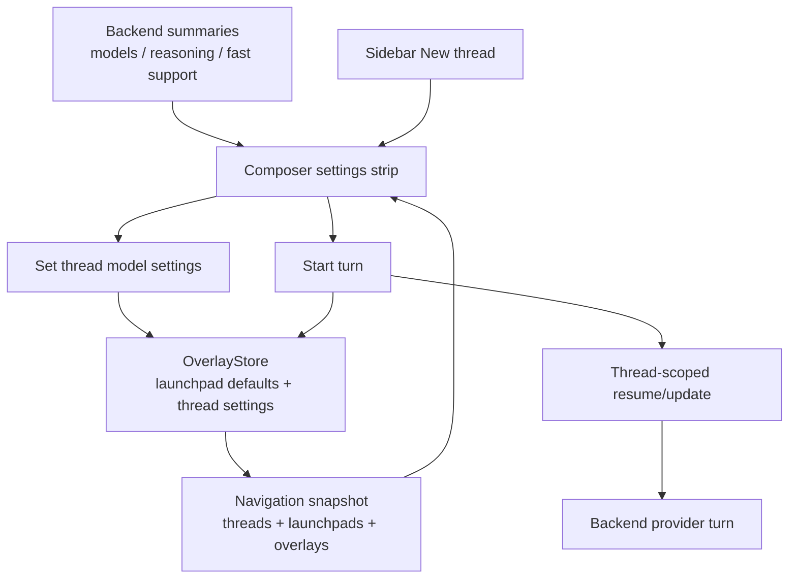
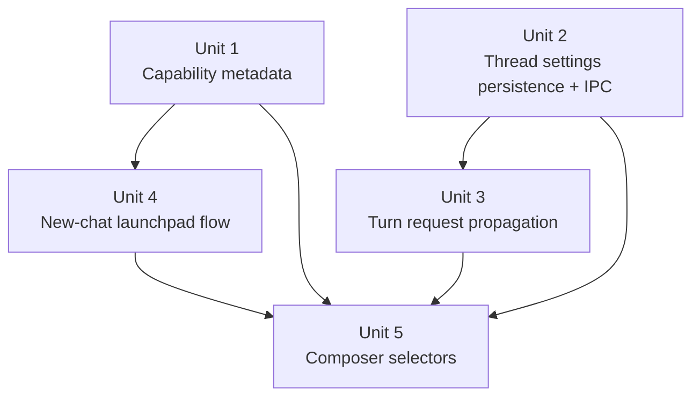

# feat: Add provider and thread model selectors

## Overview

Add composer-owned provider/model setup for new chats and per-thread model/reasoning/fast defaults for existing threads. The implementation should keep provider choice editable only before first send, keep existing-thread provider fixed, and route model settings through thread-scoped persistence and JSON-RPC request paths so one thread's settings do not bleed into another.

The main technical move is to reuse and extend the desktop overlay/launchpad model that already exists for directory launchpads. New chats need a pre-thread draft surface instead of the current sidebar flow that creates a real thread immediately. Existing threads need a thread-settings overlay that is merged into future `turn/start` requests and persisted across navigation/restart.

## Problem Frame

The origin requirements define a hybrid ownership model (see origin: `docs/brainstorms/2026-04-20-desktop-provider-thread-model-selectors-requirements.md`): provider is a new-chat decision, while model, reasoning, and fast mode remain adjustable per thread after creation. The current desktop app is close in some places and missing key pieces in others:

- `apps/desktop/src/renderer/src/features/composer/Composer.tsx` already renders model/reasoning/service-tier/fast controls for launchpads when `backend.launchpadOptions` exists, but those controls are gated to launchpads only.
- `apps/desktop/src/renderer/src/features/navigation/Sidebar.tsx` still starts a real thread directly from the `New thread` menu, which prevents provider/model/reasoning selection in the composer before first send.
- `packages/shared/src/contracts/backend.ts` already has `BackendLaunchpadOptions`, `BackendModelOption.supportsReasoning`, and `BackendModelOption.supportsFast`, but `apps/desktop/src/main/app-server/backend-registry.ts` does not populate real option metadata in live backend summaries.
- `packages/agent-core/src/persistence/overlay-store.ts` persists thread overlays and launchpad defaults, but `ThreadOverlayState` currently only stores execution mode, inbox state, and extra linked directories.
- `apps/desktop/src/main/codex-app-server/client.ts` best-effort calls `thread/resume` before `turn/start` and can include `model`, `serviceTier`, and `reasoningEffort`; `apps/desktop/src/main/grok-app-server/client.ts` and the registry do not yet apply the same complete per-turn settings path.
- `packages/agent-core/src/app-server/codex-app-server.ts` makes `thread/resume` update one `threadId`, and provider turns receive that thread state, which is the local evidence that a thread-scoped update path can work.

This plan extends those boundaries instead of inventing a separate settings system.

## Requirements Trace

- R1-R3. Keep provider/model/reasoning/fast controls in the composer settings area and treat new-chat setup there as authoritative before first send.
- R4-R8. Add an editable provider selector for new chats, use user-facing `Grok` and `OpenAI` labels, update supported options when provider changes, and freeze provider after first send.
- R9-R13. Show model/reasoning/fast controls for existing threads, persist those values per thread, and apply them only to future turns without affecting sibling threads.
- R14-R18. Drive model, reasoning, and fast availability from backend/model capability metadata and fall back safely when saved values become unsupported.
- R19-R20. Verify and use only thread-scoped backend request paths; hide or disable controls that the backend cannot safely honor per thread.

## Scope Boundaries

- Do not allow existing threads to switch providers after first send.
- Do not relabel or rewrite historical turns when a user changes model/reasoning/fast settings.
- Do not redesign service-tier controls as a user-facing goal of this pass; service-tier support may be carried internally where it already exists.
- Do not hard-code a guessed OpenAI fast-mode/model compatibility list. Use advertised backend metadata, and treat official model docs as justification for capability-driven rendering rather than a static frontend catalog.
- Do not collapse `codex`/OpenAI and `grok`/xAI transport details into one backend implementation. This work is a UI and settings contract over the existing backends.

## Context & Research

### Relevant Code and Patterns

- `packages/shared/src/contracts/backend.ts` defines backend capability and launchpad option metadata.
- `packages/shared/src/contracts/navigation.ts` defines `NavigationLaunchpadDefaults`, `NavigationLaunchpadDraft`, `NavigationThreadSummary`, and `ThreadOverlayState`.
- `packages/shared/src/contracts/agent.ts` defines desktop IPC request/response contracts for thread start, turn start, execution-mode changes, and launchpad updates.
- `packages/agent-core/src/persistence/migrations.ts` and `packages/agent-core/src/persistence/overlay-store.ts` are the versioned persistence path for desktop-owned state.
- `packages/agent-core/src/domain/navigation-state.ts` merges backend thread summaries with thread overlays before renderer consumption.
- `apps/desktop/src/main/app-server/backend-registry.ts` owns backend discovery, thread creation, turn start, execution-mode routing, launchpad persistence, and materialization.
- `apps/desktop/src/main/codex-app-server/client.ts` shows the existing `thread/resume` before `turn/start` pattern for Codex/OpenAI-backed threads.
- `apps/desktop/src/main/grok-app-server/client.ts` forwards Grok app-server calls and already supports `thread/resume` through `setThreadPermissions`.
- `packages/agent-core/src/app-server/codex-app-server.ts` and `packages/agent-core/src/app-server/session-state.ts` prove `thread/resume` updates one thread record in the local app-server.
- `apps/desktop/src/renderer/src/features/composer/Composer.tsx` is the existing composer settings surface and should remain the primary UI owner.
- `apps/desktop/src/renderer/src/lib/useThreadNavigation.ts`, `apps/desktop/src/renderer/src/App.tsx`, and `apps/desktop/src/renderer/src/features/thread-detail/ThreadView.tsx` are the renderer state boundaries that need to carry new-thread drafts and thread-settings update callbacks.
- `apps/desktop/src/renderer/src/styles/app.css` already has composer setup/select/checkbox styling and should be extended rather than replaced.

### Institutional Learnings

- No `docs/solutions/` directory exists in this repository, so there are no stored institutional learnings to apply.

### External References

- OpenAI model docs show model-specific reasoning support. `gpt-5.4` supports `reasoning.effort` values `none`, `low`, `medium`, `high`, and `xhigh`, while `gpt-5.4 pro` supports `medium`, `high`, and `xhigh`. This supports the requirement to drive reasoning options from capability metadata rather than static frontend assumptions.
- OpenAI API overview notes model behavior can change between snapshots and recommends pinned versions/evals for consistency. That reinforces using backend-advertised model metadata and fallbacks instead of hard-coding volatile model behavior in the renderer.

## Key Technical Decisions

- Reuse the launchpad concept for general new chats. A new chat should be an unsent launchpad/draft until first send, not an immediately created backend thread. This is the cleanest way to keep provider editable until first send without deleting or migrating a real thread id.
- Keep provider and model controls in one composer settings strip. The sidebar can still open a new-chat draft, but it should no longer be the place where users choose provider/execution-mode combinations for new chats.
- Store existing-thread model settings in `ThreadOverlayState`. The overlay store already owns desktop-only per-thread state and is keyed by backend plus `threadId`, so it is the right persistence layer for next-turn defaults.
- Apply existing-thread setting changes on the next send. Selector changes update the overlay and optimistic renderer state, but the backend is resumed with those settings immediately before the next `turn/start`.
- Extend `startTurn` to carry all supported thread model settings through the registry and backend clients. The registry should merge saved overlay settings with explicit request settings, then the clients should use `thread/resume` or equivalent thread-scoped request paths before starting the turn.
- Treat `fastMode` as capability-gated metadata, not a universal JSON-RPC or OpenAI API primitive. Persist it per thread, but only render or forward it when the selected backend/model explicitly advertises support and the backend client has a safe mapping.
- Normalize unsupported saved values near the capability boundary. The composer should not crash or send stale values when a backend removes a model or changes reasoning/fast support.

## Open Questions

### Resolved During Planning

- Where should existing-thread model/reasoning/fast settings persist? In `ThreadOverlayState`, alongside execution mode, because it is already backend/thread-keyed desktop overlay state.
- When should existing-thread selector changes take effect? On the next turn only; prior turns are historical and unchanged.
- Can `thread/resume` be thread-scoped? In the local app-server, yes: `thread/resume` updates one `threadId` in `AppServerSessionState`, and provider turns receive that thread record. Codex external-client behavior still needs request-shape verification in tests.
- How should new-chat provider selection work if the current sidebar starts threads immediately? Convert the sidebar `New thread` path to open/select a pre-thread launchpad draft, then materialize it on first send.
- Should the renderer hard-code "fast only on GPT-5.4"? No. Official model metadata changes over time, and the current code already has `supportsFast` capability fields. Use backend metadata.

### Deferred to Implementation

- Exact backend mapping for `fastMode`: this depends on what each backend advertises. For OpenAI/Codex, implementation must verify whether this maps to a supported app-server field, service tier, model alias, or should remain hidden.
- Exact fallback choice when a saved model becomes unsupported: implementation should choose the backend/model's advertised default or the first available model once metadata normalization is in place.
- Whether the root new-chat draft should be one global reusable draft or one draft per selected lens/context: the simplest acceptable implementation is one reusable unlinked draft, but the implementation can align this with existing launchpad keying if current navigation state makes a scoped key cheaper.

## High-Level Technical Design

> *This illustrates the intended approach and is directional guidance for review, not implementation specification. The implementing agent should treat it as context, not code to reproduce.*

## Implementation Units

- [x] **Unit 1: Populate provider-specific model capability metadata**

**Goal:** Make backend summaries advertise real model/reasoning/fast option metadata so composer controls can be capability-driven.

**Requirements:** R6, R10, R14-R18, R20

**Dependencies:** None

**Files:**
- Modify: `packages/shared/src/contracts/backend.ts`
- Modify: `apps/desktop/src/main/app-server/backend-registry.ts`
- Modify: `apps/desktop/src/main/codex-app-server/client.ts`
- Modify: `apps/desktop/src/main/grok-app-server/client.ts`
- Modify: `packages/agent-core/src/app-server/metadata-service.ts`
- Test: `apps/desktop/src/main/__tests__/backend-registry.test.ts`
- Test: `apps/desktop/src/main/__tests__/codex-client.test.ts`
- Test: `apps/desktop/src/main/__tests__/grok-app-server-client.test.ts`
- Test: `packages/agent-core/src/__tests__/codex-metadata-contract.test.ts`

**Approach:**
- Generalize or rename `launchpadOptions` only if needed; otherwise keep the current field to avoid churn and document that it drives composer setup for both launchpads and existing-thread settings.
- Add client-side metadata discovery where supported. For Grok app-server, `model/list` already exists in `agent-core` and returns `supportsReasoning`/`supportsFast`; the desktop Grok client should expose that through backend summaries.
- For Codex/OpenAI, prefer app-server `model/list` or equivalent initialize metadata if available. If unavailable, provide a conservative static fallback only for known-safe labels/options and keep fast-mode support absent rather than guessed.
- Include provider/user-facing labels needed by the composer selector: internal `codex` should render as `OpenAI` in provider-selection contexts, while `grok` renders as `Grok`.
- Preserve unavailable-backend handling: if a backend cannot initialize, summary metadata should degrade with `available: false` and no editable model options.

**Patterns to follow:**
- `packages/agent-core/src/app-server/metadata-service.ts`
- `apps/desktop/src/main/app-server/backend-registry.ts`
- `packages/shared/src/contracts/backend.ts`

**Test scenarios:**
- Happy path: a Grok backend summary includes model options from `model/list`, with reasoning and fast support preserved per model.
- Happy path: a Codex/OpenAI backend summary includes model options when the app server advertises them.
- Edge case: a backend without model metadata remains available for threads but omits model/reasoning/fast selectors instead of inventing values.
- Error path: one Codex execution-mode client failing metadata discovery does not make the other healthy execution mode unavailable.
- Integration: renderer-facing backend summaries contain enough data for provider switch, model switch, reasoning visibility, and fast visibility without inspecting backend-specific internals.

**Verification:**
- Backend summaries are the single source of truth for composer model/reasoning/fast visibility.

- [x] **Unit 2: Persist per-thread model settings in the desktop overlay**

**Goal:** Add durable per-thread model, reasoning, service-tier, and fast-mode defaults without changing backend thread history or global launchpad defaults.

**Requirements:** R9-R13, R18-R20

**Dependencies:** Unit 1 for the option vocabulary, but persistence can be developed with test fixtures.

**Files:**
- Modify: `packages/shared/src/contracts/app-server.ts`
- Modify: `packages/shared/src/contracts/navigation.ts`
- Modify: `packages/shared/src/contracts/agent.ts`
- Modify: `packages/agent-core/src/persistence/migrations.ts`
- Modify: `packages/agent-core/src/persistence/overlay-store.ts`
- Modify: `packages/agent-core/src/domain/navigation-state.ts`
- Test: `packages/agent-core/src/__tests__/overlay-store.test.ts`
- Test: `packages/agent-core/src/__tests__/directory-navigation.test.ts`

**Approach:**
- Extend `ThreadOverlayState` with optional `model`, `reasoningEffort`, `serviceTier`, and `fastMode`.
- Add a versioned overlay migration that preserves existing thread overlay fields and normalizes new optional settings from older or malformed data.
- Add overlay store helpers for reading and updating thread model settings, following the existing `setThreadExecutionMode` pattern.
- Ensure `reconcileNavigationSnapshot` and `materializeNavigationThreads` merge saved thread settings onto `NavigationThreadSummary` so the renderer can show the current per-thread defaults.
- Keep launchpad defaults separate from thread overlays. New-chat sticky defaults should not rewrite existing thread overlays.

**Execution note:** Start with overlay migration and snapshot-materialization characterization tests before changing renderer behavior.

**Patterns to follow:**
- `packages/agent-core/src/persistence/migrations.ts`
- `packages/agent-core/src/persistence/overlay-store.ts`
- `packages/agent-core/src/domain/navigation-state.ts`

**Test scenarios:**
- Happy path: saving model/reasoning/fast settings for `codex:thread-1` survives store reload and appears in the materialized navigation thread.
- Happy path: saving settings for one thread does not affect another thread with the same backend.
- Happy path: launchpad default changes do not mutate existing thread overlay settings.
- Edge case: old overlay files with no model-setting fields migrate cleanly.
- Edge case: malformed persisted values normalize to undefined or safe defaults without dropping execution mode or inbox state.
- Integration: a navigation snapshot carries thread-specific model settings to the renderer without requiring a thread transcript read.

**Verification:**
- Per-thread settings are durable, backend/thread-keyed, and separate from sticky new-chat defaults.

- [x] **Unit 3: Propagate per-thread settings through turn start safely**

**Goal:** Ensure the next turn for a thread uses that thread's saved model settings through a thread-scoped backend update path.

**Requirements:** R11-R13, R19-R20

**Dependencies:** Unit 2

**Files:**
- Modify: `packages/shared/src/contracts/agent.ts`
- Modify: `packages/agent-core/src/app-server/protocol.ts`
- Modify: `packages/agent-core/src/app-server/codex-app-server.ts`
- Modify: `packages/agent-core/src/app-server/session-state.ts`
- Modify: `apps/desktop/src/main/app-server/backend-registry.ts`
- Modify: `apps/desktop/src/main/codex-app-server/client.ts`
- Modify: `apps/desktop/src/main/grok-app-server/client.ts`
- Modify: `apps/desktop/src/main/testing/replay-client.ts`
- Modify: `apps/desktop/src/main/testing/replay-runtime.ts`
- Test: `packages/agent-core/src/__tests__/codex-app-server-contract.test.ts`
- Test: `packages/agent-core/src/__tests__/codex-turn-lifecycle.test.ts`
- Test: `apps/desktop/src/main/__tests__/agent-ipc.test.ts`
- Test: `apps/desktop/src/main/__tests__/backend-registry.test.ts`
- Test: `apps/desktop/src/main/__tests__/codex-client.test.ts`
- Test: `apps/desktop/src/main/__tests__/grok-app-server-client.test.ts`

**Approach:**
- Extend `StartTurnRequest` and backend-client turn params to accept `model`, `reasoningEffort`, `serviceTier`, and `fastMode`, with the understanding that unsupported fields are omitted before reaching a backend.
- In `DesktopBackendRegistry.startTurn`, merge explicit request settings over persisted thread overlay settings over backend defaults. This keeps future direct callers possible while ensuring composer sends use saved per-thread defaults.
- For Codex/OpenAI, extend the existing best-effort `thread/resume` before `turn/start` to include reasoning/service-tier and any safe fast mapping. Keep the resume scoped to the requested `threadId`.
- For Grok, add an equivalent thread-scoped resume/update before `turn/start` so the in-process app-server thread state is updated before `GrokProvider.startTurn` receives it.
- Update `agent-core` protocol/session tests to prove `thread/resume` updates only the requested thread and that `turn/start` uses the thread's current model settings.
- If `fastMode` has no safe backend mapping, do not forward it to that backend. Let Unit 1 metadata hide the control for that backend/model until support is real.

**Execution note:** Prove JSON-RPC isolation before enabling existing-thread selectors in the renderer. The implementation should capture two same-backend threads with different model settings and assert that each `thread/resume`/turn request names the intended `threadId` and leaves the sibling thread state unchanged.

**Patterns to follow:**
- `apps/desktop/src/main/codex-app-server/client.ts`
- `apps/desktop/src/main/app-server/backend-registry.ts`
- `packages/agent-core/src/app-server/session-state.ts`

**Test scenarios:**
- Happy path: starting a Codex/OpenAI turn after saving `model=gpt-5.4` resumes that same `threadId` with the model before `turn/start`.
- Happy path: starting a Grok turn after saving a Grok model updates only that thread's session state before provider invocation.
- Happy path: explicit settings on a `StartTurnRequest` override overlay settings for that one request without rewriting the overlay.
- Edge case: a thread with no saved settings starts exactly as it does today.
- Error path: if thread-scoped resume fails, the turn fails with a visible error rather than silently using a different global setting.
- Integration: two threads on the same backend can start turns with different saved models, and captured backend requests prove each update is scoped to its own `threadId`.

**Verification:**
- Per-thread model settings are observable in backend request payloads and do not affect sibling threads.

- [x] **Unit 4: Convert new chat creation into a composer-owned draft flow**

**Goal:** Let users choose `Grok` or `OpenAI`, model, reasoning, and fast mode before a new chat's first send.

**Requirements:** R1-R8, R14-R18

**Dependencies:** Unit 1, Unit 2

**Files:**
- Modify: `packages/shared/src/contracts/navigation.ts`
- Modify: `packages/shared/src/contracts/agent.ts`
- Modify: `packages/agent-core/src/persistence/overlay-store.ts`
- Modify: `packages/agent-core/src/domain/navigation-state.ts`
- Modify: `apps/desktop/src/main/app-server/backend-registry.ts`
- Modify: `apps/desktop/src/main/ipc/agent-ipc.ts`
- Modify: `apps/desktop/src/main/ipc/app-server.ts`
- Modify: `apps/desktop/src/preload/index.ts`
- Modify: `apps/desktop/src/shared/ipc.ts`
- Modify: `apps/desktop/src/renderer/src/lib/desktop-api.ts`
- Modify: `apps/desktop/src/renderer/src/lib/useThreadNavigation.ts`
- Modify: `apps/desktop/src/renderer/src/features/navigation/Sidebar.tsx`
- Modify: `apps/desktop/src/renderer/src/features/thread-detail/ThreadView.tsx`
- Test: `apps/desktop/src/main/__tests__/agent-ipc.test.ts`
- Test: `apps/desktop/src/main/__tests__/backend-registry.test.ts`
- Test: `apps/desktop/src/main/__tests__/app-server-ipc.test.ts`
- Test: `apps/desktop/src/renderer/src/lib/__tests__/useThreadNavigation.test.tsx`
- Test: `apps/desktop/src/renderer/src/features/navigation/__tests__/sidebar.test.tsx`
- Test: `apps/desktop/src/renderer/src/__tests__/app-shell.test.tsx`

**Approach:**
- Add a root/unlinked new-chat draft path using the existing launchpad model where possible. A simple implementation can use a stable unlinked draft key such as a reusable "new thread" launchpad separate from directory launchpads.
- Change the sidebar `New thread` action from "choose backend and immediately call `startThread`" to "open/select the new-chat draft." The draft's provider selector in the composer becomes the place to choose `Grok` or `OpenAI`.
- Preserve directory launchpad behavior. Directory `+` launchpads still seed directory/workspace context, while the root new-chat draft starts detached and may use scratch-project creation on materialization for Codex/OpenAI as today.
- On first send, materialize the draft by calling the existing registry start-thread/start-turn orchestration with provider, execution mode, model, reasoning, service-tier, and supported fast-mode settings.
- Update sticky defaults when new-chat provider/model/reasoning/fast settings change, but keep already-created thread overlays unchanged.

**Patterns to follow:**
- Existing directory launchpad methods in `DesktopBackendRegistry`
- `apps/desktop/src/renderer/src/lib/useThreadNavigation.ts`
- `apps/desktop/src/renderer/src/features/navigation/Sidebar.tsx`

**Test scenarios:**
- Happy path: clicking `New thread` selects an unsent draft and does not call `startThread` until the first send.
- Happy path: the new-chat draft shows a provider selector with `OpenAI` and `Grok` labels when both backends are available.
- Happy path: changing provider in a new-chat draft changes the available model/reasoning/fast controls and updates sticky defaults.
- Happy path: sending the first message materializes a real thread with the selected provider and model settings, then selects that thread.
- Edge case: if only one backend is available, the provider selector is stable and does not offer unavailable choices as enabled options.
- Error path: failed materialization preserves the draft prompt and settings for retry.
- Integration: existing directory launchpads still retain directory context and materialize into directory-linked threads.

**Verification:**
- New chats have a genuine pre-send setup state, and provider choice is impossible to change after materialization.

- [x] **Unit 5: Render and wire composer model controls for launchpads and existing threads**

**Goal:** Make the composer settings strip show the right provider/model/reasoning/fast controls in both new-chat and existing-thread states.

**Requirements:** R1-R20

**Dependencies:** Units 1-4

**Files:**
- Modify: `apps/desktop/src/renderer/src/features/composer/Composer.tsx`
- Modify: `apps/desktop/src/renderer/src/features/thread-detail/ThreadView.tsx`
- Modify: `apps/desktop/src/renderer/src/lib/useThreadNavigation.ts`
- Modify: `apps/desktop/src/renderer/src/lib/backend-label.ts`
- Modify: `apps/desktop/src/renderer/src/styles/app.css`
- Test: `apps/desktop/src/renderer/src/features/composer/__tests__/composer.test.tsx`
- Test: `apps/desktop/src/renderer/src/features/thread-detail/__tests__/thread-view.test.tsx`
- Test: `apps/desktop/src/renderer/src/__tests__/app-shell.test.tsx`

**Approach:**
- Split composer setup-control state into a small normalized view model: provider, model, reasoning, service tier if needed, fast mode, available options, and whether provider is editable.
- For launchpads/new-chat drafts, provider is editable and writes through `onUpdateLaunchpad`; changing provider should clear or normalize incompatible model/reasoning/fast selections.
- For existing threads, provider is displayed as fixed/non-editable context, while model/reasoning/fast controls write through a new thread-settings update callback.
- Apply "next turn" semantics in UI copy and behavior: selector changes should not trigger a backend run or mutate historical transcript, but should affect the next `Send`.
- Update `submitTurn` to include the current thread model settings when calling `desktopApi.startTurn`, or rely on registry overlay merge after the thread-settings save has succeeded. Prefer including the settings as request context so tests can prove the composer is sending the intended next-turn values.
- Keep controls hidden when backend metadata does not support them; do not show disabled-but-mysterious controls unless there is a clear reason string.
- Keep the existing visual pattern in `composer__setup` and avoid browser-default styling regressions.

**Patterns to follow:**
- Current launchpad controls in `Composer.tsx`
- Execution-mode update flow from `Composer.tsx` through `useThreadNavigation.ts`
- Desktop style guide guidance in `apps/desktop/AGENTS.md` and `docs/design/desktop-style-guide.md`

**Test scenarios:**
- Happy path: a new-chat draft renders provider, model, reasoning, and fast controls when metadata supports all of them.
- Happy path: switching new-chat provider from OpenAI to Grok swaps model options and clears incompatible reasoning/fast values.
- Happy path: an existing OpenAI thread renders a fixed provider label plus editable model/reasoning/fast controls.
- Happy path: changing an existing thread's model calls the thread-settings update callback and the next send includes or uses that model.
- Happy path: a Grok thread only shows fast or reasoning controls that its selected Grok model supports.
- Edge case: saved model is no longer in backend metadata, so the composer falls back to default without throwing or blocking text input.
- Edge case: controls remain layout-stable on narrow widths and do not cause the send/stop button area to shift unpredictably.
- Error path: failed thread-settings save shows an inline composer error and does not pretend the next turn will use the failed setting.
- Integration: app-shell tests prove one thread can use one model while another thread retains a different model setting.

**Verification:**
- The composer is the consistent setup surface for new chats and existing-thread next-turn model settings.

## System-Wide Impact

- **Interaction graph:** Sidebar, navigation state, ThreadView, Composer, DesktopApi/preload, IPC handlers, BackendRegistry, backend clients, OverlayStore, and app-server session state all participate in the settings flow.
- **Error propagation:** Metadata discovery failures should hide unsupported controls; thread-settings save failures should stay local to the composer; backend resume failures before `turn/start` should fail the turn visibly.
- **State lifecycle risks:** There are two setting lifecycles: sticky new-chat defaults and per-thread next-turn defaults. Mixing them would violate R7 and R13.
- **API surface parity:** Shared contracts, replay clients, preload API, IPC constants, renderer hooks, and main-process handlers must evolve together.
- **Integration coverage:** Unit tests alone will not prove thread isolation. Backend-registry and app-shell tests should verify two-thread isolation across save and send.
- **Unchanged invariants:** Existing thread provider, transcript history, Inbox/Recents ordering, directory launchpad drafts, and execution-mode behavior should continue to work unless explicitly touched by the new settings model.

## Risks & Dependencies

| Risk | Mitigation |
| --- | --- |
| Fast mode does not have a safe backend request mapping | Gate it behind backend/model metadata and omit the control for unsupported paths until a thread-scoped mapping is verified |
| New-chat sidebar behavior regresses by removing immediate thread creation | Preserve the visible `New thread` action but redirect it to a draft surface; materialization still happens on first send |
| Saved settings drift from backend metadata | Normalize saved values against current backend summaries before rendering and before sending |
| Thread settings bleed across backend sessions | Add registry/client tests with two threads on the same backend using different settings and assert thread-scoped resume/start payloads |
| Metadata discovery adds startup latency or backend failures | Treat metadata as optional per backend and keep existing unavailable-backend fallback behavior |

## Documentation / Operational Notes

- Update or add renderer-facing comments only where the new launchpad/thread-settings split is not self-evident.
- No end-user docs are required before implementation, but future desktop guidance should describe that `OpenAI` in the provider selector maps to the existing Codex/OpenAI backend.
- Because OpenAI model capabilities are current and volatile, implementation should avoid baking the cited April 2026 model list into persistent code unless backend discovery cannot provide it.

## Sources & References

- **Origin document:** [docs/brainstorms/2026-04-20-desktop-provider-thread-model-selectors-requirements.md](/Users/huntharo/.codex/worktrees/91e5/PwrAgent/docs/brainstorms/2026-04-20-desktop-provider-thread-model-selectors-requirements.md)
- Related requirements: [docs/brainstorms/2026-04-18-directories-launchpad-requirements.md](/Users/huntharo/.codex/worktrees/91e5/PwrAgent/docs/brainstorms/2026-04-18-directories-launchpad-requirements.md)
- Related plan: [docs/plans/2026-04-18-001-feat-directories-launchpad-plan.md](/Users/huntharo/.codex/worktrees/91e5/PwrAgent/docs/plans/2026-04-18-001-feat-directories-launchpad-plan.md)
- Related code: [packages/shared/src/contracts/backend.ts](/Users/huntharo/.codex/worktrees/91e5/PwrAgent/packages/shared/src/contracts/backend.ts)
- Related code: [packages/shared/src/contracts/navigation.ts](/Users/huntharo/.codex/worktrees/91e5/PwrAgent/packages/shared/src/contracts/navigation.ts)
- Related code: [packages/shared/src/contracts/agent.ts](/Users/huntharo/.codex/worktrees/91e5/PwrAgent/packages/shared/src/contracts/agent.ts)
- Related code: [packages/agent-core/src/persistence/overlay-store.ts](/Users/huntharo/.codex/worktrees/91e5/PwrAgent/packages/agent-core/src/persistence/overlay-store.ts)
- Related code: [apps/desktop/src/main/app-server/backend-registry.ts](/Users/huntharo/.codex/worktrees/91e5/PwrAgent/apps/desktop/src/main/app-server/backend-registry.ts)
- Related code: [apps/desktop/src/main/codex-app-server/client.ts](/Users/huntharo/.codex/worktrees/91e5/PwrAgent/apps/desktop/src/main/codex-app-server/client.ts)
- Related code: [apps/desktop/src/main/grok-app-server/client.ts](/Users/huntharo/.codex/worktrees/91e5/PwrAgent/apps/desktop/src/main/grok-app-server/client.ts)
- Related code: [apps/desktop/src/renderer/src/features/composer/Composer.tsx](/Users/huntharo/.codex/worktrees/91e5/PwrAgent/apps/desktop/src/renderer/src/features/composer/Composer.tsx)
- OpenAI model reference: [GPT-5.4 model docs](https://developers.openai.com/api/docs/models/gpt-5.4)
- OpenAI model reference: [GPT-5.4 pro model docs](https://developers.openai.com/api/docs/models/gpt-5.4-pro)
- OpenAI API reference: [API overview and backwards compatibility](https://developers.openai.com/api/reference/overview)
