# refactor: Codex-style exec and search runtime

## Overview

Replace the current buffered Grok tool execution paths with a shared process runtime that behaves like Codex: spawn commands, continuously drain stdout/stderr, stream bounded output events, retain only capped diagnostic output, and let search/list tools stop once their requested limits are satisfied. This plan builds on the existing Grok tool loop, but hardens the exec/search primitives so broad `rg`, `rg --files`, and shell commands do not fail merely because stdout crosses a Node `maxBuffer`.

## Problem Frame

Grok mode now has model-visible tools and app-server turn lifecycle events, but the execution layer still mixes Codex-like semantics with Node buffered process APIs. That mismatch caused the observed failure mode: a broad `search_code` call could produce enough ripgrep output to hit `stdout maxBuffer length exceeded`, then the model repeatedly retried until the Grok tool loop hit its max round limit. The same class of bug still exists in other tool paths.

Current state:

- A prior local investigation demonstrated a spawn-based `search_code` fix that stopped once the requested match limit was reached; implementation should recreate that behavior in the active checkout.
- `packages/agent-core/src/tools/list-files-tool.ts` still uses `execFile("rg", ["--files", "."])` with `maxBuffer: 1024 * 1024`.
- `packages/agent-core/src/tools/shell-command-tool.ts` still uses `exec(...)` with `maxBuffer: 10 * 1024 * 1024`.
- `packages/agent-core/src/providers/responses-tool-loop.ts` emits tool start/completion events, but it does not expose command output deltas from running tools.
- `packages/shared/src/contracts/app-server.ts` already defines `item/commandExecution/outputDelta`, and the desktop hook has tests proving unrelated output deltas must not disturb thinking state, but Grok does not emit those deltas.
- `apps/desktop/src/main/grok-app-server/client.ts` converts Grok `thread/read` mostly from `messages`, so persisted Grok `items` are not yet surfaced as desktop activity entries.

The target is not to copy Codex wholesale. The target is to take Codex's process-output invariants and apply them to the smaller PwrAgnt/Grok tool surface.

## Requirements Trace

- R1. No first-party Grok process-backed tool should fail solely because stdout/stderr exceeded a Node `exec` or `execFile` buffer.
- R2. Foreground shell execution must continuously drain stdout and stderr until process exit, timeout, cancellation, or an intentional tool limit.
- R3. `search_code` and `list_files` must be ripgrep-first, bounded, and able to return early without reading all output into memory.
- R4. Shell command results must retain a capped final output summary while optionally streaming live deltas for UI/debugging.
- R5. Output caps must be explicit and testable. The default retained-output cap should mirror Codex's 1 MiB default unless a tool has a tighter semantic limit.
- R6. Existing approval behavior and command classification must remain intact: read-only searches/listing can auto-run under guarded settings, while unsafe or mutating commands still require approval.
- R7. Grok rollout files must remain useful for debugging. Persisted items should record command/tool status, summary output, command action, and truncation/cap metadata without writing unbounded logs.
- R8. Desktop should be able to render Grok tool/search activity from `thread/read` similarly to Codex activity entries.

## Scope Boundaries

- In scope: `packages/agent-core` tool process execution, search/list tools, shell command tool, app-server notifications, and Grok rollout item persistence.
- In scope: desktop Grok `thread/read` conversion so persisted tool items become activity entries.
- In scope: deterministic unit tests that reproduce broad-output failures before fixing them.
- In scope: preserving the current Grok xAI Responses tool loop and max-round guard.
- Out of scope: replacing the xAI Responses request model with true streaming model responses.
- Out of scope: adding background process tools in this pass. Grok CLI has a useful background-process design, but the immediate bug is foreground output handling.
- Out of scope: implementing Codex `command/exec` as a public standalone JSON-RPC API. PwrAgnt can add that later if desktop needs direct command execution outside turns.
- Out of scope: changing `/Users/huntharo/github/codex` or `/Users/huntharo/github/grok-cli`.

## Context & Research

### Relevant Code and Patterns

- `packages/agent-core/src/providers/responses-tool-loop.ts` already runs the xAI tool loop, emits provider item events, handles approval requests, and enforces `DEFAULT_MAX_TOOL_ROUNDS = 100`.
- `packages/agent-core/src/tools/tool-contract.ts` and `packages/agent-core/src/tools/tool-execution.ts` centralize local tool execution and normalized tool result metadata.
- `packages/agent-core/src/tools/shell-safety.ts` already classifies `rg`, read-only `git`, `cat`, `head`, `tail`, `ls`, and `find` as safe read-only commands, with unsafe ripgrep flags requiring approval.
- `packages/agent-core/src/app-server/turn-runner.ts` already maps provider item events into app-server notifications and persisted replay items.
- `packages/agent-core/src/persistence/grok-rollout-store.ts` already stores durable `item` records in `rollout.jsonl`.
- `packages/shared/src/contracts/app-server.ts` already has `item/commandExecution/outputDelta`, which should be reused rather than inventing a Grok-only notification.
- `apps/desktop/src/main/codex-app-server/client.ts` contains the mature desktop-side activity summarization logic for Codex command and file-change items.
- `apps/desktop/src/main/grok-app-server/client.ts` is the narrower conversion path that needs to start using Grok `items`, not just `messages`.

### Codex Reference

Relevant files in `/Users/huntharo/github/codex`:

- `codex-rs/core/src/tools/runtimes/shell.rs`
- `codex-rs/core/src/exec.rs`
- `codex-rs/core/src/unified_exec/process.rs`
- `codex-rs/core/src/unified_exec/head_tail_buffer.rs`
- `codex-rs/app-server/src/command_exec.rs`

Codex behavior to mirror:

- Commands are spawned and drained incrementally, not executed through a buffered Node-style `maxBuffer`.
- Shell output is read in chunks and output delta events are emitted while a capped final output is retained.
- The retained cap is 1 MiB by default.
- Long-running or high-output commands continue to drain pipes to avoid child-process back-pressure.
- The retained output is an explicit diagnostic snapshot, not the mechanism that decides whether process execution succeeds.
- App-server streaming has a final response separate from `outputDelta` notifications; streamed bytes are not duplicated into every final response.

### Grok CLI Reference

Relevant files in `/Users/huntharo/github/grok-cli`:

- `src/tools/bash.ts`
- `src/tools/file.ts`
- `src/grok/tools.ts`
- `src/agent/agent.ts`
- `src/storage/transcript.ts`
- `src/utils/file-index.ts`

Useful ideas:

- `BashTool` separates foreground commands from background processes and stores background output in log files with tail reads.
- The bash tool description explicitly tells the model to prefer dedicated file tools for durable edits.
- Tool results can carry structured metadata such as diffs, background process info, diagnostics, and media rather than only text.
- The streaming agent path yields `tool_calls`, `tool_result`, and approval chunks as first-class turn events.
- Transcript persistence stores tool calls and tool results separately enough to reconstruct activity.

Limits of the Grok CLI reference:

- Foreground `BashTool.execute` still uses `exec(...)` with `maxBuffer: 10 * 1024 * 1024`, so it should not be copied for the foreground process-output fix.
- `src/utils/file-index.ts` uses `execSync(..., maxBuffer: 10 * 1024 * 1024)` for file indexing. That is useful as a scoring/index idea, not as a robust process-output pattern for this bug class.

### Institutional Learnings

- No relevant `docs/solutions/` artifacts exist in this repository yet.

### External References

- External research skipped. The relevant behavior is local and repo-specific, and the strongest references are the local Codex and Grok CLI source trees.

## Key Technical Decisions

- Add one shared process-output primitive in `packages/agent-core`, then migrate tools onto it. Keeping caps, cancellation, timeout, stdout/stderr collection, and delta emission in one place avoids fixing `search_code` while leaving `list_files` and `shell_command` exposed to the same failure class.
- Prefer `spawn` over `exec`/`execFile` for tool execution. The implementation should pass argv arrays for known tools (`rg`, `git`, etc.) and use a shell only for the intentionally arbitrary `shell_command` tool.
- Retain bounded output; do not treat the cap as an error. Matching Codex, cap/truncation should affect retained diagnostic text and metadata, not process success.
- Keep semantic limits separate from retained-output caps. `search_code.limit` and `list_files.limit` are result limits and may terminate `rg` early. The 1 MiB retained cap is for process output safety.
- Emit output deltas only for command-style executions initially. Dedicated `search_code` and `list_files` should return concise structured results; arbitrary shell commands benefit most from live output.
- Reuse `item/commandExecution/outputDelta` from the shared app-server contract. If additional metadata is needed, extend the existing event shape with optional stream/cap fields in a backward-compatible way.
- Store only summarized output and cap metadata in `rollout.jsonl`. Do not persist unbounded command logs.
- Surface Grok persisted tool items through the desktop read path. Otherwise the server may have correct rollout/debug data while the desktop transcript still looks empty after a tool-heavy turn.

## Open Questions

### Resolved During Planning

- Should Codex-style behavior mean adding a public `command/exec` API now? No. The current failure is inside model tool execution, so the first pass should fix tool execution and notifications. Public command execution can be planned separately.
- Should Grok CLI's foreground bash implementation be copied? No. It uses the same buffered `exec` shape that this plan is trying to remove.
- Should `search_code` return raw ripgrep output? No. It should return structured path/line/text matches and stop at the requested result limit.
- Should broad output be considered a failed tool call? No. Broad output should be truncated/capped and reported as such, not failed due to buffering.

### Deferred to Implementation

- The exact retained-output formatting for shell output: implementation should choose the smallest format that preserves stdout/stderr clarity and cap metadata without noisy UI.
- Whether the shared process runner should preserve head+tail output immediately or start with first-N retained output and add head+tail after shell migration. The plan prefers head+tail because Codex does, but the final shape can depend on implementation complexity.
- Whether `item/commandExecution/outputDelta` needs optional `stream` and `capReached` fields in this pass. If renderer and shared contracts can tolerate the existing delta-only form, richer metadata may be deferred.
- Whether desktop should render live Grok command deltas immediately or only hydrate the final activity from `thread/read`. The server should emit the events either way.

## High-Level Technical Design

> This illustrates the intended approach and is directional guidance for review, not implementation specification.

```mermaid
flowchart TB
    XAI["xAI Responses tool call"] --> LOOP["responses-tool-loop"]
    LOOP --> EXECUTOR["LocalToolExecutor"]
    EXECUTOR --> SEARCH["search_code"]
    EXECUTOR --> LIST["list_files"]
    EXECUTOR --> SHELL["shell_command"]
    SEARCH --> RUNNER["ProcessRunner"]
    LIST --> RUNNER
    SHELL --> RUNNER
    RUNNER --> BUFFER["Capped output buffer"]
    RUNNER --> DELTA["Output delta callback"]
    DELTA --> PROVIDER["Provider item output event"]
    PROVIDER --> TURN["TurnRunner"]
    TURN --> NOTIFY["item/commandExecution/outputDelta"]
    TURN --> STATE["ThreadReplayItem in session state"]
    STATE --> ROLLOUT["Grok rollout.jsonl"]
    STATE --> READ["thread/read"]
    READ --> DESKTOP["Desktop activity transcript"]
```

## Implementation Units

- [x] **Unit 1: Add a shared process runner**

**Goal:** Create one internal process execution primitive for tool commands that continuously drains output, honors timeout/cancellation, and retains capped diagnostics without failing on output volume.

**Requirements:** R1, R2, R4, R5

**Dependencies:** None

**Files:**
- Create: `packages/agent-core/src/tools/process-runner.ts`
- Test: `packages/agent-core/src/__tests__/process-runner.test.ts`
- Modify: `packages/agent-core/src/tools/tool-contract.ts`

**Approach:**
- Use `spawn` and async stdout/stderr listeners instead of `exec`/`execFile`.
- Support both argv execution for known tools and shell execution for `shell_command`.
- Return exit code, signal, timeout/cancel status, retained stdout, retained stderr, aggregated output, and truncation/cap metadata.
- Add an optional output-delta callback to the tool execution context so command tools can stream live output without coupling the runner to app-server classes.
- Keep a default retained cap of 1 MiB, matching Codex's current default.
- Prefer a head/tail retained buffer if implementation cost stays modest; otherwise start with capped-first-output and record truncation clearly.

**Execution note:** Characterization-first. Start by writing failing tests that produce more output than old `exec`/`execFile` buffers allowed, then implement the runner.

**Patterns to follow:**
- Codex `codex-rs/core/src/exec.rs` incremental `read_output`
- Codex `codex-rs/core/src/unified_exec/head_tail_buffer.rs`
- Current `packages/agent-core/src/tools/tool-errors.ts`

**Test scenarios:**
- Happy path: a command that writes to stdout and stderr returns success with both streams represented in the final output.
- Happy path: a command that emits more than 1 MiB still completes successfully and reports truncation metadata.
- Edge case: output exactly at the retained cap is not marked truncated.
- Edge case: output above the retained cap drains to process exit without growing retained memory beyond the cap.
- Error path: nonzero exit returns failure metadata and retained output without throwing an unstructured process error.
- Error path: timeout terminates the child, returns a timeout status, and does not leave listeners/timers active.
- Error path: abort signal terminates the child and reports cancellation.
- Integration: output-delta callback receives chunks while retained output remains capped.

**Verification:**
- Existing tools can consume the runner without duplicating process lifecycle code.
- Tests prove high-output commands do not fail with `maxBuffer`-style errors.

- [x] **Unit 2: Move ripgrep search and file listing onto the runner**

**Goal:** Make `search_code` and `list_files` robust for large repositories and broad patterns by using streaming `rg` output and semantic result limits.

**Requirements:** R1, R3, R5, R6

**Dependencies:** Unit 1

**Files:**
- Modify: `packages/agent-core/src/tools/search-code-tool.ts`
- Modify: `packages/agent-core/src/tools/list-files-tool.ts`
- Test: `packages/agent-core/src/__tests__/search-code-tool.test.ts`
- Test: `packages/agent-core/src/__tests__/list-files-tool.test.ts`

**Approach:**
- Keep `search_code` ripgrep-first and preserve the current structured match output.
- Keep the broad-search regression test that proves searches stop at the requested limit before stdout overflows.
- Migrate `list_files` away from `execFileAsync("rg", ...)` to the shared runner or a runner-backed streaming adapter.
- For `search_code`, stop the child process once the requested match count is reached.
- For `list_files`, stop once the requested file count is reached.
- Preserve deterministic fallback filesystem walks for environments where `rg` is missing.
- Treat ripgrep exit code 1 as an empty search result where appropriate, not as an execution failure.

**Execution note:** Test-first for `list_files`, because it still has the old `maxBuffer` shape.

**Patterns to follow:**
- Current path escape checks in `packages/agent-core/src/tools/workspace-paths.ts`
- Current `search_code` structured output shape
- Codex command action classification for `search` and `listFiles`

**Test scenarios:**
- Happy path: `search_code` returns path, line, and trimmed text for a fixed-string query.
- Happy path: `list_files` returns repository-relative paths for a scoped directory.
- Edge case: `search_code` with `limit: 5` against 30,000 matches returns five matches and `truncated: true`.
- Edge case: `list_files` with `limit: 5` against more than 1 MiB of path output returns five files and `truncated: true`.
- Edge case: scoped paths stay relative to the workspace root and cannot escape with `..`.
- Error path: invalid regex returns stable invalid-argument output.
- Error path: missing `rg` uses fallback search/list behavior.
- Error path: `rg` failure other than no-match or intentional early stop is reported as a tool failure with retained stderr.

**Verification:**
- No `execFile` maxBuffer path remains in `search_code` or `list_files`.
- Search/list outputs remain concise enough to feed back into the model loop.

- [x] **Unit 3: Replace shell_command with streamed process execution**

**Goal:** Make arbitrary shell execution Codex-like: safe command classification remains, approvals remain, output is drained continuously, final output is capped, and command output deltas can reach the app-server layer.

**Requirements:** R1, R2, R4, R5, R6

**Dependencies:** Unit 1

**Files:**
- Modify: `packages/agent-core/src/tools/shell-command-tool.ts`
- Modify: `packages/agent-core/src/tools/tool-contract.ts`
- Test: `packages/agent-core/src/__tests__/shell-command-tool.test.ts`
- Test: `packages/agent-core/src/__tests__/shell-safety.test.ts`

**Approach:**
- Replace Node `exec(...)` with the shared process runner in shell mode.
- Preserve `classifyShellCommand` and approval request behavior before execution.
- Preserve timeout and cancellation behavior, but make the runner own the child lifecycle and forced kill timer.
- Return exit code and truncation metadata in `data`.
- Use the output-delta callback for foreground shell output. Dedicated search/list tools should remain summarized unless future UI needs their raw deltas.
- Keep command output formatting stable enough for existing tests while allowing clear truncation markers.

**Patterns to follow:**
- Existing `packages/agent-core/src/tools/shell-command-tool.ts` approval path
- Existing `packages/agent-core/src/tools/shell-safety.ts` classification rules
- Codex `ExecCapturePolicy::ShellTool` behavior

**Test scenarios:**
- Happy path: safe `rg -n NEEDLE .` runs without approval and produces command action `search`.
- Happy path: approved unsafe command executes and records exit code 0.
- Edge case: command emits more than the retained cap and completes without maxBuffer failure.
- Edge case: command emits both stdout and stderr; final output distinguishes stderr without losing stdout.
- Error path: declined approval does not run the side effect.
- Error path: nonzero exit returns a failed tool result with retained output.
- Error path: timeout and abort both terminate the process and return stable error codes.
- Integration: output-delta callback receives shell output chunks before command completion.

**Verification:**
- `shell-command-tool.ts` no longer imports `exec`.
- Shell command behavior remains approval-compatible and command-action-compatible.

- [x] **Unit 4: Wire command output deltas through provider and app-server events**

**Goal:** Let command tools stream live output through the existing app-server notification contract while preserving final item completion and replay persistence.

**Requirements:** R4, R7

**Dependencies:** Unit 1, Unit 3

**Files:**
- Modify: `packages/agent-core/src/tools/tool-execution.ts`
- Modify: `packages/agent-core/src/providers/provider-contract.ts`
- Modify: `packages/agent-core/src/providers/responses-tool-loop.ts`
- Modify: `packages/agent-core/src/app-server/protocol.ts`
- Modify: `packages/agent-core/src/app-server/turn-runner.ts`
- Modify: `packages/shared/src/contracts/app-server.ts`
- Test: `packages/agent-core/src/__tests__/grok-provider-tools.test.ts`
- Test: `packages/agent-core/src/__tests__/codex-turn-progress.test.ts`
- Test: `apps/desktop/src/renderer/src/lib/__tests__/useThreadSessionState.test.tsx`

**Approach:**
- Add a provider event for command output deltas that carries item id, delta text, and optional stream/cap metadata.
- In `responses-tool-loop`, pass an output-delta callback into tool execution for `shell_command` calls and emit provider delta events using the active function call id.
- Carry bounded command metadata from `LocalToolExecutor` into completed provider/app-server items so exit code, cap status, and truncation state are available to replay and logs without reparsing output text.
- In `TurnRunner`, translate provider deltas to `item/commandExecution/outputDelta`.
- Append output deltas to the in-memory item only up to the retained cap or store them as separate transient UI events, depending on the runner metadata. The persisted rollout record should remain bounded.
- Keep existing `item/started` and `item/completed` semantics unchanged so current desktop thinking/stop behavior remains stable.

**Patterns to follow:**
- Existing `item/plan/delta` handling in `packages/agent-core/src/app-server/turn-runner.ts`
- Existing shared contract event `item/commandExecution/outputDelta`
- Desktop test that ensures output deltas do not clear thinking state

**Test scenarios:**
- Happy path: a shell tool emits `item/started`, one or more `item/commandExecution/outputDelta`, and `item/completed` in order.
- Happy path: completed shell tool items include bounded metadata for exit code, truncation, and retained-output cap.
- Edge case: output delta from an unrelated backend/thread is ignored by the selected desktop session state.
- Edge case: output delta does not clear `pendingStatusText` or `activeRunId`.
- Error path: command failure still emits completion with `success: false` after any output deltas.
- Error path: cancelled turn stops further output-delta emission.
- Integration: `thread/read` after completion contains bounded command output metadata, not an unbounded stream transcript.

**Verification:**
- Grok command output can be observed live through app-server notifications.
- Existing Codex desktop event handling is not regressed.

- [x] **Unit 5: Surface Grok tool items as desktop activity entries**

**Goal:** Make Grok `thread/read` replay activity visible in the desktop transcript so tool-heavy turns do not look empty or unreadable after hydration.

**Requirements:** R7, R8

**Dependencies:** Unit 4

**Files:**
- Create: `apps/desktop/src/main/app-server/thread-activity.ts`
- Modify: `apps/desktop/src/main/codex-app-server/client.ts`
- Modify: `apps/desktop/src/main/grok-app-server/client.ts`
- Test: `apps/desktop/src/main/__tests__/grok-app-server-client.test.ts`
- Test: `apps/desktop/src/main/__tests__/codex-client.test.ts`
- Test: `apps/desktop/src/renderer/src/features/thread-detail/__tests__/transcript-list.test.tsx`

**Approach:**
- Extend `extractThreadReplay` to read `items` from Grok app-server `thread/read`.
- Convert `dynamicToolCall` and `commandExecution` items into `AppServerThreadActivityEntry` values.
- Extract shared activity summarization from the Codex client when it reduces duplication; otherwise keep Codex behavior unchanged and implement an equivalent Grok mapping behind the same helper contract.
- Preserve the existing `messages` output and last user/assistant message behavior.
- Do not require live output-delta rendering for this unit; final hydrated activity is the acceptance gate.

**Patterns to follow:**
- `summarizeActivityItems` in `apps/desktop/src/main/codex-app-server/client.ts`
- `TranscriptActivity` rendering in `apps/desktop/src/renderer/src/features/thread-detail/TranscriptActivity.tsx`
- Existing Grok client `extractThreadReplay`

**Test scenarios:**
- Happy path: Grok `thread/read` with a completed `search_code` item produces an activity entry labeled as search/read activity.
- Happy path: Grok `thread/read` with a completed `shell_command` item produces a command activity detail.
- Edge case: failed tool item produces an activity entry with failed status.
- Edge case: malformed or unknown item shape is ignored without failing transcript hydration.
- Integration: transcript list renders the activity entry alongside user and assistant messages.

**Verification:**
- A Grok turn that used tools has visible hydrated transcript activity after reload.

- [x] **Unit 6: Improve debug evidence for tool-loop failures**

**Goal:** When a tool loop fails, make logs and rollout files explain which tool, command, cap, exit status, and round produced the failure.

**Requirements:** R7

**Dependencies:** Units 1-4

**Files:**
- Modify: `packages/agent-core/src/providers/responses-tool-loop.ts`
- Modify: `packages/agent-core/src/app-server/turn-runner.ts`
- Modify: `packages/agent-core/src/persistence/grok-rollout-store.ts`
- Modify: `apps/desktop/src/main/grok-app-server/client.ts`
- Test: `packages/agent-core/src/__tests__/grok-provider-tools.test.ts`
- Test: `packages/agent-core/src/__tests__/grok-rollout-store.test.ts`

**Approach:**
- Include round index and max round count in the provider error path when the tool loop limit is exceeded.
- Include tool name, call id, command action, exit code, and cap/truncation metadata in completed tool item data where available.
- When a provider completes without assistant text after one or more tool calls, preserve the completed tool items and emit a failure message that distinguishes empty model output from tool execution failure.
- Keep logs concise but structured; do not add a global "verbose mode" as part of this plan unless implementation discovers existing logging controls to hook into.
- Ensure rollout JSONL remains parseable when optional metadata is present.

**Patterns to follow:**
- Existing `GrokRolloutStore` `item` persistence
- Existing desktop app-server diagnostics logging in `apps/desktop/src/main/ipc/agent-ipc.ts`

**Test scenarios:**
- Happy path: completed command item round-trips through rollout persistence with exit code and truncation metadata.
- Error path: max tool round failure names the configured max round count and leaves completed prior tool items readable.
- Error path: empty assistant output after tool execution fails the turn with a stable diagnostic while keeping prior tool activity visible.
- Error path: malformed rollout item metadata still produces a path-specific parse error rather than silent data loss.
- Integration: desktop app-server logs include the backend, method, thread id, run id, and tool failure message for failed turns.

**Verification:**
- A future "tool loop exceeded" report has enough local evidence to identify whether the trigger was a command failure, empty output, repeated model behavior, or truncation.

## System-Wide Impact

- **Interaction graph:** xAI tool calls flow through `responses-tool-loop`, `LocalToolExecutor`, individual tools, the process runner, provider events, `TurnRunner`, app-server notifications, `GrokRolloutStore`, desktop Grok client hydration, and renderer transcript/activity state.
- **Error propagation:** Process errors should become structured failed tool results when the model can recover, and turn failures only when the provider loop itself cannot continue.
- **State lifecycle risks:** Output deltas are transient; replay items are durable. The implementation must avoid appending unbounded output to persisted rollout files.
- **API surface parity:** `packages/agent-core/src/app-server/protocol.ts` and `packages/shared/src/contracts/app-server.ts` need to stay aligned for any output-delta shape changes.
- **Integration coverage:** Unit tests need to cover runner behavior, tool behavior, provider-event sequencing, app-server event translation, rollout persistence, and desktop replay conversion.
- **Unchanged invariants:** Existing `turn/started`, `turn/completed`, `turn/failed`, approval requests, and tool start/completion notifications should keep their current semantics.

## Risks & Dependencies

| Risk | Mitigation |
|------|------------|
| Replacing `exec` changes shell quoting behavior | Keep `shell_command` as shell-mode execution through the user's shell or a conservative `/bin/sh -c` wrapper, and add tests for existing command strings. |
| Live output deltas create UI churn or clear thinking state | Reuse the existing output-delta contract and keep renderer state tests focused on preserving active-run status. |
| Persisting output deltas bloats rollout files | Persist only bounded final item metadata; treat deltas as notifications unless a capped item text summary is explicitly needed. |
| Killing `rg` after hitting limits could be reported as failure | Runner/tool adapters should treat intentional early termination as successful truncation. |
| Windows behavior diverges from Unix process semantics | Keep tests platform-neutral where possible and isolate shell-specific assumptions in the process runner. |
| Shared contract and agent-core protocol drift | Update both protocol type surfaces in the same unit and add compile-time tests through existing typecheck. |

## Documentation / Operational Notes

- Update the existing tool-search plan status only if implementation decides to supersede or close it; this plan should stand as the hardening follow-up.
- No user-facing documentation is required unless new desktop activity labels become visible enough to warrant release notes.
- Rollout files remain under the Grok state root configured by `~/.config/grok-app-server/config.toml`; this plan improves their diagnostic content but does not change that storage location.
- The adjacent protocol-parity requirements in `docs/brainstorms/2026-04-19-codex-desktop-protocol-parity-requirements.md` are context only. This plan does not attempt the broader Codex Desktop grouping/worktree parity scope.

## Review Notes

- Confidence check result: strengthened implementation-unit ownership for desktop activity reuse, metadata propagation, and empty-assistant-output diagnostics.
- Document review result: coherence, feasibility, scope, and adversarial checks found no remaining P0/P1 blockers. The main residual risk is implementation discipline around bounded persistence, covered by Unit 4, Unit 6, and the risks table.

## Sources & References

- Related plan: `docs/plans/2026-04-16-003-feat-grok-tool-usage-code-search-plan.md`
- Adjacent protocol-parity requirements: `docs/brainstorms/2026-04-19-codex-desktop-protocol-parity-requirements.md`
- PwrAgnt search tool: `packages/agent-core/src/tools/search-code-tool.ts`
- PwrAgnt list tool: `packages/agent-core/src/tools/list-files-tool.ts`
- PwrAgnt shell tool: `packages/agent-core/src/tools/shell-command-tool.ts`
- PwrAgnt Grok tool loop: `packages/agent-core/src/providers/responses-tool-loop.ts`
- PwrAgnt Grok desktop client: `apps/desktop/src/main/grok-app-server/client.ts`
- Codex shell runtime: `/Users/huntharo/github/codex/codex-rs/core/src/tools/runtimes/shell.rs`
- Codex exec reader: `/Users/huntharo/github/codex/codex-rs/core/src/exec.rs`
- Codex unified exec process: `/Users/huntharo/github/codex/codex-rs/core/src/unified_exec/process.rs`
- Codex output buffer: `/Users/huntharo/github/codex/codex-rs/core/src/unified_exec/head_tail_buffer.rs`
- Codex command exec API: `/Users/huntharo/github/codex/codex-rs/app-server/src/command_exec.rs`
- Grok CLI bash tool: `/Users/huntharo/github/grok-cli/src/tools/bash.ts`
- Grok CLI tool registry: `/Users/huntharo/github/grok-cli/src/grok/tools.ts`
- Grok CLI transcript persistence: `/Users/huntharo/github/grok-cli/src/storage/transcript.ts`
