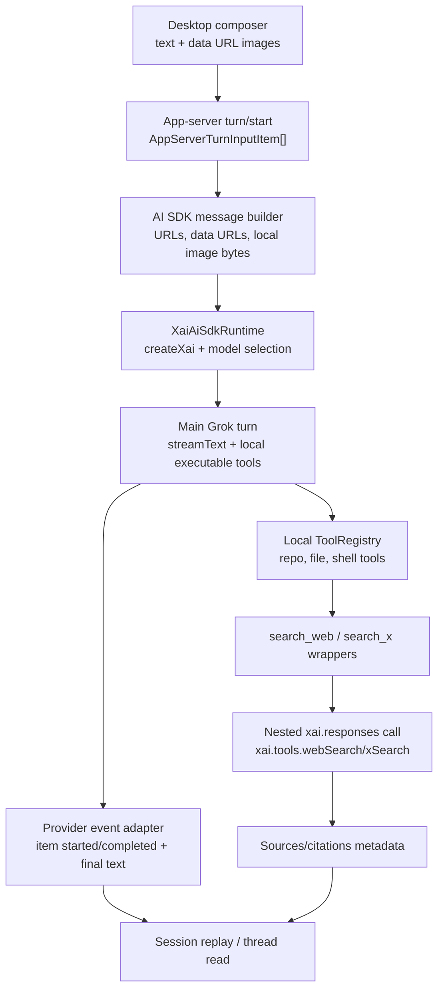

# refactor: Convert Grok App Server to AI SDK xAI

## Overview

Replace the hand-rolled xAI Responses client in `packages/agent-core` with an AI SDK based xAI provider boundary. The implementation should keep the Grok App Server's thread, replay, local tool execution, approvals, and desktop client contracts intact while moving model calls, streaming, vision input, provider options, and xAI server-side search tools onto `@ai-sdk/xai` and `ai`.

This pass should also fix chat image upload handling at the provider boundary. The current desktop composer already converts pasted image files into `data:image/...` URLs, but `localImage` app-server input is serialized as `file:///...`, which a remote xAI API cannot read. The first implementation should send actual image bytes or base64/data URL content through AI SDK messages and should not attempt automatic resizing or recompression yet.

## Problem Frame

The current Grok provider is a narrow custom Responses API client:

- `packages/agent-core/src/providers/xai-responses-client.ts` builds raw `/responses` JSON and only models local function tools with `XaiFunctionTool`.
- `packages/agent-core/src/providers/responses-tool-loop.ts` manually posts response input, parses function calls, executes local tools, and feeds `function_call_output` items back with `previous_response_id`.
- `packages/agent-core/src/providers/response-normalizer.ts` preserves only assistant text, response id, and local function calls.
- `packages/agent-core/src/app-server/protocol.ts` and `packages/shared/src/contracts/app-server.ts` only model text, public/data URL images, and local image paths as input items.
- `apps/desktop/src/renderer/src/features/composer/Composer.tsx` handles pasted images by reading them as data URLs, but there is no broad non-image file attachment path in the current composer.

The review findings are real symptoms of that boundary:

- `localImage` currently becomes `file:///...`, which is inaccessible to xAI.
- The current request contract cannot express xAI server-side tools such as `x_search`, `web_search`, `view_image`, or their image/video understanding options.
- Search citations and server-side tool usage would be dropped because the normalizer/result model has no metadata or source channel.

The user also asked how `/Users/huntharo/github/grok-cli` handles this area. That project already uses `@ai-sdk/xai` and `ai`: it creates an xAI provider with `createXai`, chooses `provider.responses(modelId)` for Responses-only/search work, uses `streamText` for agent turns, uses nested `generateText` calls for web/X search tools, and sends local images as bytes/data URLs rather than `file://` paths. This plan applies those patterns to the Grok App Server without copying the CLI architecture wholesale.

## Requirements Trace

- R1. Add `@ai-sdk/xai` and `ai` to `packages/agent-core` and route Grok model calls through an AI SDK runtime boundary.
- R2. Preserve the current Grok App Server JSON-RPC surface, thread lifecycle, replay persistence, local tool events, approval requests, interruption, and model config keys.
- R3. Fix local chat image handling so `localImage` input is converted to actual image content before it reaches xAI.
- R4. Preserve existing composer-pasted image support and make it explicit in tests: `data:image/...` URLs remain valid input.
- R5. Add an initial provider-side attachment normalization path with clear errors for unsupported or missing files; do not add automatic resizing in this pass.
- R6. Add an implementation path for xAI server-side web/X search that can pass xAI's search parameters, including image/video understanding for X search.
- R7. Preserve citations/sources and relevant provider metadata from AI SDK responses so future UI/replay work has access to them.
- R8. Maintain deterministic unit tests and live-gated xAI smoke coverage; do not make normal test runs depend on a live xAI key.

## Scope Boundaries

- In scope: migrating the Grok provider's xAI model integration to `@ai-sdk/xai` and `ai`.
- In scope: provider runtime setup with API key, base URL, custom fetch for tests, model id, reasoning options, and previous response id where supported.
- In scope: converting app-server input items to AI SDK model messages, including bytes/data URL handling for images.
- In scope: preserving local code/file/shell tool execution and app-server item notifications.
- In scope: exposing xAI web/X search through AI SDK in a way that does not break local tool execution.
- In scope: preserving citations/sources in provider/tool result data even if the renderer does not yet render them richly.
- Out of scope: automatic image resizing, compression, thumbnail generation, or attachment upload storage.
- Out of scope: broad arbitrary document upload UI unless implementation discovers an existing file picker path that can be wired safely. The initial upload fix targets image files already accepted by chat plus `localImage` callers.
- Out of scope: xAI collections/file-search vector store management.
- Out of scope: redesigning the desktop composer attachment UX beyond the minimum needed to keep current image uploads correct.
- Out of scope: replacing the entire app-server provider contract with AI SDK UI message streams.

## Context & Research

### Current `agent-core` State

- `packages/agent-core/package.json` has no AI SDK dependencies today.
- `packages/agent-core/src/providers/grok-provider.ts` constructs `XaiResponsesClient` and delegates to `startResponsesToolLoop`.
- `packages/agent-core/src/providers/xai-responses-client.ts` maps `localImage` to `file://${item.path}` and only supports `type: "function"` tools.
- `packages/agent-core/src/providers/responses-tool-loop.ts` is the existing source of local tool-loop semantics: max tool rounds, tool start/complete events, approval plumbing, and function output chaining.
- `packages/agent-core/src/providers/provider-contract.ts` only returns `assistantText` and `providerResponseId`; provider events do not carry citation/source metadata.
- `packages/agent-core/src/tools/tool-contract.ts` already allows tool execution results to include optional `data`, but item events and replay do not currently preserve that metadata.
- `apps/desktop/src/renderer/src/features/composer/Composer.tsx` stores pasted image attachments as data URLs and sends them as `{ type: "image", url }`.
- `packages/shared/src/contracts/app-server.ts` mirrors the agent-core app-server input item types and will need to stay in lockstep with any contract changes.

### Grok CLI Reference

Relevant files in `/Users/huntharo/github/grok-cli`:

- `src/grok/client.ts` uses `createXai` from `@ai-sdk/xai` and `generateText` from `ai`.
- `src/agent/agent.ts` uses `streamText` for the main agent loop and selects `provider.responses(modelId)` when the model runtime requires Responses.
- `src/grok/tools.ts` implements web/X search as local AI SDK tools that run nested `generateText` calls with `provider.responses(RESPONSES_SEARCH_MODEL)` and xAI server-side tools.
- `src/agent/vision-input.ts` builds multimodal user messages from local image paths by reading bytes and adding media types.
- `src/grok/media.ts` converts local/remote image sources to bytes or data URLs for image/video generation.

Useful implications:

- Use `createXai` rather than the default singleton so config and tests can pass `apiKey`, `baseURL`, `headers`, and `fetch`.
- Do not assume `file://` paths are valid model input.
- Keep server-side search separate from local tool execution when necessary.
- Preserve source/citation data from AI SDK results, because AI SDK returns `sources` and streaming `source` parts for search flows.

### External References

- [AI SDK xAI provider docs](https://ai-sdk.dev/providers/ai-sdk-providers/xai), checked on 2026-04-20: `@ai-sdk/xai` is the provider package, `createXai` supports custom API key, base URL, headers, and fetch, `xai(modelId)` defaults to Chat API, and `xai.responses(modelId)` is required for Responses API server-side agentic tools.
- [AI SDK xAI provider docs](https://ai-sdk.dev/providers/ai-sdk-providers/xai) also show Responses vision input as an AI SDK message containing image bytes, not a local `file://` URL.
- [AI SDK xAI provider docs](https://ai-sdk.dev/providers/ai-sdk-providers/xai) list server-side tools including `web_search`, `x_search`, `view_image`, `view_x_video`, `code_execution`, `mcp_server`, and `file_search`.
- [AI SDK xAI provider docs](https://ai-sdk.dev/providers/ai-sdk-providers/xai) state that the Responses API only supports server-side tools and cannot mix server-side tools with client-side function tools in the same request.
- [xAI X Search docs](https://docs.x.ai/developers/tools/x-search), last updated February 4, 2026, show Vercel AI SDK usage with `xai.responses(...)` and `xai.tools.xSearch()`.
- [xAI X Search docs](https://docs.x.ai/developers/tools/x-search) show `allowedXHandles`, `excludedXHandles`, `fromDate`, `toDate`, `enableImageUnderstanding`, and `enableVideoUnderstanding` as the AI SDK option names.
- [AI SDK `streamText` reference](https://ai-sdk.dev/docs/reference/ai-sdk-core/stream-text) documents `fullStream` parts for text, sources, tool calls, tool results, errors, finish steps, response ids, and response messages.

### Institutional Learnings

- No `docs/solutions/` files exist in this repository yet, so there are no stored solution notes to apply.

## Key Technical Decisions

- Use AI SDK inside the provider layer, not in the desktop renderer. The app-server contract remains the boundary between desktop clients and provider implementation.
- Replace `XaiResponsesClient` with a small `XaiAiSdkRuntime` abstraction that owns `createXai`, model selection, provider options, and dependency injection for tests.
- Keep app-server tool execution local. The Grok App Server still needs repo tools, shell commands, approval requests, and structured item events that execute on the user's machine.
- Do not mix xAI server-side tools with local function tools in one Responses request. The AI SDK docs explicitly reject that mix for Responses. Use one of two paths:
  - Main coding turns: AI SDK `streamText` with local executable AI SDK tools and app-server event mapping.
  - Web/X search: local app-server tools such as `search_web` and `search_x` that execute nested `generateText`/`streamText` calls using `xai.responses(...)` plus xAI server-side tools.
- Prefer `streamText` for main Grok turns so the provider can map AI SDK stream parts into existing `item_started`, `item_completed`, and final result behavior. If implementation finds a blocking limitation, keep the public provider contract stable and document the limitation in tests.
- Treat `previousResponseId` as an optimization, not the sole source of conversation continuity. AI SDK Responses options include `previousResponseId`, so preserve it when using `xai.responses(...)`; also ensure replay/transcript context remains sufficient if model/runtime choices move through Chat API paths.
- Convert `localImage` by reading the local file and attaching bytes plus a media type to the AI SDK message. If a path is missing, unreadable, or not an image, fail the turn with a clear provider error rather than silently sending unusable content.
- Keep current `image` URL input behavior: public URLs and `data:image/...` URLs should pass through. Reject `file://` image URLs unless they are explicitly normalized through the local file path reader.
- Add source/citation preservation before adding rich rendering. Provider results or tool result `data` should carry sources in a stable app-server-owned shape, even if `thread/read` initially renders only the textual answer.
- Configure X search media understanding through the local `search_x` tool schema. The model can set `includeImages` and `includeVideos` from the user's prompt, and the wrapper maps those to `enableImageUnderstanding` and `enableVideoUnderstanding`. Defaults should be conservative and documented in the tool description to avoid accidental video-processing costs.

## Open Questions

### Resolved During Planning

- Should this use the xAI Python SDK or OpenAI-compatible SDK? No. The project is TypeScript and xAI's current JS examples point to Vercel AI SDK via `@ai-sdk/xai`.
- Does simply enabling `x_search` let the model decide image/video understanding flags? No. Those are tool configuration options supplied by the caller. A local wrapper can expose model-selectable arguments and then map them into `xai.tools.xSearch(...)`.
- Should `localImage` be sent as a `file://` URL? No. It must be encoded as bytes, base64/data URL, or uploaded to an accessible URL. This plan uses bytes/data URL in the AI SDK message path.
- Should xAI server-side tools be added directly beside local app-server tools? No. AI SDK/xAI Responses docs say server-side tools cannot be mixed with client-side function tools in the same request.

### Deferred to Implementation

- Exact AI SDK package versions to install. Use versions compatible with the current package manager and TypeScript setup, and prefer the same major line as `/Users/huntharo/github/grok-cli` if dependency resolution allows it.
- Exact AI SDK message content type for local images in the installed version. The implementation must verify whether the installed package expects `{ type: "image", image: Uint8Array }` or `{ type: "file", data: Uint8Array, mediaType }`, then lock that down with tests.
- Whether the main turn model should use `xai(modelId)` or `xai.responses(modelId)` for all Grok models. The runtime should choose deliberately based on local tools, server-side tool constraints, and model support.
- Whether citations should become first-class `ThreadReplayItem` fields immediately or live in `ToolExecutionOutput.data` plus provider metadata first. The minimum acceptable pass is to preserve them in a structured field that is not dropped.
- Whether non-image document uploads should be added to the shared app-server input contract now. Current composer evidence only shows pasted images; arbitrary file upload UI can be planned after the image path is correct.

## High-Level Technical Design

> This diagram is directional guidance for review. Implementation should follow repo patterns and tests rather than reproduce the diagram mechanically.

## Phased Delivery

### Phase 1

Add AI SDK dependencies and introduce the xAI runtime boundary behind the existing `GrokProvider`.

### Phase 2

Add the AI SDK message builder and fix `localImage` so local files are sent as bytes/data URLs, not inaccessible local paths.

### Phase 3

Move main Grok turns to AI SDK `streamText` while preserving local tool execution, app-server events, interruption, max tool rounds, and previous response id behavior where supported.

### Phase 4

Add xAI web/X search wrappers using nested `xai.responses(...)` calls, preserve sources/citations, and update replay/result metadata.

### Phase 5

Retire or quarantine the hand-rolled Responses client tests, add live-gated xAI smoke coverage, and update relevant docs/config notes.

## Implementation Units

- [x] **Unit 1: Add AI SDK dependencies and provider runtime boundary**

**Goal:** Create a thin, testable AI SDK xAI runtime while keeping `GrokProvider` as the app-server-facing provider.

**Requirements:** R1, R2, R8

**Dependencies:** None

**Files:**
- Modify: `packages/agent-core/package.json`
- Modify: `pnpm-lock.yaml`
- Modify: `packages/agent-core/src/providers/grok-provider.ts`
- Add: `packages/agent-core/src/providers/xai-ai-sdk-runtime.ts`
- Add: `packages/agent-core/src/providers/xai-model-selection.ts`
- Test: `packages/agent-core/src/__tests__/grok-provider.test.ts`
- Test: `packages/agent-core/src/__tests__/xai-ai-sdk-runtime.test.ts`

**Approach:**
- Add `ai` and `@ai-sdk/xai` to `packages/agent-core`.
- Implement a runtime that calls `createXai({ apiKey, baseURL, headers, fetch })`.
- Preserve existing config names: `xai_api_key`, `grok_model`, `xai_base_url`, and environment override behavior.
- Keep `GrokProviderOptions` compatible with current callers, including custom `fetchImpl` for tests.
- Introduce a model-selection helper that can choose Chat API or Responses API deliberately and expose that choice to tests.
- Do not remove the old client in this unit unless all tests can move cleanly; it can be deprecated and replaced in later units.

**Test scenarios:**
- Runtime passes API key, base URL, headers, and custom fetch into `createXai`.
- `GrokProvider` still accepts the same constructor options as before.
- Thread model overrides are honored.
- Missing API key and failing fetch paths produce clear provider errors.
- Model-selection behavior is deterministic for known model ids and has a safe default.

- [x] **Unit 2: Build AI SDK messages and fix local image input**

**Goal:** Convert app-server turn input into AI SDK messages and ensure local image files are read into model-accessible content.

**Requirements:** R3, R4, R5

**Dependencies:** Unit 1

**Files:**
- Add: `packages/agent-core/src/providers/ai-sdk-message-builder.ts`
- Modify: `packages/agent-core/src/providers/xai-responses-client.ts` or replace call sites that use `buildXaiInput`
- Modify: `packages/agent-core/src/app-server/protocol.ts` only if new input item types are needed
- Modify: `packages/shared/src/contracts/app-server.ts` only if new input item types are needed
- Test: `packages/agent-core/src/__tests__/grok-provider.test.ts`
- Test: `packages/agent-core/src/__tests__/ai-sdk-message-builder.test.ts`
- Test: `packages/agent-core/src/__tests__/codex-turn-lifecycle.test.ts`

**Approach:**
- Create a single message builder that accepts `AppServerTurnInputItem[]` and returns AI SDK model messages.
- Preserve current text behavior.
- Preserve `{ type: "image", url }` for public URLs and data URLs.
- For `{ type: "localImage", path }`, read the file from disk with Node APIs, infer media type from extension or file signature where practical, and attach bytes with the AI SDK content part shape supported by the installed version.
- Reject unsupported local image extensions and missing/unreadable paths with actionable errors.
- Reject `file://` URLs in `{ type: "image", url }` unless the implementation explicitly converts them through the local file reader.
- Keep image bytes in memory only for the request; do not add persistence or resizing in this unit.
- Leave arbitrary non-image chat files out unless a supported app-server input contract already exists. If adding `localFile`, keep it behind explicit tests and avoid pretending all file types are model-readable.

**Test scenarios:**
- Text plus pasted data URL image becomes one multimodal user message or equivalent AI SDK message sequence.
- Public image URL passes through unchanged.
- `localImage` reads a PNG/JPEG fixture into bytes and media type.
- `localImage` does not produce `file://` anywhere in the provider request/message.
- Missing local image path fails with a clear error.
- Non-image local file path fails clearly in the initial pass.
- Existing Codex app-server lifecycle tests that include `localImage` still pass or are adjusted to the shared contract intentionally.

- [x] **Unit 3: Move the main Grok turn loop to AI SDK streaming**

**Goal:** Replace the manual raw Responses loop with AI SDK `streamText` while preserving app-server turn semantics.

**Requirements:** R1, R2, R7, R8

**Dependencies:** Units 1 and 2

**Files:**
- Modify: `packages/agent-core/src/providers/responses-tool-loop.ts`
- Modify: `packages/agent-core/src/providers/response-normalizer.ts`
- Modify: `packages/agent-core/src/providers/provider-contract.ts`
- Modify: `packages/agent-core/src/tools/tool-registry.ts` if AI SDK tool adaptation belongs there
- Add: `packages/agent-core/src/providers/ai-sdk-tool-adapter.ts`
- Test: `packages/agent-core/src/__tests__/grok-provider.test.ts`
- Test: `packages/agent-core/src/__tests__/grok-provider-tools.test.ts`
- Test: `packages/agent-core/src/__tests__/codex-tool-progress.test.ts`

**Approach:**
- Wrap each existing `ToolDescriptor`/`ToolExecutor` entry as an AI SDK executable tool.
- In each tool `execute`, call the existing `ToolExecutor.executeTool(...)` so approval, cwd, sandbox, command classification, and item data stay centralized.
- Map AI SDK tool-call/tool-result stream parts into the existing `item_started` and `item_completed` provider events.
- Preserve max tool round behavior using AI SDK step controls where available; if AI SDK owns the loop, configure a max step count equal to the current `DEFAULT_MAX_TOOL_ROUNDS`.
- Preserve `interrupt` by wiring the active turn's `AbortController` to `streamText`.
- Preserve final `assistantText` and capture response id from AI SDK response metadata.
- Preserve sources and provider metadata in `ProviderTurnResult` or structured item data, rather than discarding them in a normalizer.
- Keep request-input/approval flows synchronous from the tool executor's point of view.

**Test scenarios:**
- Simple text turn returns final assistant text and provider response id.
- Tool call starts and completes the same app-server item shapes as the current loop.
- Tool execution failure is reported as a failed item and returned to the model.
- Approval-required tool execution still emits `request_input` and waits for the response.
- Interrupt aborts a streaming turn and does not leave unresolved tool executions.
- Exceeding max tool rounds fails with a clear error.
- AI SDK response sources are preserved in the result or replay metadata.

- [x] **Unit 4: Add xAI server-side search wrappers and source preservation**

**Goal:** Expose xAI web/X search through local app-server tools that call AI SDK Responses server-side tools, while preserving citations.

**Requirements:** R6, R7, R8

**Dependencies:** Units 1 and 3

**Files:**
- Modify: `packages/agent-core/src/tools/tool-registry.ts`
- Add: `packages/agent-core/src/tools/xai-web-search-tool.ts`
- Add: `packages/agent-core/src/tools/xai-x-search-tool.ts`
- Modify: `packages/agent-core/src/tools/tool-contract.ts` if result metadata needs tightening
- Modify: `packages/agent-core/src/app-server/protocol.ts` if replay items need structured data/sources
- Modify: `packages/shared/src/contracts/app-server.ts` if replay/source data crosses the desktop contract
- Test: `packages/agent-core/src/__tests__/xai-search-tools.test.ts`
- Test: `packages/agent-core/src/__tests__/codex-tool-progress.test.ts`

**Approach:**
- Add `search_web` as a local read-only tool that accepts query plus optional domain filters and image-understanding flag.
- Add `search_x` as a local read-only tool that accepts query, optional handle filters, optional date range, `includeImages`, and `includeVideos`.
- Implement both tools with nested AI SDK `generateText` or `streamText` calls using `runtime.provider.responses(searchModel)` and `runtime.provider.tools.webSearch()` / `runtime.provider.tools.xSearch(...)`.
- Map local tool arguments to xAI AI SDK options:
  - `allowedDomains` / `excludedDomains` / `enableImageUnderstanding` for web search.
  - `allowedXHandles` / `excludedXHandles` / `fromDate` / `toDate` / `enableImageUnderstanding` / `enableVideoUnderstanding` for X search.
- Reject mutually exclusive filters early with clear tool errors.
- Return a concise textual summary as `output` and structured citations/sources as `data.sources`.
- Keep media-understanding defaults conservative. Tool descriptions should tell the main model to set `includeImages` or `includeVideos` when the user's task asks about images/videos in posts.
- Do not add xAI `file_search` or collections management in this pass.

**Test scenarios:**
- `search_x` passes handle filters, date range, and media flags into `xai.tools.xSearch(...)`.
- `search_web` passes domain filters and image flag into `xai.tools.webSearch(...)`.
- `allowed` and `excluded` filters cannot be used together.
- Nested AI SDK result text becomes tool `output`.
- Nested AI SDK `sources` become `data.sources` and are not dropped by provider events/replay.
- Search tool failures produce failed tool outputs instead of crashing the entire turn when recoverable.

- [x] **Unit 5: Update app-server replay/result metadata for citations and provider data**

**Goal:** Preserve source/citation data from AI SDK responses and search tools through app-server state without requiring immediate rich UI rendering.

**Requirements:** R7

**Dependencies:** Units 3 and 4

**Files:**
- Modify: `packages/agent-core/src/providers/provider-contract.ts`
- Modify: `packages/agent-core/src/app-server/protocol.ts`
- Modify: `packages/agent-core/src/app-server/session-state.ts`
- Modify: `packages/agent-core/src/app-server/turn-runner.ts`
- Modify: `packages/shared/src/contracts/app-server.ts`
- Modify: `apps/desktop/src/main/grok-app-server/client.ts` if desktop contract parsing needs source fields
- Test: `packages/agent-core/src/__tests__/session-state.test.ts`
- Test: `packages/agent-core/src/__tests__/codex-tool-progress.test.ts`
- Test: `apps/desktop/src/main/__tests__/grok-app-server-client.test.ts`

**Approach:**
- Define a small app-server-owned `Source`/`Citation` shape rather than leaking provider-specific raw objects everywhere.
- Add optional metadata to provider results and/or replay items:
  - URL
  - title
  - provider id/type where available
  - raw provider metadata only under a namespaced debug field if needed
- Ensure `thread/read` can round-trip entries containing sources even if renderer components ignore them initially.
- Ensure search tool item completion can include `data.sources` or normalized replay source metadata.
- Keep assistant message output unchanged for compatibility.

**Test scenarios:**
- Provider result with sources persists sources in session state.
- Tool result with `data.sources` survives item completion and `thread/read`.
- Existing clients that ignore the new optional fields still parse old responses.
- No raw provider citation data is required to render the text transcript.

- [x] **Unit 6: Retire hand-rolled Responses payload tests and add live-gated smoke coverage**

**Goal:** Complete the migration by removing stale raw-payload assumptions and covering the new AI SDK integration with deterministic mocks plus opt-in live checks.

**Requirements:** R8

**Dependencies:** Units 1-5

**Files:**
- Modify or remove: `packages/agent-core/src/providers/xai-responses-client.ts`
- Modify or remove: `packages/agent-core/src/providers/response-normalizer.ts`
- Modify: `packages/agent-core/src/testing/xai-fixtures.ts`
- Modify: `packages/agent-core/src/__tests__/grok-provider.test.ts`
- Modify: `packages/agent-core/src/__tests__/grok-live.test.ts`
- Modify: `packages/agent-core/README.md` if present or relevant app-server docs
- Modify: `.github/workflows/*` only if live-gated coverage names changed

**Approach:**
- Delete tests that assert raw `/responses` JSON payloads once equivalent AI SDK-runtime tests exist.
- Keep test coverage focused on behavior: message conversion, tool events, result text, source preservation, error handling, and config.
- Add or update a live-gated test that sends:
  - a simple text turn,
  - a local image fixture turn,
  - a search wrapper turn if xAI key and live flag are present.
- Keep live tests skipped by default without an API key or explicit live flag.
- Update docs to explain that Grok App Server uses AI SDK xAI and that local images are sent as bytes/data URLs.

**Test scenarios:**
- Normal `pnpm test` runs without live xAI access.
- Live simple text smoke test succeeds with `XAI_API_KEY`.
- Live local image smoke test proves the provider no longer sends `file://`.
- Live search smoke test proves sources are returned when search is enabled, if stable enough for CI opt-in.
- Removed raw-client files have no remaining imports.

## System-Wide Impact

- `packages/agent-core` gets new production dependencies and becomes coupled to AI SDK's model/tool/message types.
- Grok provider tests should move from raw HTTP payload assertions to runtime/message/tool behavior assertions.
- `packages/shared` only needs changes if attachment input types or replay source metadata cross the desktop boundary.
- Desktop composer pasted image behavior should remain user-visible compatible.
- App-server replay may gain optional metadata fields, but existing text transcript shape should remain compatible.
- Live-gated CI may need dependency install updates but should not require API access for ordinary PR checks.

## Risks

- AI SDK version churn could change message part types or stream part names. Mitigate with a narrow runtime/message-builder wrapper and focused tests.
- Responses API server-side tools cannot mix with local tools. Mitigate by wrapping web/X search as local tools that run nested server-side search calls.
- Preserving `previousResponseId` may differ between Chat API and Responses API paths. Mitigate by testing response id capture and using transcript context as the correctness fallback.
- Reading image files into memory can be expensive for large screenshots. Mitigate with clear size validation and defer resizing/compression to the planned follow-up.
- Search citations may arrive in `sources`, stream `source` parts, or provider metadata depending on call shape. Mitigate by normalizing all observed forms into one app-server source shape.
- Tool event ordering may change when moving from manual loops to AI SDK streaming. Mitigate with contract tests around `item_started`, `item_completed`, and final turn completion.

## Verification Plan

Run these after implementation, not during planning:

- `pnpm --filter @pwragnt/agent-core test`
- `pnpm --filter @pwragnt/agent-core typecheck` if the package exposes a typecheck script
- `pnpm --filter @pwragnt/desktop test` for contract/client changes
- Live-gated xAI smoke tests with `XAI_API_KEY` and the repository's existing live-test flag

Manual smoke scenarios:

- Start a Grok thread with text only and confirm the turn completes.
- Paste an image into the desktop composer and ask Grok to describe it.
- Send a `localImage` turn through an app-server test/client and confirm no `file://` reaches the provider.
- Ask Grok to search X for posts with images and verify the wrapper passes `includeImages` through to `enableImageUnderstanding`.
- Ask Grok to search X for videos and verify the wrapper passes `includeVideos` through to `enableVideoUnderstanding`.
- Confirm search results include sources/citations in replay metadata even if the renderer only shows text.

## Confidence Check

- Coverage: high. The plan addresses the three review findings, the user's AI SDK migration request, and the initial upload fix.
- Main uncertainty: medium. The exact AI SDK message part type and stream metadata shape must be verified against the installed package version during implementation.
- Integration risk: medium-high. The local tool loop is core product behavior, so the migration should be done through adapters and behavior tests rather than a broad rewrite.
- Recommended first implementation move: build the AI SDK runtime and message builder behind `GrokProvider`, then migrate one simple text/image turn before touching search tools.
