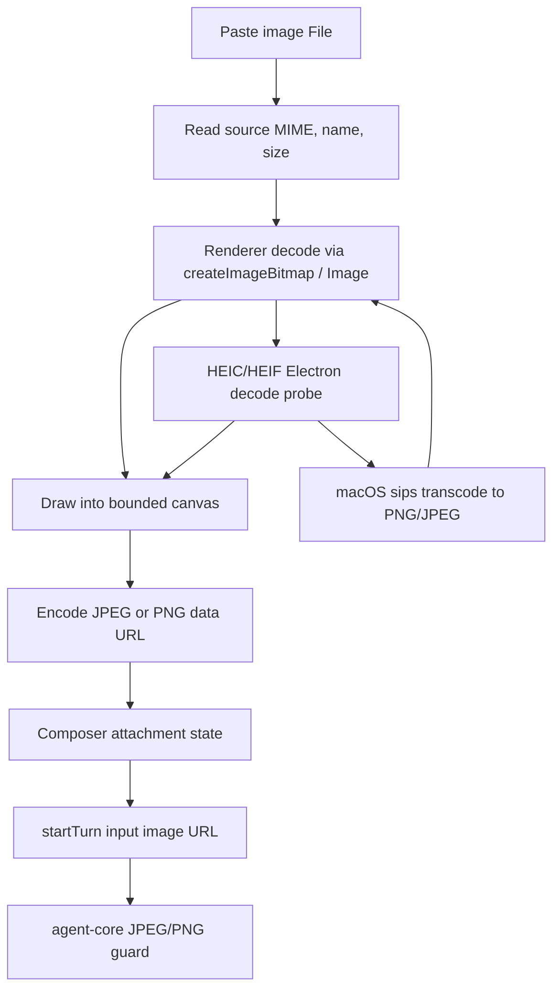

# feat: Normalize Chat Image Uploads

## Overview

Normalize pasted chat images before they leave the desktop renderer so Grok receives only supported, bounded-size image data. The implementation should avoid `sharp` and other native npm image dependencies, prefer Electron/Chromium image primitives, and use macOS `sips` only as a HEIC/HEIF fallback when Electron cannot decode the source.

## Problem Frame

The composer currently accepts any `image/*` clipboard file and sends it as a data URL. xAI image understanding only supports JPEG/PNG inputs, and large pasted images can spend unnecessary tokens. We need a deterministic normalization path that converts common clipboard formats into JPEG/PNG, caps pixel dimensions without upscaling, and proves the paste-to-upload flow with unit and E2E coverage.

## Requirements Trace

- R1. Convert pasted BMP, WebP, SVG, GIF, HEIC, and HEIF inputs into xAI-supported JPEG or PNG before `turn/start`.
- R2. Preserve aspect ratio and never upscale while enforcing `max(width, height) <= 2048` and `min(width, height) <= 1024`.
- R3. Keep `1024x1024` unchanged and allow rectangular images like `1536x1024` unchanged because both dimensions are within the cap.
- R4. Prefer Electron/Chromium APIs; do not add `sharp` or another native npm image-processing dependency.
- R5. Probe whether the current Electron runtime can decode HEIC/HEIF. If not, transcode HEIC/HEIF through `/usr/bin/sips` first, then run the same Electron/renderer normalization pipeline.
- R6. Add unit tests for format selection, resize math, unsupported-provider guards, HEIC fallback routing, and composer integration.
- R7. Add desktop E2E coverage proving a pasted graphics file produces an upload payload with JPEG/PNG MIME type and compliant dimensions.

## Scope Boundaries

- No `sharp`, ImageMagick, ffmpeg, or Homebrew dependency in the app.
- No animated image preservation in this pass. GIF/WebP animation may normalize to the first decoded frame.
- No automatic token estimator in this pass; pixel bounds and output MIME type are the control surface.
- No live xAI/Grok API calls in E2E tests.
- No provider-specific image resizing inside `packages/agent-core`; agent-core should validate final inputs, while desktop owns UI image normalization.

## Context & Research

### Relevant Code and Patterns

- `apps/desktop/src/renderer/src/features/composer/Composer.tsx` owns pasted image collection, attachment preview state, optimistic message parts, and `startTurn` input construction.
- `apps/desktop/src/renderer/src/features/composer/__tests__/composer.test.tsx` already covers pasted JPEG/PNG attachments flowing into `startTurn`.
- `apps/desktop/src/preload/index.ts`, `apps/desktop/src/shared/ipc.ts`, and `apps/desktop/src/renderer/src/lib/desktop-api.ts` define the renderer-to-main API shape for focused desktop utilities.
- `apps/desktop/src/main/ipc/agent-ipc.ts` shows the existing IPC handler registration/logging style to follow for a small image-normalization IPC surface.
- `apps/desktop/e2e/fixtures/electron-app.ts` launches replay-backed Electron tests and exposes a main-process replay driver. The replay client currently discards `startTurn` params, so E2E payload assertions need a small test-driver extension.
- `packages/agent-core/src/providers/ai-sdk-message-builder.ts` currently accepts any `data:image/*` URL and maps local `.gif`, `.webp`, `.bmp`, and `.svg` files to provider image parts. That must be tightened so unsupported formats cannot bypass the desktop normalizer.

### Institutional Learnings

- No relevant `docs/solutions/` image upload, Electron image conversion, or paste-flow learning was found.

### External References

- Electron `nativeImage` docs guarantee PNG and JPEG support across platforms and note `createFromBuffer` tries PNG/JPEG first. They also expose `toPNG`, `toJPEG`, and `resize`, but do not document HEIC as supported: https://www.electronjs.org/docs/latest/api/native-image
- MDN documents `createImageBitmap` as accepting `Blob` image sources and `HTMLCanvasElement.toBlob` as the browser-native path for exporting PNG/JPEG blobs: https://developer.mozilla.org/en-US/docs/Web/API/Window/createImageBitmap and https://developer.mozilla.org/en-US/docs/Web/API/HTMLCanvasElement/toBlob
- MDN lists WebP, BMP, GIF, and SVG as browser-supported image formats, making them reasonable candidates for renderer decode before canvas export: https://developer.mozilla.org/en-US/docs/Web/Media/Guides/Formats/Image_types
- xAI image understanding limits direct image input to JPEG/PNG and a 20 MiB maximum per image: https://docs.x.ai/developers/model-capabilities/images/understanding
- Local macOS probing with `sips --formats` shows `/usr/bin/sips` can read HEIC/HEIF, WebP, BMP, GIF, SVG, JPEG, and PNG on this machine, and can write at least JPEG/PNG/HEIC/GIF/BMP. Treat this as an implementation-time capability check, not a cross-platform guarantee.

## Key Technical Decisions

- **Normalize in the renderer by default:** Clipboard `File` objects are already in the renderer, and Chromium can decode the common web formats into canvas without adding dependencies. This keeps the main process out of the hot path for PNG/JPEG/WebP/BMP/GIF/SVG.
- **Use a narrow main-process fallback only for HEIC/HEIF:** Electron docs do not claim HEIC support. The implementation should probe Electron decode first, then use `sips` on macOS when Electron cannot decode HEIC/HEIF. Non-macOS HEIC/HEIF should fail with a clear unsupported-format message for now.
- **Represent the normalized attachment as the source of truth:** `ComposerImageAttachment.url`, `type`, and `size` should describe the normalized blob, while optional metadata can preserve original name/type/size/dimensions for UI diagnostics and tests.
- **Choose final MIME by alpha and source semantics:** Prefer JPEG quality around 0.85 for opaque photographic/raster content. Use PNG when the decoded image has alpha or when preserving transparency matters.
- **Keep agent-core strict:** The provider layer should accept only JPEG/PNG data URLs and local JPEG/PNG files. If another client sends WebP/GIF/BMP/SVG/HEIC directly, fail early with a message that the client must normalize first.
- **Make E2E inspect the actual app-server request payload:** Extend replay testing to record the last `startTurn` params rather than testing only DOM previews.

## Open Questions

### Resolved During Planning

- **Should we add `sharp`?** No. Use Electron/Chromium APIs and `sips` as the macOS fallback for HEIC/HEIF.
- **Should `1536x1024` be resized?** No. It satisfies both dimension caps.
- **Should provider validation remain permissive?** No. It should reject unsupported formats so future non-desktop callers cannot reintroduce xAI failures.

### Deferred to Implementation

- **Does this Electron build decode HEIC directly?** Runtime probing belongs in implementation. The plan requires a probe and `sips` fallback rather than assuming either outcome.
- **Exact JPEG quality threshold:** Start around 0.85 and adjust only if tests or manual inspection show poor text readability or unexpectedly large output.
- **Exact alpha detection cost:** A full alpha scan is correct but can be expensive on very large images. Implementation can sample or short-circuit after resize as long as transparent images still choose PNG.

## High-Level Technical Design

> *This illustrates the intended approach and is directional guidance for review, not implementation specification. The implementing agent should treat it as context, not code to reproduce.*

The resize scale should be derived from both caps:

- `longEdgeScale = 2048 / max(width, height)`
- `shortEdgeScale = 1024 / min(width, height)`
- `scale = min(1, longEdgeScale, shortEdgeScale)`

That keeps square images at or below `1024x1024`, allows `1536x1024`, and reduces `3000x2000` to `1536x1024`.

## Implementation Units

- [x] **Unit 1: Add Renderer Image Normalization Core**

**Goal:** Add a testable renderer-side module that decodes browser-supported image files, computes bounded output dimensions, draws to canvas, and emits JPEG/PNG attachment data.

**Requirements:** R1, R2, R3, R4

**Dependencies:** None

**Files:**
- Create: `apps/desktop/src/renderer/src/lib/image-normalization.ts`
- Create: `apps/desktop/src/renderer/src/lib/__tests__/image-normalization.test.ts`

**Approach:**
- Expose a small normalization function that accepts a `File` plus optional fallback hooks and returns normalized data URL, MIME type, byte size, final dimensions, and original metadata.
- Keep resize math in a pure helper so dimension behavior is fully unit-tested without canvas.
- Use `createImageBitmap(file)` where available, with an `HTMLImageElement` object URL fallback for formats Chromium can display but `createImageBitmap` rejects.
- Draw into a canvas sized by the cap calculation and export with `canvas.toBlob("image/jpeg", quality)` or `canvas.toBlob("image/png")`.
- Select PNG when transparency is detected or likely required; otherwise select JPEG.

**Execution note:** Add the pure sizing and MIME-selection tests first, then add the browser/canvas integration tests around injected decode/encode seams so Vitest is not blocked by jsdom canvas limitations.

**Patterns to follow:**
- Keep renderer helpers near `apps/desktop/src/renderer/src/lib/desktop-api.ts` when they are not component-specific.
- Follow the small pure-helper style already used in composer tests rather than embedding all behavior inside `Composer.tsx`.

**Test scenarios:**
- Happy path: `1024x1024` PNG input normalizes to `1024x1024` and remains PNG.
- Happy path: `1536x1024` JPEG input normalizes to `1536x1024` and remains JPEG.
- Edge case: `3000x2000` input normalizes to `1536x1024`.
- Edge case: `2000x3000` input normalizes to `1024x1536`.
- Edge case: small `640x480` input is not upscaled.
- Edge case: transparent source chooses PNG.
- Happy path: opaque WebP/BMP/GIF/SVG decoded through the injected renderer path outputs JPEG or PNG, never the source MIME type.
- Error path: undecodable non-HEIC image rejects with a user-facing unsupported image message.

**Verification:**
- Unit tests prove resize bounds, no-upscale behavior, final MIME selection, and error messaging without adding image-processing dependencies.

- [x] **Unit 2: Add HEIC/HEIF Probe and `sips` Fallback Bridge**

**Goal:** Route HEIC/HEIF through Electron decode when supported, otherwise through a macOS `sips` transcode before renderer normalization.

**Requirements:** R1, R4, R5, R6

**Dependencies:** Unit 1

**Files:**
- Create: `apps/desktop/src/shared/image-normalization.ts`
- Create: `apps/desktop/src/main/ipc/image-normalization.ts`
- Create: `apps/desktop/src/main/__tests__/image-normalization-ipc.test.ts`
- Modify: `apps/desktop/src/shared/ipc.ts`
- Modify: `apps/desktop/src/preload/index.ts`
- Modify: `apps/desktop/src/renderer/src/lib/desktop-api.ts`
- Modify: `apps/desktop/src/main/index.ts`

**Approach:**
- Add a narrow IPC method for image fallback conversion, not a general file conversion service.
- The request should carry original bytes, original MIME type, and original name. The response should return a PNG or JPEG data URL or bytes plus MIME type.
- For HEIC/HEIF, first probe Electron-native decode in main using `nativeImage.createFromBuffer`, `nativeImage.createFromPath`, or `nativeImage.createThumbnailFromPath` where appropriate. Treat empty images or zero dimensions as unsupported.
- If Electron cannot decode HEIC/HEIF and `process.platform === "darwin"`, write the source to a temp file, run `/usr/bin/sips` to produce a temporary PNG or JPEG intermediate, read the result, and clean up temp files.
- Return the `sips` output to the renderer, then pass it through the Unit 1 canvas path so all formats share the same dimension cap and final MIME selection.
- Cache capability probe results for the process lifetime, but do not cache user image bytes.

**Patterns to follow:**
- Follow the IPC channel constants in `apps/desktop/src/shared/ipc.ts`.
- Follow handler registration and error style from `apps/desktop/src/main/ipc/agent-ipc.ts` and `apps/desktop/src/main/ipc/renderer-error.ts`.

**Test scenarios:**
- Happy path: mocked Electron HEIC decode returns PNG/JPEG bytes without invoking `sips`.
- Happy path: mocked Electron HEIC decode fails on macOS and mocked `sips` succeeds, returning PNG/JPEG bytes.
- Error path: HEIC/HEIF on non-macOS with failed Electron decode returns a clear unsupported-format error.
- Error path: `sips` exits non-zero and the IPC response surfaces a concise conversion failure without leaking temp paths.
- Cleanup: temp input and output paths are removed after success and failure.
- Guard: non-HEIC inputs are rejected by this fallback bridge so it cannot become a broad arbitrary conversion endpoint.

**Verification:**
- Main-process tests cover Electron-first routing, `sips` fallback routing, failure propagation, and cleanup.

- [x] **Unit 3: Wire Normalization Into Composer Paste Flow**

**Goal:** Replace direct `FileReader.readAsDataURL` attachment handling with normalized attachment handling before previews, optimistic messages, and `startTurn` payloads are constructed.

**Requirements:** R1, R2, R3, R4, R5, R6

**Dependencies:** Units 1 and 2

**Files:**
- Modify: `apps/desktop/src/renderer/src/features/composer/Composer.tsx`
- Modify: `apps/desktop/src/renderer/src/features/composer/__tests__/composer.test.tsx`

**Approach:**
- Keep `getPastedImageFiles` broad enough to capture `image/*` clipboard files, then normalize each file before adding it to `imageAttachments`.
- Store normalized MIME type and normalized size on the attachment. Preserve original name for alt text, and optionally preserve original MIME/size/dimensions in metadata for future diagnostics.
- Use the normalized data URL for preview, optimistic user message image parts, and `AppServerTurnInputItem`.
- Show a clear send error if normalization fails. Do not attach partially failed images unless the implementation intentionally reports which files succeeded and which failed.
- Avoid blocking text paste when no image files are present.

**Patterns to follow:**
- Preserve the existing composer state transitions around `sending`, `sendError`, optimistic messages, and image-only replies.
- Extend existing paste tests instead of replacing them wholesale.

**Test scenarios:**
- Happy path: pasted JPEG with text sends a normalized `data:image/jpeg` or `data:image/png` URL and optimistic message uses the same URL.
- Happy path: pasted image-only reply remains sendable after normalization.
- Happy path: pasted WebP/BMP/SVG/GIF file is accepted and sent as JPEG/PNG.
- Error path: normalization failure leaves the image unattached and displays a readable error.
- Edge case: duplicate clipboard file detection still prevents duplicate attachments.
- Integration: HEIC file calls the desktop fallback hook when renderer decode fails and sends the fallback-normalized JPEG/PNG result.

**Verification:**
- Composer tests prove all outgoing image URLs are final normalized URLs, not raw source data URLs.

- [x] **Unit 4: Tighten Provider Image Guards**

**Goal:** Ensure any image that reaches the AI SDK provider is JPEG/PNG or fails before making a remote xAI request.

**Requirements:** R1, R6

**Dependencies:** None, but should land with Unit 3 to avoid breaking current desktop uploads.

**Files:**
- Modify: `packages/agent-core/src/providers/ai-sdk-message-builder.ts`
- Modify: `packages/agent-core/src/__tests__/ai-sdk-message-builder.test.ts`

**Approach:**
- Accept only `data:image/png`, `data:image/jpeg`, and `data:image/jpg` data URLs.
- Map local image paths only for `.png`, `.jpg`, and `.jpeg`.
- Reject `.gif`, `.webp`, `.bmp`, `.svg`, `.heic`, `.heif`, and unknown local extensions with a message that clients must normalize images before provider submission.
- Keep `http` and `https` image URLs accepted because xAI can fetch public URLs, but do not infer MIME type for them.

**Patterns to follow:**
- Keep errors in `ai-sdk-message-builder.ts` explicit and close to the existing `file://` rejection style.

**Test scenarios:**
- Happy path: PNG and JPEG data URLs produce AI SDK image parts with correct media types.
- Happy path: local `.jpg`, `.jpeg`, and `.png` files are read as bytes with correct media types.
- Error path: WebP/GIF/BMP/SVG/HEIC data URLs are rejected.
- Error path: local `.webp`, `.gif`, `.bmp`, `.svg`, `.heic`, and `.heif` files are rejected.
- Regression: `file://` URLs remain rejected.

**Verification:**
- Agent-core tests prove unsupported image formats cannot reach xAI through this provider path.

- [x] **Unit 5: Add Replay-Backed E2E Payload Assertions**

**Goal:** Prove the real Electron paste flow sends normalized image payloads with compliant dimensions.

**Requirements:** R2, R3, R7

**Dependencies:** Units 1, 3, and replay driver extension in this unit

**Files:**
- Create: `apps/desktop/e2e/composer-image-normalization.spec.ts`
- Create: `apps/desktop/e2e/fixtures/composer-image-normalization/replay.fixture.json`
- Create or modify: `apps/desktop/e2e/fixtures/composer-image-normalization/*`
- Modify: `apps/desktop/src/main/testing/replay-client.ts`
- Modify: `apps/desktop/src/main/testing/replay-runtime.ts`
- Modify: `apps/desktop/e2e/fixtures/electron-app.ts`
- Test: `apps/desktop/src/main/__tests__/replay-client.test.ts`
- Test: `apps/desktop/src/main/__tests__/replay-runtime.test.ts`

**Approach:**
- Extend the replay client/runtime to record the last `startTurn` params and expose them through the E2E fixture helper.
- Use Playwright to dispatch a paste event containing a generated `File` for at least one large non-JPEG/PNG format that Chromium can decode, such as WebP or BMP.
- After clicking Send, inspect the recorded `startTurn.input` image URL from the replay driver.
- Decode the emitted data URL inside the renderer test page and assert final MIME type and dimensions.
- Add a macOS-only HEIC/HEIF E2E only if a stable fixture can be generated or checked in without licensing concerns; otherwise keep HEIC covered by unit tests and a manual verification note.

**Patterns to follow:**
- Follow `apps/desktop/e2e/provider-model-selectors.spec.ts` and `apps/desktop/e2e/directory-launchpad-transcript-sync.spec.ts` for replay-backed Electron launch and cleanup.
- Use the project-local desktop E2E fixture seeding skill only if a captured replay fixture needs to be refreshed from a live session.

**Test scenarios:**
- Integration: paste a `3000x2000` generated image, send it, and assert the recorded upload image is JPEG/PNG at `1536x1024`.
- Integration: paste a `1536x1024` generated image, send it, and assert dimensions remain `1536x1024`.
- Integration: paste a `1024x1024` generated image, send it, and assert dimensions remain `1024x1024`.
- Integration: paste a WebP or BMP source and assert the recorded upload MIME type is not WebP/BMP.
- Optional macOS integration: paste HEIC/HEIF and assert it routes to JPEG/PNG when the fixture and platform support are available.

**Verification:**
- E2E tests prove the shipped Electron app, not just isolated helpers, sends normalized `startTurn` image input.

## System-Wide Impact

- **Interaction graph:** Clipboard paste flows through `Composer.tsx`, renderer normalization, optional main IPC fallback, replay/client `startTurn`, and agent-core provider validation.
- **Error propagation:** Decode/conversion failures should become composer `sendError` messages before `startTurn`, while provider guard failures remain defensive errors for non-desktop callers.
- **State lifecycle risks:** Attachment previews and optimistic user messages must use the same normalized URL that is sent to the backend to avoid UI/backend mismatch.
- **API surface parity:** The preload `DesktopApi` type, context bridge implementation, IPC constants, and main handler registration must stay in sync.
- **Integration coverage:** Unit tests alone will not prove clipboard event handling or IPC bridge behavior, so replay-backed E2E must inspect the actual `turn/start` payload.
- **Unchanged invariants:** Existing text-only composer behavior, skill mention hydration, plan mode, launchpad materialization, and Codex/Grok backend selection should not change.

## Risks & Dependencies

| Risk | Mitigation |
|------|------------|
| Electron/Chromium does not decode a source format despite browser docs suggesting support. | Treat decode as a fallible operation, surface a clear unsupported-format error, and keep HEIC/HEIF on a separate probe/fallback path. |
| `sips` behavior differs across macOS versions. | Check for `/usr/bin/sips`, keep `sips` fallback macOS-only, unit-test command failure paths, and do not rely on Homebrew tools. |
| SVG input may contain external resources or huge dimensions. | Decode through browser image/canvas only, enforce output pixel caps, and fail cleanly if canvas export is tainted or decode fails. |
| PNG output for opaque photos is too large. | Prefer JPEG for opaque images and keep PNG for transparency-sensitive images. |
| E2E cannot reliably create clipboard files in Electron. | Dispatch a synthetic paste event with `DataTransfer`/`File` in the renderer; if Electron blocks that path, expose a test-only injection helper through the page under replay environment only. |
| Provider guard lands before composer normalization and breaks current non-PNG/JPEG paste behavior. | Land provider guard with composer normalization in the same implementation series. |

## Documentation / Operational Notes

- Add or update developer-facing notes only if implementation introduces a new image-normalization IPC surface that future contributors need to understand.
- Keep user-facing copy limited to concise failure messages such as unsupported format or conversion failed.
- No config migration is expected.

## Sources & References

- Related code: `apps/desktop/src/renderer/src/features/composer/Composer.tsx`
- Related tests: `apps/desktop/src/renderer/src/features/composer/__tests__/composer.test.tsx`
- Related provider code: `packages/agent-core/src/providers/ai-sdk-message-builder.ts`
- Related E2E harness: `apps/desktop/e2e/fixtures/electron-app.ts`
- Electron nativeImage docs: https://www.electronjs.org/docs/latest/api/native-image
- MDN createImageBitmap docs: https://developer.mozilla.org/en-US/docs/Web/API/Window/createImageBitmap
- MDN canvas toBlob docs: https://developer.mozilla.org/en-US/docs/Web/API/HTMLCanvasElement/toBlob
- MDN image format guide: https://developer.mozilla.org/en-US/docs/Web/Media/Guides/Formats/Image_types
- xAI image understanding docs: https://docs.x.ai/developers/model-capabilities/images/understanding
