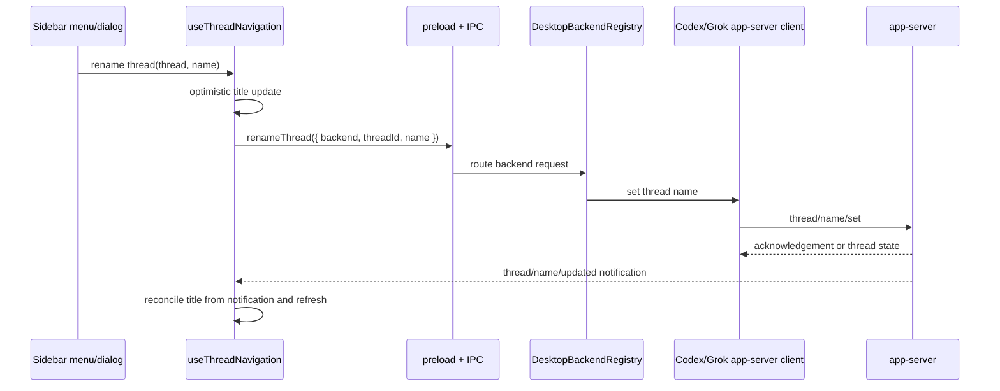

# feat: Add thread rename actions for Codex and Grok

## Overview

Add user-facing thread rename support through the desktop thread actions menu, backed by the app-server `thread/name/set` protocol for both Codex and Grok. The existing thread naming model already distinguishes explicit, derived, and fallback titles; this work adds the missing mutation path so users can intentionally set an explicit name and see it propagate through navigation and thread detail surfaces.

## Problem Frame

The product is thread-first, so thread identity needs to be user-editable, not only derived from the first prompt or backend metadata (see origin: `docs/brainstorms/2026-04-16-thread-centric-agent-desktop-requirements.md`). The repo already contains the read-side naming contract and agent-core support for `thread/name/set`, and `/Users/huntharo/pwrdrvr/openclaw-codex-app-server` confirms the Codex app-server method shape. The current desktop gap is cross-layer mutation support: no shared desktop request/response contract, no Codex/Grok desktop client method, no IPC/preload bridge, and no UI affordance from the thread actions menu.

## Requirements Trace

- R1. Users can rename any listed Codex or Grok thread from the existing thread actions menu.
- R2. Rename requests use the app-server protocol method `thread/name/set` with `threadId` and `name`, matching prior OpenClaw Codex app-server behavior.
- R3. Grok exposes the same rename behavior as Codex through its app-server client surface.
- R4. Successful rename updates navigation rows, thread detail headers, inbox/recents/directories views, and selected-thread state without requiring an app restart.
- R5. Rename errors are surfaced in the sidebar masthead error area and do not leave the UI stuck in a false renamed state.
- R6. Empty or whitespace-only names are rejected in the desktop UI for this first pass; clearing an explicit name back to derived/fallback title state is out of scope.

## Scope Boundaries

- In scope: desktop UI rename entry point, shared desktop contracts, Electron IPC/preload bridge, backend registry routing, Codex and Grok desktop client methods, and tests.
- In scope: preserving existing `thread/name/updated` notification handling and using it as the cross-backend live update signal.
- Out of scope: AI-generated title suggestions, automatic title generation, bulk rename, inline row editing, clearing explicit names, and renaming linked directories/worktrees.
- Out of scope: changing the existing explicit/derived/fallback title model from `docs/plans/2026-04-16-004-feat-thread-naming-parity-plan.md`.

## Context & Research

### Relevant Code and Patterns

- `packages/agent-core/src/app-server/codex-app-server.ts` already supports `thread/name/set`, emits `thread/name/updated`, and includes the method in `SUPPORTED_METHODS`.
- `packages/agent-core/src/app-server/session-state.ts` already persists explicit thread names through `setThreadName()` and returns list summaries with `titleSource: "explicit"`.
- `packages/agent-core/src/__tests__/codex-app-server-contract.test.ts` already covers creating, listing, renaming, and resuming a Grok-backed app-server thread.
- `/Users/huntharo/pwrdrvr/openclaw-codex-app-server/src/client.ts` uses `thread/name/set` with `{ threadId, name }`, confirming the Codex protocol shape to mirror.
- `apps/desktop/src/main/codex-app-server/client.ts` and `apps/desktop/src/main/grok-app-server/client.ts` already follow a request-wrapper pattern for `thread/archive`; rename should use the same layer and timeout/error behavior.
- `apps/desktop/src/main/app-server/backend-registry.ts` centralizes backend capability detection, per-backend routing, and Codex default/full-access fallback behavior.
- `apps/desktop/src/main/ipc/app-server.ts`, `apps/desktop/src/preload/index.ts`, and `apps/desktop/src/renderer/src/lib/desktop-api.ts` define the desktop bridge pattern for app-server actions.
- `apps/desktop/src/renderer/src/lib/useThreadNavigation.ts` already handles `thread/name/updated` notifications and has `applyThreadNameUpdate()` for updating navigation snapshots.
- `apps/desktop/src/renderer/src/features/navigation/Sidebar.tsx` and `ThreadRow.tsx` now expose an overflow/context menu that can host both `Rename Thread` and `Archive Thread`.

### Institutional Learnings

- `docs/solutions/` does not exist in this worktree, so there are no prior solution notes to incorporate.

### External References

- No web research was needed. Local prior art in `/Users/huntharo/pwrdrvr/openclaw-codex-app-server` and current repo contract tests provide the relevant protocol evidence.

## Key Technical Decisions

- Use `thread/name/set` as the single backend protocol method: this matches OpenClaw and the existing agent-core app-server contract, avoiding a PwrAgnt-only backend command.
- Add a shared desktop `RenameThreadRequest` / `RenameThreadResponse` rather than overloading thread list or archive contracts: rename is a first-class mutation with its own error and optimistic-update lifecycle.
- Route Codex rename through the same preferred-mode fallback used for Codex archive and turn operations: a thread may be associated with either default or full-access Codex client mode, and rename should not fail just because the first guessed mode is wrong.
- Let backend notifications and explicit refresh converge state after optimistic UI updates: the renderer can update immediately, but `thread/name/updated` and `getNavigationSnapshot()` remain the source of truth.
- Use a modal rename dialog opened from the existing context menu instead of inline row editing: it is faster to ship consistently across Recents, Inbox, and Directories, avoids row layout churn, and works for right-click and overflow-menu entry points.
- Reject blank names in the desktop UI: the underlying agent-core state can clear names with an empty string, but product behavior for “clear explicit title and return to derived title” is not defined by this request.

## Open Questions

### Resolved During Planning

- Which protocol method should Codex use? Use `thread/name/set` with `{ threadId, name }`, confirmed by current agent-core tests and OpenClaw prior art.
- Does Grok need new agent-core server support? No new app-server method is needed in `packages/agent-core`; it already supports `thread/name/set`. Grok still needs the desktop client method, registry wiring, and tests.
- Should rename live in the same menu as archive? Yes. The user asked for the overflow `...` to expose the same right-click context menu, and rename naturally belongs in that action surface.

### Deferred to Implementation

- Exact dialog copy and input focus handling: follow surrounding sidebar/modal style while implementing and verify with tests.
- Whether Codex app-server responses include the renamed thread state or only an acknowledgement: clients should not depend on response richness; they should return a desktop-shaped acknowledgement and rely on refresh/notification for authoritative state.
- Whether a future “Clear custom name” action should call `thread/name/set` with an empty name: intentionally deferred until product behavior is defined.

## High-Level Technical Design

> *This illustrates the intended approach and is directional guidance for review, not implementation specification. The implementing agent should treat it as context, not code to reproduce.*

## Implementation Units

- [x] **Unit 1: Add shared rename contract and backend capability**

**Goal:** Define a first-class desktop rename mutation contract and expose backend capability metadata for UI gating.

**Requirements:** R1, R2, R3

**Dependencies:** None

**Files:**
- Modify: `packages/shared/src/contracts/app-server.ts`
- Modify: `packages/shared/src/contracts/backend.ts`
- Modify: `apps/desktop/src/main/app-server/backend-registry.ts`
- Test: `apps/desktop/src/main/__tests__/backend-registry.test.ts`
- Test/support updates as needed: renderer and main test fixtures that construct `BackendSummary` literals

**Approach:**
- Add request/response types carrying `backend`, `threadId`, `name`, and acknowledgement metadata such as `renamedAt`.
- Add a `renameThread` backend capability computed from `thread/name/set`, with the same Codex empty-methods assumption used for other Codex app-server methods.
- Keep the contract focused on the explicit title mutation, not a full thread-summary replacement, so UI state remains reconciled by notifications and snapshot refresh.
- Treat the `BackendCapabilities` shape change as a shared type update: adjust local fixture builders and hard-coded backend summaries at the same time rather than patching compile failures opportunistically.

**Patterns to follow:**
- `ArchiveThreadRequest` / `ArchiveThreadResponse` in `packages/shared/src/contracts/app-server.ts`
- `buildCapabilities()` in `apps/desktop/src/main/app-server/backend-registry.ts`

**Test scenarios:**
- Happy path: a backend whose methods include `thread/name/set` reports `capabilities.renameThread: true`.
- Happy path: Codex with an empty methods array still reports rename support through the existing assumed app-server surface.
- Edge case: a backend without `thread/name/set` reports `renameThread: false`.
- Integration: representative main and renderer tests that construct backend summaries still compile and either set rename capability explicitly or use a shared fixture helper.

**Verification:**
- Backend summaries can tell the renderer whether rename should be available without hard-coding backend names in UI components.

- [x] **Unit 2: Implement Codex and Grok app-server client rename methods**

**Goal:** Make both desktop backend clients send `thread/name/set` and return a stable desktop acknowledgement.

**Requirements:** R2, R3

**Dependencies:** Unit 1

**Files:**
- Modify: `apps/desktop/src/main/codex-app-server/client.ts`
- Modify: `apps/desktop/src/main/grok-app-server/client.ts`
- Modify: `apps/desktop/src/main/app-server/backend-registry.ts`
- Test: `apps/desktop/src/main/__tests__/codex-client.test.ts`
- Test: `apps/desktop/src/main/__tests__/grok-app-server-client.test.ts`
- Test: `apps/desktop/src/main/__tests__/backend-registry.test.ts`

**Approach:**
- Extend the internal `BackendClient` shape with an optional rename method.
- Implement Codex rename using the existing request-with-fallbacks/timeout pattern and the `thread/name/set` method from OpenClaw prior art.
- Implement Grok rename by invoking `thread/name/set` through the Grok client request path; agent-core already performs the state mutation and emits `thread/name/updated`.
- Add a registry helper mirroring `archiveWithClient`, including a clear unsupported-backend error.
- For Codex, route through `withCodexThreadClient()` so default/full-access mode selection follows existing thread operations.

**Patterns to follow:**
- `archiveThread()` in both desktop app-server clients
- `archiveWithClient()` and `withCodexThreadClient()` in `DesktopBackendRegistry`
- `packages/agent-core/src/__tests__/codex-app-server-contract.test.ts` for expected Grok app-server behavior

**Test scenarios:**
- Happy path: Codex client sends JSON-RPC method `thread/name/set` with the chosen `threadId` and `name`.
- Happy path: Grok client renames a thread, subsequent `listThreads()` returns the new title with `titleSource: "explicit"`, and `thread/name/updated` is observed.
- Integration: backend registry routes Codex rename through the Codex client and Grok rename through the Grok client.
- Error path: registry returns an actionable error when the selected backend client does not expose rename support.
- Edge case: response payloads with or without a thread id still produce an acknowledgement for the requested `threadId`.

**Verification:**
- Both providers can rename a thread through a single registry API, and tests prove the wire method stays aligned with the app-server contract.

- [x] **Unit 3: Add Electron IPC and preload bridge for rename**

**Goal:** Expose the backend rename mutation safely to renderer code through the same desktop bridge style as archive/read/list.

**Requirements:** R1, R4, R5

**Dependencies:** Unit 2

**Files:**
- Modify: `apps/desktop/src/shared/ipc.ts`
- Modify: `apps/desktop/src/main/ipc/app-server.ts`
- Modify: `apps/desktop/src/preload/index.ts`
- Modify: `apps/desktop/src/renderer/src/lib/desktop-api.ts`
- Test: `apps/desktop/src/main/__tests__/app-server-ipc.test.ts`

**Approach:**
- Add a dedicated IPC channel for rename requests.
- Add a `DesktopAppServerService.renameThread()` method that delegates to `DesktopBackendRegistry.renameThread()`, logs backend/thread id metadata, and returns the shared response.
- Expose `renameThread` on the preload `desktopApi` and renderer `DesktopApi` type.
- Preserve existing IPC handler registration/disposal style.

**Patterns to follow:**
- `APP_SERVER_ARCHIVE_THREAD_CHANNEL`
- `DesktopAppServerService.archiveThread()`
- Preload methods for `archiveThread`, `setThreadExecutionMode`, and `setThreadModelSettings`

**Test scenarios:**
- Happy path: IPC handler forwards `{ backend: "codex", threadId, name }` to the registry and returns the rename response.
- Error path: registry rejection propagates through the IPC promise so renderer code can surface the message.
- Integration: preload exposes `renameThread` with the shared request/response types.

**Verification:**
- Renderer code can call one typed desktop API method for both Codex and Grok rename requests.

- [x] **Unit 4: Add renderer rename flow and optimistic navigation updates**

**Goal:** Let users rename a thread from the thread actions menu and keep thread lists/details visually current.

**Requirements:** R1, R4, R5, R6

**Dependencies:** Unit 3

**Files:**
- Modify: `apps/desktop/src/renderer/src/lib/useThreadNavigation.ts`
- Modify: `apps/desktop/src/renderer/src/App.tsx`
- Modify: `apps/desktop/src/renderer/src/features/navigation/Sidebar.tsx`
- Modify: `apps/desktop/src/renderer/src/features/navigation/ThreadRow.tsx` if action metadata needs to pass through
- Modify: `apps/desktop/src/renderer/src/styles/app.css`
- Test: `apps/desktop/src/renderer/src/lib/__tests__/useThreadNavigation.test.tsx`
- Test: `apps/desktop/src/renderer/src/features/navigation/__tests__/sidebar.test.tsx`
- Test: `apps/desktop/src/renderer/src/__tests__/app-shell.test.tsx`

**Approach:**
- Add `renameThread` and `renameThreadError` to the navigation hook, mirroring archive error handling but updating titles instead of removing threads.
- Optimistically apply the trimmed name to the current navigation snapshot and optimistic thread when the request starts.
- On success, refresh navigation so inbox/recents/directories and selected detail state converge with backend data.
- On failure, surface the error and refresh to undo any optimistic rename that the backend rejected.
- Extend the thread context menu with `Rename Thread` above `Archive Thread`.
- Open a focused rename dialog from the menu, prefilled with the current displayed title, requiring a non-empty trimmed value before submit.
- Keep `Archive Thread` behavior unchanged.

**Patterns to follow:**
- `archiveThread()` and `applyThreadNameUpdate()` in `useThreadNavigation`
- Context-menu handling in `Sidebar.tsx`
- Existing dialog/button/error styles in `app.css`

**Test scenarios:**
- Happy path: selecting `Rename Thread`, entering `New name`, and submitting calls `onRenameThread` with the selected thread and trimmed name.
- Happy path: a successful rename immediately updates the thread row title and remains correct after refresh.
- Integration: a `thread/name/updated` notification updates a selected thread shown in Recents, Inbox, and Directories.
- Edge case: submitting whitespace-only input keeps the dialog open and does not call the desktop API.
- Edge case: canceling or pressing Escape closes the dialog without changing state.
- Error path: a rejected desktop rename restores backend state after refresh and surfaces `renameThreadError`.
- Accessibility: the rename dialog has a clear accessible name, initial focus on the input, and keyboard-operable submit/cancel controls.

**Verification:**
- Users can rename Codex and Grok threads from the same action surface, and renamed titles appear consistently across navigation lenses and thread detail.

- [x] **Unit 5: Regression coverage for cross-backend rename parity**

**Goal:** Guard the feature against backend drift and ensure rename remains a parity surface for both providers.

**Requirements:** R2, R3, R4

**Dependencies:** Units 1-4

**Files:**
- Modify: `packages/agent-core/src/__tests__/codex-app-server-contract.test.ts` only if existing rename coverage needs strengthening
- Modify: `apps/desktop/src/main/__tests__/grok-app-server-client.test.ts`
- Modify: `apps/desktop/src/main/__tests__/codex-client.test.ts`
- Modify: `apps/desktop/src/renderer/src/__tests__/app-shell.test.tsx`

**Approach:**
- Treat existing agent-core `thread/name/set` coverage as the server contract baseline.
- Add desktop-level parity tests where the current gaps live: client method shape, registry routing, IPC bridge, and renderer behavior.
- Include one app-shell integration-style renderer test proving the rename action updates the currently selected thread header, not just sidebar rows.

**Patterns to follow:**
- Current archive-thread tests added across client, IPC, registry, and sidebar layers
- `refresh-reconciliation.test.ts` coverage that treats title metadata changes as material snapshot changes

**Test scenarios:**
- Integration: Codex and Grok both expose rename capability and can be renamed through the desktop registry API.
- Integration: after a rename, `getNavigationSnapshot()` treats the title change as material and does not incorrectly return unchanged stale data.
- Regression: archive remains available in the context menu after adding rename.
- Regression: existing `thread/name/updated` notification tests still pass and cover both backend event origins where practical.

**Verification:**
- The implementation has coverage at every boundary where a future backend/client change could break rename parity.

## System-Wide Impact

- **Interaction graph:** Context menu/dialog -> `useThreadNavigation.renameThread()` -> preload IPC -> main app-server service -> backend registry -> Codex/Grok client -> app-server `thread/name/set` -> `thread/name/updated` notification -> navigation snapshot reconciliation.
- **Error propagation:** Backend/client errors should reject through registry, IPC, and renderer hook; the sidebar should show the error and refresh from backend state.
- **State lifecycle risks:** Optimistic title updates can conflict with later backend notifications; notification and refresh reconciliation must remain authoritative.
- **API surface parity:** Shared contracts, backend capabilities, main IPC, preload API, renderer `DesktopApi`, Codex client, and Grok client all need the same rename surface.
- **Shared type blast radius:** Adding `BackendCapabilities.renameThread` affects every literal backend summary in tests and fixtures; implementation should update those intentionally or centralize test builders where practical.
- **Integration coverage:** Unit tests need to cover both direct request success and event-driven update because either path may be the first one the user sees.
- **Unchanged invariants:** Rename does not change thread id, backend source, linked directories, execution mode, inbox status, archive state, transcript contents, or derived title behavior for threads that are not explicitly renamed.

## Risks & Dependencies

| Risk | Mitigation |
|------|------------|
| Codex app-server response shape differs between versions | Send only the known `thread/name/set` payload and rely on requested `threadId` plus refresh/notification, not rich response parsing. |
| Optimistic UI shows a name the backend rejects | On rejection, show `renameThreadError` and refresh from authoritative backend state. |
| Context menu becomes crowded as actions grow | Keep actions short, order common non-destructive rename before destructive archive, and reuse the existing overflow/right-click menu. |
| Blank-name semantics accidentally clear titles | Reject whitespace-only names in the desktop dialog for this pass. |
| Grok server support is assumed but not verified at desktop layer | Add Grok client tests that exercise agent-core `thread/name/set` through the real `GrokAppServerClient`. |
| Shared capability type changes cause scattered fixture churn | Update representative fixture builders in the same unit and prefer helper defaults where existing tests repeat the full capability object. |

## Documentation / Operational Notes

- No user documentation update is required for the first pass; the menu item is self-discovering from the existing thread actions menu.
- If backend capability UI is exposed later, `renameThread` should appear alongside other backend method support in backend diagnostics.
- No migration is required; explicit titles are already represented in the existing thread naming model.

## Sources & References

- **Origin document:** `docs/brainstorms/2026-04-16-thread-centric-agent-desktop-requirements.md`
- Related plan: `docs/plans/2026-04-16-004-feat-thread-naming-parity-plan.md`
- Current server contract: `packages/agent-core/src/app-server/codex-app-server.ts`
- Current session state: `packages/agent-core/src/app-server/session-state.ts`
- Current shared thread contracts: `packages/shared/src/contracts/app-server.ts`
- Desktop backend registry: `apps/desktop/src/main/app-server/backend-registry.ts`
- Renderer navigation hook: `apps/desktop/src/renderer/src/lib/useThreadNavigation.ts`
- OpenClaw prior art: `/Users/huntharo/pwrdrvr/openclaw-codex-app-server/src/client.ts`
