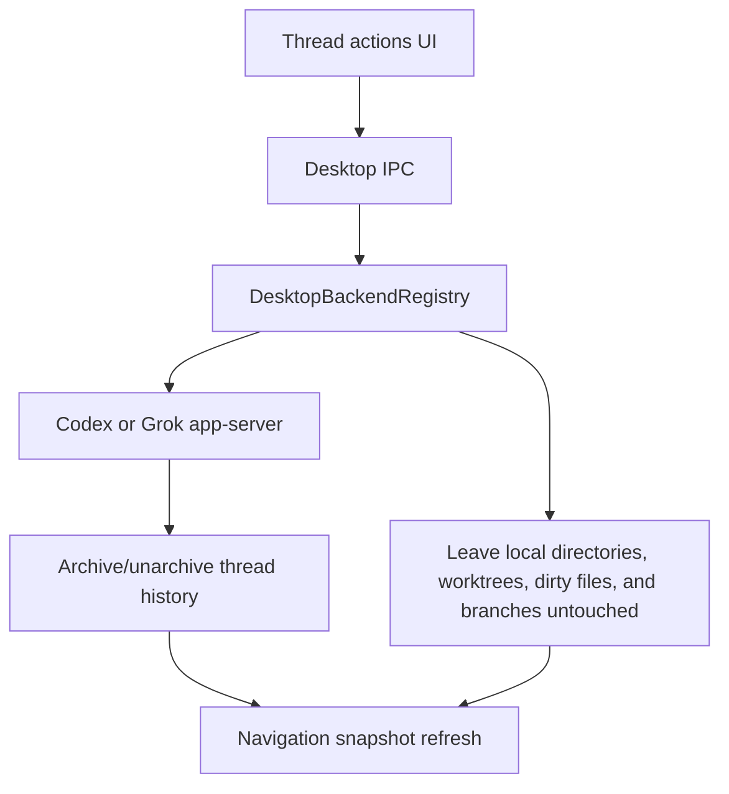

# feat: Archive restore and local-state safety parity

## Overview

Bring PwrAgent's thread archive behavior closer to Codex's archive/restore model while making archive non-destructive to local filesystem state. The current branch can hide active threads and remove linked worktrees, but it does not move Grok rollout files into an archived collection, does not expose unarchive/restore, and currently couples archive to local cleanup that can delete worktrees and branches.

This follow-up plan raises the persistence and safety bar: archived Grok threads should leave the active thread store the way Codex moves rollouts out of active `sessions`, restore should be a first-class backend operation, and archive must not delete or mutate local directories, dirty state, worktrees, or branches. A visible archived-thread restore surface is deferred so the primary sidebar stays focused on active threads.

## Problem Frame

The first archive implementation intentionally moved quickly: it added `thread/archive` for Codex and Grok, hid archived rows, and cleaned up linked worktrees. That was useful, but it is not Codex-parity safe. Codex's local thread store archives by moving rollout JSONL files from `sessions` to `archived_sessions` and unarchives by moving the same file back into the dated `sessions` tree. Codex archive does not appear to delete worktrees or branches in that path.

PwrAgent currently archives Grok by writing `archived = true` in `thread.toml` while leaving the thread under the active `threads` tree. Older Grok agent-core versions can therefore still discover and render those archived threads. PwrAgent also removes worktrees forcefully and deletes branches from the archive path. That behavior is not Codex parity: Codex archive moves thread history and shuts down the active thread, but does not decide that a local worktree or branch is safe to delete.

## Requirements Trace

- R1. Match Codex's thread archive storage shape where practical: active thread listings should not scan archived Grok rollout files, and restore should be able to move archived history back into the active collection.
- R2. Preserve Codex app-server integration as protocol-first: Codex archive/unarchive should call supported app-server methods rather than reading or mutating Codex rollout files directly.
- R3. Add Grok `thread/unarchive` parity so archived Grok threads can be restored through the app-server protocol.
- R4. Preserve desktop restore plumbing for archived threads without exposing an Archived sidebar lens yet; a smaller recent-archived restore surface can be added later.
- R5. Archive must not delete or mutate local directories, registered worktrees, non-git directories, local branches, dirty tracked changes, staged changes, untracked files, ignored local files, or rollout-adjacent working files.
- R6. PwrAgent must not infer local branch deletion conditions from Codex archive. Codex app-server archive does not delete branches, even when a branch is pushed, merged, PR-backed, or clean.
- R7. Capture and expose archive/restore results honestly: thread history moved/restored, local state left untouched, and no implied worktree or branch restoration.
- R8. Examine Codex ghost commits as a dirty-state recovery reference, but treat them as separate turn-level undo artifacts, not archive-time backups.
- R9. Keep existing thread identity and directory/worktree anchoring rules from Codex Desktop parity work: archive/restore must not silently re-home a thread to a different directory or worktree.

## Scope Boundaries

- In scope: Grok archive storage migration, Grok unarchive, desktop unarchive IPC/preload/client support, removing archive-time local cleanup, and local-state preservation metadata where useful.
- In scope: Characterization of Codex archive/unarchive and ghost snapshot behavior from `/Users/huntharo/github/codex`.
- In scope: Tests that prove archive does not call local worktree or branch cleanup and does not mutate non-git directories.
- Out of scope: Mutating Codex's own rollout files directly from PwrAgent.
- Out of scope: Reimplementing the full Codex ghost snapshot system unless the implementation confirms it is needed and can be made durable.
- Out of scope: Deleting or rewriting existing brainstorm/plan documents.
- Out of scope: Any automatic local worktree or branch deletion as part of archive. A future "cleanup local worktree" action should be explicit and separate from archive.

## Context & Research

### Relevant Code and Patterns

- `apps/desktop/src/main/app-server/backend-registry.ts` owns cross-backend archive orchestration. Before this plan was implemented, it called `cleanupThreadWorktrees` after backend archive succeeded; the completed implementation removes that archive-time cleanup call.
- `apps/desktop/src/main/app-server/git-directory-service.ts` owns worktree cleanup. It currently uses `git worktree remove --force` and `git branch -D` after only primary-worktree and protected-branch checks.
- `packages/shared/src/contracts/app-server.ts` defines `ArchiveThreadRequest`, `ArchiveThreadResponse`, and `ArchiveThreadCleanupResult`.
- `apps/desktop/src/main/codex-app-server/client.ts` already lists active and archived Codex threads separately, merges archived metadata into active rows, and calls `thread/archive`.
- `apps/desktop/src/main/grok-app-server/client.ts` now calls Grok `thread/archive`.
- `packages/agent-core/src/app-server/codex-app-server.ts` and `packages/agent-core/src/app-server/session-state.ts` implement Grok `thread/archive` by setting `archived`.
- `packages/agent-core/src/persistence/grok-rollout-store.ts` persists `thread.toml` plus `rollout.jsonl` under `stateRoot/threads/<thread-id>`.
- Renderer navigation is centered in `apps/desktop/src/renderer/src/lib/useThreadNavigation.ts`, `apps/desktop/src/renderer/src/features/navigation/Sidebar.tsx`, and `apps/desktop/src/renderer/src/features/navigation/ThreadRow.tsx`.
- Existing main/renderer test coverage lives in `apps/desktop/src/main/__tests__/backend-registry.test.ts`, `apps/desktop/src/main/__tests__/codex-client.test.ts`, `apps/desktop/src/main/__tests__/grok-app-server-client.test.ts`, `apps/desktop/src/main/__tests__/app-server-ipc.test.ts`, `apps/desktop/src/renderer/src/features/navigation/__tests__/sidebar.test.tsx`, and `packages/agent-core/src/__tests__/grok-rollout-store.test.ts`.

### Codex Archive and Ghost Snapshot Findings

- Codex local thread archive in `archive_thread` moves the rollout file from `codex_home/sessions/...` to `codex_home/archived_sessions/<same filename>` and updates SQLite metadata when present.
- Codex unarchive in `unarchive_thread` finds the archived rollout, derives the dated destination from the rollout filename, moves the file back under `sessions/YYYY/MM/DD`, touches mtime, updates SQLite metadata, and returns the restored thread summary.
- Codex app-server `thread_archive` validates the thread, calls `prepare_thread_for_archive`, then calls the thread store archive operation and emits `thread/archived`. `prepare_thread_for_archive` removes the active thread from the manager, requests shutdown, and finalizes teardown. The archive path does not inspect the thread CWD, run Git cleanup, remove worktrees, delete branches, or decide whether local commits are pushed/merged/PR-backed.
- Codex archive does nothing special with dirty non-committed, non-ignored tree state because archive does not mutate the local worktree. If dirty state existed in the working directory before archive, it remains in place after archive.
- Codex app-server archive has no branch-deletion policy in the archive path. The researched source did not show conditions involving PR merge status, remote branch presence, top-commit containment, pushed status, or clean tree state for local branch deletion during archive.
- Codex archive is not Git-dependent. Non-git directories do not need protection from archive-time cleanup because archive does not attempt local cleanup.
- Codex ghost snapshots are separate from archive. They create detached Git commits via `git commit-tree` using a temporary index so user index state is not disturbed.
- Codex ghost snapshots capture tracked changes and eligible untracked files, while excluding large untracked files and large/default-ignored directories by policy. The `GhostCommit` metadata records preexisting untracked files/dirs so undo can preserve them while removing new untracked paths.
- Codex ghost commits are referenced in rollout history as conversation items for undo. They are not evidence that archive itself backs up dirty state, removes worktrees, or restores removed worktrees.

### Institutional Learnings

- No `docs/solutions/` directory exists in this worktree yet.
- The Codex Desktop protocol parity requirements in `docs/brainstorms/2026-04-19-codex-desktop-protocol-parity-requirements.md` are directly relevant: protocol behavior should drive Codex integration, local git inspection should enrich but not replace protocol identity, and threads must stay anchored to their original worktree/CWD identity.
- The completed first-pass plan in `docs/plans/2026-04-21-001-feat-thread-archive-ui-worktree-cleanup-plan.md` is prior art, but its worktree deletion assumptions are intentionally revised here.

### External References

- None. The important reference behavior is in the local Codex source checkout and the current PwrAgent codebase.

## Key Technical Decisions

- Treat this as a follow-up plan, not a rewrite of the completed UI/archive plan. The old plan remains the record of the first pass; this plan captures parity and safety hardening.
- Mirror Codex's storage concept for Grok by moving archived Grok thread directories out of the active `threads` tree into an archived collection. Because Grok stores `thread.toml` and `rollout.jsonl` together, moving the whole thread directory is the closest practical equivalent to Codex moving one rollout file.
- Add `thread/unarchive` as the restore primitive for Grok and desktop. For Codex, call the Codex app-server `thread/unarchive` method when advertised or supported.
- Extend list-thread plumbing intentionally for archived views instead of overloading active Recents. Restore needs a way to fetch archived rows, and active navigation should remain active-only by default.
- Separate "restore thread" from "restore worktree." Codex unarchive restores thread history to the active collection; it does not recreate deleted worktrees. Because archive must leave local directories untouched, PwrAgent should avoid any copy that implies workspace files were backed up or restored by archive.
- Remove archive-time worktree cleanup. Archive should not call `cleanupThreadWorktrees`, `git worktree remove`, `git branch -d`, or `git branch -D`.
- Remove archive-time branch deletion. Codex does not define safe branch deletion conditions as part of archive, so PwrAgent should not attempt to infer them from push/remote/PR/merge state in the archive flow.
- Treat Codex ghost commits as a design input for future undo or explicit cleanup, not a direct dependency of archive. Detached ghost commits may exist in rollout history from previous turns and should move with archived thread history, but archive should not create a new ghost snapshot or depend on one for safety.
- Keep local preservation visible enough for tests and logs: archive succeeds or fails based on thread history movement, and local filesystem state is left untouched.

## Open Questions

### Resolved During Planning

- Does Codex gzip or compress archived rollouts? No. Codex moves JSONL rollout files into `archived_sessions`.
- Does Codex archive delete local branches or worktrees? No. The app-server archive path and local thread-store archive path contain no worktree or branch deletion. Worktree/branch cleanup is PwrAgent-specific and should be removed from archive.
- What does Codex do with dirty non-committed, non-ignored tree state during archive? Nothing. Archive does not touch the local worktree, so dirty state remains where it was.
- When does Codex app-server decide it can delete a local branch during archive? It does not make that decision in the archive path. No PR, remote, pushed, merged, branch-tip, or clean-tree condition is used for local branch deletion as part of archive.
- Does Codex archive have special non-git directory protections? Archive does not need them because it does not run Git cleanup or filesystem deletion against the thread CWD.
- Should PwrAgent delete local worktrees or branches on archive? No. Archive should leave local state untouched in all cases.

### Deferred to Implementation

- Exact archived Grok directory name and any migration details for already-archived-in-place threads. The plan expects an archived collection, but the implementer should choose the final constant alongside the rollout store code.
- Whether Codex `thread/unarchive` is available in every supported Codex app-server version. The desktop should gate restore UI by capabilities and degrade cleanly when unavailable.
- Whether a future separate "cleanup local worktree" feature should create pinned Git refs, Git bundles, or another artifact for dirty-state recovery. That feature is outside archive and should have its own explicit user action.
- Exact UI placement for archived threads. The plan proposes an Archived navigation surface, but final layout should follow `docs/design/desktop-style-guide.md` and avoid crowding the existing lens switch.

## High-Level Technical Design

> *This illustrates the intended approach and is directional guidance for review, not implementation specification. The implementing agent should treat it as context, not code to reproduce.*

## Implementation Units

- [x] **Unit 1: Characterize Codex archive, unarchive, and ghost snapshots**

**Goal:** Turn the Codex source findings into durable tests/notes that guide implementation and prevent incorrect assumptions about compression, worktree deletion, branch deletion, or ghost commits.

**Requirements:** R1, R2, R5, R6, R8

**Dependencies:** None

**Files:**
- Modify: `docs/plans/2026-04-22-001-feat-archive-restore-safety-parity-plan.md` if implementation discovers a materially different Codex contract
- Test: `apps/desktop/src/main/__tests__/codex-client.test.ts`
- Test: `packages/agent-core/src/__tests__/grok-rollout-store.test.ts`

**Approach:**
- Preserve the research distinction between Codex thread archive and Codex ghost snapshots.
- Record the concrete Codex archive behavior in tests or implementation notes: archive moves rollout history and shuts down the active thread, but does not touch dirty worktree state, branches, PR state, remotes, or non-git directories.
- Add or tighten tests around Codex `thread/list` archived behavior and `thread/unarchive` client behavior once that client method exists.
- Use Codex's ghost snapshot behavior only to inform recovery design: tracked and eligible untracked changes can be represented as a Git commit object, but detached commits alone are not durable archive backups.

**Patterns to follow:**
- Existing Codex client protocol tests in `apps/desktop/src/main/__tests__/codex-client.test.ts`.
- Existing rollout persistence tests in `packages/agent-core/src/__tests__/grok-rollout-store.test.ts`.

**Test scenarios:**
- Happy path: Codex client calls `thread/unarchive` and returns the restored thread id when the app-server method succeeds.
- Edge case: Codex client capability discovery marks restore unavailable when the app-server does not advertise or tolerate `thread/unarchive`.
- Integration: archived Codex metadata is still fetched through protocol list calls, never through direct rollout-file reads.
- Regression guard: no Codex archive client or backend-registry test should assert or require local worktree/branch cleanup for Codex archive.

**Verification:**
- A reviewer can trace every parity claim in this plan to a Codex source path or a PwrAgent test.

- [x] **Unit 2: Move Grok archived threads out of active rollout storage**

**Goal:** Make Grok archive storage match Codex's active-vs-archived separation so older or unaware active scans do not keep showing archived threads from the active `threads` directory.

**Requirements:** R1, R3, R9

**Dependencies:** Unit 1

**Files:**
- Modify: `packages/agent-core/src/persistence/grok-rollout-store.ts`
- Modify: `packages/agent-core/src/app-server/session-state.ts`
- Modify: `packages/agent-core/src/app-server/codex-app-server.ts`
- Modify: `packages/agent-core/src/app-server/protocol.ts`
- Test: `packages/agent-core/src/__tests__/grok-rollout-store.test.ts`
- Test: `packages/agent-core/src/__tests__/session-state.test.ts`
- Test: `packages/agent-core/src/__tests__/codex-app-server-contract.test.ts`
- Test: `packages/agent-core/src/__tests__/codex-app-server-persistence.test.ts`

**Approach:**
- Introduce an archived Grok thread collection beside the active thread collection.
- Archive should move the complete Grok thread directory, including `thread.toml`, `rollout.jsonl`, and provider continuity metadata, out of active storage.
- Active list hydration should scan only active storage. Archived list/read/restore behavior should intentionally consult archived storage.
- Add a migration path for threads previously archived in place by the first implementation: when loading active storage, detect `archived = true` and relocate or ignore according to the final migration strategy.

**Execution note:** Start with characterization tests for the current archived-in-place behavior and then change storage behavior.

**Patterns to follow:**
- Codex local thread store archive/unarchive behavior in `/Users/huntharo/github/codex/codex-rs/thread-store/src/local/archive_thread.rs` and `/Users/huntharo/github/codex/codex-rs/thread-store/src/local/unarchive_thread.rs`.
- Existing atomic TOML/JSONL persistence patterns in `packages/agent-core/src/persistence/grok-rollout-store.ts`.

**Test scenarios:**
- Happy path: archiving a Grok thread moves it out of active storage and `thread/list` no longer returns it.
- Happy path: archived Grok storage still contains `thread.toml`, `rollout.jsonl`, provider continuity, and explicit name metadata.
- Edge case: startup sees an old active `threads/<id>/thread.toml` with `archived = true` and does not return it in active `thread/list`.
- Error path: archive move failure leaves either the active thread intact or an archived thread intact; no partial state causes unreadable history.
- Integration: `thread/read` can still read an archived Grok thread when the caller addresses it directly or when the restore flow needs it.

**Verification:**
- Archived Grok threads are no longer discovered by active storage scans, but remain recoverable through archived storage.

- [x] **Unit 3: Add thread restore protocol and desktop UI support**

**Goal:** Make archive reversible for both Codex and Grok through app-server protocol and desktop UI.

**Requirements:** R2, R3, R4, R7

**Dependencies:** Units 1 and 2

**Files:**
- Modify: `packages/shared/src/contracts/app-server.ts`
- Modify: `packages/shared/src/contracts/navigation.ts`
- Modify: `packages/shared/src/contracts/backend.ts`
- Modify: `apps/desktop/src/main/codex-app-server/client.ts`
- Modify: `apps/desktop/src/main/grok-app-server/client.ts`
- Modify: `apps/desktop/src/main/app-server/backend-registry.ts`
- Modify: `apps/desktop/src/main/ipc/app-server.ts`
- Modify: `apps/desktop/src/preload/index.ts`
- Modify: `apps/desktop/src/renderer/src/lib/desktop-api.ts`
- Modify: `apps/desktop/src/renderer/src/lib/useThreadNavigation.ts`
- Modify: `apps/desktop/src/renderer/src/features/navigation/Sidebar.tsx`
- Modify: `apps/desktop/src/renderer/src/features/navigation/ThreadRow.tsx`
- Test: `apps/desktop/src/main/__tests__/codex-client.test.ts`
- Test: `apps/desktop/src/main/__tests__/grok-app-server-client.test.ts`
- Test: `apps/desktop/src/main/__tests__/backend-registry.test.ts`
- Test: `apps/desktop/src/main/__tests__/app-server-ipc.test.ts`
- Test: `apps/desktop/src/renderer/src/features/navigation/__tests__/sidebar.test.tsx`

**Approach:**
- Add restore/unarchive request and response contracts that mirror archive, including backend and thread id.
- Keep active Recents/Inbox snapshots active-only by default; do not add a visible Archived sidebar lens in this pass.
- Add backend capability flags for restore/unarchive so future restore actions can be capability-gated.
- For Codex, call `thread/unarchive` through the app-server protocol and do not mutate Codex files directly.
- For Grok, implement `thread/unarchive` in agent-core and route desktop restore through the Grok client.
- Defer the archived thread discovery and restore surface until a smaller recent-archived interaction is designed.
- Restore thread history first. Worktree recreation, if supported later, should be an explicit additional action or clearly reported result, not silently implied by unarchive.

**Patterns to follow:**
- Existing archive IPC/preload/client wiring.
- Existing renderer capability gating for archive and rename actions.
- Desktop style guide constraints in `apps/desktop/AGENTS.md`, `docs/UI-THEME.md`, and `docs/design/desktop-style-guide.md`.

**Test scenarios:**
- Happy path: active Recents and Inbox do not include archived rows.
- Happy path: Grok restore moves archived storage back to active storage and active `thread/list` returns it.
- Edge case: no Archived sidebar lens or Restore Thread menu item is rendered yet.

**Verification:**
- A user can archive a Grok or Codex thread without local cleanup, and backend restore plumbing remains available for a future restore surface.

- [x] **Unit 4: Remove archive-time local cleanup**

**Goal:** Make archive a thread-history operation only by removing local worktree and branch deletion from the archive path.

**Requirements:** R5, R6, R7, R9

**Dependencies:** Unit 3 can proceed independently, but this unit should land before any release that includes archive actions.

**Files:**
- Modify: `apps/desktop/src/main/app-server/backend-registry.ts`
- Modify: `packages/shared/src/contracts/app-server.ts`
- Test: `apps/desktop/src/main/__tests__/backend-registry.test.ts`
- Test: `apps/desktop/src/main/__tests__/app-server-ipc.test.ts`

**Approach:**
- Remove `cleanupThreadWorktrees` from the archive orchestration path.
- Do not replace it with a "safe" auto-cleanup decision tree. Codex archive has no branch-delete policy, and the product decision here is that local state always remains.
- Preserve response compatibility where practical. If `ArchiveThreadResponse.cleanup` remains in the shared contract for older callers, archive should return an empty cleanup list or a clearly non-destructive local-state result rather than removal/skipped warnings.
- Keep `GitDirectoryService.cleanupThreadWorktrees` only if another explicit non-archive feature still needs it. If no caller remains, consider deleting it in a separate cleanup commit or marking it internal/deprecated with focused tests around the archive path.
- Ensure error handling distinguishes backend archive failure from local cleanup: after this unit there should be no local cleanup failure to report during archive.

**Patterns to follow:**
- Existing backend-registry archive tests, but invert cleanup expectations so archive asserts local cleanup is not called.
- Existing shared-contract compatibility patterns for optional response fields.

**Test scenarios:**
- Happy path: backend archive succeeds and `cleanupThreadWorktrees` is not invoked.
- Happy path: archive response remains serializable and backwards-compatible when no cleanup is performed.
- Edge case: a thread linked to a dirty Git worktree archives successfully and the dirty files remain untouched.
- Edge case: a thread linked to a non-git directory archives successfully and the directory remains untouched.
- Edge case: a thread on a pushed, merged, PR-backed, or clean branch still does not trigger local branch deletion.
- Integration: IPC archive response refreshes navigation without local cleanup warnings.

**Verification:**
- No archive path invokes `git worktree remove`, `git branch -d`, `git branch -D`, or `cleanupThreadWorktrees`.

- [x] **Unit 5: Preserve Grok rollout state without archive-time backups**

**Goal:** Mirror Codex's dirty-state behavior for Grok: archive moves thread history out of active storage and preserves any recorded history metadata, but does not snapshot or delete local working files.

**Requirements:** R5, R7, R8, R9

**Dependencies:** Units 2 and 4

**Files:**
- Modify: `packages/shared/src/contracts/app-server.ts`
- Modify: `packages/agent-core/src/persistence/grok-rollout-store.ts`
- Test: `packages/agent-core/src/__tests__/grok-rollout-store.test.ts`
- Test: `packages/agent-core/src/__tests__/codex-app-server-persistence.test.ts`

**Approach:**
- Archive should move Grok thread persistence as a unit, including `thread.toml`, `rollout.jsonl`, provider continuity metadata, explicit names, and any future history items that represent turn-level recovery artifacts.
- Do not create a Grok archive-time backup of the local worktree. Codex does not do this during archive, and archive no longer deletes local state.
- If Grok later records ghost-like metadata during normal turns, moving the whole thread directory should preserve that metadata with the archived thread just as Codex moving the rollout preserves prior `GhostSnapshot` items.
- If a future separate local cleanup action wants to delete dirty worktrees, it must define and test durable recovery artifacts in a separate plan. This archive plan should avoid building backup machinery to compensate for deletion that no longer happens.

**Patterns to follow:**
- Codex `GhostCommit` shape as a reference for what snapshot metadata records, without assuming the same persistence durability.
- Existing Grok rollout-store directory move and persistence patterns.

**Test scenarios:**
- Happy path: Grok archive moves rollout history and provider continuity metadata to archived storage.
- Happy path: a Grok thread with dirty local worktree state archives without modifying any files outside the Grok state root.
- Edge case: archived Grok storage preserves any rollout items that may later represent ghost-like recovery metadata.
- Error path: failure to move Grok thread persistence leaves a recoverable active or archived thread and does not touch local working files.

**Verification:**
- Restore UI and logs can distinguish "thread restored" from any local filesystem action. Archive/restore does not claim local files were backed up, deleted, or recreated.

- [x] **Unit 6: Surface archive and restore outcomes in the renderer**

**Goal:** Make archive/restore outcomes understandable without cluttering the thread list or implying local cleanup.

**Requirements:** R4, R7

**Dependencies:** Units 3 and 4

**Files:**
- Modify: `apps/desktop/src/renderer/src/lib/useThreadNavigation.ts`
- Modify: `apps/desktop/src/renderer/src/features/navigation/Sidebar.tsx`
- Modify: `apps/desktop/src/renderer/src/features/navigation/ThreadRow.tsx`
- Modify: `apps/desktop/src/renderer/src/styles/app.css`
- Test: `apps/desktop/src/renderer/src/features/navigation/__tests__/sidebar.test.tsx`

**Approach:**
- Keep the thread row compact; do not add persistent cleanup badges to every row.
- Use concise post-action feedback for archive and restore success/failure.
- Restore should clearly say it restores the thread. Avoid copy that implies workspace files came back, because archive does not delete or restore local files.
- Follow existing `ArchiveThreadError` and rename error patterns, but remove cleanup-skipped warning paths from archive UX unless they remain for backward compatibility with old responses.

**Patterns to follow:**
- Existing renderer error state in `useThreadNavigation`.
- Current context menu and overflow button behavior in `ThreadRow`.
- Desktop style guide guidance to keep sidebar dense and calm.

**Test scenarios:**
- Happy path: archive removes the active row and shows no cleanup warning because no cleanup was attempted.
- Error path: archive backend failure leaves the row active and displays the archive error.
- Edge case: no visible Archived sidebar lens or Restore Thread menu item is rendered in this pass.

**Verification:**
- Users can distinguish archive/restore failures without seeing misleading local cleanup status.

## System-Wide Impact

- **Interaction graph:** Archive and restore cross renderer actions, preload APIs, main-process IPC, backend registry routing, Codex/Grok clients, Grok agent-core persistence, and overlay navigation snapshots. Archive should no longer depend on Git worktree inspection.
- **Error propagation:** Backend archive/restore errors should reject the user action. Local cleanup inspection/removal failures should disappear from archive because archive should not run local cleanup.
- **State lifecycle risks:** Moving Grok thread directories introduces partial-move and migration risks. The store must avoid states where neither active nor archived storage can read the thread.
- **API surface parity:** Any restore contract added to shared types needs desktop bridge support, backend capability advertising, Codex client support, Grok client support, and renderer gating.
- **Integration coverage:** Unit tests can prove most decisions, but at least one cross-layer test should prove archive -> hidden active row -> archived row -> restore -> active row for one backend.
- **Unchanged invariants:** Codex integration remains protocol-first and must not read Codex rollout files directly. Thread directory identity remains anchored to protocol/CWD metadata and must not be reassigned during restore. Local directories, worktrees, dirty files, and branches remain where they are on archive.

## Risks & Dependencies

| Risk | Mitigation |
|------|------------|
| Dirty worktree data loss | Remove archive-time cleanup entirely; tests should assert archive does not call local cleanup or mutate linked directories. |
| Branch deletion removes unmerged work | Remove archive-time branch deletion entirely; any future branch cleanup must be a separate explicit feature. |
| Older Grok builds still show archived threads | Move archived Grok thread directories out of active storage and migrate old archived-in-place state. |
| Restore UI implies file restoration that does not happen | Use copy and contracts that distinguish thread unarchive from worktree recreation. |
| Detached ghost commits are garbage-collected | Do not rely on unreferenced ghost commits for archive recovery; archive should preserve rollout history but should not depend on ghost commits for local safety. |
| Codex app-server version lacks `thread/unarchive` | Gate restore by capability and keep archived UI actions backend-aware. |
| Partial file move corrupts Grok archive state | Use same atomic-file and cautious filesystem patterns already used by Grok rollout persistence; prefer recoverable move semantics and tests around failure. |

## Documentation / Operational Notes

- Update the completed archive plan only if the team wants a back-reference; do not rewrite its completion notes as if the first pass never happened.
- If the implementation introduces an archived Grok storage directory, document it near the Grok runtime config guidance in `AGENTS.md` or a focused docs note.
- If a separate local cleanup feature is planned later, document it independently from archive and require explicit user action before any local directory or branch deletion.

## Sources & References

- Prior plan: `docs/plans/2026-04-21-001-feat-thread-archive-ui-worktree-cleanup-plan.md`
- Protocol parity requirements: `docs/brainstorms/2026-04-19-codex-desktop-protocol-parity-requirements.md`
- PwrAgent archive orchestration: `apps/desktop/src/main/app-server/backend-registry.ts`
- PwrAgent worktree cleanup: `apps/desktop/src/main/app-server/git-directory-service.ts`
- Grok rollout persistence: `packages/agent-core/src/persistence/grok-rollout-store.ts`
- Grok session state archive filter: `packages/agent-core/src/app-server/session-state.ts`
- Codex app-server archive orchestration: `/Users/huntharo/github/codex/codex-rs/app-server/src/codex_message_processor.rs`
- Codex local archive: `/Users/huntharo/github/codex/codex-rs/thread-store/src/local/archive_thread.rs`
- Codex local unarchive: `/Users/huntharo/github/codex/codex-rs/thread-store/src/local/unarchive_thread.rs`
- Codex ghost commits: `/Users/huntharo/github/codex/codex-rs/git-utils/src/ghost_commits.rs`
