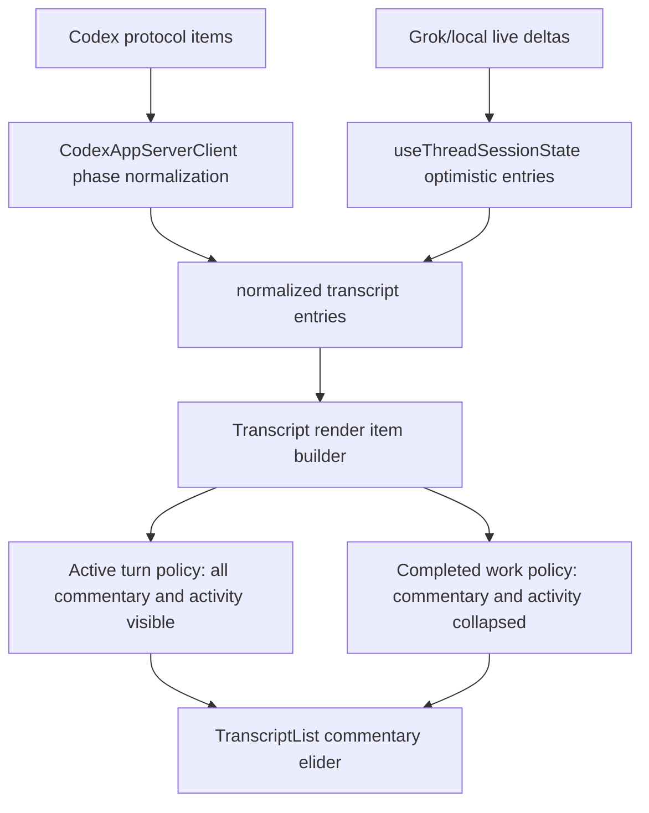

# feat: Add Codex-style work phase eliding

## Overview

Add Codex-style eliding for assistant work phases in the desktop transcript. The app should show interim assistant messages and tool activity while a turn is running, avoid letting long exploration phases dominate completed transcripts, and collapse completed work under the same kind of affordance Codex uses: `Worked for 8m 39s` when there was concrete work and enough elapsed time, with `N previous messages` reserved for commentary-only history.

This plan builds on the recent protocol refactor and live-message preservation work. The next step is not to infer message importance from text; it is to preserve structured phase metadata and render commentary phases with a dedicated transcript policy.

## Problem Frame

The app now preserves distinct assistant messages emitted during a turn instead of overwriting them. That fixed data loss, but it exposed the next UI problem: multi-phase Codex turns can produce several assistant commentary messages before the final answer. Rendering all of them as normal assistant cards makes completed threads noisy, while hiding them during the run would remove useful progress feedback.

Codex solves this with phase-aware and work-aware elision. Generated protocol types already define `MessagePhase = "commentary" | "final_answer"`, and persisted `agentMessage` thread items include `phase`. The desktop normalized contract already has a narrower local phase type, `AppServerTranscriptPhase = "commentary" | "final"`, but the current Codex normalizer only maps `commentary`, live deltas do not carry phase, and `TranscriptList` renders every message flat.

The refinement from inspecting Codex thread `019dadd5-3143-7080-8f32-bbc680ef9941` is that the visible collapsed unit is not only "previous messages." The turn containing final answer `Created the follow-up plan...` emitted commentary, command summaries, patch activity, more commentary, then `final_answer`, and completed with `duration_ms: 524447`. Codex renders that completed work phase as `Worked for 8m 39s`; expanding that row reveals both the hidden commentary and the tool/activity summaries. So the implementation needs a work-phase group that can own commentary plus activity entries, while keeping the final answer outside the collapsed group.

## Requirements Trace

- Show interim assistant commentary while a turn is in progress.
- During an in-progress turn, keep all commentary and work activity visible so users can see current progress.
- Once the final answer arrives, elide completed work-phase content for that turn behind a compact control.
- For completed turns that performed concrete work, label the collapsed control `Worked for <elapsed>` when elapsed time is greater than 60 seconds.
- For completed commentary-only turns, keep the simpler `N previous messages` control.
- Hydrated thread reads should load completed work/commentary groups elided by default.
- Preserve access to elided commentary through an expand/collapse control.
- Avoid persisting collapsed/expanded UI state unless there is a concrete product need.
- Preserve protocol parity with Codex by using structured phase metadata rather than text heuristics.

## Scope Boundaries

- This work does not redesign individual tool activity rendering. Tool calls and results keep the existing activity summary UI; completed work-phase grouping decides whether those existing entries are initially hidden or revealed.
- This work does not persist user expansion state to the backend or app-server thread model in v1.
- This work does not invent new message phases beyond the generated Codex protocol and the existing normalized `commentary`/`final` abstraction.
- This work does not change model behavior or server-side message generation.
- This work does not collapse normal user messages, final assistant answers, or legacy assistant messages without phase metadata. Activity and plan entries may be collapsed only when they belong to a completed work phase.

## Context & Existing Patterns

- `packages/shared/src/generated/codex-app-server-protocol/MessagePhase.ts` defines the upstream phase values: `commentary` and `final_answer`.
- `packages/shared/src/generated/codex-app-server-protocol/v2/ThreadItem.ts` includes `phase: MessagePhase | null` on persisted `agentMessage` items.
- `packages/shared/src/generated/codex-app-server-protocol/v2/Turn.ts` includes `startedAt`, `completedAt`, and `durationMs`; those fields are the right source for hydrated `Worked for` labels.
- `packages/shared/src/generated/codex-app-server-protocol/v2/AgentMessageDeltaNotification.ts` does not include phase on live `item/agentMessage/delta` notifications. Live assistant deltas therefore need a local default unless a future protocol update adds phase.
- `packages/shared/src/contracts/normalized-app-server.ts` already defines `AppServerTranscriptPhase = "commentary" | "final"` and permits `phase?: AppServerTranscriptPhase` on `AppServerThreadMessageEntry`.
- `apps/desktop/src/main/codex-app-server/client.ts` currently maps only persisted `phase === "commentary"` into the normalized contract. It should also map `final_answer` to `final`.
- `apps/desktop/src/main/codex-app-server/client.ts` currently flattens `thread.turns[].items` into transcript entries and drops the turn envelope. That is enough for message elision, but not for `Worked for` grouping, because the renderer needs turn id, status, start/completion time, and duration.
- `apps/desktop/src/renderer/src/lib/useThreadSessionState.ts` now flushes distinct live assistant `itemId`s into the optimistic transcript and appends a distinct final answer from `turn/completed`.
- `apps/desktop/src/renderer/src/features/thread-detail/TranscriptList.tsx` renders `entries`, then pending plan/activity/message/status content in a flat sequence. This is the right boundary for transcript grouping and elision.
- `apps/desktop/e2e/live-agent-messages.spec.ts` and `apps/desktop/e2e/fixtures/live-agent-messages/replay.fixture.json` are the current regression harness for the real bug that made assistant messages write/delete/rewrite.
- Codex TUI has the same underlying rule even though the UI shape differs: `had_work_activity` is set by exec commands, patch applications, MCP tool calls, and web search; `FinalMessageSeparator` only prints `Worked for ...` when elapsed seconds are greater than 60.

## Key Technical Decisions

- **Use phase metadata as the source of truth.** Commentary elision should be driven by `message.phase === "commentary"` and final-answer recognition by `message.phase === "final"` when present. Do not inspect message text to decide what is exploratory.
- **Treat live assistant deltas as commentary by default.** The generated `AgentMessageDeltaNotification` currently has no `phase`. In our current flow, the final answer arrives through `turn/completed.output`, so live `item/agentMessage/delta` entries should be marked `commentary` unless the normalized notification contract later receives an explicit phase.
- **Normalize `final_answer` to `final`.** Persisted Codex reads should retain enough phase information for the renderer to distinguish final answers from commentary after reload.
- **Elide in the renderer, not the stored transcript.** The transcript data should still contain every message. Elision is a presentation transform so tests, debug views, and future features can still access the full thread history.
- **Do not persist expansion state in v1.** Collapsed/expanded state is a view preference, not transcript content. Keep it in renderer state keyed by thread and commentary group identity. Hydrated completed threads should default to collapsed every time they load.
- **Only collapse commentary after completion.** During a turn, show all commentary messages. Once the final answer appears, collapse commentary behind the elider.
- **Preserve the turn/work envelope.** The renderer needs to know which entries came from the same turn and whether that turn did work. Do not reconstruct work groups by scanning text or timestamps alone.
- **Treat work activity as commands, file changes, dynamic tool calls, MCP tool calls, web search, image generation/view, and plans created during a turn.** This matches the Codex intent: the separator appears for concrete agent work, not purely conversational replies.
- **Use turn timing for completed work labels.** Hydrated turns should use protocol-provided `durationMs`. Live turns should compute elapsed from `turn/started.startedAt` or local receipt time and freeze the displayed value when the final answer/completion arrives. A few seconds of drift versus Codex screenshots is acceptable because Codex may label from the active status timer rather than the final bookkeeping duration.
- **Match Codex's elapsed threshold.** Show `Worked for <elapsed>` only when elapsed is greater than 60 seconds. If a completed work group is shorter than that, collapse it with a neutral work label rather than inventing noisy sub-minute elapsed copy.

## High-Level Design

The renderer should build an intermediate render model from transcript entries before JSX rendering:

- normal entries render as they do today;
- assistant `commentary` messages and work activity in the same completed turn form a work-phase group;
- tool activity remains rendered with the same summary component, but can be initially hidden inside a collapsed completed work phase;
- commentary before a `final` assistant message is considered part of the completed work phase and defaults collapsed when the turn is no longer active;
- a transcript with an active pending assistant message renders commentary directly;
- expanding a group reveals its hidden commentary and activity entries inline.
- the final answer remains outside the collapsed work group and visible by default.

## Implementation Units

### Unit 1: Preserve phase metadata end to end

**Goal:** Ensure loaded and live transcript entries carry enough phase and turn data for the renderer to apply deterministic elision.

**Files:**
- Modify: `packages/shared/src/contracts/normalized-app-server.ts`
- Modify: `apps/desktop/src/main/codex-app-server/client.ts`
- Modify: `apps/desktop/src/renderer/src/lib/useThreadSessionState.ts`
- Modify: `apps/desktop/src/main/__tests__/codex-client.test.ts`
- Modify: `apps/desktop/src/renderer/src/lib/__tests__/useThreadSessionState.test.tsx`

**Approach:**
- Keep `AppServerTranscriptPhase = "commentary" | "final"` as the desktop abstraction.
- Add a normalized turn/work metadata shape that can be attached to transcript entries or represented as a lightweight turn envelope. It should carry at least `turnId`, `turnStatus`, `startedAt`, `completedAt`, and `durationMs`.
- In the Codex read normalizer, map persisted `phase: "commentary"` to `commentary` and `phase: "final_answer"` to `final`.
- In the Codex read normalizer, preserve each `thread.turns[]` boundary while flattening its items. Do not lose `Turn.durationMs`.
- If adding `phase` to normalized live `item/agentMessage/delta` params is low-friction, add it as optional. Since upstream generated live deltas currently lack it, default live assistant deltas to `commentary` in `useThreadSessionState`.
- Capture `turn/started` timing for live turns and merge `turn/completed.turn.durationMs` back into the turn metadata when completion arrives.
- Mark normalized activity entries as work-bearing when they come from `commandExecution`, `fileChange`, `mcpToolCall`, `dynamicToolCall`, `webSearch`, `imageView`, `imageGeneration`, or a turn-level plan/update that should be hidden with exploration work.
- When `turn/completed` appends a final text distinct from the latest pending assistant message, mark that appended message as `phase: "final"`.
- Preserve any pending/flushed live commentary phase when an `itemId` changes and `pendingAssistantMessage` is appended to the optimistic response.

**Test scenarios:**
- A Codex `thread/read` payload with `agentMessage.phase = "commentary"` normalizes to an assistant message with `phase: "commentary"`.
- A Codex `thread/read` payload with `agentMessage.phase = "final_answer"` normalizes to an assistant message with `phase: "final"`.
- A live `item/agentMessage/delta` creates a pending assistant message with `phase: "commentary"`.
- When a second live assistant `itemId` arrives, the flushed first message retains `phase: "commentary"`.
- `turn/completed` appends a distinct final answer with `phase: "final"`.
- A Codex `thread/read` payload with `turn.durationMs = 524447` preserves that duration on all entries or on the renderable turn envelope.
- A live `turn/started` followed by work items and `turn/completed` preserves one coherent turn id and completed duration for rendering.

### Unit 2: Add transcript work-phase grouping and elision

**Goal:** Render phase-aware and work-aware groups without changing underlying transcript storage.

**Files:**
- Modify: `apps/desktop/src/renderer/src/features/thread-detail/TranscriptList.tsx`
- Create or generalize: `apps/desktop/src/renderer/src/features/thread-detail/TranscriptWorkPhaseGroup.tsx`
- Create or modify: `apps/desktop/src/renderer/src/features/thread-detail/transcript-render-items.ts`
- Modify: `apps/desktop/src/renderer/src/features/thread-detail/__tests__/thread-view.test.tsx`
- Create: `apps/desktop/src/renderer/src/features/thread-detail/__tests__/transcript-render-items.test.ts`

**Approach:**
- Introduce a pure render-item builder that accepts persisted entries plus pending transcript entries and returns normal entries or commentary group render items.
- Build groups by turn id first. A completed turn with concrete work gets a work-phase group containing commentary plus activity/plan entries before the final answer.
- Consider a group completed when its turn is no longer active or when a `final` assistant message for that turn is present.
- For active turns, render all commentary and activity directly. If elapsed time is greater than 60 seconds and the turn has concrete work, show a non-collapsing `Working for <elapsed>` section label above the active work region.
- For completed work groups:
  - show a compact `Worked for <elapsed>` control when `durationMs > 60000`;
  - use a neutral fallback label such as `Worked` or `Previous work` when the group should collapse but elapsed is unknown or not greater than 60 seconds;
  - hide commentary and activity by default;
  - show the final answer as a normal assistant message after the control.
- For completed commentary-only groups with no concrete work, keep the `N previous messages` label.
- Store expanded group ids in component state keyed by `threadId` and a deterministic group key derived from the turn id and grouped item ids.
- Reset expansion state naturally when the thread changes. Do not write expansion state into app-server data, persistent settings, or thread storage.

**Test scenarios:**
- A completed transcript with three commentary messages followed by one final message renders "3 previous messages" and the final message, with commentary hidden by default.
- Clicking the elider reveals all hidden commentary messages in order and clicking again collapses them.
- An active turn with any number of commentary messages shows all commentary without an elider.
- An active turn with concrete work and elapsed time above 60 seconds shows `Working for 1m 01s` while still showing all commentary and activity.
- A completed work turn with commentary, activity, patch/file-change summaries, and a final answer renders a `Worked for ...` elapsed label, hides commentary and activity by default, and keeps the final answer visible.
- Expanding a completed work group reveals commentary and tool/activity summaries in original order.
- Assistant messages without `phase: "commentary"` are never collapsed by this feature.
- A purely conversational final answer with no work activity does not render a `Worked for` separator.

### Unit 3: Style and accessibility for the elider

**Goal:** Make the collapsed commentary affordance clear, compact, and accessible within the existing desktop visual system.

**Files:**
- Modify: `apps/desktop/src/renderer/src/features/thread-detail/TranscriptCommentaryGroup.tsx`
- Rename or generalize: `apps/desktop/src/renderer/src/features/thread-detail/TranscriptWorkPhaseGroup.tsx`
- Modify: the existing transcript stylesheet used by `TranscriptList` and `TranscriptMessage`
- Modify: `apps/desktop/src/renderer/src/features/thread-detail/__tests__/thread-view.test.tsx`

**Approach:**
- Render the elider as a button row, not a nested card. It should read like transcript structure rather than a new message.
- Use copy such as `3 previous messages`, `Worked for 8m 39s`, or `Working for 8m 39s` depending on the group state.
- Set `aria-expanded` on the button and connect it to the revealed commentary region.
- Keep hidden work content out of visual layout while collapsed, but ensure expansion restores normal message/activity rendering and markdown behavior.
- Match the existing desktop style guide: compact border treatment, no additional large cards, no extra decorative background.

**Test scenarios:**
- The elider button exposes an accessible name that includes either the number of hidden messages or the elapsed work duration.
- The button toggles `aria-expanded`.
- Expanded commentary messages keep existing markdown rendering and image-open behavior through `TranscriptMessage`.
- Expanded activity summaries keep their existing tool/result rendering.

### Unit 4: Extend replay E2E coverage for live and hydrated behavior

**Goal:** Lock down the behavior that regressed: phase messages should remain distinct, tool usage should remain visible, commentary should elide at the right time, and final answers should not overwrite interim messages.

**Files:**
- Modify: `apps/desktop/e2e/live-agent-messages.spec.ts`
- Modify: `apps/desktop/e2e/fixtures/live-agent-messages/replay.fixture.json`
- Optionally create: `apps/desktop/e2e/fixtures/live-agent-messages/raw.capture.jsonl`

**Approach:**
- Extend the existing live-agent fixture to include at least four commentary assistant messages, tool activity, turn timing over 60 seconds, and a final answer.
- Add a fixture modeled on Codex thread `019dadd5-3143-7080-8f32-bbc680ef9941`, especially turn `019db53c-c871-7a51-9faa-06013affb42c`: commentary, command summaries, patch/file-change activity, additional commentary, and final answer.
- During replay, assert that all commentary messages appear as the turn progresses.
- After `turn/completed`, assert that:
  - the final answer is visible;
  - completed work is collapsed behind `Worked for ...` when duration is over 60 seconds;
  - expanding the elider reveals distinct commentary and tool/activity summaries in original order;
  - commentary-only history still uses `N previous messages`.
- Add or reuse a hydrated read step so a completed thread loads with commentary collapsed by default, not expanded due to live-session state.

**Test scenarios:**
- Live in-progress replay: all commentary appears immediately and stays visible until completion.
- Live in-progress replay: all activity appears immediately and stays visible until completion.
- Live completion replay: commentary and activity collapse after the final answer arrives under `Worked for ...`.
- Hydrated replay: completed work loads collapsed after selecting/reloading the thread.
- Regression: no assistant commentary message is overwritten, deleted, or merged into the final answer.

## Sequencing

1. Normalize persisted and live phase metadata.
2. Preserve turn/work metadata from hydrated `thread.turns[]` and live `turn/*` notifications.
3. Add pure render-item grouping tests before changing `TranscriptList` rendering.
4. Implement the work-phase group component and wire it into `TranscriptList`.
5. Add styling and accessibility assertions.
6. Extend the replay fixture and E2E coverage, including the `019dadd5...`-style completed work turn.
7. Run targeted unit tests, then the replay E2E, then the relevant desktop test suite slice.

## Verification Plan

- `pnpm --filter @pwragent/desktop test -- apps/desktop/src/main/__tests__/codex-client.test.ts`
- `pnpm --filter @pwragent/desktop test -- apps/desktop/src/renderer/src/lib/__tests__/useThreadSessionState.test.tsx`
- `pnpm --filter @pwragent/desktop test -- apps/desktop/src/renderer/src/features/thread-detail/__tests__/transcript-render-items.test.ts`
- `pnpm --filter @pwragent/desktop test -- apps/desktop/src/renderer/src/features/thread-detail/__tests__/thread-view.test.tsx`
- `pnpm --filter @pwragent/desktop test:e2e -- live-agent-messages.spec.ts`

## Risks and Mitigations

- **Risk: live deltas are final-answer text for some future protocol flow.** Mitigation: make `phase` optional on normalized deltas if practical and honor it when present; use commentary default only because the current generated protocol has no phase and the final answer currently arrives through `turn/completed`.
- **Risk: grouping pending entries separately from persisted entries changes transcript order.** Mitigation: build render items from the same ordered sequence `TranscriptList` already renders today, with pending plan/activity/message entries appended in their current order.
- **Risk: eliding tool activity hides important observability.** Mitigation: only hide tool activity after the turn is complete, keep the collapsed work group clearly expandable, and preserve original activity summaries on expansion.
- **Risk: current normalized entries do not have a turn id.** Mitigation: add the smallest turn metadata needed before deepening renderer behavior. Do not try to infer work groups only from timestamps or item adjacency.
- **Risk: elapsed labels drift between live and hydrated views.** Mitigation: use protocol `durationMs` for completed/hydrated turns, freeze local elapsed time when a live turn completes, and test the label format/range rather than exact screenshot seconds.
- **Risk: persisted expansion state becomes stale across changed transcripts.** Mitigation: do not persist expansion state in v1; keep it renderer-local and keyed by deterministic group ids.
- **Risk: replay E2E becomes timing-sensitive.** Mitigation: use the existing step-gated replay harness and assert after explicit replay checkpoints rather than wall-clock delays.

## Open Questions

- Should completed non-final trailing commentary ever be collapsed when there is no final answer because the turn failed or was cancelled? Recommendation: yes, collapse it as a completed commentary group once the turn is no longer active, but label/count it the same way so the transcript remains inspectable.
- Should active turns ever elide commentary before completion? Recommendation: no for v1, matching the observed Codex behavior.
- Should expanded/collapsed state survive app reload? Recommendation: no for v1. Hydrated completed threads should load collapsed to match the desired default and avoid adding persistence complexity for a reversible view state.
- Should short completed work turns collapse without an elapsed label? Recommendation: yes, but use a neutral label instead of `Worked for 45s`, because Codex only prints elapsed work labels above 60 seconds.
- Should multiple work bursts inside one turn create multiple collapsed groups? Recommendation: not in v1. Group by turn for desktop parity first; revisit sub-turn work bursts only if users need finer transcript navigation.
