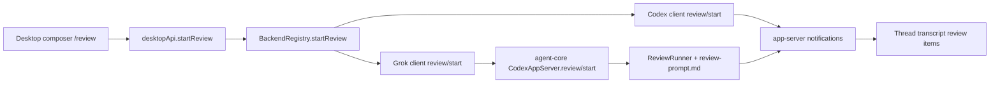

# feat: /review command parity for Codex and Grok

## Context

Codex Desktop can display review sessions, but PwrAgnt currently lacks an end-to-end `/review` path. The desktop composer only submits normal turns, the backend registry has no `startReview` abstraction, and the Grok-compatible app server implements only a minimal `review/start` runner with a generic prompt.

The target behavior is Codex-compatible:

- `/review` in the desktop composer starts a review, not a normal turn.
- Codex-backed threads call the Codex app-server `review/start` method.
- Grok-backed threads support the same app-server method through `packages/agent-core`.
- Grok review uses a dedicated markdown review prompt similar to Codex's built-in `review_prompt.md`.
- The Grok prompt specifies the same review output schema as Codex: `findings`, `overall_correctness`, `overall_explanation`, and `overall_confidence_score`, with each finding carrying `title`, `body`, `confidence_score`, optional `priority`, and `code_location.absolute_file_path` plus `line_range.start/end`.

Related local references:

- `docs/plans/2026-04-16-002-feat-app-server-protocol-compatibility-plan.md`
- `docs/plans/2026-04-16-003-feat-grok-tool-usage-code-search-plan.md`
- `docs/plans/2026-04-16-004-feat-grok-thread-storage-plan.md`
- Codex reference checkout: `/Users/huntharo/github/codex/codex-rs/core/review_prompt.md`
- Codex protocol reference: `/Users/huntharo/github/codex/codex-rs/app-server-protocol/src/protocol/v2.rs`
- Codex review output reference: `/Users/huntharo/github/codex/codex-rs/protocol/src/protocol.rs`

## Requirements

1. `/review` must be parsed as a command only when it is the first token in the composer text, with optional arguments after it.
2. `/review` must start a review through the active backend, not by sending the full review prompt as a visible user message.
3. Codex-backed threads must call app-server `review/start` with a Codex-compatible `ReviewTarget` and default inline delivery.
4. Grok-backed threads must accept the same `review/start` request shape used by Codex App Server.
5. Grok review must use a committed markdown prompt file that is similar in intent and rubric to Codex's prompt and explicitly includes the Codex review JSON schema.
6. Grok review must support `uncommitted_changes`, `base_branch`, `commit`, and `custom` targets at the protocol boundary, even if the desktop command initially exposes only the common cases.
7. Grok review must parse model output into structured review data when valid JSON is returned and retain a readable fallback when parsing fails.
8. Desktop transcript state must reflect entered/exited review mode and review results without showing the hidden rubric as the user's prompt.
9. Tests must cover Codex routing, Grok routing, command parsing, target mapping, schema prompt inclusion, and review notification lifecycle.

## Non-Goals

- Publishing GitHub PR review comments.
- Detached review threads beyond accepting the protocol field for future compatibility.
- Auto-applying review findings.
- Building a general slash-command framework beyond the `/review` path needed here.
- Replacing the existing normal `turn/start` flow.

## Design

The desktop should treat `/review` as a command wrapper around the app-server review API. The visible text in the transcript should be the user-facing target description, such as "Review changes against main", while the full markdown rubric stays inside the backend/model request.

Grok cannot rely on Codex core's Rust `base_instructions` mechanism, so `ReviewRunner` should compose the markdown review prompt and the target-specific review request into a single provider input with clear delimiters. The markdown file is still the source of truth for the review rubric and output schema.

## Implementation Units

### 1. Shared review contract

Files:

- `packages/shared/src/contracts/app-server.ts`
- `apps/desktop/src/shared/ipc.ts`
- `packages/shared/src/contracts/__tests__/app-server-review.test.ts`
- `apps/desktop/src/shared/__tests__/review-command.test.ts`

Work:

- Add shared `ReviewTarget`, `ReviewDelivery`, `StartReviewRequest`, and `StartReviewResponse` types that match Codex App Server naming and payload shape where practical.
- Add an IPC channel for starting review from the renderer.
- Add a small parser for composer text that recognizes `/review`, `/review <branch>`, and `/review --custom <instructions>` without changing normal message submission.
- Map bare `/review` to `uncommitted_changes`.
- Map `/review main` to `base_branch` with branch `main`.
- Preserve custom instructions only for explicit custom syntax.

Acceptance checks:

- Normal messages beginning with similar text such as `/reviewer` still submit as normal turns.
- Empty `/review` becomes an uncommitted-changes review target.
- Branch and custom forms produce stable structured targets.

### 2. Desktop routing for Codex and Grok backends

Files:

- `apps/desktop/src/renderer/src/features/composer/Composer.tsx`
- `apps/desktop/src/renderer/src/lib/desktop-api.ts`
- `apps/desktop/src/preload/index.ts`
- `apps/desktop/src/main/ipc/agent-ipc.ts`
- `apps/desktop/src/main/app-server/backend-registry.ts`
- `apps/desktop/src/main/codex-app-server/client.ts`
- `apps/desktop/src/main/grok-app-server/client.ts`
- `apps/desktop/src/renderer/src/features/composer/__tests__/composer.test.tsx`
- `apps/desktop/src/main/__tests__/agent-ipc.test.ts`
- `apps/desktop/src/main/__tests__/backend-registry.test.ts`
- `apps/desktop/src/main/__tests__/codex-client.test.ts`
- `apps/desktop/src/main/__tests__/grok-app-server-client.test.ts`

Work:

- Add `desktopApi.startReview(...)` from renderer to main.
- Extend `BackendClient` with `startReview`.
- Route Codex threads to `review/start` on the Codex app-server client.
- Route Grok threads to `review/start` on the Grok app-server client.
- For launchpad/directory flows, materialize the thread the same way normal turns do, then start review against that thread and selected workspace.
- Keep active-run bookkeeping consistent with `startTurn`, including cancellation and notification handling.

Acceptance checks:

- `/review` does not call `turn/start`.
- Codex client sends `review/start` with `threadId`, `target`, and inline delivery.
- Grok client sends the same request shape to agent-core.
- The composer clears or preserves draft text consistently with normal successful submissions.

### 3. Grok review prompt asset and schema source

Files:

- `packages/agent-core/src/app-server/review-prompt.md`
- `packages/agent-core/src/app-server/review-prompt.ts`
- `packages/agent-core/src/__tests__/review-start.test.ts`

Work:

- Add `review-prompt.md` as the committed Grok review rubric.
- Base its structure on Codex's review guidelines: findings only for actionable bugs, tight line ranges, priority guidance, confidence scoring, and no markdown fences around JSON.
- Include the Codex-compatible JSON schema in the markdown prompt, with the same top-level and nested field names.
- Add a loader/export helper so `ReviewRunner` can read the prompt reliably in source and packaged builds.
- Add a test that fails if the prompt no longer mentions the required schema fields.

Acceptance checks:

- `review-prompt.md` exists and is used by the runner.
- The prompt contains every required Codex review schema field.
- Tests do not depend on the exact wording of the whole prompt, only on required compatibility anchors.

### 4. Grok `review/start` protocol parity

Files:

- `packages/agent-core/src/app-server/codex-app-server.ts`
- `packages/agent-core/src/app-server/review-runner.ts`
- `packages/agent-core/src/app-server/protocol.ts`
- `packages/agent-core/src/__tests__/review-start.test.ts`
- `packages/agent-core/src/__tests__/openclaw-compat-sequences.test.ts`

Work:

- Replace the current generic review prompt builder with target-specific prompt composition.
- Add target mapping equivalent to Codex:
  - `uncommitted_changes`: review staged, unstaged, and untracked changes.
  - `base_branch`: compute merge base when a workspace is available and ask the model to inspect `git diff <merge-base>`.
  - `commit`: review the named commit.
  - `custom`: review using caller-supplied instructions.
- Emit `enteredReviewMode` before review work starts when compatible with existing transcript persistence.
- Emit `exitedReviewMode` with the structured review result or fallback explanation when work finishes.
- Parse final provider text as Codex review JSON. Validate required top-level fields and finding locations before storing structured review data.
- Preserve existing interactive provider request handling during review.
- Keep `review/start` failure behavior aligned with `turn/start`: notify failure and avoid leaving active runs stuck.

Acceptance checks:

- Existing `review-start` tests still pass after being updated to expect Codex-compatible prompt content.
- A mocked valid JSON provider response produces structured review output.
- A mocked invalid JSON provider response still yields a readable completion item and does not crash the run.
- Base branch target includes merge-base context when available and falls back to a clear branch diff request when unavailable.

### 5. Transcript normalization and rendering

Files:

- `apps/desktop/src/main/codex-app-server/client.ts`
- `apps/desktop/src/main/grok-app-server/client.ts`
- Existing renderer transcript item components under `apps/desktop/src/renderer/src/features/thread-detail/`
- `apps/desktop/src/renderer/src/features/thread-detail/__tests__/transcript-list.test.tsx`
- `apps/desktop/src/renderer/src/features/thread-detail/__tests__/thread-view.test.tsx`

Work:

- Normalize Codex and Grok `enteredReviewMode` / `exitedReviewMode` items into the same local transcript shape.
- Render review output as review output, not as an assistant chat message containing raw JSON.
- Show fallback explanation text when structured findings are unavailable.
- Ensure review request approval notifications still surface in the same UI path as existing server requests.

Acceptance checks:

- A Codex review session and a Grok review session produce visually consistent transcript items.
- Raw review prompt text is never shown as the composer-submitted user message.
- Raw JSON is not the primary rendered review UI when structured fields are present.

### 6. Verification and regression coverage

Files:

- `packages/agent-core/src/__tests__/review-start.test.ts`
- `apps/desktop/src/shared/__tests__/review-command.test.ts`
- `apps/desktop/src/main/__tests__/agent-ipc.test.ts`
- `apps/desktop/src/main/__tests__/backend-registry.test.ts`
- `apps/desktop/src/main/__tests__/codex-client.test.ts`
- `apps/desktop/src/main/__tests__/grok-app-server-client.test.ts`
- `apps/desktop/src/renderer/src/features/composer/__tests__/composer.test.tsx`
- `apps/desktop/src/renderer/src/features/thread-detail/__tests__/transcript-list.test.tsx`
- Optional replay-backed E2E fixture/spec if the command affects captured app-server flows

Work:

- Add unit tests for command parsing.
- Add main-process tests for backend routing.
- Add client tests for Codex and Grok `review/start` payloads.
- Add agent-core tests for prompt composition, JSON parsing, notification order, and failure cleanup.
- Run the package-level test suites that cover desktop IPC/backend clients and `packages/agent-core`.

Acceptance checks:

- Review command tests prove `/review` uses `review/start`.
- Existing normal turn tests prove non-review composer submissions still use `turn/start`.
- Agent-core tests prove Grok review emits Codex-compatible lifecycle notifications.

## Open Decisions

1. Slash syntax for custom review instructions: default to `/review --custom <instructions>` to avoid mistaking branch names for prose.
2. Detached delivery: accept the field for protocol compatibility, but implement inline behavior first unless a current Codex Desktop UI path needs detached reviews immediately.
3. Structured rendering depth: initial UI can show a compact review summary plus findings; richer grouping by priority can be a follow-up if existing transcript components do not already support it.

## Risks

- Codex protocol names may drift. Mitigation: keep mappings close to the local Codex checkout references and assert payload shapes in client tests.
- Grok provider may return non-JSON despite the prompt. Mitigation: strict parse when possible, readable fallback when not, and tests for both paths.
- Base-branch reviews need workspace context. Mitigation: use the thread's linked directory when present and make the no-workspace fallback explicit.
- Showing the prompt as transcript text would leak implementation detail and confuse users. Mitigation: separate display text from provider prompt throughout the review path.

## Done When

- `/review` in Desktop starts review sessions for Codex and Grok-backed threads.
- Grok review uses `packages/agent-core/src/app-server/review-prompt.md`.
- The Grok prompt includes the Codex-compatible review output schema.
- Codex and Grok clients both call `review/start`.
- Review lifecycle notifications and transcript rendering are consistent across both backends.
- Focused tests cover parsing, routing, prompt/schema inclusion, JSON review parsing, and failure cleanup.
